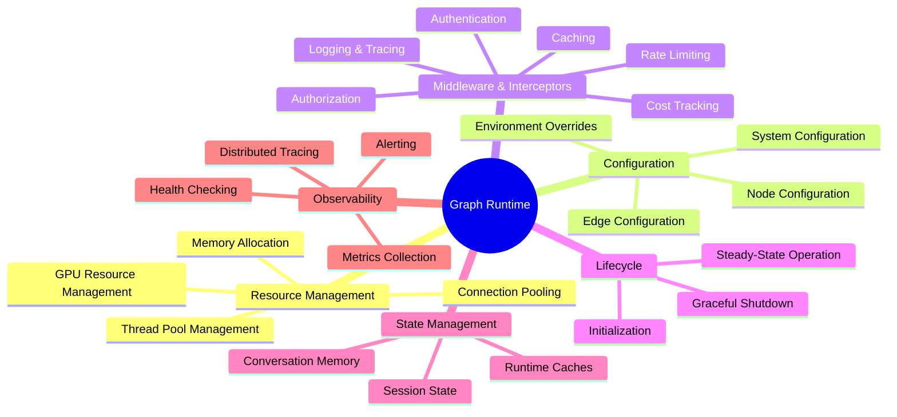
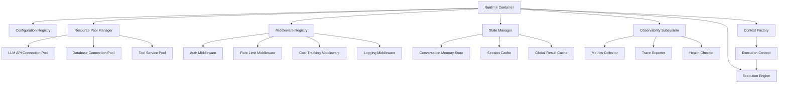
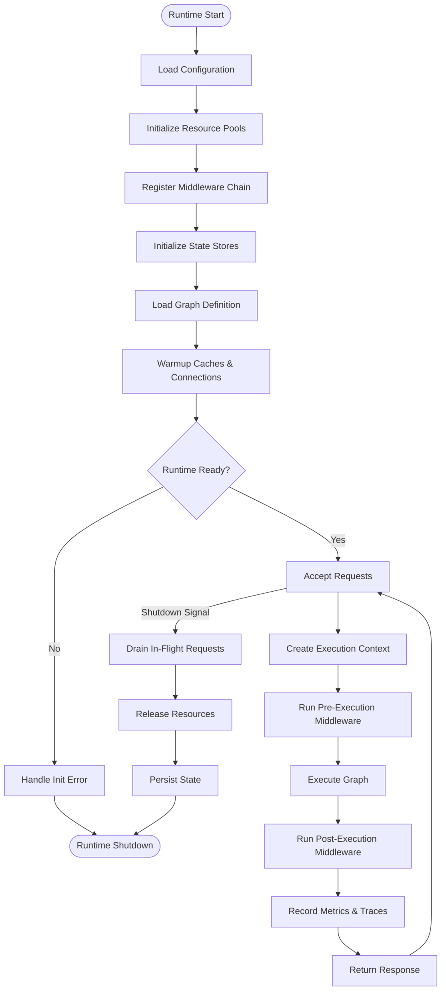
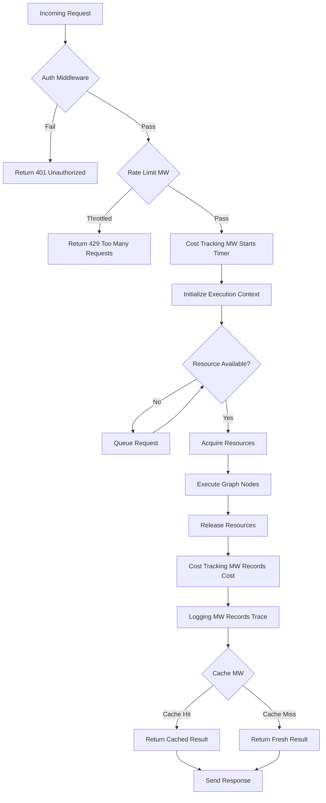
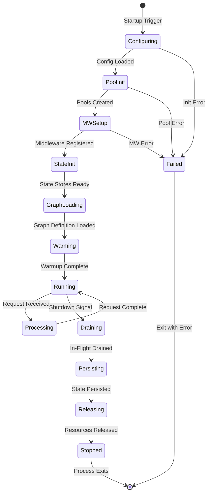
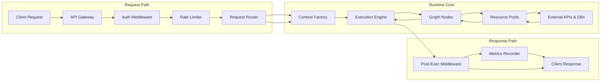
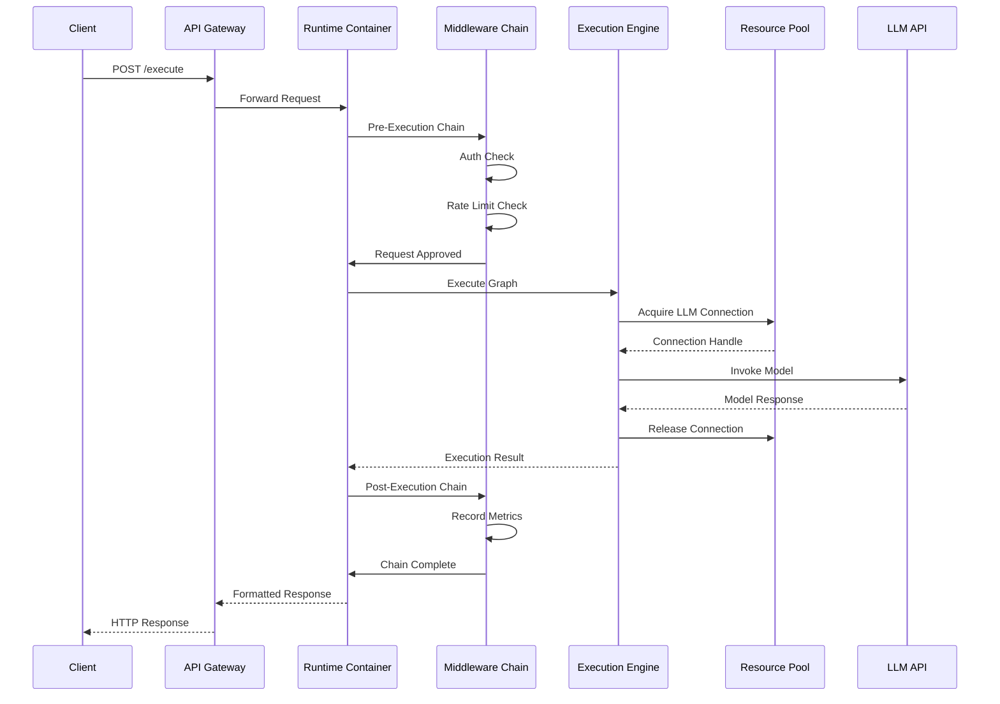

# Graph Runtime

## 📌 Overview

The graph runtime is the execution environment that hosts, manages, and operates graph-based AI systems during their active lifecycle. In graph engineering — where prompts, memory stores, tools, and agents are structured as interconnected graph topologies — the runtime provides the foundational layer that makes execution possible. It is the sandbox in which graph nodes are instantiated, edges are evaluated, data flows between components, and the overall system state is maintained. Without a well-designed runtime, even the most carefully architected graph remains a static blueprint unable to process real user requests.

The runtime encompasses everything from low-level resource management (memory allocation, thread pools, connection management) to high-level concerns (context propagation, middleware pipeline, lifecycle hooks). It acts as the operating system for your graph system, providing the abstractions and services that individual nodes need to function correctly. A robust runtime abstracts away the complexity of concurrent execution, error recovery, and resource lifecycle management, allowing graph designers to focus on the logic and flow of their AI systems rather than infrastructure concerns.

Modern graph runtimes for AI systems must also contend with the unique characteristics of LLM-based nodes: high latency, variable response times, token limit constraints, and significant per-invocation costs. These characteristics place special demands on the runtime's resource management and scheduling capabilities. A runtime designed for traditional computation graphs would struggle with the unpredictability and cost profile of LLM-based graph systems, making runtime design a critical architectural concern in graph engineering.

## 🎯 Learning Objectives

After studying this document, you will understand the fundamental components of a graph runtime and how they work together to support graph execution. You will be able to identify the runtime requirements specific to graph-engineered AI systems, including memory management for large context windows, connection pooling for external API calls, and state management for multi-turn conversations. You will learn how to design runtime environments that balance performance, resource efficiency, and operational reliability.

You will gain practical knowledge of implementing runtime hooks that allow you to inject custom behavior at key lifecycle points — before and after node execution, during data propagation, and at graph initialization and shutdown. You will understand the middleware and interceptor patterns that enable cross-cutting concerns such as logging, authentication, rate limiting, and cost tracking to be applied uniformly across all nodes in a graph without modifying individual node implementations.

Additionally, you will learn how to design runtime configurations that can be tuned for different deployment scenarios — from development environments that prioritize debugging ease to production environments that prioritize throughput and cost efficiency. You will understand how runtime resource allocation decisions, such as concurrency limits and timeout configurations, impact both system performance and operational costs. Finally, you will be equipped to evaluate and select runtime platforms for your graph-engineered AI systems based on your specific requirements.

## 🧠 Definition

A graph runtime is the managed execution environment that provides the infrastructure, services, and abstractions necessary to instantiate, configure, execute, and monitor graph-based AI systems. It encompasses the complete set of runtime capabilities including process management, memory allocation, thread or coroutine scheduling, connection lifecycle management, configuration resolution, dependency injection, middleware pipeline processing, and observability instrumentation. The runtime is responsible for translating a static graph definition (the graph's topology and node configurations) into a living, functioning system that can process requests.

More specifically, the graph runtime can be defined as the layer that sits between the graph definition and the underlying hardware and operating system. It provides a graph-aware execution model that understands nodes, edges, contexts, and state — as opposed to a generic runtime like the JVM or Node.js runtime, which provides general-purpose process management without graph-specific semantics. The graph runtime knows that nodes have dependencies, that edges carry conditions, and that execution follows the graph's topological structure.

The runtime also maintains the system's global state, including shared memory stores, connection pools, configuration caches, and runtime metrics. This global state persists across multiple graph executions, enabling features like conversation memory, result caching, and adaptive behavior based on historical execution patterns. The runtime's state management capabilities are what transform a stateless graph topology into a stateful, context-aware AI system that can maintain coherent multi-turn interactions with users.

## ❓ Why It Matters

The runtime matters because it determines the operational characteristics of your entire graph system. A poorly designed runtime introduces latency, wastes resources, and creates reliability issues that no amount of graph topology optimization can fix. For example, a runtime that creates a new database connection for every memory node activation will quickly exhaust connection limits and degrade performance, even if the graph's topology is perfectly optimized for minimal memory access. Runtime design decisions have system-wide impacts that propagate through every graph execution.

Runtime quality directly affects the developer experience of building and maintaining graph systems. A runtime with excellent debugging support, clear error reporting, and intuitive configuration management dramatically reduces development time and improves system maintainability. Conversely, a runtime that obscures errors, provides minimal observability, and requires complex configuration forces developers to spend excessive time on infrastructure concerns rather than improving their AI system's intelligence and capabilities.

Furthermore, the runtime is the integration point where your graph system connects to external resources — LLM APIs, vector databases, tool services, and monitoring systems. The runtime's ability to manage these connections efficiently, handle failures gracefully, and provide consistent abstractions across different resource types determines how resilient and maintainable your system will be in production. As graph-engineered AI systems grow in complexity, the runtime becomes the single most critical layer for ensuring system reliability, performance, and cost-effectiveness.

## 🏛️ Core Concepts

Resource management is the foundational concept of any graph runtime. It encompasses the allocation, pooling, and lifecycle management of all resources that graph nodes require during execution. This includes compute resources (threads, processes, GPU allocations), network resources (HTTP connections, WebSocket sessions), storage resources (database connections, file handles), and memory resources (in-memory caches, context buffers). Effective resource management ensures that resources are available when needed, properly cleaned up when no longer needed, and shared efficiently across concurrent executions to prevent waste.

Runtime configuration is the mechanism by which graph behavior is controlled at deployment time rather than design time. Configuration includes node-level parameters (such as LLM model selection, temperature settings, and timeout values), edge-level parameters (such as condition thresholds and retry policies), and system-level parameters (such as concurrency limits, logging levels, and feature flags). A well-designed configuration system supports environment-specific overrides, enabling the same graph definition to behave differently in development, staging, and production environments without code changes.

The middleware pipeline is a chain of processing stages that wraps every node execution, providing a mechanism for implementing cross-cutting concerns. Middleware executes before and after each node activation, allowing it to inspect, modify, or reject the execution. Common middleware includes authentication (verifying the caller's identity), authorization (checking permissions), rate limiting (preventing abuse), cost tracking (monitoring LLM API usage), logging (recording execution details), and caching (returning cached results for repeated inputs). The middleware pipeline is one of the most powerful runtime concepts because it enables system-wide behavior changes without modifying any node code.

Runtime lifecycle management governs the phases that a graph system passes through from startup to shutdown. This includes initialization (loading configurations, establishing connections, warming caches), steady-state operation (processing requests, managing resources, collecting metrics), and shutdown (draining in-flight requests, releasing resources, persisting state). Proper lifecycle management ensures clean startup without race conditions, stable operation without resource leaks, and graceful shutdown without data loss. Each phase has specific requirements and potential failure modes that the runtime must handle.

## 🧩 Key Components

The runtime container is the top-level component that owns and manages all other runtime components. It initializes the system, loads the graph definition, creates the execution engine, and provides the dependency injection context that nodes use to access runtime services. The container is responsible for the overall lifecycle of the runtime, managing startup, steady-state operation, and shutdown sequences. It also provides the configuration registry that nodes and middleware use to access their settings.

The resource pool manager maintains pools of reusable resources that nodes can acquire and release during execution. Connection pools for LLM APIs, vector databases, and external tools are the most common resource pools in graph runtimes. The pool manager handles pool sizing, connection health checking, idle timeout management, and pool exhaustion policies. Proper pool management prevents resource starvation under load and reduces the overhead of repeatedly creating and destroying expensive resources like network connections.

The middleware registry maintains the ordered list of middleware components that wrap node executions. Each middleware component implements a standard interface with pre-execution and post-execution hooks. The registry supports priority-based ordering, conditional activation (enabling middleware only for specific node types), and dynamic registration (adding or removing middleware at runtime). The middleware registry is responsible for composing the middleware chain and ensuring that each middleware's error handling integrates properly with the overall error propagation mechanism.

The context factory is responsible for creating and configuring execution contexts for each graph execution. It injects shared runtime services into the context, initializes the trace buffer, sets up the result map, and applies any context-level configuration overrides. The context factory ensures that every execution starts with a properly initialized context that provides consistent access to runtime services regardless of which node is executing. It also supports context customization through factory delegates that can modify the context based on request characteristics.

The observability subsystem collects, aggregates, and exports runtime metrics and execution traces. It includes a metrics collector that records counters, histograms, and gauges for key runtime indicators such as active execution count, node execution latency, resource pool utilization, and error rates. The trace exporter formats execution traces into standard formats (such as OpenTelemetry) and sends them to observability backends. The observability subsystem is essential for production operations, enabling real-time monitoring, alerting, and post-incident analysis.

The state manager handles persistent and ephemeral state that survives across multiple graph executions. This includes conversation memory (the history of interactions with a specific user), session state (temporary data that persists within a user session), and runtime state (system-wide data such as caches and configuration caches). The state manager provides a unified interface for reading and writing state, handles state serialization and deserialization, and implements eviction policies for memory-bounded state stores.

## 🧭 Mental Model

Think of the graph runtime as a sophisticated theater production team managing a play. The director (runtime container) oversees everything — hiring actors, setting the stage, and calling cues. The prop department (resource pool manager) ensures all props are available when needed and stored properly between scenes. The stage manager (middleware registry) coordinates every scene transition, checking that actors are in position and costumes are correct before the curtain rises. The script supervisor (context factory) ensures every actor has the right script pages and understands the current scene's context.

The lighting and sound technicians (observability subsystem) monitor every aspect of the performance, adjusting in real-time and recording everything for review. The wardrobe department (state manager) maintains costumes and quick-change setups so actors can transition between characters smoothly. Just as a theater production team creates the conditions for actors to perform their best, the graph runtime creates the conditions for graph nodes to execute reliably, efficiently, and with full visibility into their operation.

## 🗺️ Mind Map

## 🏗️ Architecture Diagram

## 🔄 Workflow

## ⚙️ Internal Working

The runtime's internal operation begins with the initialization phase. When the runtime starts, the container reads the configuration files and environment variables, building a hierarchical configuration registry that resolves settings based on the current environment. It then initializes the resource pool manager, creating connection pools sized according to the configuration's concurrency settings. Each pool undergoes health checking to verify that connections are valid before the runtime begins accepting requests. The middleware registry is populated with middleware components specified in the configuration, ordered by their declared priorities.

Once initialization is complete, the runtime enters its request-handling loop. When a request arrives, the context factory creates a new execution context, injecting references to the resource pools, state manager, and configuration registry. The middleware registry wraps the execution engine's process method with its middleware chain, and each middleware component's pre-execution hook runs in sequence. If any middleware rejects the request — for example, the rate limiter detecting too many requests — the chain short-circuits and returns an error response without executing the graph.

During graph execution, nodes access runtime services through the execution context. When a node needs to call an LLM, it requests a connection from the LLM API pool, uses it to make the call, and returns the connection to the pool. When a node needs to access conversation memory, it calls the state manager's read method, which retrieves the appropriate records from the backing store. The observability subsystem records timing and resource usage for each operation, building an execution trace that captures the complete runtime behavior.

The shutdown phase begins when the runtime receives a termination signal. It stops accepting new requests, waits for in-flight executions to complete (with a configurable timeout), and then releases all pooled resources. The state manager persists any dirty state to durable storage, ensuring that conversation histories and session data survive the restart. The observability subsystem flushes any buffered metrics and traces. Finally, the container releases all allocated memory and exits, leaving the system in a clean state ready for the next startup.

## 🔀 Execution Flow

## 📊 Lifecycle

## 📡 Data Flow

## 🤝 Interaction Flow

## 🌍 Real-World Analogy

Consider a large international airport as a model for the graph runtime. The airport itself is the runtime container — it provides the physical infrastructure, the management systems, and the operational framework. The boarding gates are nodes, and the walkways and tram systems connecting them are edges. The airport's operations team manages resource pools: gate assignments, baggage handling capacity, and runway slots. Just as the runtime's resource pool manager ensures connections are available for nodes, the airport's operations team ensures gates are available for flights.

The airport's security checkpoints function as middleware — every passenger (request) must pass through security (authentication and authorization) before accessing the gates (nodes). The security process is the same regardless of which gate the passenger is heading to, just as middleware applies uniformly across all graph nodes. The airport's flight information display system serves as the observability subsystem, providing real-time visibility into every operation. The baggage handling system is the state manager, tracking and routing items (data) across multiple flights (executions) while maintaining their association with the correct passenger (context).

## 💡 Practical Example

Imagine building a customer support chatbot using a graph runtime. The runtime is configured with a pool of ten concurrent LLM API connections, a Redis-backed conversation memory store, and a middleware chain consisting of authentication, rate limiting (100 requests per minute per user), cost tracking, and structured logging. When a customer sends a message, the runtime creates an execution context, injects the conversation history from the memory store, and passes the request through the middleware chain.

The authentication middleware verifies the customer's session token. The rate limiter checks the customer's request count against their quota. The cost tracking middleware starts a timer and records the initial token budget. The execution engine then activates the graph's classification node, which uses a connection from the LLM pool to classify the customer's intent. The connection is returned to the pool immediately after use, making it available for other concurrent executions.

As the graph executes through its tool invocation and response generation nodes, the middleware chain records every operation. If the cost tracking middleware detects that the current execution has consumed more than 80% of the token budget, it can inject a warning into the execution context, prompting the response generation node to produce a more concise answer. After execution completes, the logging middleware exports the full trace to the observability backend, and the state manager updates the conversation memory with the new exchange.

## 🧪 Use Cases

**Multi-tenant SaaS AI platforms** require a runtime that provides strong isolation between tenants while efficiently sharing resources. Each tenant's graph executions must have isolated state, separate rate limits, and independent cost tracking, but they should share connection pools and LLM API quotas at the platform level to maximize efficiency. The runtime's configuration system supports tenant-specific overrides, and the middleware chain applies different rate limits and cost budgets based on the tenant identity extracted from the authentication middleware.

**Development and testing environments** benefit from a runtime that prioritizes debugging over performance. A development runtime might include additional middleware for verbose logging, request/response inspection, and execution visualization. It might disable connection pooling to make debugging easier, use mock LLM responses to reduce costs, and provide interactive debugging tools that allow developers to step through graph execution node by node. The same graph definition runs on both development and production runtimes, with behavior differences driven entirely by configuration.

**Edge-deployed AI systems** require lightweight runtimes with minimal resource footprints. These runtimes might use SQLite instead of PostgreSQL for state management, implement in-process connection pooling instead of external connection managers, and omit heavy observability instrumentation in favor of lightweight logging. The runtime must be designed for efficient cold start and low memory consumption while still providing the core execution, middleware, and state management capabilities that the graph requires.

**High-throughput production systems** demand runtimes with sophisticated resource management and autoscaling capabilities. These runtimes implement dynamic pool sizing that adjusts connection counts based on load patterns, intelligent request queuing that prioritizes high-value requests, and circuit breakers that prevent cascading failures when downstream services degrade. The runtime's observability subsystem feeds into auto-scaling decisions, ensuring that the system maintains performance targets under varying load conditions.

## ⚖️ Comparison

| Aspect | Lightweight Runtime | Standard Runtime | Enterprise Runtime |
|--------|-------------------|-----------------|-------------------|
| Resource Footprint | Minimal (50-100MB) | Moderate (500MB-2GB) | Large (2GB+) |
| Middleware Support | Basic (logging only) | Full (auth, rate limit, cost) | Advanced (multi-tenant, RBAC) |
| State Management | In-memory only | Hybrid (memory + DB) | Distributed (multi-region) |
| Connection Pooling | Single pool, fixed size | Multiple pools, configurable | Dynamic pools, auto-scaling |
| Observability | Basic logging | Structured logs + metrics | Full distributed tracing + APM |
| Multi-tenancy | Not supported | Basic isolation | Full isolation + per-tenant config |
| Best For | Edge deployment, prototyping | Most production applications | Large-scale SaaS platforms |

## ✅ Best Practices

Design your runtime configuration system with a clear hierarchy: defaults defined in code, environment-specific overrides in configuration files, and runtime overrides through environment variables or feature flags. This three-tier approach ensures that sensible defaults are always available, that different environments can have appropriate settings without code changes, and that urgent configuration changes can be made without redeployment. Document every configuration parameter with its type, default value, valid range, and the effect of changing it.

Implement middleware as composable, independently testable units with well-defined interfaces. Each middleware component should handle exactly one cross-cutting concern and should not depend on other middleware components. This separation allows you to add, remove, or reorder middleware without side effects. Test each middleware component in isolation using mock execution contexts, and test the middleware chain as a whole to verify that interactions between components work correctly.

Size your resource pools based on empirical measurement rather than theoretical calculation. Start with conservative pool sizes, deploy to a staging environment that simulates production load, and monitor pool utilization metrics. Increase pool sizes only when you observe pool exhaustion under load. Over-provisioned pools waste resources (memory for connection objects, network bandwidth for keepalive traffic), while under-provisioned pools cause request queuing and latency spikes.

Implement comprehensive health checking that covers both the runtime itself and all external dependencies. The health check endpoint should verify that resource pools are operational, state stores are accessible, and critical external services (LLM APIs, databases) are responsive. Use graduated health statuses — healthy, degraded, unhealthy — so that load balancers can make informed routing decisions. A degraded runtime might still serve requests but with reduced functionality, while an unhealthy runtime should be removed from the load balancer rotation.

## ❌ Common Mistakes

The most prevalent runtime mistake is creating new resources for every execution instead of using pools. Each LLM API connection establishment involves TCP handshakes, TLS negotiation, and authentication — operations that add hundreds of milliseconds of latency per call. In a system that makes multiple LLM calls per graph execution, failing to pool connections can multiply end-to-end latency by an order of magnitude. Always pool connections to external services, and configure pool sizes based on your concurrency requirements.

Another common mistake is implementing middleware that silently swallows errors instead of propagating them. When a middleware component catches an exception and returns a generic error response without logging the details, it becomes nearly impossible to diagnose the root cause of failures. Every middleware component should either handle an error completely (with full logging) or re-throw it for upstream handling. The middleware chain should have a final catch-all that ensures no error goes unrecorded.

A third frequent mistake is neglecting runtime state cleanup on shutdown. When a runtime shuts down without properly releasing database connections, flushing write buffers, or completing in-flight state operations, it can leave the system in an inconsistent state that causes problems on the next startup. Implement graceful shutdown handlers that follow a defined sequence: stop accepting new requests, wait for in-flight executions to complete (with a timeout), persist dirty state, release pooled resources, and then exit.

Finally, many developers make the mistake of treating the runtime as a purely technical concern without considering its operational implications. A runtime that requires manual configuration file editing, provides no health check endpoints, and produces unstructured log output creates significant operational burden. Design your runtime for operability from the start: include health check endpoints, structured logging, configuration validation at startup, and clear error messages that help operators diagnose and resolve issues quickly.

## 🚀 Advanced Topics

Hot-reloadable runtime configurations enable you to modify graph behavior, middleware settings, and resource pool sizes without restarting the runtime. This capability is essential for production systems that require high availability. The runtime watches a configuration source (such as a configuration service or a watched file system path) for changes, validates new configurations against a schema, and applies them to the running system. Careful design is required to ensure that configuration changes are applied atomically and do not leave the system in an inconsistent state.

Distributed runtimes span multiple machines, enabling horizontal scaling for high-throughput workloads. In a distributed runtime, graph executions can be partitioned across workers, with a coordinator managing execution state and data transfer between nodes running on different machines. This architecture introduces challenges in areas such as distributed state management, network partition handling, and consistent observability across workers. Technologies like gRPC for inter-worker communication, Raft consensus for state management, and OpenTelemetry for distributed tracing are essential building blocks.

Runtime profiling and adaptive optimization use machine learning to continuously tune runtime parameters based on observed execution patterns. The runtime monitors metrics such as node execution latency, cache hit rates, and resource pool utilization, and adjusts parameters — such as cache sizes, concurrency limits, and timeout values — to optimize for configured objectives like minimizing latency, maximizing throughput, or reducing cost. This self-tuning capability is particularly valuable in environments where workload patterns change frequently and manual tuning cannot keep pace.

Serverless graph runtimes execute graph systems on demand in serverless computing environments such as AWS Lambda or Cloudflare Workers. These runtimes face unique challenges including cold start latency (the time to initialize the runtime before the first execution), execution time limits (serverless platforms typically impose maximum execution durations), and state management limitations (serverless functions are stateless by default). Designing a serverless-aware runtime requires techniques such as provisioned concurrency for cold start mitigation, checkpoint-based state management for long-running executions, and fan-out patterns for parallel node execution across multiple function invocations.