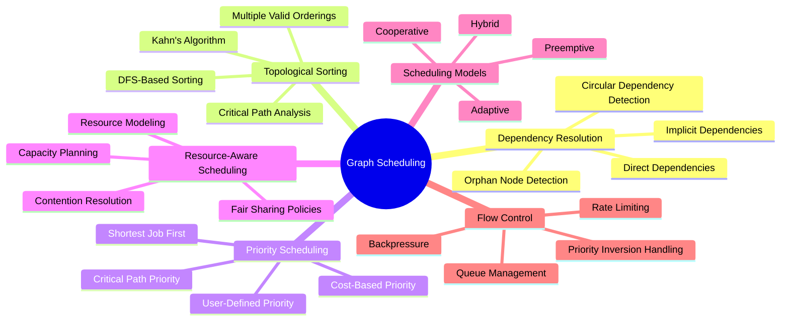
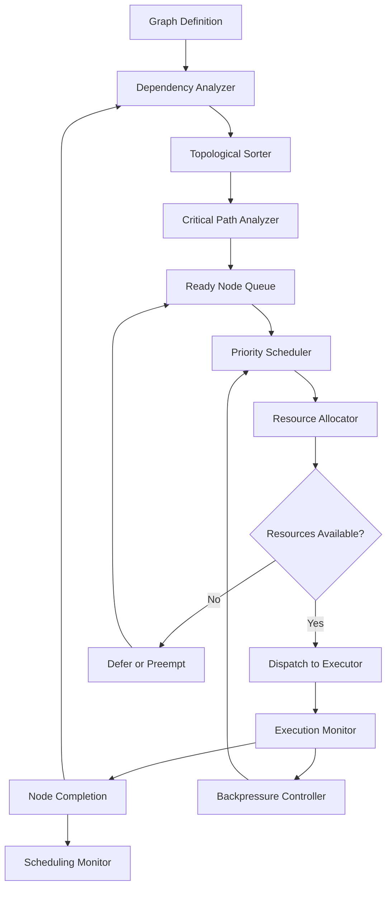
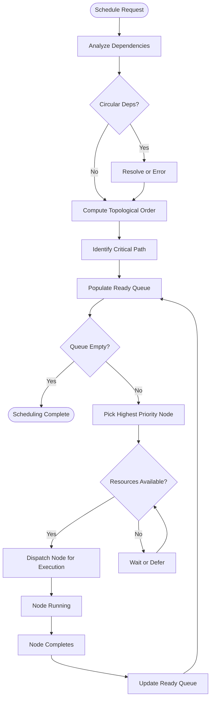
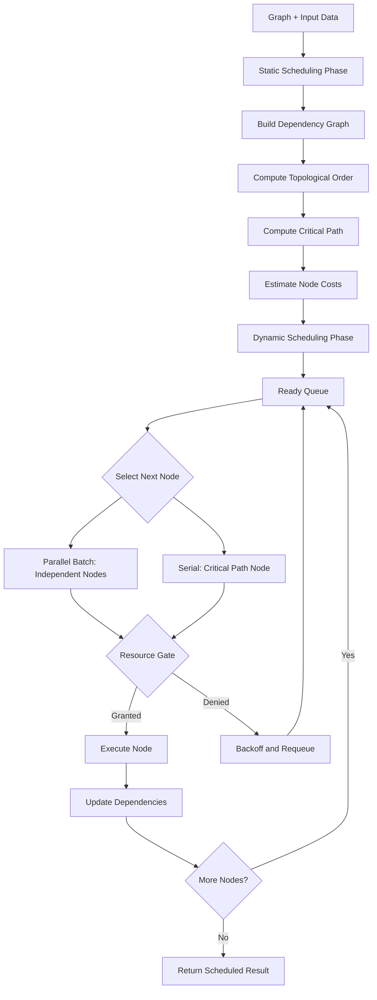
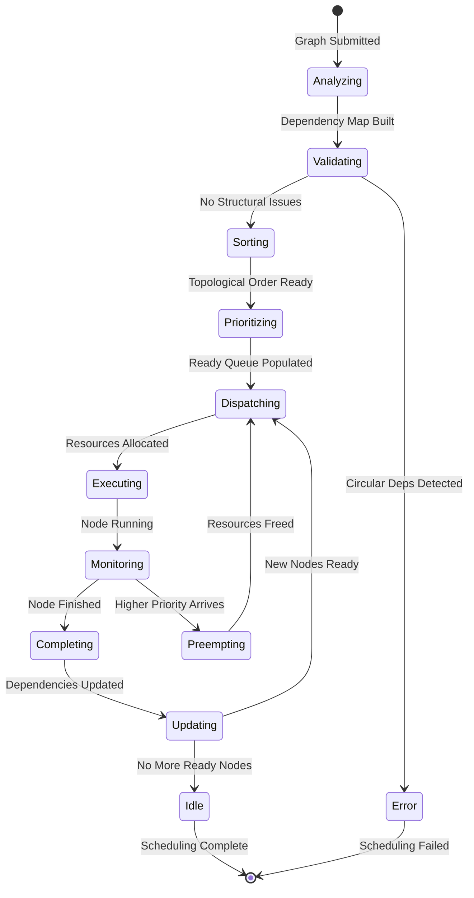
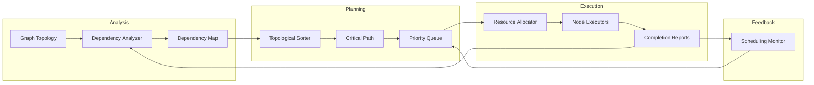
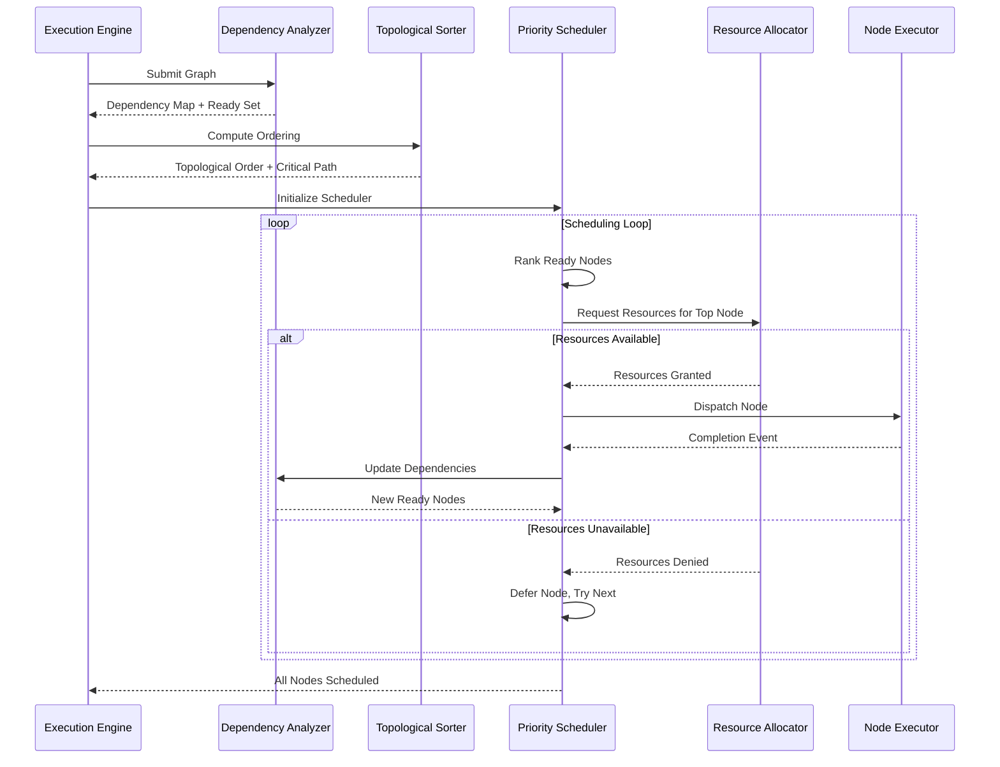

# Graph Scheduling

## 📌 Overview

Graph scheduling is the discipline of determining the optimal order, timing, and resource allocation for executing nodes within a graph-based AI system. In graph engineering — where prompts, memory operations, tool calls, and agent decisions form interconnected graph topologies — scheduling decides which nodes run when, which run in parallel, and how limited resources are distributed among competing execution demands. While the execution engine is responsible for actually running nodes, the scheduler is the strategic brain that makes the decisions about what to run and when.

Scheduling is distinct from execution in the same way that a project manager's role differs from a construction worker's. The project manager (scheduler) analyzes dependencies, allocates resources, sets priorities, and creates a plan. The construction workers (execution engine) follow that plan to complete the work. This separation of concerns is critical in complex graph systems where the number of possible execution orderings grows exponentially with graph size, making manual ordering impractical and automated scheduling essential.

The importance of scheduling has grown dramatically as graph-engineered AI systems have become more complex. Early AI systems were simple pipelines with linear execution, requiring no scheduling beyond following the pipeline order. Modern systems, however, feature complex topologies with branching, merging, looping, and conditional paths. In these systems, scheduling decisions can mean the difference between a response that takes two seconds and one that takes ten seconds, between a system that costs one dollar per interaction and one that costs five dollars, and between a system that handles a hundred concurrent users and one that collapses under load.

## 🎯 Learning Objectives

After studying this document, you will understand the fundamental principles of graph scheduling and be able to implement schedulers that efficiently traverse complex graph topologies. You will learn how topological sorting algorithms determine valid execution orderings by respecting dependency constraints, and how to select among multiple valid orderings based on performance objectives. You will understand the difference between preemptive and cooperative scheduling models and when each is appropriate for graph-engineered AI systems.

You will gain practical knowledge of priority-based scheduling strategies that optimize for different objectives such as minimizing latency, maximizing throughput, or minimizing cost. You will learn how to implement resource-aware scheduling that considers the availability and cost of resources such as LLM API quotas, database connections, and compute capacity when making scheduling decisions. You will understand how to design schedulers that adapt to changing conditions during execution, reordering the remaining work when priorities shift or resources become available.

Furthermore, you will be able to design scheduling systems that handle the unique challenges of LLM-based graph nodes, including variable execution times, token budget constraints, and rate limits. You will learn to implement scheduling fairness policies that prevent starvation in multi-tenant environments, and backpressure mechanisms that prevent the system from being overwhelmed by faster upstream nodes. Finally, you will understand how to measure scheduling effectiveness using metrics such as makespan (total execution time), resource utilization, and scheduling overhead.

## 🧠 Definition

Graph scheduling is the process of determining the execution order and resource assignment for nodes in a graph structure, subject to dependency constraints, resource limitations, and optimization objectives. It involves analyzing the graph topology to understand dependencies between nodes, computing valid execution orderings that respect those dependencies, and selecting the ordering that best satisfies the system's performance goals. Scheduling operates at the intersection of graph structure analysis, resource management, and optimization theory.

In the context of graph engineering, scheduling specifically addresses the challenge of coordinating nodes that may have vastly different execution characteristics. An LLM prompt node might take five seconds and consume two thousand tokens, while a memory lookup node might take fifty milliseconds and consume no tokens. A tool invocation node might have a rate limit of ten calls per minute, while a conditional branch node executes in microseconds. The scheduler must account for these heterogeneous characteristics when constructing an execution plan that meets the system's objectives.

Scheduling can be performed statically (before execution begins, based on the graph topology and historical performance data) or dynamically (during execution, based on real-time conditions such as current load, resource availability, and intermediate results). Static scheduling produces a fixed execution plan that is predictable and analyzable but cannot adapt to changing conditions. Dynamic scheduling adjusts the plan in real-time, responding to unexpected delays, resource shortages, or priority changes, but introduces overhead and non-determinism. Most production systems use a hybrid approach, performing static scheduling for the overall structure and dynamic adjustments within that structure.

## ❓ Why It Matters

Scheduling matters because it is the primary lever for optimizing the performance and cost of graph-engineered AI systems. Consider a graph with two independent branches that each invoke an LLM. A naive scheduler might execute them sequentially, taking ten seconds total. A parallelism-aware scheduler executes them simultaneously, taking only five seconds. This two-times speedup requires no changes to the graph topology or node implementations — it is achieved purely through better scheduling. In systems where each LLM call costs money, scheduling also directly impacts operational costs.

Scheduling matters for system stability under load. When multiple graph executions compete for limited resources — such as LLM API rate limits or database connection pools — the scheduler's allocation decisions determine whether the system degrades gracefully or collapses catastrophically. A well-designed scheduler implements fairness policies that ensure all executions make progress, backpressure mechanisms that prevent overload, and priority escalation that ensures critical executions are not starved by less important ones.

Scheduling also matters for the predictability and debuggability of graph systems. Deterministic scheduling — where the same graph with the same inputs always produces the same execution order — makes behavior reproducible and bugs easier to diagnose. Non-deterministic scheduling, while potentially offering better average performance, can introduce subtle timing-dependent bugs that are extremely difficult to reproduce and fix. Understanding scheduling enables you to make informed trade-offs between performance optimization and behavioral predictability.

## 🏛️ Core Concepts

Dependency resolution is the foundational scheduling concept that determines which nodes can be executed based on the completion status of their predecessors. A node's dependencies are the set of nodes whose outputs it requires as inputs. A node becomes eligible for scheduling ("ready") only when all of its dependencies have completed successfully. Dependency resolution is the mechanism that translates the graph's static edge structure into a dynamic set of scheduling constraints, and it must handle both direct dependencies (explicit edges) and implicit dependencies (shared resource requirements).

Topological sorting is the algorithmic process of producing a linear ordering of graph nodes such that for every directed edge from node A to node B, node A appears before node B in the ordering. This linear ordering represents a valid execution sequence that respects all dependency constraints. A graph may have multiple valid topological orderings, and the scheduler's job includes selecting among them. Topological sorting algorithms such as Kahn's algorithm (based on in-degree counting) and depth-first search-based algorithms are standard tools in the scheduler's toolkit.

Priority scheduling assigns a priority value to each node or execution path, and the scheduler uses these priorities to select among nodes that are simultaneously ready for execution. Priority can be based on multiple factors: the node's position on the critical path (the longest dependency chain), the node's estimated execution time, the node's resource cost, or business-level priorities such as user tier or request type. Effective priority assignment requires understanding both the graph's structure and the system's optimization objectives.

Resource-aware scheduling extends basic dependency-aware scheduling by incorporating resource availability and constraints into the scheduling decision. Even if multiple nodes are ready and have high priority, the scheduler may defer some of them if the required resources are not available. Resource-aware scheduling requires a model of the system's resource capacity, current utilization, and reservation patterns. It must also handle resource contention between concurrent graph executions, implementing allocation policies that balance efficiency and fairness.

Preemptive versus cooperative scheduling defines how the scheduler interacts with node execution. In preemptive scheduling, the scheduler can interrupt a running node — for example, by canceling a long-running LLM call — to free resources for a higher-priority node. In cooperative scheduling, once a node begins execution, it runs to completion unless it voluntarily yields. Preemptive scheduling provides better responsiveness and fairness but requires nodes to support interruption, which is particularly challenging for LLM API calls that cannot be canceled once initiated. Cooperative scheduling is simpler to implement but can lead to priority inversion, where a low-priority node holds resources needed by a high-priority node.

## 🧩 Key Components

The dependency analyzer examines the graph topology and builds a dependency map that records, for each node, the set of nodes it depends on and the set of nodes that depend on it. This map is used throughout the scheduling process to determine node readiness and to compute topological orderings. The dependency analyzer also detects structural issues such as circular dependencies (which make the graph unschedulable without special handling) and orphan nodes (which have no path from any root node and will never execute).

The topological sorter implements algorithms for computing valid execution orderings. It produces one or more linear sequences of nodes that respect the graph's dependency constraints. The sorter may implement multiple strategies — such as critical-path-first (prioritizing nodes on the longest dependency chain) or breadth-first (activating all nodes at the same depth before proceeding deeper) — and select among them based on the current scheduling objectives. The topological sorter's output serves as the input to the priority scheduler.

The priority scheduler maintains a priority queue of ready nodes and selects the next node for execution based on priority values. It continuously monitors the set of ready nodes (updated as dependencies are satisfied) and re-ranks them when conditions change. The priority scheduler implements the priority assignment policy, which may consider factors such as estimated execution time, resource cost, critical path position, and user-assigned priorities. It is the most active component during graph execution, making scheduling decisions at each step.

The resource allocator tracks the availability of system resources and grants or denies resource requests from the priority scheduler. When the scheduler selects a node for execution, it requests the necessary resources from the allocator. If resources are available, the allocator reserves them and the node proceeds to execution. If resources are not available, the scheduler either defers the node (placing it back in the ready queue) or preempts a lower-priority running node to free resources. The resource allocator implements allocation policies such as fair sharing, priority-based reservation, and burst allowance.

The backpressure controller monitors the flow of data between nodes and applies backpressure when downstream nodes cannot keep up with upstream production rates. In graph systems with streaming execution, a fast LLM generation node might produce tokens faster than a downstream processing node can consume them. Without backpressure, this imbalance causes memory exhaustion as buffered data accumulates. The backpressure controller signals upstream nodes to slow down or pause, maintaining system stability at the cost of some throughput.

The scheduling monitor collects metrics on scheduling decisions and their outcomes, providing visibility into the scheduler's behavior. It tracks metrics such as scheduling latency (time from node readiness to execution start), wait time (time nodes spend in the ready queue), preemption frequency, resource utilization, and critical path adherence. These metrics are used for both real-time adaptive scheduling adjustments and post-hoc analysis to identify scheduling inefficiencies.

## 🧭 Mental Model

Think of graph scheduling like air traffic control at a busy airport. Each aircraft is a node, and the flight plan defines its dependencies (it must depart after passengers board, after fueling completes, after maintenance signs off). The air traffic controller (scheduler) looks at all aircraft waiting to take off (ready queue), considers their priorities (emergency flights first, then commercial, then private), checks resource availability (runway capacity, airspace slots), and issues takeoff clearances in the optimal order.

Just as the controller must account for different aircraft types requiring different runway lengths (resource requirements), the graph scheduler must account for different nodes requiring different resources. A large cargo plane (an expensive LLM call) might need to wait longer for its preferred runway (API connection), while a small Cessna (a quick memory lookup) can use any available slot. The controller also implements backpressure — holding aircraft at the gate when the destination airport is overloaded — just as the graph scheduler applies backpressure when downstream nodes are saturated.

## 🗺️ Mind Map

## 🏗️ Architecture Diagram

## 🔄 Workflow

## ⚙️ Internal Working

The scheduling process begins with dependency analysis. When a graph is submitted for execution, the dependency analyzer traverses the graph topology and constructs a dependency map. For each node, it records the set of predecessors (nodes whose outputs flow into it via edges) and successors (nodes that receive its output). It computes the in-degree for each node — the number of unresolved dependencies — which determines when the node becomes ready. The analyzer also performs structural validation, checking for circular dependencies that would make the graph unschedulable in its current form.

Next, the topological sorter produces one or more valid execution orderings. Using Kahn's algorithm, it starts with all zero in-degree nodes (nodes with no dependencies) and iteratively removes them from the graph while decrementing the in-degree of their successors. Nodes whose in-degree reaches zero are added to the ready set. The order in which zero in-degree nodes are processed determines which topological ordering is produced. The sorter may use a priority-based selection among zero in-degree nodes to influence the ordering toward the scheduling objective.

Once the initial ready set is populated, the priority scheduler takes over for dynamic scheduling. It maintains the ready set as a priority queue, ordered by the current priority assignment policy. At each scheduling step, it selects the highest-priority ready node and passes it to the resource allocator. The resource allocator checks whether the node's required resources are available. If they are, the node is dispatched for execution. If not, the node is deferred, and the scheduler attempts the next-highest-priority ready node. This process continues until the ready queue is empty or no resources are available.

As nodes complete execution, the completion handler updates the dependency map, decrementing in-degrees for successor nodes. Any successor whose in-degree reaches zero is added to the ready queue with a priority computed by the priority assignment policy. The scheduling monitor records each decision — which node was selected, which were deferred, and why — building a scheduling trace that provides complete visibility into the scheduler's behavior. The backpressure controller continuously monitors buffer sizes between streaming nodes and applies flow control signals when thresholds are exceeded.

## 🔀 Execution Flow

## 📊 Lifecycle

## 📡 Data Flow

## 🤝 Interaction Flow

## 🌍 Real-World Analogy

Consider a commercial kitchen during the dinner rush, which perfectly illustrates graph scheduling principles. Each dish on a ticket is a node, and the recipe defines dependencies — the sauce must be prepared before the protein is plated, and the protein must be cooked before plating. The executive chef (scheduler) looks at all pending tickets, identifies which components can be prepared simultaneously, and assigns them to the available stations (resources). A complex dish with many sequential steps is like a critical path — it determines the minimum time the overall order will take.

The chef prioritizes based on multiple factors: orders that have been waiting longest, VIP tables, dishes with long cooking times that should start early, and ingredients that are running low. This multi-factor priority assignment mirrors how graph schedulers combine critical path position, estimated execution time, and resource constraints. When a station (resource) is busy, the chef queues the next task for that station and moves on to assign other tasks to available stations, maximizing overall kitchen throughput rather than waiting for each station to free up.

## 💡 Practical Example

Consider a multi-agent research system designed as a graph with the following structure: a query analysis node feeds into three parallel research nodes (web search, academic paper search, and internal knowledge base search), each of which feeds into a synthesis node, which feeds into a fact-checking node, and finally into a response generation node. The scheduler's job is to execute this graph as efficiently as possible.

The dependency analyzer determines that the three research nodes are independent and can run in parallel after the query analysis node completes. The critical path analysis reveals that the academic paper search (average 8 seconds) is the bottleneck, making it the highest-priority node to start. The topological sorter produces an ordering that starts the query analysis node first, then immediately dispatches all three research nodes in parallel when it completes.

However, the resource allocator knows that the system has a rate limit of two concurrent LLM calls. When all three research nodes are ready simultaneously, the scheduler must defer one. It prioritizes the academic paper search (critical path) and the web search (next longest), deferring the knowledge base search. When the web search completes in 3 seconds, its LLM slot becomes available, and the knowledge base search begins. This resource-aware scheduling completes in approximately 11 seconds (8 for academic search + 3 for synthesis), compared to 19 seconds if all three research nodes were executed sequentially.

## 🧪 Use Cases

**Conversational AI with streaming responses** requires scheduling that prioritizes the first response path while parallelizing enrichment operations. The scheduler activates the quick-response branch immediately while simultaneously dispatching background research nodes. The quick response streams to the user, and when background nodes complete, the scheduler activates a refinement branch that updates the response. This dual-track scheduling ensures users see immediate output while the system works to improve answer quality in the background.

**Multi-tenant AI platforms** demand fair scheduling that prevents one tenant's heavy workload from starving other tenants. The scheduler implements per-tenant resource quotas and uses weighted fair queuing to ensure that each tenant receives a proportional share of available resources. When a tenant's quota is exhausted, their nodes are deprioritized in favor of nodes from tenants with remaining quota. This approach maintains quality of service for all tenants while maximizing overall system utilization.

**Cost-optimized batch processing** uses scheduling to minimize LLM API costs by intelligently ordering and batching node executions. The scheduler groups nodes that can share a single LLM context window, reducing the number of separate API calls. It schedules expensive nodes during off-peak rate limit windows when possible, and prioritizes cached or local computation over LLM calls when the results are expected to be equivalent. Cost-aware scheduling can reduce operational costs by 30-50% compared to naive execution ordering.

**Real-time monitoring and alerting systems** require scheduling that prioritizes latency over throughput. When a monitoring graph detects an anomaly, the scheduler immediately escalates the alert notification path to maximum priority, preempting lower-priority background analysis nodes. The scheduler also implements deadline-aware scheduling, dropping optional enrichment nodes if the total execution time approaches the notification deadline. This approach ensures that critical alerts are delivered within their time budget even under heavy system load.

## ⚖️ Comparison

| Aspect | FIFO Scheduling | Priority Scheduling | Critical Path Scheduling | Resource-Aware Scheduling |
|--------|----------------|--------------------|-----------------------|--------------------------|
| Ordering Basis | Arrival order | Assigned priority | Longest dependency chain | Resource availability + priority |
| Parallelism | Basic | Moderate | High | Highest |
| Latency | High (no optimization) | Variable | Low (critical path focus) | Lowest (resource-optimized) |
| Fairness | High | Low (priority-based) | Medium | Configurable |
| Complexity | Very Low | Low | Medium | High |
| Starvation Risk | None | High (low-priority starves) | Low | Low (with fair policies) |
| Best For | Simple pipelines | Systems with clear priorities | Complex dependency graphs | Resource-constrained environments |
| Preemption | Not supported | Optional | Not typical | Fully supported |

## ✅ Best Practices

Always compute and use the critical path when scheduling graphs with heterogeneous node execution times. The critical path — the longest dependency chain through the graph — determines the minimum possible execution time. By prioritizing nodes on the critical path, you ensure that the bottleneck chain progresses without unnecessary delays. Nodes not on the critical path have slack (extra time available before they would delay the overall execution) and can be scheduled around critical path nodes without impacting the total execution time.

Implement resource reservation and pre-allocation for high-priority execution paths. When a critical or high-priority execution begins, the scheduler should reserve the resources it will need for future nodes on its path, preventing lower-priority executions from consuming those resources. This reservation-based approach prevents the scenario where a high-priority node becomes ready but cannot execute because a low-priority node has consumed its required resources. Reservations should have timeouts to prevent resource hoarding.

Design your scheduler with configurable priority policies that can be changed without modifying the scheduler code. Different deployment scenarios and optimization objectives require different priority assignments. A development environment might prioritize deterministic execution order, while a production environment prioritizes latency. Provide a priority policy interface that accepts configuration and returns priority values, allowing you to swap policies by changing configuration rather than code.

Monitor scheduling metrics continuously and use them to tune your scheduling parameters. Key metrics to track include average wait time in the ready queue, scheduling decision latency, resource utilization percentage, preemption frequency, and critical path adherence rate. Set up dashboards that visualize these metrics over time and alert on anomalies such as increasing wait times or decreasing resource utilization, which indicate scheduling inefficiencies that need attention.

## ❌ Common Mistakes

The most common scheduling mistake is ignoring the critical path and scheduling nodes in FIFO order. In a graph where Node A (2 seconds) feeds into Node C (1 second), and Node B (5 seconds) feeds into Node D (1 second), a FIFO scheduler might start Node A before Node B because A appears first in the graph definition. This causes Node D to start 3 seconds later than necessary, adding 3 seconds to the total execution time. Always analyze the critical path and prioritize nodes on it, regardless of their position in the graph definition.

Another frequent mistake is implementing scheduling without considering resource contention. A scheduler that dispatches all ready nodes simultaneously will fail when multiple nodes require the same limited resource. For example, dispatching five LLM call nodes simultaneously when the API rate limit allows only three concurrent requests will cause two nodes to fail or be throttled. Always incorporate resource constraints into scheduling decisions, and implement graceful handling when resources are unavailable.

A third common mistake is using static scheduling for graphs with highly variable node execution times. LLM-based nodes can have execution times that vary by an order of magnitude depending on input complexity and API load. A static schedule optimized for average execution times will perform poorly when actual times deviate significantly from the average. Use dynamic scheduling that re-evaluates priorities and resource allocations as execution progresses, adapting to the actual performance characteristics observed during the current run.

Finally, many developers implement schedulers without backpressure mechanisms, leading to system instability under load. When upstream nodes produce data faster than downstream nodes can process it, buffers grow without bound and eventually exhaust memory. Always implement backpressure that signals upstream nodes to slow down or pause when downstream buffers approach their capacity limits. Backpressure is especially important in streaming execution models where data flows continuously between nodes.

## 🚀 Advanced Topics

Adaptive scheduling uses machine learning to predict node execution times and optimize scheduling decisions based on historical patterns. The scheduler maintains a model that takes node characteristics (input size, node type, parameter settings) as inputs and predicts execution time and resource requirements. These predictions are used to improve priority assignments and resource allocation decisions. As the system accumulates execution history, the prediction model becomes more accurate, enabling progressively better scheduling. Reinforcement learning can further optimize the scheduling policy by exploring different strategies and learning from their outcomes.

Speculative scheduling dispatches nodes that might be needed based on predicted edge evaluation outcomes, before those outcomes are confirmed. If the prediction is correct, the node's result is already available, eliminating its execution time from the critical path. If the prediction is wrong, the speculative result is discarded. This technique is particularly valuable when edge conditions depend on LLM outputs with predictable patterns. For example, if 90% of queries from a specific user segment follow a particular branch, speculative scheduling can start executing that branch before the classification node confirms the prediction.

Multi-objective scheduling optimizes for multiple competing objectives simultaneously — such as minimizing latency, minimizing cost, and maximizing throughput. These objectives often conflict: minimizing latency might require parallel execution that increases cost, while minimizing cost might require sequential execution that increases latency. Multi-objective schedulers use techniques such as Pareto optimization (finding solutions that cannot be improved on one objective without worsening another) and weighted objective functions (combining objectives into a single score with configurable weights) to navigate these trade-offs. The choice of objective weights is typically exposed as a runtime configuration, allowing operators to adjust the trade-off based on current business priorities.

Cross-execution scheduling coordinates scheduling decisions across multiple concurrent graph executions to optimize system-wide objectives rather than per-execution objectives. This global perspective enables the scheduler to make decisions that benefit the overall system even when they slightly disadvantage individual executions. For example, a cross-execution scheduler might delay a low-priority execution's node to allow a high-priority execution to complete faster, or batch similar nodes from different executions to benefit from LLM context window sharing. This approach requires a system-wide view of resource utilization and execution priorities, implemented through a centralized scheduling coordinator that manages all active executions.