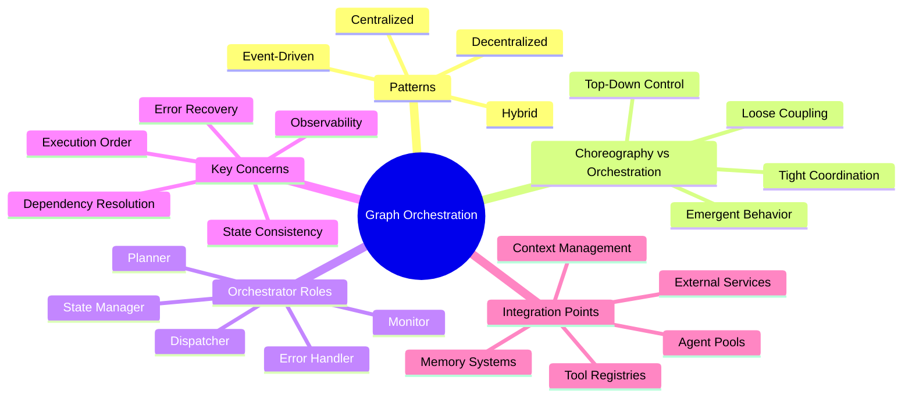
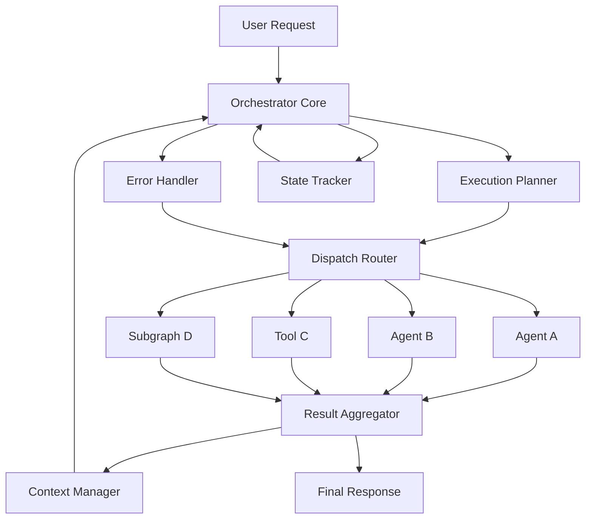
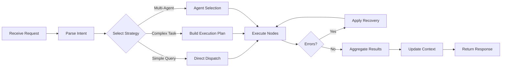
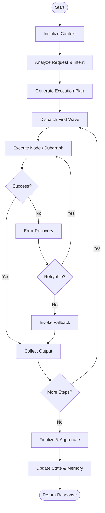
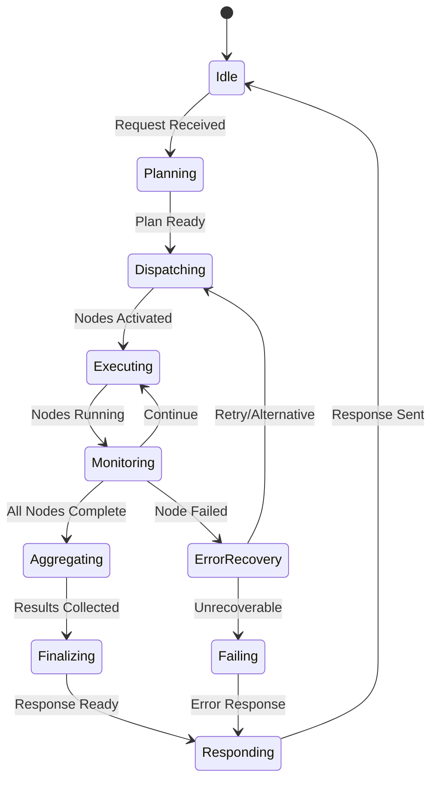
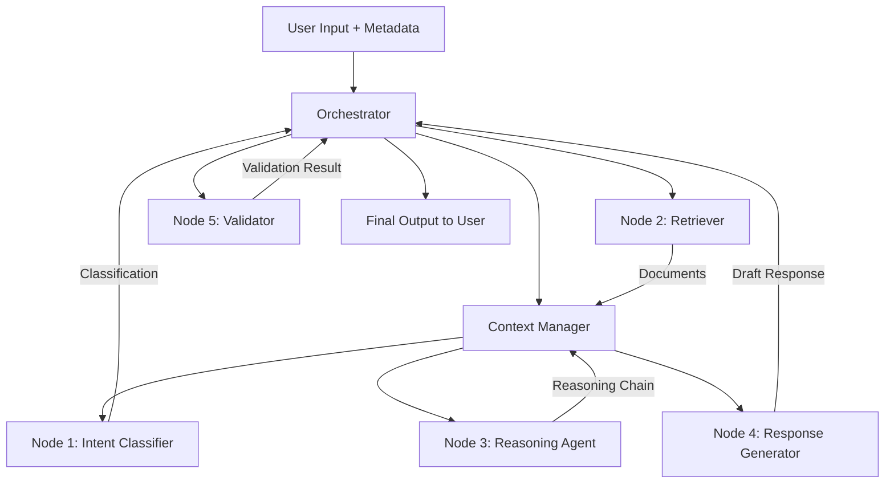
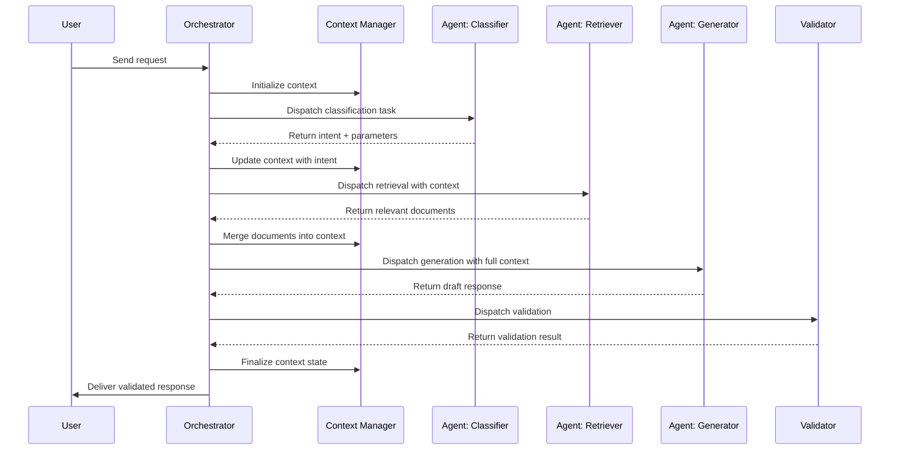

# Graph Orchestration

## 📌 Overview

Graph Orchestration is the discipline of coordinating multiple graph components—prompts, agents, tools, memory stores, and workflow segments—into a unified, coherent execution pipeline. Rather than treating each component in isolation, orchestration provides the connective tissue that ensures every node fires at the right time, with the right inputs, and produces outputs that feed seamlessly into downstream consumers. This layer of coordination is what transforms a collection of independent capabilities into a reliable, production-grade system that can handle complex, multi-step AI tasks.

At its heart, orchestration is about intent-driven control flow. An orchestrator interprets the user's goal, selects the appropriate subgraph or agent ensemble, manages intermediate state, handles errors gracefully, and delivers a consolidated result. It is the conductor of the symphony—each musician (node) may be talented individually, but without the conductor's direction the performance would be chaos. In AI systems built on graph-based architectures, orchestration is the difference between a brittle demo and a resilient application.

## 🎯 Learning Objectives

By studying Graph Orchestration, you will develop the ability to design systems where multiple AI agents and tools collaborate effectively toward a shared objective. You will learn to distinguish between orchestration and choreography, understanding when a centralized controller is appropriate versus when emergent coordination suffices. You will gain practical skills in implementing orchestrator patterns, managing execution lifecycles, and handling the inevitable failures and edge cases that arise in multi-component systems.

You will also learn to evaluate trade-offs between different orchestration strategies. Centralized orchestration offers simplicity and clear observability, while decentralized patterns provide scalability and resilience. Event-driven orchestration enables loose coupling but introduces complexity in debugging and state management. Mastering these trade-offs allows you to select the right approach for each unique system requirement and operational context.

## 🧠 Definition

Graph Orchestration refers to the centralized or semi-centralized coordination of graph-executed AI workflows, where a designated orchestrator component manages the activation, sequencing, data routing, error handling, and termination of nodes and subgraphs within a larger graph structure. The orchestrator possesses global or near-global visibility into the graph's topology and state, enabling it to make informed decisions about which components to invoke, in what order, and under what conditions.

Unlike simple linear pipelines, graph orchestration accommodates branching, looping, conditional routing, and dynamic subgraph selection. The orchestrator maintains an execution context that tracks the progress of the overall task, manages shared state, and resolves dependencies between components. It serves as the authoritative decision-maker for flow control, ensuring that the graph's execution remains aligned with the user's intent even as conditions change mid-execution.

## ❓ Why It Matters

Without orchestration, multi-component AI systems devolve into ad hoc collections of scripts and API calls that are difficult to reason about, test, and maintain. Orchestration provides the structure that makes complex workflows comprehensible to developers, observable in production, and adaptable to changing requirements. It is the architectural layer that enables AI systems to scale from single-prompt experiments to enterprise-grade applications serving thousands of concurrent users with diverse needs.

Orchestration also directly impacts the quality of AI outputs. When components are coordinated effectively, each agent receives precisely the context it needs, tools are invoked with well-formed inputs, and memory is updated consistently. This reduces hallucination, improves response accuracy, and ensures that multi-step reasoning chains remain logically coherent. In production environments, orchestration is the key differentiator between systems that work in demos and systems that work reliably at scale.

## 🏛️ Core Concepts

The foundational concept of graph orchestration is the **orchestrator node**—a special component that sits above the regular workflow nodes and exercises control over their execution. The orchestrator does not typically perform domain work itself; instead, it reads the graph topology, evaluates conditions, dispatches work to appropriate nodes, and aggregates results. This separation of concerns keeps the orchestrator focused on coordination while domain nodes remain focused on their specialized tasks.

A second core concept is the **execution plan**, which is the orchestrator's internal representation of how the graph should be traversed for a given request. The execution plan may be static (pre-defined at design time) or dynamic (computed at runtime based on inputs, state, and conditions). Dynamic planning enables adaptive behavior—for example, the orchestrator might decide to invoke a retrieval node only if the user's question references recent information, or skip a validation node if the input is from a trusted source.

**Choreography vs. Orchestration** is a critical distinction. In choreography, each node knows its role and reacts to events without a central controller—the system's behavior emerges from local interactions. In orchestration, a central authority directs the flow explicitly. Both have their place: choreography excels in loosely coupled, highly scalable systems, while orchestration provides the control and observability needed for complex, stateful workflows. Most production AI systems blend both approaches, using orchestration for the outer control flow and choreography for inner component interactions.

## 🧩 Key Components

A graph orchestration system comprises several key components working in concert. The **Orchestrator Core** is the central decision engine that interprets the workflow definition, manages the execution plan, and dispatches tasks. It maintains a registry of available nodes and subgraphs, their capabilities, their input/output schemas, and their dependency relationships. The orchestrator core evaluates conditions at runtime and determines the optimal execution path.

The **Context Manager** is responsible for maintaining the shared execution context that flows through the graph. This includes the user's original request, intermediate results, accumulated context from memory and retrieval, and any metadata needed for routing decisions. The context manager ensures that each node receives the exact subset of information it needs while protecting sensitive or irrelevant data from leaking into nodes that should not see it.

The **Dispatch Router** handles the actual invocation of nodes, managing both synchronous and asynchronous execution. It routes outputs from one node to the inputs of the next, handles transformations when schemas don't perfectly align, and manages timeouts and retries. The **State Tracker** records the progress of execution, enabling resumption after failures and providing audit trails. Finally, the **Error Handler** implements the system's fault-tolerance strategy, determining whether to retry, fall back to alternative nodes, or fail gracefully with a meaningful error message.

## 🧭 Mental Model

Think of graph orchestration as a **mission control center** for a space launch. Each component in your graph is like a specialized team—propulsion, navigation, life support, communications. Individually, each team knows its job, but someone needs to coordinate the launch sequence, monitor telemetry, handle anomalies, and make real-time decisions about abort or continue. The mission controller (orchestrator) does not build the engines or calculate trajectories; it ensures the right teams act at the right time with the right information.

The mission control analogy extends to the distinction between orchestration and choreography. In a choreographed system, each team follows a pre-agreed timeline and reacts to standard signals—they launch when they see the countdown reach zero, regardless of whether other systems are ready. In an orchestrated system, the controller explicitly verifies each system's readiness before issuing the go-ahead. Both approaches can work, but orchestration provides the safety and adaptability needed for complex, high-stakes operations.

## 🗺️ Mind Map

## 🏗️ Architecture Diagram

## 🔄 Workflow

## ⚙️ Internal Working

The orchestration process begins when a user request enters the system and is parsed into an intent representation. The orchestrator examines this intent against its registry of available capabilities and determines which nodes, agents, and subgraphs are relevant. For straightforward requests, the orchestrator may dispatch directly to a single node. For complex requests, it constructs an execution plan that specifies the order of operations, conditional branches, and parallel execution opportunities.

During execution, the orchestrator activates nodes according to the plan, passing each node the relevant slice of the execution context. As nodes complete their work, the orchestrator collects their outputs, updates the shared context, and evaluates whether any conditions have changed that would alter the remaining execution plan. This adaptive planning capability allows the system to shortcut unnecessary work—for example, if an early retrieval node finds that no relevant documents exist, the orchestrator can skip downstream analysis nodes and route directly to a fallback response.

The orchestrator continuously monitors for errors, timeouts, and unexpected outputs. When a node fails, the orchestrator consults its error handling policy to determine the appropriate response—retrying with backoff, invoking an alternative node, degrading functionality gracefully, or failing the entire request with a clear explanation. Throughout this process, the state tracker maintains a log of every decision, enabling post-hoc analysis and debugging.

## 🔀 Execution Flow

## 📊 Lifecycle

## 📡 Data Flow

## 🤝 Interaction Flow

## 🌍 Real-World Analogy

Consider a **restaurant kitchen during dinner service**. The head chef is the orchestrator. When an order arrives (user request), the chef does not cook every dish personally. Instead, they analyze the order (parse intent), assign tasks to the appropriate stations (dispatch), monitor progress (track state), and ensure everything arrives at the pass simultaneously (aggregate). If the grill station falls behind, the chef might reprioritize, push easier dishes first, or communicate a delay to the front of house (error recovery and fallback).

Each station—sauté, grill, pastry, prep—is a specialized node with its own capabilities and constraints. The chef does not micromanage how the sauté cook seasons a dish (domain autonomy), but they do control the overall sequence and timing (orchestration). The expeditor station serves as the context manager, ensuring each plate has the right components and garnishes before it leaves the kitchen. This analogy captures both the control aspect of orchestration and the respect for node-level specialization that makes the system efficient.

## 💡 Practical Example

Imagine building a customer support AI that handles technical support requests. A user reports that their application crashes on startup. The orchestrator first classifies this as a technical support request and routes it to the diagnostic subgraph. This subgraph includes a node that asks clarifying questions, a node that searches the knowledge base for known issues matching the described symptoms, and a node that runs a diagnostic script if the user provides error logs.

The orchestrator manages this flow: it activates the clarifying questions node first, collects the user's answers, updates the context, then dispatches the knowledge base search. If the search returns a known issue with a documented fix, the orchestrator routes to the solution generator node. If no known issue is found, it activates the diagnostic script node. If the diagnostic reveals a configuration error, the orchestrator routes to a guided fix workflow. Throughout this process, the orchestrator tracks state, handles timeouts (e.g., if the user stops responding to clarifying questions), and ensures the final response is coherent and helpful.

## 🧪 Use Cases

**Multi-agent research assistants** are a primary use case for graph orchestration. A research query might require a web search agent, a document analysis agent, a fact-checking agent, and a synthesis agent working in sequence. The orchestrator manages the handoffs between these agents, ensuring that the synthesis agent receives all gathered information and that the fact-checker validates claims before they reach the final output. Without orchestration, managing these handoffs manually would be error-prone and unmaintainable.

**Conversational AI with tool use** relies heavily on orchestration to manage the complex interactions between dialogue management, intent recognition, tool invocation, and response generation. The orchestrator decides when to call a tool, how to incorporate tool results into the conversation, and when to ask follow-up questions. Other use cases include automated content pipelines (research, draft, edit, publish), data processing workflows (ingest, clean, transform, load, analyze), and multi-step decision support systems where each decision point may require different AI capabilities.

## ⚖️ Comparison

| Aspect | Centralized Orchestration | Decentralized Choreography | Hybrid Approach |
|--------|-------------------------|---------------------------|-----------------|
| Control | Single orchestrator manages all flow | Each node reacts to events independently | Orchestrator for outer flow, choreography within |
| Complexity | Lower cognitive load, easier to debug | Higher complexity, emergent behavior | Moderate, best of both worlds |
| Scalability | Bottleneck risk at orchestrator | Naturally scalable | Scales well with clear boundaries |
| Observability | Full visibility into execution | Harder to trace global state | Good visibility at orchestration layer |
| Flexibility | Orchestrator must anticipate all paths | Nodes adapt independently | Flexible within orchestrated boundaries |
| Best For | Complex, stateful workflows | Simple, highly scalable systems | Most production AI applications |

## ✅ Best Practices

Design orchestrators with clear separation of concerns—keep coordination logic separate from domain logic. The orchestrator should manage flow control, not implement business rules. Each node should be a self-contained unit that can be tested independently, receiving its inputs from the orchestrator and returning its outputs without side effects. This separation makes the system easier to test, debug, and evolve over time.

Implement comprehensive logging and tracing at the orchestration layer. Every dispatch decision, condition evaluation, and error recovery action should be recorded with enough context to reconstruct the execution path after the fact. This observability is invaluable for debugging production issues and for understanding how the system handles edge cases. Use correlation IDs to trace a single request across multiple nodes and subgraphs.

Plan for failure at every step. Define explicit error handling policies for each node type—what constitutes a retryable error, what the fallback behavior should be, and when to escalate to human oversight. Build circuit breakers that prevent cascading failures when a downstream service becomes unresponsive. Finally, keep the orchestrator's decision-making transparent and auditable, especially in systems where the AI's reasoning needs to be explained to end users or regulators.

## ❌ Common Mistakes

The most common mistake in graph orchestration is creating a **god orchestrator**—a single component that tries to manage every aspect of execution, including domain logic that belongs in individual nodes. This leads to monolithic, brittle systems that are difficult to modify and test. The orchestrator should be a lightweight coordination layer, not a repository for all system intelligence.

Another frequent error is **ignoring failure modes**. Many orchestrators are designed for the happy path and fail catastrophically when a node times out, returns malformed output, or produces contradictory results. Robust orchestration requires explicit handling of every foreseeable failure mode, with graceful degradation strategies that preserve as much functionality as possible. A third common mistake is **tight coupling** between the orchestrator and specific node implementations, making it impossible to swap, upgrade, or A/B test individual components without modifying the orchestrator itself.

## 🚀 Advanced Topics

**Adaptive orchestration** uses real-time feedback to dynamically adjust the execution plan. By monitoring node performance metrics—latency, success rate, output quality—the orchestrator can learn which paths through the graph produce the best results for different types of requests. This enables self-optimizing systems that improve over time without manual reconfiguration. Reinforcement learning techniques can be applied to train the orchestrator's routing decisions, creating systems that discover optimal execution strategies through experience.

**Multi-orchestrator architectures** address the scalability limits of single-orchestrator designs by introducing hierarchical orchestration layers. A top-level orchestrator manages coarse-grained workflow segments, while segment-level orchestrators manage the detailed execution within each segment. This hierarchy enables independent scaling, deployment, and evolution of different workflow segments. **Cross-orchestrator communication protocols** define how orchestrators share context, hand off requests, and maintain consistency across organizational boundaries—essential for enterprise systems where different teams own different AI capabilities.

**Orchestration as code** treats the orchestration layer itself as a versioned, testable, deployable artifact. Orchestration definitions are expressed in declarative formats (YAML, JSON, DSLs) that can be stored in version control, reviewed in pull requests, and deployed through CI/CD pipelines. This approach enables infrastructure-as-code practices for AI workflows, making orchestration changes as safe and auditable as any other code change. Combined with canary deployments and feature flags, orchestration-as-code allows teams to evolve complex AI workflows with confidence.
