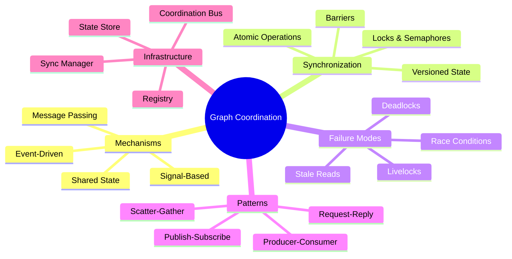
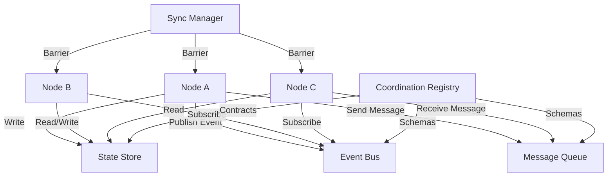
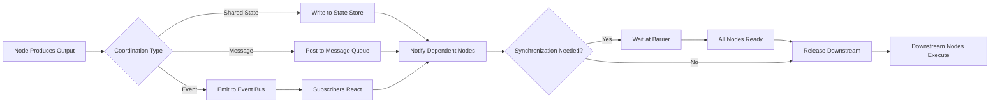
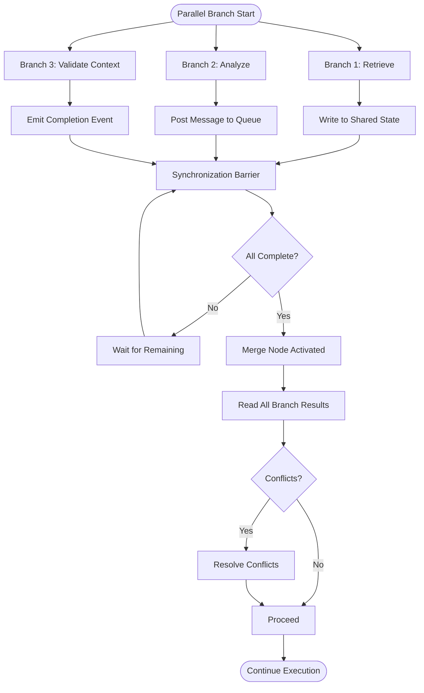
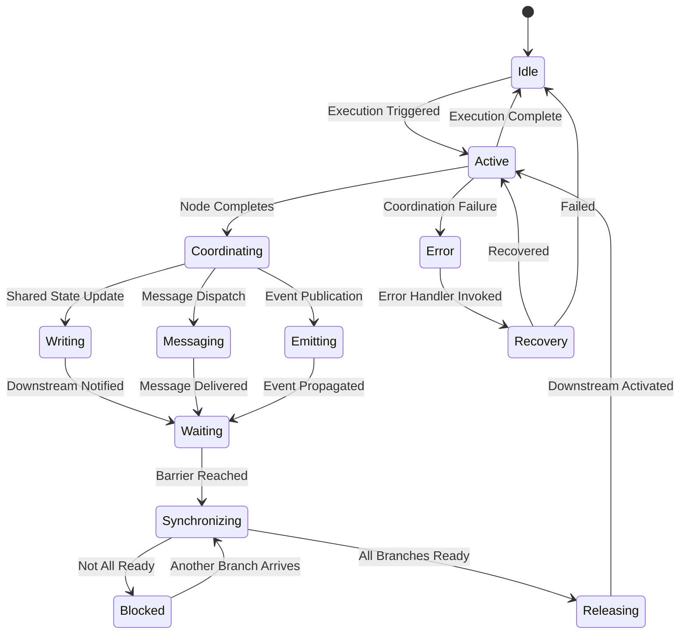
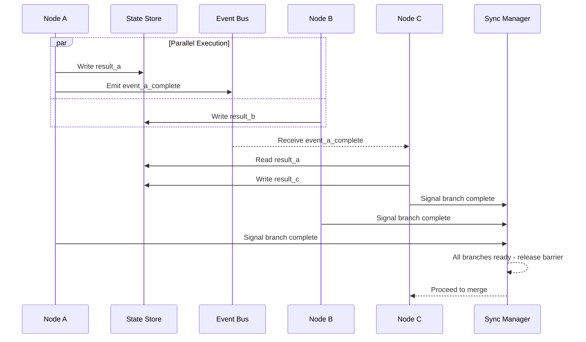

# Graph Coordination

## 📌 Overview

Graph Coordination is the mechanism by which individual nodes within a graph-based AI system align their actions, share information, and maintain consistency during execution. While orchestration focuses on the top-level control flow managed by a central authority, coordination addresses the peer-to-peer and infrastructure-level interactions that enable nodes to work together effectively. Coordination ensures that when multiple nodes operate concurrently, their combined behavior produces correct, coherent results rather than conflicting or duplicated outputs.

In practical terms, coordination encompasses how nodes communicate through shared state, how they signal each other via events and messages, how they synchronize access to shared resources like memory stores and tool registries, and how the system prevents dangerous conditions like deadlocks and race conditions. Without robust coordination mechanisms, a graph with parallel execution paths, feedback loops, or shared resources will exhibit unpredictable behavior—nodes may overwrite each other's contributions, read stale data, or wait indefinitely for signals that never arrive.

## 🎯 Learning Objectives

By studying Graph Coordination, you will learn to design node interactions that are both correct and efficient in concurrent and distributed graph execution environments. You will understand the fundamental coordination mechanisms—shared state, message passing, event-driven signaling, and synchronous locking—and know when each is appropriate. You will develop the ability to identify and prevent coordination failures such as deadlocks, livelocks, race conditions, and inconsistent state propagation.

You will also learn to implement coordination patterns that scale gracefully as the number of nodes and the complexity of the graph increases. This includes designing message schemas that enable interoperability, establishing synchronization boundaries that balance consistency with performance, and building observability into coordination flows so that inter-node communication can be monitored and debugged effectively. These skills are essential for building production AI systems that go beyond simple linear pipelines.

## 🧠 Definition

Graph Coordination refers to the set of protocols, mechanisms, and patterns that enable nodes within a graph-based AI system to interact, share data, synchronize their activities, and maintain collective consistency during execution. Coordination operates at the infrastructure level, providing the communication backbone that makes higher-level orchestration possible. It defines how information flows between nodes, how nodes agree on shared state, and how the system handles the concurrency challenges inherent in parallel graph execution.

Coordination is distinct from orchestration in its scope and focus. Orchestration is about deciding what should happen and in what order. Coordination is about ensuring that when things happen simultaneously or in rapid succession, the system remains correct and consistent. A well-coordinated graph can execute nodes in parallel without conflicts, propagate state changes reliably across the graph, and recover gracefully when individual nodes fail or produce unexpected outputs.

## ❓ Why It Matters

As AI systems grow in complexity, they inevitably require multiple nodes to operate concurrently—retrieving information while a reasoning agent processes previous results, updating memory while a response is being generated, or running multiple specialized agents in parallel to cover different aspects of a user's query. This concurrency introduces coordination challenges that, if unaddressed, lead to subtle and hard-to-debug failures. A race condition in memory updates could cause an agent to base its reasoning on stale information, leading to confident but incorrect outputs.

Coordination matters because it directly impacts the reliability and correctness of AI systems. In a research assistant that runs retrieval, analysis, and fact-checking in parallel, poor coordination could result in the fact-checker validating against outdated information, or the response generator producing output before all analyses are complete. These are not theoretical concerns—they are the kinds of failures that erode user trust and limit the practical deployment of multi-agent AI systems. Robust coordination is a prerequisite for production-grade graph-based AI.

## 🏛️ Core Concepts

**Shared State Coordination** is the simplest coordination mechanism, where nodes read from and write to a common data store. This shared state—often implemented as an in-memory context object or an external key-value store—serves as the single source of truth for the graph's execution. Nodes publish their outputs to the shared state, and downstream nodes read the inputs they need. While simple, shared state requires careful management of concurrent writes to prevent lost updates and ensure that nodes always read the most recent data.

**Message Passing Coordination** uses explicit messages sent between nodes rather than a shared data store. Each node has an input queue (or channel) and an output queue, and communication occurs by placing messages on these queues. This decouples nodes from each other—a sender does not need to know anything about the receiver beyond the message format. Message passing naturally handles asynchrony and provides built-in buffering, but it requires careful design of message schemas and error handling for undeliverable messages.

**Event-Driven Coordination** uses a publish-subscribe model where nodes emit events and other nodes subscribe to events they care about. This is the loosest form of coordination—nodes need not know about each other at all, only about the event types. Events propagate through an event bus or message broker, and subscribers react independently. This pattern excels in systems where multiple nodes need to react to the same occurrence but is harder to debug because the causal chain of events can be difficult to trace.

**Synchronization Primitives** include locks, semaphores, barriers, and atomic operations that prevent race conditions when multiple nodes access shared resources. In graph AI systems, these primitives are typically abstracted behind higher-level coordination APIs rather than used directly. A common abstraction is the **synchronization barrier**, which ensures that all nodes in a parallel execution group complete before any downstream node begins, maintaining consistency without requiring complex locking.

## 🧩 Key Components

The **Coordination Bus** is the central communication infrastructure that enables inter-node coordination. It may be implemented as an in-process event emitter for single-process graphs or as a distributed message broker (such as Kafka, RabbitMQ, or Redis Pub/Sub) for distributed deployments. The coordination bus handles message routing, delivery guarantees (at-least-once, at-most-once, exactly-once), and backpressure management to prevent fast producers from overwhelming slow consumers.

The **State Store** provides the shared state layer that nodes read from and write to during execution. In graph AI systems, the state store typically holds the execution context, intermediate results, and any accumulated state from memory nodes. It must support concurrent reads and writes with appropriate isolation guarantees. Implementations range from simple in-memory dictionaries for single-threaded execution to distributed databases with transactional consistency for large-scale deployments.

The **Synchronization Manager** enforces ordering and consistency constraints across concurrent nodes. It implements barriers that block downstream nodes until upstream nodes complete, manages read-write locks for shared resources, and detects and resolves conflicts when multiple nodes try to update the same state concurrently. The **Coordination Registry** maintains the schema definitions for messages, events, and shared state entries, ensuring that nodes communicate using compatible data formats. Together, these components form the coordination infrastructure that makes reliable concurrent graph execution possible.

## 🧭 Mental Model

Think of graph coordination as a **traffic intersection management system**. Multiple roads (execution paths) converge at a single point, and without coordination, vehicles (data and control signals) would collide. Traffic lights, yield signs, and roundabouts serve as synchronization primitives—each vehicle knows when it is safe to proceed. The traffic control center (coordination bus) monitors all intersections and adjusts signal timing based on current conditions.

In a well-coordinated intersection, vehicles from different directions can pass through safely and efficiently because the rules of coordination are clear and consistently enforced. A green light is like a barrier being released—it signals that it is safe for the waiting vehicles to proceed. A yellow light is a warning signal that gives nodes time to complete their current operation before a transition. A red light is a lock that prevents unsafe concurrent access. When the system works well, coordination is invisible to the drivers—they simply follow the signals and reach their destinations safely.

## 🗺️ Mind Map



## 🏗️ Architecture Diagram



## 🔄 Workflow



## ⚙️ Internal Working

Coordination begins when a node completes its processing and needs to share its results. The coordination mechanism determines how this sharing occurs. In shared state coordination, the node writes its output to a designated location in the state store, which may involve acquiring a write lock, performing the write, releasing the lock, and notifying dependent nodes that new data is available. The notification triggers downstream nodes to read the updated state and begin their own processing.

In message passing coordination, the producing node constructs a message containing its output, addresses it to the appropriate destination (which may be a specific node or a topic), and places it on a message queue. The message queue provides buffering—if the consuming node is busy, messages accumulate until it is ready to process them. This decoupling is valuable when nodes have different processing speeds or when the graph needs to handle bursty workloads. The consuming node polls or is notified when new messages arrive, dequeues them, and processes them in order.

Event-driven coordination operates similarly to message passing but with a one-to-many communication pattern. When a node emits an event, all subscribers receive a copy. This is useful for coordination patterns like scatter-gather, where a single event (e.g., "retrieval complete") triggers multiple independent downstream activities. Synchronization enters the picture when the graph requires multiple parallel branches to complete before merging. The synchronization manager implements barriers that count completed branches and release the merge node only when all branches have arrived.

## 🔀 Execution Flow



## 📊 Lifecycle



## 📡 Data Flow

```mermaid
flowchart TD
    N1[Node: Retriever] -->|results[]| SS[Shared State: context.results]
    N2[Node: Calculator] -->|answer| SS
    N3[Node: Classifier] -->|label| EB[Event Bus: classification_complete]
    EB -->|event| N4[Node: Router]
    N4 -->|route_decision| MQ[Message Queue: dispatch_queue]
    MQ -->|dispatch_msg| N5[Node: Executor]
    N5 -->|execution_result| SS
    SS --> SM[Sync Manager: Barrier Check]
    SM -->|all_ready| N6[Node: Aggregator]
    N6 -->|final_output| Response[Response Delivery]
```

## 🤝 Interaction Flow



## 🌍 Real-World Analogy

Consider a **kitchen in a busy restaurant during the dinner rush**. Multiple cooks work simultaneously at different stations, and they must coordinate constantly. The expediter (coordination bus) calls out orders, and each station listens for orders relevant to their station (event subscription). When the grill cook finishes a steak, they signal the expediter (emit event), who then checks whether the sides are also ready (synchronization barrier). If the mashed potatoes are not yet done, the steak waits under a heat lamp (buffered message queue).

The shared state in this analogy is the order ticket hanging above the stations—every cook can read it to see what's needed, and they mark off items as they complete them (write to shared state). If two cooks simultaneously try to update the same ticket, the one who grabs it first wins (locking), while the other waits. The head chef (synchronization manager) ensures that complete orders are assembled together—no plate leaves the kitchen until every component is ready and verified. This everyday coordination system, refined over centuries of culinary practice, mirrors the same principles needed in graph-based AI systems.

## 💡 Practical Example

Consider a multi-agent code review system where a code submission triggers parallel analysis by three agents: a security scanner, a performance analyzer, and a style checker. Each agent operates independently and writes its findings to a shared state store. The security scanner uses event-driven coordination to alert the other agents if it finds a critical vulnerability—they can then adjust their analysis to account for the security concern.

The synchronization manager ensures that the aggregation agent, which combines all findings into a unified review, does not begin until all three analysis agents have completed. This barrier synchronization prevents the aggregator from producing an incomplete review. If the style checker is slow, the other agents' results are held in the shared state (buffered) until all are ready. The coordination registry ensures that all agents write their findings in a compatible schema, so the aggregator can merge results without format conflicts. If the security scanner finds a critical issue, it can emit a high-priority event that interrupts the normal flow and triggers an immediate notification, bypassing the synchronization barrier for urgent concerns.

## 🧪 Use Cases

**Parallel information retrieval and analysis** is a common use case requiring robust coordination. A research assistant might simultaneously search web sources, query a knowledge base, and analyze the user's conversation history. Coordination ensures that all retrieved information is available and consistent before the synthesis agent attempts to combine it. The synchronization barrier prevents the synthesizer from working with partial information, while shared state provides the common data layer for information exchange.

**Multi-agent debate and consensus systems** require coordination to manage the back-and-forth between agents that may hold opposing views. Message passing enables agents to present arguments and counterarguments, while the coordination bus ensures that each agent receives all relevant messages in the correct order. **Real-time collaborative AI tools**, where multiple AI agents and human users interact simultaneously, rely on event-driven coordination to propagate changes and maintain consistency across all participants. Other use cases include distributed inference pipelines, multi-model ensemble systems, and adaptive workflows that reconfigure themselves based on intermediate results.

## ⚖️ Comparison

| Aspect | Shared State | Message Passing | Event-Driven | Hybrid
|--------|-------------|-----------------|-------------|-------|
| Coupling | Tight (shared data schema) | Loose (message contracts) | Very Loose (event types) | Varies
| Consistency | Strong (single source of truth) | Eventual (message delays) | Eventual (async propagation) | Configurable
| Scalability | Limited (contention risk) | Good (buffered queues) | Excellent (pub/sub) | Good
| Debugging | Easier (inspect state) | Moderate (trace messages) | Hard (event chains) | Moderate
| Best For | Small, tightly coupled graphs | Moderate, pipeline-style | Large, reactive systems | Most production systems

## ✅ Best Practices

Design coordination mechanisms to be **explicit and visible**. Hidden coordination—where nodes share state through global variables or implicit side effects—is a recipe for bugs. Every coordination point should be a named, typed, and documented part of the graph's architecture. Use the coordination registry to define clear schemas for shared state entries, message formats, and event payloads. This makes the system self-documenting and enables automated validation of coordination contracts.

Implement **graceful degradation** for coordination failures. If a message cannot be delivered, the system should have a clear fallback strategy—retry, skip, or fail with a meaningful error. Never let coordination failures cause silent data loss or inconsistent state. Use **timeouts on all synchronization points** to prevent indefinite blocking. If a barrier has not been released within a specified time, the system should log the condition, identify the missing nodes, and either proceed with available data or fail gracefully.

Keep coordination **as local as possible**. Nodes should coordinate only with their immediate neighbors in the graph, not with distant nodes they have no direct relationship with. This locality reduces coupling, limits the blast radius of failures, and makes the system easier to reason about. When global coordination is necessary, mediate it through well-defined aggregation nodes rather than having every node communicate with every other node.

## ❌ Common Mistakes

The most dangerous coordination mistake is **ignoring race conditions** by assuming that nodes execute sequentially when the graph specification allows parallel execution. Even in seemingly sequential graphs, asynchronous implementations, caching layers, and lazy evaluation can introduce unexpected concurrency. Always design coordination with the assumption that any node could execute at any time, and use synchronization primitives to enforce the ordering constraints that correctness requires.

**Over-coordination** is another common error—adding locks, barriers, and synchronization points where they are not needed. This reduces the system's ability to execute in parallel, negating the performance benefits of graph-based architectures. Every synchronization point should have a clear correctness justification, not just a vague concern about "safety." **Under-coordination** is equally problematic—failing to synchronize where it is needed leads to subtle, intermittent bugs that are extremely difficult to reproduce and diagnose.

A third common mistake is **coupling coordination to specific node implementations** rather than defining coordination contracts at the interface level. When coordination depends on internal node details, swapping or upgrading a node requires modifying the coordination logic, creating a maintenance burden. Always define coordination contracts at the abstraction boundary—nodes should coordinate through well-defined interfaces, not by reaching into each other's internals.

## 🚀 Advanced Topics

**Conflict-free Replicated Data Types (CRDTs)** offer an innovative approach to coordination in distributed graph systems. CRDTs are data structures that can be replicated across multiple nodes and updated independently without coordination, with mathematical guarantees that all replicas will eventually converge to the same state. In graph AI systems, CRDTs can be used for shared state that multiple agents update concurrently—each agent updates its local replica, and the CRDT library handles the merge. This eliminates the need for locks and barriers in many scenarios, dramatically simplifying coordination.

**Temporal coordination** addresses the challenge of coordinating nodes that operate at different speeds and have different latency characteristics. Techniques like speculative execution (running nodes ahead of time based on predicted needs), progressive refinement (delivering partial results while computation continues), and deadline-aware scheduling (adjusting node behavior based on remaining time budget) enable graphs to produce useful outputs even when some nodes are slow or unavailable. Temporal coordination is especially important in interactive AI systems where users expect responses within a few seconds.

**Self-coordinating graphs** represent an emerging paradigm where coordination logic is embedded in the graph structure itself rather than managed by a separate coordination layer. Using techniques like dataflow dependency analysis and automatic barrier insertion, the graph runtime can infer the minimum coordination needed for correctness and insert synchronization points automatically. This reduces the burden on graph designers and minimizes unnecessary coordination overhead. Combined with formal verification tools that prove the correctness of the generated coordination, self-coordinating graphs promise to make reliable concurrent AI execution accessible to a broader range of developers.
