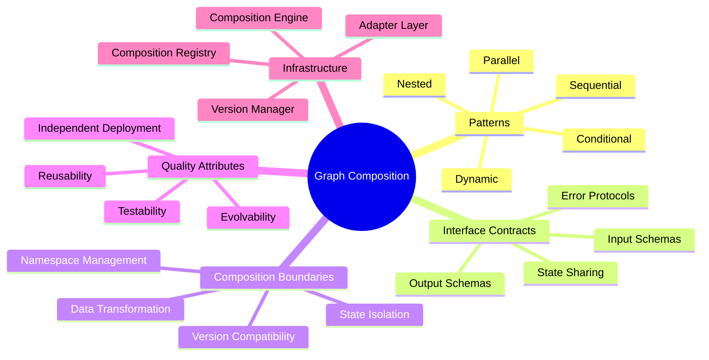
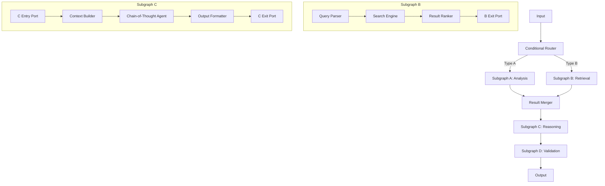
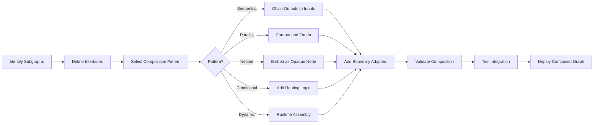
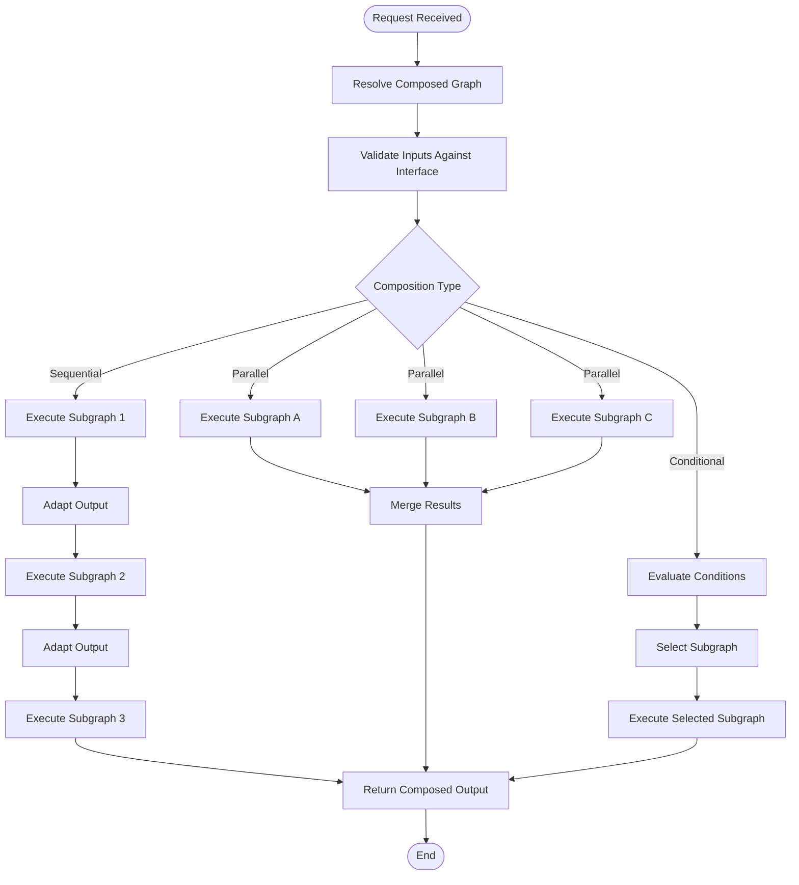
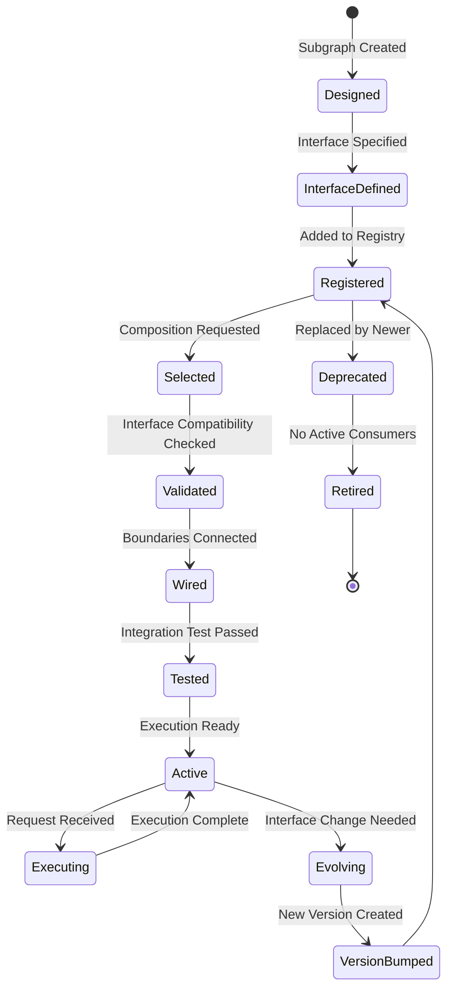
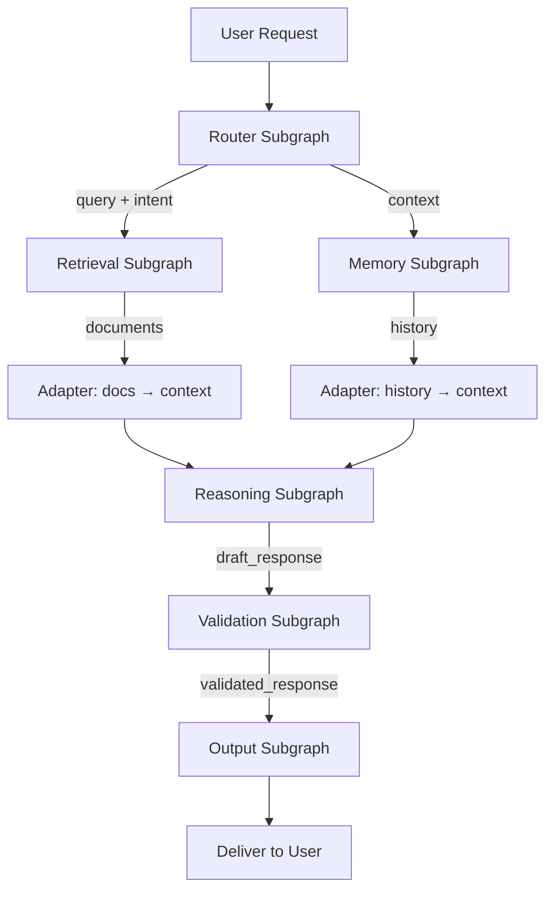
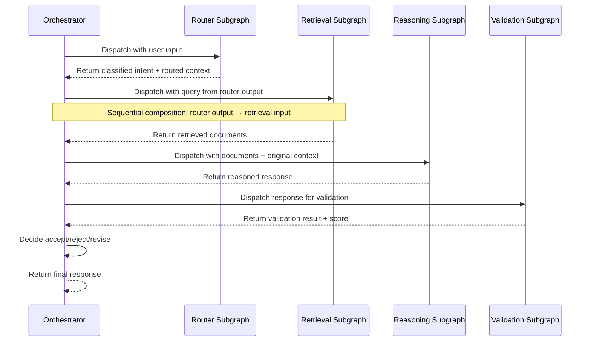

# Graph Composition

## 📌 Overview

Graph Composition is the architectural practice of combining smaller, self-contained subgraphs into larger, more capable graph structures. Just as software engineering composes functions into modules and modules into applications, graph engineering composes specialized subgraphs—each responsible for a well-defined capability like retrieval, reasoning, validation, or response generation—into complete workflows that solve complex user tasks. Composition is the primary mechanism by which graph-based AI systems achieve scalability, reusability, and modularity.

The power of composition lies in treating each subgraph as an independent unit with its own internal logic, state management, and error handling, while exposing a clean interface to the outside world. This allows teams to develop, test, and deploy subgraphs independently, then assemble them into different configurations for different use cases. A retrieval subgraph, for example, can be composed with a code generation subgraph for a coding assistant, or with a legal analysis subgraph for a legal research tool, without modifying the retrieval subgraph itself.

## 🎯 Learning Objectives

By studying Graph Composition, you will learn to design subgraphs as composable building blocks with well-defined boundaries and interfaces. You will master the five primary composition patterns—sequential, parallel, nested, conditional, and dynamic—and understand when each pattern is most effective. You will develop the skill of defining interface contracts that enable subgraphs to interoperate reliably, including input/output schemas, state sharing agreements, and error propagation protocols.

You will also learn to manage the complexity that arises from composition, including namespace conflicts between subgraphs, state isolation boundaries, and the challenge of debugging across subgraph boundaries. You will understand how composition affects observability, testing strategies, and deployment practices. These skills enable you to build graph-based AI systems that grow organically—starting with simple compositions and evolving toward sophisticated multi-subgraph architectures as requirements expand.

## 🧠 Definition

Graph Composition is the process of creating a new graph by integrating two or more existing subgraphs, defining how data and control flow between them, establishing shared boundaries, and ensuring that the composed system behaves as a coherent whole. A **subgraph** is a graph that is designed to be used as a component within a larger graph—it has a defined interface (inputs, outputs, and possibly shared state), internal topology that is encapsulated from the outside, and behavioral contracts that consumers can rely on.

Composition differs from simple connection in its emphasis on encapsulation and reusability. When you connect two nodes with an edge, you are creating a direct dependency between specific components. When you compose two subgraphs, you are creating a dependency between abstractions—each subgraph can be replaced, upgraded, or reconfigured independently as long as it satisfies its interface contract. This abstraction layer is what makes large graph systems manageable and enables teams to work on different subgraphs in parallel without stepping on each other's work.

## ❓ Why It Matters

Without composition, every graph-based AI system must be built as a monolithic structure where all nodes, edges, and logic are defined in a single, interconnected whole. This monolithic approach works for simple demos but becomes unmanageable as systems grow. A production AI application might include dozens of specialized capabilities—web search, document retrieval, code execution, image analysis, fact-checking, response generation, and more. Building all of these as a single flat graph creates an unreadable, untestable, and unmaintainable tangle.

Composition enables **separation of concerns** at the graph level. The team responsible for retrieval optimization can iterate on their subgraph without affecting the response generation team's work. Quality improvements to one subgraph automatically benefit every composed graph that uses it. Composition also enables **reuse across projects**—a well-designed subgraph for sentiment analysis, once built and tested, can be composed into any graph that needs sentiment capability. This compounding benefit of reuse is one of the strongest economic arguments for investing in composable graph architecture.

## 🏛️ Core Concepts

**Sequential Composition** chains subgraphs so that the output of one becomes the input of the next, forming a linear pipeline. This is the simplest pattern and works well when the processing stages have clear, well-ordered dependencies. The retrieval-then-reason-then-respond pipeline is a classic example of sequential composition. Each subgraph in the chain can be developed and tested independently, and the chain can be extended or reconfigured by inserting, removing, or reordering subgraphs.

**Parallel Composition** runs multiple subgraphs concurrently, either processing the same input through different lenses (fan-out/fan-in) or processing different inputs independently. Fan-out composition sends the same input to multiple subgraphs and merges their results—useful for ensemble approaches where multiple analysis strategies contribute to a final answer. Independent parallel composition runs unrelated subgraphs simultaneously for performance, such as retrieving from multiple data sources in parallel.

**Nested Composition** embeds one subgraph inside another as an internal component. The outer subgraph treats the inner subgraph as an opaque node—the outer graph defines the interface, and the inner graph's internal structure is hidden. This enables hierarchical abstraction where complex subgraphs can be built from simpler ones, each level hiding its internal complexity behind a clean interface. **Conditional Composition** selects which subgraph to execute based on runtime conditions—different subgraphs handle different input types, user preferences, or system states. **Dynamic Composition** constructs the graph structure at runtime based on the specific request, assembling subgraphs on-the-fly from a library of available components.

## 🧩 Key Components

The **Subgraph Interface** is the most critical component of graph composition. It defines the contract between a subgraph and its consumers, specifying the inputs the subgraph accepts, the outputs it produces, the shared state it reads or modifies, and the errors it may emit. A well-designed interface is minimal—exposing only what consumers need and hiding internal implementation details. Interface contracts should be typed, documented, and versioned to enable safe evolution over time.

The **Composition Boundary** defines where one subgraph ends and another begins. At this boundary, data must be transformed from the producing subgraph's output format to the consuming subgraph's input format. These transformations—implemented as adapter nodes or mapping functions—are where many composition bugs originate. The composition boundary also defines the state isolation policy: does the consuming subgraph have access to the producing subgraph's internal state, or only to the data explicitly passed through the interface?

The **Composition Registry** is a catalog of available subgraphs, their interfaces, and their metadata (capabilities, performance characteristics, dependencies). The registry enables dynamic composition by allowing the orchestrator to discover and select subgraphs at runtime. The **Composition Engine** handles the mechanics of connecting subgraphs—wiring outputs to inputs, managing state sharing across boundaries, and ensuring that the composed graph maintains the invariants expected by each subgraph. Together, these components form the infrastructure that makes composition practical in production systems.

## 🧭 Mental Model

Think of graph composition as **building with LEGO bricks**. Each subgraph is a specialized brick—it has a specific shape (interface), a specific function (capability), and connection points (input/output ports) that determine how it can attach to other bricks. You can connect bricks in sequence to build a wall (sequential composition), side by side to build a wide foundation (parallel composition), or nest smaller assemblies inside larger structures (nested composition).

The key insight from the LEGO analogy is that the connection points are standardized. A 2x4 brick connects to any other brick through the same studs and tubes, regardless of what color or theme the brick belongs to. Similarly, well-designed subgraph interfaces enable any subgraph to connect to any compatible subgraph, regardless of their internal implementation. The standardization of interfaces is what enables both reuse and independent evolution—you can replace a red brick with a blue one without redesigning the entire structure.

## 🗺️ Mind Map

## 🏗️ Architecture Diagram

## 🔄 Workflow

## ⚙️ Internal Working

The composition process begins with the identification of natural boundaries within a workflow—points where the processing concern shifts from one capability to another. For example, a customer support workflow might naturally separate into intent classification, knowledge retrieval, response drafting, and quality assurance. Each of these becomes a candidate subgraph with its own internal nodes, edges, and state. The composer then defines the interface for each subgraph—the data it needs as input, the data it produces as output, and any shared state it participates in.

Once interfaces are defined, the composer selects the appropriate composition pattern for connecting subgraphs. Sequential subgraphs are connected by wiring the output port of one to the input port of the next, with optional adapter nodes to transform data formats. Parallel subgraphs share the same input and their outputs are collected by a merge node. Nested subgraphs are treated as opaque components within their parent graph—the parent sees only the nested subgraph's interface, not its internal structure. Conditional composition adds a router node that evaluates runtime conditions and dispatches to the appropriate subgraph.

The composition engine validates the assembled graph by checking interface compatibility—ensuring that output schemas match input schemas (or that adapters are provided), that state access patterns are consistent, and that no circular dependencies exist that would cause deadlocks. Dynamic composition adds a discovery phase where the registry is queried for available subgraphs matching the required capability, and the most appropriate one is selected based on metadata such as performance characteristics, cost, or quality scores. The final composed graph is then registered and made available for execution.

## 🔀 Execution Flow

## 📊 Lifecycle

## 📡 Data Flow

## 🤝 Interaction Flow

## 🌍 Real-World Analogy

Consider how a **modern smartphone is manufactured**. The screen, processor, camera, battery, and speaker are each manufactured by different suppliers, each with their own internal processes and quality standards (subgraphs with encapsulated internals). These components are not thrown together randomly—they connect through standardized interfaces (USB-C, PCIe, MIPI) that define exactly how data and power flow between them (composition interfaces).

A phone manufacturer can swap the camera module from one supplier to another without redesigning the entire phone, as long as the new module conforms to the same interface standard. Similarly, they can use the same processor in different phone models, composing it with different screens and batteries. The phone's operating system treats each component through its driver interface, not by directly manipulating the hardware. This layered composition—hardware components composed into a phone, software components composed into an OS, both composed into a working device—is the same principle that makes graph composition so powerful for AI systems.

## 💡 Practical Example

Imagine building a content creation platform that produces articles, social media posts, and email newsletters. The core subgraphs include: a Research Subgraph (web search, source evaluation, fact extraction), a Writing Subgraph (outline generation, drafting, editing), a Media Subgraph (image search, caption generation, format optimization), and a Distribution Subgraph (platform-specific formatting, scheduling, analytics setup).

For an article, the system composes Research → Writing → Media → Distribution sequentially. For social media, it composes Research in parallel with Media, then merges results into Writing, then Distribution. For a newsletter, it reuses the same Research and Writing subgraphs but replaces Media with a Template Subgraph and Distribution with an Email Subgraph. The conditional composition router selects the appropriate graph assembly based on the content type specified in the user's request. Each subgraph is maintained independently—the Research team can improve search quality without affecting Writing, and new distribution channels can be added by creating new Distribution subgraphs that conform to the distribution interface.

## 🧪 Use Cases

**Multi-modal AI systems** are a natural fit for graph composition. A system that processes text, images, and audio can compose separate subgraphs for each modality, then merge their outputs. The text subgraph handles NLU and NLG, the image subgraph handles visual analysis and generation, and the audio subgraph handles speech processing. The composition pattern determines how these modalities interact—parallel for independent processing, sequential for dependencies (e.g., describe an image, then generate a text response about it).

**Multi-tenant AI platforms** use composition to customize workflows for different customers. A base set of subgraphs provides common capabilities, and customer-specific subgraphs add specialized logic. The composition engine assembles the appropriate graph for each customer at runtime, based on their configuration. **A/B testing and gradual rollouts** leverage composition by maintaining multiple versions of a subgraph and using conditional composition to route a percentage of traffic to each version. Other use cases include industry-specific AI solutions (healthcare, legal, financial) that share common subgraphs but compose them with domain-specific components.

## ⚖️ Comparison

| Aspect | Sequential | Parallel | Nested | Conditional | Dynamic
|--------|-----------|----------|--------|------------|--------
| Execution | One after another | Simultaneously | Inner graph hidden | Selected at runtime | Assembled at runtime
| Data Flow | Linear chain | Fan-out/fan-in | Encapsulated | Routed by condition | Discovered and wired
| Complexity | Low | Medium | Low external | Medium | High
| Flexibility | Fixed order | Fixed parallelism | Fixed embedding | Adaptive selection | Fully adaptive
| Best For | Pipelines, chains | Ensembles, multi-source | Abstraction layers | Type-based routing | Open-ended workflows
| Debugging | Easy (linear) | Moderate (concurrency) | Harder (nesting) | Moderate (branches) | Hard (runtime assembly)

## ✅ Best Practices

Design subgraph interfaces to be **stable and minimal**. An interface should expose only what consumers genuinely need and should change infrequently. Internal implementation can evolve rapidly, but interface changes ripple through every consuming graph. Use semantic versioning for subgraph interfaces—major version changes indicate breaking interface modifications, minor versions add capabilities, and patches fix bugs without interface changes. This versioning discipline enables consumers to upgrade selectively and test compatibility before deploying.

Maintain **strict encapsulation** at composition boundaries. A subgraph's internal state should not be directly accessible to other subgraphs or to the outer graph. All state sharing should occur through the defined interface, which may include explicit state sharing protocols but should never expose raw internal state. This encapsulation enables independent testing—a subgraph can be tested with mock inputs and outputs without needing to set up the entire composed graph.

Implement **composition validation** as part of your CI/CD pipeline. Before a composed graph is deployed, automated tests should verify that all interface contracts are satisfied, that data flows correctly across boundaries, and that the composed graph produces the expected outputs for representative inputs. This prevents composition errors from reaching production. Also, document the **composition intent**—why specific subgraphs were composed in a specific pattern—so future maintainers understand the design rationale and can make informed modifications.

## ❌ Common Mistakes

**Leaking abstractions** is the most common composition mistake—exposing internal subgraph details through the interface, either explicitly (by including internal state in the output) or implicitly (by requiring consumers to understand internal behavior to use the subgraph correctly). Once an abstraction leaks, consumers become coupled to the implementation, and changes to the subgraph's internals break consumers. Always review interfaces for leakage and refactor to maintain clean boundaries.

**Over-composing**—creating subgraphs that are too small or too granular—adds unnecessary complexity and indirection without meaningful benefits. If a subgraph contains only one or two nodes and is never reused, it probably should not be a separate subgraph. The overhead of defining interfaces, managing boundaries, and debugging across composition layers should be justified by tangible benefits in reusability, testability, or team autonomy. **Under-composing**—keeping everything in a single monolithic graph—creates the opposite problem: a tangled structure that is difficult to understand, test, and evolve.

A third common mistake is **ignoring version compatibility** across subgraph boundaries. When one subgraph is updated with a new output schema, all consuming subgraphs must be updated to handle the new format. Without a versioning strategy and compatibility checking, these changes cause silent failures or runtime errors that are difficult to trace back to the composition boundary. Always define and enforce interface version compatibility as part of your composition infrastructure.

## 🚀 Advanced Topics

**Generative composition** uses AI to automatically discover and assemble subgraph compositions based on a natural language description of the desired workflow. Given a task like "create a system that researches a topic, writes a report, and distributes it via email," the generative composer searches the subgraph registry for capabilities matching each step, evaluates composition compatibility, and proposes one or more valid graph assemblies. Human developers review, refine, and approve the proposed composition. This approach dramatically accelerates the development of new AI workflows by automating the most tedious and error-prone aspect of graph assembly.

**Cross-organization composition** enables subgraphs owned by different teams, departments, or even companies to be composed into unified workflows. This requires standardized interface protocols, federated subgraph registries, and trust models that govern how subgraphs from different trust domains interact. Blockchain-based interface contracts and zero-knowledge proofs for subgraph outputs are emerging technologies that address the trust and verification challenges of cross-organization composition. This pattern is particularly relevant in healthcare, finance, and government, where data sovereignty and regulatory compliance require strict boundaries between organizational domains.

**Self-assembling graphs** represent the frontier of composition, where the graph structure itself evolves during execution based on observed performance and outcomes. The composition engine monitors the effectiveness of the current assembly and dynamically adds, removes, or replaces subgraphs to improve results. For example, if a retrieval subgraph consistently returns low-quality results for a specific topic, the engine might dynamically insert a query reformulation subgraph before retrieval. Combined with reinforcement learning, self-assembling graphs can discover novel compositions that outperform human-designed workflows for specific use cases.