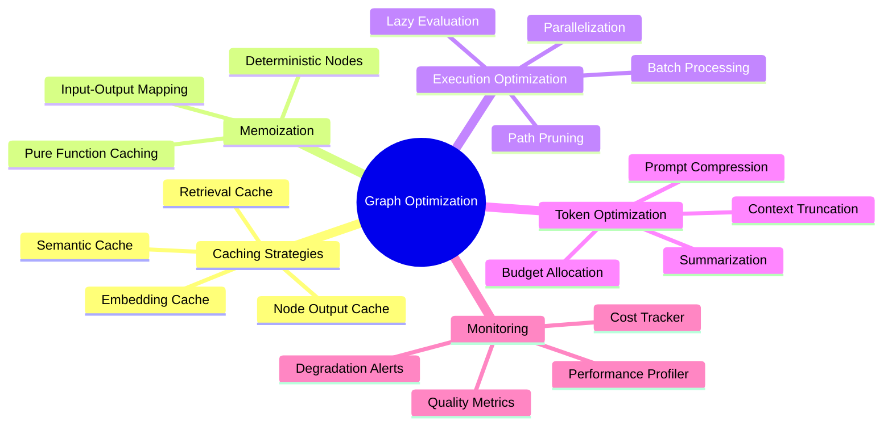
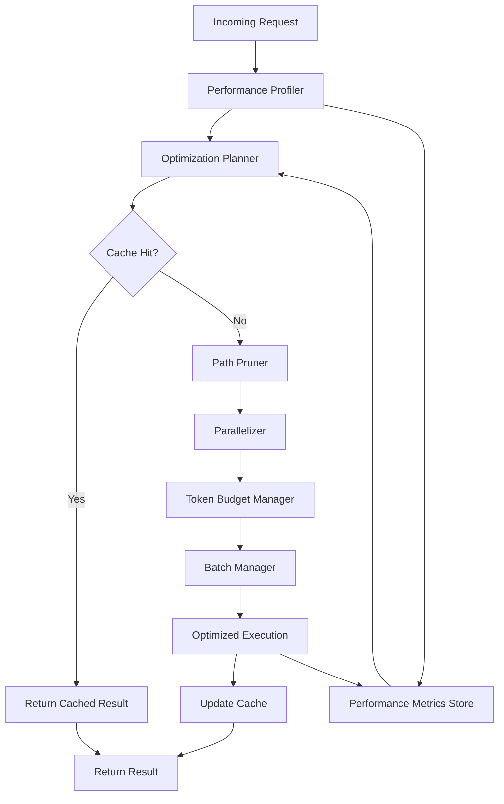
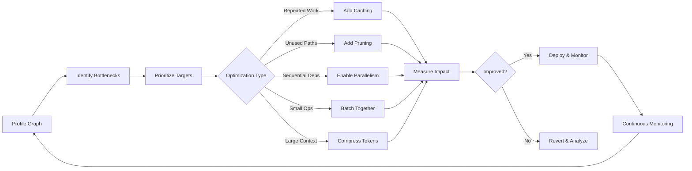
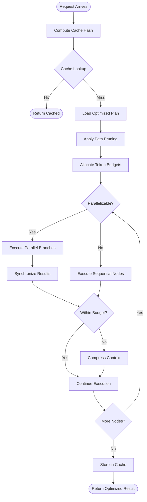
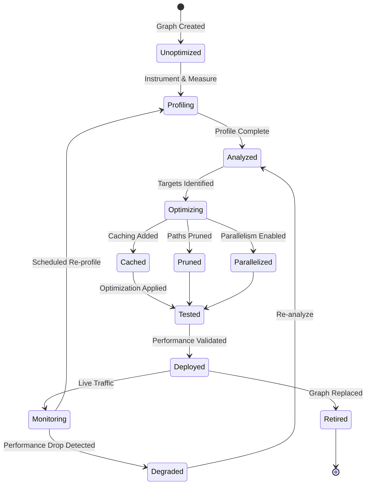
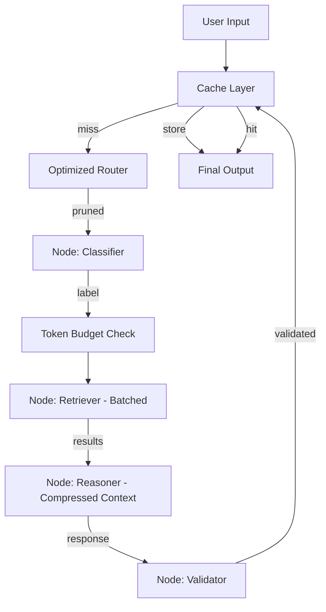
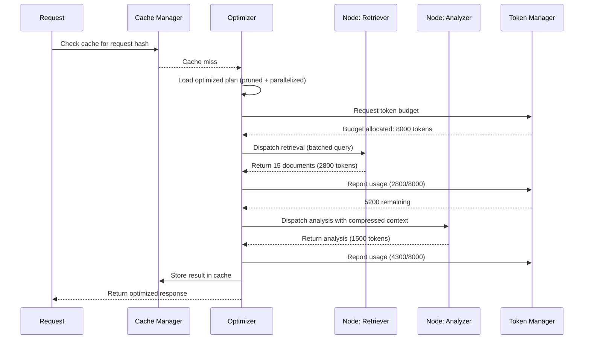

# Graph Optimization

## 📌 Overview

Graph Optimization is the systematic practice of improving the performance, efficiency, and cost-effectiveness of graph-based AI systems without compromising output quality. As graph-based architectures grow in complexity—incorporating multiple agents, retrieval steps, validation loops, and tool calls—the cumulative cost of execution in terms of latency, token consumption, compute resources, and API calls can become substantial. Optimization ensures that every node invocation, every token processed, and every millisecond of execution time delivers maximum value toward the user's goal.

Optimization in graph engineering operates at multiple levels. At the node level, it involves making individual agents and tools faster and more token-efficient. At the edge level, it involves ensuring that data flows between nodes with minimal transformation overhead. At the graph level, it involves restructuring the execution flow to eliminate redundant work, parallelize independent operations, and defer expensive computations until they are proven necessary. Together, these optimizations can reduce costs by orders of magnitude while maintaining or even improving output quality.

## 🎯 Learning Objectives

By studying Graph Optimization, you will develop a comprehensive toolkit for analyzing and improving the performance of graph-based AI systems. You will learn to identify bottlenecks in graph execution—nodes that consume disproportionate resources, edges that introduce unnecessary latency, and paths through the graph that produce redundant or low-value results. You will master specific optimization techniques including caching, memoization, path pruning, parallelization, lazy evaluation, batch processing, and token budgeting.

You will also learn to think about optimization as a continuous process rather than a one-time activity. Production AI systems evolve constantly—new nodes are added, user behavior changes, model capabilities improve—and optimization strategies must evolve with them. You will learn to build monitoring into your graphs that continuously tracks performance metrics, identifies degradation, and triggers re-optimization. This disciplined approach to performance ensures that your graph-based systems remain efficient as they grow in capability and complexity.

## 🧠 Definition

Graph Optimization refers to the application of performance-enhancing techniques to graph-based AI systems, targeting improvements in execution speed, resource consumption (particularly token usage), cost, and output quality per unit of computation. Optimization may be applied statically (at design time, by restructuring the graph) or dynamically (at runtime, by adapting execution based on observed conditions). The goal is to maximize the ratio of useful output to consumed resources, ensuring that every computation contributes meaningfully to the final result.

Optimization is fundamentally about eliminating waste. In a graph-based AI system, waste takes many forms: invoking an expensive LLM node with context that has not changed since the last request, running two retrieval nodes that search overlapping document spaces, serializing operations that could run in parallel, or generating a complete response when only a small portion is needed. Each optimization technique targets a specific form of waste, and the collective application of these techniques transforms an expensive system into an efficient one.

## ❓ Why It Matters

Cost is the most immediate reason optimization matters. Every LLM API call costs money, every token in a context window consumes budget, and every second of latency degrades the user experience. A graph that calls an LLM five times per request, each with a 10,000-token context, costs dramatically more than one that achieves the same result with two calls and 4,000-token contexts. For systems serving thousands of users, the difference between an optimized and unoptimized graph can be millions of dollars per year in API costs alone.

Latency directly impacts user satisfaction and system throughput. Users expect AI responses within seconds, and every additional node in the execution path adds latency. An optimized graph that eliminates unnecessary nodes, parallelizes independent operations, and caches repeated computations can deliver responses two to five times faster than an unoptimized equivalent. In interactive applications, this speed improvement translates directly to higher engagement, better task completion rates, and lower abandonment. Optimization is not a luxury—it is a fundamental requirement for production AI systems that must balance quality, cost, and speed.

## 🏛️ Core Concepts

**Caching** stores the results of previous node executions and returns the cached result when the same inputs are encountered again, avoiding redundant computation. In graph AI systems, caching is particularly valuable for retrieval nodes (the same query should not trigger a new search every time), classification nodes (the same input should produce the same classification), and tool nodes (the same API call should not be repeated). Effective caching requires a well-designed cache key strategy that captures all inputs that affect the output, and a cache invalidation policy that ensures stale results are not served when underlying data changes.

**Memoization** is a specialized form of caching that operates at the function or node level. Where general caching might store any kind of result, memoization specifically caches the output of a pure function given its inputs. In graph systems, memoized nodes are idempotent—they always produce the same output for the same inputs, making them safe to cache aggressively. Memoization is most effective for deterministic operations like template rendering, format conversion, and schema validation, where the output depends entirely on the input and no external state.

**Path Pruning** eliminates branches of the graph that are unnecessary for the current request. Rather than executing every node and hoping the results are useful, pruning analyzes the request at entry points and skips subgraphs that are irrelevant. If a user asks a simple factual question, pruning can skip the creative writing subgraph and the code execution subgraph, directly routing to the factual retrieval and response nodes. This selective execution reduces both latency and cost by avoiding work that would not contribute to the final answer.

**Lazy Evaluation** defers node execution until its output is actually needed by a downstream node. In an eager execution model, all nodes execute as soon as their inputs are available. In lazy evaluation, nodes are marked as needed only when a downstream node requests their output. This prevents unnecessary computation when early nodes in a branch produce outputs that are ultimately not consumed—perhaps because a conditional router directed flow down a different branch.

**Batch Processing** groups multiple independent operations into a single batched call, reducing per-operation overhead. In graph AI systems, this might mean batching multiple retrieval queries into a single search API call, batching multiple classification decisions into a single LLM prompt, or batching multiple tool invocations into a single API request. Batching is particularly effective when individual operations have high fixed overhead (connection setup, authentication, cold start) relative to the actual computation.

## 🧩 Key Components

The **Performance Profiler** is the diagnostic tool that identifies optimization opportunities by measuring the resource consumption of every node, edge, and path in the graph. It tracks execution time, token count, API calls, memory usage, and output quality for each node, producing a detailed performance profile that highlights the most expensive and least effective components. Without profiling, optimization is guesswork—with it, optimization is targeted and measurable.

The **Cache Manager** implements the caching infrastructure, providing cache storage, cache key generation, cache lookup, and cache invalidation. It supports multiple cache strategies—time-based expiration, size-based eviction (LRU, LFU), and content-based invalidation. The cache manager must be fast itself, as cache lookups occur on every node execution and add latency if they are slow. In distributed graph systems, the cache manager may need to handle distributed caching with consistency guarantees.

The **Token Budget Manager** allocates and tracks token consumption across the graph, ensuring that the total token usage stays within defined limits. It assigns token budgets to individual nodes, monitors consumption in real-time, and triggers truncation or summarization when budgets are exceeded. The **Optimization Planner** analyzes the performance profile and generates an optimized execution plan that applies the appropriate combination of caching, pruning, parallelization, and batching for each request. Together, these components form the optimization infrastructure that enables continuous performance improvement.

## 🧭 Mental Model

Think of graph optimization as **packing for a trip**. You start by laying out everything you might need (the unoptimized graph), then systematically eliminate items that are unnecessary (pruning), pack items that serve multiple purposes (memoization), group small items into organizers (batching), and pack only what you'll actually use first, leaving the rest for later (lazy evaluation). The goal is to arrive at your destination with exactly what you need—nothing missing, nothing wasted.

The packing analogy also illustrates the trade-off inherent in optimization. An under-packed bag might leave you without something essential (pruned a necessary node). An over-packed bag is heavy and slow (no optimization at all). The optimal packing balances completeness with efficiency. Similarly, graph optimization must balance output quality with resource consumption. The art is in identifying which items (computations) truly contribute to the outcome and which are just dead weight.

## 🗺️ Mind Map

## 🏗️ Architecture Diagram

## 🔄 Workflow

## ⚙️ Internal Working

The optimization process begins with profiling, which instruments every node in the graph to measure its resource consumption. The profiler records execution time, input and output token counts, the number of API calls made, and any external service calls. It also tracks output quality metrics when available (such as validation scores or user feedback). This profile is analyzed to identify the highest-cost nodes relative to their contribution to the final output—these are the primary optimization targets.

Once targets are identified, the optimization planner determines the appropriate technique for each. For nodes that produce the same output for the same inputs across requests (such as a knowledge base that rarely changes), caching is the first choice. The planner generates a cache key from the node's inputs and checks the cache before dispatching. For nodes that are expensive but only needed in certain conditions, path pruning is applied—the planner adds conditional checks that skip the node when its output is not required. For independent sequential nodes, the planner identifies parallelization opportunities and restructures the execution to run them concurrently.

Token optimization operates at a different level, managing the total token budget across the entire graph. The token budget manager allocates budgets to nodes based on their importance and the overall request complexity. As nodes execute, the manager tracks cumulative token usage. When a node approaches its budget, it triggers context compression—summarizing or truncating earlier context to free tokens for the current node's output. When the total graph budget is at risk, the manager can invoke early response generation with the information gathered so far, trading completeness for staying within budget. This dynamic token management is essential for handling unpredictable input sizes.

## 🔀 Execution Flow

## 📊 Lifecycle

## 📡 Data Flow

## 🤝 Interaction Flow

## 🌍 Real-World Analogy

Consider a **modern restaurant kitchen optimizing its operations**. The head chef (optimizer) notices that the salad station is preparing garnishes for every dish individually, even though many dishes use the same garnish (redundant computation → caching opportunity). The chef implements a prep station that makes garnishes in bulk at the start of each shift and distributes them as needed (batch processing and caching). 

The chef also notices that desserts are being prepared at the start of the evening even when no one orders them (eager execution → lazy evaluation). Instead, dessert prep begins only when a dessert order comes in. The chef reorganizes the kitchen layout so that the fry station and grill station can work simultaneously on different parts of the same order (parallelization), rather than waiting for one to finish before the other starts (serialization). The chef also assigns a cost budget to each dish—if a dish's ingredient costs are too high, the chef finds creative substitutions that maintain quality (token budget management). Every optimization reduces waste and increases the kitchen's capacity to serve more customers with the same resources.

## 💡 Practical Example

Imagine a customer support AI that handles technical questions. The original unoptimized graph executes seven nodes sequentially: intent classification, entity extraction, knowledge base search, documentation search, forum search, response synthesis, and response validation. Each search node independently queries its source, and the synthesis node receives all search results as raw text in the context.

Optimization transforms this graph significantly. First, caching is added to the intent classification and entity extraction nodes, since the same user often asks related questions in sequence. Second, the three search nodes are parallelized since they have no dependencies on each other, reducing total search time from the sum of all three to the maximum of the three. Third, path pruning is added—if the intent is classified as a billing question, the documentation and forum search nodes are skipped entirely, routing directly to the billing knowledge base. Fourth, batch processing combines the three search queries into a single batched API call when they do all execute. Fifth, token optimization compresses the raw search results before passing them to the synthesis node, using a summarization step that reduces 15,000 tokens of raw results to 3,000 tokens of extracted key information. The result: 60% cost reduction, 3x latency improvement, and equivalent or better output quality.

## 🧪 Use Cases

**High-volume customer support systems** are primary candidates for graph optimization. These systems handle thousands of requests per hour, and even small per-request savings compound into significant cost reductions. Caching handles repeated questions (FAQs), pruning skips irrelevant analysis for simple queries, parallelization reduces response time, and token optimization keeps API costs manageable. The business case for optimization is straightforward and easily quantified in terms of cost per resolution and average handle time.

**Research and analysis platforms** that perform multi-step retrieval and reasoning benefit enormously from caching and batch processing. Research queries often overlap—multiple users asking about the same topic can share cached retrieval results. Batch processing enables efficient use of retrieval APIs that support bulk queries. **Real-time AI assistants** optimize for latency above all else, using aggressive pruning to skip any node that is not essential for the current response, parallelizing everything possible, and using lazy evaluation to avoid computing options the user may never select. Other use cases include content generation pipelines, data processing workflows, and multi-model ensemble systems.

## ⚖️ Comparison

| Technique | Primary Benefit | Trade-off | Best Applied When |
-----------|----------------|-----------|------------------|
| Caching | Reduces redundant computation | Memory usage, staleness risk | Repeated inputs, stable data sources |
| Memoization | Eliminates repeated pure function calls | Cache management overhead | Deterministic nodes, same inputs common |
| Path Pruning | Reduces unnecessary node executions | Risk of pruning needed paths | Conditional workflows, many optional branches |
| Parallelization | Reduces total execution time | Coordination overhead, resource contention | Independent nodes, sufficient compute |
| Lazy Evaluation | Avoids computing unused results | Slightly higher latency for needed results | Branches that may not be taken |
| Batch Processing | Reduces per-operation overhead | Higher latency for individual ops | Many small, similar operations |
| Token Optimization | Reduces API costs | May reduce context richness | Large contexts, budget-constrained |

## ✅ Best Practices

**Profile before optimizing.** Never optimize based on assumptions about what is slow or expensive. Always instrument your graph with profiling that measures actual execution time, token counts, and API calls for every node. Let the data guide your optimization priorities—the node you assume is the bottleneck may not be, and the real bottleneck may be surprising. Establish a performance baseline before making changes so you can measure the impact of each optimization and avoid regressions.

**Optimize at the graph level first, then at the node level.** Graph-level optimizations (pruning, parallelization, lazy evaluation) often yield the largest improvements with the least effort. Node-level optimizations (prompt compression, model selection, algorithm tuning) provide incremental improvements on top of the graph-level gains. This layered approach ensures you get the biggest wins first and don't waste effort optimizing nodes that the graph-level optimizer will skip or cache anyway.

**Make optimization observable and reversible.** Every optimization should be logged so you can see which techniques are being applied and what their impact is. Implement feature flags that allow you to enable or disable specific optimizations in production without redeploying. This enables A/B testing of optimization strategies and quick rollback if an optimization causes unexpected quality degradation. Optimization is an ongoing process, not a one-time event—build the infrastructure to support continuous experimentation.

## ❌ Common Mistakes

**Premature optimization**—applying caching, pruning, and other techniques before profiling—wastes engineering effort on optimizations that may not matter. A node that you optimize to save 50 milliseconds may be irrelevant if it accounts for only 1% of total execution time. Always profile first, identify the actual bottlenecks, and optimize where the data tells you the impact will be greatest. This disciplined approach prevents the common trap of spending days optimizing a component that contributes negligibly to overall performance.

**Over-caching** leads to stale results being served to users, especially when the underlying data changes frequently. A cache that never invalidates is worse than no cache at all, because at least without caching the results are always fresh. Implement clear cache invalidation policies tied to data change events, and set reasonable TTLs that balance freshness with performance. Monitor cache hit rates and staleness incidents to tune your caching strategy over time.

**Optimizing quality away** is the most dangerous mistake—reducing token budgets, pruning paths, or compressing context to the point where output quality noticeably degrades. Every optimization should be validated against quality benchmarks to ensure that cost savings are not coming at the expense of user experience. Establish quality thresholds that trigger alerts when optimization pushes results below acceptable levels. The goal is to reduce cost while maintaining quality, not to minimize cost regardless of quality.

## 🚀 Advanced Topics

**Adaptive optimization** uses machine learning to automatically select and tune optimization strategies based on the characteristics of each request. An adaptive optimizer might learn that requests from mobile users benefit more from latency optimization (aggressive pruning, parallelization) while requests from power users benefit more from quality optimization (higher token budgets, less aggressive compression). The optimizer builds a model of request characteristics and their optimal optimization profiles, continuously refining this model based on observed outcomes. This moves optimization from a static, rule-based system to a dynamic, learned system.

**Predictive prefetching** anticipates which nodes will be needed for upcoming requests and begins executing them before the request arrives. In a customer support system, predictive prefetching might analyze the user's browsing history and begin retrieving relevant knowledge base articles before the user submits their question. This technique reduces perceived latency dramatically—the user's request is already partially processed by the time it arrives. Predictive prefetching requires accurate prediction models and careful cache management to avoid wasting resources on predictions that never materialize.

**Cross-graph optimization** extends optimization beyond individual graphs to optimize across an entire portfolio of graphs serving different use cases. Shared caching pools allow graphs that use common components (retrieval, classification) to share cached results. Token budget allocation across concurrent requests ensures that the system's total token budget is distributed optimally based on request priority, user tier, and expected value. Portfolio-level optimization treats the entire AI system as a resource allocation problem, applying economic optimization techniques to maximize overall system value within fixed resource constraints.