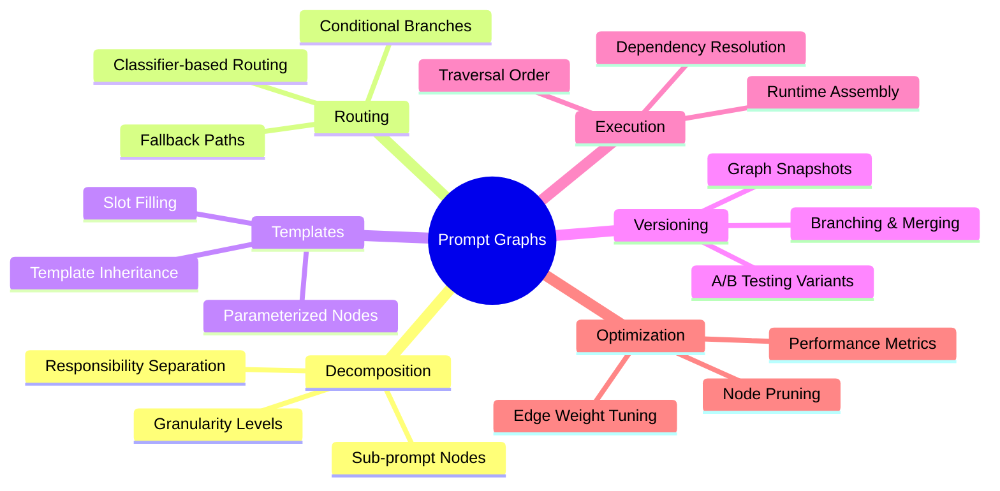
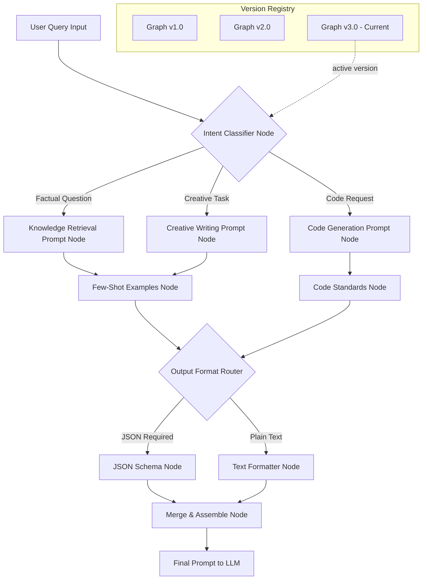
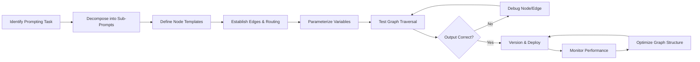
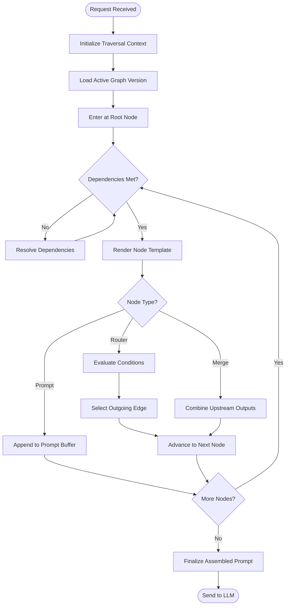
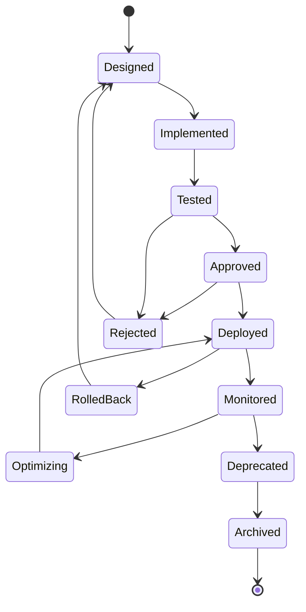
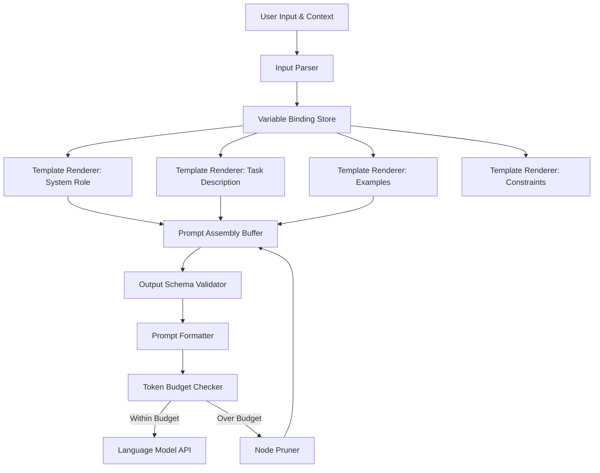
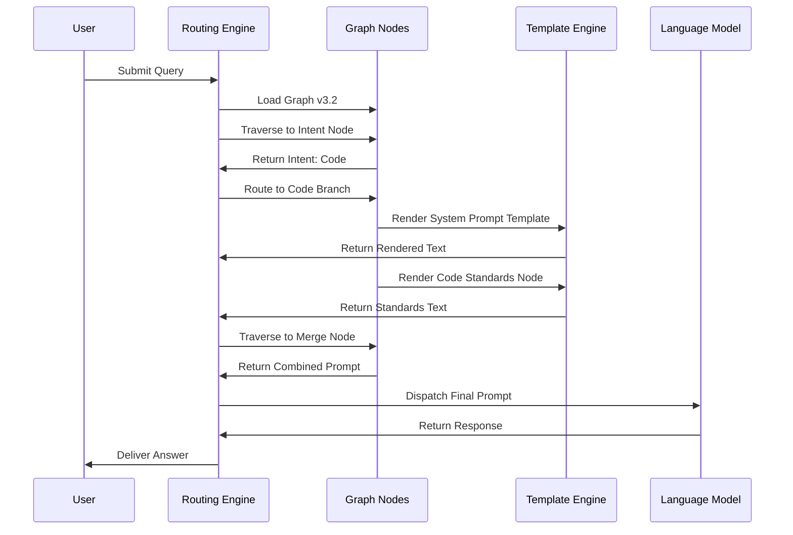

# 21 · Prompt Graphs

## 📌 Overview

Prompt Graphs represent a paradigm shift in how we design, manage, and evolve prompts for AI systems. Instead of treating prompts as flat, monolithic strings of text, prompt graphs model them as interconnected networks of nodes and edges, where each node encapsulates a discrete prompt unit and each edge defines a structural or logical relationship between them. This graph-based approach enables engineers to decompose complex prompting strategies into modular, reusable, and composable sub-prompts that can be dynamically assembled at runtime. By viewing prompts through a graph lens, teams gain visibility into how prompt components interact, how information flows through the prompting pipeline, and how changes in one part of the graph ripple across the entire system. Prompt graphs also facilitate collaborative prompt engineering by providing a shared, visual language that makes prompt architectures explicit and auditable. Whether you are building simple single-turn chatbots or sophisticated multi-agent orchestration systems, prompt graphs offer the structural clarity needed to scale prompting complexity without sacrificing maintainability or performance.

## 🎯 Learning Objectives

By studying Prompt Graphs, you will develop the ability to decompose any complex prompting task into a structured graph of interconnected sub-prompts. You will learn how to model prompt routing decisions as directed edges, enabling dynamic prompt selection based on user input, system state, or contextual signals. You will understand how to represent prompt templates as parameterized graph nodes that can be instantiated and composed at runtime. You will gain proficiency in versioning prompt graphs as evolving structures, tracking how prompt architectures change over time while preserving the ability to roll back or branch from any previous state. Finally, you will be able to design prompt graph systems that support A/B testing, prompt optimization, and continuous improvement through structured experimentation on graph variants.

## 🧠 Definition

A Prompt Graph is a directed, often acyclic, graph structure where nodes represent individual prompt units — such as system instructions, few-shot examples, formatting directives, or output schemas — and edges represent the flow of control, data, or dependency between those units. Each node in a prompt graph carries metadata including its template content, expected input type, output type, parameter slots, and performance metrics. Edges may be weighted to represent priority, conditional probability, or cost, and may carry labels that describe the transformation applied as data flows from one node to the next. A prompt graph is not merely a visualization tool; it is an executable specification that a runtime engine can traverse to assemble, render, and dispatch the final prompt to an AI model. The graph may include branching nodes that route requests along different paths, merge nodes that combine outputs from multiple sub-prompts, and terminal nodes that produce the final assembled prompt sent to the model.

## ❓ Why It Matters

As AI systems grow in complexity, prompts evolve from simple instructions into elaborate, multi-component assemblies that include role definitions, constraint sets, examples, output formatting rules, and conditional logic. Managing this complexity with flat text files or simple template strings quickly becomes unmanageable, leading to duplicated effort, inconsistent behavior, and difficult debugging. Prompt graphs matter because they introduce a principled engineering discipline to prompt design, making explicit the relationships and dependencies that are otherwise hidden in prose. They enable teams to reason about prompt architectures the same way software engineers reason about code architectures — through modularization, encapsulation, and separation of concerns. Furthermore, prompt graphs unlock advanced capabilities like conditional prompt routing, dynamic prompt composition, and systematic prompt optimization that are impractical or impossible with unstructured prompt approaches. In production environments where prompt quality directly impacts user experience and business outcomes, prompt graphs provide the governance, traceability, and agility needed to maintain high-performing AI systems at scale.

## 🏛️ Core Concepts

The core concepts of Prompt Graphs revolve around five foundational ideas. First, **prompt decomposition** breaks a monolithic prompt into discrete, single-responsibility nodes that each handle one aspect of the overall prompting task. Second, **graph topology** defines how these nodes are connected, determining the execution order, branching logic, and data flow paths through the prompt assembly process. Third, **node parameterization** allows individual prompt nodes to accept dynamic inputs, making them reusable templates rather than static text. Fourth, **edge semantics** define what happens when control or data moves from one node to another, including transformations, filtering, and conditional routing. Fifth, **graph evolution** treats the prompt graph as a living artifact that undergoes versioning, branching, merging, and optimization over its lifecycle. Together, these concepts form a coherent framework for engineering prompts as structured, maintainable, and evolvable systems rather than ad hoc collections of text.

## 🧩 Key Components

The key components of a Prompt Graph system include **prompt nodes**, which are the fundamental building blocks containing template text, variable slots, and metadata. **Routing nodes** are special decision nodes that evaluate conditions and direct flow along different graph edges based on runtime inputs. **Merge nodes** combine outputs from multiple upstream nodes, applying strategies such as concatenation, interpolation, or priority-based selection. **Edge definitions** specify source and target nodes, traversal conditions, data transformations, and optional weight or cost values. **Variable bindings** provide the runtime values that populate template slots within prompt nodes, flowing through the graph as the assembly process proceeds. **Version registries** store historical snapshots of the graph, enabling diffing, rollback, and experimental branching. Finally, **execution engines** traverse the graph at runtime, resolving node dependencies, evaluating routing conditions, rendering templates, and producing the final assembled prompt. Each component plays a distinct role in ensuring that the prompt graph is both a design-time artifact and a runtime-executable specification.

## 🧭 Mental Model

Think of a Prompt Graph as an assembly line in a sophisticated factory. Raw materials — user queries, system context, variable values — enter the line at specific stations. Each station (node) performs a dedicated operation: one station writes the system role, another adds few-shot examples, another applies output formatting rules, and yet another injects domain-specific knowledge. Conveyors (edges) transport the partially assembled prompt from station to station, with smart switches (routing nodes) sending the work down different paths depending on what type of product is being built. At the end of the line, all components come together into a finished product — the final prompt — which is then shipped to the AI model for processing. This factory analogy captures the essence of prompt graphs: modularity, sequential and parallel processing, conditional routing, quality checkpoints, and the ability to reconfigure the line for different products without rebuilding the entire factory from scratch.

## 🗺️ Mind Map

## 🏗️ Architecture Diagram

## 🔄 Workflow

## ⚙️ Internal Working

The internal working of a Prompt Graph begins when a user request enters the system and is parsed into its constituent parts — intent, entities, context, and constraints. The execution engine initializes a traversal context, setting up variable bindings and marking the entry node as the starting point. As the engine visits each node, it checks whether all input dependencies have been satisfied; if not, it waits for or triggers the resolution of those dependencies. When a node is activated, the engine renders its template by substituting variable slots with values from the traversal context. If the node is a routing node, the engine evaluates its condition expressions against the current context and selects the appropriate outgoing edge. Data produced by each node is appended to a growing prompt buffer, with merge nodes combining multiple streams according to their configured strategy. The engine continues traversing until it reaches one or more terminal nodes, at which point the assembled prompt is finalized and dispatched to the language model. Throughout this process, the engine logs traversal decisions, variable values, and timing information for debugging and optimization purposes.

## 🔀 Execution Flow

## 📊 Lifecycle

## 📡 Data Flow

## 🤝 Interaction Flow

## 🌍 Real-World Analogy

Consider a professional kitchen in a high-end restaurant. The head chef does not prepare every dish from scratch using a single recipe. Instead, the kitchen operates as a graph of specialized stations: the prep station chops vegetables, the sauce station reduces stocks, the grill station sears proteins, and the plating station assembles the final dish. Each station receives partially completed work from upstream stations (edges) and produces a refined component for downstream stations. The expediter (routing node) reads incoming tickets and directs each dish through the appropriate station sequence. Some dishes skip the grill entirely; others require a detour through the pastry station. The recipe (prompt graph) defines the station sequence, but the expediter adapts the path based on the specific order. If the kitchen introduces a new menu item, the chef adds a new station and reroutes certain orders through it — without disrupting the existing flow for other dishes. This is precisely how prompt graphs work: modular stations (nodes), directed workflows (edges), intelligent routing (decision nodes), and continuous menu evolution (versioning).

## 💡 Practical Example

Imagine building a customer support AI that handles billing questions, technical troubleshooting, and account management. A monolithic prompt would be unwieldy, attempting to cover all scenarios in one block of text. With a Prompt Graph, you create a root routing node that classifies the customer's issue into one of three branches. The billing branch includes nodes for invoice lookup, payment history retrieval, and refund policy explanation. The technical branch includes nodes for error diagnosis, solution generation, and escalation criteria. The account branch includes nodes for profile updates, subscription changes, and security verification. Each branch shares common nodes for tone-setting, PII redaction, and output formatting. When a customer asks about a billing discrepancy, the graph traverses the root classifier, routes to the billing branch, renders the relevant sub-prompts, merges them with the shared nodes, and produces a final prompt tailored to that specific interaction. If you later need to add a returns processing branch, you simply add new nodes and edges to the graph without touching the existing branches.

## 🧪 Use Cases

Prompt Graphs are valuable in any scenario where prompting complexity exceeds what a single template can handle. **Multi-intent systems** use routing graphs to direct different user intents through specialized prompt paths, ensuring each intent receives the most appropriate prompting strategy. **Prompt testing frameworks** leverage graph versioning to run A/B tests on different prompt architectures, comparing performance metrics across variants. **Enterprise prompt libraries** use graph structures to organize reusable prompt components, enabling teams to discover, share, and compose prompts across projects. **Dynamic prompt assembly** systems use graph traversal to construct prompts on-the-fly based on real-time context, user preferences, and system state. **Prompt debugging and audit** benefit from graph-based tracing, which makes it possible to pinpoint exactly which sub-prompt contributed to an undesirable model output. **Multi-model orchestration** uses prompt graphs to route different sub-tasks to different models optimized for specific capabilities, assembling a composite workflow from specialized components.

## ⚖️ Comparison

| Aspect | Flat Prompt Templates | Prompt Graphs |
|--------|----------------------|---------------|
| **Structure** | Single text block | Interconnected node network |
| **Reusability** | Copy-paste or partial includes | Nodes shared across multiple graphs |
| **Conditional Logic** | Embedded in text with if/else | Explicit routing nodes with edges |
| **Versioning** | File-level version control | Graph-level versioning with diffing |
| **Debugging** | Search through text | Trace execution path through graph |
| **Collaboration** | Hard to manage concurrent edits | Merge-aware graph versioning |
| **Scalability** | Degrades with complexity | Scales through modular decomposition |
| **Testing** | Manual prompt comparison | Systematic A/B testing on graph variants |
| **Runtime Assembly** | Static or simple templating | Dynamic traversal and composition |
| **Visibility** | Hidden dependencies | Explicit dependency graph |

## ✅ Best Practices

Design prompt graphs with clear separation of concerns, assigning each node a single, well-defined responsibility such as role definition, example provision, or output formatting. Keep nodes small and focused — a node that does too much becomes a monolith within the graph, defeating the purpose of decomposition. Use descriptive, consistent naming conventions for nodes and edges so that the graph is self-documenting and navigable by team members who did not author it. Implement comprehensive versioning from the start, tagging each graph snapshot with a semantic version number and a description of changes. Establish token budgets at both the node and graph levels to prevent runaway prompt sizes that exceed model context windows. Build routing logic on robust classifiers rather than fragile keyword matching, and always include a fallback path for unrecognized inputs. Document the expected input and output of each node, creating an implicit contract that enables independent testing and reuse. Finally, instrument the graph execution path with logging and metrics so that you can identify performance bottlenecks, unused nodes, and routing imbalances in production.

## ❌ Common Mistakes

A frequent mistake is creating overly deep graph hierarchies where simple linear chains would suffice, adding unnecessary complexity and latency without meaningful benefit. Another common error is making nodes tightly coupled to specific upstream or downstream nodes rather than designing them as interchangeable components with well-defined interfaces. Teams often neglect to implement graph-level token accounting, leading to assembled prompts that exceed model limits and produce truncated or failed responses. Failing to version the graph schema alongside the prompt content causes silent breakages when node interfaces change. Many engineers skip building fallback routes in their routing nodes, which means edge-case inputs cause the graph traversal to halt with no useful output. Another pitfall is treating the prompt graph as a purely static artifact without runtime observability, making it impossible to diagnose production issues. Finally, teams sometimes create prompt graphs that are so finely decomposed that the overhead of node traversal and template rendering exceeds the benefit of modularity, resulting in systems that are architecturally clean but practically slow.

## 🚀 Advanced Topics

Advanced Prompt Graph engineering includes **adaptive routing**, where machine learning models continuously update the routing decisions based on user feedback and outcome metrics, creating a self-improving prompt assembly system. **Prompt graph compilation** is an emerging technique where the graph is pre-processed and optimized into a flattened execution plan that reduces runtime traversal overhead. **Cross-graph composition** allows separate prompt graphs — each owned by different teams or services — to be composed into larger meta-graphs, enabling organization-wide prompt reuse. **Prompt graph mutation testing** applies software engineering mutation testing concepts to prompts, systematically altering nodes and edges to verify that the graph's behavior changes as expected. **Semantic graph differencing** goes beyond structural comparison to understand how the meaning and behavior of a prompt graph changes between versions, enabling more intelligent code review of prompt modifications. **Real-time graph optimization** uses reinforcement learning to adjust edge weights, node ordering, and routing thresholds based on live performance signals, creating prompt graphs that continuously evolve toward optimal configurations without manual intervention.
