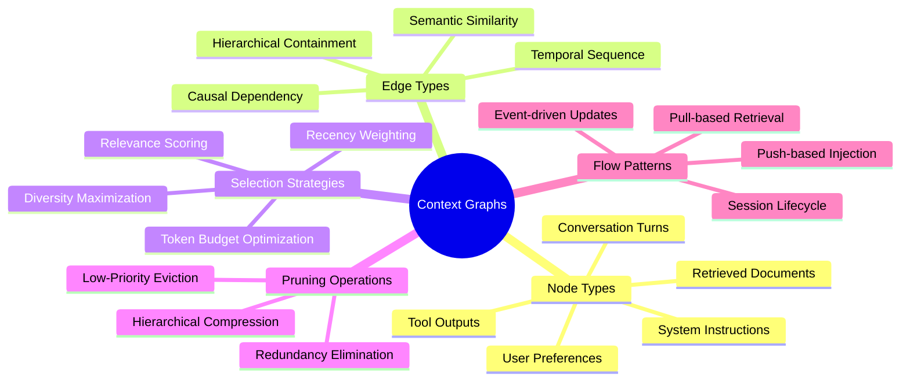
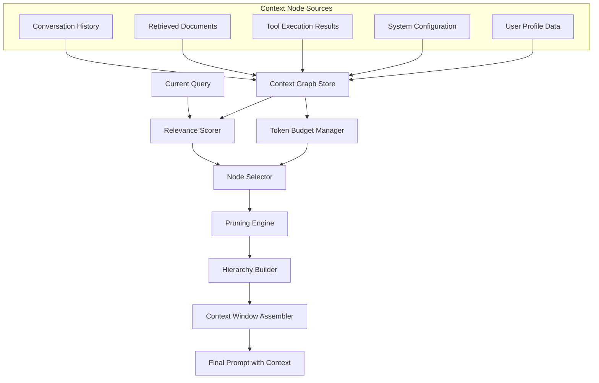
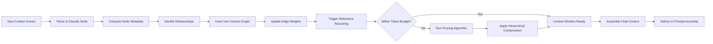
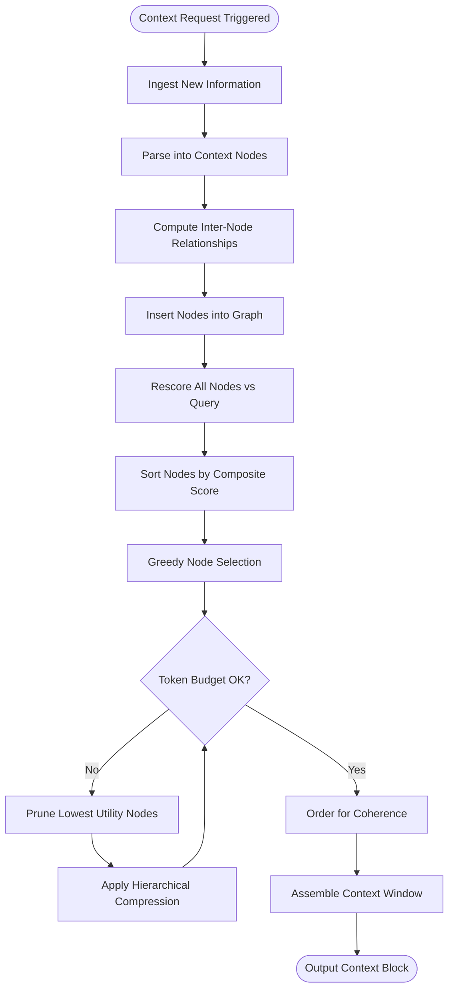
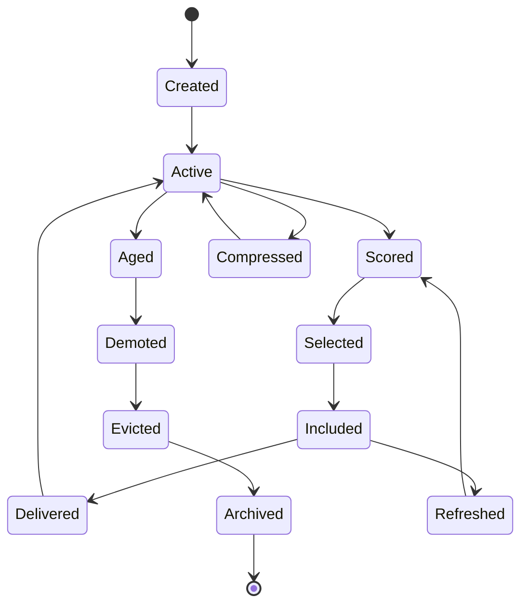
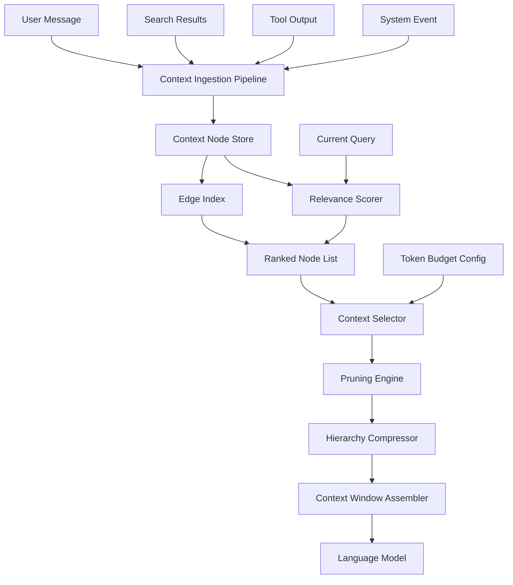
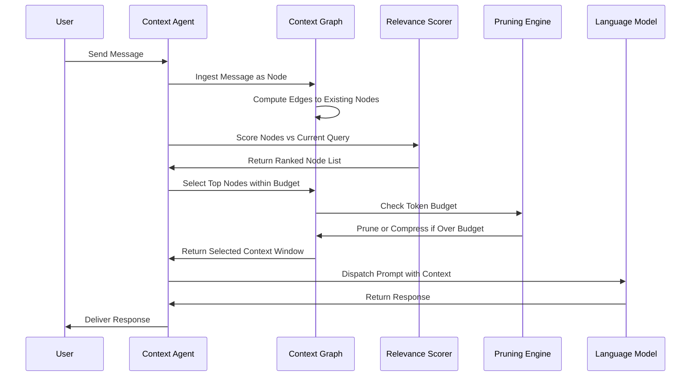

# 22 · Context Graphs

## 📌 Overview

Context Graphs provide a structured framework for modeling, managing, and optimizing the contextual information that AI systems consume during inference. Rather than treating context as a flat sequence of tokens appended to a prompt, context graphs represent contextual elements — documents, conversation turns, retrieved passages, system instructions, and user preferences — as nodes in an interconnected graph. Edges between these nodes capture semantic relationships, temporal ordering, relevance scores, and dependency chains that define how context elements relate to each other and to the current task. This graph-based representation enables sophisticated context selection strategies that go beyond simple recency or keyword matching, allowing systems to traverse the context graph to identify the most relevant, diverse, and coherent subset of information for any given query. Context graphs are especially critical in production AI systems where the available context frequently exceeds model capacity, requiring intelligent pruning and prioritization to deliver optimal performance within finite context windows.

## 🎯 Learning Objectives

By studying Context Graphs, you will learn to model diverse contextual information sources as a unified graph structure with typed nodes and weighted edges. You will understand how to implement context window management as a graph traversal problem, selecting and ordering context nodes based on relevance, recency, diversity, and token cost. You will develop the ability to design context pruning algorithms that operate on graph topology, removing less important nodes while preserving the connectivity and coherence of the remaining context. You will gain proficiency in building hierarchical context graphs that organize information at multiple levels of abstraction, from broad topic summaries down to specific factual details. You will also learn to implement context flow patterns that define how information enters, moves through, and exits the context graph across a conversation or workflow.

## 🧠 Definition

A Context Graph is a weighted, often dynamic, graph structure where nodes represent discrete units of contextual information and edges represent the relationships, dependencies, and relevance connections between those units. Each node carries metadata including its content, source type, creation timestamp, token count, access frequency, and relevance score relative to the current query. Edges may be typed to distinguish between different relationship kinds such as temporal succession, semantic similarity, causal dependency, hierarchical containment, or conversational adjacency. The context graph serves as the authoritative representation of all information available to the AI system at a given point in time, and the process of constructing a prompt's context window is modeled as a traversal and selection operation on this graph. Unlike static knowledge graphs, context graphs are highly ephemeral and task-specific, being assembled, queried, and discarded within the scope of a single interaction or session, though persistent context graphs may span longer-lived sessions.

## ❓ Why It Matters

The quality of context fed to an AI model is often more consequential than the prompt itself, yet most systems handle context through crude heuristics like taking the last N messages or top K search results. Context Graphs matter because they replace these heuristics with a principled, graph-theoretic approach to context management that maximizes the information value delivered within limited token budgets. As models grow more capable, the bottleneck shifts from model intelligence to context quality — a brilliant model given irrelevant context produces poor results, while a simpler model given precisely the right context can outperform it. Context graphs enable systems to reason about trade-offs between recency and relevance, between breadth and depth, and between diversity and focus. They provide the infrastructure needed for multi-source context fusion, where information from databases, search engines, conversation history, and real-time sensors must be combined into a coherent whole. In enterprise settings where context governance, auditability, and cost optimization are critical, context graphs provide the visibility and control mechanisms that flat context approaches cannot.

## 🏛️ Core Concepts

The foundational concepts of Context Graphs include five key ideas. **Context nodes** are the atomic units of contextual information, each self-describing with content, type, metadata, and relevance indicators. **Edge semantics** define the nature of relationships between context nodes, distinguishing between temporal ordering, semantic similarity, causal links, and hierarchical containment. **Graph traversal for selection** is the process of walking the context graph to identify the optimal subset of nodes to include in the context window, using algorithms that balance relevance, diversity, and token cost. **Context pruning** removes nodes from the graph or from the selected subset based on importance scores, redundancy elimination, and budget constraints. **Hierarchical context** organizes nodes at multiple levels of abstraction, allowing the system to include high-level summaries when token budgets are tight and drill into specific details when space permits. Together, these concepts enable a sophisticated approach to context management that treats context as a first-class engineering artifact rather than an afterthought.

## 🧩 Key Components

The key components of a Context Graph system include **node stores** that maintain the collection of context nodes with their full metadata, supporting efficient insertion, update, and retrieval operations. **Edge indexes** capture the relationships between nodes, supporting fast lookup of related nodes by edge type and weight. **Relevance scorers** compute how relevant each context node is to the current query or task, producing scores that drive selection and ordering decisions. **Token budget managers** track the total token count of selected context nodes and enforce capacity constraints, triggering pruning when budgets are exceeded. **Traversal algorithms** implement the logic for walking the graph to select context, whether through breadth-first expansion from the query node, greedy selection of highest-scoring nodes, or more sophisticated graph-based ranking methods. **Hierarchy builders** construct multi-level summaries of context nodes, creating abstract representations that can substitute for detailed nodes when space is limited. **Context flow controllers** define the lifecycle of context nodes — when they are added, how they age, when they are promoted or demoted in priority, and when they are evicted. Each component works in concert to maintain a living context graph that adapts continuously to the evolving demands of the interaction.

## 🧭 Mental Model

Imagine a personal librarian who maintains an elaborate card catalog of every book, article, note, and conversation you have ever had. When you ask a question, the librarian does not simply hand you the most recent books. Instead, they consult their catalog, identify the most relevant entries, trace connections between related topics, and assemble a custom reading packet that gives you exactly the information you need — no more, no less. If you have limited reading time (a token budget), the librarian provides executive summaries of less critical books and full text of the most important ones. As your question evolves, the librarian dynamically updates the reading packet, adding new relevant sources and removing ones that are no longer needed. The card catalog is the context graph, the librarian's selection process is graph traversal, and the reading packet is the assembled context window delivered to the AI model.

## 🗺️ Mind Map

## 🏗️ Architecture Diagram

## 🔄 Workflow

## ⚙️ Internal Working

The internal working of a Context Graph system operates in a continuous cycle of ingestion, scoring, selection, and delivery. When new contextual information arrives — whether from a user message, a database query result, a tool invocation, or a system event — the system parses it into a structured context node with appropriate typing, metadata extraction, and initial relevance estimation. The node is then inserted into the context graph, and the system identifies existing nodes that are semantically related, temporally adjacent, or hierarchically connected, creating or updating edges accordingly. Each edge receives a weight reflecting the strength of the relationship, which may be computed from semantic similarity scores, temporal distance, or explicit dependency declarations. When the AI system needs to generate a response, the relevance scorer evaluates every node in the graph against the current query, producing a ranked list. The node selector then walks this ranked list, adding nodes to the context window until the token budget is exhausted. If the budget is exceeded, the pruning engine removes nodes with the lowest marginal utility, potentially replacing detailed nodes with their hierarchical summaries. The assembled context window is then ordered for optimal coherence — typically placing the most structurally important nodes near the beginning where they receive more model attention — and delivered to the prompt assembly system.

## 🔀 Execution Flow

## 📊 Lifecycle

## 📡 Data Flow

## 🤝 Interaction Flow

## 🌍 Real-World Analogy

Think of a Context Graph as the mission control dashboard used by air traffic controllers. Each aircraft in the airspace is a context node, carrying information about its position, altitude, speed, destination, and fuel level. The relationships between aircraft — proximity conflicts, sequencing requirements, handoff dependencies — are the edges. The controller's attention span is the token budget: they can only actively track and manage a limited number of aircraft at once. When a new aircraft enters the airspace, the controller evaluates its priority relative to all other aircraft, potentially de-prioritizing or handing off less critical aircraft to maintain situational awareness. If the airspace becomes congested, the controller applies hierarchical compression — tracking aircraft groups by sector rather than individually. The dashboard continuously updates, with aircraft nodes being added, updated, and removed as they land or depart. This is exactly how a context graph operates: managing a dynamic set of information nodes within finite attention capacity, continuously prioritizing and restructuring to deliver the most critical information at every moment.

## 💡 Practical Example

Consider an AI-powered legal research assistant that helps lawyers analyze case law. Each case, statute, regulation, and client note becomes a node in the context graph. Edges connect cases that cite each other, statutes that amend each other, and notes that reference specific legal concepts. When a lawyer asks about the enforceability of a non-compete clause, the relevance scorer evaluates every node against this query, identifying directly relevant cases, related statutes, and the client's contractual notes. The node selector assembles a context window that includes the most on-point case law first, followed by supporting statutes, and then relevant client notes. If the total token count exceeds the model's context window, the pruning engine replaces full case texts with judicial summaries for lower-priority cases while preserving full text for the most critical rulings. As the lawyer asks follow-up questions, the context graph dynamically adjusts — promoting cases that become more relevant and demoting those that were useful for the initial question but not the follow-up. This ensures the AI always has the most pertinent legal context available without overwhelming the model.

## 🧪 Use Cases

Context Graphs are essential in any AI application where the available information exceeds the model's capacity to process it. **Conversational AI systems** use context graphs to manage long conversations, maintaining relevant history while pruning stale turns. **Retrieval-augmented generation** systems build context graphs from search results, organizing retrieved passages by relevance, diversity, and complementary information. **Multi-agent systems** use context graphs to share and prioritize information between agents, ensuring each agent receives the context most relevant to its specialized task. **Enterprise knowledge assistants** maintain persistent context graphs that span multiple sessions, accumulating organizational knowledge and surfacing it when needed. **Real-time decision support** systems use context graphs to fuse information from multiple data streams — sensor data, market feeds, news alerts — into a coherent contextual picture. **Educational AI tutors** build context graphs that track a student's learning progress, misconceptions, and knowledge gaps, adapting the contextual support provided with each interaction.

## ⚖️ Comparison

| Aspect | Flat Context Window | Context Graphs |
|--------|--------------------| ---------------|
| **Structure** | Linear sequence of tokens | Graph with typed nodes and edges |
| **Selection** | Chronological or top-K | Relevance-weighted graph traversal |
| **Relationships** | Implicit from ordering | Explicit edges with semantic types |
| **Pruning** | Drop oldest or lowest scored | Topology-aware pruning preserving coherence |
| **Multi-Source** | Concatenation with separators | Fused graph with source-typed nodes |
| **Budget Control** | Simple token counting | Hierarchical compression with graceful degradation |
| **Diversity** | Not explicitly managed | Graph-based diversity maximization |
| **Adaptability** | Static per request | Dynamic re-scoring and re-selection |
| **Debugging** | Hard to trace which context mattered | Full provenance trail through graph |
| **Evolution** | Stateless between requests | Persistent graph with aging and promotion |

## ✅ Best Practices

Design context node schemas that capture rich metadata beyond raw content, including source type, confidence score, temporal validity, and access patterns. Implement relevance scoring as a composite function that balances multiple signals — semantic similarity, recency, source authority, and user-specific personalization — rather than relying on a single ranking criterion. Establish clear token budget policies at the graph level, defining how the budget is allocated across different context node types and how graceful degradation works when budgets are tight. Build hierarchical summaries proactively rather than computing them on-demand, so that compressed representations are always available when pruning is triggered. Use edge weights to prevent redundant context — when two nodes are strongly connected by a similarity edge, include only the higher-scoring one to maximize information diversity. Implement context aging policies that gradually reduce the relevance score of stale nodes, preventing outdated information from persisting in the context window. Log every selection and pruning decision with full provenance so that you can audit why specific context was included or excluded for any given model response. Finally, design the context graph to be query-adaptive, recomputing relevance scores whenever the user's intent shifts significantly during a conversation.

## ❌ Common Mistakes

A common mistake is building context graphs that are too densely connected, where every node is linked to every other node with high-weight edges, which reduces the graph's ability to discriminate between truly relevant and merely related information. Another frequent error is using only semantic similarity for edge weights, ignoring temporal relevance and causal dependencies that are often more important for task-oriented context. Teams often implement pruning as a simple truncation of the lowest-scored nodes, which can remove critical supporting context that provides necessary background even if it does not directly match the query. Neglecting to implement context deduplication leads to the same information appearing in multiple nodes, wasting precious token budget on redundant content. Many systems fail to account for the position bias of language models, which attend more strongly to information at the beginning and end of the context window, resulting in suboptimal node ordering. Another pitfall is treating the context graph as purely ephemeral and rebuilding it from scratch for each request, discarding valuable structural information about node relationships that were computed in previous turns. Finally, teams sometimes set token budgets too conservatively, underutilizing the model's context capacity and leaving performance on the table.

## 🚀 Advanced Topics

Advanced Context Graph engineering includes **dynamic graph embeddings**, where nodes and edges are represented as learned vectors that capture nuanced semantic relationships beyond what explicit edge types can express. **Attention-weighted context selection** uses the model's own attention patterns from previous turns to inform which context nodes are most useful, creating a feedback loop between model behavior and context selection. **Multi-modal context graphs** extend the framework beyond text to include images, audio, structured data, and code as first-class node types with specialized relevance scoring and compression strategies. **Context graph cascading** chains multiple context graphs together, where the output context window of one graph becomes an input node to a downstream graph, enabling hierarchical context refinement across multiple processing stages. **Predictive context pre-loading** analyzes the conversation trajectory to predict what context will be needed in upcoming turns, pre-assembling context windows before the user even asks. **Federated context graphs** allow multiple organizations or services to contribute context nodes to a shared graph while maintaining privacy boundaries, enabling collaborative AI systems that leverage distributed knowledge without exposing sensitive information.