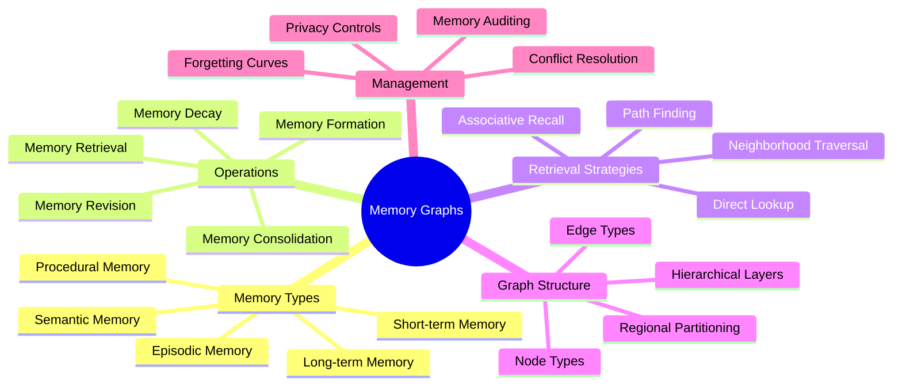
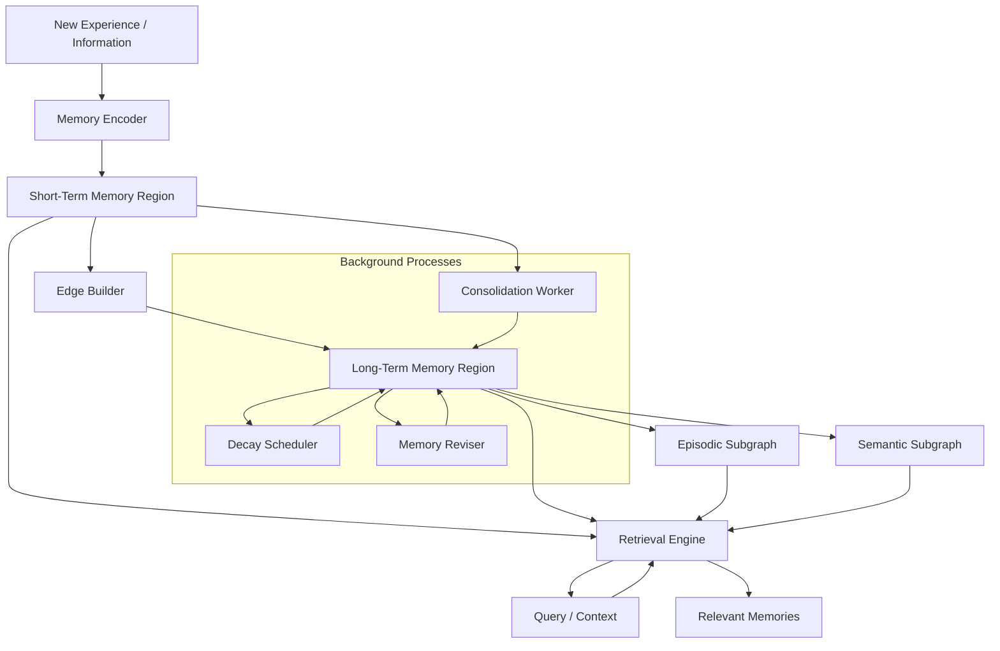
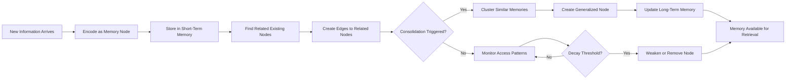
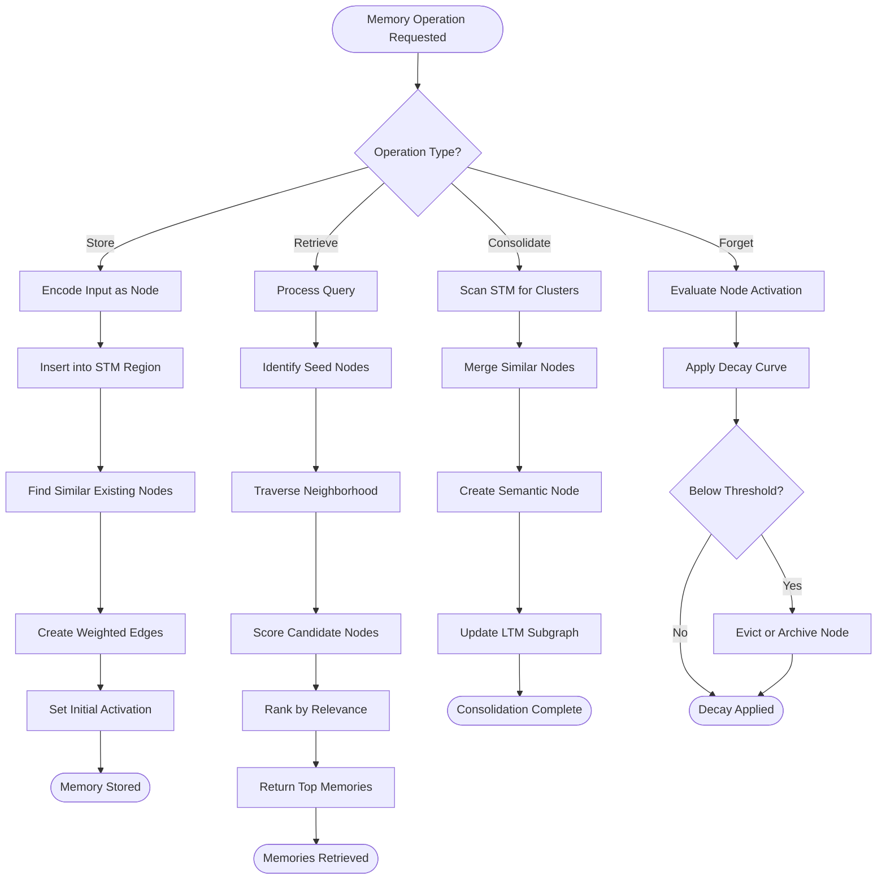
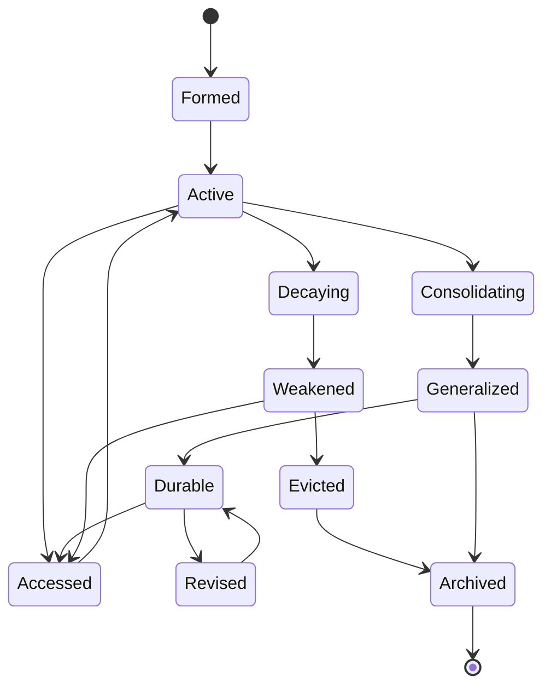
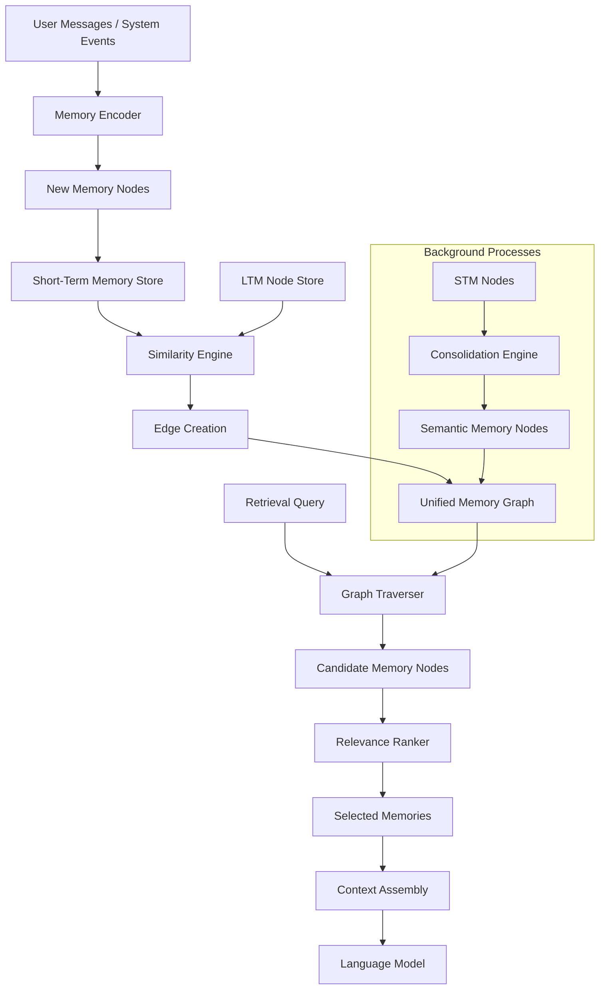
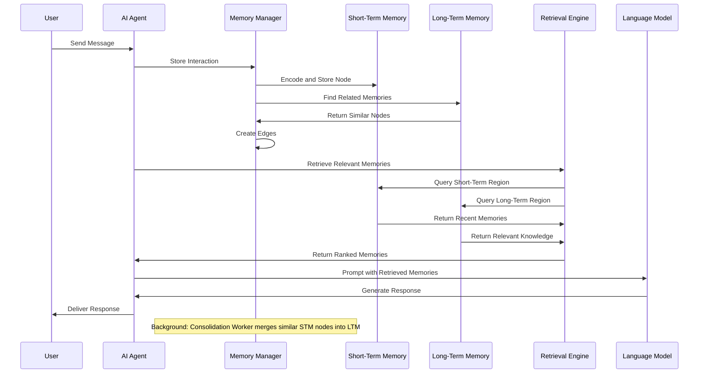

# 23 · Memory Graphs

## 📌 Overview

Memory Graphs provide a principled architecture for designing AI memory systems as interconnected graph structures rather than flat storage mechanisms. In graph-based memory, every piece of information the AI system encounters, generates, or infers becomes a node in a persistent graph, connected to related nodes through typed edges that capture semantic relationships, temporal sequences, causal chains, and hierarchical abstractions. This approach mirrors how human memory actually functions — not as a database of independent records, but as a web of interconnected experiences, facts, and concepts where meaning emerges from the relationships between elements. Memory graphs enable AI systems to build rich, persistent models of their operational domain, supporting capabilities like recalling specific past interactions, generalizing from repeated experiences, maintaining coherent identity over time, and reasoning about accumulated knowledge. As AI systems evolve from stateless request-response tools into persistent agents that operate over days, weeks, and months, memory graphs become the essential infrastructure that gives these agents the continuity and depth of understanding needed to act intelligently across extended timeframes.

## 🎯 Learning Objectives

By studying Memory Graphs, you will learn to design AI memory systems as structured graph architectures with distinct regions for different memory types and access patterns. You will understand how to model short-term and long-term memory as separate but connected subgraphs with different persistence, access speed, and capacity characteristics. You will develop the ability to implement memory retrieval as graph traversal, using relevance scoring, path-finding, and neighborhood exploration to efficiently locate the most useful memories for any given situation. You will gain proficiency in designing memory consolidation processes that transform raw experiential memories into generalized knowledge structures. You will learn to distinguish between episodic memory graphs that capture specific experiences and semantic memory graphs that capture generalized knowledge, and you will understand how to maintain both while keeping them synchronized. Finally, you will be able to design memory systems that support forgetting, decay, and revision — essential capabilities for maintaining memory quality over time.

## 🧠 Definition

A Memory Graph is a persistent, evolving graph structure where nodes represent discrete units of stored information — facts, experiences, inferences, preferences, procedures, and relationships — and edges represent the connections between these units that give them meaning and context. Each memory node carries rich metadata including its creation timestamp, access frequency, confidence level, source attribution, and emotional or importance weighting. Edges are typed to distinguish between different kinds of relationships such as temporal succession, causal influence, semantic similarity, hierarchical containment, and associative linkage. The memory graph is organized into distinct regions that correspond to different memory systems: a volatile short-term memory region for recent, high-frequency access; a durable long-term memory region for persistent knowledge; an episodic subgraph for experience narratives; and a semantic subgraph for generalized concepts and facts. Memory retrieval is modeled as graph traversal, where the system navigates from a query node through the graph structure to locate relevant memories, following edges weighted by relevance, recency, and importance. The graph evolves continuously through memory formation, consolidation, decay, and revision processes that add, merge, weaken, and remove nodes and edges over time.

## ❓ Why It Matters

Memory is the missing ingredient that transforms AI from a stateless function into a persistent agent capable of learning, adapting, and building relationships over time. Without memory, every interaction starts from zero, forcing users to repeat context and preventing the AI from building on previous work. Memory Graphs matter because they provide the structural foundation for persistent, scalable, and queryable AI memory that goes beyond simple conversation history logs. Flat memory approaches — storing conversations as linear sequences or key-value pairs — fail to capture the rich web of relationships between memories that enables intelligent recall and reasoning. A user who mentioned their dietary restrictions in January should have that preference automatically applied when asking for restaurant recommendations in July, but only if the memory system can connect those two interactions through a meaningful relationship. Memory graphs enable this by making relationships explicit and traversable. They also provide the infrastructure for memory management operations like consolidation, where repeated similar experiences are merged into a single generalized memory, and forgetting, where stale or disconfirmed memories are gradually weakened and eventually removed. In production AI systems, memory quality directly impacts user trust, personalization depth, and long-term engagement, making memory graph design a critical engineering concern.

## 🏛️ Core Concepts

The core concepts of Memory Graphs center on six foundational principles. **Memory nodes** are the atomic units of stored information, each encapsulating a self-contained piece of knowledge or experience with full provenance and metadata. **Memory edges** define the relational fabric that connects nodes, enabling traversal-based retrieval and enabling the system to reason about relationships between memories. **Memory regions** partition the graph into zones with different persistence, access, and capacity characteristics, most notably short-term versus long-term memory. **Memory retrieval** is the process of locating relevant memories through graph traversal, using the query as a starting point and following edges to explore the neighborhood of related memories. **Memory consolidation** is the background process of transforming raw, specific memories into generalized, durable knowledge structures, mirroring the biological process of memory consolidation during sleep. **Memory decay and forgetting** are the processes by which unused or disconfirmed memories gradually weaken and are eventually removed, preventing the memory graph from becoming bloated with stale or contradictory information. Together, these concepts form a comprehensive framework for engineering AI memory systems that are both powerful and maintainable.

## 🧩 Key Components

The key components of a Memory Graph system include **memory stores** that persist graph data across sessions, supporting both fast read access for retrieval and efficient write operations for memory formation. **Memory encoders** transform raw inputs — user messages, system observations, tool results — into structured memory nodes with appropriate typing and metadata. **Edge builders** analyze new memories in relation to existing ones, creating edges that capture semantic similarity, temporal adjacency, causal relationships, and associative links. **Retrieval engines** implement graph traversal algorithms that locate relevant memories for a given query, supporting multiple retrieval strategies including direct lookup, neighborhood expansion, path-finding, and associative recall. **Consolidation workers** operate asynchronously to identify clusters of similar memories and merge them into generalized knowledge nodes, updating edges accordingly. **Decay schedulers** implement forgetting curves that gradually reduce the activation strength of infrequently accessed memories, eventually triggering eviction when strength falls below a threshold. **Memory managers** provide the high-level API that other system components use to store, retrieve, update, and delete memories, abstracting the graph complexity behind clean interfaces. **Memory visualizers** provide graphical representations of the memory graph for debugging and monitoring, helping engineers understand what the AI remembers and why.

## 🧭 Mental Model

Think of a Memory Graph as a vast, ever-growing city map of an AI's experiences and knowledge. Each building on the map is a memory node — some are skyscrapers representing deeply learned, frequently accessed knowledge, while others are small shops representing minor, rarely recalled details. Roads connect the buildings, representing the relationships between memories. A main boulevard might connect a series of conversation memories in chronological order, while side streets link related concepts regardless of when they were encountered. The city has a bustling downtown (short-term memory) where recent, active memories are densely packed and easily accessible, and quieter suburbs (long-term memory) where older, consolidated knowledge resides in well-organized neighborhoods. City planners (consolidation workers) periodically renovate the suburbs, merging similar buildings and improving road connections. Demolition crews (decay schedulers) tear down abandoned buildings that nobody visits anymore, keeping the city from becoming a sprawling, unmaintainable mess. When the AI needs to recall something, it starts at the relevant downtown location and follows the roads to explore the neighborhood, gathering related memories along the way.

## 🗺️ Mind Map

## 🏗️ Architecture Diagram

## 🔄 Workflow

## ⚙️ Internal Working

The internal working of a Memory Graph system follows a continuous cycle of formation, organization, retrieval, and maintenance. When new information enters the system, the memory encoder transforms it into a structured node, assigning a type, extracting key entities and concepts, computing an embedding vector for similarity matching, and attaching metadata such as timestamp, source, and initial importance score. The new node is first placed in the short-term memory region, where it receives high activation and is immediately available for retrieval. The edge builder then compares the new node against existing long-term memory nodes, computing similarity scores and identifying potential relationships. Edges are created to nodes that exceed a similarity threshold, with edge weights proportional to the strength of the relationship. The consolidation worker periodically scans the short-term memory region for clusters of similar nodes that represent repeated or related experiences. When a cluster is identified, the worker creates a generalized semantic node that captures the common patterns, creates edges from the semantic node to the original episodic nodes, and may reduce the activation of the originals to conserve resources. The retrieval engine operates on demand, accepting a query and traversing the graph from the most directly relevant nodes outward, following edges in order of weight and collecting nodes that exceed a relevance threshold. The decay scheduler runs as a background process, tracking access frequency for each node and applying a forgetting curve that gradually reduces activation. Nodes that fall below a minimum activation threshold are marked for eviction, though they may be archived rather than permanently deleted to support potential future recovery.

## 🔀 Execution Flow

## 📊 Lifecycle

## 📡 Data Flow

## 🤝 Interaction Flow

## 🌍 Real-World Analogy

Consider how a seasoned doctor's memory works over a decades-long career. Early in their career, every patient encounter is a vivid episodic memory — they remember specific details about individual cases, the conversations, the outcomes. Over time, these individual experiences consolidate into semantic knowledge: they no longer remember specific patient John Smith from 2015, but they have internalized the general pattern of symptoms, diagnosis, and treatment for his condition. Their memory has a short-term component — the current patient's chart they are reviewing right now — and a long-term component built from thousands of consolidated experiences. When a new patient presents with unusual symptoms, the doctor does not scan through every patient they have ever seen. Instead, they start from the most relevant general knowledge (semantic memory) and follow associative links to related conditions, complications, and treatments (graph traversal). If the case is particularly unusual or emotionally significant, it may remain as a vivid episodic memory for years, while routine cases fade from specific recall. This is precisely how a memory graph operates: forming specific memories, consolidating them into general knowledge, supporting associative retrieval, and gracefully forgetting what is no longer needed.

## 💡 Practical Example

Imagine a personal AI assistant that helps a user manage their professional life over several years. Every meeting, email summary, project update, and decision becomes a memory node in the graph. Short-term memory holds the current week's interactions with high activation. When the user mentions a project name, the retrieval engine finds the project node and traverses its edges to pull in related meeting notes, stakeholder preferences, past decisions, and current status. Over months, the consolidation worker notices that the user consistently prefers morning meetings and avoids Friday deadlines — these patterns are consolidated into preference nodes in the semantic memory subgraph. When the user asks the AI to schedule a new project kickoff, the AI retrieves the user's scheduling preferences, the typical kickoff format from past projects, and the identities of usual stakeholders — all located through graph traversal from the project and preference nodes. If the user later changes their preference from mornings to afternoons, the memory reviser updates the preference node and adjusts its edge weights, ensuring future retrievals reflect the updated preference. Old episodic memories about morning meetings gradually decay, while the new afternoon preference strengthens through repeated reinforcement.

## 🧪 Use Cases

Memory Graphs are essential for any AI system that needs to maintain persistent knowledge across sessions and interactions. **Personal AI assistants** use memory graphs to remember user preferences, past conversations, and learned patterns, providing increasingly personalized support over time. **Customer service agents** maintain memory graphs of customer interaction histories, enabling continuity across support sessions and representatives. **Research assistants** build memory graphs of explored literature, experimental results, and evolving hypotheses, supporting long-running research projects. **Educational tutors** maintain memory graphs of student learning progress, misconceptions, and mastery levels across courses and semesters. **Creative collaborators** use memory graphs to remember the evolving narrative, character details, and world-building decisions in long-form creative projects like novels or game design. **Autonomous agents** operating in complex environments build memory graphs of their experiences, enabling them to learn from past actions and avoid repeating mistakes. **Organizational knowledge systems** use memory graphs to capture institutional knowledge, decision rationale, and project history in a queryable, interconnected format that survives employee turnover.

## ⚖️ Comparison

| Aspect | Flat Memory / History | Memory Graphs |
|--------|----------------------|---------------|
| **Structure** | Linear log or key-value store | Interconnected graph with typed nodes and edges |
| **Recall** | Sequential scan or exact key match | Graph traversal with relevance scoring |
| **Relationships** | Implicit from ordering | Explicit edges with semantic types |
| **Consolidation** | Not supported | Automatic clustering and generalization |
| **Forgetting** | Manual deletion or time-based expiration | Activation-based decay with graceful weakening |
| **Personalization** | Template-based substitution | Rich contextual recall through associative traversal |
| **Conflict Resolution** | Last write wins | Graph-based conflict detection and resolution |
| **Scalability** | Degrades linearly with history | Scales through consolidation and hierarchical organization |
| **Query Flexibility** | Limited to exact or keyword match | Supports associative, temporal, causal, and hierarchical queries |
| **Persistence** | All-or-nothing retention | Graduated persistence from volatile to permanent |

## ✅ Best Practices

Design memory node schemas that capture not just content but provenance, confidence, and context of formation, enabling the system to reason about the reliability and relevance of its own memories. Implement clear boundaries between memory regions — short-term memory should have fast access, limited capacity, and automatic expiration, while long-term memory should be durable, consolidated, and efficiently indexed. Use edge types consistently and document their semantics, as the quality of retrieval depends entirely on the quality of the relational structure connecting memories. Build consolidation as a continuous background process rather than a batch operation, ensuring that memories are generalized while they are still fresh enough for accurate pattern extraction. Implement graceful forgetting with configurable decay curves rather than hard deletion, allowing the system to gradually de-prioritize stale information while preserving the option of recovery. Design retrieval to return not just individual memories but connected subgraphs, providing the AI with relational context that makes individual memories more useful. Establish memory auditing capabilities that allow users to inspect, correct, and delete their memories, which is both an ethical requirement and a practical quality control mechanism. Finally, monitor memory graph health metrics — node count growth rate, edge density, retrieval latency, consolidation ratio — to detect structural problems before they impact system performance.

## ❌ Common Mistakes

A frequent mistake is treating memory graphs as simple append-only logs, adding nodes without creating meaningful edges, which reduces the graph to an expensive set with no relational value. Another common error is implementing retrieval as a single-hop lookup that only finds directly connected nodes, missing the richer context available through multi-hop traversal. Teams often neglect consolidation entirely, allowing the memory graph to grow unboundedly with redundant and overlapping nodes that degrade retrieval quality and increase costs. Failing to implement decay and forgetting leads to memory graphs that accumulate contradictory information over time, as the system remembers outdated preferences, corrected factual errors, and obsolete procedures alongside current accurate information. Many systems use a one-size-fits-all approach to memory persistence, applying the same retention policies to critical user preferences and trivial conversational filler, which wastes storage on low-value memories while risking loss of important ones. Another pitfall is making memory operations synchronous and blocking, which adds unacceptable latency to the user interaction path; memory formation and consolidation should be asynchronous whenever possible. Finally, teams often build memory graphs without user visibility or control, creating a black box that users cannot inspect or correct, which erodes trust and makes it impossible to fix erroneous memories that degrade system performance over time.

## 🚀 Advanced Topics

Advanced Memory Graph engineering includes **hierarchical memory architectures** that organize memories at multiple levels of abstraction — from raw experience nodes at the base, through pattern nodes in the middle, to principle nodes at the top — enabling the AI to reason at the appropriate level of generality for any given task. **Memory graph embeddings** represent the entire graph structure as a continuous vector space, enabling neural retrieval methods that can find relevant memories even when explicit edge connections do not exist. **Counterfactual memory** extends the graph to include not just what happened but what could have happened, storing alternative outcomes and reasoning paths that enable the AI to explore hypotheticals and avoid repeating past mistakes. **Distributed memory graphs** span multiple AI agents or services, with each agent maintaining a local memory graph that selectively synchronizes with a shared global graph, enabling collaborative memory while preserving privacy and autonomy. **Emotional memory weighting** attaches affective signals to memory nodes, allowing the system to prioritize emotionally significant experiences and use emotional context to improve retrieval relevance. **Memory graph reflection** is a meta-cognitive process where the AI periodically examines its own memory graph, identifying gaps in knowledge, inconsistencies between memories, and areas of uncertainty, then proactively seeks to fill those gaps through targeted information gathering or consolidation. **Temporal memory reasoning** enables the AI to reason about how its knowledge has changed over time, understanding not just what it knows but when it learned it, what it believed before, and how its understanding has evolved, providing a foundation for intellectual humility and uncertainty-aware reasoning.