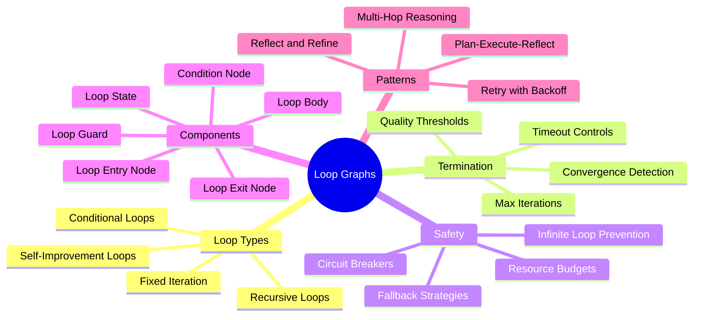
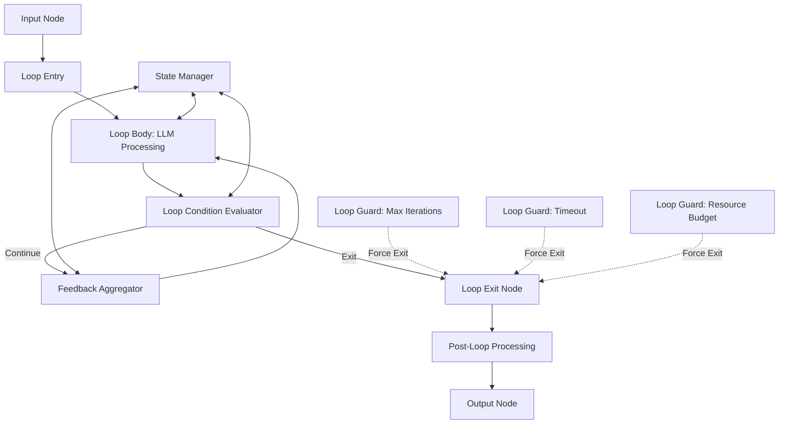
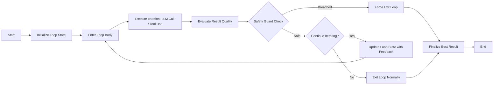
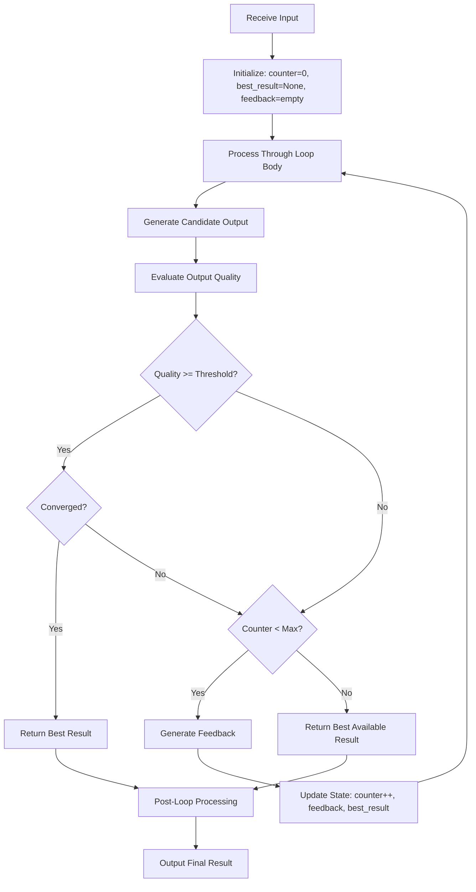
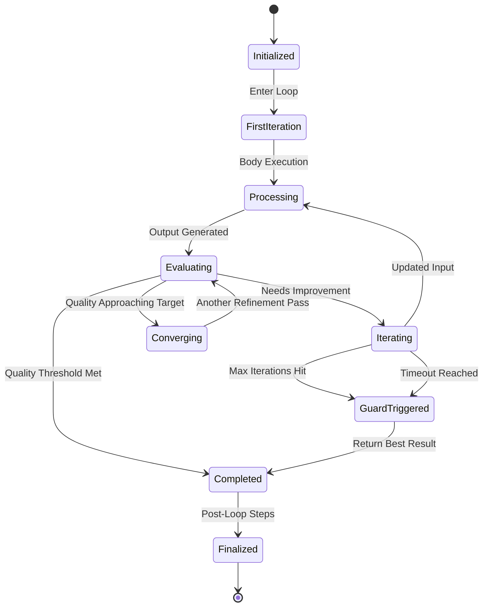
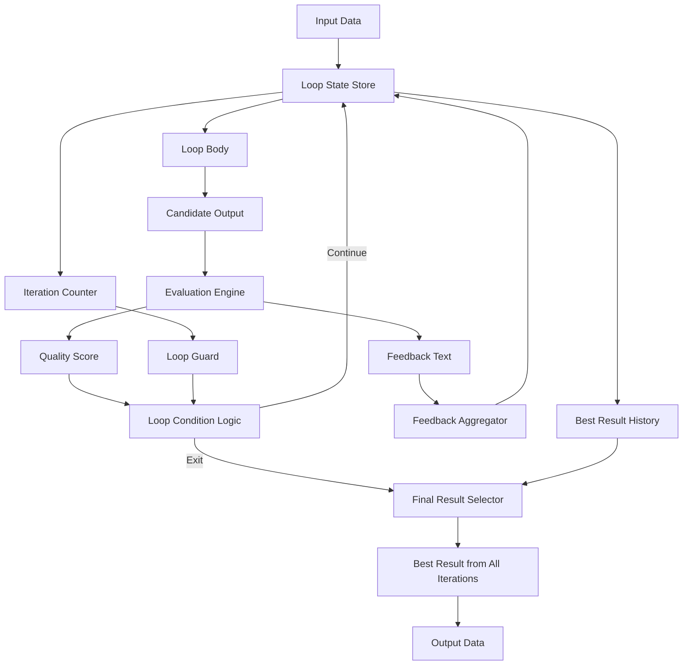
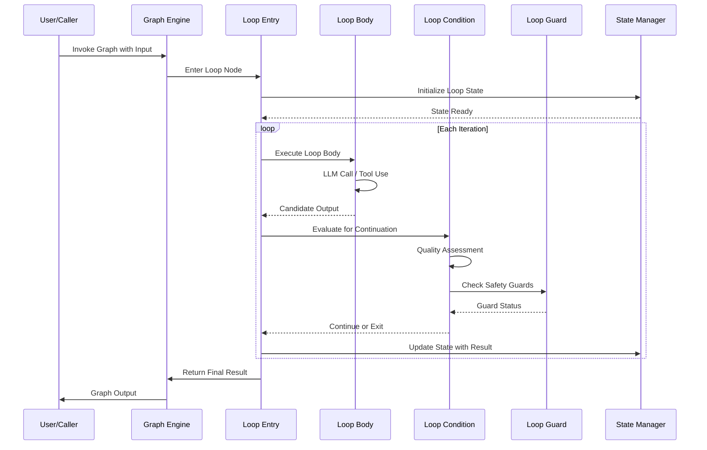

# Loop Graphs

## 📌 Overview

Loop graphs represent one of the most critical and conceptually rich structures in graph-based AI engineering. Unlike linear or branching graph structures, loop graphs introduce cyclic paths where computation, reasoning, or data processing can revisit previous nodes, creating feedback mechanisms that are essential for iterative refinement, self-correction, and adaptive behavior in AI systems. These cycles are not flaws in the graph design; they are intentional architectural features that enable AI agents to improve their outputs through repeated passes over the same or modified data. In the context of graph engineering, understanding how to design, control, and reason about loops is what separates brittle single-pass systems from resilient, self-improving AI pipelines. Loop graphs form the backbone of many advanced AI patterns including reflection loops, retrieval-augmented generation cycles, multi-hop reasoning chains, and agentic planning-and-execution loops that can autonomously refine their approach until a quality threshold is met.

The study of loop graphs in AI engineering encompasses everything from simple retry mechanisms to sophisticated recursive reasoning systems that can decompose problems, solve sub-problems, and synthesize results across multiple iterations. Each loop type carries its own semantics, performance characteristics, and failure modes that graph engineers must understand deeply to build reliable systems.

## 🎯 Learning Objectives

After studying this document, you will be able to distinguish between the four primary loop types used in graph-based AI systems and select the appropriate one for a given engineering challenge. You will understand how to implement termination conditions that are both safe and efficient, preventing infinite loops while still allowing sufficient iterations for quality convergence. You will gain the ability to design feedback mechanisms that route loop outputs back into earlier graph nodes for refinement, enabling self-correcting AI behaviors. You will learn to implement safeguard mechanisms such as maximum iteration caps, timeout controls, and convergence detectors that ensure loop-based AI systems remain reliable under all operating conditions. Finally, you will be able to compose multiple loop types into nested or sequential loop structures that handle complex multi-stage AI processing pipelines.

## 🧠 Definition

A loop graph is a directed graph structure used in AI engineering that contains one or more cyclic paths, allowing the execution flow to return to a previously visited node. In the context of graph-based AI systems, a loop represents a controlled repetition of a computational step, a reasoning pass, or a data transformation, where the output of one iteration becomes the input of the next. Unlike traditional control flow loops in programming, loop graphs in AI systems carry semantic meaning about the quality, completeness, or confidence of the AI's output, and the loop continuation decision is often made by the AI itself rather than by a hardcoded condition. Loop graphs are first-class architectural elements in frameworks like LangGraph, where they enable agents to reason iteratively, reflect on their own outputs, and progressively improve their responses through structured cycles of generation, evaluation, and refinement.

The key distinction of a loop graph in AI engineering is that the loop body typically involves an LLM call or an agentic decision, making each iteration non-deterministic and computationally expensive. This means loop design must carefully balance the value of additional iterations against the cost of continued processing, introducing concepts like diminishing returns detection and quality-gated termination.

## ❓ Why It Matters

Loop graphs matter because many real-world AI tasks cannot be solved in a single forward pass through a processing pipeline. Complex reasoning requires the AI to generate a hypothesis, evaluate it against constraints or external evidence, identify gaps or errors, and then refine its approach in a subsequent iteration. Without loop structures, AI systems are limited to producing their best single-shot answer, which for challenging problems is often insufficient. Research in AI capabilities has consistently shown that iterative refinement—where the model revisits and improves its own output—produces significantly higher quality results across tasks like code generation, mathematical reasoning, creative writing, and multi-step planning. Loop graphs provide the structural framework that makes this iterative refinement possible within a well-defined, observable, and controllable architecture.

Furthermore, loop graphs are essential for implementing self-improvement and learning behaviors in AI agents. An agent that can observe the results of its actions, compare them against expected outcomes, and adjust its strategy in a subsequent loop iteration is fundamentally more capable than one that cannot. This feedback-driven behavior is what separates simple prompt-chaining from true agentic autonomy, and loop graphs are the structural foundation that enables it.

## 🏛️ Core Concepts

The core concepts of loop graphs revolve around cycle detection, loop semantics, and iteration control. A cycle in a graph is any path that starts and ends at the same node, and in loop graphs, these cycles are intentionally designed and instrumented with specific semantic meaning. Loop semantics define what each iteration represents—whether it is a retry after a failure, a refinement based on feedback, a recursive decomposition of a sub-problem, or a self-improvement pass that updates the agent's strategy. Understanding loop semantics is crucial because different loop types have fundamentally different termination conditions, resource requirements, and correctness guarantees.

Iteration control is the mechanism by which a loop graph decides whether to continue looping or to exit and proceed to the next stage of the graph. In traditional programming, iteration control is typically handled by counter-based or condition-based constructs, but in AI loop graphs, iteration control often involves LLM-based evaluation of output quality, confidence scoring, or convergence detection. This introduces a layer of non-determinism that requires careful engineering to ensure both safety, meaning the system will always eventually terminate, and effectiveness, meaning the system will iterate enough times to produce a quality result.

## 🧩 Key Components

The key components of a loop graph include the loop entry node, which is the point where execution enters the cyclic portion of the graph and receives its input for the first iteration. The loop body contains one or more processing nodes that perform the actual work of each iteration, typically involving LLM calls, tool invocations, or data transformations. The loop condition node evaluates whether another iteration is needed, using criteria such as quality thresholds, confidence scores, error rates, or explicit convergence metrics. The loop exit node is the point where execution leaves the cyclic portion and proceeds to subsequent graph nodes with the final loop output. The loop state accumulates information across iterations, including iteration count, best result so far, convergence history, and any feedback generated by previous iterations that should inform the next one. Finally, the loop guard is a safety mechanism that enforces maximum iteration limits, timeout constraints, or resource budgets to prevent runaway loops.

## 🧭 Mental Model

Think of a loop graph as a writer's revision process. The writer produces a first draft, then reviews it against their goals, identifies weaknesses, and revises. This cycle of writing and reviewing continues until the writer is satisfied with the result or runs out of time. Each revision pass is a loop iteration, the review step is the loop condition, and the writer's satisfaction threshold is the termination criterion. The writer's accumulated understanding of the topic across revisions is the loop state. Just as a skilled writer knows when to stop revising and ship the work, a well-designed loop graph must know when to stop iterating and return its best result. The mental model extends further when you consider that sometimes the writer might need to completely restructure their approach rather than just polish—this maps to different loop types where some iterations make small refinements while others trigger fundamental changes to the processing strategy.

## 🗺️ Mind Map

## 🏗️ Architecture Diagram

## 🔄 Workflow

## ⚙️ Internal Working

The internal working of a loop graph begins when the execution engine reaches the loop entry node and initializes the loop state with the initial input, an iteration counter set to zero, and any accumulated feedback or context structures. On the first iteration, the loop body receives the original input and processes it through the designated AI operations—this might be a single LLM call, a chain of prompt-tool-prompt steps, or a sub-graph execution that produces a candidate output. Once the loop body produces its output, the loop condition node evaluates the result against the continuation criteria. This evaluation can involve a separate LLM call that acts as a judge, an automated metric calculation such as a similarity score or a constraint satisfaction check, or a hybrid approach that combines automated metrics with LLM-based qualitative assessment.

If the condition node determines that another iteration is needed, the loop state is updated with the current result, any feedback generated by the evaluation, and an incremented iteration counter. This updated state is then fed back into the loop body as the input for the next iteration. The loop body may use the feedback to adjust its processing strategy—for example, by modifying the prompt, selecting different tools, or focusing on different aspects of the problem. Throughout this process, the loop guard continuously monitors the iteration count, elapsed time, and resource consumption. If any guard threshold is breached, the guard overrides the loop condition and forces an exit, typically returning the best result observed across all iterations rather than the most recent one.

## 🔀 Execution Flow

## 📊 Lifecycle

## 📡 Data Flow

## 🤝 Interaction Flow

## 🌍 Real-World Analogy

Consider a seasoned software engineer performing code review on their own work. They write an initial implementation, then step back and review it for bugs, performance issues, and style violations. They identify problems, make corrections, and review again. Each review cycle is a loop iteration. The quality bar they hold themselves to is the loop condition—if the code meets their standards, the loop exits. If they have been reviewing for too long and need to ship, the time constraint acts as a loop guard that forces an exit with the best version so far. Sometimes they catch a fundamental design flaw that requires restructuring rather than just fixing—this is analogous to a self-improvement loop where the feedback changes not just the output but the approach. The engineer's accumulated understanding of the problem domain across all review cycles is the loop state that makes each iteration more informed and productive than the last.

## 💡 Practical Example

Imagine building a code generation system that uses a loop graph to iteratively improve generated code. The loop body takes a problem description and generates a Python function. The loop condition node then runs automated tests against the generated code and sends any failures back as feedback. The next iteration receives the original problem, the previous code attempt, and the test failure messages, enabling the LLM to fix the specific issues. This continues until all tests pass or a maximum of five iterations is reached. The loop state tracks the best version of code seen so far—even if a later iteration makes things worse, the system can fall back to the best previous result. This pattern, known as a test-driven iterative refinement loop, demonstrates how loop graphs combine AI generation with automated evaluation to produce results that are significantly more reliable than single-shot generation.

## 🧪 Use Cases

Loop graphs are used extensively in agentic AI systems that implement the plan-execute-reflect pattern, where an agent creates a plan, executes each step, reflects on the outcomes, and loops back to revise the plan when execution reveals unexpected obstacles or failures. In research and analysis tasks, loop graphs enable multi-hop reasoning where the AI retrieves information, identifies knowledge gaps, performs additional retrieval to fill those gaps, and repeats until a comprehensive understanding is achieved. Code generation and debugging systems use loop graphs for compile-test-fix cycles that automatically identify and resolve errors in generated code. Content creation pipelines employ refinement loops where an initial draft is evaluated against style guides, brand guidelines, and quality rubrics, then iteratively polished until it meets all criteria. Autonomous testing systems use exploration loops that generate test cases, execute them, analyze failure patterns, and generate additional targeted tests based on observed weaknesses.

## ⚖️ Comparison

Loop graphs differ significantly from linear chain graphs, which execute each node exactly once in a fixed order. While linear chains are simpler and more predictable, they cannot handle tasks that require iterative refinement or adaptive behavior. Loop graphs also differ from branching graphs, which diverge into parallel paths but never revisit previous nodes. The computational cost of loop graphs is higher due to multiple iterations, each potentially involving expensive LLM calls, but this cost is justified by the improved output quality. Compared to simple retry loops that simply repeat the same operation, AI loop graphs are more sophisticated because each iteration can be informed by feedback from previous iterations, making the process convergent rather than merely repetitive. Among loop types themselves, fixed iteration loops offer predictable cost but may waste iterations on already-solved problems, while conditional loops are more efficient but risk premature termination or excessive iteration if the quality evaluation is poorly calibrated.

## ✅ Best Practices

Always implement a maximum iteration cap as a hard safety limit, regardless of how well-calibrated your quality-based termination condition is. Design your loop condition evaluation to be inexpensive relative to the loop body cost—if each iteration involves a complex LLM call, the condition check should not require an equally expensive separate LLM call. Store the best result across all iterations in the loop state so that even if later iterations degrade in quality, the system can return the strongest output. Use exponential backoff or progressive refinement strategies where early iterations focus on high-level structure and later iterations focus on fine details, making each iteration's cost proportional to its expected value. Implement observability that logs each iteration's input, output, quality score, and feedback, enabling post-hoc analysis of loop behavior and tuning of termination thresholds. Design your loop to degrade gracefully, meaning that even a single iteration should produce a usable result, with each additional iteration providing incremental improvement rather than being required for basic correctness.

## ❌ Common Mistakes

The most dangerous mistake is failing to implement proper loop guards, which can result in infinite loops that consume unbounded API calls and costs. This is especially risky when the loop condition depends on LLM-based evaluation, which can be inconsistent or unreliable. Another common mistake is designing loop conditions that are too strict, causing the loop to almost never exit naturally and always fall back to the maximum iteration guard, effectively turning a smart conditional loop into an expensive fixed iteration loop. Conversely, setting termination thresholds too loose causes premature exit with suboptimal results. Many engineers also forget to persist loop state across iterations, causing each iteration to start from scratch rather than building on previous progress. A subtle but costly mistake is not handling the case where loop quality degrades over iterations—without tracking the best historical result, the system may return a worse output than it produced in an earlier iteration. Finally, nesting loops without careful resource budgeting can lead to combinatorial explosion of total iterations.

## 🚀 Advanced Topics

Nested loop graphs allow multiple independent cycles to operate within a single graph structure, such as an inner refinement loop contained within an outer planning loop. Hierarchical loop graphs introduce loop abstraction, where a loop body can itself contain sub-loops, enabling recursive problem decomposition. Adaptive loop control uses machine learning to dynamically adjust termination thresholds based on historical performance, task characteristics, and real-time quality trajectories. Loop graph composition enables combining multiple loop patterns—such as a self-improvement loop that feeds into a validation loop—creating sophisticated multi-stage processing pipelines. Distributed loop graphs span multiple execution contexts, where iterations might run on different compute nodes or involve different AI models. Probabilistic loop termination uses Bayesian models to estimate the expected value of additional iterations and terminates when the marginal benefit falls below a cost threshold, providing a theoretically grounded approach to the iteration budget problem that goes beyond simple heuristic limits.
