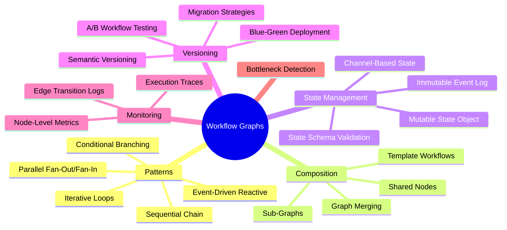
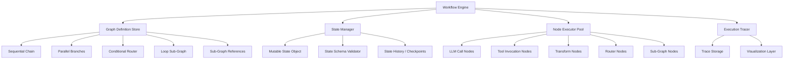
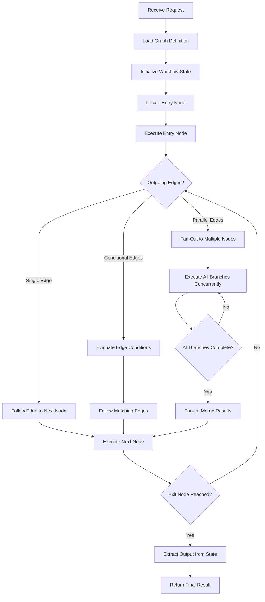
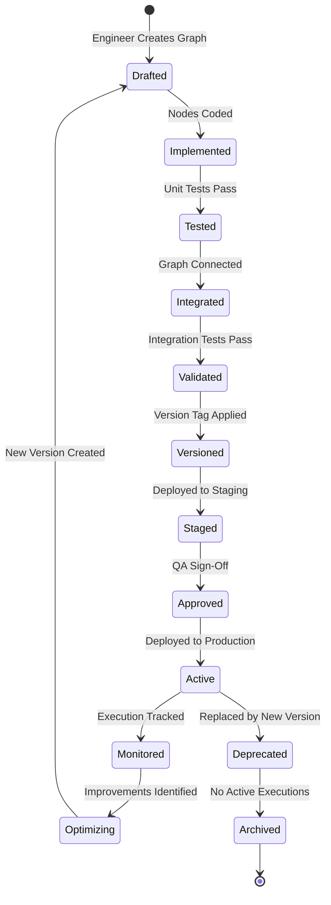
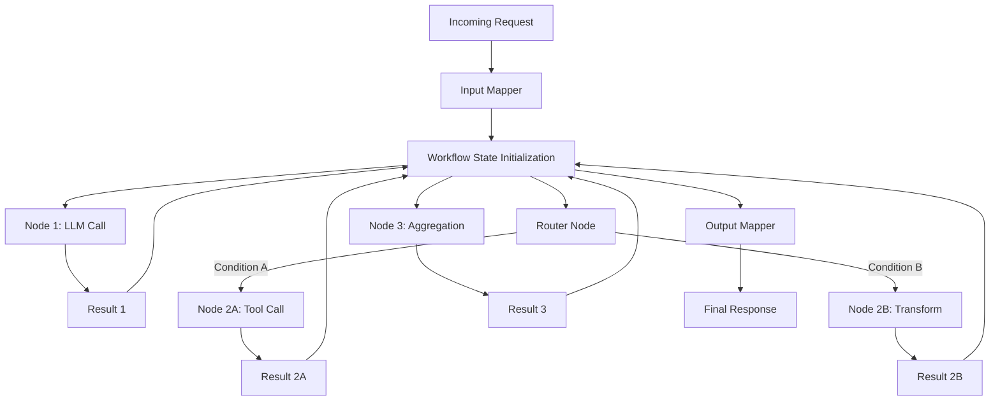
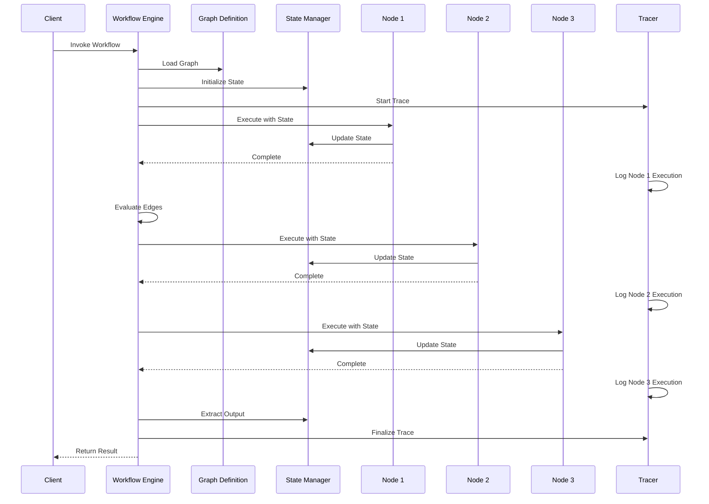

# Workflow Graphs

## 📌 Overview

Workflow graphs are the architectural backbone of modern AI systems, providing a structured and visual way to model complex multi-step processes as interconnected graph structures. Unlike ad-hoc scripting or linear pipeline designs, workflow graphs treat every processing step, decision point, data transformation, and tool invocation as a node in a directed graph, with edges defining the flow of control and data between these steps. This graph-based approach to workflow modeling enables AI engineers to design systems that are simultaneously expressive enough to handle real-world complexity and rigorous enough to be analyzed, tested, monitored, and evolved over time. Workflow graphs have become the dominant paradigm in AI orchestration frameworks such as LangGraph, Prefect, Temporal, and n8n, where they serve as the primary abstraction for defining how AI agents, LLM calls, and external tools collaborate to accomplish sophisticated tasks.

The power of workflow graphs lies in their ability to make implicit process logic explicit and observable. When an AI system is implemented as a graph, every possible execution path is visible in the graph structure, making it possible to reason about correctness, optimize bottlenecks, and debug failures by examining the graph rather than deciphering scattered procedural code. Workflow graphs also provide a natural foundation for workflow versioning, A/B testing, and progressive rollouts, since each version of a workflow is a well-defined graph structure that can be compared, diffed, and deployed independently.

## 🎯 Learning Objectives

After completing this document, you will be able to design AI workflows as formal graph structures, selecting appropriate patterns for sequential, parallel, conditional, and iterative processing. You will understand how to compose multiple workflow graphs into larger systems using sub-graphs, shared nodes, and graph composition operators. You will learn to implement workflow state management that tracks the progress, intermediate results, and context of a workflow as it traverses the graph. You will be able to version workflow graphs systematically, enabling safe updates, rollbacks, and A/B comparisons between different workflow designs. You will gain proficiency in modeling real-world AI processes as workflow graphs, including RAG pipelines, multi-agent collaboration systems, and iterative refinement loops. Finally, you will understand how to monitor and debug workflow graphs in production, using execution traces and graph visualization to diagnose issues.

## 🧠 Definition

A workflow graph is a directed graph that models a multi-step AI process as a collection of interconnected processing nodes, where each node represents a discrete unit of work such as an LLM call, a tool invocation, a data transformation, or a routing decision, and each directed edge represents the flow of control and data from one processing step to the next. The graph structure defines all possible execution paths through the workflow, including branching for conditional logic, fan-out for parallel processing, and cycles for iterative refinement. In AI engineering, workflow graphs serve as both a design-time specification and a runtime execution model—the same graph structure that engineers design and visualize is what the execution engine traverses to process each request. Workflow graphs are typically stateful, meaning they carry a workflow state object that accumulates information as execution progresses through the graph, enabling later nodes to access and build upon the results of earlier nodes.

The defining characteristic of a workflow graph, as opposed to a simple pipeline or a decision tree, is its support for arbitrary graph topology. A workflow graph can express sequential chains, parallel branches, conditional routing, iterative loops, and any combination of these patterns within a single coherent structure. This expressiveness makes workflow graphs suitable for modeling even the most complex AI processes while maintaining a unified representation that supports analysis, optimization, and evolution.

## ❓ Why It Matters

Workflow graphs matter because they bridge the gap between the declarative intent of what an AI system should do and the imperative reality of how it actually does it. As AI systems grow from simple prompt-response pairs to complex multi-agent workflows involving dozens of processing steps, the need for a structured, composable, and observable representation becomes critical. Without workflow graphs, AI system behavior is often scattered across callback functions, conditional logic embedded in prompts, and implicit ordering assumptions that are difficult to understand, test, and modify. Workflow graphs make the entire processing logic explicit, enabling engineers to reason about the system as a whole rather than as a collection of isolated components.

The business impact of workflow graphs is substantial. Teams that model their AI processes as workflow graphs can iterate faster, because modifying a workflow means editing a graph structure rather than refactoring procedural code. They can debug more effectively, because execution traces show exactly which nodes were visited and what data flowed between them. They can scale more confidently, because graph analysis can identify bottlenecks, parallelization opportunities, and resource requirements before deployment. And they can collaborate more smoothly, because a workflow graph serves as a shared, visual language that product managers, designers, and engineers can all understand and contribute to.

## 🏛️ Core Concepts

The core concepts of workflow graphs include workflow patterns, graph topology, state management, and composition. Workflow patterns are reusable structural templates for common processing needs—the sequential pattern for ordered steps, the parallel pattern for concurrent processing, the conditional pattern for branching based on data, the iterative pattern for repeated refinement, and the event-driven pattern for reactive processing. These patterns can be combined within a single workflow graph to express complex processing logic. Graph topology refers to the overall shape and connectivity of the workflow graph, including whether it is linear, branching, converging, cyclic, or a hybrid of these shapes.

State management is the mechanism by which a workflow graph tracks its progress and accumulated data as execution traverses the graph. In most AI workflow frameworks, the workflow state is a mutable data structure that is passed from node to node, with each node able to read and write specific fields. This state accumulates LLM outputs, tool results, intermediate calculations, and metadata such as timestamps and quality scores. Composition is the ability to nest one workflow graph inside another as a sub-graph, enabling hierarchical workflow design where high-level workflows orchestrate lower-level sub-workflows, each of which can be developed, tested, and versioned independently.

## 🧩 Key Components

The key components of a workflow graph include workflow nodes, which are the processing units that perform discrete units of work. Each node has a type, such as LLM call node, tool node, transformation node, router node, or sub-graph node, and an implementation that defines exactly what happens when execution reaches that node. Workflow edges define the connections between nodes, specifying both the control flow, which node executes next, and the data flow, what data is passed between nodes. Edge conditions are optional predicates that determine whether a particular edge is followed, enabling conditional routing. The workflow state is the shared data structure that persists across node executions, accumulating results and context as the workflow progresses. The workflow entry point defines where execution begins, and the workflow exit points define where execution can terminate, potentially with different outputs depending on which path was taken. The workflow context provides access to external resources such as API clients, configuration values, and logging infrastructure that nodes may need during execution.

## 🧭 Mental Model

Think of a workflow graph as the floor plan of a sophisticated kitchen in a high-end restaurant. The kitchen has stations for prep, cooking, plating, and quality check, connected by paths that the food follows. Some dishes require sequential steps—prep then cook then plate—while others involve parallel paths where multiple components are prepared simultaneously and then combined. The head chef acts as the router, directing each dish to the appropriate next station based on what it needs. If a quality check fails, the dish loops back to the cooking station for correction. The kitchen's order ticket system is the workflow state, tracking each dish's progress and any special instructions. Just as a well-designed kitchen floor plan enables efficient, consistent, and scalable food production, a well-designed workflow graph enables efficient, consistent, and scalable AI processing. The kitchen can be reconfigured for different menus by changing the station layout—similarly, workflow graphs can be reconfigured for different AI tasks by modifying the graph structure.

## 🗺️ Mind Map

## 🏗️ Architecture Diagram

## 🔄 Workflow

```mermaid
flowchart LR
    Start[Define Workflow] --> Design[Design Graph Structure]
    Design --> Implement[Implement Nodes]
    Implement --> Connect[Connect with Edges]
    Connect --> State[Define State Schema]
    State --> Test[Test Individual Nodes]
    Test --> Integrate[Integrate Full Workflow]
    Integrate --> Validate[Validate Edge Conditions]
    Validate --> Version[Version the Graph]
    Version --> Deploy[Deploy to Runtime]
    Deploy --> Monitor[Monitor Executions]
    Monitor --> Optimize[Identify Improvements]
    Optimize --> Version
```

## ⚙️ Internal Working

The internal working of a workflow graph begins when the workflow engine receives an invocation request along with initial input data. The engine loads the graph definition from the graph store and initializes a new workflow state object, populating it with the input data and any default values defined in the state schema. Execution starts at the designated entry node, where the engine invokes the node's implementation function, passing in the current workflow state and the workflow context. The node performs its processing—such as making an LLM API call, invoking an external tool, or transforming data—and returns a result that the engine merges back into the workflow state according to the node's output mapping specification.

After a node completes, the engine examines the outgoing edges from that node to determine the next step. If edges have conditions, the engine evaluates each condition against the current state and follows all edges whose conditions are satisfied. For parallel fan-out, multiple edges may be followed simultaneously, with the engine tracking each parallel branch independently. When parallel branches converge at a fan-in node, the engine waits for all branches to complete before proceeding. Throughout execution, the tracer records each node invocation, edge transition, and state mutation, creating a detailed execution trace that can be used for debugging, performance analysis, and audit purposes. When execution reaches an exit node, the engine extracts the designated output fields from the workflow state and returns them as the final result.

## 🔀 Execution Flow

## 📊 Lifecycle

## 📡 Data Flow

## 🤝 Interaction Flow

## 🌍 Real-World Analogy

Think of a workflow graph as the routing and processing system in a modern package distribution center. When a package arrives at the facility, it enters the workflow at a scanning station that reads the label and determines its routing. Based on the destination, the package follows different paths—some go through customs processing, others go through hazardous material checks, and some go directly to sorting. Along the way, the package accumulates tracking information at each station, which is the workflow state. If a package fails an inspection, it loops back to a re-packaging station before re-entering the main flow. The entire facility's layout is the graph structure, designed to handle the maximum variety of package types efficiently. During peak seasons, certain stations might be duplicated for parallel processing, and during slow periods, some paths might be deactivated entirely. The facility can be reconfigured for new services by adding new stations and routing paths, just as a workflow graph can be extended with new nodes and edges.

## 💡 Practical Example

Consider a customer support AI system modeled as a workflow graph. The workflow begins with an intake node that classifies the customer's inquiry into categories such as billing, technical support, or account management. A router node then directs the flow to a specialized processing branch—for billing inquiries, the flow goes through an account lookup tool node, a billing history retrieval node, and a billing analysis LLM node that generates a response. For technical support, the flow goes through a knowledge base search node, a troubleshooting guide retrieval node, and a technical analysis LLM node. Both branches converge at a response quality check node that evaluates the generated response against company policies. If the quality check fails, the flow loops back to the appropriate analysis node with feedback. If it passes, the response is sent to an approval node that either delivers it directly or routes it to a human agent for review, depending on the confidence score. The entire workflow state tracks the customer's identity, inquiry history, all retrieved documents, all generated response drafts, and the final disposition of the case.

## 🧪 Use Cases

Workflow graphs are used in RAG pipelines that chain document retrieval, context assembly, prompt construction, and LLM generation into a coherent, observable process. Multi-agent systems use workflow graphs to orchestrate the collaboration between specialized agents—such as a research agent, a writing agent, and an editing agent—each represented as a sub-graph within the larger workflow. Data processing pipelines in AI systems use workflow graphs to chain data extraction, cleaning, transformation, enrichment, and loading steps, with conditional branching for handling different data formats or quality levels. Autonomous research systems use workflow graphs to model the iterative process of formulating queries, searching sources, synthesizing findings, identifying gaps, and performing additional searches. Content moderation workflows use graph-based routing to triage content through different levels of review—automated filtering, AI-based classification, and human review—based on risk scores and content type.

## ⚖️ Comparison

Workflow graphs differ from simple pipelines in their support for arbitrary topology. While pipelines are limited to linear sequences, workflow graphs can express branching, merging, parallelism, and cycles. Compared to finite state machines, workflow graphs are higher-level abstractions that focus on processing logic rather than discrete state transitions, and they typically carry rich typed state objects rather than simple state enumerations. Unlike event-driven architectures, which react to external events with loosely coupled handlers, workflow graphs provide explicit control flow that is easier to reason about and debug. Compared to imperative code, workflow graphs offer better observability, testability, and composability at the cost of some flexibility for highly dynamic or unpredictable processing patterns. Among workflow representation approaches, graph-based workflows offer the best balance of expressiveness and analyzability—more expressive than JSON configurations but more structured than free-form code.

## ✅ Best Practices

Design workflow graphs with clear separation of concerns, assigning each node a single, well-defined responsibility rather than combining multiple operations into a single monolithic node. Define a explicit state schema that documents every field in the workflow state, including its type, source, and which nodes read and write it. Use sub-graphs to decompose complex workflows into manageable, independently testable components. Implement comprehensive edge condition testing to verify that all possible routing paths through the graph are correct and that no node is unreachable. Add instrumentation to every node that logs its execution duration, input size, output size, and any errors, enabling data-driven optimization of the workflow. Version your workflow graphs using semantic versioning and maintain a changelog that describes what changed between versions. Design workflows to be idempotent where possible, meaning that re-executing a node with the same state input produces the same result, which simplifies error recovery and retry logic.

## ❌ Common Mistakes

A frequent mistake is creating overly complex workflow graphs with too many nodes and edges, making the system difficult to understand, test, and maintain. Engineers should strive for the simplest graph structure that correctly models the required processing logic. Another common error is tightly coupling nodes to each other by having them directly reference specific state fields set by specific predecessor nodes, rather than defining clear input and output contracts. This makes the graph brittle when the topology changes. Many teams fail to implement proper state schema validation, allowing corrupt or incomplete state to propagate through the graph and cause cryptic errors in downstream nodes. Neglecting workflow versioning leads to situations where changes to the graph structure break existing integrations or produce unexpected behavior. A subtle but impactful mistake is not handling partial failures in parallel branches—if one branch fails, the system must have a clear strategy for whether to fail the entire workflow, retry the failed branch, or continue with available results.

## 🚀 Advanced Topics

Dynamic workflow graphs allow the graph structure itself to change at runtime based on the data being processed, such as adding or removing nodes and edges in response to the content of the workflow state. Workflow graph optimization uses execution traces and performance data to automatically identify bottlenecks, suggest parallelization opportunities, and recommend node consolidation. Adaptive workflows adjust their behavior based on real-time feedback, such as routing to a more expensive but higher-quality processing path when the task is high-priority. Workflow graph federation enables multiple independent workflow engines to collaborate on a single processing task, with each engine responsible for a portion of the graph. Self-healing workflows detect node failures and automatically restructure the graph to route around failed components, maintaining service continuity. Workflow graph simulation enables dry-run execution that predicts the behavior, cost, and latency of a workflow without actually invoking LLMs or external tools, allowing engineers to validate changes before deployment.