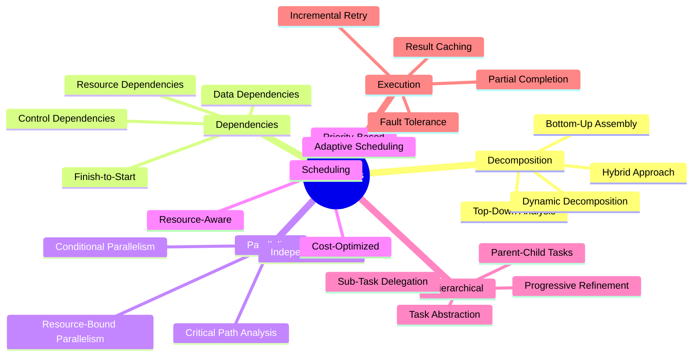
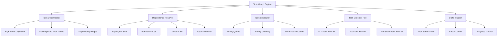
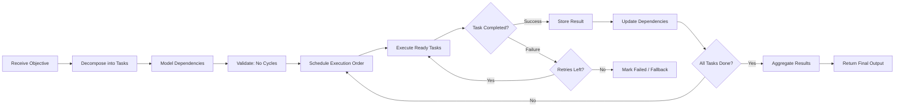
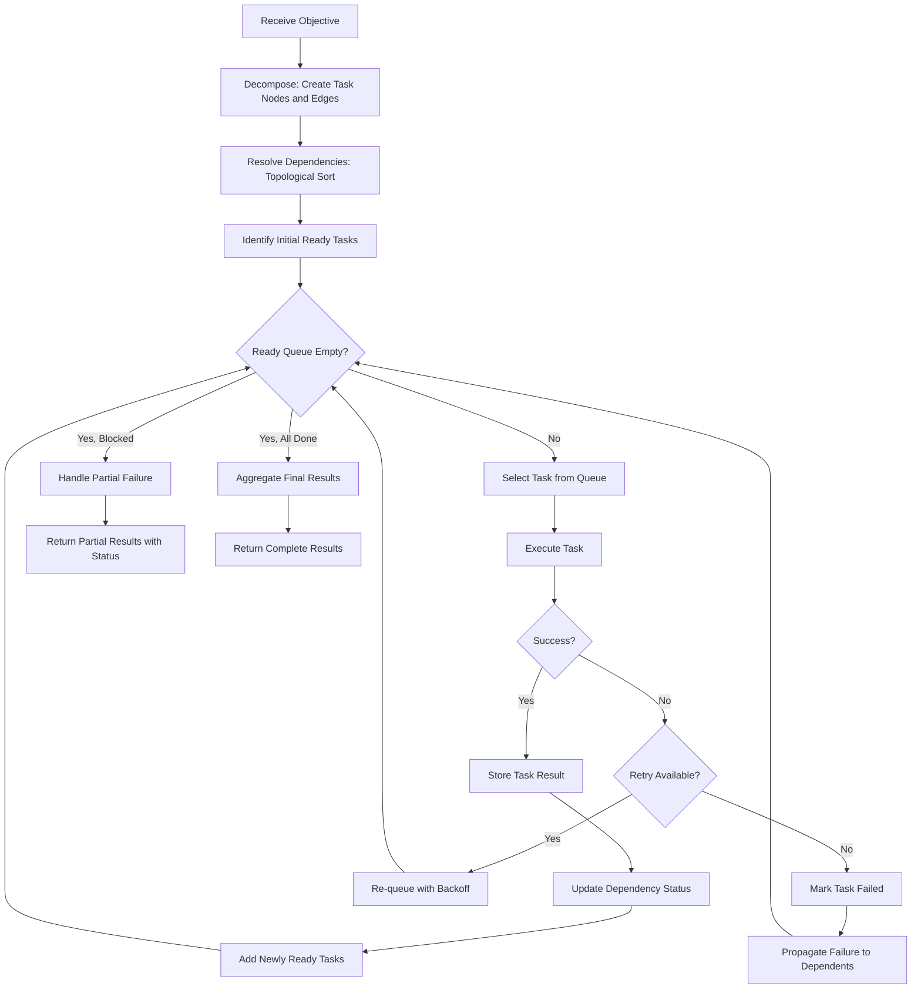
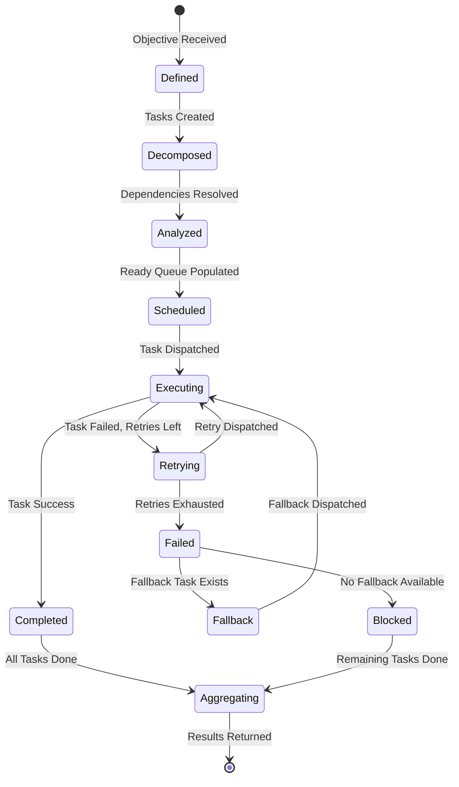
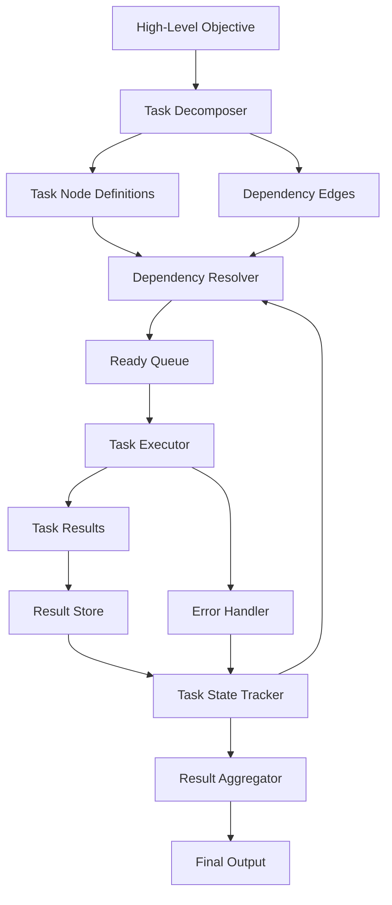
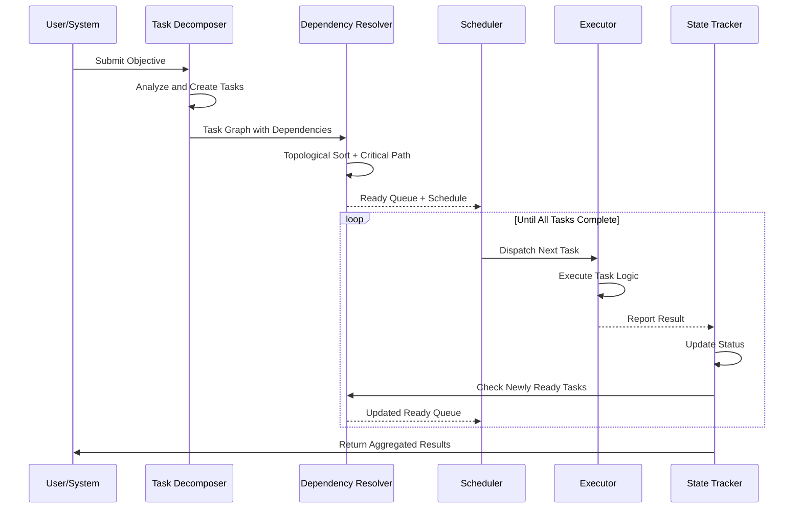

# Task Graphs

## 📌 Overview

Task graphs represent a fundamental abstraction in graph-based AI engineering for decomposing complex objectives into structured, executable, and observable units of work. Where workflow graphs model the process of how work flows through a system, task graphs model what work needs to be done and how individual pieces of work relate to each other through dependencies, priorities, and hierarchical relationships. A task graph treats each AI processing step—from a simple classification to a complex multi-agent research project—as a node, with edges representing the dependencies that determine execution order and data flow. This dependency-aware representation enables intelligent scheduling, automatic parallelization, incremental execution, and precise progress tracking that would be impossible with monolithic or linearly structured approaches.

In the context of AI systems, task graphs are particularly powerful because AI tasks often have complex, non-obvious dependency structures. Generating a comprehensive report might require research, writing, fact-checking, and formatting tasks that can be partially parallelized but also have subtle ordering constraints. Task graphs make these relationships explicit, allowing the execution engine to maximize throughput through parallel execution while respecting all dependencies. They also provide a natural framework for hierarchical task decomposition, where a high-level task is broken into sub-tasks, each of which can be further decomposed, creating a tree-shaped graph structure that mirrors how humans naturally approach complex problems.

## 🎯 Learning Objectives

After studying this document, you will be able to decompose complex AI objectives into well-defined task graph structures with appropriate granularity and clear dependency relationships. You will understand the different task dependency types—sequential, parallel, conditional, and resource-constrained—and how to model them in graph structures. You will learn to implement task scheduling algorithms that respect dependencies while maximizing parallelism and minimizing total execution time. You will gain the ability to design hierarchical task graphs that support multi-level decomposition and progressive refinement of complex objectives. You will understand how to implement task graph execution with fault tolerance, including retry strategies, fallback tasks, and partial completion handling. Finally, you will be able to leverage task graphs for progress tracking, cost estimation, and execution optimization in AI systems.

## 🧠 Definition

A task graph is a directed graph in which each node represents a discrete, executable unit of work, called a task, and each directed edge represents a dependency relationship indicating that the target task requires the output or completion of the source task before it can begin. In AI engineering, tasks typically correspond to AI operations such as LLM generations, tool invocations, data retrievals, or evaluations, while dependencies capture both data dependencies, where one task produces data that another task consumes, and control dependencies, where one task must complete before another can begin for logical reasons unrelated to data flow. A task graph may also include metadata on each node specifying the task type, estimated cost, expected duration, required resources, priority, and retry configuration.

The distinguishing feature of a task graph in AI engineering is that tasks are often non-deterministic—their exact output, duration, and cost may vary with each execution. This non-determinism means that task graph scheduling and execution must be adaptive, responding to actual task outcomes rather than relying solely on static estimates. Additionally, in AI systems, task graphs are frequently dynamic, meaning that the graph structure itself may change during execution as new tasks are discovered, dependencies are resolved, or the system decides to decompose tasks differently based on intermediate results.

## ❓ Why It Matters

Task graphs matter because they provide the structural foundation for breaking down the inherently complex, multi-faceted work that AI systems are asked to perform. Modern AI applications rarely involve a single LLM call—they require orchestration of multiple specialized operations, each with its own inputs, outputs, costs, and failure modes. Without a structured task decomposition, AI systems quickly become unmanageable tangles of ad-hoc logic that are impossible to optimize, debug, or scale. Task graphs bring engineering discipline to this complexity, making it explicit how a complex objective maps to concrete executable steps and how those steps relate to each other.

The performance implications of task graphs are significant. By making dependencies explicit, task graphs enable execution engines to identify which tasks can run in parallel, dramatically reducing total execution time for complex multi-step processes. Research in parallel computing has long established that dependency-aware scheduling can achieve near-optimal speedup for task graphs with sufficient parallelism, and these same principles apply directly to AI workflow orchestration. Furthermore, task graphs enable incremental execution, where if a long-running process fails partway through, the system can identify which tasks completed successfully and only re-execute the tasks that depend on the failed ones, rather than starting over from scratch. This capability is essential for cost-effective AI systems that may involve expensive LLM calls.

## 🏛️ Core Concepts

The core concepts of task graphs include task decomposition, dependency modeling, parallelism extraction, and scheduling. Task decomposition is the process of breaking a high-level objective into a set of concrete, executable tasks. Good decomposition produces tasks that are self-contained, meaning each task can be executed independently given its required inputs, and appropriately granular, meaning each task represents a meaningful unit of work that is neither too coarse, combining operations that should be scheduled independently, nor too fine, introducing scheduling overhead that exceeds the task's actual work.

Dependency modeling captures the relationships between tasks. The most common dependency types include finish-to-start, where the predecessor must complete before the successor begins; start-to-start, where the successor can begin as soon as the predecessor starts; and finish-to-finish, where both tasks must complete before the workflow can proceed. In AI systems, data dependencies are the most common, where a downstream task requires the output of an upstream task as part of its input. Parallelism extraction is the analysis of the task graph to identify sets of tasks that can be executed concurrently, typically by finding tasks whose dependencies have all been satisfied and that do not share exclusive resources. Scheduling is the algorithm that determines the execution order of tasks, balancing objectives such as minimizing total execution time, respecting resource constraints, and meeting priority requirements.

## 🧩 Key Components

The key components of a task graph include task nodes, each of which encapsulates a specific unit of work with a defined input schema, output schema, execution function, and metadata such as estimated cost, timeout, and retry policy. Dependency edges connect task nodes and specify the type and nature of the dependency, including which output fields from the source task are required by the target task. The dependency resolver is the component that analyzes the graph structure to determine execution ordering, identify parallelizable task groups, and detect circular dependencies that would prevent execution. The task scheduler determines which ready tasks to execute next, considering factors such as priority, estimated cost, resource availability, and the critical path through the graph. The task executor invokes the actual processing logic for each task, handling retries, timeouts, and error reporting. The task state tracker monitors the status of every task—pending, ready, running, completed, or failed—and maintains the accumulated results in a task result store that downstream tasks can access.

## 🧭 Mental Model

Imagine a construction project managed by a master builder. The overall goal—building a house—is decomposed into tasks: lay foundation, frame walls, install plumbing, run electrical wiring, install drywall, paint, and install fixtures. Some tasks must happen in sequence—you cannot paint before drywall is installed—but others can happen in parallel—plumbing and electrical can be installed simultaneously because they involve different parts of the house and different workers. The master builder's project plan is the task graph: it shows every task, every dependency, and which tasks can proceed in parallel. If a plumbing inspection fails, only the plumbing-related tasks need to be re-done, not the entire house. The master builder can also identify the critical path—the longest chain of sequential dependencies that determines the minimum project duration—and focus resources on speeding up critical path tasks. This is exactly how task graphs work in AI systems, except the workers are LLM calls, tool invocations, and data processing functions.

## 🗺️ Mind Map

## 🏗️ Architecture Diagram

## 🔄 Workflow

## ⚙️ Internal Working

The internal working of a task graph system begins when a high-level objective is received and passed to the task decomposer, which analyzes the objective and generates a set of concrete tasks along with their dependency relationships. The decomposition can be performed statically using predefined task templates, dynamically by an LLM that analyzes the objective and proposes a task breakdown, or through a hybrid approach where a template provides the initial structure and an LLM refines it based on the specific input. Once tasks and dependencies are defined, the dependency resolver performs a topological sort to determine a valid execution order, identifies groups of tasks that can be executed in parallel, computes the critical path that determines the minimum possible execution time, and verifies that no circular dependencies exist that would prevent execution.

With the graph analyzed, the task scheduler maintains a ready queue of tasks whose dependencies have all been satisfied. The scheduler selects tasks from the ready queue based on priority, estimated cost, critical path position, and resource availability, then dispatches them to the task executor pool. The executor runs each task, handling the actual LLM call, tool invocation, or data transformation, and reports the result back to the state tracker. When a task completes, the state tracker updates the task's status and checks whether any dependent tasks now have all their prerequisites satisfied, adding newly ready tasks to the ready queue. If a task fails, the retry policy determines whether to re-queue the task, execute a fallback task, or mark all downstream tasks as blocked. This process continues until all tasks are completed, failed, or blocked, at which point the system aggregates the results and returns the final output.

## 🔀 Execution Flow

## 📊 Lifecycle

## 📡 Data Flow

## 🤝 Interaction Flow

## 🌍 Real-World Analogy

Consider a large catering company preparing for a multi-course gala dinner. The head chef receives the menu objective and decomposes it into preparation tasks: prep appetizers, cook main courses, prepare desserts, set tables, and arrange the bar. Some tasks are independent—desserts can be prepared while main courses are cooking—while others have strict ordering—the dining room must be set before food can be served. The kitchen's task graph also accounts for shared resources: there are only three ovens, so even if four tasks are ready to cook simultaneously, only three can proceed. If a key ingredient delivery is delayed, the dependent tasks are automatically rescheduled. The head chef monitors the critical path—whatever chain of tasks determines when dinner can be served—and reallocates staff to keep critical tasks on schedule. This is precisely how AI task graphs operate, managing complex multi-step objectives with dependencies, resource constraints, and the need for adaptive scheduling when things do not go as planned.

## 💡 Practical Example

Imagine building an AI-powered research assistant that produces comprehensive market analysis reports. The task graph decomposes the report generation into: a market overview task that searches for recent news, a financial data task that retrieves stock metrics, a competitor analysis task that profiles key competitors, a trend analysis task that identifies emerging patterns, and a synthesis task that combines all findings into a coherent report. The market overview, financial data, and competitor analysis tasks have no dependencies on each other and execute in parallel. The trend analysis task depends on the market overview data. The synthesis task depends on all four analysis tasks completing. When the financial data retrieval fails due to an API timeout, the system retries twice, then falls back to using cached data from the previous day's retrieval. The task graph ensures that even with this failure, the three other parallel tasks continue unaffected, and the synthesis task proceeds as soon as all four inputs are available. Total execution time is roughly the duration of the longest parallel branch rather than the sum of all task durations.

## 🧪 Use Cases

Task graphs are essential in multi-agent AI systems where different specialized agents handle different aspects of a complex request, and a task graph coordinates their execution with proper dependency management. Automated data pipelines use task graphs to manage extraction, transformation, and loading operations where some transformations depend on the output of previous extractions but many can proceed in parallel. AI-powered content creation systems use task graphs to manage the parallel generation of text, images, and metadata, with a final assembly task that combines all components. Code generation systems decompose the implementation of a feature into task graphs with separate nodes for architecture design, interface definition, implementation, testing, and documentation. Quality assurance systems use task graphs to manage parallel test execution, coverage analysis, and defect triage, with remediation tasks spawned dynamically based on discovered defects.

## ⚖️ Comparison

Task graphs differ from workflow graphs in their primary focus. Workflow graphs emphasize the process and flow of data through a system, while task graphs emphasize the decomposition of objectives and the management of dependencies between work units. A workflow graph asks "how does data flow?" while a task graph asks "what needs to be done and in what order?" Compared to simple task lists, task graphs add explicit dependency modeling that enables automatic scheduling and parallelization. Compared to project management tools like Gantt charts, task graphs are more granular and execution-oriented, designed to be consumed by an automated execution engine rather than human project managers. Among AI decomposition approaches, task graphs offer more structure than free-form LLM planning but more flexibility than hardcoded pipelines, making them ideal for AI systems that need to handle variable and complex objectives.

## ✅ Best Practices

Decompose tasks to a consistent level of granularity where each task represents a single, coherent operation that can be described in one sentence. Avoid over-decomposition, which creates scheduling overhead, and under-decomposition, which prevents parallelism. Make dependencies explicit and minimal—only declare a dependency when the downstream task truly requires the output of the upstream task, because unnecessary dependencies reduce parallelism. Implement task result caching so that if a task is re-executed or if the same task appears in multiple workflows, previous results can be reused. Design each task to be idempotent, meaning that executing it multiple times with the same input produces the same result, which simplifies retry logic. Include cost estimates on every task and implement a budget-aware scheduler that can select lower-cost alternatives when the total budget is constrained. Use hierarchical task graphs for complex objectives, starting with a high-level decomposition and progressively refining sub-tasks as more information becomes available during execution.

## ❌ Common Mistakes

The most common mistake is creating a sequential task graph when parallelism is possible, failing to identify tasks that could execute concurrently and dramatically reducing throughput. Another frequent error is introducing circular dependencies, either explicitly or through transitive dependency chains, which makes the graph unexecutable and requires cycle-breaking heuristics. Many engineers neglect to implement proper error propagation, allowing a failed task to leave its dependents in an ambiguous state rather than explicitly marking them as blocked or triggering fallback logic. Over-decomposing tasks into trivially small units creates excessive scheduling overhead that can actually slow down execution compared to a coarser decomposition. Failing to account for shared resources, such as API rate limits or concurrent LLM call limits, can cause the scheduler to dispatch more parallel tasks than the system can handle, leading to throttling and degraded performance. Ignoring the critical path during scheduling can result in resources being wasted on non-critical tasks while critical path tasks are delayed.

## 🚀 Advanced Topics

Dynamic task graphs allow the graph structure to evolve during execution, with tasks spawning new sub-tasks based on their results, enabling adaptive decomposition that responds to what the AI discovers as it works. Hierarchical task networks extend the task graph concept with formal decomposition methods, where high-level tasks are defined as compositions of lower-level tasks according to predefined or learned decomposition rules. Multi-objective task scheduling optimizes simultaneously for multiple criteria such as execution time, cost, quality, and resource utilization, using techniques like Pareto optimization to find trade-off solutions. Task graph learning involves training models to predict optimal task decompositions and dependency structures for new types of objectives based on historical execution data. Collaborative task graphs span multiple AI agents or even multiple organizations, with tasks distributed across different execution environments and coordinated through shared state and communication protocols. Speculative task execution preemptively executes tasks that may or may not be needed based on predicted execution paths, improving latency at the cost of potentially wasted computation when predictions are wrong.