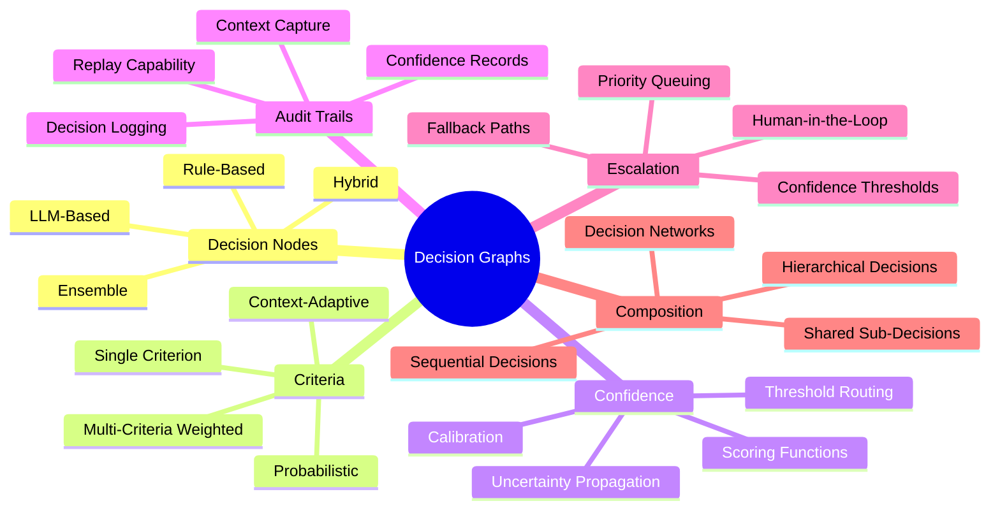
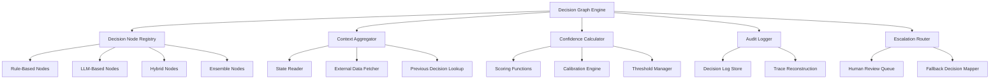
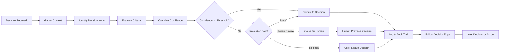
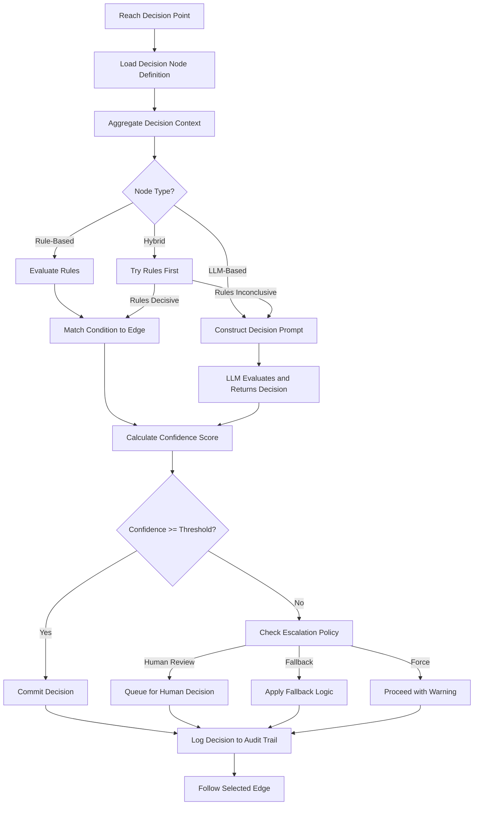
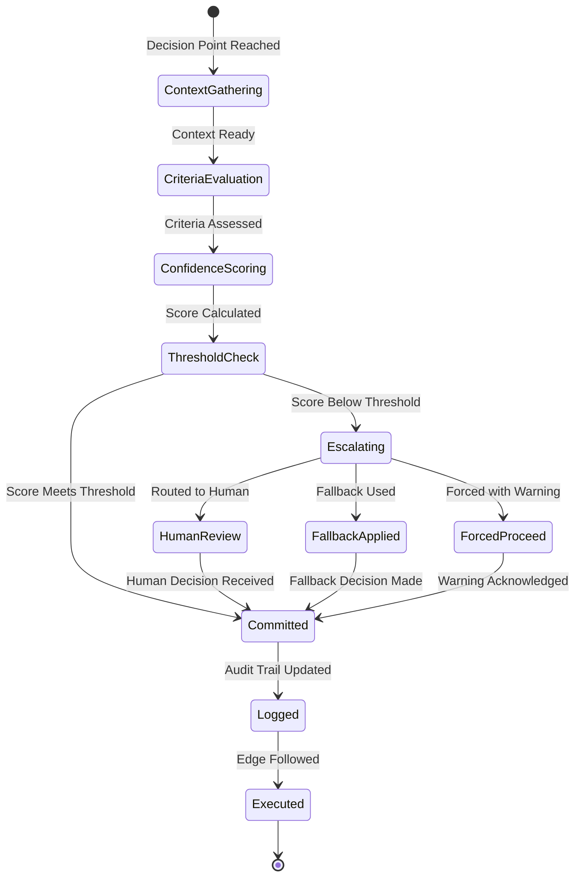
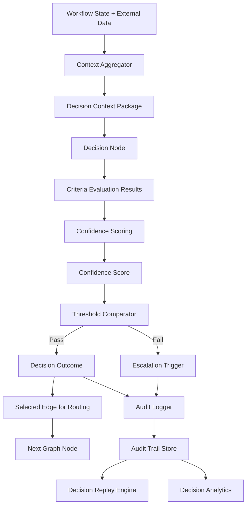
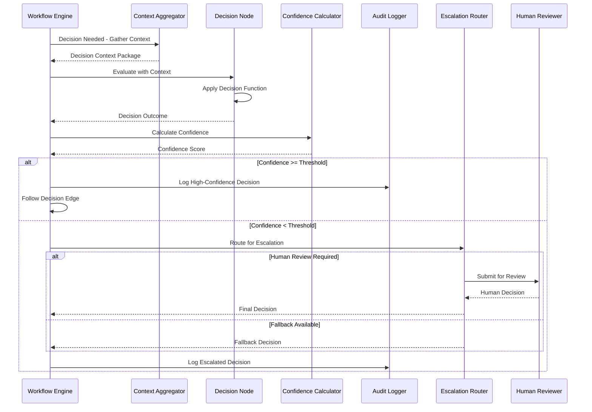

# Decision Graphs

## 📌 Overview

Decision graphs are a specialized class of graph structures in AI engineering that model the decision-making processes within AI systems as explicit, traversable, and auditable graph topologies. Unlike decision trees, which enforce a strict hierarchical branching structure where each node has exactly one parent, decision graphs allow for shared sub-structures, converging paths, and cyclic decision loops, providing a richer and more efficient representation of how AI systems evaluate options, weigh trade-offs, and commit to actions. In graph-based AI engineering, decision graphs serve as the nervous system of intelligent behavior, encoding the logic that determines which processing path to follow, which tool to invoke, whether to continue iterating, and how to handle uncertainty and ambiguity.

The importance of decision graphs has grown significantly with the rise of agentic AI systems that must make numerous interconnected decisions throughout their execution. A single AI agent processing a complex request might need to decide whether to search for more information, which search strategy to use, whether a generated response meets quality standards, whether to escalate to a human, and how to handle unexpected errors. Each of these decisions can be modeled as a node in a decision graph, with the graph structure capturing how decisions relate to and depend on each other. This explicit representation transforms decision-making from an implicit aspect of AI behavior into a first-class engineering artifact that can be designed, tested, optimized, and audited.

## 🎯 Learning Objectives

After completing this document, you will be able to design decision graphs that model complex multi-criteria decision-making in AI systems with clear, auditable logic. You will understand the key differences between decision trees and decision graphs, and when the added expressiveness of graph structures justifies their additional complexity. You will learn to implement decision nodes that aggregate multiple criteria, apply weighting schemes, and produce confidence scores that inform downstream processing. You will gain the ability to construct decision audit trails that record every decision made during execution, including the inputs, criteria, and reasoning behind each choice. You will understand how to implement decision confidence scoring that quantifies the reliability of each decision and enables the system to route low-confidence decisions to human reviewers. Finally, you will be able to compose individual decision graphs into larger decision networks that handle complex, multi-stage decision-making processes.

## 🧠 Definition

A decision graph is a directed graph in which each node represents a decision point in an AI system, and edges represent the possible outcomes or choices available at that decision point. Each decision node evaluates one or more criteria based on the current state and context, applies decision logic—which may involve rule-based conditions, LLM-based evaluation, scoring functions, or probabilistic models—and selects one or more outgoing edges to follow. In AI engineering, decision graphs extend classical decision tree concepts by allowing arbitrary graph topology, including nodes with multiple parents, converging paths that share common sub-structures, and cycles that enable re-evaluation of previous decisions in light of new information.

A decision node in an AI system typically contains a decision function that takes the current context as input and produces a decision outcome along with a confidence score. The confidence score quantifies how certain the system is about its decision, which is critical for AI systems that operate under uncertainty. Decision graphs also support multi-criteria decision-making, where a single decision node must balance multiple competing factors, such as accuracy versus cost, speed versus quality, or specificity versus generality. The graph structure captures how these multi-criteria decisions compose into larger decision-making processes, where the outcome of one decision influences the criteria and options available to subsequent decisions.

## ❓ Why It Matters

Decision graphs matter because decision-making is the core capability that distinguishes intelligent AI systems from static processing pipelines. A system that can only follow a fixed path regardless of its input is not truly intelligent—it is a rule engine. Decision graphs provide the structural foundation for adaptive, context-sensitive behavior that responds to the specifics of each request, the results of previous processing steps, and the current state of the world. As AI systems take on more responsibility in real-world applications—from customer support to medical triage to financial analysis—the quality, transparency, and reliability of their decision-making becomes a critical engineering concern.

The auditability provided by decision graphs is particularly important in regulated industries and high-stakes applications. When an AI system makes a decision that affects a customer's account, a patient's treatment, or a financial transaction, being able to trace exactly which decision nodes were evaluated, what criteria were applied, and what confidence levels were assigned is not just a nice-to-have—it is often a regulatory requirement. Decision graphs make this audit trail a natural byproduct of execution, rather than something that must be retroactively reconstructed from logs. Furthermore, decision graphs enable systematic improvement of AI decision-making by providing clear targets for optimization: individual decision nodes can be analyzed for accuracy, bias, and calibration, and the graph structure itself can be evaluated for decision quality across the full range of inputs the system encounters.

## 🏛️ Core Concepts

The core concepts of decision graphs include decision nodes, decision criteria, confidence scoring, decision composition, and audit trails. Decision nodes are the fundamental unit of a decision graph, each encapsulating a specific choice that the AI system must make. A decision node receives context information, evaluates one or more criteria, applies decision logic, and produces a decision outcome with an associated confidence score. Decision criteria are the individual factors that a decision node considers when making its choice. In simple cases, a decision might depend on a single criterion, such as whether a confidence score exceeds a threshold. In complex cases, a decision might weigh multiple criteria against each other using scoring functions, weighted averages, or LLM-based evaluation.

Confidence scoring is the mechanism by which a decision graph quantifies the reliability of its decisions. Each decision node can produce a confidence score between zero and one, where higher values indicate greater certainty in the decision. These confidence scores propagate through the graph, enabling downstream nodes to adjust their behavior based on the reliability of upstream decisions. Decision composition is the ability to build complex multi-stage decision processes by connecting simpler decision nodes into graph structures, where the output of one decision becomes input to the next. Audit trails are the comprehensive records of every decision made during execution, including the decision node identifier, the input context, the criteria values, the decision outcome, the confidence score, and the timestamp.

## 🧩 Key Components

The key components of a decision graph include decision nodes that encapsulate the logic for evaluating choices and producing outcomes. Each decision node has a decision function that can be rule-based, using explicit conditional logic; LLM-based, using a language model to evaluate complex qualitative criteria; hybrid, combining rules for clear-cut cases with LLM evaluation for ambiguous ones; or ensemble-based, aggregating the outputs of multiple evaluation approaches. Decision edges represent the possible outcomes of each decision, typically labeled with the condition or choice they represent, and may carry weight or priority information for multi-criteria decisions. The context aggregator collects and formats the information that decision nodes need to evaluate their criteria, pulling from the workflow state, external data sources, and previous decision outcomes. The confidence calculator produces quantitative confidence scores for each decision, potentially using calibration techniques to ensure that confidence values are well-calibrated against actual decision accuracy. The audit logger records every decision in a structured format, creating a complete trace of the decision-making process. The escalation router uses confidence scores to identify decisions that fall below a reliability threshold and routes them to human reviewers or fallback processes.

## 🧭 Mental Model

Think of a decision graph as the decision-making process of an experienced doctor diagnosing a patient. The doctor does not follow a simple linear checklist. Instead, they evaluate symptoms, order tests, consider risk factors, and weigh multiple possible diagnoses against each other. Some findings point toward one diagnosis while others suggest another, and the doctor must balance these competing signals. If initial tests are inconclusive, the doctor may order additional tests—a decision loop that revisits the diagnostic evaluation with more information. If the doctor is uncertain about a critical decision, such as whether to recommend surgery, they consult a specialist—an escalation path. The doctor's clinical reasoning is the decision graph: a network of interconnected evaluation points, each considering specific criteria, each producing a judgment with a confidence level, and each influencing the subsequent evaluations. The medical record that documents every finding, test result, and clinical judgment is the audit trail.

## 🗺️ Mind Map

## 🏗️ Architecture Diagram

## 🔄 Workflow

## ⚙️ Internal Working

The internal working of a decision graph begins when the execution engine reaches a point in the workflow where a decision must be made. The engine identifies the corresponding decision node in the graph and invokes the context aggregator to collect all information needed for the decision. This context includes data from the current workflow state, results from previous processing nodes, outputs of prior decisions, and potentially external data fetched via tool calls or API requests. The decision node then evaluates its criteria against the collected context, applying its decision function to determine which outcome to select.

For rule-based decision nodes, the evaluation involves checking explicit conditions—such as whether a sentiment score is above a threshold or whether a required field is present—and following the matching edge. For LLM-based decision nodes, the evaluation involves constructing a decision prompt that includes the context and the decision criteria, sending it to the language model, and parsing the model's response to extract the decision outcome. Hybrid nodes first attempt rule-based evaluation for clear-cut cases and fall back to LLM-based evaluation when the rules produce ambiguous or conflicting signals. Regardless of the evaluation method, the confidence calculator produces a numerical confidence score that reflects the reliability of the decision.

If the confidence score meets or exceeds the configured threshold, the decision is committed, the audit logger records the complete decision context and outcome, and execution follows the selected edge to the next node. If the confidence score falls below the threshold, the escalation router determines the appropriate response—routing to a human reviewer, applying a safe fallback decision, or forcing the best available decision with a low-confidence warning. Every decision, whether high-confidence or escalated, is recorded in the audit trail with sufficient detail to reconstruct the decision-making process after the fact.

## 🔀 Execution Flow

## 📊 Lifecycle

## 📡 Data Flow

## 🤝 Interaction Flow

## 🌍 Real-World Analogy

Consider the decision-making process at an airport security checkpoint. Each passenger triggers a series of decisions: do they need additional screening based on their risk profile? Does their carry-on bag contain prohibited items? Should they be selected for a pat-down? Each decision has multiple criteria—risk score, bag scan results, behavioral indicators—and each decision leads to different paths through the checkpoint. Some paths converge: whether a passenger was flagged by the risk score or by the bag scan, they end up at the same secondary screening station. This convergence is what makes it a graph rather than a tree. When the automated system's confidence in its decision is low, a human security officer is called over to make the final call, analogous to the escalation path in a decision graph. Every decision is logged in the security system's records, creating an audit trail that can be reviewed if a security incident occurs.

## 💡 Practical Example

Imagine a customer support AI that uses a decision graph to determine how to handle incoming support requests. The first decision node classifies the request urgency based on the customer's subscription tier, the issue category, and sentiment analysis of the message. A high-urgency, negative-sentiment message from a premium customer receives a high confidence score for immediate escalation. The next decision node determines the appropriate response path: for billing issues, it routes to a billing specialist agent; for technical issues, it routes to a troubleshooting agent; for general inquiries, it attempts automated resolution. A third decision node evaluates whether the AI's generated response meets quality standards before sending it to the customer, checking for accuracy, completeness, and tone. If the quality score is below threshold, the decision graph routes to a human agent for review. Every routing decision, confidence score, and escalation event is logged, enabling the support team to analyze decision patterns, identify misrouted tickets, and calibrate the confidence thresholds to optimize the balance between automated resolution and human oversight.

## 🧪 Use Cases

Decision graphs are used in content moderation systems that must classify content across multiple risk dimensions—safety, legality, brand alignment—and route content to the appropriate review tier based on a composite risk score. Autonomous vehicle AI systems use decision graphs to make real-time driving decisions that weigh sensor data, traffic rules, predicted behavior of other vehicles, and passenger comfort preferences. Financial AI systems employ decision graphs for loan approval processes that evaluate credit scores, income verification, employment history, and debt-to-income ratios, with different decision paths for different risk profiles and escalation to human underwriters for borderline cases. Healthcare triage systems use decision graphs to assess patient symptoms, vital signs, and medical history to determine urgency levels and appropriate care pathways. AI-powered hiring systems use decision graphs to evaluate candidate qualifications, matching them against job requirements while ensuring fair and auditable selection processes that can be reviewed for bias.

## ⚖️ Comparison

Decision graphs differ from decision trees in their support for shared sub-structures and converging paths. A decision tree requires that every path from root to leaf is unique, which can lead to duplication when multiple decision paths lead to the same outcome. Decision graphs allow these paths to share common sub-trees, reducing redundancy and making the structure more maintainable. Compared to rule engines, decision graphs provide richer structure and better composability—while a rule engine evaluates independent rules, a decision graph captures the relationships and dependencies between decisions. Compared to neural network-based classifiers, decision graphs are more interpretable and auditable, as every decision can be traced back to explicit criteria and logic. Among graph-based decision approaches, decision graphs offer more flexibility than simple conditional routing but more structure than completely open-ended LLM-based reasoning, providing a middle ground that balances adaptability with reliability and auditability.

## ✅ Best Practices

Design decision nodes with clear, documented criteria so that anyone reviewing the audit trail can understand why a particular decision was made. Use confidence scoring consistently across all decision nodes, even for seemingly straightforward decisions, to establish a baseline for comparison and to enable systematic identification of low-confidence decision points. Implement decision calibration by periodically comparing confidence scores against actual decision outcomes and adjusting scoring functions to improve calibration. Keep decision nodes focused on a single, well-defined decision rather than combining multiple decisions into one node, which makes the graph harder to understand and the audit trail harder to interpret. Design escalation paths as integral parts of the graph rather than afterthoughts, with clear criteria for when escalation is triggered and how the escalated decision flows back into the main graph. Use decision replay capabilities to test graph modifications against historical decision scenarios, ensuring that changes improve decision quality without introducing regressions.

## ❌ Common Mistakes

A common mistake is implementing decision nodes with hardcoded thresholds that are not calibrated to the actual distribution of inputs, leading to either too many false positives or too many missed detections. Another frequent error is neglecting to propagate confidence scores through the graph, so that downstream decision nodes cannot adjust their behavior based on the reliability of upstream decisions. Many engineers design decision graphs that only handle the happy path, without proper fallback logic or escalation paths for edge cases and low-confidence situations. Failing to log sufficient context in the audit trail makes it impossible to reconstruct why a decision was made after the fact, undermining the auditability that is one of the primary benefits of decision graphs. Over-relying on LLM-based decision nodes for decisions that could be handled by simple rules introduces unnecessary cost, latency, and non-determinism. Creating decision graphs with too many nodes that each make trivially small decisions adds complexity without proportional benefit—a single well-designed multi-criteria decision node is often preferable to a cascade of simple binary decisions.

## 🚀 Advanced Topics

Multi-criteria decision analysis within graph nodes applies formal decision theory frameworks such as Analytic Hierarchy Process or Multi-Attribute Utility Theory to systematically evaluate and weight competing criteria, providing rigorous foundations for complex decisions. Probabilistic decision graphs model decision outcomes as probability distributions rather than discrete choices, enabling the system to reason about uncertainty more naturally and to make decisions that optimize expected value rather than just selecting the most likely outcome. Reinforcement learning-based decision graphs learn optimal decision policies from experience, adjusting the decision function at each node based on feedback about the outcomes of previous decisions. Meta-decision graphs add a layer of self-awareness by including decision nodes that evaluate the quality of the decision graph itself, identifying situations where the graph structure may be inadequate and triggering dynamic restructuring. Explainable decision graphs augment each decision with natural language explanations generated by the decision node, making the audit trail human-readable and enabling non-technical stakeholders to understand and validate the AI's decision-making process. Federated decision graphs distribute decision-making across multiple AI systems, each responsible for a domain-specific subset of decisions, with a coordination layer that resolves conflicts and ensures consistency across the distributed decision network.
