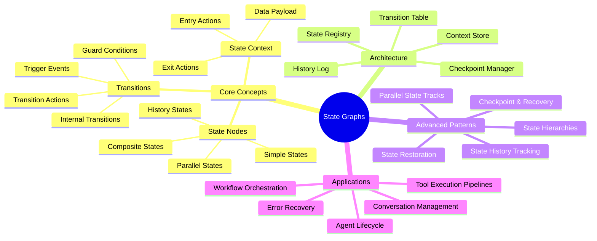
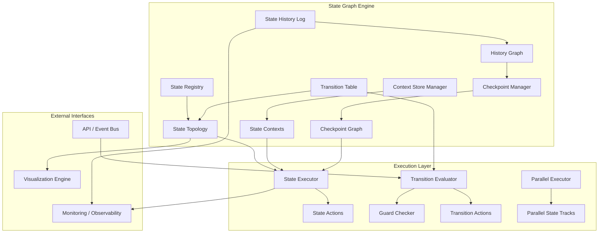
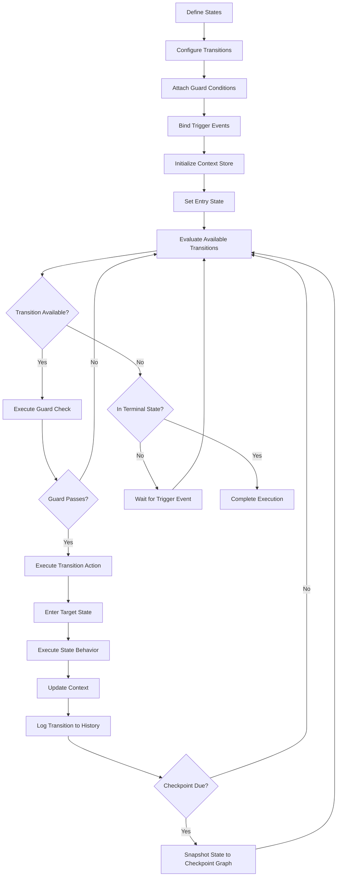
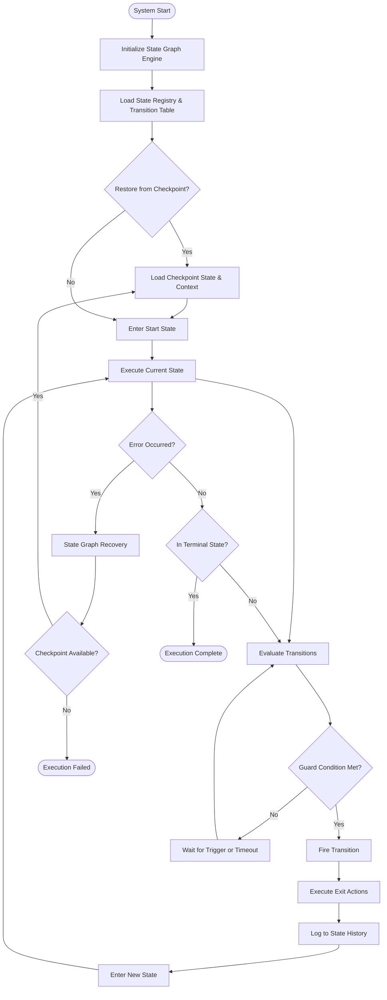
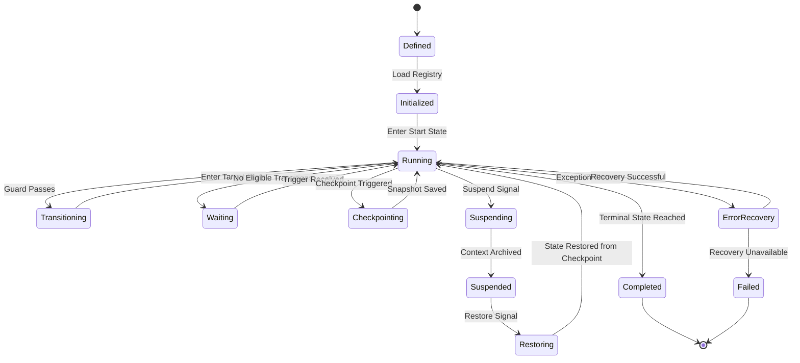
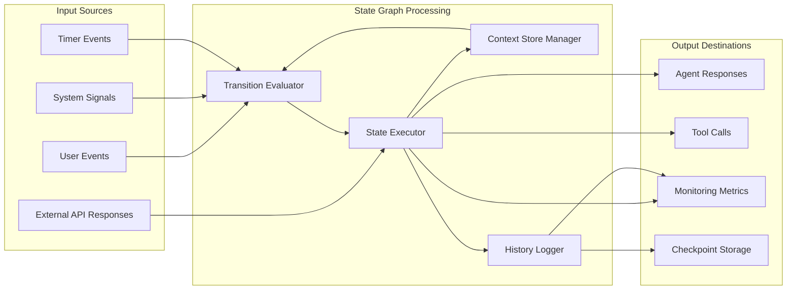
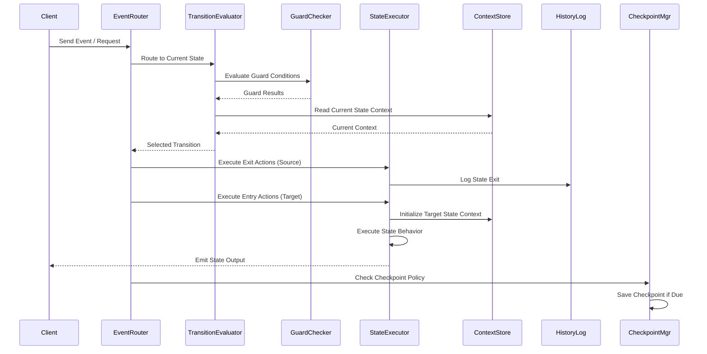

# State Graphs: Modeling AI System States as Graphs

## 📌 Overview

State Graphs represent a foundational pattern in graph engineering where the various conditions, phases, and configurations an AI system can occupy are modeled as nodes in a directed graph, with transitions between those states forming the edges. Rather than treating an AI agent's state as a flat variable or a simple enum, state graphs provide a rich, traversable structure that captures how systems move between operational modes, processing stages, and contextual configurations over time. This approach transforms the often-hidden internal dynamics of AI systems into explicit, inspectable, and manipulable graph structures that can be reasoned about programmatically.

In the context of AI agent design, state graphs go far beyond simple finite state machines by incorporating hierarchical nesting, parallel execution tracks, history tracking, and checkpoint persistence. A conversational AI agent might transition through states like `greeting`, `intent_classification`, `context_retrieval`, `response_generation`, and `follow_up_handling`, with each state carrying its own subgraph of internal transitions. By representing these as a graph, developers gain the ability to visualize, debug, optimize, and extend agent behavior without unraveling tangled conditional logic scattered across codebases.

State graphs also serve as the backbone for checkpoint and recovery mechanisms in long-running AI workflows. When a multi-step agent pipeline fails at step twelve of twenty, a well-structured state graph allows the system to rewind to the last valid checkpoint node, restore the associated context, and resume execution from that precise point. This graph-based checkpointing strategy is far more robust than linear undo stacks, because the graph structure naturally captures branching histories and alternative execution paths that linear models simply cannot represent.

## 🎯 Learning Objectives

By studying this document, you will develop a thorough understanding of how to model, implement, and operate state graphs within AI systems. You will learn to identify when a state graph is the appropriate abstraction for a given problem, distinguishing cases where simple state variables suffice from scenarios that demand the full expressive power of a graph-based state model. You will gain the ability to design state hierarchies that decompose complex agent behaviors into manageable sub-states while maintaining clear parent-child relationships and delegation patterns.

You will also master the techniques for implementing parallel states, where an AI system simultaneously occupies multiple independent state tracks, such as processing a user query while concurrently managing a background knowledge synchronization task. Furthermore, you will understand how to build state history graphs that record the full trajectory of state transitions, enabling powerful debugging capabilities and post-hoc analysis of agent decision-making. Finally, you will learn how to implement checkpoint graphs that snapshot system state at critical nodes, enabling fault-tolerant recovery and reproducible execution in production AI pipelines.

## 🧠 Definition

A State Graph is a directed graph structure `G = (S, T, C)` where `S` is a set of state nodes representing distinct operational conditions or phases of an AI system, `T` is a set of transition edges connecting states and annotated with guard conditions, actions, and event triggers, and `C` is a set of context objects attached to states and transitions that carry the data required for state entry, execution, and exit. Unlike a traditional state machine, a state graph explicitly supports multiple concurrent entry points, cycles, diamond-shaped branching patterns, and subgraph encapsulation, making it suitable for the non-linear, often recursive nature of AI processing workflows.

Each state node in a state graph can optionally contain an embedded subgraph, creating a state hierarchy. A top-level state like `processing_request` might contain sub-states `validating_input`, `retrieving_context`, `calling_tools`, `synthesizing_response`, and `delivering_output`. Transitions at the top level operate on the parent state, while transitions within the subgraph govern the internal logic. This hierarchical decomposition mirrors how complex AI tasks are naturally structured, allowing developers to reason about system behavior at multiple levels of abstraction simultaneously.

## ❓ Why It Matters

State graphs matter because AI systems are inherently stateful and their behavior depends critically on the sequence of states they have traversed, the current configuration they occupy, and the contextual data accumulated along the way. Without an explicit state graph, this stateful logic becomes embedded in scattered variables, nested conditionals, and ad-hoc flag management that quickly becomes unmanageable as system complexity grows. Teams building production AI agents frequently encounter bugs that stem from ambiguous or contradictory state conditions, such as an agent attempting to generate a response before context retrieval has completed, or a tool-calling loop that never terminates because no clear terminal state was defined.

State graphs eliminate these problems by making every valid state explicit, every transition conditional, and every terminal condition unambiguous. They provide a single source of truth for what an AI system is doing at any given moment, which is invaluable for debugging, monitoring, and observability. When an agent misbehaves in production, engineers can trace the exact path through the state graph that led to the failure, identify the specific transition that was taken erroneously, and implement a fix at the graph level rather than hunting through thousands of lines of application code.

Moreover, state graphs enable sophisticated operational capabilities that are difficult or impossible to implement with flat state representations. Checkpoint-based recovery, state-based authorization policies, parallel state tracks for concurrent workflows, and historical state analysis all depend on having a rich graph structure to operate against. As AI systems grow more autonomous and multi-step, the state graph becomes not just a convenience but a necessity for building reliable, maintainable, and observable intelligent systems.

## 🏛️ Core Concepts

The foundational concept of state graphs is the state node, which represents a discrete, identifiable condition or phase that an AI system can occupy. Each state node has a well-defined entry condition, a set of internal behaviors or sub-states, and a set of exit transitions. States can be simple leaf nodes with no internal structure, or composite nodes containing embedded subgraphs that define their internal behavior. The distinction between simple and composite states is crucial, as it enables hierarchical decomposition of complex behaviors without losing the global picture of how states interconnect.

Transitions are the second core concept, representing the directed edges that connect state nodes. Each transition has a source state, a target state, an optional guard condition (a boolean expression that must evaluate to true for the transition to fire), an optional trigger event (an external stimulus that initiates the transition), and an optional action (a side-effect executed during the transition). Transitions can be internal (source and target are the same state, used for self-loops and re-entry), external (different source and target states), or compound (transitioning out of a composite state hierarchy from a sub-state to a sibling of the parent).

The third core concept is the state context, which is the data payload associated with a state or transition. Context objects carry the information needed for state execution, such as user input, retrieved documents, intermediate reasoning results, tool call parameters, and accumulated working memory. In graph-engineered AI systems, the state context is itself often a graph structure, creating a nested graph-of-graphs architecture where the state graph orchestrates the flow of control while context graphs manage the flow of data.

## 🧩 Key Components

The key components of a state graph system include the state registry, which maintains the authoritative set of all valid states and their metadata; the transition table, which defines all valid state-to-state transitions along with their guard conditions and actions; the state context store, which holds the current data payload for each active state; the state history log, which records an immutable sequence of all state transitions that have occurred; and the checkpoint manager, which periodically snapshots the complete system state for recovery purposes.

The state registry serves as the schema for the entire state graph, defining what states exist, what type they are (simple, composite, parallel, or history), and what sub-states they contain if composite. It acts as the single source of truth for state topology, enabling validation of transitions before execution and generation of visualizations and documentation from the graph structure. The transition table is essentially the adjacency list of the state graph, enriched with guard expressions, event bindings, and transition actions that execute as the system moves between states.

The state context store is a runtime component that manages the lifecycle of data associated with each state. When a state is entered, the context store initializes the state's data payload; during state execution, the context store provides read and write access to the current state's data; and when a state is exited, the context store can optionally persist or archive the state's final context. This separation of control flow (state graph) from data flow (context store) is a key architectural principle that keeps state graphs clean and composable.

## 🧭 Mental Model

Think of a state graph as an interactive map of a building where each room is a state and each doorway is a transition. An AI agent walks through this building, moving from room to room based on what it needs to accomplish. Some rooms contain smaller rooms inside them (composite states), some hallways split into parallel corridors (parallel states), and some doors have locks that only open under certain conditions (guard transitions). A security guard at the entrance checks your credentials before letting you in (entry conditions), and a logbook at every door records who passed through and when (state history).

Now imagine that this building has a photograph taken at every room you visit (checkpoints), and if you ever get lost or something goes wrong, you can teleport back to the last photographed location and try again from there. The building also has a smart navigation system that can tell you all possible paths from your current room to any destination room, including which doors are currently locked and which are open. This is exactly how a state graph works in an AI system: it provides a structured, navigable, inspectable map of every possible state the system can be in and every valid path between those states.

## 🗺️ Mind Map

## 🏗️ Architecture Diagram

## 🔄 Workflow

## ⚙️ Internal Working

The internal operation of a state graph begins with initialization, where the state registry is loaded with all defined states and the transition table is populated with all valid state-to-state connections. Each state node is instantiated with its metadata, including its type classification (simple, composite, parallel, or history), its entry and exit actions, and references to any child subgraphs. The context store is initialized with empty context objects for all states, and the checkpoint manager prepares its storage for incoming snapshots.

When execution begins, the system enters the designated start state by invoking the state's entry actions, initializing its context payload, and recording the transition in the state history log. The state executor then takes over, running the state's internal behavior, which may involve invoking AI model calls, executing tool functions, or delegating to sub-state graphs in the case of composite states. Once the state's behavior completes, the transition evaluator examines the transition table to determine which outgoing edges are eligible for firing.

Eligibility is determined by checking guard conditions (which may reference current context data, external variables, or the results of predicate functions) and matching trigger events (which may come from user input, system timers, or internal signals generated by state actions). When multiple transitions are eligible, a priority scheme or conflict resolution strategy selects the winning transition. The selected transition's action is executed, the source state's exit actions fire, and the system moves to the target state. This cycle repeats until a terminal state is reached or the system is suspended for later resumption.

## 🔀 Execution Flow

## 📊 Lifecycle

## 📡 Data Flow

## 🤝 Interaction Flow

## 🌍 Real-World Analogy

Consider a modern airport's flight management system as an analogy for state graphs in AI. Each aircraft goes through a well-defined sequence of states: `taxiing`, `holding_short`, `takeoff_roll`, `climbing`, `cruising`, `descending`, `approach`, `landing`, and `taxi_to_gate`. These are not merely sequential steps but a rich graph structure: a plane might circle back from `approach` to `holding_pattern` if the runway is occupied, or divert from `cruising` to `emergency_descent` if an issue arises. Each state has specific conditions for entry (cleared by ATC, weather minimums met) and exit (altitude reached, runway clear), and each transition is logged in the flight data recorder.

The airport system also demonstrates parallel states: while an aircraft is in the `cruising` state, the baggage handling system is simultaneously in a `loading` or `unloading` state, and the passenger boarding system is in a `waiting` or `boarding` state. These parallel tracks operate independently but can influence each other through events, such as a delayed baggage state triggering a hold on the pushback state. Checkpoint graphs in this analogy are the flight plans filed before departure, which allow the system to restore an aircraft's intended path after a disruption.

## 💡 Practical Example

Imagine building a customer support AI agent that handles support tickets through a multi-stage resolution process. The agent's state graph might include these top-level states: `ticket_received`, `classifying_issue`, `searching_knowledge_base`, `escalating_to_human`, `generating_response`, `awaiting_feedback`, and `ticket_resolved`. The `classifying_issue` state could be a composite state containing sub-states `extracting_entities`, `matching_categories`, `determining_priority`, and `selecting_routing`.

When a customer submits a ticket, the agent enters `ticket_received`, where it extracts the initial context. A transition with a guard condition `has_sufficient_context == true` leads to `classifying_issue`, while `has_sufficient_context == false` leads to a `requesting_clarification` sub-state that loops back to `ticket_received` once clarification is obtained. If classification determines the issue is high-priority, a transition fires directly to `escalating_to_human`; otherwise, the agent transitions to `searching_knowledge_base`. Throughout this process, every state transition is logged to the history graph, and checkpoints are saved at each major stage so that if the agent crashes mid-resolution, it can resume from the last completed state rather than starting over.

## 🧪 Use Cases

State graphs are applicable across a wide range of AI system design scenarios. In conversational AI, they model dialogue management where the conversation flows through states like `greeting`, `information_gathering`, `confirmation`, `execution`, and `closing`, with sub-states for multi-turn clarification loops and parallel states for concurrent intent tracking. In autonomous agent systems, state graphs model the agent's operational lifecycle including `planning`, `executing`, `monitoring`, `replanning`, and `reporting` states with complex branching based on execution outcomes.

In multi-tool orchestration, state graphs manage the sequencing and dependency resolution of tool calls, with states for `tool_selected`, `parameters_validated`, `tool_executing`, `result_processing`, and `error_handling`. In data processing pipelines, state graphs model ETL workflows where data moves through `extraction`, `validation`, `transformation`, `loading`, and `verification` states with branching for different data quality outcomes. In human-AI collaborative workflows, state graphs manage handoff states between human and AI agents, including `ai_working`, `awaiting_human_review`, `human_revising`, and `merged_output` states.

## ⚖️ Comparison

| Aspect | State Graphs | Flat State Machines | State Variables |
|--------|-------------|-------------------|-----------------|
| Expressiveness | High: hierarchies, parallelism, history | Medium: flat transitions only | Low: single value at a time |
| Debuggability | Excellent: full path traversal visible | Good: linear trace available | Poor: scattered across codebase |
| Recovery | Built-in: checkpoint and restore | Manual: requires custom implementation | Very difficult: no inherent support |
| Scalability | Scales with graph partitioning | Degrades as state count grows | Becomes unmaintainable quickly |
| Visualization | Native: graph layout algorithms | Limited: state diagrams only | None: requires custom tooling |
| Parallel States | First-class support | Not supported | Not supported |
| History Tracking | Graph-based history with branching | Linear history only | No history tracking |

## ✅ Best Practices

Design your state graphs with clear terminal states that represent unambiguous completion conditions. Every non-terminal state should have at least one outgoing transition that eventually leads to a terminal state, preventing infinite loops and stuck agents. Label your states with descriptive, action-oriented names that convey what the system is doing (e.g., `retrieving_customer_context` rather than `state_3`) so that the graph itself serves as readable documentation. Keep state granularity appropriate: too few states obscure important behavioral distinctions, while too many states create unnecessary complexity and slow down transition evaluation.

Implement comprehensive guard conditions that validate both the current context and the triggering event before allowing transitions, preventing invalid state sequences that could corrupt agent behavior. Use composite states to encapsulate complex sub-behaviors, keeping the top-level graph clean and focused on major workflow stages. Log every state transition with timestamps, context snapshots, and transition metadata to enable thorough post-hoc analysis and debugging. Establish a checkpoint policy that balances recovery granularity with storage overhead, typically checkpointing at the boundaries of composite states or before irreversible operations.

## ❌ Common Mistakes

A frequent mistake is creating state graphs with unreachable states, where one or more defined states have no incoming transitions, making them permanently inaccessible during normal execution. This often results from incremental graph modifications where states are added but transitions are not updated to connect them. Another common error is designing state graphs with no termination guarantees, where cycles in the graph can trap the agent in an infinite loop with no exit condition. This is particularly dangerous in AI systems where the loop might involve repeated expensive model calls.

Developers also frequently neglect the context lifecycle, failing to properly initialize context when entering states or clean up context when exiting, leading to stale data leaking between states and causing subtle bugs. Over-engineering the state hierarchy is another pitfall: creating deeply nested composite states (five or more levels deep) makes the graph extremely difficult to reason about, debug, and visualize. Finally, ignoring the state history graph during design leads to systems that cannot answer basic operational questions like "how did the agent reach this state?" or "what was the context when this decision was made?", severely limiting debuggability.

## 🚀 Advanced Topics

State graph embeddings represent an emerging technique where the structural and behavioral properties of a state graph are encoded as vector representations, enabling AI models to reason about state transitions implicitly. Rather than explicitly encoding every possible state and transition, the system learns a continuous representation of the state space where similar states cluster together and transitions follow smooth paths in the embedding space. This approach is particularly promising for systems with very large or open-ended state spaces where explicitly enumerating all states is impractical.

Probabilistic state graphs extend the deterministic transition model by assigning probabilities to transitions, enabling AI systems to model uncertainty in state progression. A diagnostic agent might assign a 70% probability to transitioning from `analyzing_symptoms` to `likely_diagnosis` and a 30% probability to `requesting_more_data`, with the actual transition determined stochastically or based on confidence thresholds. Distributed state graphs allow different components of a distributed AI system to maintain local state graphs that synchronize through a shared protocol, enabling coherent agent behavior across multiple services and machines while preserving local autonomy and fault isolation.
