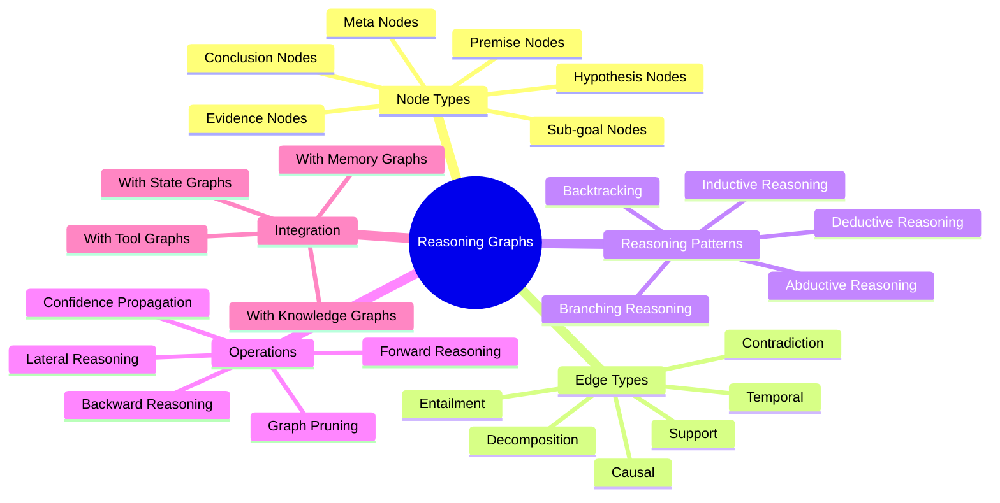
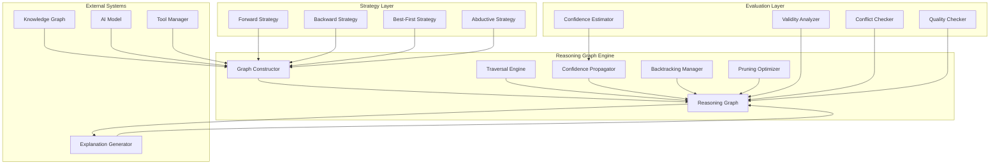
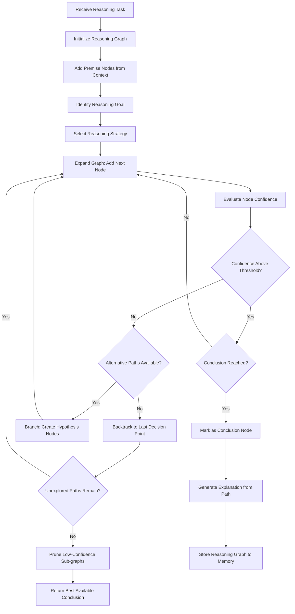
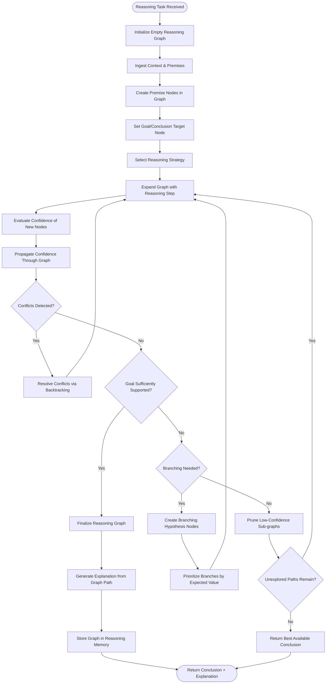
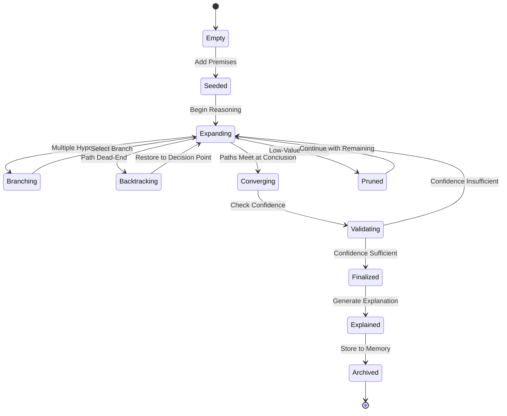
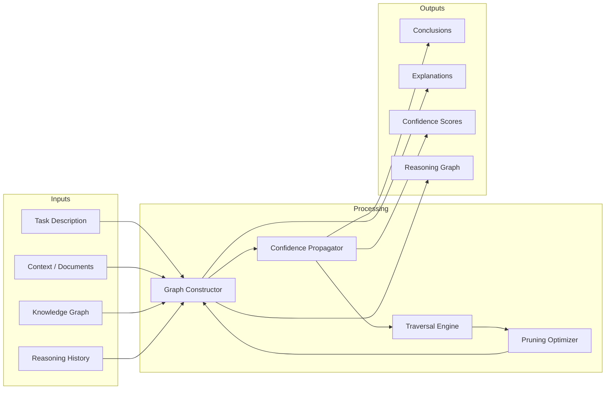
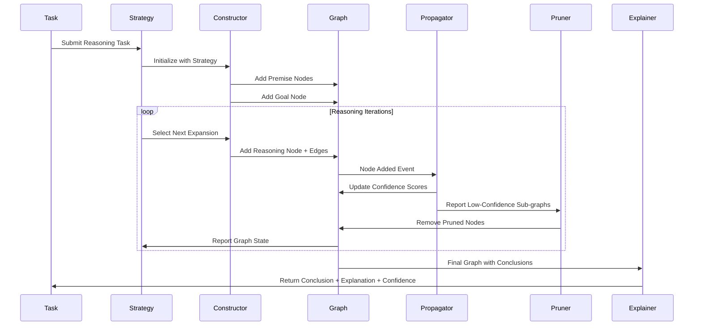

# Reasoning Graphs: Modeling AI Reasoning Processes as Graphs

## 📌 Overview

Reasoning Graphs are a powerful graph engineering pattern that represents the cognitive and inferential processes of AI systems as traversable graph structures, where each node captures a discrete reasoning step, intermediate conclusion, or hypothesis, and each edge encodes the logical, evidential, or heuristic relationship between reasoning steps. Rather than treating AI reasoning as an opaque sequence of tokens generated by a language model, reasoning graphs make the inferential chain explicit, decomposable, and inspectable. This explicit representation transforms reasoning from a black-box process into a structured, debuggable, and improvable graph that can be analyzed, optimized, and even corrected in real time.

In practice, reasoning graphs serve as the scaffolding upon which complex AI decision-making is built. When an AI agent needs to diagnose a problem, plan a solution, or evaluate competing hypotheses, it navigates through a graph of reasoning steps, branching into multiple exploration paths when uncertainty arises, backtracking when a line of reasoning proves unproductive, and converging on conclusions when multiple reasoning paths independently arrive at the same result. The graph structure naturally supports these behaviors: branching corresponds to exploring alternative hypotheses, backtracking corresponds to following reverse edges to earlier decision points, and convergence corresponds to multiple paths leading to the same conclusion node.

Reasoning graphs also provide the foundation for reasoning transparency and explainability in AI systems. By exposing the full graph of reasoning steps that led to a particular conclusion, the system can generate detailed explanations, identify which evidence was most influential, and reveal where reasoning may have gone astray. This is particularly valuable in high-stakes domains like medical diagnosis, legal analysis, and financial decision-making, where understanding why an AI reached a particular conclusion is as important as the conclusion itself.

## 🎯 Learning Objectives

This document will equip you with a comprehensive understanding of how to design, implement, and leverage reasoning graphs in AI system engineering. You will learn to identify the different reasoning paradigms (deductive, inductive, and abductive) and understand how each maps onto distinct graph structures and traversal patterns. You will develop the skill to decompose complex reasoning tasks into graph-friendly components, choosing appropriate node and edge types that capture the logical relationships inherent in the problem domain.

You will master the implementation of branching reasoning, where an AI system simultaneously explores multiple hypotheses or solution paths, and learn how to manage the computational cost of parallel exploration through pruning strategies, confidence-based prioritization, and early termination conditions. You will understand reasoning backtracking as a first-class graph operation, learning how to implement it efficiently using graph annotations that track the reasoning state at each node and enable rapid restoration to earlier decision points when a reasoning path dead-ends.

Furthermore, you will learn to integrate reasoning graphs with other graph structures in an AI system, such as knowledge graphs for evidence retrieval, state graphs for workflow control, and memory graphs for storing and retrieving past reasoning outcomes. This integration perspective is essential for building AI systems where reasoning is not an isolated activity but a deeply interconnected process that draws on and contributes to the system's broader graph-based architecture.

## 🧠 Definition

A Reasoning Graph is a directed, potentially cyclic graph `R = (N, E, A, W)` where `N` is a set of reasoning nodes representing propositions, conclusions, hypotheses, observations, or sub-goals; `E` is a set of reasoning edges representing logical relationships such as entailment, contradiction, support, weakening, or causal influence; `A` is a set of annotations attached to nodes and edges that capture confidence scores, evidence sources, reasoning types, and temporal ordering; and `W` is a set of weights on edges that represent the strength or relevance of the reasoning relationship. Unlike a simple chain of reasoning steps, a reasoning graph supports branching (multiple successors from a single node), merging (multiple predecessors converging on a single node), and cycles (recursive reasoning where conclusions feed back as premises).

Each reasoning node has a type classification that determines its role in the inferential process. Premise nodes represent given information or retrieved facts. Hypothesis nodes represent proposed explanations or predictions that require validation. Evidence nodes represent supporting or contradicting observations. Conclusion nodes represent final or intermediate deductions. Sub-goal nodes represent decomposed sub-problems that must be solved to advance the overall reasoning. These node types, combined with the edge relationships between them, create a rich structure that can represent virtually any reasoning pattern from simple linear deduction to complex abductive hypothesis generation and testing.

## ❓ Why It Matters

Reasoning graphs matter because the quality of an AI system's output is directly determined by the quality of its reasoning process, and making that process explicit as a graph is the most effective way to ensure, inspect, and improve that quality. Without a reasoning graph, an AI system's inferential process is buried within the hidden layers of neural networks and the implicit patterns of generated text, making it impossible to identify specific reasoning failures, biases, or gaps. When a medical AI recommends an incorrect treatment, or a financial AI makes a flawed prediction, the inability to trace the reasoning path that led to the error severely limits both corrective action and user trust.

Reasoning graphs provide the structural foundation for many advanced AI capabilities that are otherwise difficult to implement. Self-correction, where an AI detects and fixes errors in its own reasoning, requires the ability to inspect the reasoning graph, identify weakly supported conclusions, and trigger re-evaluation of specific sub-graphs. Meta-reasoning, where an AI reasons about its own reasoning process to choose better strategies, requires a first-class representation of the reasoning structure that can itself be reasoned about. Collaborative reasoning, where multiple AI agents or human-AI teams work together on complex problems, requires a shared reasoning graph that all participants can read, modify, and extend.

In production systems, reasoning graphs enable powerful operational capabilities. They allow monitoring systems to track reasoning quality in real time by measuring graph properties like average path length to conclusion, branching factor, backtracking frequency, and evidence coverage. They enable A/B testing of reasoning strategies by comparing the graph structures and outcomes produced by different reasoning approaches. They support incremental reasoning, where new information can be incorporated by extending the existing graph rather than restarting the entire reasoning process, dramatically improving efficiency for long-running analytical tasks.

## 🏛️ Core Concepts

The first core concept is the reasoning node taxonomy, which classifies nodes by their epistemic role. Premise nodes anchor the graph in established facts or observations. Working nodes represent intermediate computational steps like calculations, comparisons, or classifications. Hypothesis nodes represent tentative conclusions that require further validation. Conclusion nodes represent reasoning outcomes that have sufficient support to be considered established. Meta-nodes represent observations about the reasoning process itself, such as confidence assessments or strategy selections. This taxonomy provides the vocabulary for building meaningful reasoning graphs that capture the full richness of inferential processes.

The second core concept is the reasoning edge semantics, which define what different types of edges mean in the reasoning context. Entailment edges indicate that the source node logically implies the target node. Support edges indicate that the source node provides evidential weight for the target node without strict entailment. Contradiction edges indicate that the source node undermines or refutes the target node. Causal edges indicate that the source node is a cause of the target node. Temporal ordering edges indicate that the source reasoning step must occur before the target step. Decomposition edges indicate that the target node is a sub-problem of the source node. These edge types create a rich relational vocabulary that can express complex reasoning patterns.

The third core concept is reasoning graph dynamics, which encompasses how the graph grows, shrinks, and reorganizes during the reasoning process. Forward reasoning expands the graph from premises toward conclusions by adding new nodes and edges. Backward reasoning expands the graph from a goal or hypothesis toward premises by identifying what would need to be true to support the goal. Lateral reasoning connects nodes within the same abstraction level, finding analogies, contradictions, or complementary relationships. Pruning removes nodes and sub-graphs that have been determined to be unproductive, reducing computational cost and focusing reasoning resources on promising paths.

## 🧩 Key Components

The key components of a reasoning graph system include the graph constructor, which builds and extends the reasoning graph by adding nodes and edges as reasoning progresses; the traversal engine, which navigates the graph to explore reasoning paths, identify conclusions, and detect contradictions; the confidence propagator, which computes and updates confidence scores across the graph based on the strength of supporting and contradicting evidence; the backtracking manager, which handles the reversal of reasoning steps when paths dead-end; and the pruning optimizer, which removes low-value sub-graphs to focus computational resources.

The graph constructor operates under the direction of a reasoning strategy, which determines the order in which new nodes are added and which existing nodes are connected. Strategies include breadth-first exploration (useful for exhaustive hypothesis generation), depth-first exploration (useful for quickly reaching conclusions along promising paths), and best-first exploration (which prioritizes nodes with the highest confidence scores or the greatest expected information gain). The constructor also handles node deduplication, ensuring that the same proposition is not represented by multiple redundant nodes.

The confidence propagator implements a form of belief propagation across the reasoning graph. When new evidence is added as a node with supporting edges to existing hypotheses, the propagator updates the confidence scores of all affected nodes, potentially triggering cascading updates across the graph. This propagation follows the graph structure: support edges increase confidence, contradiction edges decrease confidence, and the overall confidence of a conclusion depends on the weighted combination of all incoming evidence. The propagator also handles conflicting evidence by computing both an aggregate confidence score and a conflict score that indicates the degree of disagreement among evidence sources.

## 🧭 Mental Model

Imagine a detective's investigation board, the kind you see in police procedural shows with photos, documents, and strings connecting related pieces of evidence. Each pin on the board is a reasoning node: a witness statement, a forensic result, a suspect's alibi, or a tentative theory about what happened. The strings connecting the pins are reasoning edges: red strings for contradictions, green strings for supporting evidence, and blue strings for causal relationships. As the investigation progresses, the detective adds new pins and strings, removes ones that don't pan out, and gradually builds a web of interconnected evidence that points toward a conclusion.

Now imagine that this board is alive: it can automatically suggest new connections, highlight inconsistencies, and identify which pieces of evidence are most critical to the current theory. When a contradiction is found, the board highlights the conflicting pins in red, and the detective can trace the red strings back to identify where the theory broke down. The detective can also place a "what if" pin on the board to explore an alternative theory, and the board will automatically show how this new theory connects to the existing evidence, which evidence supports it, and which evidence contradicts it. This living investigation board is a reasoning graph: a dynamic, interconnected representation of the reasoning process that supports exploration, validation, and explanation.

## 🗺️ Mind Map

## 🏗️ Architecture Diagram

## 🔄 Workflow

## ⚙️ Internal Working

The reasoning graph engine begins operation by receiving a reasoning task and initializing an empty graph structure. The first phase is context ingestion, where the system extracts relevant premises from the task description, retrieved documents, conversation history, and any external knowledge sources. Each distinct piece of information becomes a premise node in the graph, annotated with its source, relevance score, and temporal freshness. The system then identifies the reasoning goal, which becomes the target conclusion node that the graph will attempt to reach and support through connected reasoning steps.

With the initial graph seeded with premises and a goal, the strategy layer selects a reasoning approach based on the task characteristics. For well-structured problems with clear logical rules, deductive reasoning is chosen, and the engine applies forward chaining from premises toward the goal. For hypothesis generation problems like diagnosis or prediction, abductive reasoning is selected, and the engine generates candidate hypothesis nodes that could explain the observed premises, then seeks evidence to support or refute each hypothesis. For pattern recognition problems, inductive reasoning is used, generalizing from specific instances to broader rules.

As the graph expands, the confidence propagator continuously updates confidence scores across all nodes. When a new evidence node is added with a support edge to a hypothesis, the hypothesis's confidence increases proportionally to the evidence's reliability and the edge's weight. When a contradiction edge is added, confidence decreases. The propagation algorithm handles cascading effects: if a hypothesis's confidence changes, all conclusions that depend on that hypothesis are re-evaluated. The pruning optimizer monitors the graph for sub-trees that have accumulated very low confidence scores and removes them to prevent the graph from growing unboundedly. The backtracking manager maintains a stack of decision points where the reasoning branched, enabling efficient reversal when a chosen path proves unproductive.

## 🔀 Execution Flow

## 📊 Lifecycle

## 📡 Data Flow

## 🤝 Interaction Flow

## 🌍 Real-World Analogy

Think of a reasoning graph as the thought process of a master chess player visualized on a decision tree board. At each position, the player considers multiple possible moves (branching), evaluates the likely responses of the opponent (forward reasoning), and mentally simulates several moves ahead (graph expansion). If a particular line of play looks unpromising, the player abandons it and considers a different move (backtracking). When multiple lines of analysis converge on the same evaluation, the player gains confidence in that assessment (convergence and confidence propagation).

Unlike a simple linear analysis, the chess player's reasoning is deeply interconnected: the evaluation of one variation influences the perceived value of another, and insights from a rejected line might inform the analysis of a completely different branch. The player also maintains a sense of which variations are most critical and which can be safely ignored (pruning), and can explain their final move choice by referencing the key variations they considered (explanation generation). A reasoning graph captures all of these interconnected analytical processes in a single, traversable structure that mirrors how expert reasoning actually works.

## 💡 Practical Example

Consider an AI-powered diagnostic assistant that must determine why a patient is experiencing chronic headaches. The reasoning graph begins with premise nodes representing the patient's symptoms, medical history, and test results. The system then uses abductive reasoning to generate hypothesis nodes: `tension_headache`, `migraine`, `sinusitis`, `medication_overuse`, and `intracranial_hypertension`. Each hypothesis node connects back to the symptom premises through support edges of varying strength.

The system then generates sub-goal nodes for gathering additional evidence, such as `check_blood_pressure`, `review_medication_history`, and `order_imaging`. As evidence is gathered, new evidence nodes are added to the graph. A normal blood pressure reading adds a contradiction edge to the `intracranial_hypertension` hypothesis, reducing its confidence. A medication history showing daily painkiller use adds a strong support edge to `medication_overuse`, increasing its confidence. The confidence propagator continuously updates all hypothesis scores, and the pruning optimizer eventually removes `intracranial_hypertension` from active consideration. When `medication_overuse` reaches a confidence threshold, the system finalizes it as the primary conclusion and generates an explanation by tracing the supporting path through the graph: "The patient's chronic headaches are most likely caused by medication overuse, supported by daily painkiller use for six months, worsened headache frequency despite medication, and normal neurological examination findings."

## 🧪 Use Cases

Reasoning graphs are valuable in any AI application where the reasoning process itself needs to be transparent, debuggable, or improvable. In medical diagnosis, they provide traceable diagnostic reasoning that clinicians can review and validate, supporting rather than replacing human judgment. In legal analysis, they model the chain of legal reasoning from facts through applicable rules to conclusions, enabling AI systems to generate legal arguments that can be examined for logical soundness and compliance with precedent.

In scientific research, reasoning graphs support hypothesis generation and experimental design by mapping the relationships between observations, existing theories, and proposed experiments. In fraud detection, they model the evidential chain from suspicious transaction patterns to fraud conclusions, enabling investigators to understand and validate the system's reasoning. In automated planning and scheduling, reasoning graphs represent the space of possible plans as a graph where nodes are plan states and edges are actions, supporting plan generation, comparison, and optimization. In educational AI, reasoning graphs model student problem-solving processes, enabling intelligent tutoring systems to identify specific reasoning errors and provide targeted feedback.

## ⚖️ Comparison

| Aspect | Reasoning Graphs | Chain-of-Thought | Tree-of-Thought | |--------|---------------|-----------------|-----------------|
| Structure | General graph with cycles | Linear sequence | Tree without cycles | | Backtracking | Native via graph reversal | Not supported | Limited via tree traversal | | Branching | Arbitrary branching and merging | None | Branching without merging | | Confidence | Propagated across graph | Implicit in text | Per-branch scoring | | Explanation | Path-based with evidence tracing | Sequential text | Branch comparison | | Integration | Connects to knowledge, memory, state graphs | Standalone | Standalone | | Scalability | Pruning and partitioning strategies | Limited by context length | Limited by branching factor |

## ✅ Best Practices

Design your reasoning graphs with a clear distinction between node types (premise, hypothesis, evidence, conclusion) and edge types (support, contradiction, entailment, causal), as this type discipline makes the graph interpretable and enables automated analysis. Always attach confidence scores to reasoning nodes and strength weights to reasoning edges, as these quantitative annotations enable the confidence propagation and pruning mechanisms that keep reasoning efficient. Implement early pruning of clearly unproductive reasoning paths to prevent combinatorial explosion, but maintain a record of pruned sub-graphs so that reasoning can be revisited if new evidence emerges.

Use backward reasoning for goal-directed tasks where the conclusion is known but the path is not, and forward reasoning for evidence-driven tasks where the premises are clear but the implications are not. Combine both approaches in a bidirectional strategy for complex tasks. Ensure your reasoning graph integrates cleanly with your knowledge graph, using the knowledge graph as the source of premise nodes and the reasoning graph as the process that connects premises to conclusions. Document your reasoning strategies as reusable components that can be selected based on task characteristics, enabling the same reasoning graph engine to handle diverse problem types.

## ❌ Common Mistakes

A common mistake is building reasoning graphs that are too shallow, jumping quickly from premises to conclusions without sufficient intermediate reasoning steps, which produces fragile conclusions that fail when edge cases arise. Another frequent error is neglecting to handle contradictions properly, allowing contradictory conclusions to coexist in the graph without resolution, which undermines the reliability of the reasoning output. This often happens when developers focus on adding supporting evidence while ignoring contradicting evidence, creating an optimistic bias in the reasoning process.

Over-reliance on a single reasoning strategy is another pitfall: using only forward reasoning when a problem requires abductive hypothesis generation, or only depth-first exploration when breadth-first would provide better coverage of the solution space. Developers also frequently build reasoning graphs without considering the computational budget, allowing the graph to grow without bound until the system runs out of memory or time. Finally, failing to persist reasoning graphs for later analysis is a missed opportunity: reasoning graphs from past tasks are valuable training data for improving reasoning strategies and can be retrieved to inform future reasoning on similar problems.

## 🚀 Advanced Topics

Neural reasoning graphs represent an exciting frontier where the structure and dynamics of reasoning graphs are learned rather than hand-designed. In this approach, a neural network is trained to construct reasoning graphs by predicting which nodes to add, which edges to create, and when to conclude, with the training signal coming from human expert reasoning traces or from self-play where the system learns to improve its graph construction through trial and error. This combines the interpretability of graph-based reasoning with the adaptability of learned systems.

Collaborative reasoning graphs extend the single-agent reasoning model to multi-agent settings where multiple AI agents or human-AI teams jointly construct and maintain a shared reasoning graph. Each participant can add nodes, propose edges, and challenge existing connections, with a consensus mechanism that resolves disagreements and maintains graph coherence. Temporal reasoning graphs add a time dimension, where nodes and edges are timestamped and the graph can represent how reasoning evolves over time, enabling the system to reason about its own learning process and identify when and why its conclusions changed. Quantum-inspired reasoning graphs explore superposition states where multiple hypotheses can be simultaneously active with weighted probabilities, collapsing to a single conclusion when sufficient evidence accumulates, offering a novel approach to handling deep uncertainty in complex reasoning tasks.
