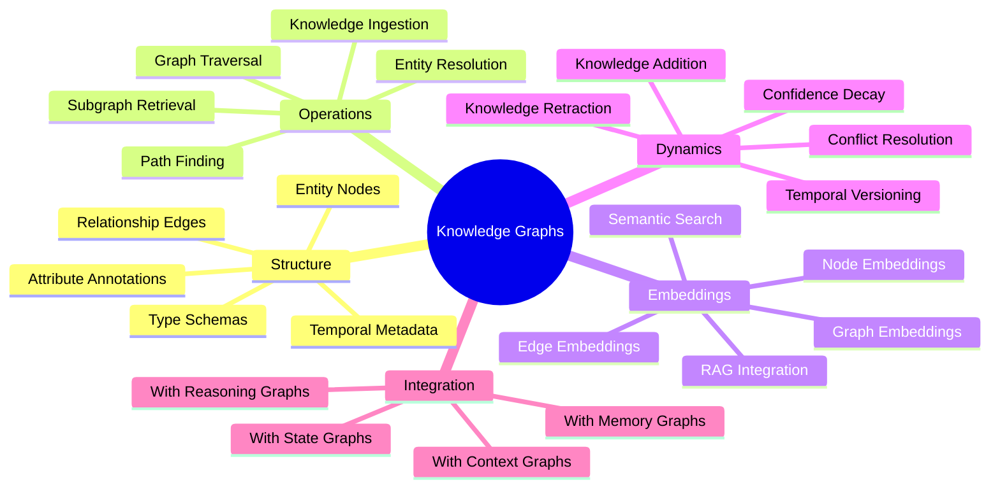
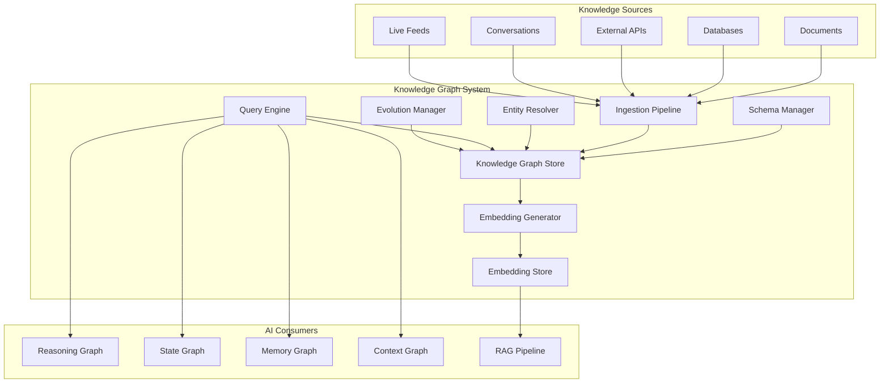
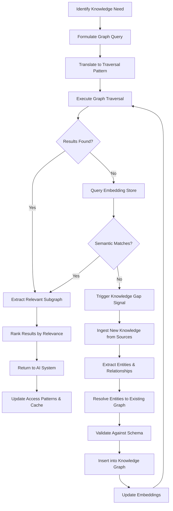
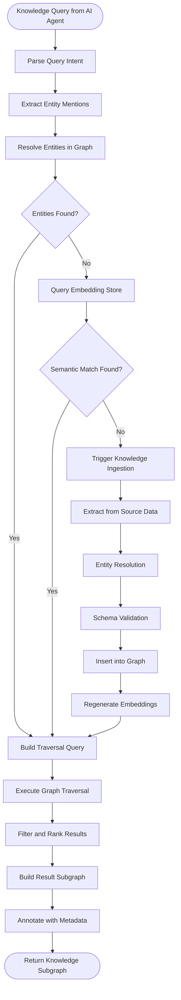
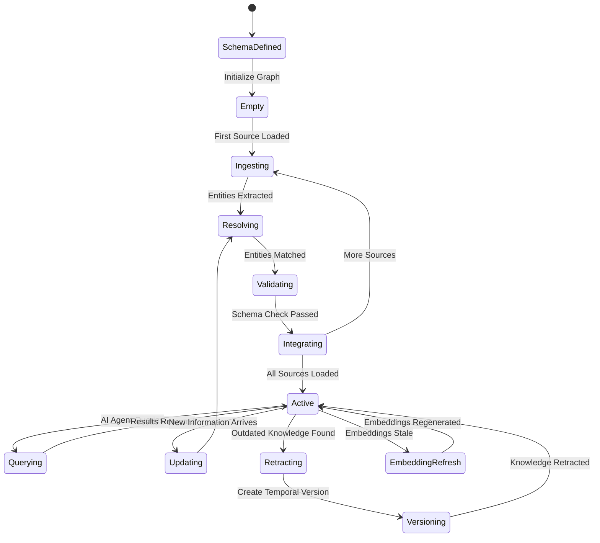
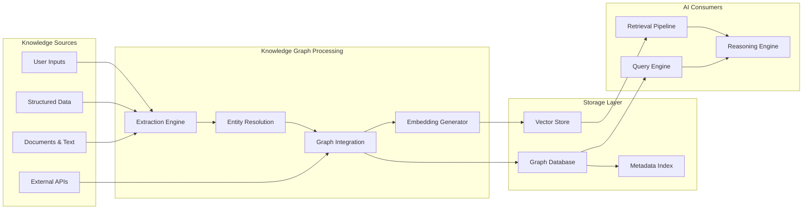
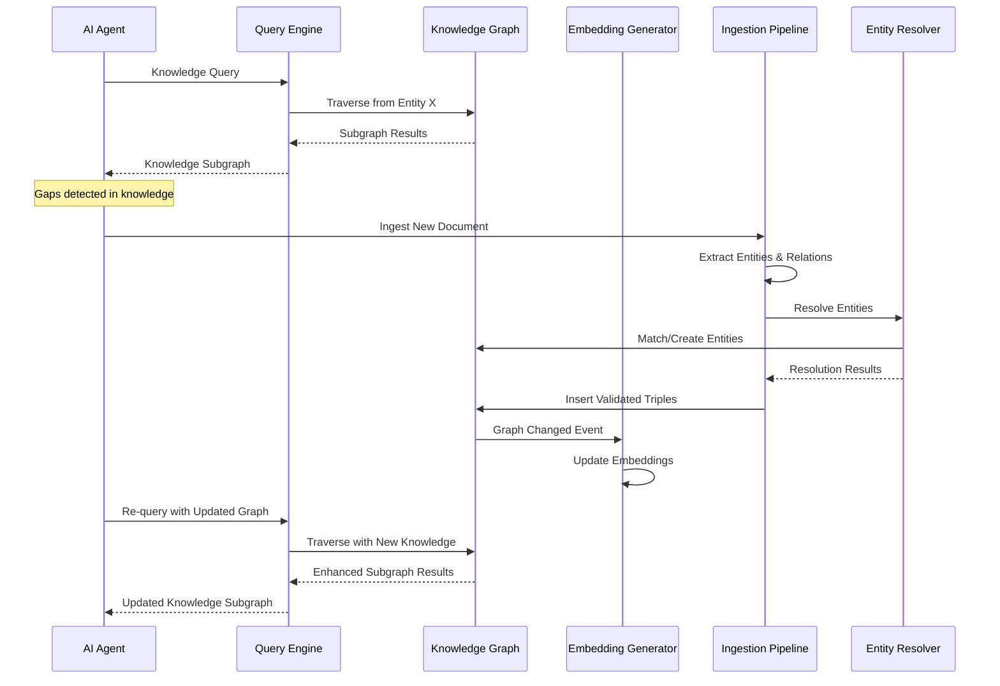

# Knowledge Graphs: Knowledge Representation as Graphs for AI Systems

## 📌 Overview

Knowledge Graphs are structured representations of real-world knowledge encoded as graphs, where entities (people, organizations, concepts, events, locations) form nodes and the relationships between those entities form typed, directed edges. In the context of graph engineering for AI systems, knowledge graphs serve as the persistent, queryable knowledge backbone that grounds AI reasoning, response generation, and decision-making in verified, structured information rather than relying solely on the implicit and often unreliable knowledge encoded in model weights. They transform the AI system from a knowledge-implicit processor into a knowledge-augmented reasoner that can retrieve, verify, and reason over explicit knowledge structures.

The power of knowledge graphs in AI engineering lies not in their novelty as a data structure, but in how they integrate with and enhance every other component of a graph-engineered AI system. Knowledge graphs feed premises into reasoning graphs, provide context for state graph transitions, populate memory graphs with persistent facts, and supply the structured data that tool graphs need to operate effectively. When an AI agent needs to answer a question about a company's organizational structure, a knowledge graph provides the definitive answer by traversing the employee-manager-reporting relationships. When a diagnostic agent needs to understand drug interactions, the knowledge graph encodes the pharmacological relationships that enable accurate reasoning.

Modern AI-oriented knowledge graphs differ from traditional enterprise knowledge graphs in their dynamic nature. While classic knowledge graphs are built through painstaking manual curation and updated infrequently, AI-oriented knowledge graphs are designed for continuous growth and evolution, with the AI system itself contributing new entities, relationships, and annotations as it processes information and encounters novel knowledge. This dynamic knowledge graph approach creates a living knowledge structure that grows more comprehensive and accurate over time, directly improving the AI system's capabilities with each interaction.

## 🎯 Learning Objectives

This document will provide you with a thorough understanding of how to design, build, and operate knowledge graphs specifically optimized for AI system integration. You will learn to identify the types of knowledge that benefit most from graph representation, distinguishing between factual knowledge best stored as entity-relationship triples, procedural knowledge best stored as workflow subgraphs, and conceptual knowledge best stored as hierarchical taxonomies connected through is-a and part-of relationships.

You will master the techniques for implementing knowledge retrieval as graph traversal, understanding how to translate natural language queries into graph traversal patterns, how to use graph algorithms like shortest path, subgraph matching, and community detection to retrieve relevant knowledge, and how to rank retrieved knowledge by relevance and reliability. You will learn to implement knowledge integration pipelines that merge information from multiple sources (documents, databases, APIs, user interactions) into a coherent graph structure, handling entity resolution, relationship reconciliation, and conflict detection.

Furthermore, you will understand how to generate knowledge graph embeddings that capture the semantic structure of the graph in vector form, enabling semantic similarity search, nearest-neighbor retrieval, and integration with embedding-based retrieval systems like RAG. You will also learn to implement dynamic knowledge graphs that evolve in real time as the AI system processes new information, with mechanisms for knowledge addition, modification, retraction, and temporal versioning that maintain graph consistency and reliability.

## 🧠 Definition

A Knowledge Graph in the AI graph engineering context is a labeled, directed multigraph `K = (E, R, T, A)` where `E` is a set of entity nodes representing real-world objects, concepts, or values; `R` is a set of relationship edges connecting entity pairs through typed, directed relationships such as `works_for`, `located_in`, `causes`, or `is_a`; `T` is a set of type schemas that define the valid entity types, relationship types, and their constraints (domain and range restrictions, cardinality constraints, inverse relationships); and `A` is a set of attribute annotations attached to both entities and relationships that capture metadata such as confidence scores, temporal validity, source provenance, and semantic types.

Each entity node in the knowledge graph has a unique identifier, a human-readable label, one or more type classifications from the type schema, and a set of attribute key-value pairs that capture the entity's properties. A person entity might have attributes like `name`, `birth_date`, and `role`, while a concept entity like "machine learning" might have attributes like `definition`, `related_field`, and `complexity_level`. Each relationship edge has a type from the relationship schema, a subject (source entity), an object (target entity), and optional attributes like `confidence`, `source`, `start_time`, and `end_time` that provide additional context about the relationship.

The type schema `T` is a critical component that distinguishes a well-engineered knowledge graph from a loose collection of triples. The schema defines which entity types exist, what attributes each type can have, which relationship types can connect which entity types, and what constraints must be satisfied for the graph to be considered consistent. This schema serves as the contract between the knowledge graph and the AI systems that consume it, ensuring that queries are well-formed, retrievals are meaningful, and the knowledge structure remains coherent as it grows and evolves.

## ❓ Why It Matters

Knowledge graphs matter for AI systems because they address the fundamental limitations of relying solely on parametric knowledge encoded in neural network weights. Model knowledge is static (frozen at training time), unreliable (subject to hallucination), untraceable (impossible to verify the source of a specific piece of knowledge), and difficult to update (requiring retraining or fine-tuning to correct errors). Knowledge graphs provide the complementary capabilities that overcome each of these limitations: they are dynamically updatable, factually grounded, fully traceable to their sources, and modifiable through targeted edits without retraining.

In production AI systems, knowledge graphs provide the authoritative knowledge layer that enables reliable, verifiable, and auditable AI behavior. When a financial AI generates investment recommendations, the underlying knowledge graph provides the verified company relationships, financial data connections, and regulatory constraint links that ground the recommendations in factual reality. When a legal AI analyzes a case, the knowledge graph provides the statutory relationships, precedent connections, and jurisdictional hierarchies that ensure legally sound reasoning. Without a knowledge graph, these systems would be forced to rely on the model's implicit knowledge, which may be outdated, incomplete, or simply wrong for the specific case at hand.

Knowledge graphs also enable a fundamentally different interaction pattern between AI systems and their knowledge base. Instead of treating knowledge as a static resource that is either present or absent in the model's weights, knowledge graphs support active knowledge exploration where the AI can traverse relationships, discover unexpected connections, and build contextual understanding by following paths through the graph. This exploratory capability is essential for complex reasoning tasks where the relevant knowledge is not known in advance but must be discovered through iterative investigation of the knowledge structure.

## 🏛️ Core Concepts

The first core concept is the entity-relationship model, which forms the atomic building blocks of every knowledge graph. Entities represent the "nouns" of the knowledge domain, the distinct things that exist and can be talked about. Relationships represent the "verbs" that connect entities, expressing how entities relate to, interact with, or influence each other. This simple but powerful dualism can represent virtually any domain knowledge, from biological taxonomies (species-is_a-genus, protein-interacts_with-protein) to organizational structures (employee-reports_to-manager, department-owns_project) to causal models (event-causes-event, risk_factor-increases-disease).

The second core concept is knowledge retrieval as graph traversal, which reframes the problem of finding relevant knowledge as navigating through the graph structure. Rather than using keyword search or vector similarity to find relevant information, graph traversal leverages the relational structure of the knowledge graph to find information that is semantically connected to the query, even if it shares no keywords or surface-level similarity with the query text. A query about "who has the authority to approve this budget" can be answered by traversing the organizational hierarchy graph from the budget item to the responsible department to the department head to the approval authority chain.

The third core concept is knowledge integration, the process of merging information from diverse sources into a unified, consistent graph structure. Integration involves entity resolution (determining that "Apple Inc." and "Apple Computer" refer to the same entity), relationship reconciliation (merging conflicting relationship assertions from different sources), and schema alignment (mapping different source schemas to the unified graph schema). Effective integration is what separates a knowledge graph that is merely a collection of triples from one that provides a coherent, reliable, and comprehensive picture of the knowledge domain.

## 🧩 Key Components

The key components of a knowledge graph system for AI include the schema manager, which defines and evolves the type system for entities and relationships; the ingestion pipeline, which extracts entities and relationships from source data and adds them to the graph; the entity resolver, which identifies when newly ingested entities correspond to existing graph entities; the query engine, which translates AI system queries into graph traversals and returns relevant subgraphs; the embedding generator, which produces vector representations of graph elements for semantic retrieval; and the evolution manager, which handles knowledge updates, retractions, and temporal versioning.

The ingestion pipeline is the gateway through which new knowledge enters the graph. It typically consists of an extraction stage (using NLP models or structured data parsers to identify entities and relationships in source content), a normalization stage (standardizing entity names, relationship types, and attribute formats), a validation stage (checking extracted triples against the schema for type compliance), and an insertion stage (adding validated triples to the graph with appropriate metadata). The pipeline must handle both structured sources (databases, APIs, spreadsheets) and unstructured sources (documents, conversations, web pages), each requiring different extraction strategies.

The query engine is the component that AI systems interact with most directly. It accepts queries in various forms (natural language, structured query languages, graph pattern specifications) and translates them into efficient graph traversals. The query engine supports multiple retrieval patterns: exact match (find a specific entity by ID), pattern match (find all entities matching a structural pattern), neighborhood retrieval (find all entities within N hops of a given entity), path finding (find paths connecting two entities), and semantic retrieval (find entities similar to a given entity using graph embeddings). The results are typically returned as subgraphs that preserve the relational context of the retrieved knowledge.

## 🧭 Mental Model

Think of a knowledge graph as a vast, interconnected library where every book is connected to every other book through a web of cross-references, footnotes, and subject classifications. But unlike a traditional library where you search for books by title or author and then read them in isolation, in this library you can follow the connections between books to discover unexpected relationships. You start with a book about World War II, follow a connection to a book about radar technology, follow another connection to a book about electromagnetic theory, and suddenly you understand how a physics discovery led to a military technology that shaped world events.

Now imagine that this library has a team of tireless librarians who continuously read new books, articles, and documents, extracting the key facts and relationships and adding new connections to the web. They also check existing connections for accuracy, removing outdated information and correcting errors. The library grows more comprehensive and more accurate every day. When an AI agent needs to answer a question, it doesn't try to recall the answer from memory; instead, it navigates this living web of knowledge, following the most relevant connections to build an understanding that is grounded in verified, traceable information. This is the knowledge graph: a living, growing, navigable structure of human and AI-curated knowledge.

## 🗺️ Mind Map

## 🏗️ Architecture Diagram

## 🔄 Workflow

## ⚙️ Internal Working

The knowledge graph system operates through a continuous cycle of ingestion, integration, and retrieval. During ingestion, source data flows through the ingestion pipeline where extraction models identify entity mentions and relationship assertions in the raw content. For structured sources like databases, extraction is straightforward, mapping table rows to entities and foreign key relationships to graph edges. For unstructured sources like documents, extraction uses named entity recognition, relation extraction, and event extraction models to identify knowledge elements in natural language text.

Once extracted, the entity resolver determines whether each extracted entity corresponds to an existing node in the knowledge graph. This is a challenging problem that requires matching entities across different name variations, abbreviations, and contextual references. The resolver uses a combination of string similarity, embedding similarity, and graph neighborhood analysis to make matching decisions. When a match is found, the new information is merged into the existing entity's attributes and relationships. When no match is found, a new entity node is created. This resolution process is critical for maintaining graph coherence, as duplicate entities would create fragmented, unreliable knowledge.

The query engine processes retrieval requests from AI system components by translating them into graph traversal operations. Natural language queries are first parsed to identify the key entities and relationships being requested, then mapped to graph patterns that specify the starting nodes, traversal paths, and target node types. The engine executes these traversals using graph database operations, applying filters, sorting, and pagination as needed. For queries that are better served by semantic similarity, the engine queries the embedding store to find entities whose vector representations are closest to the query vector, then retrieves the graph neighborhoods of those entities to provide relational context. The evolution manager monitors the graph for knowledge that needs updating, retracting outdated information and maintaining temporal versioning so that the graph can represent how knowledge has changed over time.

## 🔀 Execution Flow

## 📊 Lifecycle

## 📡 Data Flow

## 🤝 Interaction Flow

## 🌍 Real-World Analogy

Consider the knowledge graph as the collective brain of a vast research university, where every department maintains its own detailed records (biology has organism taxonomies, chemistry has molecular structures, history has event timelines) but all departments are connected through a shared campus network. A biology professor researching a new drug doesn't just look within the biology department's records; they traverse the network to find chemistry department data about molecular structures, the pharmacology department's data about drug interactions, and the medical school's clinical trial results.

Each piece of knowledge in this university brain has a citation trail: who discovered it, when it was published, and whether it has been superseded by newer findings. When conflicting information exists between departments, there's a review process that evaluates the evidence and resolves the conflict, updating the shared record accordingly. New research continuously flows into the system from publications, experiments, and clinical observations, and the university brain automatically integrates it, connecting new findings to existing knowledge and alerting relevant departments when their domains are affected. A knowledge graph in an AI system plays exactly this role: it is the interconnected, citable, continuously updated knowledge repository that grounds the AI's reasoning and responses in verified, contextualized information.

## 💡 Practical Example

Imagine building an AI-powered enterprise assistant that helps employees navigate a large organization. The knowledge graph captures the organizational structure (employee-reports_to-manager, team-belongs_to-department, department-has_budget), the project portfolio (project-owned_by-department, project-involves_employee, project-has_milestone), the knowledge base (document-authored_by-employee, document-about_topic, document-references_document), and the operational calendar (event-organized_by-department, event-attends_employee, event-deadline_for_milestone).

When an employee asks, "Who can help me understand the Q3 budget allocation for Project Phoenix?" the AI agent formulates a graph query that starts at the Project Phoenix node, traverses the owned_by relationship to find the responsible department, then traverses the has_budget relationship to find the budget allocation, and the reports_to chain to find the budget approver. Simultaneously, it queries the embedding store for documents semantically similar to "Q3 budget allocation for Project Phoenix" and retrieves the relevant financial planning documents, connecting them to their authors who can provide additional context. The result is a rich, multi-path answer: "The Q3 budget for Project Phoenix is managed by the Engineering department. Sarah Chen (Engineering Finance Lead) oversees the allocation, and the budget was approved by James Park (VP Engineering). Here are the three most relevant budget planning documents, authored by Sarah Chen and reviewed by the Finance team."

## 🧪 Use Cases

Knowledge graphs are applicable wherever AI systems need to reason over structured, interconnected domain knowledge. In enterprise AI assistants, they model organizational structures, project relationships, and document networks, enabling the assistant to answer complex questions that span multiple departments and knowledge domains. In research AI systems, they model scientific knowledge including hypotheses, experiments, findings, and citations, enabling the system to identify research gaps, suggest experiments, and synthesize findings across studies.

In customer-facing AI systems, they model product catalogs, customer profiles, purchase histories, and support ticket networks, enabling personalized recommendations, root cause analysis for support issues, and proactive customer service. In compliance and regulatory AI, they model regulatory requirements, organizational policies, and compliance obligations, enabling automated compliance checking and regulatory impact analysis. In healthcare AI, they model patient histories, drug interactions, clinical guidelines, and disease taxonomies, enabling clinical decision support that is grounded in verified medical knowledge. In security AI, they model threat intelligence, vulnerability networks, and attack patterns, enabling threat detection and response that leverages the interconnected nature of security knowledge.

## ⚖️ Comparison

| Aspect | AI Knowledge Graphs | Traditional KGs | Vector Stores | Relational DBs |
|--------|-------------------|-----------------|---------------|----------------|
| Query Pattern | Graph traversal + semantic | Graph traversal | Vector similarity | SQL joins |
| Relationship Modeling | First-class with types | First-class with types | Implicit only | Foreign keys |
| Semantic Search | Supported via embeddings | Not natively supported | Primary strength | Not supported |
| Dynamic Updates | Continuous, AI-driven | Batch, manual | Append-only | Transactional |
| Schema Flexibility | Schema-enforced but evolving | Strict schema enforcement | Schema-free | Strict schema |
| AI Integration | Native: feeds reasoning, state, memory | External adapter needed | Embedding-compatible | Requires ETL |
| Temporal Versioning | Built-in | Usually absent | Not supported | Via audit tables |

## ✅ Best Practices

Design your knowledge graph schema to reflect the actual reasoning patterns of your AI system, not just the structure of your data. Identify the types of questions your AI will need to answer and ensure the schema supports efficient traversal paths for those question patterns. Use consistent, well-documented naming conventions for entity types and relationship types, as the schema serves as the contract between the knowledge graph and every AI component that consumes it. Implement comprehensive provenance tracking, recording the source, confidence, and temporal validity of every piece of knowledge, as this metadata is essential for the AI system to reason about the reliability and relevance of retrieved knowledge.

Invest in high-quality entity resolution from the start, as duplicate or fragmented entities are the most common and most damaging form of knowledge graph corruption. Use a combination of deterministic rules (exact name matching, ID matching) and learned models (embedding similarity, graph neighborhood features) for robust resolution. Implement embedding generation as a continuous process that updates vector representations as the graph changes, rather than a one-time batch operation, to ensure that semantic retrieval stays synchronized with the graph's current state. Design your query engine to support both exact graph traversal and semantic vector search, and to combine results from both approaches for maximum retrieval quality.

## ❌ Common Mistakes

A frequent mistake is building a knowledge graph without a clear schema, treating it as a triple store where any entity can connect to any other entity through any relationship type. This leads to a chaotic, unreliable graph where queries return inconsistent results and the AI system cannot distinguish between well-established, highly-connected knowledge and isolated, poorly-supported assertions. Another common error is neglecting entity resolution, allowing the same real-world entity to exist under multiple node IDs, which fragments the knowledge and produces incomplete query results.

Developers also frequently build knowledge graphs that are disconnected from the AI system's reasoning process, treating the knowledge graph as a standalone database rather than as an integral component of the graph-engineered system. This leads to knowledge that is never queried, relationships that are never traversed, and a knowledge graph that provides minimal value despite the investment in building it. Over-focusing on knowledge ingestion while neglecting knowledge retrieval and utilization is another pitfall: a massive knowledge graph is worthless if the AI system's query patterns cannot effectively extract relevant knowledge from it. Finally, failing to implement knowledge retraction and temporal versioning means that the graph accumulates outdated and contradictory knowledge over time, gradually degrading the AI system's performance as the knowledge base becomes less reliable.

## 🚀 Advanced Topics

Dynamic knowledge graphs represent the cutting edge of knowledge graph engineering, where the graph structure itself evolves in response to the AI system's needs. In a dynamic knowledge graph, entities and relationships can be temporarily activated or deactivated based on context, entire subgraphs can be loaded and unloaded as needed, and the graph's topology can reorganize itself based on usage patterns and relevance signals. This approach enables AI systems to maintain extremely large knowledge graphs that would be impractical to keep fully loaded in memory, while still providing fast access to the most relevant portions of the knowledge structure.

Knowledge graph embeddings for prompt engineering is an emerging technique where the structural and semantic information captured in the knowledge graph is encoded into vector representations that can be directly injected into AI model prompts. Rather than retrieving discrete triples and formatting them as text, the system retrieves graph subgraphs, encodes them as embedding vectors using graph neural networks, and includes these vectors as part of the prompt's context. This approach preserves the relational structure of the knowledge in a form that the model can process more naturally, leading to better reasoning over the retrieved knowledge. Multi-modal knowledge graphs extend the traditional entity-relationship model to include nodes and edges that represent visual, auditory, and other non-textual knowledge, enabling AI systems to reason across modalities using a unified graph structure.
