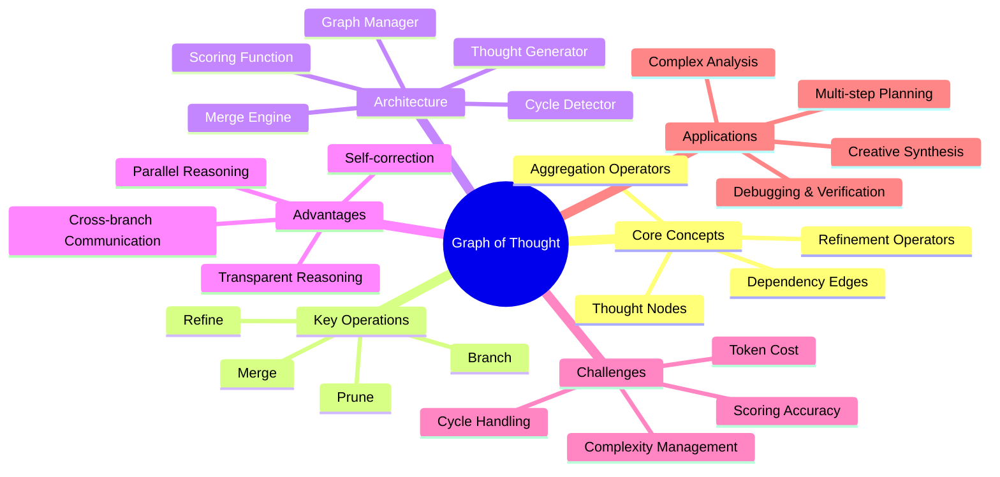
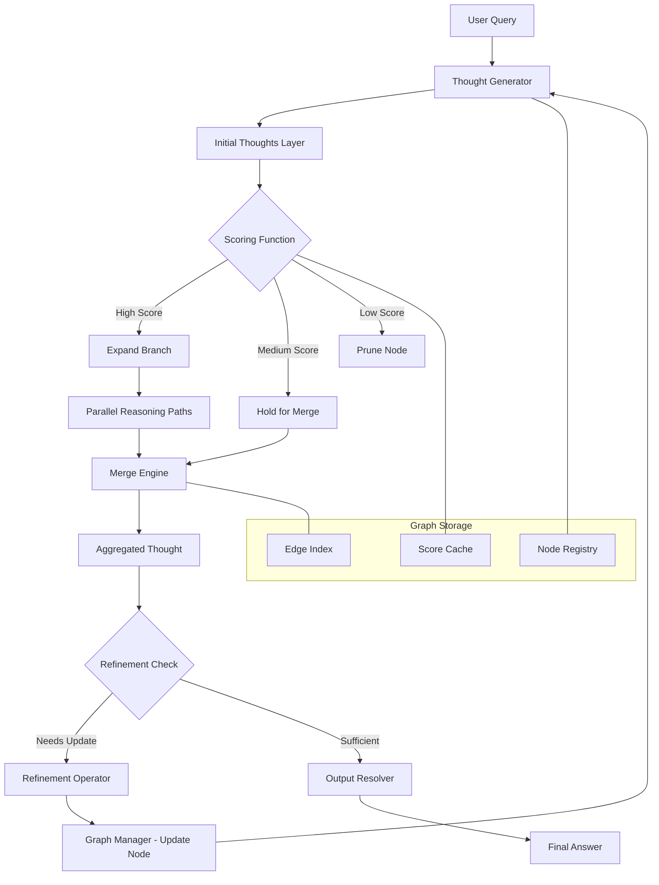
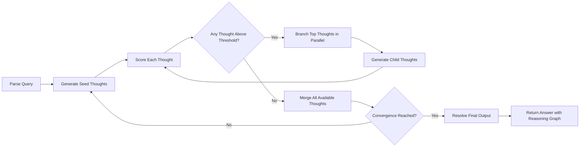
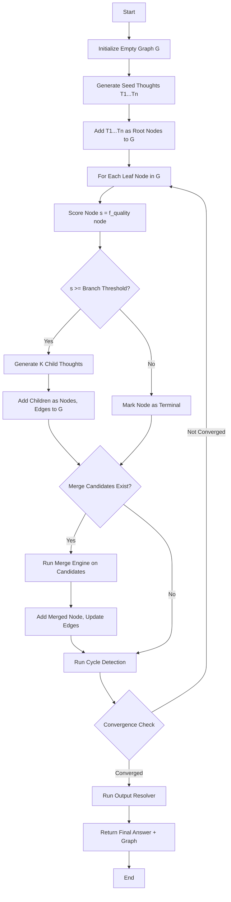
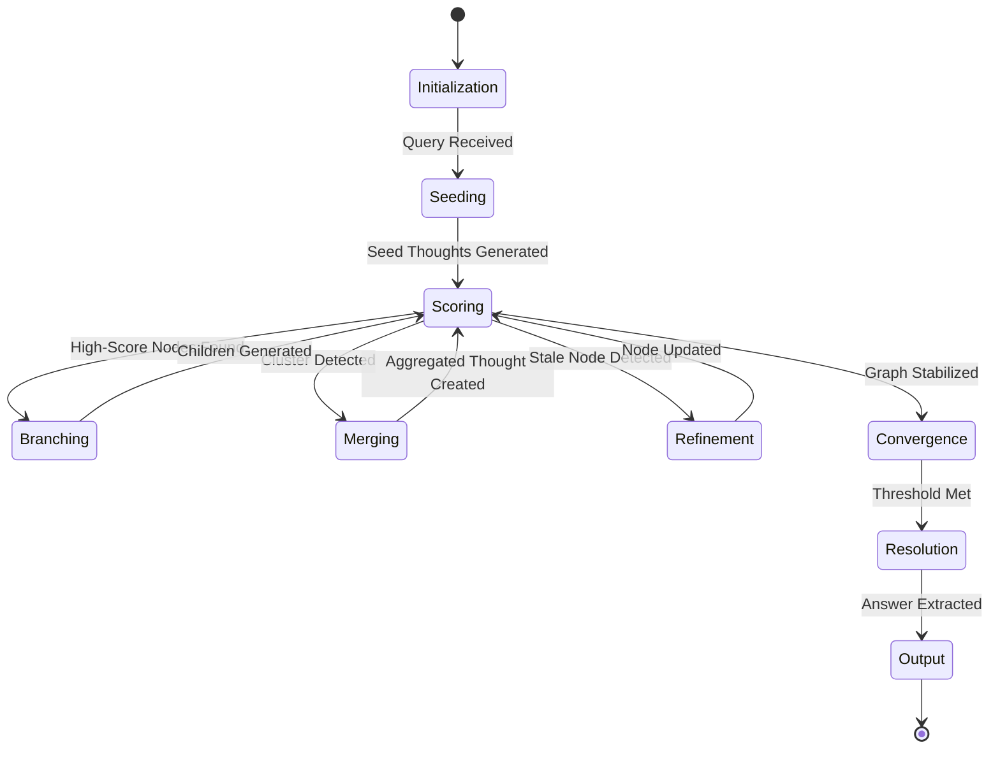
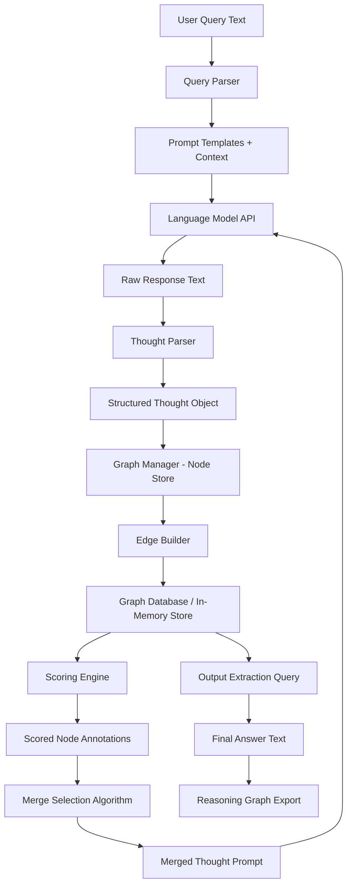
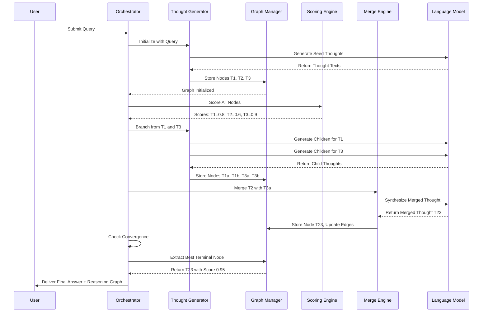

# Graph of Thought (GoT)

## \u{1f4cc} Overview

Graph of Thought (GoT) represents a paradigm shift in how we structure reasoning within AI systems by modeling individual thought steps as nodes in a directed graph rather than a simple linear sequence. Unlike its predecessors, Chain of Thought and Tree of Thought, GoT allows thoughts to branch, merge, loop back, and reference earlier conclusions at any point in the reasoning process. This flexibility mirrors how human experts actually solve complex problems: they explore multiple angles simultaneously, combine partial insights, revisit earlier assumptions, and refine their understanding iteratively. Within the broader discipline of Graph Engineering, GoT serves as the cognitive layer—the reasoning backbone that connects prompts, context, memory, tools, and workflows into a unified, explorable structure. By treating each reasoning step as a graph node and each dependency or inference link as an edge, GoT transforms opaque AI reasoning into a transparent, auditable, and optimizable system.

## \u{1f3af} Learning Objectives

By studying this document, you will understand the fundamental architecture of the Graph of Thought prompting framework and how it extends linear and tree-based reasoning models. You will learn to design GoT structures that enable parallel reasoning paths, merge and aggregate intermediate thoughts, and handle cyclic dependencies without degenerating into infinite loops. You will gain practical skills in implementing GoT patterns within real AI agent workflows, including how to orchestrate multiple language model calls as interconnected graph nodes. Finally, you will be able to evaluate when GoT is the appropriate reasoning strategy for a given problem, and how to measure and optimize its performance compared to simpler prompting paradigms.

## \u{1f9e0} Definition

Graph of Thought (GoT) is a prompting and reasoning framework that models the internal deliberation process of a language model as a directed graph, where each node represents a discrete thought, observation, or intermediate conclusion, and each edge represents a logical dependency, transformation, or aggregation relationship between those thoughts. In GoT, thoughts are not constrained to a single linear path or even a branching tree; they can form arbitrary directed acyclic graphs (DAGs) or, with controlled cycle handling, even general directed graphs. This means a thought generated at step three can inform thoughts at steps five, seven, and twelve simultaneously, while also being refined by a thought generated at step nine. GoT introduces explicit operators for branching (splitting reasoning into parallel tracks), merging (combining multiple thoughts into a synthesized conclusion), and refinement (revising an earlier thought based on new evidence), making it the most expressive standard prompting framework available for complex multi-step reasoning tasks.

## \u{1f4a5} Why It Matters

Graph of Thought matters because real-world problems are rarely linear. A medical diagnosis may require simultaneously considering symptoms, lab results, patient history, and drug interactions, with each factor informing the others in non-sequential ways. Software architecture decisions require balancing performance, maintainability, cost, and team skill—factors that interrelate in complex web-like patterns rather than simple chains. Traditional Chain of Thought forces the model to serialize these interrelated considerations, potentially losing important cross-references. Tree of Thought improves on this by allowing exploration of multiple hypotheses, but still prevents different branches from communicating. GoT eliminates this limitation entirely, enabling the model to build a rich, interconnected web of reasoning where any thought can inform any other thought. This interconnectedness leads to more accurate, nuanced, and reliable outputs for complex tasks, while also producing a reasoning graph that humans can inspect, debug, and trust.

## \u{1f3db}\ufe0f Core Concepts

The core of GoT rests on four foundational concepts. First, the **Thought Node** is the atomic unit of reasoning, representing a single coherent idea, calculation step, or factual assertion generated by the language model. Second, the **Dependency Edge** captures how one thought informs or derives from another, establishing a directed relationship that the framework can traverse, validate, and optimize. Third, the **Aggregation Operator** allows multiple thought nodes to be combined into a single synthesized thought, enabling the model to merge insights from parallel reasoning tracks into a unified conclusion. Fourth, the **Refinement Operator** enables a thought node to be revised or replaced based on new evidence from downstream reasoning, creating the capacity for self-correction that is absent in simpler frameworks. Together, these four concepts give GoT its expressive power: thoughts can be generated independently, combined flexibly, and improved iteratively, all while maintaining a complete record of the reasoning process.

## \u{1f9e9} Key Components

A complete GoT implementation consists of several key components working in concert. The **Thought Generator** is responsible for producing new thought nodes, typically by invoking the language model with a carefully constructed prompt that includes relevant context from existing graph nodes. The **Graph Manager** maintains the data structure of nodes and edges, handling insertion, lookup, and traversal operations as the reasoning graph grows. The **Merge Engine** implements the aggregation logic, determining when and how to combine multiple thoughts—whether through majority voting, weighted averaging, chain-of-thought synthesis, or custom domain-specific strategies. The **Cycle Detector** monitors the graph for unintended loops and applies resolution strategies such as thought versioning, loop unrolling, or threshold-based termination. The **Scoring Function** assigns quality or confidence scores to individual thoughts, which guide the framework in selecting which thoughts to expand, merge, or prune. Finally, the **Output Resolver** traverses the completed reasoning graph to produce the final answer, typically by identifying the highest-scoring terminal node or by performing a final aggregation of all leaf nodes.

## \u{1f9ed} Mental Model

Imagine a collaborative research team working on a whiteboard. Each researcher writes an idea on a sticky note and places it on the board. As ideas accumulate, researchers draw arrows between related notes, showing how one insight supports, contradicts, or refines another. Sometimes a researcher picks up two sticky notes, combines their insights, and creates a new note summarizing both. Occasionally, someone realizes an earlier note was incomplete and updates it with new information. The whiteboard itself becomes a graph: sticky notes are nodes, arrows are edges, and the act of combining or updating notes represents the merge and refinement operations. GoT is the digital equivalent of this whiteboard, with the language model playing the role of the research team and the framework managing the whiteboard's structure. This mental model helps you understand that GoT is not about forcing the AI into a rigid structure, but rather about providing a flexible canvas where reasoning can grow organically while remaining organized and traceable.

## \u{1f5fa}\ufe0f Mind Map

## \u{1f3d7}\ufe0f Architecture Diagram

## \u{1f504} Workflow

## \u2699}\ufe0f Internal Working

The GoT framework operates through a carefully orchestrated sequence of internal steps. First, the **query parser** decomposes the user's input into an initial set of reasoning goals and constraints, establishing the root nodes of the thought graph. Second, the **thought generator** invokes the language model for each root node, producing a set of seed thoughts that represent the first layer of reasoning. Third, the **scoring function** evaluates each seed thought against relevance, coherence, and completeness criteria, assigning a numerical quality score that will guide subsequent operations. Fourth, the **branch selector** identifies the highest-scoring thoughts and generates child thoughts for each, exploring multiple reasoning directions in parallel. Fifth, as the graph grows, the **merge engine** periodically identifies clusters of related thoughts that can be aggregated into a single, more comprehensive thought node. Sixth, the **cycle detector** scans the graph for loops and applies resolution strategies when cycles are detected. Seventh, the **refinement operator** revisits earlier thoughts in light of new information, updating their content and scores accordingly. Eighth, the **convergence checker** determines whether the reasoning process has reached a stable state where further exploration is unlikely to yield significant improvements. Finally, the **output resolver** extracts the answer from the graph, typically by selecting the highest-scoring terminal thought or performing a final synthesis.

## \u{1f500} Execution Flow

## \u{1f4ca} Lifecycle

## \u{1f4e1} Data Flow

## \u{1f91d} Interaction Flow

## \u{1f30d} Real-World Analogy

Consider a team of detectives investigating a complex financial fraud case. Detective A interviews witnesses and notes that the suspect was seen near the crime scene. Detective B analyzes bank records and finds unusual transfers. Detective C reviews phone metadata and discovers calls to a known accomplice. None of these threads alone solves the case, but when the lead detective places all the evidence on a large evidence board—connecting witness sightings to financial transfers to phone calls with red string—a clear picture emerges. The evidence board is the graph: each piece of evidence is a node, and each red string connection is an edge. Sometimes a new piece of evidence causes a detective to re-examine an old lead (refinement). Sometimes two threads of evidence merge to point to a single conclusion (aggregation). The detectives do not work in a straight line or even in separate silos; they constantly cross-reference, combine, and revise. GoT applies this exact collaborative investigation pattern to AI reasoning, turning the language model into a team of detectives working from a shared evidence board.

## \u{1f4a1} Practical Example

Imagine asking an AI to plan a two-week trip to Japan for a family of four with varying dietary needs and mobility constraints. A Chain of Thought approach would serialize the planning: first pick cities, then hotels, then restaurants, then activities—potentially missing that the best hotel for accessibility is in a city with poor dietary options. A Tree of Thought approach might explore three different city itineraries in parallel but wouldn't allow insights from one branch to improve another. GoT, by contrast, generates thought nodes for accessibility requirements, dietary restrictions, budget constraints, and interests as interconnected nodes. A merge operation combines the accessibility assessment of Kyoto with the dietary survey of Osaka to produce a hybrid itinerary that optimizes for both. A refinement operation revises the initial Tokyo hotel recommendation after a downstream thought reveals that a subway strike is planned during the stay. The resulting reasoning graph contains nodes for each consideration, edges showing how they relate, and a final aggregated itinerary that no linear or tree-based approach could have produced.

## \u{1f9ea} Use Cases

GoT excels in scenarios requiring multi-faceted analysis where different reasoning threads must inform one another. **Complex planning** tasks such as project scheduling, resource allocation, and logistics optimization benefit from GoT's ability to balance competing constraints across parallel reasoning tracks. **Multi-document analysis** benefits from GoT because insights extracted from one document can be immediately merged with insights from another, creating a synthesized understanding that surpasses individual document summaries. **Debugging and root cause analysis** leverage GoT's refinement capability: as new evidence emerges, earlier hypotheses can be updated without discarding the reasoning trail. **Creative synthesis** tasks like brainstorming product names or marketing strategies benefit from the merge operator's ability to combine diverse ideas into novel compounds. **Scientific reasoning** and **legal analysis** both require weighing multiple lines of evidence and argument, a natural fit for GoT's graph-structured approach. Finally, **multi-agent orchestration** benefits from GoT because each agent's output can be represented as a node that other agents can reference and build upon.

## \u2696}\ufe0f Comparison

| Feature | Chain of Thought | Tree of Thought | Graph of Thought |
|---|---|---|---|
| Structure | Linear sequence | Branching tree | General directed graph |
| Parallel Paths | No | Yes | Yes |
| Cross-branch Communication | No | No | Yes |
| Merging Thoughts | No | No | Yes |
| Self-correction | Limited | Limited | Full refinement |
| Cycle Handling | N/A | N/A | Supported with detectors |
| Complexity | Low | Medium | High |
| Token Cost | Low | Medium | High |
| Transparency | Moderate | Good | Excellent |
| Best For | Simple reasoning | Exploration | Complex multi-faceted problems |

## \u2705} Best Practices

When implementing GoT, start with a clear definition of what constitutes a "thought" in your domain. A thought should be a self-contained, scorable unit of reasoning—neither too granular nor too broad. Use **score thresholds** aggressively to prevent the graph from growing unboundedly; prune low-scoring nodes early and often. Design your **merge strategy** carefully for your domain: majority voting works well for classification tasks, while chain-of-thought synthesis is better for generative tasks. Implement **cycle detection** from the start, even if you initially target DAGs, because real-world reasoning often inadvertently creates loops. Keep **prompt templates** for thought generation focused and context-rich, including relevant parent nodes and sibling nodes to enable informed branching. Log the complete reasoning graph for every query to enable post-hoc analysis, debugging, and continuous improvement of your scoring and merging strategies. Finally, set a **maximum graph depth and breadth** to ensure predictable resource usage and latency.

## \u{274c} Common Mistakes

The most common mistake is allowing the thought graph to grow without bound, leading to exponential token consumption and diminishing returns. This happens when pruning thresholds are too lenient or when the framework generates too many child thoughts per node. Another frequent error is designing merge operations that lose important nuance, producing aggregated thoughts that are vague or inaccurate. This often occurs when using simple averaging on thoughts that require qualitative synthesis. A third mistake is ignoring the computational cost of scoring: if each scoring call requires a separate LLM invocation, the total cost can dwarf the cost of thought generation. Over-engineering the graph structure is also common—not every problem needs GoT, and applying it to simple tasks adds unnecessary complexity and latency. Finally, failing to implement proper cycle detection can lead to infinite loops where a refinement operation triggers another refinement in an endless cycle, consuming resources without making progress.

## \u{1f680} Advanced Topics

Advanced GoT implementations explore several cutting-edge directions. **Adaptive graph topologies** dynamically adjust the branching factor, merge frequency, and pruning thresholds based on the complexity of the current reasoning state, allocating more exploration budget to uncertain regions of the problem space. **Hierarchical GoT** introduces multi-level reasoning graphs where high-level strategic thoughts operate on a coarse graph while low-level tactical thoughts operate on detailed subgraphs, with cross-level edges enabling strategic-tactical coordination. **External tool integration** allows thought nodes to invoke code execution, database queries, or web searches, with the results flowing back into the graph as new nodes. **Multi-model GoT** assigns different language models to different reasoning tracks—using a fast model for initial exploration and a powerful model for final synthesis. **Persistent reasoning graphs** span multiple user interactions, allowing the graph to grow and evolve over time as a form of long-term reasoning memory. **Graph neural network scoring** replaces heuristic scoring functions with learned models that can evaluate thought quality based on the graph's structural properties, potentially identifying high-value reasoning patterns that heuristic approaches miss.
