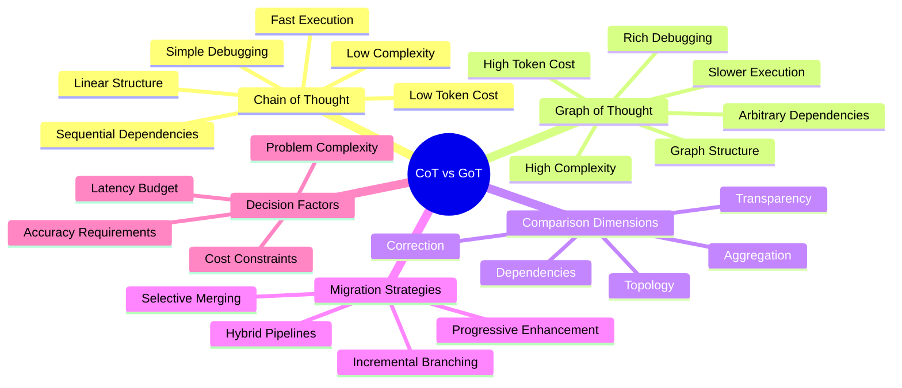
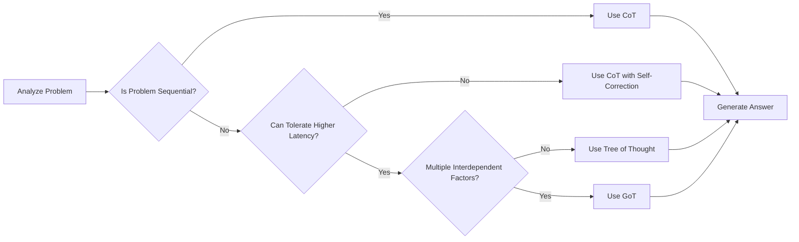
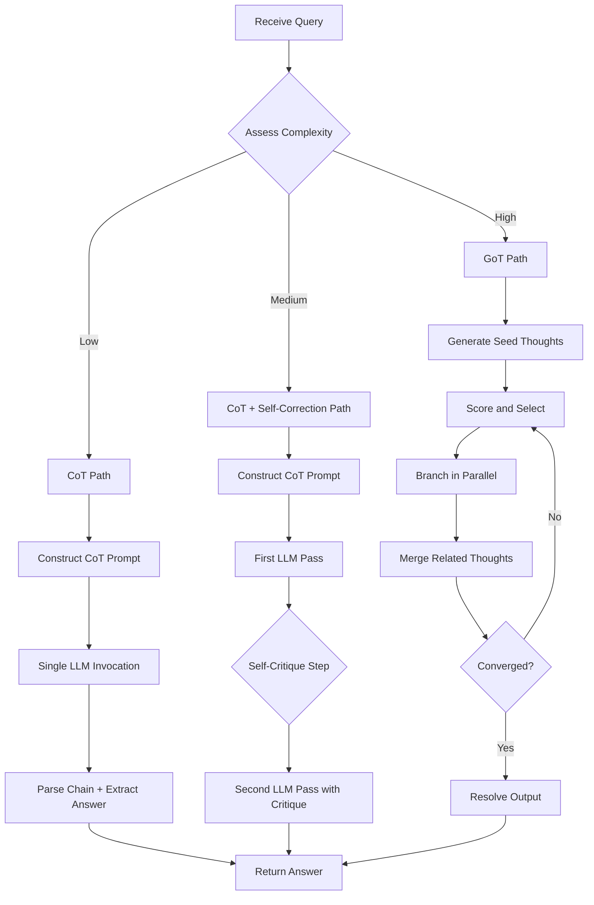
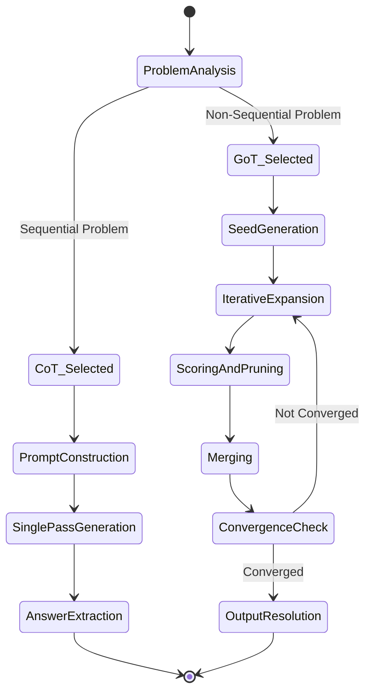
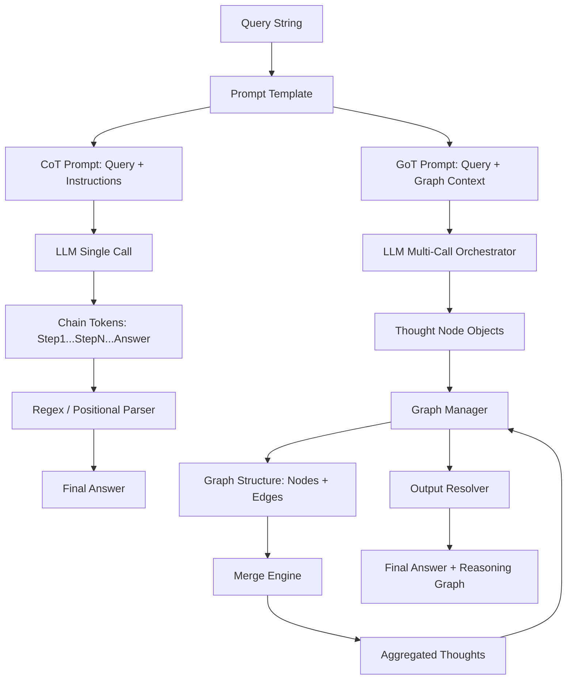
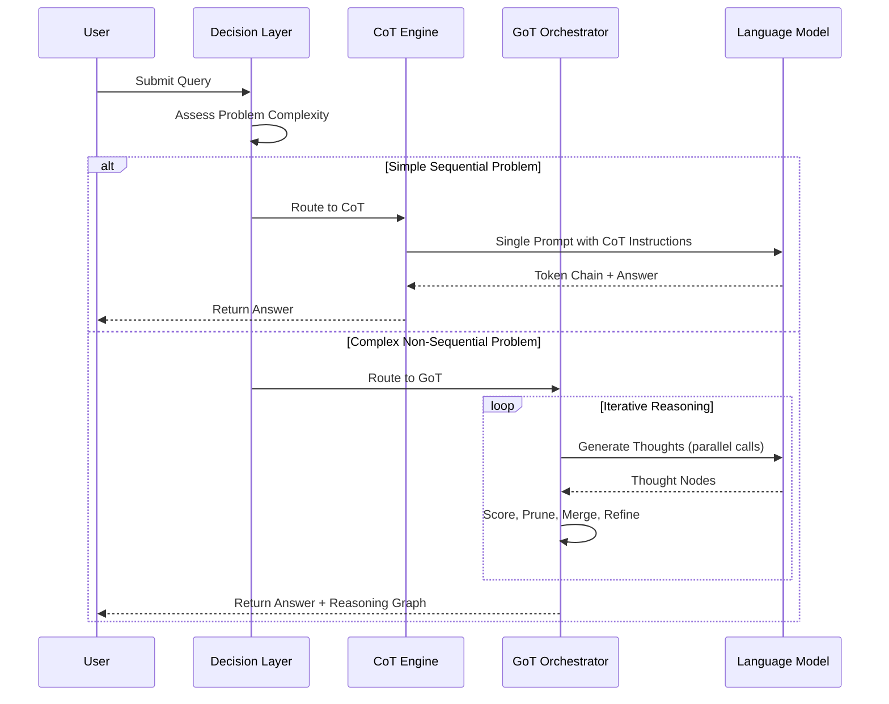

# Chain of Thought vs Graph of Thought

## 📌 Overview

The evolution from Chain of Thought (CoT) to Graph of Thought (GoT) represents one of the most significant advances in prompt engineering and AI reasoning design. Chain of Thought, introduced as a technique for eliciting step-by-step reasoning from language models, fundamentally transformed our ability to solve complex problems with AI by making the reasoning process explicit and sequential. However, as AI systems are increasingly applied to multi-faceted, real-world problems that involve interdependent considerations, the linear nature of CoT has become a limiting factor. Graph of Thought emerges as the natural successor, lifting the constraint of linearity and enabling reasoning structures that mirror the web-like complexity of human expert thinking. This document provides a comprehensive comparison of these two paradigms, examining their structural differences, performance trade-offs, appropriate use cases, and practical strategies for migrating from CoT to GoT within Graph Engineering systems.

## 🎯 Learning Objectives

After studying this document, you will be able to articulate the precise structural and operational differences between Chain of Thought and Graph of Thought reasoning frameworks. You will understand the conditions under which CoT remains the superior choice and the problem characteristics that demand GoT's additional expressiveness. You will learn practical migration strategies that allow you to incrementally upgrade existing CoT implementations to GoT without rewriting your entire system. You will be able to design hybrid approaches that combine the simplicity of CoT with the power of GoT for specific pipeline stages. Finally, you will gain the ability to make informed trade-off decisions regarding latency, cost, accuracy, and complexity when choosing between these two paradigms for production systems.

## 🧠 Definition

Chain of Thought (CoT) is a prompting technique that instructs a language model to generate its reasoning as a sequence of explicit intermediate steps before arriving at a final answer, effectively creating a linear chain of thought tokens that connect the input query to the output conclusion. Each step in the chain depends only on the immediately preceding step and the original query, forming a one-dimensional reasoning path. Graph of Thought (GoT), by contrast, is a prompting and reasoning framework that models the deliberation process as a directed graph where each node is a discrete thought and each edge represents a logical dependency, allowing arbitrary connectivity patterns including branching, merging, and cross-referencing between non-adjacent thoughts. The critical distinction is that CoT enforces a total ordering on reasoning steps while GoT permits a partial ordering, enabling thoughts to be generated, combined, and refined in ways that reflect the true structure of complex problems.

## ❓ Why It Matters

Understanding the distinction between CoT and GoT matters because choosing the wrong reasoning paradigm can mean the difference between a system that produces reliable, nuanced answers and one that fails on the very problems it was designed to solve. CoT is deceptively powerful for its simplicity, and many practitioners default to it for all reasoning tasks without considering whether its linear structure is a good fit. For problems with genuinely sequential dependencies—mathematical proofs, step-by-step procedures, chronological narratives—CoT is not just adequate but often optimal, offering the lowest latency and cost with no sacrifice in accuracy. However, for problems where multiple factors must be weighed simultaneously and insights from one line of reasoning should inform another, CoT forces an artificial serialization that degrades quality. GoT eliminates this bottleneck but introduces substantial complexity in terms of implementation, token cost, and latency. Making the right choice—or designing an effective hybrid—requires a deep understanding of both paradigms and their trade-offs.

## 🏛️ Core Concepts

The comparison between CoT and GoT revolves around five core conceptual dimensions. The **topology dimension** concerns the structure of the reasoning space: CoT uses a linear list while GoT uses a directed graph, which changes what kinds of reasoning relationships can be expressed. The **dependency dimension** concerns how reasoning steps reference each other: in CoT, each step depends only on its immediate predecessor, while in GoT, any step can depend on any combination of prior steps. The **aggregation dimension** concerns whether and how multiple reasoning paths can be combined: CoT has no aggregation mechanism, while GoT provides explicit merge operations. The **correction dimension** concerns self-improvement: CoT can only revise the current step, while GoT can revisit and refine any prior thought in the graph. The **transparency dimension** concerns reasoning visibility: while both frameworks make reasoning explicit, GoT's graph structure provides a richer audit trail that shows not just what was reasoned but how different reasoning threads interacted.

## 🧩 Key Components

A CoT implementation consists of three primary components: a prompt template that includes a "think step by step" instruction or few-shot examples demonstrating sequential reasoning, a language model that generates the chain of thought tokens, and an output parser that extracts the final answer from the end of the chain. A GoT implementation requires significantly more infrastructure: a thought generator that produces individual thought nodes, a graph manager that maintains the node-edge structure, a scoring function that evaluates thought quality, a branch selector that determines which thoughts to expand, a merge engine that combines related thoughts, a refinement operator that revises existing thoughts, a cycle detector that prevents infinite loops, and an output resolver that extracts the final answer from the graph. The component difference is substantial—GoT requires roughly seven to ten times more infrastructure than CoT, which is the primary reason CoT remains the default choice for simpler reasoning tasks. Understanding this component gap is essential for making informed build-versus-adopt decisions.

## 🧭 Mental Model

Think of CoT as a single-lane road through a mountain pass. The car (reasoning) must follow the road in order, passing through each checkpoint (thought) sequentially. It cannot skip ahead, take a detour, or reverse to revisit an earlier checkpoint. The journey is predictable and efficient, but if the road takes a wrong turn, the entire journey is affected. Now think of GoT as a network of interconnected roads, bridges, and roundabouts in a major city. A traveler can take multiple routes simultaneously, cross-reference information from different neighborhoods, loop back to revisit an earlier location with new context, and merge onto a highway that combines insights from several side streets. The city network is more complex to navigate and requires more infrastructure like maps and traffic signals, but it can reach destinations that the single-lane road simply cannot access. The key insight is that both models are valid—some journeys really do only need a single road, while others genuinely require a network.

## 🗺️ Mind Map

## 🏗️ Architecture Diagram

```mermaid
graph TD
    subgraph CoT Pipeline
        C1[User Query] --> C2[Prompt + CoT Instruction]
        C2 --> C3[Single LLM Call]
        C3 --> C4[Linear Token Chain: T1 - T2 - T3 - T4]
        C4 --> C5[Extract Final Answer]
    end
    subgraph GoT Pipeline
        G1[User Query] --> G2[Thought Generator]
        G2 --> G3[Seed Thoughts T1 T2 T3]
        G3 --> G4[Parallel Branch: T1a T1b T2a T3a T3b]
        G4 --> G5[Merge: T1a+T3a = M1]
        G5 --> G6[Refine: T2 updated via M1]
        G6 --> G7[Output Resolver]
    end
```

## 🔄 Workflow

## ⚙️ Internal Working

The internal workings of CoT and GoT differ fundamentally in their execution model. CoT operates in a single pass: the prompt is constructed with the query and reasoning instructions, sent to the language model once, and the model generates a continuous stream of tokens that form the reasoning chain followed by the answer. There is no intermediate evaluation, no branching, and no opportunity to correct course mid-reasoning—the entire chain is produced in one autoregressive pass. GoT operates iteratively through multiple orchestrated passes: each iteration may involve multiple parallel LLM calls to generate child thoughts, separate scoring calls to evaluate thought quality, and dedicated merge calls to combine related thoughts. Between iterations, the orchestrator inspects the graph state, applies pruning rules, triggers refinements, and decides which nodes to expand next. This multi-pass approach gives GoT far more control over the reasoning process but requires an external orchestrator that CoT does not need. The internal state management is also different: CoT maintains no state beyond the token buffer, while GoT maintains a persistent graph structure that grows and evolves across iterations.

## 🔀 Execution Flow

## 📊 Lifecycle

## 📡 Data Flow

## 🤝 Interaction Flow

## 🌍 Real-World Analogy

Consider the difference between writing a recipe and planning a wedding. A recipe is inherently sequential: you must prep ingredients before cooking, cook before plating, and plate before serving. Chain of Thought is perfect for this—each step flows naturally into the next, and there is no benefit to jumping ahead or revisiting earlier steps. Planning a wedding, however, involves simultaneously coordinating venue booking, catering preferences, guest lists, travel logistics, and seating arrangements. A change in the guest list affects catering, which affects the venue choice, which affects travel logistics. This is not a sequence—it is a web of interdependencies. You might start with the venue, discover it affects catering options, which makes you reconsider the guest list, which changes your travel logistics, which leads you back to re-evaluate the venue. GoT models this wedding planning process accurately: thoughts about different aspects are generated, connected, merged, and refined in a web pattern that reflects the true structure of the problem.

## 💡 Practical Example

Consider a software engineering task: debugging a production outage. With CoT, the AI would reason linearly: check logs, identify the error, trace the root cause, propose a fix. This works if the root cause is straightforward. But in a complex outage involving a cascading failure across three microservices, a database connection pool exhaustion, and a misconfigured retry policy, the reasoning is not linear. The retry policy might be causing the connection pool exhaustion, which is triggering cascading failures in the microservices—but you might not discover the retry policy connection until you have already analyzed the microservices and the database. With GoT, the AI generates parallel investigation tracks for each symptom, discovers that the retry policy node and the connection pool node are related, merges them into a unified root cause hypothesis, and then refines the microservice failure analysis in light of this merged insight. The GoT approach arrives at a more accurate diagnosis because it allows cross-pollination between investigation tracks.

## 🧪 Use Cases

CoT is the right choice for mathematical computation, step-by-step tutorials, data transformation pipelines, code generation from clear specifications, and any task where the reasoning naturally flows in one direction. GoT excels in multi-stakeholder decision making, system architecture design, legal case analysis, medical diagnosis with comorbidities, financial portfolio optimization, and any task where multiple interdependent factors must be weighed simultaneously. Hybrid approaches work well in multi-stage pipelines where early stages use CoT for well-defined sub-tasks and a final stage uses GoT to synthesize results across sub-tasks. Another effective hybrid pattern uses CoT for the default fast path and escalates to GoT only when the CoT output has low confidence scores. This progressive enhancement approach provides the speed of CoT for easy problems and the power of GoT for hard ones, optimizing both latency and accuracy across the full distribution of incoming queries.

## ⚖️ Comparison

| Dimension | Chain of Thought | Graph of Thought |
|---|---|---|
| Reasoning Structure | Linear sequence | Directed graph (DAG or general) |
| Number of LLM Calls | 1 (or 2 with self-correction) | Many (10-100+) |
| Branching | Not supported | Fully supported |
| Cross-path Communication | Not possible | Native via merge/refine |
| Self-correction | Limited to next token | Full graph-wide revision |
| Token Consumption | Low (1x-2x query) | High (5x-50x query) |
| Latency | Single pass (1-10s) | Multi-pass (10-120s) |
| Implementation Complexity | Minimal (prompt template) | Substantial (orchestrator + graph) |
| Reasoning Transparency | Chain of tokens | Full graph with scores and edges |
| Best Problem Type | Sequential, well-structured | Non-sequential, interdependent |
| Failure Mode | Wrong path, no recovery | Over-complexity, runaway graphs |
| Maturity | Well-established, widely adopted | Emerging, research-driven |

## ✅ Best Practices

When choosing between CoT and GoT, start with CoT and only upgrade to GoT when you can demonstrate that CoT's linear structure is causing measurable quality degradation on your specific task. Implement a **complexity classifier** that routes simple queries to CoT and complex queries to GoT, ensuring that you pay the GoT cost only when necessary. If you adopt GoT, implement **cost controls** from day one: set maximum graph sizes, limit branching factors, and use cheaper models for intermediate scoring and more expensive models only for final synthesis. For migration, start by adding a single merge step to your existing CoT pipeline—this is the simplest GoT operation and provides immediate value for tasks where multiple reasoning chains need to be combined. Always maintain the ability to **fall back to CoT** if GoT encounters errors, exceeds latency budgets, or produces lower-quality results on specific query types. Document your decision criteria and revisit them as model capabilities evolve.

## ❌ Common Mistakes

The most common mistake is reaching for GoT when CoT is sufficient, adding complexity and cost for no measurable benefit. This often stems from an optimism bias where the theoretical power of GoT seems appealing even for simple problems. Another frequent error is implementing GoT without proper pruning, leading to graphs that grow exponentially and consume unreasonable amounts of tokens and time. A third mistake is using the same scoring function for all thought types, when different reasoning steps may require different quality criteria. Neglecting to implement fallback mechanisms is also dangerous—if the GoT orchestrator fails, the entire system fails, whereas CoT has minimal failure modes. Finally, attempting a big-bang migration from CoT to GoT is almost always a mistake; incremental migration with continuous quality comparison at each stage is far more likely to succeed.

## 🚀 Advanced Topics

Advanced CoT-GoT integration explores several promising directions. **Adaptive reasoning** dynamically switches between CoT and GoT mid-query, starting with CoT for the initial reasoning and upgrading to GoT only when the reasoning encounters ambiguity or contradiction. **Hierarchical reasoning** uses CoT within individual GoT nodes, so each thought is itself the result of a chain-of-thought process, combining the depth of CoT with the breadth of GoT. **Compressed GoT** uses a smaller model to explore the reasoning graph broadly and then passes the graph structure to a larger model for final synthesis, reducing cost while preserving quality. **Graph-structured self-consistency** extends the self-consistency technique from CoT by sampling multiple reasoning graphs and selecting the answer that appears across the most graphs. **Meta-learning for paradigm selection** trains a classifier on historical query-answer pairs to automatically predict whether CoT or GoT will produce better results for a given query, enabling fully automated routing without manual complexity thresholds.
