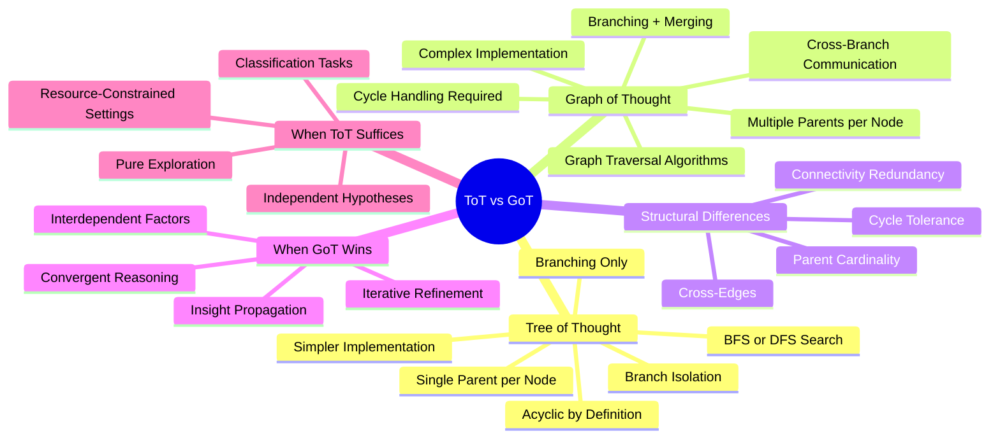
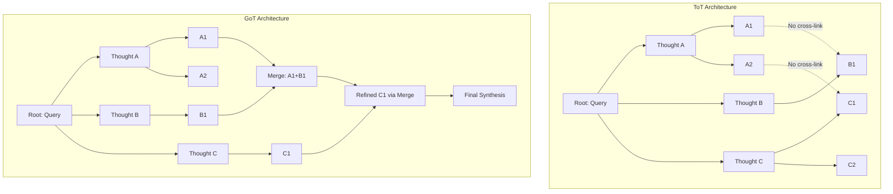
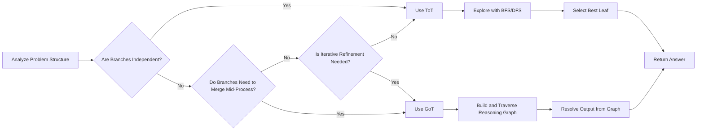
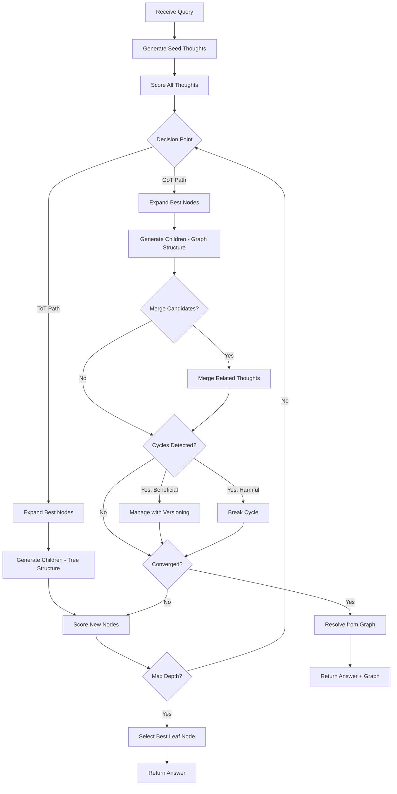
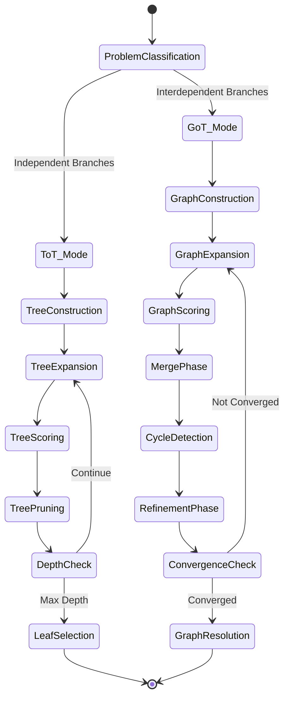
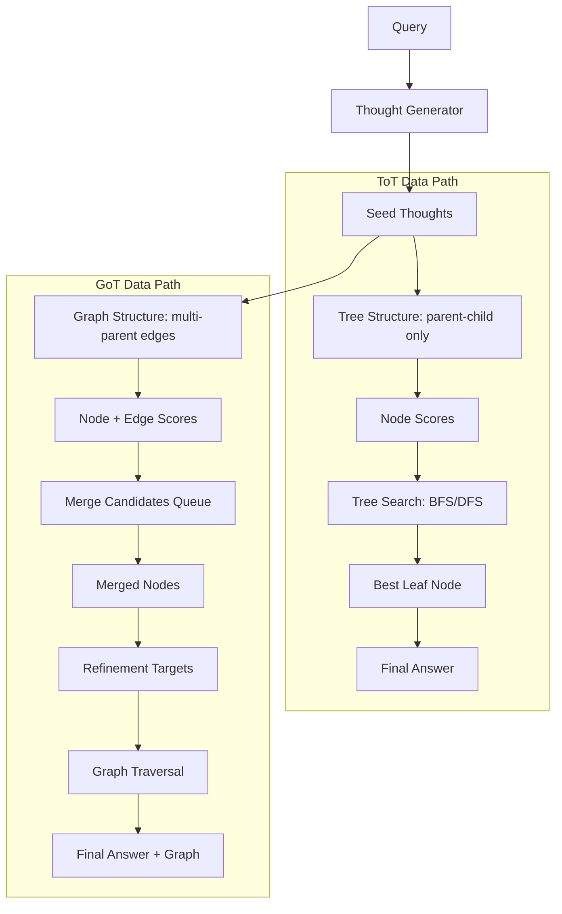
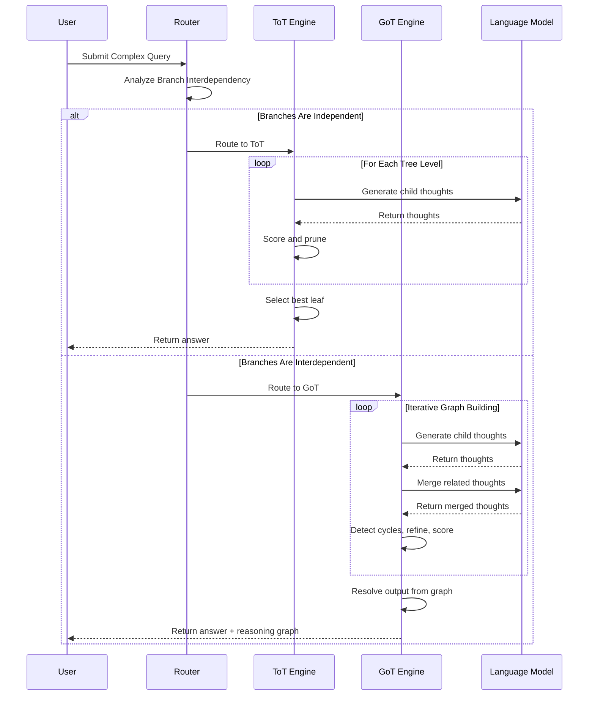

# Tree of Thought vs Graph of Thought

## 📌 Overview

Tree of Thought (ToT) and Graph of Thought (GoT) represent two successive leaps beyond linear Chain of Thought reasoning, but they differ fundamentally in the topological freedom they afford to the reasoning process. ToT introduced the critical innovation of branching—allowing the AI to explore multiple reasoning hypotheses in parallel, organized as a tree where each node can have multiple children but exactly one parent. GoT extends this by removing the single-parent constraint entirely, allowing thoughts to have multiple parents, creating a directed acyclic graph or even a general graph where insights can flow between any connected thoughts regardless of their tree-level relationship. This document provides a detailed comparison of these two frameworks, examining the structural implications of trees versus graphs, how cycle handling differentiates them, the problem characteristics where GoT's additional expressiveness yields real improvements, and practical strategies for migrating from ToT to GoT within Graph Engineering systems.

## 🎯 Learning Objectives

By the end of this document, you will understand the precise topological differences between tree structures and graph structures in the context of AI reasoning, and why those differences matter for problem-solving quality. You will learn to identify the specific problem characteristics—cross-branch dependencies, insight propagation, and iterative refinement—that make GoT strictly superior to ToT. You will understand how cycle handling works in GoT and why it is both the framework's greatest strength and its most dangerous capability. You will acquire practical migration strategies for evolving existing ToT implementations toward GoT, including which components can be reused and which must be rebuilt. Finally, you will be able to design hybrid ToT-GoT architectures that use tree structures for exploration and graph structures for synthesis, optimizing the cost-benefit trade-off.

## 🧠 Definition

Tree of Thought (ToT) is a prompting and reasoning framework that organizes the deliberation process as a tree structure, where the root node represents the initial problem formulation, each internal node represents a reasoning step or hypothesis, and leaf nodes represent candidate solutions. In a tree, every node has at most one parent and zero or more children, meaning that each thought is derived from exactly one preceding thought, though a single thought may spawn multiple alternative continuations. Graph of Thought (GoT) generalizes this structure by allowing nodes to have multiple parents, creating a directed graph where a single thought can be derived from multiple preceding thoughts simultaneously. This means that in GoT, a thought at one branch can directly inform and be merged with a thought at a completely different branch, something that is structurally impossible in a tree. Additionally, GoT supports cyclic structures through controlled loop handling, enabling thoughts to be refined based on their own downstream consequences—a capability that trees, being acyclic by definition, cannot provide.

## ❓ Why It Matters

The distinction between ToT and GoT matters because many real-world problems have a reasoning structure that is inherently graph-like rather than tree-like. Consider a legal case where the analysis of contract law and the analysis of tort law both produce insights that should inform each other. In ToT, these two analysis branches are isolated silos—they can be explored in parallel but cannot communicate. The final answer must choose one branch or combine them through an external mechanism that is not part of the reasoning framework itself. In GoT, cross-edges between the contract and tort analysis branches allow each to benefit from the other's insights during the reasoning process, not just at the end. This intra-reasoning communication leads to better-quality intermediate thoughts, which cascades into a better final answer. Understanding when this cross-branch communication provides genuine value—versus when it merely adds cost and complexity—is essential for building effective AI reasoning systems that scale to real-world complexity without overspending on unnecessary infrastructure.

## 🏛️ Core Concepts

The comparison between ToT and GoT is anchored in four structural concepts. **Parent Cardinality** is the most fundamental difference: ToT enforces a single parent per node (tree property), while GoT allows multiple parents (DAG property). This single change enables merge operations where two or more thoughts combine into a synthesized thought that inherits context from all its parents. **Cross-Branch Referencing** is the practical consequence of multi-parent nodes: in ToT, information flows strictly top-down through the tree hierarchy, while in GoT, information can flow laterally between branches through shared child nodes. **Cycle Tolerance** is unique to GoT: trees are always acyclic, but GoT can accommodate controlled cycles that enable iterative refinement, where a thought is revised based on its own downstream consequences. **Graph Connectivity** differs subtly but importantly: in a tree, removing any internal node disconnects the structure, while in a graph, redundant paths provide resilience, meaning the reasoning process can continue even if some thoughts are low quality, because alternative paths exist to carry the reasoning forward.

## 🧩 Key Components

ToT and GoT share several components but differ in critical ways. Both frameworks require a **thought generator**, a **scoring function**, and a **search strategy** for deciding which nodes to expand. However, GoT adds three components that ToT does not need. A **merge engine** is required to combine multiple parent thoughts into a single child thought, implementing domain-specific aggregation logic that determines how insights from different branches are synthesized. A **cycle detector** is needed to identify and manage loops, applying strategies like maximum loop depth, convergence thresholds, or explicit versioning to prevent infinite reasoning loops. An **edge type system** is often introduced in GoT to distinguish between different kinds of relationships—derivation edges (thought A produced thought B), support edges (thought A provides evidence for thought B), contradiction edges (thought A contradicts thought B), and refinement edges (thought B is an updated version of thought A). These edge types enable more sophisticated graph traversal and reasoning strategies that have no equivalent in tree-structured approaches.

## 🧭 Mental Model

Imagine you are exploring a vast cave system. Tree of Thought is like exploring the cave by following a branching tunnel system: at each junction, you can split your team to explore multiple passages, but each explorer can only follow one path downward. If Explorer A discovers something relevant to Explorer B's passage, they cannot communicate until both return to the junction point. Graph of Thought is like exploring the same cave system, but now you have installed a network of speaking tubes between passages. Explorer A can call through a tube to alert Explorer B about a discovery, and Explorer B can combine that information with their own findings to decide which direction to go next. Even more powerfully, if Explorer B finds something that changes the meaning of Explorer A's earlier discovery, Explorer A can be called back to update their notes. The cave is the same, but the communication infrastructure transforms the quality and efficiency of the exploration. The key insight is that the tree structure limits not what can be explored, but how effectively explorers can share what they find.

## 🗺️ Mind Map

## 🏗️ Architecture Diagram

## 🔄 Workflow

## ⚙️ Internal Working

The internal operation of ToT follows a classical tree search algorithm. The framework begins by generating a set of initial thoughts from the query, forming the first level of the tree. It then evaluates each thought using a scoring function and selects the most promising ones for expansion. Each selected thought is expanded into multiple child thoughts representing different reasoning directions, and this process repeats level by level until a termination condition is met—such as reaching a maximum depth, finding a thought that exceeds a quality threshold, or exhausting a computational budget. The search strategy, whether breadth-first, depth-first, or best-first, determines the order of expansion but always maintains the tree invariant that each node has exactly one parent. GoT's internal operation is more complex. After generating and scoring initial thoughts, GoT not only branches but also periodically scans for thoughts that could benefit from merging. When two or more thoughts from different branches are identified as related, the merge engine generates a new thought that synthesizes them, creating a node with multiple parents. GoT also runs a cycle detection pass on each iteration, checking whether any new edges would create loops. If a cycle is detected and deemed beneficial, it is managed through versioning or threshold-based termination; if deemed harmful, it is broken by removing the offending edge. This additional merge, cycle detection, and refinement processing gives GoT its power but also its computational overhead.

## 🔀 Execution Flow

## 📊 Lifecycle

## 📡 Data Flow

## 🤝 Interaction Flow

## 🌍 Real-World Analogy

Imagine two approaches to building a jigsaw puzzle. Tree of Thought is like having several people each working on a different section of the puzzle independently, with no communication between them. Each person builds their section as well as possible, and at the end, you try to fit the sections together. If the sky section and the mountain section were built with slightly wrong color assumptions, they might not align at the boundary, and there is no way to fix this until the very end. Graph of Thought is like having the same puzzle builders, but now they can shout across the table to each other. When the sky builder notices an unusual color gradient, they alert the mountain builder, who adjusts their section accordingly. When the mountain builder discovers a piece that actually belongs to the sky section, they pass it over immediately. The pieces connect more accurately because information flows between sections during the building process, not just after. The puzzle is the same, the pieces are the same, but the cross-communication transforms both the quality of the result and the efficiency of the process.

## 💡 Practical Example

Consider an AI tasked with designing a disaster response plan for a coastal city facing simultaneous hurricane, flooding, and power grid failure threats. With ToT, the AI might create three independent branches: one for hurricane response, one for flood response, and one for power restoration. Each branch develops a detailed plan, but they cannot inform each other during the process. The hurricane branch might plan evacuations using roads that the flood branch knows will be impassable. The power restoration branch might plan to use emergency generators at locations the hurricane branch has marked as unsafe. With GoT, cross-edges connect these branches early. The flood analysis informs the hurricane evacuation plan. The hurricane damage assessment informs the power restoration priorities. A merge operation combines the three branch analyses into a unified resource allocation that accounts for all three threats simultaneously. A refinement operation revises the evacuation plan after the merged analysis reveals that the originally designated shelters are also in the flood zone. The GoT approach produces a coherent, integrated plan where every element has been validated against every other element.

## 🧪 Use Cases

ToT is well-suited for problems where multiple hypotheses can be explored independently and the best one selected at the end. This includes creative brainstorming, game playing (like chess move evaluation), mathematical proof search, and any scenario where the goal is to find the single best path through a solution space. GoT excels in problems where different analysis dimensions are genuinely interdependent: multi-criteria optimization, systems engineering design, policy analysis with competing objectives, medical treatment planning with drug interactions, and complex troubleshooting where symptoms have multiple interacting causes. Hybrid approaches are particularly effective for problems with both independent and interdependent sub-problems. For example, in a large-scale system design, you might use ToT to explore independent component designs and then use GoT to merge the component designs into a system-level architecture where interface compatibility is validated across all components simultaneously.

## ⚖️ Comparison

| Dimension | Tree of Thought | Graph of Thought |
|---|---|---|
| Topology | Rooted tree (single parent) | Directed graph (multi-parent) |
| Cross-branch Links | Not allowed | Fully supported |
| Merge Operations | Not supported (external only) | Native framework operation |
| Cycle Handling | Not applicable (always acyclic) | Supported with detectors |
| Insight Propagation | End-of-tree only | Continuous throughout process |
| Search Complexity | O(b^d) standard tree search | Graph traversal, potentially exponential |
| Implementation Complexity | Moderate (tree data structure) | High (graph + merge + cycle) |
| Token Efficiency | Moderate | High (merge calls add overhead) |
| Reasoning Quality | Good for independent hypotheses | Superior for interdependent factors |
| Debugging | Tree traversal, clear parentage | Graph traversal, multiple inheritance |
| Best For | Exploration, optimization search | Synthesis, multi-factor analysis |
| Failure Mode | Wrong branch selection, no recovery | Runaway graphs, merge conflicts |

## ✅ Best Practices

When choosing between ToT and GoT, perform a **dependency analysis** on your problem before selecting a framework. If the reasoning branches are truly independent, ToT provides the same quality with lower cost. If cross-branch dependencies exist, start with ToT and add GoT merge operations incrementally for the specific branch pairs that benefit from communication. Implement **edge type annotations** from the beginning if you choose GoT, distinguishing between derivation, support, and contradiction edges—this metadata becomes invaluable for debugging and for implementing sophisticated merge strategies. Set **maximum in-degree limits** (maximum parents per node) to prevent any single merge from becoming too complex, which degrades the quality of the merged thought. Use **tree search within graph search**: run a ToT-style best-first search on each branch of the graph, and use GoT merge operations only at strategic checkpoints rather than after every generation step. This hybrid approach captures most of GoT's benefit at a fraction of the cost.

## ❌ Common Mistakes

The most common mistake is implementing GoT when ToT is sufficient, paying for merge and cycle infrastructure that provides no quality improvement because the problem's branches are genuinely independent. A second frequent error is implementing merge operations without domain-specific logic, falling back on naive concatenation or simple averaging that produces merged thoughts worse than either parent. A third mistake is ignoring cycle handling until a production incident reveals an infinite loop—the cycle detector should be one of the first components implemented, not an afterthought. Over-merging is another pitfall: merging too aggressively collapses distinct reasoning paths into a single mediocre thought, losing the diversity that makes tree-based exploration valuable. Finally, treating GoT as simply "ToT with extra edges" without recognizing that the graph topology requires fundamentally different search strategies, scoring approaches, and convergence criteria is a conceptual error that leads to poorly designed implementations.

## 🚀 Advanced Topics

Advanced ToT-GoT integration opens several research frontiers. **Dynamic topology switching** allows the reasoning structure to start as a tree and dynamically add cross-edges as the framework detects interdependencies, growing into a graph only where needed. **Conditional merging** uses a learned model to predict whether a merge operation will improve or degrade thought quality, only executing merges that are predicted to be beneficial. **Graph attention mechanisms** adapt transformer-style attention to the reasoning graph, allowing the framework to learn which cross-branch connections are most informative for a given problem domain. **Persistent ToT-GoT graphs** maintain reasoning structures across multiple user interactions, using tree structures for each individual query and graph edges to connect related queries over time. **Hierarchical ToT within GoT** uses ToT to explore sub-problems within individual GoT nodes, creating a fractal-like reasoning structure where trees nest within graphs at multiple levels of abstraction. **Probabilistic edge management** assigns confidence scores to cross-branch edges and uses them to weight the influence of one branch on another during merge operations, gracefully handling uncertainty about whether branches are truly interdependent.