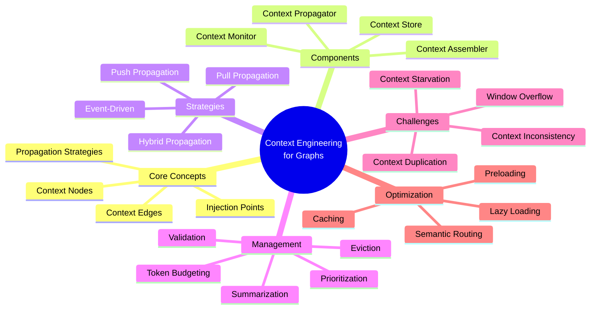
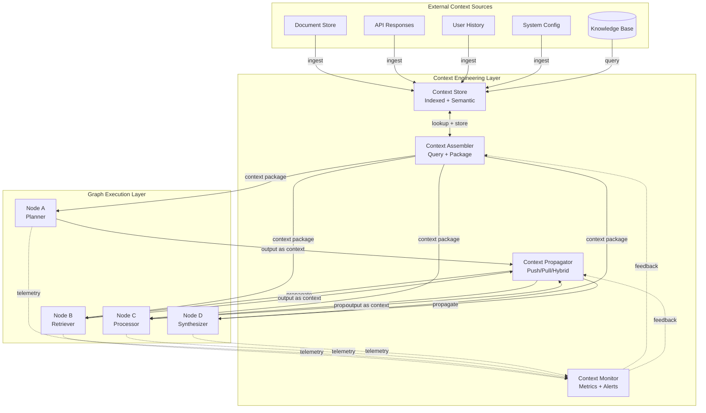
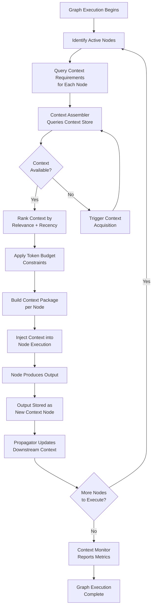
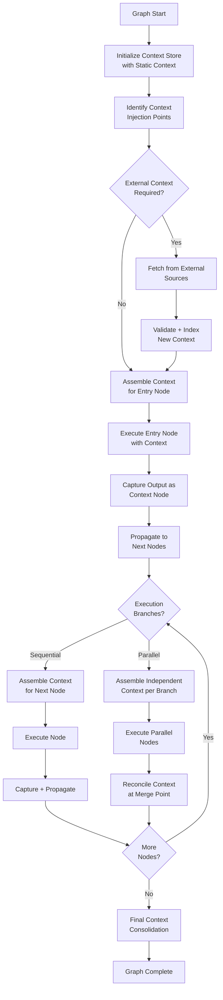
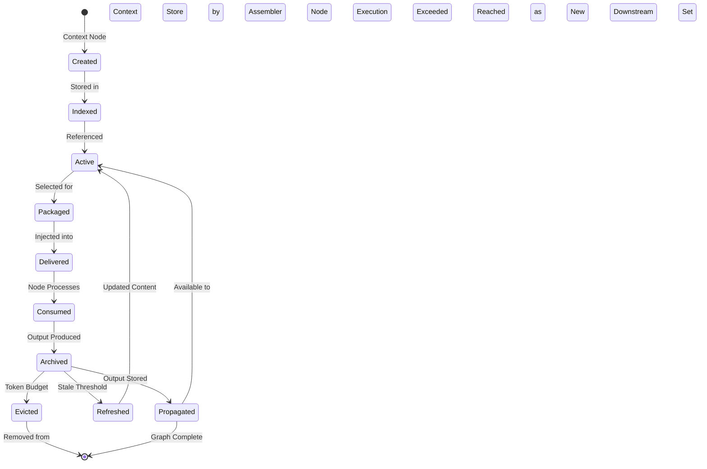
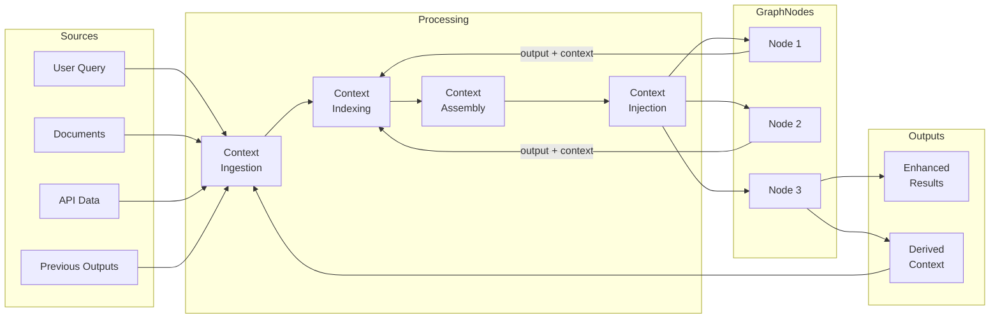
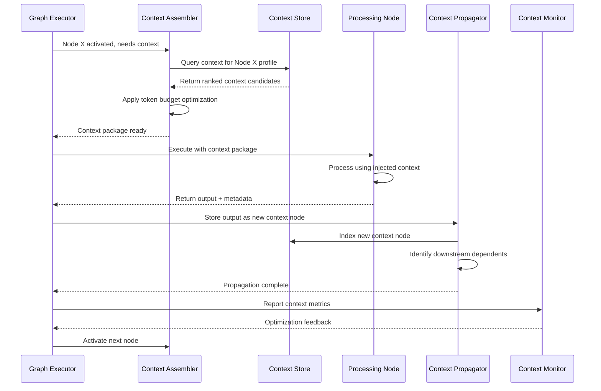

# Context Engineering for Graphs

## 📌 Overview

Context Engineering for Graphs represents a paradigm shift in how we think about supplying information to AI systems operating within graph-based architectures. Rather than treating context as a flat string of text prepended to a prompt, graph context engineering treats every piece of contextual information as a node within a larger contextual graph. These contextual nodes connect to processing nodes, memory nodes, and tool nodes through typed edges that carry semantic weight and directionality. This approach allows for dynamic, selective, and adaptive context assembly that responds to the specific needs of each node in the graph during execution.

The fundamental insight driving this discipline is that context in a graph system is not monolithic. Different nodes require different slices of the total available context, and the relationships between context elements matter as much as the elements themselves. A well-engineered context graph ensures that each processing node receives precisely the information it needs — no more, no less — while maintaining coherence across the entire graph execution. This precision eliminates the common failure mode of context window overflow while simultaneously improving the relevance and quality of each node's output.

Context engineering at the graph level introduces concepts like context injection points, context propagation strategies, and context window budgeting as first-class design concerns. Engineers must think about how context flows through the graph, how it transforms at each node, and how it accumulates or diminishes along different execution paths. This requires a systematic approach that treats context with the same rigor that software engineers apply to data flow in distributed systems.

## 🎯 Learning Objectives

By studying Context Engineering for Graphs, practitioners will develop the ability to design context systems that are both efficient and adaptive within graph-based AI architectures. You will learn to model context as a graph resource with its own nodes, edges, and lifecycle, rather than an afterthought bolted onto individual prompts. This perspective enables you to build systems where context flows naturally through processing pipelines, accumulating value at each stage while respecting the finite constraints of token budgets and attention mechanisms.

You will gain proficiency in identifying and defining context injection points throughout a graph topology. These injection points represent locations where external or derived context enters the graph's data flow. Understanding where and how to inject context allows you to design systems that are responsive to runtime conditions, capable of pulling in just-in-time information from external sources, and able to adapt their behavior based on accumulated contextual state. This skill is essential for building production-grade graph systems that must handle variable and unpredictable inputs.

Additionally, you will master context propagation strategies that determine how context moves between nodes. This includes push-based propagation where upstream nodes pass context downstream, pull-based propagation where nodes request context on demand, and hybrid strategies that combine both approaches. You will also learn to implement context window management techniques that prevent token overflow while maximizing the informational value of the context available to each node, including prioritization, summarization, and selective eviction strategies.

## 🧠 Definition

Context Engineering for Graphs is the systematic discipline of designing, managing, and optimizing the flow of contextual information through graph-based AI systems. It treats context as a first-class graph resource — a network of interconnected information nodes that can be dynamically assembled, routed, and transformed to serve the specific needs of each processing node within the graph architecture. Context in this framework is not merely text prepended to a prompt but a structured, queryable, and composable graph asset with defined semantics, provenance, and lifecycle.

Formally, a context graph is a directed graph C = (N_c, E_c) where N_c represents context nodes — each containing a discrete unit of contextual information such as a document segment, a user preference, a system instruction, or a previously computed result — and E_c represents context edges that define relationships like precedence, dependency, relevance, or temporal ordering between context elements. Each context node carries metadata including its source, confidence score, expiration time, token cost, and semantic category. Each edge carries a weight representing the strength of contextual relevance between connected nodes.

The engineering process involves defining how context graphs are constructed at runtime, how they are queried by processing nodes, how they evolve as the graph executes, and how they are pruned or expanded to fit within computational constraints. This includes designing context schemas, defining injection protocols, implementing propagation algorithms, and building monitoring systems that track context utilization across the graph. The goal is to ensure that every node in the processing graph operates with maximum contextual awareness while the overall system remains within its resource budget.

## ❓ Why It Matters

Context engineering matters because the quality of an AI system's output is directly proportional to the quality and relevance of the context it receives. In traditional single-prompt systems, context engineering is relatively straightforward — you assemble the best possible context within the token limit and submit it. But in graph-based systems, the challenge multiplies exponentially. Each node in the graph is essentially a separate AI operation that needs its own context, and the context needs of one node may differ dramatically from another, even when they are processing related aspects of the same task.

Without systematic context engineering, graph systems suffer from three critical failure modes. First, context duplication occurs when multiple nodes independently fetch and include the same contextual information, wasting precious token budget on redundancy. Second, context starvation happens when a node lacks essential context because no mechanism exists to propagate relevant information from elsewhere in the graph. Third, context inconsistency arises when different nodes receive conflicting or outdated versions of the same contextual information, leading to incoherent outputs that undermine the entire graph's purpose.

Effective context engineering directly impacts production metrics that matter: latency (well-engineered context reduces unnecessary token processing), cost (precise context minimizes wasted tokens), accuracy (relevant context improves output quality), and reliability (consistent context prevents contradictory behaviors). In enterprise settings where graph systems handle complex multi-step workflows — legal document analysis, multi-agent research pipelines, adaptive customer service — context engineering is the difference between a system that works in demos and one that works reliably at scale under real-world conditions.

## 🏛️ Core Concepts

The core concepts of context engineering for graphs revolve around treating context as a managed, flowing resource rather than static text. **Context Nodes** are the fundamental units — each encapsulates a discrete piece of contextual information with associated metadata like source, timestamp, relevance score, token count, and semantic type. Context nodes can represent anything from a user's historical preferences to a retrieved document passage, from a system-level instruction to an intermediate computation result produced by another graph node. The key property of a context node is that it is self-describing: any node in the graph can inspect its metadata to determine whether it is relevant without needing to parse its full content.

**Context Edges** define the relationships between context nodes and between context nodes and processing nodes. These edges are typed and weighted, indicating not just that two context elements are related but how they are related. A precedence edge indicates that one context element should be processed before another. A dependency edge indicates that one context element is meaningless without another. A relevance edge carries a numerical weight that allows the context engine to rank and prioritize context elements when budget constraints require trade-offs. These typed edges transform a flat bag of context into a structured, queryable knowledge structure.

**Context Injection Points** are designated locations in the graph topology where external or derived context enters the system. Injection points can be static (defined at graph design time) or dynamic (created at runtime based on conditions). Each injection point has a protocol defining what context it accepts, how it validates incoming context, and how it integrates new context with existing context in the graph. **Context Propagation** describes the mechanisms by which context flows between nodes. Push propagation sends context downstream automatically, pull propagation lets nodes request context on demand, and event-driven propagation triggers context updates when specific conditions are met. Together, these concepts form the vocabulary that engineers use to design sophisticated context management systems.

## 🧩 Key Components

The context engineering stack for graph systems comprises several interconnected components that work together to manage the lifecycle of contextual information. The **Context Store** is a persistent or semi-persistent storage layer that holds all available context nodes indexed by metadata. This store acts as the single source of truth for contextual information, ensuring that all nodes in the graph reference the same canonical versions of context elements. The context store supports both exact lookups (by ID or source) and semantic searches (by embedding similarity), enabling flexible context retrieval strategies.

The **Context Assembler** is the component responsible for building context packages for individual processing nodes. Given a node's context requirements — expressed as a query or a set of required semantic categories — the assembler queries the context store, applies prioritization rules, respects token budgets, and produces a structured context package optimized for that specific node. The assembler may apply transformations such as summarization, compression, or reformatting to ensure the context package fits within the node's token window while preserving the most critical information.

The **Context Propagator** manages the flow of context between nodes during graph execution. It implements the propagation strategy (push, pull, or hybrid) and ensures that context updates from one node are available to downstream nodes in a timely and consistent manner. The propagator handles complex scenarios like parallel branches that need shared context, merge points where context from multiple paths must be reconciled, and loop iterations where context must be accumulated across cycles. The **Context Monitor** provides observability into the context system, tracking metrics like context utilization per node, cache hit rates, eviction frequencies, and context-related latency. This component is essential for debugging context issues and optimizing the overall context strategy.

## 🧭 Mental Model

Think of context engineering for graphs as designing the plumbing and electrical systems for a smart building. In a building, water (context) flows from a main supply (the context store) through a network of pipes (propagation edges) to individual faucets and appliances (processing nodes). Each appliance needs water at a specific pressure and temperature — a dishwasher needs hot water, a garden hose needs cold water at high pressure, a drinking fountain needs cold water at low pressure. The plumbing system must deliver the right type of water to the right appliance without waste or contamination.

Similarly, in a context graph, each processing node needs a specific type and amount of context. A code generation node needs API documentation and coding standards, a fact-checking node needs reference sources and credibility metadata, a summarization node needs the full document and audience information. The context engineering system — the store, assembler, propagator, and monitor — acts as the plumbing that delivers precisely the right context to each node. Just as a building's plumbing system includes valves to control flow, filters to purify water, and meters to measure usage, the context system includes priority controls, validation filters, and budget monitors to manage the flow of contextual information.

When a pipe bursts in a building (a context injection failure), only the downstream appliances are affected. Similarly, when a context source fails in a graph, the impact is localized to nodes that depend on that context. This isolation is a feature, not a bug — it allows the graph to degrade gracefully rather than failing catastrophically. The mental model of context as infrastructure encourages engineers to think about reliability, efficiency, and maintainability from the start, rather than treating context as an afterthought that gets bolted on during testing.

## 🗺️ Mind Map

## 🏗️ Architecture Diagram

## 🔄 Workflow

## ⚙️ Internal Working

The internal workings of a context engineering system for graphs follow a precise sequence of operations that repeat for every node activation during graph execution. When a node becomes active — either because it is the graph's entry point or because it received a signal from an upstream node — the context assembler first inspects the node's context profile. This profile, defined at design time or inferred from the node's type and position in the graph, specifies what categories of context the node requires, the maximum token budget it can accept, and any priority rules that should govern context selection.

With the context profile in hand, the assembler queries the context store using a combination of exact lookups and semantic searches. Exact lookups retrieve context nodes that have been explicitly linked to the current node through static edges. Semantic searches find context nodes whose embeddings match the current node's task, even if no explicit link exists. The assembler then ranks all candidate context nodes using a composite score that factors in relevance weight (from edge weights), recency (how recently the context was created or updated), source reliability (confidence scores from the context node's metadata), and token cost (favoring context nodes that deliver more information per token).

After ranking, the assembler applies the token budget constraint. It greedily selects the highest-scoring context nodes until the budget is nearly full, then applies a knapsack-style optimization to replace lower-value larger nodes with higher-value smaller nodes if doing so improves total information value within the budget. The resulting context package is serialized into a structured format — typically a sequence of labeled sections with clear delimiters — and injected into the node's execution context. After the node produces its output, that output is wrapped as a new context node, stored in the context store, and the propagator notifies downstream nodes that new context is available.

## 🔀 Execution Flow

## 📊 Lifecycle

## 📡 Data Flow

## 🤝 Interaction Flow

## 🌍 Real-World Analogy

Imagine a large hospital where a patient arrives with a complex condition requiring multiple specialists. The patient's medical record is the context store — it contains their history, allergies, test results, and previous treatments. When the cardiologist (Node A) is consulted, the hospital's records department (context assembler) pulls the relevant cardiac history, recent EKG results, and current medications. When the endocrinologist (Node B) is consulted next, a different subset of the same medical record is assembled — blood sugar logs, hormonal panels, and diabetes history. Each specialist gets precisely the context they need, drawn from the same authoritative source.

The hospital's referral system acts as the context propagator. When the cardiologist notes a heart rhythm irregularity that might be related to a thyroid condition, this observation is added to the patient's record and flagged for the endocrinologist. The endocrinologist then receives this new piece of context in addition to their standard context package. The hospital's quality assurance team (context monitor) tracks whether specialists are receiving records in a timely manner, whether any critical information was missed, and whether the overall coordination is efficient.

This analogy captures the essence of context engineering for graphs: a shared authoritative source, selective and relevant assembly for each consumer, propagation of new insights between consumers, and continuous monitoring of the system's effectiveness. Just as a patient's outcome depends on each specialist receiving the right information at the right time, a graph system's output quality depends on each node receiving the right context at the right point in execution.

## 💡 Practical Example

Consider a multi-agent research graph that analyzes a company's competitive landscape. The graph has five nodes: a Query Planner, a Financial Data Retriever, a News Analyzer, a Patent Scanner, and a Report Synthesizer. The context engineering challenge is to ensure each node operates with the right context without duplicating effort or exceeding token budgets.

The Query Planner receives the user's research question and the company profile as static context. Its output — a structured research plan with specific queries for each data source — becomes a new context node that propagates to all downstream nodes. The Financial Data Retriever receives the research plan context plus the company's ticker symbol and financial database credentials. It retrieves quarterly reports and stores key financial metrics as context nodes. The News Analyzer receives the research plan plus a different set of credentials for news APIs, retrieves recent articles, and stores sentiment summaries as context nodes. The Patent Scanner operates similarly with patent database credentials.

At the Report Synthesizer — the merge point — the context assembler must build a comprehensive context package from all upstream outputs. This is where token budget management becomes critical. The assembler cannot include every retrieved document verbatim. Instead, it prioritizes the structured summaries and key metrics produced by each upstream node, includes the highest-relevance direct quotes, and provides back-references so the synthesizer can request additional detail if needed. The result is a synthesizer that operates with rich, well-organized context that fits within its token window, producing a comprehensive and coherent competitive analysis report.

## 🧪 Use Cases

Context engineering for graphs is critical in any multi-step AI workflow where different processing stages require different contextual information. In **legal document analysis**, a graph might include nodes for document classification, clause extraction, risk assessment, and compliance checking. Each node needs different slices of the same document corpus — the classifier needs document metadata and type definitions, the clause extractor needs the full document text and clause templates, the risk assessor needs extracted clauses plus regulatory references, and the compliance checker needs risk findings plus jurisdiction-specific legal standards. Context engineering ensures each node gets precisely its required slice without redundant processing.

In **multi-turn conversational AI**, context engineering manages the conversation history that flows through a graph of intent recognition, entity extraction, response generation, and safety checking nodes. Early turns provide context that shapes later turns, and the context engineering system must determine how much history is relevant to each node. The safety checker might need the full conversation history to detect subtle policy violations, while the response generator might only need the last few turns for naturalness. Context engineering enables this differentiated access to shared conversational context.

In **autonomous software development**, a graph of planning, coding, testing, and review nodes requires carefully managed context. The planner needs requirements and architecture documents, the coder needs the plan plus relevant code files and API documentation, the tester needs the code plus test specifications, and the reviewer needs the code plus the test results and coding standards. Context engineering ensures that the code review node sees the same requirements the planner used, maintaining end-to-end consistency in the development process.

## ⚖️ Comparison

| Aspect | Traditional Context | Graph Context Engineering |
|---------|-------------------|--------------------------|
| Context Model | Flat text block | Structured graph of nodes and edges |
| Scope | Single prompt | Entire graph topology |
| Assembly | Manual concatenation | Automated, rule-driven assembly |
| Propagation | None (each call independent) | Push, pull, or hybrid strategies |
| Budget Management | Global token count | Per-node budgets with global optimization |
| Consistency | No guarantees | Enforced through shared context store |
| Adaptability | Static per execution | Dynamic based on node needs and runtime state |
| Observability | Limited (token counts) | Full metrics: utilization, latency, hit rates |
| Reuse | Copy-paste between prompts | Shared context nodes referenced by multiple nodes |

The key distinction is that traditional context management is a per-prompt concern handled ad hoc by the developer, while graph context engineering is a system-level concern with dedicated infrastructure. In traditional approaches, each API call is an island with its own context. In graph approaches, context is a shared, managed resource that flows through the system like data through a pipeline, with quality controls, budget constraints, and monitoring at every stage.

## ✅ Best Practices

Design your context schema before designing your graph topology. The context schema defines the types of context your system will handle, the metadata each context node carries, and the relationships between context types. Starting with the context schema ensures that your graph nodes are designed around the context that will be available, rather than discovering context gaps after the graph is built. This top-down approach prevents the common anti-pattern of retrofitting context management onto a graph that was designed without considering information flow.

Implement context versioning from the start. As a graph executes, context nodes are created, updated, and potentially modified by different branches. Without versioning, it becomes impossible to debug issues where a node received outdated context or where two branches operated on different versions of the same context. Versioning also enables rollback — if a loop iteration produces worse results, the context can be rolled back to the previous version and the loop can be terminated early, saving computation and maintaining output quality.

Establish clear token budgets per node and monitor them continuously. Each node should have a defined maximum context budget, and the context monitor should alert when a node consistently operates near its limit (indicating potential quality degradation from context truncation) or far below it (indicating potential waste from over-conservative context selection). Budget monitoring over time reveals patterns that guide optimization — you might discover that certain nodes never use a category of context you're assembling for them, allowing you to redirect those tokens to more valuable context.

## ❌ Common Mistakes

The most prevalent mistake is treating context as an afterthought — designing the entire graph topology and node logic first, then trying to figure out how to get the right information to each node. This backward approach almost always leads to a context system that is fragile, inefficient, and hard to maintain. Context requirements should be a primary design input, not a post-hoc accommodation. Every node specification should include not just its processing logic but also its context profile: what it needs, why it needs it, and how much budget it requires.

Another common mistake is over-stuffing context windows. Engineers often adopt a "more is better" mindset, cramming every potentially relevant piece of information into each node's context. This degrades performance in multiple ways: it increases latency (more tokens to process), increases cost (more tokens to bill), and can actually reduce output quality by diluting the most relevant information with noise. Effective context engineering is about precision, not volume. A small, highly relevant context package almost always outperforms a large, loosely relevant one.

A third critical mistake is ignoring context staleness. In long-running graphs or graphs with loops, context that was fresh at the beginning of execution may become stale by the end. A news analyzer that fetched headlines at T=0 but doesn't refresh them before a final synthesis at T=5 minutes may produce a report based on outdated information. Engineers must design context freshness policies that define how long different types of context remain valid and implement refresh mechanisms that update stale context before it is consumed by downstream nodes.

## 🚀 Advanced Topics

**Semantic context routing** uses embedding similarity to dynamically determine which context nodes are relevant to which processing nodes, rather than relying solely on static edge definitions. This enables context discovery — a node might receive relevant context that no human designer anticipated, because the semantic routing engine detected that a context node's embedding closely matched the node's current task. Semantic routing is particularly powerful in adaptive graphs where the execution path changes based on intermediate results, since the context needs of downstream nodes may shift in ways that static routing cannot anticipate.

**Hierarchical context management** organizes context into multiple levels of abstraction, from detailed raw data at the base to highly compressed summaries at the top. Processing nodes can query context at the appropriate level of abstraction — a high-level planner might work with compressed summaries, while a detailed analyzer might need the raw data. Hierarchical context enables progressive refinement: a node can start with a compressed context, identify areas that need more detail, and then drill down into specific sub-contexts without ever loading the full context into its window. This approach dramatically extends the effective context reach of graph systems.

**Context-aware graph pruning** uses context availability and quality metrics to dynamically adjust the graph's execution topology. If a critical piece of context is missing or stale, the system might activate a subgraph that acquires or refreshes that context before proceeding. If context analysis reveals that certain branches of the graph are unnecessary given the available context, those branches can be pruned to save computation. This creates a feedback loop where context availability influences graph execution, and graph execution produces new context — a truly adaptive system where the graph and its context co-evolve throughout execution.
