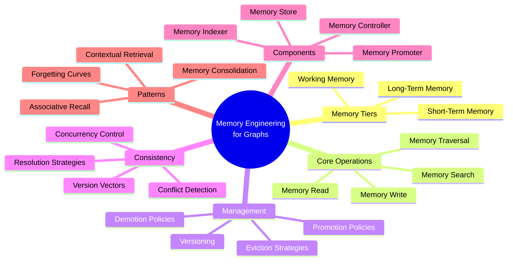
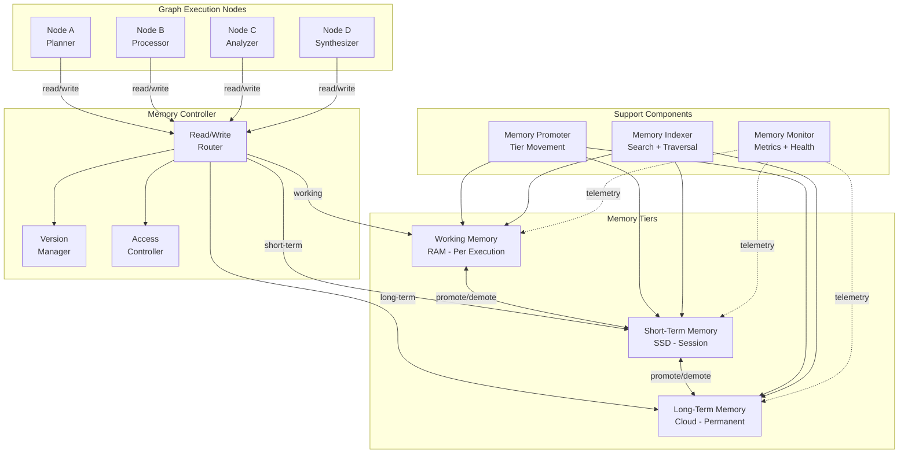
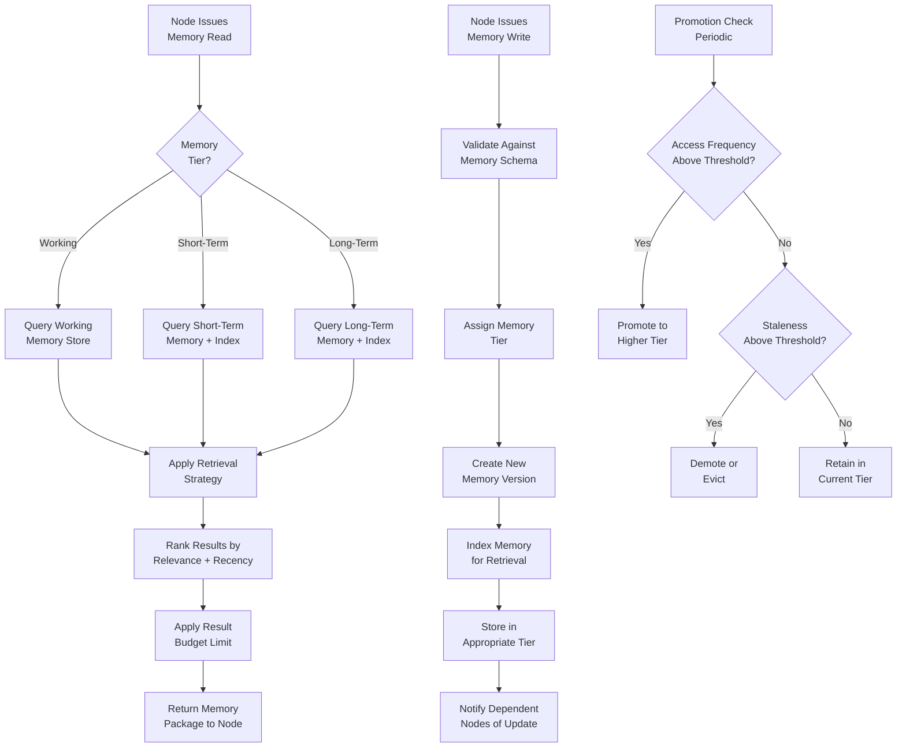
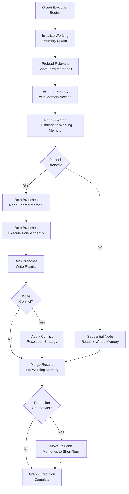
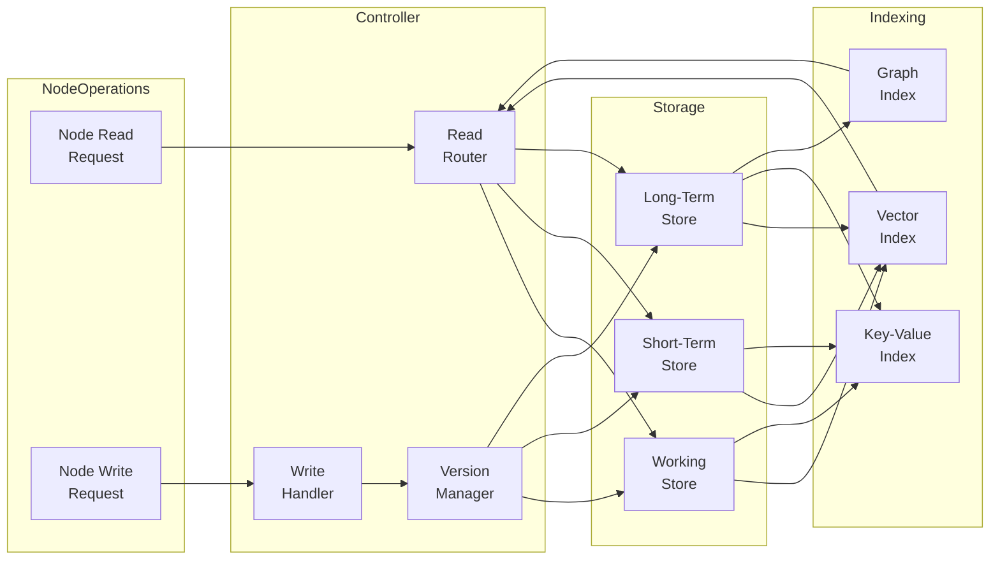
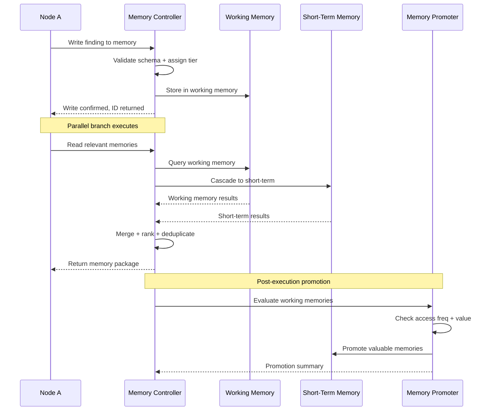

# Memory Engineering for Graphs

## 📌 Overview

Memory Engineering for Graphs is the discipline of designing, implementing, and managing memory systems that serve as the persistent and transient information backbone for graph-based AI architectures. In a graph system, memory is not a single monolithic store but a distributed, structured network of memory nodes interconnected through typed edges, with read and write operations that are themselves graph traversals. This approach recognizes that different nodes in a graph have fundamentally different memory needs — a planning node requires high-level summaries of past decisions, while a detail-processing node needs verbatim access to specific prior outputs.

The foundational principle is that memory in a graph system must be treated as a first-class architectural component, not an external dependency. Just as a database is designed with schemas, indexes, and access patterns in mind, graph memory must be designed with memory schemas, retrieval patterns, consistency guarantees, and lifecycle policies. A well-engineered memory system allows graph nodes to build on prior computation, maintain coherent state across parallel execution branches, and accumulate knowledge over multiple executions of the same or related graphs. Without deliberate memory engineering, graph systems are stateless and amnesic — each execution starts from scratch, unable to learn from or even reference what happened before.

Graph memory engineering encompasses three tiers of memory that mirror human cognition: working memory for data that exists only within a single graph execution, short-term memory for information that persists across recent executions of the same graph, and long-term memory for knowledge that endures across different graphs, users, and time periods. Each tier has different performance characteristics, capacity constraints, and management strategies. The engineering challenge lies in designing the interfaces between these tiers, ensuring that information flows smoothly between them, and building the read and write operations that allow graph nodes to interact with memory as naturally as they interact with their inputs and outputs.

## 🎯 Learning Objectives

By studying Memory Engineering for Graphs, you will develop the ability to design memory architectures that give graph-based AI systems the ability to remember, learn, and maintain coherent state across executions. You will learn to model memory as a graph structure — with memory nodes storing discrete information units and memory edges defining relationships between them — and to implement read and write operations that are expressed as graph traversals. This graph-native approach to memory enables powerful capabilities like associative recall (following edges from one memory to related memories) and contextual retrieval (finding memories relevant to a specific node's current task).

You will gain practical skills in implementing the three-tier memory architecture (working, short-term, long-term) and designing the promotion and demotion policies that move information between tiers. You will learn to define memory schemas that ensure consistency, implement conflict resolution strategies for parallel write operations, and build memory indexing systems that enable efficient retrieval even as the memory graph grows to millions of nodes. These skills are essential for building production graph systems that operate over extended periods and must maintain coherent behavior across many interactions.

Additionally, you will master the challenge of memory consistency in graph systems with parallel execution branches. When two branches of a graph read and write to shared memory simultaneously, the system must ensure that neither branch corrupts the other's view of reality. You will learn to apply concepts from distributed systems — including version vectors, optimistic concurrency control, and eventual consistency models — to the specific requirements of graph memory, where the unit of consistency is often a subgraph rather than a single record.

## 🧠 Definition

Memory Engineering for Graphs is the systematic design and management of structured memory systems that enable graph-based AI architectures to store, retrieve, and reason over information across time and execution boundaries. It defines memory as a graph M = (N_m, E_m, T) where N_m represents memory nodes (each storing a discrete unit of information with associated metadata), E_m represents memory edges (typed relationships between memory units such as temporal sequence, semantic similarity, causal dependency, or hierarchical containment), and T represents the three-tier architecture (working, short-term, long-term) that governs the memory's persistence, capacity, and access latency.

Each memory node in the graph carries a rich metadata payload including: a unique identifier, creation timestamp, last-accessed timestamp, access frequency counter, semantic embedding vector, tier assignment (working/short-term/long-term), source node reference (which graph node created this memory), confidence score, expiration policy, and dependency references to other memory nodes. Each memory edge carries a type label (e.g., "caused-by", "summarizes", "contradicts", "elaborates"), a weight representing relationship strength, and temporal metadata indicating when the relationship was established.

The engineering discipline encompasses four primary activities. Memory schema design defines what types of memories the system stores and how they relate. Memory operation design specifies the read and write interfaces that graph nodes use to interact with memory. Memory lifecycle management implements the policies that create, promote, demote, and evict memories across tiers. Memory consistency management ensures that concurrent read and write operations from parallel graph branches produce correct and predictable results. Together, these activities form a comprehensive framework for building memory systems that are reliable, efficient, and capable of supporting sophisticated graph-based AI applications.

## ❓ Why It Matters

Memory engineering matters because without it, graph-based AI systems are fundamentally limited to stateless, single-shot processing. Consider a customer service graph that handles a user's request across multiple interactions. Without memory, each interaction starts from zero — the system cannot remember previous conversations, learned preferences, or resolved issues. The user must repeat context every time, and the system cannot improve its responses based on accumulated experience. Memory transforms such a system from a stateless question-answering tool into a persistent, adaptive assistant that builds relationship and expertise over time.

In multi-agent graph systems, memory serves as the shared ground truth that enables coordination between agents. When Agent A discovers that a document contains conflicting information, it writes this finding to shared memory. When Agent B later processes the same document, it reads Agent A's finding and adjusts its analysis accordingly. Without shared memory, agents operate in isolation, potentially duplicating effort, reaching contradictory conclusions, or missing connections that would be obvious to a human reviewing all agents' outputs. Memory is the substrate that transforms a collection of independent nodes into a coherent, collaborative system.

Memory engineering also directly impacts system performance and cost. Well-designed memory systems allow nodes to reuse prior computations rather than repeating them. A retrieval node that has already searched for relevant documents in a previous graph execution can store the results in short-term memory, allowing a subsequent execution to skip the retrieval step entirely if the query is similar. This caching behavior — managed explicitly through memory engineering rather than ad hoc caching — can reduce graph execution time by orders of magnitude and significantly lower API costs by eliminating redundant LLM calls. In production environments where graphs execute thousands of times per day, these savings are not just nice to have but essential for economic viability.

## 🏛️ Core Concepts

**Working Memory** is the transient memory tier that exists only within the scope of a single graph execution. It holds intermediate computation results, node outputs, and contextual state that nodes need to share during execution. Working memory is analogous to the call stack in a programming language — it is automatically created when the graph starts executing and destroyed when execution completes. In graph terms, working memory nodes are created by node write operations and are accessible to any node in the current execution via read operations. Working memory has the highest access speed and lowest capacity of the three tiers.

**Short-Term Memory** persists across multiple executions of the same graph or graph family. It holds information that is relevant to the ongoing task or session but not necessarily to the system's long-term knowledge base. Examples include the user's current research topic, recently accessed documents, intermediate analysis results from recent executions, and the conversation history of the current session. Short-term memory bridges the gap between the ephemeral working memory and the permanent long-term memory, providing a middle ground where information can accumulate and be refined over multiple graph executions without the overhead of long-term storage.

**Long-Term Memory** is the permanent or semi-permanent tier that stores knowledge, patterns, and experiences that endure across different graphs, users, and time periods. This tier holds the system's accumulated knowledge — learned patterns, validated facts, effective strategies, and historical outcomes. Long-term memory is the slowest to access but has effectively unlimited capacity. Information enters long-term memory through a promotion process that evaluates whether a short-term memory has demonstrated sufficient value (through access frequency, reuse across executions, or explicit validation) to warrant permanent storage. Long-term memory enables the graph system to improve over time, learning from its experiences rather than repeating the same mistakes or discoveries.

**Memory Consistency** is the guarantee that concurrent read and write operations from parallel graph branches produce correct results. In a graph with parallel branches, two nodes might simultaneously read the same memory, modify it, and write it back — a classic concurrent write problem. Memory engineering addresses this through versioning (each memory write creates a new version rather than modifying in place), conflict detection (the system identifies when two branches have produced conflicting versions), and resolution strategies (the system applies predefined rules or invokes an LLM to reconcile conflicts).

## 🧩 Key Components

The memory engineering stack consists of several tightly integrated components. The **Memory Store** is the persistence layer that physically stores memory nodes and edges, typically implemented as a combination of a vector database (for semantic search), a key-value store (for fast exact lookups), and a graph database (for relationship traversals). The memory store provides the low-level read and write primitives that higher-level components build upon, and it handles the physical distribution of memory across storage media with different performance characteristics — RAM for working memory, SSD for short-term memory, and cloud storage for long-term memory.

The **Memory Controller** is the orchestration component that manages memory operations on behalf of graph nodes. When a node issues a memory read, the controller determines which tier to query, applies the appropriate retrieval strategy (exact match, semantic similarity, graph traversal, or a combination), and returns results within the node's specified budget. When a node issues a memory write, the controller determines the appropriate tier, validates the write against the memory schema, manages versioning, and propagates updates to any indexing or caching layers. The controller also implements access control, ensuring that nodes can only read and write memories they are authorized to access.

The **Memory Promoter** manages the movement of information between memory tiers. It implements promotion policies (moving a memory from working to short-term to long-term based on value signals) and demotion policies (moving a memory from long-term to short-term or evicting it entirely based on staleness or lack of use). The promoter uses a combination of heuristics (access frequency, recency, size) and learned models (predicting future value based on past access patterns) to make promotion and demotion decisions. The **Memory Indexer** maintains the indexes that enable efficient memory retrieval, including vector indexes for semantic search, inverted indexes for keyword search, and graph indexes for relationship traversal. The indexer updates incrementally as new memories are written and existing memories are modified, ensuring that retrieval performance remains consistent as the memory graph grows.

## 🧭 Mental Model

Think of graph memory engineering as designing the library and archive system for a large research institution. The working memory is the researcher's desk — it holds the books, notes, and documents currently being used for the active research project. It's immediately accessible but limited in space. When the desk gets too cluttered, the researcher must clear it, either by filing useful materials into a cabinet or discarding them. The short-term memory is the departmental filing cabinet — it holds materials from recent and ongoing projects, organized by topic and accessible within minutes. The long-term memory is the institution's permanent archive — a vast, climate-controlled vault containing decades of research, organized by detailed catalogs and accessible through a search system, but requiring more time to retrieve.

In this analogy, each researcher is a graph node. When Researcher A (Node A) finishes analyzing a document and discovers a key finding, they write a memo and file it in the departmental cabinet (short-term memory). Later, Researcher B (Node B), working on a related project, searches the cabinet and finds Researcher A's memo, incorporating the finding into their own analysis. If the finding proves valuable across many projects over time, the library staff (the memory promoter) transfers it to the permanent archive (long-term memory), where it becomes part of the institution's permanent knowledge base.

The consistency challenge arises when two researchers simultaneously check out the same file, make different annotations, and return it. The library system must detect this conflict and determine which annotations to keep, whether to merge them, or whether to flag the conflict for human resolution. This is precisely the challenge that memory consistency management addresses in graph systems, using versioning and conflict resolution strategies to ensure that parallel branches don't corrupt each other's understanding of shared memory.

## 🗺️ Mind Map



## 🏗️ Architecture Diagram



## 🔄 Workflow



## ⚙️ Internal Working

The internal operation of graph memory begins when a node issues a memory read request. The request specifies a query (either an exact key, a semantic description, or a graph traversal pattern), the target tier (or "any tier" for a cascading search), and a result budget (maximum number of memories and maximum total tokens). The memory controller routes the request to the appropriate tier store and applies the retrieval strategy. For exact key lookups, the controller queries the key-value index. For semantic searches, it computes the query embedding and performs an approximate nearest neighbor search in the vector index. For graph traversals, it starts from a specified memory node and follows edges of specified types to a specified depth.

Results from all retrieval strategies are merged, deduplicated, and ranked using a composite score that factors in semantic similarity (how closely the memory matches the query), recency (how recently the memory was created or accessed), access frequency (how often the memory has been used), and tier weight (preferences for memories in higher tiers when scores are similar). The top-scoring memories up to the budget limit are serialized into a structured format and returned to the requesting node. Each returned memory includes its full metadata, allowing the node to make informed decisions about how to use it.

Memory write operations follow a strict versioning protocol. When a node writes a memory, the controller creates a new version with an incremented version number, a reference to the previous version, and a link to the writing node. The memory is validated against the schema (checking required fields, type constraints, and referential integrity), assigned to the appropriate tier based on the node's specification and the memory's characteristics, and indexed in all relevant indexes. If the write creates or modifies relationships between memories, the corresponding edges are also versioned. After the write is persisted, the controller checks if any other nodes have registered interest in this type of memory change and sends notifications accordingly.

## 🔀 Execution Flow



## 📊 Lifecycle

```mermaid
stateDiagram-v2
    [*] --> Created : Node writes
    new memory
    Created --> Working : Assigned to
    working tier
    Working --> Active : Read by
    same execution
    Active --> Referenced : Used as input
    by downstream node
    Referenced --> Working : Still in
    execution scope
    Working --> Promoted : Execution ends
    + value high
    Promoted --> ShortTerm : Moved to
    short-term tier
    ShortTerm --> Accessed : Queried by
    new execution
    Accessed --> ShortTerm : Still relevant
    ShortTerm --> LongTerm : Frequently reused
    + validated
    ShortTerm --> Demoted : Stale or
    low value
    LongTerm --> Archived : Permanent
    knowledge
    Demoted --> Evicted : Removed from
    memory
    Archived --> Evicted : Obsolete
    knowledge
    Evicted --> [*]
```

## 📡 Data Flow



## 🤝 Interaction Flow



## 🌍 Real-World Analogy

Consider a large hospital's medical records system as an analogy for graph memory engineering. When a patient visits the emergency room, the attending physician (Node A) examines the patient and writes initial observations into the current visit record — this is working memory, specific to this particular visit. The physician also pulls up the patient's chart from the hospital's electronic health record system — this is short-term memory, containing recent lab results, current medications, and notes from the last few visits. For complex cases, the physician might also search the hospital's research database for similar cases and treatment outcomes — this is long-term memory, the institution's accumulated medical knowledge.

As the patient moves through different departments — radiology, cardiology, surgery — each specialist (each graph node) reads from and writes to the shared medical record. The cardiologist reads the emergency physician's observations (working memory shared through the visit record), adds their own cardiac assessment, and orders specific tests. The surgeon reads both the emergency and cardiology notes, writes a surgical plan, and updates the patient's risk profile. At each step, the shared memory ensures continuity of care — no specialist operates in isolation, and each builds on the accumulated understanding of the patient's condition.

When the visit concludes, valuable findings are extracted and added to the patient's permanent medical record (promotion to long-term memory), while visit-specific notes are archived separately (demotion from working memory). If the same patient returns months later, the new attending physician can access the accumulated record, seeing not just the current complaint but the full history of relevant conditions, treatments, and outcomes. This hospital records analogy perfectly captures how graph memory provides continuity, coordination, and cumulative knowledge across a system of specialized processing nodes.

## 💡 Practical Example

Imagine a content creation graph that produces weekly industry analysis reports. The graph has nodes for trend detection, source gathering, analysis, writing, and review. Memory engineering makes this system progressively better over time. During the first week's execution, the trend detection node identifies emerging topics and stores them in working memory. The analysis node reads these trends and writes its analytical findings. After execution, the memory promoter evaluates which memories were most useful — the trend detection results that the analysis node actually referenced are promoted to short-term memory.

By week three, the short-term memory contains patterns from the previous two weeks. The trend detection node now reads these patterns before scanning for new trends, allowing it to recognize not just new topics but the trajectory of ongoing trends. It discovers that a technology topic that appeared as a blip in week one has grown steadily in week two — a pattern it would have missed without memory. The analysis node, reading from short-term memory, can now provide week-over-week comparisons and trajectory analyses that were impossible in week one.

After several months, the memory promoter identifies memories that have been consistently valuable across many executions — certain analytical frameworks, validated source lists, and effective writing patterns — and promotes them to long-term memory. New graph executions now benefit from months of accumulated expertise. The system has evolved from a naive weekly report generator into an increasingly sophisticated analysis engine, all through deliberate memory engineering that captures, organizes, and leverages the knowledge generated by each execution.

## 🧪 Use Cases

Memory engineering is essential in **conversational AI systems** that must maintain coherent, personalized interactions over time. A customer support graph with nodes for intent recognition, knowledge retrieval, response generation, and escalation handling needs working memory to track the current conversation state, short-term memory to recall the customer's recent interactions and open issues, and long-term memory to access the customer's history, preferences, and past resolutions. Without this three-tier memory, the system would treat each message in isolation, losing the context that makes conversations feel natural and productive.

In **autonomous code development** graphs, memory enables the system to learn from past development sessions. The planning node can read long-term memory to find similar past tasks and reuse successful strategies. The coding node can read short-term memory to maintain consistency with code written earlier in the current session. The testing node can read working memory to verify that new code doesn't break existing functionality. When bugs are found and fixed, the resolution is stored in long-term memory, allowing the system to recognize and avoid similar bugs in future sessions.

In **scientific research automation**, memory engineering allows a graph of literature review, hypothesis generation, experiment design, and result analysis nodes to build an ever-growing knowledge base. Each literature review adds new findings to memory, each hypothesis generation references prior hypotheses and their outcomes, and each experiment design builds on methodological knowledge accumulated from previous experiments. Over time, the system develops deep domain expertise that accelerates future research cycles — exactly the kind of cumulative learning that makes human research teams more effective over time.

## ⚖️ Comparison

| Aspect | Stateless Graph | Single-Tier Memory | Three-Tier Graph Memory |
|---------|----------------|-------------------|------------------------|
| Persistence | None (per-execution only) | Single persistent store | Differentiated persistence |
| Cross-Execution Learning | Not possible | Possible but undifferentiated | Tiered, value-driven learning |
| Memory Access Speed | N/A | Uniform across all data | Fast for working, slower for long-term |
| Capacity Management | N/A | Single limit | Tier-specific limits |
| Parallel Consistency | N/A (no shared state) | Must be handled manually | Built-in versioning + conflict resolution |
| Memory Relevance | N/A | All data treated equally | Tier reflects relevance and age |
| Cost Efficiency | High (no storage overhead) | Medium | Optimized by tier placement |
| Adaptation | None | Slow (everything persists) | Fast (valuable data promoted quickly) |

The three-tier approach differentiates itself by recognizing that not all memories are equal. A single-tier system either keeps everything (wasting resources on low-value data) or requires complex manual management to determine what to keep. The three-tier system automates this decision through promotion and demotion policies, ensuring that the most valuable information is always readily accessible while less valuable information is retained at lower cost or eventually discarded.

## ✅ Best Practices

Design your memory schema to be evolutionary, not fixed. The types of memories your system needs will change as it matures and encounters new situations. Build your schema with extension points — optional metadata fields, flexible edge types, and pluggable validation rules — that allow the memory structure to grow without breaking existing functionality. This evolutionary approach prevents the costly schema migrations that plague rigid memory designs and allows the system to adapt its memory organization based on what it learns about its own operation.

Implement memory access logging from day one. Every memory read and write should be logged with the requesting node, timestamp, query or content, and outcome. This telemetry is invaluable for optimizing memory design — it reveals which memories are most accessed, which are never used, which queries return poor results, and where bottlenecks exist. Without access logging, memory optimization is guesswork. With it, you can make data-driven decisions about indexing strategies, promotion policies, and tier sizing that measurably improve system performance.

Design for memory consistency from the start, not as an afterthought. Define upfront how your system will handle concurrent writes to the same memory, how conflicts will be detected and resolved, and what consistency guarantees each memory tier provides. Even if your initial graph has no parallel branches, designing for consistency early prevents painful refactoring when parallelism is added later. The cost of implementing versioning and conflict detection is small compared to the cost of debugging subtle consistency bugs in production.

## ❌ Common Mistakes

The most common mistake is conflating context and memory. Context (as covered in Context Engineering) is the information assembled for a specific node at a specific point in execution. Memory is the persistent store that context is drawn from. Confusing the two leads to designs where transient execution state is written to long-term memory (polluting the knowledge base with ephemeral data) or where persistent knowledge is treated as disposable context (losing valuable accumulated information when execution ends). Maintaining a clear conceptual distinction — and clear architectural boundaries — between context and memory is essential for a well-functioning graph system.

Another frequent mistake is implementing memory as a simple key-value store without relationships. This reduces memory to a flat lookup table, losing the graph structure that enables powerful capabilities like associative recall and contextual retrieval. A memory system that can only look up a value by its exact key is dramatically less useful than one that can traverse relationships between memories, find memories similar to a query, or follow chains of causal connections. The graph structure of memory is not an optional enhancement — it is the core value proposition of memory engineering for graphs.

A third critical mistake is neglecting memory cleanup and lifecycle management. Without deliberate eviction and demotion policies, memory grows without bound, degrading retrieval performance and increasing storage costs. Engineers often focus on getting memories into the system but neglect the equally important process of removing or archiving memories that are no longer valuable. A well-engineered memory system has clear policies for every stage of the memory lifecycle, including explicit criteria for when memories should be promoted, demoted, consolidated, or evicted.

## 🚀 Advanced Topics

**Memory consolidation** is the process of merging multiple related memories into a single, more abstract memory that captures the essential information while reducing storage and retrieval costs. This mirrors the human brain's process of consolidating individual experiences into general knowledge. In a graph memory system, consolidation might merge five separate memories about individual customer complaints into a single memory that captures the common pattern, with links to the original individual memories for detail. Consolidation is typically triggered when a cluster of related memories exceeds a size threshold or when the memory promoter detects that individual memories in a cluster are being accessed together frequently.

**Memory-augmented graph routing** uses the contents of memory to dynamically adjust the graph's execution topology. If memory indicates that a particular processing approach has been consistently successful for the current type of input, the graph router might activate a shortcut that skips unnecessary exploration nodes. Conversely, if memory indicates that a standard approach has been failing, the router might activate additional verification or refinement nodes. This creates a feedback loop where memory influences execution, and execution produces new memories — an adaptive system that continuously optimizes its own behavior based on accumulated experience.

**Federated memory** enables multiple independent graph systems to share specific memories without sharing their entire memory stores. This is analogous to federated learning in machine learning, where models share learned parameters without sharing training data. In federated memory, each graph system maintains its own private memory store but publishes specific memories (subject to access control policies) to a shared memory bus. Other systems can subscribe to specific memory types and incorporate relevant shared memories into their own stores. This enables a fleet of graph systems to develop collective intelligence while maintaining the privacy and autonomy of individual systems.
