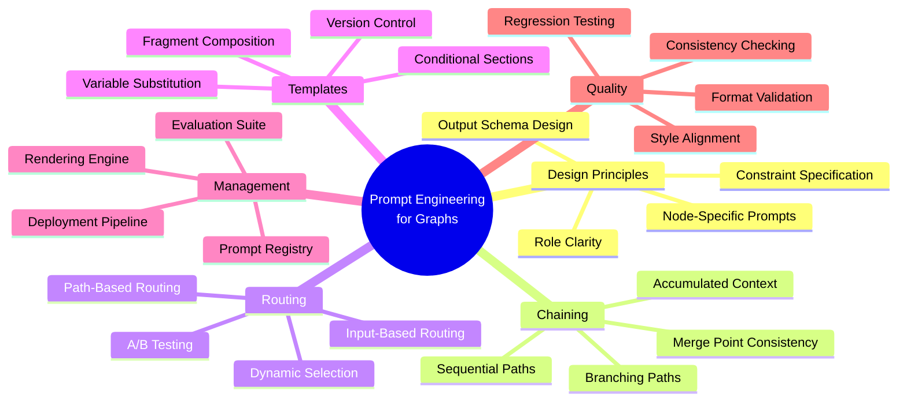
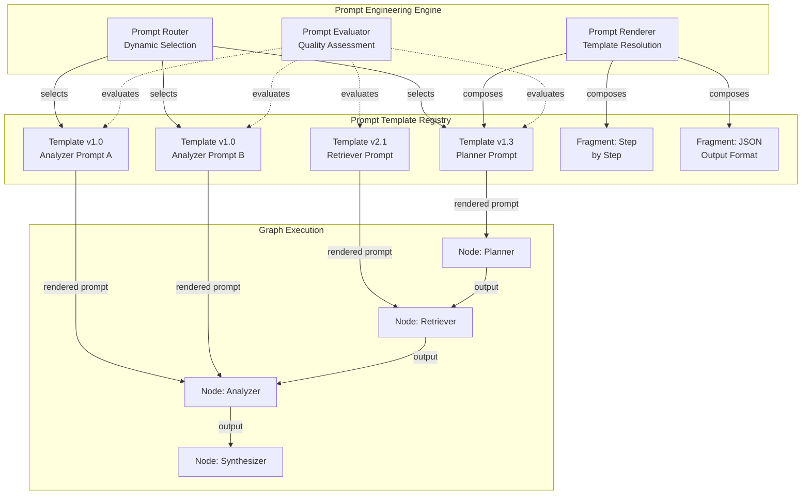
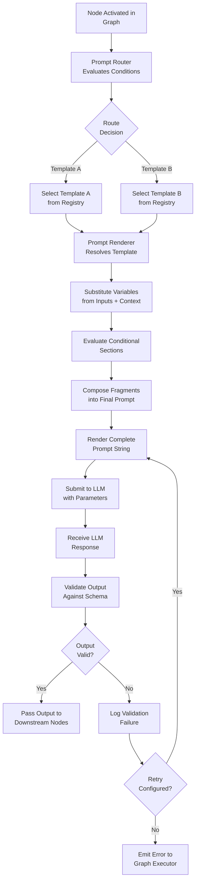
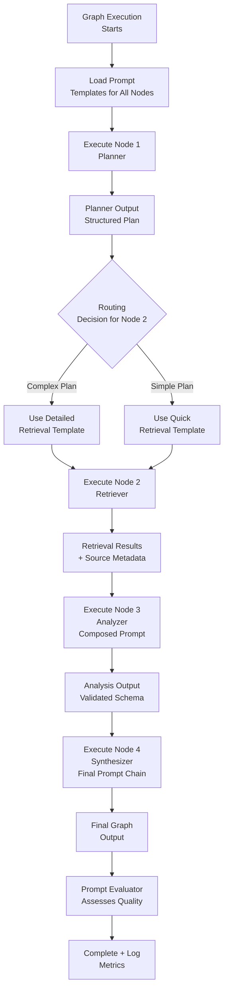
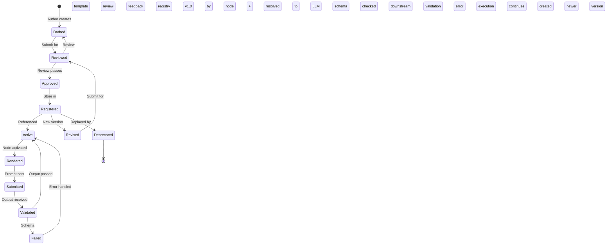
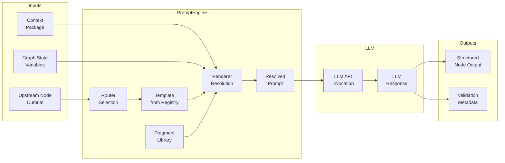
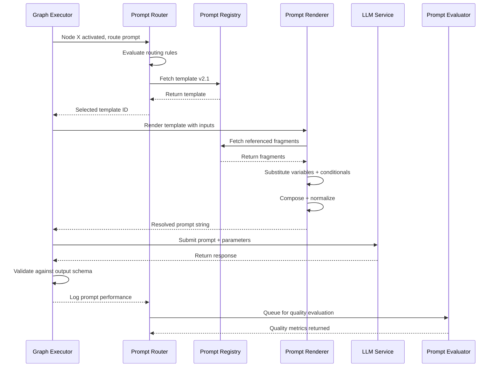

# Prompt Engineering for Graphs

## 📌 Overview

Prompt Engineering for Graphs elevates the craft of prompt design from a single-prompt art to a systematic engineering discipline that operates across entire graph topologies. In traditional prompt engineering, practitioners focus on optimizing a single prompt to get the best possible output from one LLM call. In graph-based systems, the challenge is fundamentally different: you are not designing one prompt but a coordinated collection of prompts — each tailored to its node's specific role, each receiving different context and inputs, and each producing outputs that become inputs or context for other nodes. The quality of the overall graph's output depends not just on any individual prompt's quality but on how well all prompts work together as a system.

This discipline introduces concepts that have no direct analogue in single-prompt engineering. Prompt chaining in a graph is not simply feeding one prompt's output into the next — it is designing paths through the graph where each prompt builds on the accumulated understanding of all preceding prompts along that path. Prompt routing determines which prompt a node should use based on the graph's current state, the input it received, and the path that led to it. Prompt template management ensures that prompts are versioned, tested, and reusable across different graphs and executions. Together, these capabilities transform prompt design from an isolated craft into a compositional engineering practice.

At its core, prompt engineering for graphs recognizes that each node in a graph is a specialist with a specific job, and its prompt must be optimized for that specific job. A planning node's prompt must elicit structured, decomposable plans. A retrieval node's prompt must produce precise search queries. A synthesis node's prompt must integrate diverse inputs into a coherent whole. Treating all nodes as generic prompt consumers — giving them all the same style of prompt or the same level of instruction — is a recipe for mediocrity. Graph prompt engineering demands that each prompt be crafted with the same precision that a software engineer brings to designing each function in a well-architected program.

## 🎯 Learning Objectives

By studying Prompt Engineering for Graphs, you will develop the ability to design prompt systems that are coordinated, adaptive, and maintainable across complex graph topologies. You will learn to think of each node's prompt not in isolation but as part of a larger prompt ecosystem where the outputs of one prompt become the inputs to others. This systems thinking is essential for building graph systems that produce coherent, high-quality results — a chain of individually excellent prompts can still produce poor results if they are not designed to work together.

You will master the technique of prompt chaining as graph paths, understanding how to design sequences of prompts where each builds on the accumulated context and outputs of its predecessors. This includes techniques for passing structured outputs between prompts, maintaining thematic consistency across a chain, and handling error propagation when an upstream prompt produces unexpected output. You will also learn prompt routing strategies — how to design systems where the choice of prompt is itself a decision made by the graph based on runtime conditions, enabling adaptive behavior that responds to input characteristics.

Additionally, you will gain proficiency in prompt template management at scale. This includes designing prompt template systems with variable substitution, conditional sections, and composition primitives; implementing versioning and A/B testing for prompts; and building prompt registries that allow prompts to be shared, discovered, and reused across different graphs. These skills transform prompt engineering from a manual, ad-hoc process into an engineering practice with the same rigor and tooling applied to software development.

## 🧠 Definition

Prompt Engineering for Graphs is the systematic design, management, and optimization of prompts across graph-based AI architectures, treating each node's prompt as a specialized component within a coordinated prompt system. Formally, a prompt graph P = (N_p, E_p) consists of prompt nodes N_p — each containing a prompt template with variable slots, output format specifications, and constraint definitions — and prompt edges E_p that define data flow and dependency relationships between prompts. Each prompt node has a signature that specifies its expected inputs, its output schema, and its resource requirements (model, temperature, max tokens).

A prompt template T_i for node i is a structured document containing several components: a system instruction block that establishes the node's role and behavior, a context block that will be populated by the context engineering system, an input block that receives the node's direct inputs from upstream nodes, a few-shot block containing examples that guide the model's behavior, and an output format block that constrains the model's response structure. Each block may contain variable references (e.g., {{upstream_output}}, {{retrieved_context}}) that are resolved at execution time by the graph runtime. The template may also contain conditional sections that are included or excluded based on runtime conditions.

Prompt chaining in the graph context refers to the phenomenon where a prompt's output flows through one or more intermediate nodes before reaching a downstream prompt. This creates a path of prompt-to-prompt influence where the final output reflects not just the last prompt's instructions but the accumulated effect of all prompts along the path. Prompt routing is the mechanism by which the graph selects which prompt template to use for a given node at execution time, potentially choosing from multiple templates based on input characteristics, path history, or external configuration. Prompt template management encompasses the infrastructure for storing, versioning, testing, and deploying prompt templates across the graph system.

## ❓ Why It Matters

Prompt engineering for graphs matters because the quality gap between a well-engineered prompt system and an ad-hoc one grows exponentially with graph complexity. In a simple two-node graph (retrieve then summarize), the impact of prompt design is moderate — each prompt operates relatively independently. But in a ten-node graph with parallel branches, conditional routing, and loop structures, the interaction effects between prompts become the dominant factor in output quality. A slight ambiguity in one prompt can cascade through multiple downstream nodes, each amplifying the ambiguity until the final output is incoherent.

The stakes are particularly high in production graph systems where consistency and reliability are non-negotiable. A prompt that works well for 90% of inputs but produces garbled output for 10% creates a system that fails unpredictably in production. In a single-prompt system, this is manageable — you refine the prompt to handle the edge cases. In a graph system, the edge case might only manifest when a specific combination of prompts is activated along a specific execution path, making it much harder to detect and fix. Systematic prompt engineering — with clear specifications, comprehensive testing, and version control — is essential for achieving the reliability that production systems demand.

Furthermore, prompt engineering for graphs directly impacts development velocity and maintainability. In an unmanaged system, prompts are often hard-coded within node implementations, making them difficult to find, modify, and test. When a prompt needs to be updated, developers must locate all copies, verify they are consistent, and test the impact across all execution paths. A well-engineered prompt management system centralizes prompts in a registry, enables versioned updates with rollback capability, and provides testing infrastructure that evaluates prompt changes against a suite of representative inputs. This transforms prompt maintenance from a risky, time-consuming manual process into a routine engineering operation.

## 🏛️ Core Concepts

**Node-Specific Prompt Design** is the principle that each graph node's prompt should be optimized for its specific role within the graph. A classification node's prompt should emphasize decision criteria and output format (a clear label with confidence score). A generation node's prompt should emphasize creativity, style, and audience awareness. A validation node's prompt should emphasize rigor, consistency checking, and explicit pass/fail criteria. Designing prompts for specific roles — rather than using generic, all-purpose prompts — dramatically improves the quality of each node's output and, consequently, the quality of the graph's overall result.

**Prompt Chaining as Graph Paths** treats sequences of prompt executions as paths through the graph topology. Each path defines a specific chain of prompt-to-prompt data flow, and the cumulative effect of all prompts along a path determines the quality of the final output at the path's terminus. This perspective reveals optimization opportunities that are invisible when looking at prompts in isolation. For example, you might discover that two prompts along a critical path are performing redundant formatting — the first prompt structures its output, and the second immediately restructures it. Eliminating this redundancy by adjusting both prompts improves efficiency without changing the graph topology.

**Prompt Routing** is the mechanism by which the graph selects which prompt template to use for a node at execution time. Unlike static prompt assignment (where each node has exactly one prompt), routing enables dynamic prompt selection based on runtime conditions. A routing function might select different prompts based on the input's language, complexity, domain, or the path that led to the current node. This enables a single graph to handle diverse inputs by adapting its prompts to match each input's characteristics, rather than requiring separate graphs for different input types.

**Prompt Template Composition** is the practice of building complex prompts from reusable prompt fragments. A prompt library might contain fragments for common behaviors — "think step by step," "consider multiple perspectives," "prioritize accuracy over completeness" — that can be composed into full prompts. Composition enables consistency (the same behavioral guidance is expressed the same way across all prompts), reusability (improvements to a fragment benefit all prompts that use it), and maintainability (changing a cross-cutting concern requires updating one fragment, not dozens of individual prompts).

## 🧩 Key Components

The prompt engineering stack for graph systems comprises several specialized components. The **Prompt Registry** is the central repository for all prompt templates used across the graph system. It stores each template with its full metadata — unique identifier, version number, author, creation and modification dates, associated node types, and test coverage metrics. The registry supports versioned reads (allowing nodes to specify which version of a prompt to use) and writes (allowing prompt updates without breaking existing references). It also supports prompt discovery, enabling nodes or developers to find prompts by type, tag, or capability.

The **Prompt Renderer** is the component that converts a prompt template into a fully resolved prompt string at execution time. It performs variable substitution (replacing template variables with actual values from the node's inputs and context), conditional section evaluation (including or excluding prompt sections based on runtime conditions), and composition (assembling the final prompt from fragment components). The renderer also applies formatting normalization — ensuring consistent whitespace, section ordering, and delimiter usage — so that the resolved prompt is clean and unambiguous regardless of how the template was constructed.

The **Prompt Router** determines which prompt template each node should use at execution time. It evaluates routing rules that may consider the node's input characteristics, the graph's current execution state, the path history, and external configuration flags. The router supports both deterministic routing (rule-based decisions that produce the same prompt selection for the same conditions) and probabilistic routing (randomized selection for A/B testing or exploration). The **Prompt Evaluator** provides testing and quality assessment capabilities. It can execute a prompt template against a suite of test inputs and measure output quality using predefined metrics (format compliance, factual accuracy, style consistency). It can also compare two versions of a prompt to determine whether a proposed change improves or degrades output quality.

## 🧭 Mental Model

Think of prompt engineering for graphs as writing a screenplay for an ensemble cast, where each actor (node) has their own script (prompt) but all scripts must tell a coherent story together. In a movie, each scene has its own dialogue, but the dialogue in scene three must be consistent with what was established in scenes one and two. If a character's motivation changes between scenes without explanation, the audience notices the inconsistency. Similarly, in a graph system, if a planning node establishes a specific approach in its prompt output, a downstream execution node's prompt must be designed to work with that approach, not against it.

The prompt template registry is like the screenwriter's script vault — a centralized, versioned repository where every piece of dialogue is stored, tracked, and managed. When a director wants to revise a scene (update a prompt), they check out the latest version, make changes, and the revision is tracked with a new version number. If the revision doesn't work in rehearsal (testing), they can revert to the previous version. Prompt composition is like having a library of reusable dialogue patterns — standard greetings, dramatic reveals, comedic timing beats — that writers can draw from and adapt rather than writing every line from scratch.

Prompt routing is like a choose-your-own-adventure story structure, where the next scene depends on choices made earlier. If the protagonist chooses the dangerous path (the input is complex), the story shifts to an action-oriented script (a more detailed, cautious prompt). If the protagonist chooses the safe path (the input is straightforward), the story shifts to a lighter script (a simpler, faster prompt). The overall story arc (the graph topology) remains the same, but the specific dialogue at each point adapts to the path taken, creating a more natural and effective narrative.

## 🗺️ Mind Map

## 🏗️ Architecture Diagram

## 🔄 Workflow

## ⚙️ Internal Working

The internal operation of prompt engineering in a graph begins when a node is activated and the prompt router receives a routing request. The router evaluates the node's routing rules against the current execution context. Routing rules are expressed as condition-action pairs: if the input contains domain X, use template A; if the execution path includes node Y, use template B; if the A/B test flag is set to variant 2, use template C. The router evaluates these rules in priority order and returns the identifier of the selected template.

With the template selected, the prompt renderer takes over. It retrieves the template from the registry and begins the resolution process. First, it resolves variable references by looking up each variable name in the node's input payload and context package. Variables that are not found in the immediate context are looked up in the graph's shared state, and finally in the prompt registry's global variable store. Missing variables trigger either a default value substitution or an error, depending on the variable's configuration. Next, the renderer evaluates conditional sections — blocks of prompt text enclosed in conditional directives that are included only if the specified condition is true. Conditions might check variable values, input properties, or execution state flags.

After variables and conditionals are resolved, the renderer assembles fragment components. Fragments are reusable prompt sections stored separately in the registry and referenced by the template. The renderer retrieves each referenced fragment, recursively resolves any variables within it, and inserts it at the reference point. This composition process continues until all fragments are resolved and the complete prompt string is assembled. The renderer then performs a final normalization pass — ensuring consistent section delimiters, removing excessive whitespace, and validating the total token count against the node's budget. The resulting prompt string is passed to the LLM call along with model parameters (temperature, top-p, max tokens) specified in the template's metadata. After the LLM responds, the output is validated against the template's output schema before being passed to downstream nodes.

## 🔀 Execution Flow

## 📊 Lifecycle

## 📡 Data Flow

## 🤝 Interaction Flow

## 🌍 Real-World Analogy

Consider a professional kitchen as an analogy for prompt engineering in a graph system. The head chef designs the menu (the graph topology), and each station in the kitchen is a node with its own specific recipe (prompt template). The saucier has a recipe for béarnaise sauce that specifies precise ingredients, temperatures, and techniques. The grill chef has a completely different recipe for cooking steak. Each station's recipe is optimized for its specific task — you wouldn't give the saucier the steak recipe or the grill chef the sauce recipe.

The recipe book is the prompt registry — a centralized, organized collection of all recipes, each with version history (the béarnaise recipe was revised three times before reaching its current form). When the expediter (the prompt router) receives an order, they route specific dishes to the appropriate stations. If the order includes a complex dish, they might route it to the sous chef station with a more detailed recipe; if it's a simple dish, they route it to a line cook with a streamlined recipe.

Each recipe includes not just ingredients but also instructions about how to coordinate with other stations. The steak recipe says "serve with sauce from the saucier station" — this is like a prompt that specifies how its output should be used by downstream nodes. The key insight is that the quality of the final plate depends not just on any individual recipe but on how all the recipes work together. If the steak recipe calls for a sauce that the saucier recipe doesn't produce, the dish fails — exactly as a graph fails when downstream prompts expect output formats that upstream prompts don't produce.

## 💡 Practical Example

Consider a document analysis graph that processes legal contracts. The graph has four nodes: a classifier, an extractor, a risk analyzer, and a report generator. Each node needs a carefully engineered prompt. The classifier's prompt is concise and decision-oriented: "You are a legal document classifier. Given the following contract text, classify it into exactly one of these categories: [NDA, employment, vendor, lease, other]. Output ONLY the category name."

The extractor's prompt is detailed and structure-oriented: "You are a legal clause extractor. Given a {{contract_type}} contract, extract all clauses of the following types: termination, liability, confidentiality, dispute resolution, and payment terms. For each clause, output a JSON object with fields: clause_type, original_text, key_obligations (array), and parties_involved (array)." Notice how this prompt references the classifier's output ({{contract_type}}) — the prompt is designed to receive and use the upstream node's structured output.

The risk analyzer's prompt builds on both upstream outputs: "You are a legal risk analyst. The following clauses were extracted from a {{contract_type}} contract. For each clause, assess the risk level (low/medium/high/critical) and explain your reasoning. Pay special attention to: liability caps, termination conditions, and confidentiality scope. {{extracted_clauses}}" The report generator's prompt then synthesizes everything: "Generate an executive summary of this contract analysis. The contract is classified as {{contract_type}}. {{risk_findings}}. Structure the report with: executive summary, key risks, recommendations, and overall risk score."

Each prompt is optimized for its node's role, references upstream outputs through template variables, and specifies a clear output format that the next node can consume. This coordinated design ensures the entire chain produces a coherent, well-structured analysis report.

## 🧪 Use Cases

Prompt engineering for graphs is critical in **multi-language content systems** where different nodes must produce content in the same language and tone. A localization graph might include a source analysis node, a cultural adaptation node, a translation node, and a quality review node. The challenge is ensuring that all nodes operate in the target language consistently. The source analysis prompt must instruct the model to produce its analysis in the target language. The cultural adaptation prompt must reference the source analysis in the target language. The translation prompt must be informed by the cultural adaptations. Prompt engineering ensures that language consistency is maintained across the entire chain, producing localized content that feels natural rather than machine-translated.

In **data pipeline graphs** that process and transform data through multiple stages, prompt engineering ensures that output schemas are compatible between stages. A data cleaning node might produce clean JSON records, a feature extraction node must consume those records and produce feature vectors, and a classification node must consume the feature vectors. Each prompt must specify its output schema precisely enough that the downstream prompt can reliably parse and use it. Schema-compatible prompt design is a form of contract programming for LLM-based systems, and it is essential for building reliable data processing graphs.

In **creative writing graphs** that generate long-form content, prompt engineering manages the consistency of style, voice, and narrative across multiple generation nodes. A novel-writing graph might have separate nodes for world-building, character development, plot planning, and chapter writing. Each node's prompt must establish and maintain a consistent authorial voice, reference the established world and character details, and produce output that integrates seamlessly with adjacent chapters. This requires careful prompt design that passes not just content but stylistic guidelines between nodes.

## ⚖️ Comparison

| Aspect | Single-Prompt Engineering | Graph Prompt Engineering |
|---------|--------------------------|------------------------|
| Scope | One prompt, one LLM call | Coordinated system of prompts |
| Optimization Target | Individual output quality | End-to-end graph output quality |
| Inter-Prompt Dependencies | None | Critical design concern |
| Output Format | Free-form or simple schema | Must match downstream expectations |
| Routing | N/A (one prompt) | Dynamic selection based on conditions |
| Versioning | Manual file management | Registry with version control |
| Testing | Manual inspection | Automated evaluation suites |
| Composition | Copy-paste between prompts | Fragment library with composition |
| Maintenance | Find-and-replace across files | Centralized registry updates |

The fundamental shift is from optimizing individual prompts to optimizing prompt systems. In single-prompt engineering, success means getting the best possible output from one prompt. In graph prompt engineering, success means getting the best possible output from the entire graph, which requires that every prompt in the chain is not just good in isolation but good in combination with every other prompt it interacts with.

## ✅ Best Practices

Design prompts with explicit output schemas that serve as contracts between nodes. Every prompt should specify exactly what format its output will take — JSON structure, markdown format, key-value pairs — and this specification should be visible to both the producing node (to guide its output) and the consuming node (to guide its parsing). This contract-based approach eliminates the fragility of free-form text passing between nodes, where a slight change in one prompt's output format silently breaks the downstream prompt's ability to parse its input. Schema specifications should be versioned alongside the prompt template so that contract changes are tracked and managed.

Implement prompt-level monitoring and quality metrics for every node in the graph. Track not just whether the LLM call succeeded but whether the output met quality criteria: format compliance rate, output length distribution, semantic similarity to expected outputs, and downstream node satisfaction (did the consuming node produce better results when it received this prompt's output?). These metrics enable data-driven prompt optimization — you can identify which prompts are underperforming, A/B test prompt variations, and measure the impact of prompt changes on end-to-end graph quality.

Use prompt fragments for cross-cutting concerns that apply to multiple nodes. If multiple nodes need to follow the same style guidelines, output constraints, or behavioral instructions, encode these as fragments rather than duplicating them in each prompt. This ensures consistency (all nodes receive identical instructions for shared concerns) and simplifies maintenance (updating the fragment updates all nodes). Reserve full, node-specific prompt content for aspects that are truly unique to each node's role.

## ❌ Common Mistakes

The most pervasive mistake is designing prompts in isolation without considering how outputs flow between nodes. Engineers often craft an excellent prompt for Node A, then craft an excellent prompt for Node B, only to discover at integration time that Node A's output format is incompatible with Node B's expected input. This integration failure is expensive because it requires redesigning and retesting both prompts. The solution is to design prompts top-down: first define the interfaces (output schemas) between nodes, then design each prompt to produce and consume those interfaces correctly.

Another common mistake is over-constraining prompts with too many instructions, examples, and constraints. In single-prompt engineering, more detail often helps. But in a graph system, each prompt's output becomes input to other prompts, and excessive constraint in an upstream prompt can paint downstream prompts into a corner. For example, if a planning prompt produces an extremely detailed plan with fixed step names, the execution prompt may have no flexibility to adapt if a step proves impossible. The right level of constraint balances specificity (enough for the downstream node to use the output reliably) with flexibility (enough for the downstream node to adapt to runtime conditions).

A third critical mistake is neglecting prompt versioning and tracking. In fast-moving projects, prompts are frequently modified to improve output quality, but without version tracking, it becomes impossible to determine which prompt version produced which output, making debugging and optimization guesswork. Every prompt change should create a new version with a change log, and every graph execution should record which prompt versions were used. This traceability is essential for reproducing results, debugging failures, and measuring the impact of prompt changes over time.

## 🚀 Advanced Topics

**Meta-prompting for graph prompt generation** uses an LLM to generate or optimize prompts for graph nodes. A meta-prompt takes as input a node's specification (its role, expected inputs, desired outputs, and the prompts of adjacent nodes) and produces an optimized prompt that satisfies those requirements. This enables automated prompt engineering at scale — when a new node is added to the graph, a meta-prompt can generate an initial prompt that is already compatible with the node's upstream and downstream neighbors. Meta-prompting can also be used for continuous optimization, where a meta-prompt analyzes a node's output quality metrics and suggests prompt improvements.

**Prompt-chain optimization** treats the entire prompt chain along a graph path as a single optimization problem. Rather than optimizing each prompt independently, chain optimization evaluates the cumulative effect of all prompts along a path and adjusts multiple prompts simultaneously to improve the end-to-end output. This can reveal non-obvious optimizations — for example, moving a formatting instruction from the third prompt in a chain to the first prompt might improve the final output, even though the formatting instruction is not directly relevant to the first prompt's task. Chain optimization requires a different evaluation methodology (measuring path-level output quality rather than individual prompt output quality) but can achieve significantly better results than per-prompt optimization.

**Adaptive prompt evolution** enables prompts to improve themselves over time based on execution feedback. After each graph execution, the system evaluates which prompts contributed to good outcomes and which contributed to poor outcomes. Prompts that consistently produce low-quality outputs are flagged for review, while prompts that produce high-quality outputs are analyzed to identify what makes them effective. Over time, this feedback loop enables the prompt registry to evolve toward higher quality, with successful prompt patterns proliferating and unsuccessful patterns being retired. This creates a self-improving prompt ecosystem that gets better with use, much like a knowledge base that grows more valuable as more information is added to it.