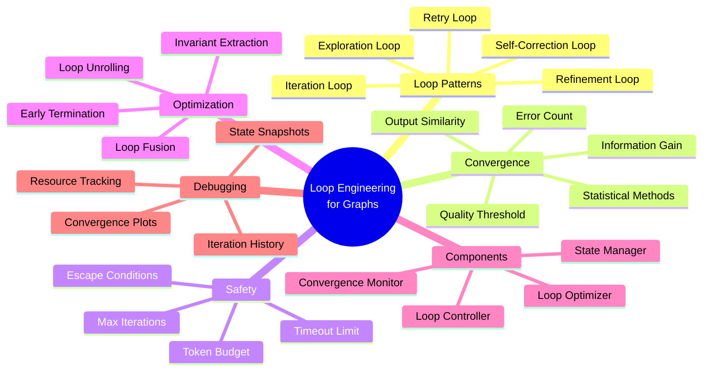
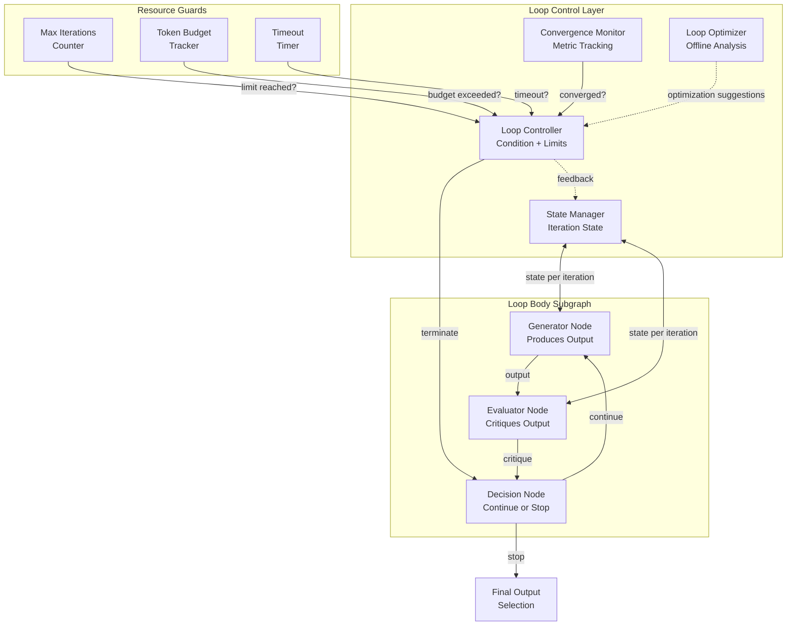
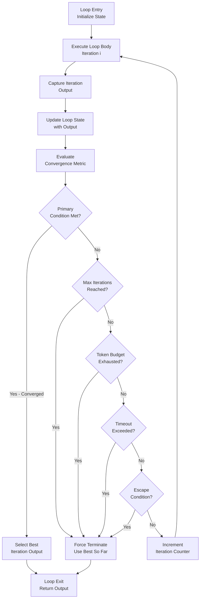
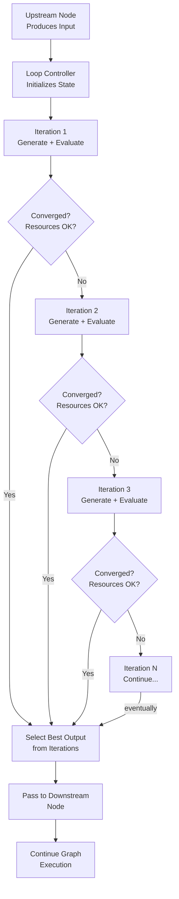
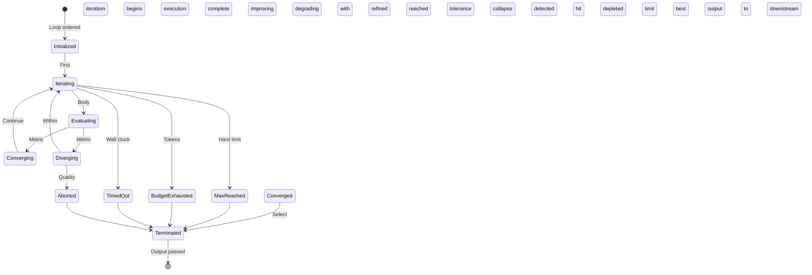
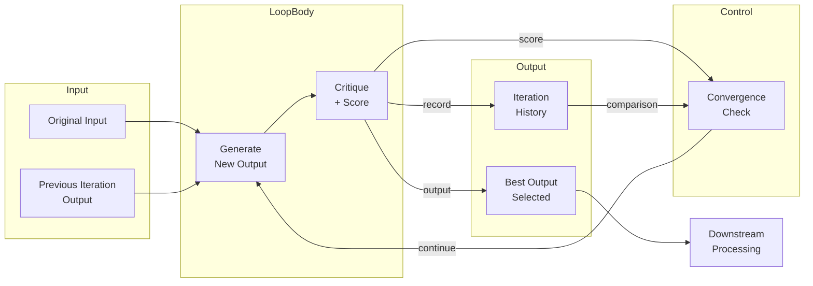
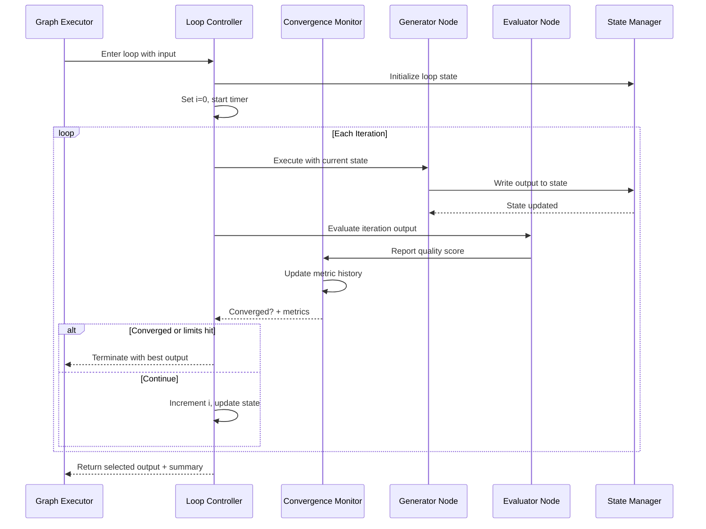

# Loop Engineering for Graphs

## 📌 Overview

Loop Engineering for Graphs is the discipline of designing, controlling, and optimizing cyclic execution patterns within graph-based AI systems. While many graph architectures are acyclic (directed acyclic graphs, or DAGs), production-grade AI systems frequently require loops — cycles in the graph where a node's output feeds back to an earlier node, creating iterative processing that refines, retries, or progressively builds upon prior results. Loops enable capabilities that are impossible in purely acyclic graphs: self-correction, progressive refinement, iterative search, and adaptive processing that continues until a quality threshold is met.

The fundamental challenge of loop engineering is that LLM-based nodes are inherently non-deterministic and resource-constrained, making uncontrolled loops dangerous. An infinite loop in a traditional software system wastes CPU cycles; an infinite loop in a graph system wastes tokens, money, and time at a rate that can quickly become catastrophic. A graph that loops a 4K-token prompt ten times consumes 40K tokens on that single loop — and if the loop never converges, the cost is unbounded. Loop engineering provides the guardrails, detection mechanisms, and optimization strategies that make loops safe, efficient, and effective in production systems.

This discipline encompasses four primary concerns. First, loop pattern design — identifying and implementing the right loop pattern for each use case (retry, refinement, iteration, self-correction, exploration). Second, convergence detection — determining when a loop has achieved its objective and should terminate. Third, loop unrolling — optimizing loops by converting some iterations into fixed graph topologies where possible. Fourth, loop-invariant extraction — identifying computations within a loop that produce the same result every iteration and moving them outside the loop to avoid redundant processing. Together, these techniques enable the power of iterative processing while maintaining the safety and efficiency that production systems demand.

## 🎯 Learning Objectives

By studying Loop Engineering for Graphs, you will develop the ability to design iterative processing patterns that are both powerful and safe within graph-based AI architectures. You will learn to identify when a loop is the appropriate solution (versus a fixed pipeline or conditional branch), select the right loop pattern for the task at hand, and implement convergence detection mechanisms that reliably terminate loops at the right time — neither too early (producing suboptimal results) nor too late (wasting resources on diminishing returns).

You will gain mastery of the four fundamental loop patterns used in graph systems. Retry loops re-execute a node when its output fails validation, attempting to recover from transient quality issues. Refinement loops progressively improve a node's output by feeding it back with critique or feedback, each iteration producing a better result than the last. Iteration loops process a collection of items through the same node or subgraph, accumulating results across iterations. Self-correction loops enable a node to evaluate its own output, identify deficiencies, and produce an improved version — a powerful pattern for tasks that require both generation and quality assurance.

Additionally, you will learn advanced optimization techniques including loop unrolling (converting predictable loop iterations into static graph structures for better performance and observability), loop-invariant extraction (moving redundant computations outside the loop), and loop fusion (combining multiple loops into a single loop to reduce overhead). These optimization techniques are essential for production systems where loop efficiency directly impacts cost and latency, and they require a deep understanding of both the graph topology and the semantic behavior of the nodes within the loop.

## 🧠 Definition

Loop Engineering for Graphs is the systematic design, control, and optimization of cyclic execution patterns in graph-based AI systems. A graph loop is formally defined as a directed cycle in the graph topology — a path that starts at a node, traverses through one or more intermediate nodes, and returns to the starting node. Formally, a loop L is a sequence of nodes (n_0, n_1, ..., n_k) where n_0 = n_k, with the execution constraint that after n_k completes, execution returns to n_0 with updated state derived from the loop's body (n_1 through n_{k-1}).

Each loop has several defining properties. The loop condition C determines whether the loop should continue or terminate; it is evaluated after each iteration and may depend on the loop's output, external state, or resource counters. The loop body B is the subgraph that executes within each iteration, consisting of one or more nodes connected by edges. The loop state S is the accumulated information that persists across iterations — it is updated by each iteration's output and provides context for the next iteration. The loop counter i tracks the number of iterations completed and is used by both the loop condition and resource limits.

Loop patterns are categorized by their purpose and termination criteria. A **retry loop** (C: output fails validation, max retries not exceeded) re-executes the same node with the same or slightly modified input until validation passes. A **refinement loop** (C: quality metric below threshold, max iterations not exceeded) feeds a node's output through a critic node and back to the original node, each iteration improving quality. An **iteration loop** (C: more items to process in collection) applies the same processing to each item in a collection, accumulating results. A **self-correction loop** (C: self-evaluation identifies issues, max corrections not exceeded) enables a node to critique and improve its own output without an external critic.

## ❓ Why It Matters

Loop engineering matters because many AI tasks fundamentally require iterative processing to achieve acceptable quality. Consider a code generation task where the initial output has syntax errors. In an acyclic graph, the system would either return the buggy code or fail entirely. With a retry loop that includes a syntax validation node, the system can automatically detect the error and regenerate the code, potentially producing correct output on the second or third attempt. This self-healing capability transforms the system from a brittle one-shot generator into a robust, self-correcting agent — a qualitative leap in reliability that users notice immediately.

Refinement loops are particularly important because LLM outputs often improve when given the opportunity to revise. Research consistently shows that asking an LLM to critique its own output and then revise based on that critique produces measurably better results than a single generation pass. In a graph system, this pattern is naturally expressed as a loop: a generation node produces output, a critique node evaluates it, and if the critique identifies issues, the output feeds back to the generation node for revision. Each iteration typically produces diminishing improvements, and the loop condition terminates the process when improvements fall below a meaningful threshold. This iterative refinement is one of the most powerful capabilities that graph-based systems offer over single-prompt approaches.

However, loops also introduce risks that make engineering essential. Without proper convergence detection, a refinement loop might iterate indefinitely, each iteration making microscopic improvements that never trigger the convergence threshold — burning through tokens and budget without delivering additional value. Without proper resource limits, a retry loop encountering a systematic failure (e.g., a prompt that consistently produces invalid output) might retry hundreds of times before exhausting the budget. Without proper state management, a loop might accumulate context across iterations until the context window overflows, causing degradation or failure. Loop engineering provides the systematic approach to managing these risks while preserving the power of iterative processing.

## 🏛️ Core Concepts

**Convergence Detection** is the mechanism that determines when a loop should terminate. Effective convergence detection requires defining a convergence metric — a quantitative measure of loop output quality that improves with each iteration and stabilizes when further iterations provide diminishing returns. Common convergence metrics include output similarity (measuring how much the output changed between iterations — small changes indicate convergence), quality score (an LLM-evaluated or heuristic quality assessment that stabilizes at a plateau), error count (the number of validation failures, which should decrease to zero), and information gain (the amount of new information added by each iteration, which diminishes as the output approaches completeness).

**Loop Unrolling** is an optimization technique that converts loop iterations into a fixed graph topology when the number of iterations is known or bounded at design time. If a refinement loop is known to iterate at most three times, the graph can be unrolled into three sequential copies of the refinement subgraph, with conditional edges that skip unnecessary iterations. Unrolling eliminates the overhead of loop condition evaluation and state management, makes the graph's execution path more predictable and observable, and enables static analysis of the graph's resource requirements. The trade-off is reduced flexibility — an unrolled loop cannot adapt to runtime conditions that would benefit from more or fewer iterations.

**Loop-Invariant Extraction** identifies computations within a loop body that produce the same result on every iteration and moves them outside the loop. In a graph context, a loop-invariant computation might be a context retrieval step that queries the same external data source with the same query on every iteration, or a prompt rendering operation that produces the same system prompt each time. Moving these computations before the loop saves resources and reduces per-iteration latency. Identifying loop invariants requires analyzing the data flow within the loop to determine which inputs to each node are constant across iterations versus which depend on the loop state.

**Loop Fusion** combines multiple loops that operate on the same data into a single loop, reducing the overhead of loop setup and teardown and improving data locality. If a graph has a refinement loop that improves the structure of a document and a separate iteration loop that processes each section, these can often be fused into a single loop that both refines and processes each section, eliminating the need to pass the entire document through the refinement loop and then pass it again through the iteration loop.

## 🧩 Key Components

The loop engineering stack comprises several specialized components that work together to make loops safe and effective. The **Loop Controller** is the central component that manages loop execution. It evaluates the loop condition after each iteration, updates the loop state and counter, and makes the continue/terminate decision. The controller implements the termination policy, which combines multiple termination criteria: the primary convergence criterion (quality threshold met), the maximum iteration limit (hard stop regardless of quality), the resource budget (total tokens consumed), and the timeout (wall-clock time limit). The controller terminates the loop when any criterion is triggered, ensuring that loops are always bounded.

The **Convergence Monitor** tracks convergence metrics across iterations and determines when the loop has converged. It maintains a history of metrics from previous iterations and applies convergence detection algorithms. Simple convergence detection checks whether the change in the metric between iterations falls below a threshold. More sophisticated detection uses statistical methods — tracking the rate of change and detecting when it asymptotically approaches zero, or using a moving average to smooth out noisy per-iteration metrics. The convergence monitor's output feeds directly into the loop controller's termination decision.

The **Loop State Manager** maintains the accumulated state that persists across iterations. This includes the loop's primary state (the data being iteratively refined or processed), the iteration history (outputs and metrics from each iteration for debugging and convergence analysis), and the convergence metric history. The state manager ensures that state is correctly passed between iterations, handles state updates atomically (so that parallel loop iterations don't corrupt shared state), and provides state snapshots for debugging failed loops. The **Loop Optimizer** is an offline component that analyzes loop patterns and suggests optimizations such as unrolling, invariant extraction, and fusion. It examines the graph topology, data flow, and historical execution logs to identify optimization opportunities.

## 🧭 Mental Model

Think of loop engineering as designing the feedback mechanisms in a precision manufacturing process. Consider a CNC machine that cuts metal parts — the first cut might not be perfectly precise, so the machine measures the result, calculates the error, and makes a corrective second pass. This is a refinement loop: cut (generate), measure (evaluate), adjust (refine), repeat until the part meets specifications (convergence). The loop controller is the machine's control system that decides when the part is precise enough to stop. The convergence monitor is the measurement sensor that detects when errors fall below the acceptable threshold.

Now consider what happens without proper loop engineering. If the measurement sensor is miscalibrated (poor convergence detection), the machine might keep cutting even after the part is already precise, wasting material and time. If there is no maximum cut limit (no resource budget), a systematic error in the cutting program might cause the machine to cut indefinitely, eventually destroying the part. If the machine recalculates the cutting path from scratch on every pass rather than adjusting the previous path (no state management), each iteration wastes time recomputing information that hasn't changed.

Loop-invariant extraction is like realizing that the machine doesn't need to re-zero its calibration on every pass — it's already zeroed and doesn't change. Loop unrolling is like pre-programming exactly three passes when you know from experience that three passes always achieve the required precision — it's faster than measuring after each pass to decide whether another is needed. Loop fusion is like combining the rough cut and fine cut into a single pass with a dual-purpose tool — it achieves the same result with less overhead. Each optimization trades some flexibility for efficiency, and knowing when to apply each one is the essence of loop engineering.

## 🗺️ Mind Map

## 🏗️ Architecture Diagram

## 🔄 Workflow

## ⚙️ Internal Working

The internal operation of a loop in a graph system follows a precise cycle that repeats until a termination condition is met. When execution first enters the loop, the loop controller initializes the loop state. This includes setting the iteration counter to zero, establishing the initial loop state (typically the original input to the loop), and recording the initial values of any convergence metrics. The controller also records the start time and initial token budget, establishing the baselines against which resource limits will be measured.

Each iteration begins with the loop body executing its nodes in sequence. As each node executes, it reads from the loop state (managed by the state manager) and writes its outputs back to the state manager. The state manager maintains a clean separation between the current iteration's working state and the accumulated state from previous iterations, ensuring that nodes within the current iteration see a consistent view of the data. After the loop body completes, the convergence monitor evaluates the current iteration's output against the convergence criteria.

The convergence monitor computes one or more convergence metrics and compares them against the current iteration's values and the history of previous iterations. For quality-score-based convergence, it checks whether the quality score has stabilized (the change between the last two iterations is below a threshold) and whether it exceeds the target quality level. For similarity-based convergence, it computes the semantic similarity between the current output and the previous output — high similarity indicates the loop has converged because iterations are no longer producing meaningfully different results. The monitor reports its assessment to the loop controller, which combines it with the resource guard checks (iteration count, token budget, timeout) to make the final continue-or-terminate decision.

When the loop terminates — whether by convergence, resource exhaustion, or escape condition — the controller selects the best output from the iteration history. For refinement loops, this is typically the last iteration's output (since quality monotonically improves). For retry loops, it is the first output that passed validation. The controller then passes the selected output to the next node outside the loop and records the loop's execution summary (number of iterations, convergence status, resource consumption) for monitoring and debugging purposes.

## 🔀 Execution Flow

## 📊 Lifecycle

## 📡 Data Flow

## 🤝 Interaction Flow

## 🌍 Real-World Analogy

Consider the process of editing a written document as an analogy for loop engineering. The first draft is like the initial iteration — it captures the main ideas but has rough edges. You then review the draft, identify weaknesses, and produce a second draft that addresses those weaknesses. This review-revise cycle is a refinement loop: each iteration produces a better document, and the loop continues until you're satisfied (convergence) or until your deadline arrives (timeout limit).

A good editor knows several things that map directly to loop engineering concepts. They know when to stop revising — at some point, further changes make the document different but not better, and may even introduce new errors (diminishing returns and potential divergence). They know to set a time budget — even if the document isn't perfect, you must submit it by the deadline (timeout limit). They know to save each draft (iteration history) so they can revert if a revision goes in the wrong direction (best output selection). They know which aspects of the document to check on every pass (loop-invariant checks like grammar) and which aspects change with each revision (dynamic state like argument flow).

An unskilled editor might fall into common loop engineering failures: revising the same paragraph indefinitely without improving it (no convergence detection), throwing away good writing in pursuit of perfection (not tracking the best iteration), or spending all their time on one section while neglecting others (no resource budget balancing). A skilled editor — like a skilled loop engineer — balances thoroughness with efficiency, knowing when the loop has delivered maximum value and when continuing would waste effort.

## 💡 Practical Example

Consider a code review and repair graph that takes a piece of code and produces a corrected, optimized version. The graph implements a self-correction loop with three nodes: a code analyzer that identifies issues, a code repairer that fixes identified issues, and a validator that checks whether the repaired code passes all tests.

The loop operates as follows. In iteration 1, the analyzer examines the original code and identifies three issues: a missing null check, an inefficient algorithm, and a naming convention violation. The repairer addresses all three issues and produces revised code. The validator runs the test suite and reports that the null check fix resolved a crash bug but the algorithm change introduced a new edge case failure. The convergence monitor notes that the issue count went from 3 to 1 — improvement but not convergence.

In iteration 2, the analyzer examines the revised code and identifies the remaining edge case issue plus a minor style inconsistency introduced by the first repair. The repairer addresses both, producing a second revision. The validator runs the test suite and all tests pass. The convergence monitor notes that the issue count is now 0, the quality score has exceeded the threshold, and the output similarity between iterations 1 and 2 is high (only small changes were made). The loop controller determines that convergence is achieved and terminates the loop, returning the second revision as the final output.

Throughout this process, the resource guards provide safety. If the repairer had introduced more bugs than it fixed in any iteration (divergence detection), the loop would have terminated early with the best previous version. If the loop had reached 10 iterations without achieving zero issues (max iterations), it would have terminated with the version that had the fewest issues. This combination of convergence-driven termination with safety-guard-driven termination ensures the system produces the best possible output without risking runaway resource consumption.

## 🧪 Use Cases

Loop engineering is essential in **iterative content refinement** systems. A writing assistant graph might generate a draft, evaluate it for clarity and coherence, identify specific weaknesses, and revise — repeating until the evaluation score exceeds a threshold. This pattern produces significantly better writing than single-pass generation, and the loop engineering ensures that the refinement process terminates efficiently. The convergence monitor might track readability scores, consistency metrics, and user-specified quality criteria, terminating when all criteria are met or when improvements between iterations fall below a meaningful threshold.

In **multi-step reasoning** systems, loop engineering enables progressive decomposition and solution. A math problem-solving graph might decompose a complex problem into sub-problems, solve each sub-problem, and check whether the solutions are consistent with each other. If inconsistencies are found (e.g., the sum of parts doesn't equal the stated whole), the loop triggers a re-analysis that identifies and corrects the error. This self-correcting reasoning is significantly more reliable than single-pass reasoning, and the loop engineering ensures that the correction process terminates when the solution is internally consistent.

In **data quality pipelines**, loops enable iterative cleaning and validation. A data processing graph might clean a dataset, validate it against quality rules, identify remaining issues, and re-clean — repeating until the dataset meets all quality thresholds. Each iteration focuses on the specific issues identified in the previous validation, making the cleaning progressively more targeted and efficient. The loop terminates when the validation report shows all quality rules passing or when the improvement between iterations falls below a cost-effectiveness threshold (the cost of another iteration exceeds the value of the remaining quality improvement).

## ⚖️ Comparison

| Aspect | Acyclic Graph | Basic Loop | Engineered Loop |
|---------|--------------|-----------|----------------|
| Self-Correction | Not possible | Possible but fragile | Robust with convergence detection |
| Resource Safety | Guaranteed (bounded) | Not guaranteed | Guaranteed via multiple guards |
| Output Quality | One-shot, variable | Improves but may diverge | Monotonically improves with bounds |
| Observability | Full path visible | State hidden in iterations | Full iteration history tracked |
| Optimization | Static analysis possible | Limited | Unrolling, fusion, extraction |
| Termination | Always terminates | May not terminate | Always terminates by design |
| State Management | No cross-iteration state | Ad hoc state passing | Formal state manager |
| Debugging | Straightforward | Difficult (which iteration failed?) | Iteration history + snapshots |

The key distinction between a basic loop and an engineered loop is the presence of systematic safeguards. A basic loop implements the cyclic data flow but lacks the convergence detection, resource guards, and state management that make loops safe and efficient in production. An engineered loop treats the cyclic pattern as a first-class architectural construct with the same rigor applied to any other component — defined interfaces, monitoring, resource limits, and failure modes.

## ✅ Best Practices

Always implement multiple, independent termination criteria. Never rely on a single convergence metric to terminate a loop — metrics can be noisy, can plateau at suboptimal levels, or can fail to detect divergence. Instead, implement a layered termination policy where the primary convergence criterion is augmented by a maximum iteration limit, a token budget, and a wall-clock timeout. The convergence criterion handles the normal case (terminating when quality is achieved), while the resource limits handle the abnormal cases (preventing runaway loops). This defense-in-depth approach ensures that loops are always bounded regardless of the behavior of the convergence metric.

Track and compare outputs across all iterations, not just the final one. The best output is not always the last iteration — sometimes an earlier iteration produced a better result and subsequent iterations degraded it. Maintain a ranked history of iteration outputs and select the best one at termination time, using the convergence metric as the ranking criterion. This best-of-N selection strategy provides a safety net against divergence and ensures that the loop's output is at least as good as the best individual iteration, even if the final iteration was worse.

Design loop-invariant identification into your development process from the start. When building a loop, explicitly analyze which parts of the loop body depend on the iteration state and which are constant. Move constant computations before the loop entry point. This analysis should be documented in the loop's design specification and verified during code review. Loop-invariant extraction is one of the highest-impact optimizations because it saves resources on every single iteration — the savings compound multiplicatively with the number of iterations.

## ❌ Common Mistakes

The most dangerous mistake is implementing loops without resource guards. A loop that relies solely on convergence detection for termination is a ticking time bomb. If the convergence metric is poorly calibrated, the input is adversarial, or the LLM produces degenerate outputs, the loop may never converge, consuming unlimited resources. This mistake is particularly insidious because it may not manifest in testing — test inputs typically converge quickly, masking the risk. The fix is simple and non-negotiable: every loop must have a hard maximum iteration count and a token budget, regardless of how good the convergence detection is.

Another common mistake is using the wrong convergence metric for the loop pattern. A retry loop should converge on validation pass rate (did the output pass validation?), not on output similarity (is this retry's output similar to the last retry?). A refinement loop should converge on quality improvement (is the output getting better?), not on error count (which might not decrease monotonically). Using the wrong metric leads to premature termination (stopping too early because the metric says "converged" when quality is still improving) or late termination (continuing past the point of diminishing returns because the metric hasn't stabilized even though the output is clearly good enough).

A third critical mistake is failing to handle loop state accumulation correctly. In loops where the context window fills up with accumulated iteration history, the LLM's performance degrades — it spends attention on the growing history rather than the current task. Engineers must design state management that either summarizes or evicts old iteration data to keep the working context within bounds. This includes not just the primary output but also critique text, metadata, and any other information that accumulates across iterations. Without proactive state management, loops that work well for three iterations will fail at ten iterations due to context overflow.

## 🚀 Advanced Topics

**Adaptive convergence thresholds** adjust the convergence target based on the input's characteristics and the loop's observed behavior. For simple inputs that converge quickly, the threshold can be set high (demanding high quality) since the cost of additional iterations is low. For complex inputs that converge slowly, the threshold can be set lower (accepting good-enough quality) to avoid excessive resource consumption. The adaptive system learns from historical executions which threshold levels produce the best quality-per-cost trade-off for different input categories, creating a self-tuning loop that automatically balances quality and efficiency.

**Nested loops** occur when one loop is embedded within another, creating two-dimensional iteration spaces. A document processing graph might have an outer loop that processes each document in a collection and an inner loop that refines each document's analysis. Nested loops introduce complex interactions between the outer and inner convergence criteria — the inner loop's termination affects the outer loop's progress, and the outer loop's resource budget constrains the inner loop's behavior. Engineering nested loops requires careful budget allocation between loops and hierarchical convergence detection that considers both the inner loop's quality and the outer loop's progress.

**Probabilistic loop termination** uses statistical methods to determine when further iterations are unlikely to produce meaningful improvement. Rather than waiting for a deterministic convergence signal, the system models the probability that the next iteration will improve the output beyond a minimum threshold. When this probability falls below a confidence level (e.g., less than 5% chance of meaningful improvement), the loop terminates. This approach is more nuanced than fixed thresholds because it accounts for the statistical distribution of improvement magnitudes across iterations, terminating earlier when the improvement trend clearly indicates diminishing returns while continuing when there is reasonable probability of a significant jump in quality.