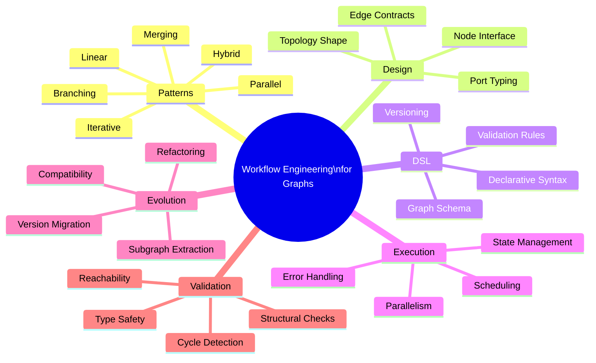
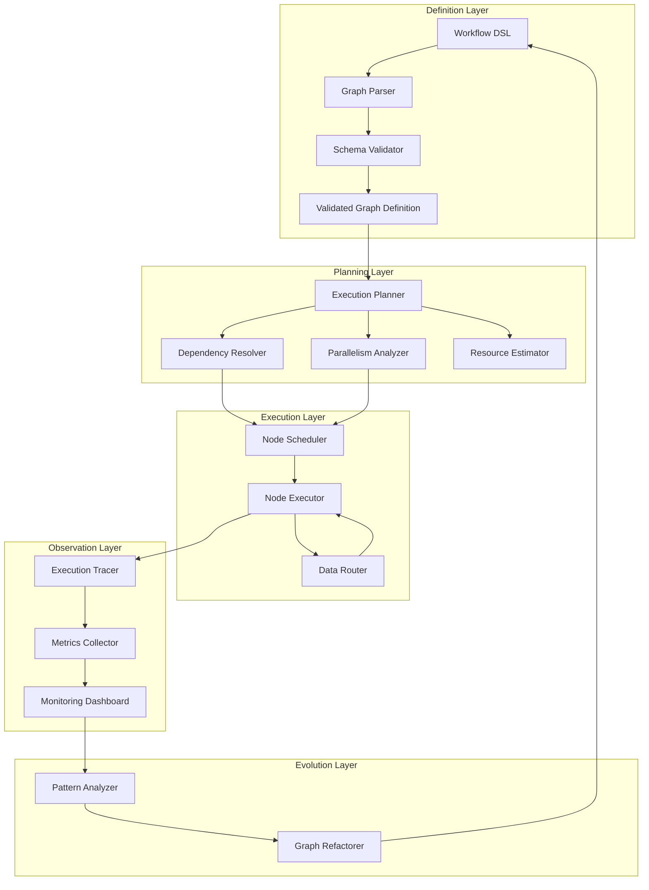
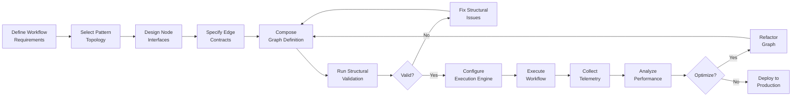
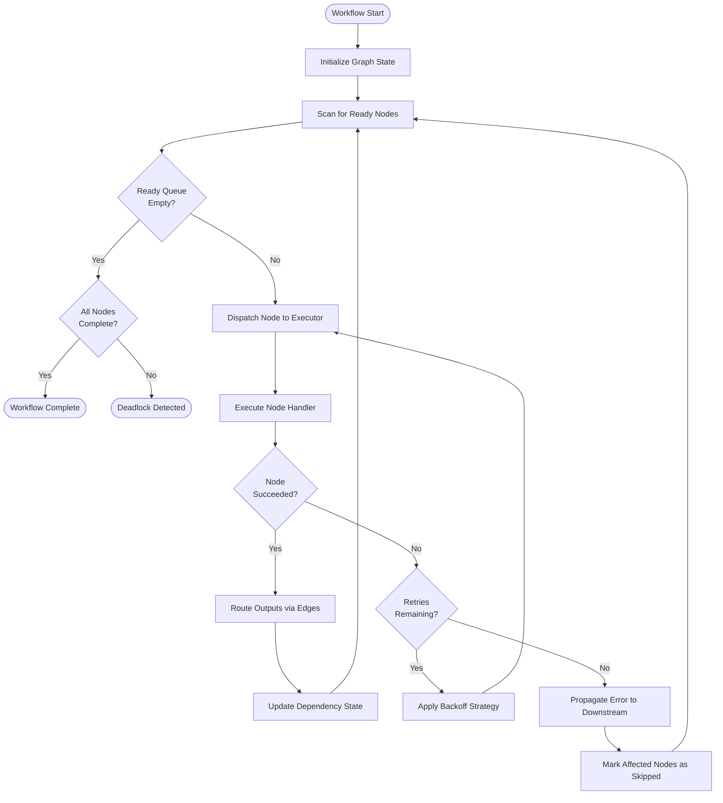
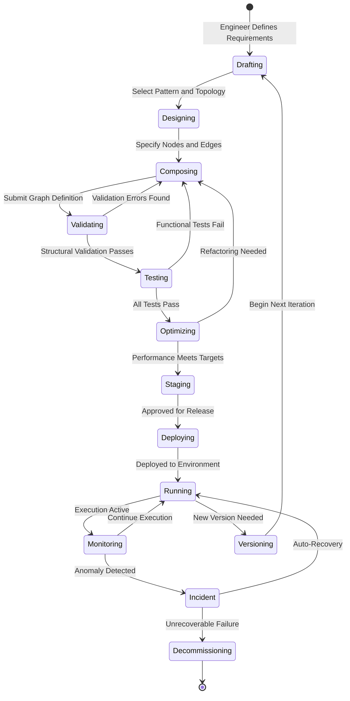
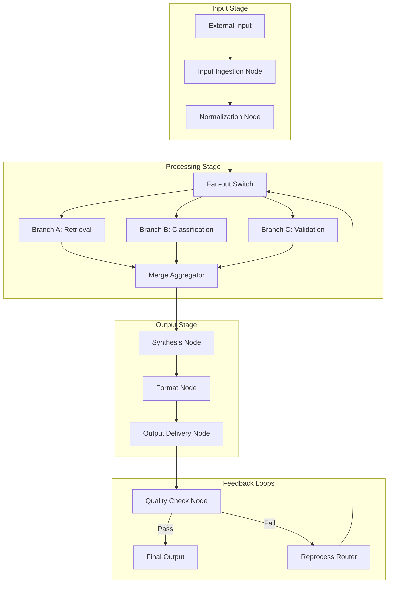
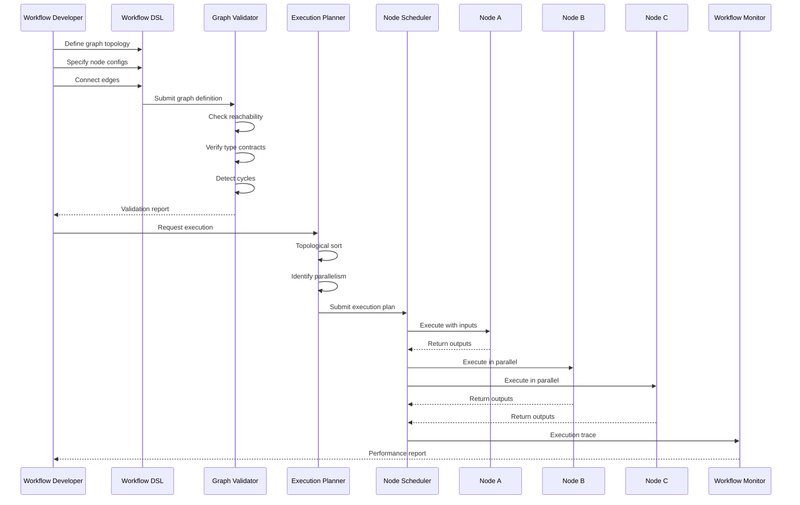

# Workflow Engineering for Graphs

## 📌 Overview

Workflow Engineering for Graphs is the discipline of designing, constructing, and maintaining executable workflows as graph-based structures rather than flat sequential scripts. In this paradigm, every step in a process becomes a node, every dependency or data handoff becomes an edge, and the overall workflow topology reveals the true shape of the work being performed. This approach moves beyond simple linear pipelines to embrace branching, merging, parallel execution, and iterative refinement as first-class citizens within the workflow model.

Graph-based workflow engineering enables practitioners to visualize, validate, and optimize complex processes that would be nearly impossible to reason about in traditional imperative code. When workflows are expressed as graphs, the structure itself becomes a form of documentation that stays synchronized with the actual execution logic. This is particularly powerful in AI systems where prompts, model calls, tool invocations, and decision points must be composed in flexible, reusable ways that adapt to varying inputs and conditions.

The field draws on principles from workflow management systems, directed acyclic graph (DAG) schedulers, and state machine design, but applies them specifically to the domain of AI engineering. By treating workflows as graphs, engineers gain the ability to compose small, well-tested subgraphs into larger workflows, apply graph algorithms for optimization and validation, and evolve workflows incrementally without breaking existing behavior.

## 🎯 Learning Objectives

By studying Workflow Engineering for Graphs, practitioners will develop the ability to decompose complex AI processes into graph-structured workflows with clear node responsibilities and edge-based data flow. You will learn to recognize when a workflow should follow a linear, branching, merging, parallel, or iterative pattern, and how to combine these patterns into hybrid structures that handle real-world complexity. This knowledge enables more robust, maintainable, and observable AI systems.

You will gain proficiency in designing workflow domain-specific languages (DSLs) that express graph topology declaratively, making workflows portable, versionable, and testable. Understanding workflow validation techniques will allow you to detect structural issues such as unreachable nodes, missing dependencies, and cycles before execution. You will also learn how to apply graph analysis algorithms to identify bottlenecks, critical paths, and optimization opportunities within your workflows.

Finally, you will master workflow evolution strategies that allow graph-based workflows to grow and adapt over time without accumulating technical debt. This includes techniques for versioning workflow graphs, performing safe refactoring of subgraphs, and managing backward compatibility as workflows mature. These skills are essential for building production-grade AI systems that must remain reliable as requirements change.

## 🧠 Definition

Workflow Engineering for Graphs is the systematic practice of modeling computational workflows as directed graph structures where nodes represent discrete processing steps and edges represent data dependencies, control flow, or communication channels between those steps. A workflow graph is not merely a visualization tool but an executable specification that a runtime engine can traverse, schedule, and monitor. Each node encapsulates a self-contained unit of work—such as an LLM call, a data transformation, a tool invocation, or a conditional check—while edges define the contracts for how information moves between nodes.

The "engineering" aspect emphasizes that these graph structures are designed with the same rigor applied to software architecture: they have defined interfaces, error handling strategies, scalability properties, and lifecycle management practices. A workflow graph is a living artifact that evolves through versioning, testing, and deployment cycles much like any other software component. The graph topology itself becomes a primary design variable, where the shape of the graph directly impacts the workflow's performance, reliability, and maintainability.

## ❓ Why It Matters

Traditional sequential workflows break down when AI systems need to make dynamic decisions, branch based on model outputs, invoke different tools depending on context, or iterate until a quality threshold is met. Graph-based workflows handle these complexities naturally because branching, merging, and looping are inherent properties of graph structures rather than special cases that must be bolted on. This makes graph-based workflow engineering essential for building AI systems that go beyond simple input-output pipelines.

Graph workflows also provide superior observability and debugging capabilities compared to flat code. When a workflow fails, the graph structure makes it immediately clear which node failed, what inputs it received, and what downstream nodes were affected. This structural transparency is invaluable in AI systems where failures can be subtle—such as a model producing slightly off-topic output that cascades through subsequent steps. The graph topology serves as a built-in trace that maps the execution path and makes root cause analysis dramatically faster.

Furthermore, graph-based workflows enable powerful reuse and composition patterns. Subgraphs representing common operations—such as a "retrieve-augment-generate" pattern—can be defined once and embedded in multiple parent workflows. This composability reduces duplication, enforces consistency, and allows teams to build libraries of workflow patterns that accelerate development. Without a graph-based approach, achieving this level of reuse requires significant boilerplate and is prone to inconsistency.

## 🏛️ Core Concepts

The foundational concept in workflow graph engineering is the workflow node, which represents an atomic unit of computation within the graph. Each node has a well-defined interface consisting of input ports, output ports, configuration parameters, and an execution handler. Nodes are designed to be stateless with respect to the workflow graph itself, relying on edge-carried data for their inputs and producing outputs that flow to downstream nodes. This statelessness enables parallel execution, retry logic, and deterministic testing of individual nodes in isolation.

Workflow edges carry data, control signals, or both between connected nodes. Data edges transport typed payloads from output ports to input ports, ensuring that each node receives the information it needs in the expected format. Control edges govern execution ordering, determining when a node becomes eligible to run based on the completion status of its predecessors. Edges may also carry metadata such as transformation functions that modify data in transit, conditional predicates that activate or deactivate paths, or aggregation strategies for merging multiple inputs.

Workflow topology refers to the overall shape and structure of the graph, which directly determines the execution semantics. A linear topology produces a simple pipeline, while a diamond topology enables fan-out and fan-in patterns for parallel processing. Loop topologies allow iterative refinement, and switch topologies support conditional routing. The topology is the primary vehicle through which engineers express the logic of their workflows, making it the most important design decision in workflow graph engineering.

## 🧩 Key Components

The key components of a graph-based workflow system include the workflow graph definition, which specifies the complete topology of nodes and edges in a declarative format. This definition serves as the source of truth for the workflow and can be stored as JSON, YAML, or a custom DSL. The graph definition includes node declarations with their types and configurations, edge declarations with their source and target ports, and any metadata needed for execution such as resource requirements or timeout settings.

The workflow execution engine is the runtime component that traverses the graph, schedules nodes for execution, and manages data flow between them. The engine interprets the graph definition and handles concerns like parallel execution, dependency resolution, error propagation, and state persistence. A good execution engine supports multiple execution strategies including eager evaluation, lazy evaluation, and demand-driven execution, allowing the same graph definition to be run in different modes depending on the use case.

Workflow validation tools analyze the graph structure before execution to catch errors early. These tools check for structural correctness—ensuring all edge endpoints reference valid ports, detecting cycles in DAG workflows, verifying that every node is reachable from a start node, and confirming that data types are compatible across edges. Advanced validators can also check semantic properties, such as whether the graph is likely to terminate, whether resource requirements are satisfiable, and whether the workflow conforms to organizational policies.

## 🧭 Mental Model

Think of a workflow graph as a city map where each node is a building with a specific function—a factory, a warehouse, a quality checkpoint, or a distribution center. The edges are the roads connecting these buildings, with lanes for different types of traffic. Raw materials enter the city through gateway nodes, travel along roads to processing facilities, pass through inspection stations, and eventually reach output terminals as finished products. The city planner (the workflow engineer) designs the layout to minimize travel time, prevent congestion, and ensure that every building receives what it needs.

Just as a city has zones for different activities—industrial, commercial, residential—a workflow graph has clusters of related nodes that form functional zones. A retrieval zone might contain nodes for query formulation, index search, and result ranking. A generation zone might contain nodes for prompt assembly, model invocation, and output formatting. The connections between zones are carefully designed bridges that control how work products flow from one area to another, with toll booths (conditional edges) that can redirect traffic based on real-time conditions.

## 🗺️ Mind Map

## 🏗️ Architecture Diagram

## 🔄 Workflow

## ⚙️ Internal Working

The internal working of a graph-based workflow engine begins with graph compilation, where the declarative workflow definition is parsed and transformed into an internal representation optimized for execution. During compilation, the engine resolves all node and edge references, validates type compatibility, detects structural issues, and builds auxiliary data structures such as adjacency lists for fast traversal and dependency maps for scheduling. This compilation step catches many errors before any computation begins, providing a fast feedback loop during development.

Once compiled, the execution planner analyzes the graph to determine the optimal execution strategy. For DAG workflows, the planner performs a topological sort to establish a valid execution order and identifies nodes that can run in parallel by analyzing their dependency relationships. For workflows with loops, the planner sets up iteration tracking structures and defines termination conditions. The planner also estimates resource requirements for each node and uses this information to allocate computational resources appropriately across the workflow.

During execution, the scheduler maintains a ready queue of nodes whose dependencies have been satisfied and dispatches them to available executors. As each node completes, the scheduler updates the dependency state, routes output data to downstream input ports, and adds newly eligible nodes to the ready queue. The data router handles the actual transfer of data between nodes, applying any transformations or aggregations defined on the edges. If a node fails, the error propagation mechanism determines which downstream nodes should be skipped, retried, or given alternative inputs based on the workflow's error handling configuration.

## 🔀 Execution Flow

## 📊 Lifecycle

## 📡 Data Flow

## 🤝 Interaction Flow

## 🌍 Real-World Analogy

Consider a modern restaurant kitchen during dinner service. The head chef designs the workflow for preparing each dish as a graph. The expeditor station is the entry node that receives orders and routes them to specialized prep stations—the grill, the sauté station, the pastry station—which operate as parallel branches. Each station receives specific ingredients (data inputs) from the pantry (a shared data node) and follows its own preparation sequence (a subgraph). The expeditor then merges the completed components from all stations, performs a final quality check, and plates the dish before it leaves the kitchen.

If a particular component fails quality inspection—a sauce breaks or a steak is overcooked—the affected branch can be retried independently without disrupting the other stations. The kitchen's workflow graph includes feedback loops where the expeditor can send items back for rework, conditional edges where vegetarian orders bypass the grill station entirely, and priority edges where VIP orders get preferential scheduling. The entire kitchen operates as a well-orchestrated graph where the topology ensures efficiency, quality, and adaptability to changing conditions.

## 💡 Practical Example

Imagine building a content analysis pipeline that processes research papers. The workflow graph begins with an ingestion node that receives a PDF and extracts raw text. This feeds into a fan-out switch that routes the text to three parallel branches: one branch runs a summarization model, another extracts key entities and relationships, and a third performs sentiment analysis on specific sections. Each branch consists of multiple nodes—the summarization branch includes a chunking node, a per-chunk summarization node, and a merge-and-refine node.

After all three branches complete, a merge aggregator node collects their outputs and passes them to a synthesis node that combines the summary, entities, and sentiment into a structured analysis report. A conditional edge then routes the report to a quality scoring node. If the score exceeds a threshold, the report flows to an output node that formats and delivers it. If the score is below threshold, a feedback edge routes back to the summarization branch with additional context about what was missing, triggering an iterative refinement cycle. The entire pipeline is defined as a graph with clear node responsibilities, typed edges, and well-defined termination conditions.

## 🧪 Use Cases

**Document Processing Pipelines:** Enterprise document workflows that ingest, classify, extract, validate, and route documents benefit enormously from graph-based engineering. Each processing stage is a node, classification decisions create branching points, and validation failures trigger rework loops. The graph structure makes it easy to add new document types by inserting new branches without modifying the core pipeline.

**Multi-Model Orchestration:** When an AI system needs to call multiple specialized models—such as a vision model for image understanding, a language model for text generation, and an embedding model for semantic search—graph workflows provide the coordination backbone. Each model call is a node, and the graph defines how their outputs combine, which calls can happen in parallel, and how failures in one model are handled.

**Data Quality Workflows:** ETL and data validation pipelines naturally express themselves as graphs. Source nodes connect to transformation nodes, which feed into validation nodes with conditional edges that route clean data forward and dirty data to quarantine or repair subgraphs. The graph topology makes data lineage explicit and enables targeted reprocessing of specific data subsets.

**Iterative Research Workflows:** Scientific and analytical workflows that require multiple rounds of hypothesis generation, testing, and refinement map perfectly to iterative graph patterns. The loop topology allows the workflow to accumulate knowledge across iterations while maintaining clear boundaries between each cycle of the research process.

## ⚖️ Comparison

| Aspect | Linear Pipelines | Graph-Based Workflows |
|--------|-----------------|----------------------|
| **Topology** | Strictly sequential | Arbitrary directed graph |
| **Branching** | Requires if/else in code | Native conditional edges |
| **Parallelism** | Manual thread management | Declarative parallel branches |
| **Reusability** | Copy-paste functions | Composable subgraphs |
| **Observability** | Log-based tracing | Structural execution maps |
| **Error Handling** | Try-catch blocks | Graph-level error propagation |
| **Evolution** | Refactor entire pipeline | Replace or add subgraphs |
| **Validation** | Runtime testing | Compile-time graph analysis |

Compared to imperative code-based workflows, graph-based approaches sacrifice some low-level control in exchange for dramatically better composability, observability, and maintainability. While simple two or three-step processes may not benefit from graph modeling, any workflow involving branching, parallelism, iteration, or multi-system coordination becomes significantly easier to design and maintain as a graph.

## ✅ Best Practices

Design workflows starting from the desired topology rather than from individual node implementations. Begin by sketching the graph structure—identifying entry points, processing stages, decision points, and exit points—before writing any node logic. This top-down approach ensures that the overall workflow structure is sound and that nodes have well-defined roles within the larger system. It also makes it easier to identify opportunities for parallelism and reuse early in the design process.

Keep nodes small and focused on a single responsibility, analogous to microservice design principles. A node that does too much becomes difficult to test, reuse, and debug. Instead, decompose complex operations into chains of simpler nodes connected by well-typed edges. This granularity also improves observability because each node's inputs, outputs, and execution time are tracked individually, making it easy to pinpoint performance bottlenecks and failures.

Version your workflow graphs alongside your code, treating graph definitions as first-class artifacts in your version control system. When evolving a workflow, prefer adding new nodes and edges over modifying existing ones, as this preserves backward compatibility and makes it possible to roll back changes. Use workflow validation as part of your CI/CD pipeline to catch structural regressions automatically, and maintain a library of tested subgraph patterns that can be composed into new workflows.

## ❌ Common Mistakes

The most frequent mistake is creating overly complex graph topologies when simpler structures would suffice. Engineers sometimes model every conditional as a separate branch and every transformation as a separate node, resulting in graphs with hundreds of nodes that are difficult to understand and maintain. Start with the simplest topology that correctly represents the workflow logic and only add complexity when there is a clear requirement. A linear chain of five nodes is preferable to a tangled graph of fifty.

Another common error is neglecting edge contracts, particularly around data types and transformation functions. When edges carry untyped or poorly specified data, downstream nodes receive unexpected inputs, leading to runtime errors that are difficult to trace back to their source. Every edge should have a clear contract specifying what data it carries, any transformations applied in transit, and what happens when the data is missing or malformed. Treat edge contracts with the same rigor as API contracts.

Failing to handle graph-level errors properly is also a widespread issue. Simply wrapping each node in a try-catch block is insufficient for graph workflows because errors need to propagate through the graph structure, potentially triggering alternative paths or marking downstream nodes as skipped. Design error handling at the graph level, specifying how each node type participates in error propagation and what recovery strategies are available for different failure modes.

## 🚀 Advanced Topics

**Self-Modifying Workflows:** Advanced workflow graph systems can modify their own topology during execution based on observed conditions. A workflow might dynamically add nodes to handle unexpected input types, prune unnecessary branches based on early results, or rewire edges to optimize for the current execution context. This requires a sophisticated execution engine that can handle graph mutations safely and a careful design approach that ensures modified graphs remain valid and terminate correctly.

**Probabilistic Workflow Routing:** Rather than using hard-coded conditional edges, advanced systems can route work through the graph based on probabilistic models that predict the best path for a given input. A classification node might output probability distributions over multiple downstream branches, and the router could use techniques like Thompson sampling or multi-armed bandit strategies to balance exploration and exploitation. This approach is particularly powerful in A/B testing scenarios and adaptive processing pipelines.

**Cross-Organization Workflow Composition:** In large systems, workflows from different teams or organizations need to be composed into end-to-end processes. This requires standardized graph interchange formats, well-defined subgraph interfaces, and governance frameworks that ensure compatibility without requiring centralized control. Technologies like workflow graph registries, interface compatibility checkers, and federated execution engines enable this level of composition while maintaining organizational autonomy and data sovereignty.

**Workflow Graph Optimization with ML:** Machine learning can be applied to optimize workflow graph structures by analyzing historical execution data to identify bottlenecks, predict optimal parallelism levels, and suggest topology improvements. Reinforcement learning agents can explore different graph configurations and learn which structures produce the best outcomes for given input distributions, effectively automating the workflow design process itself.
