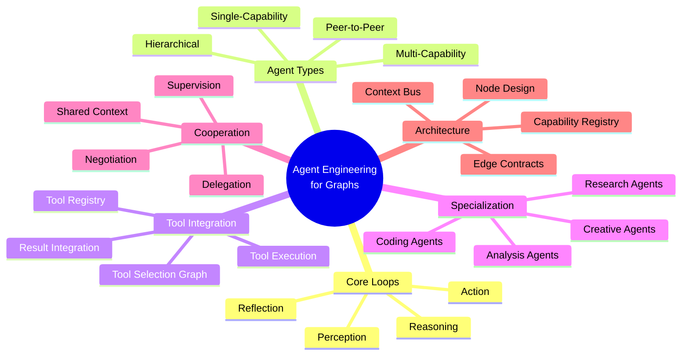
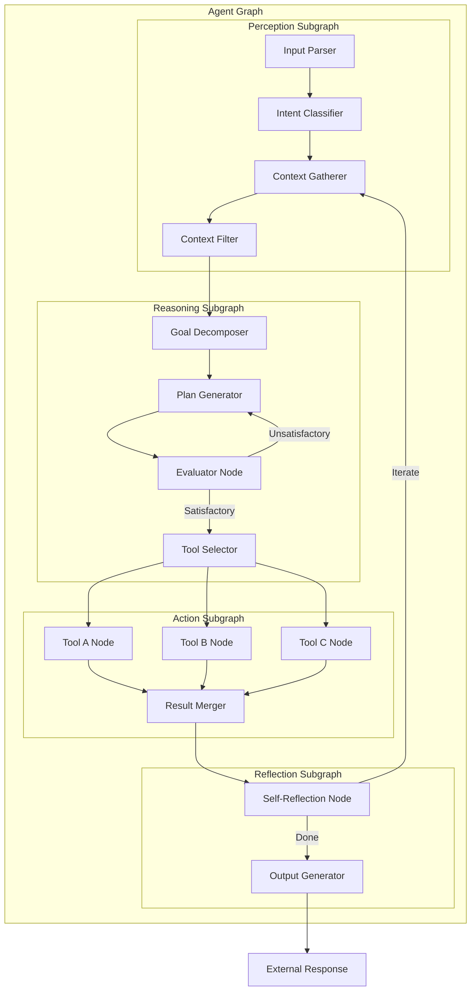
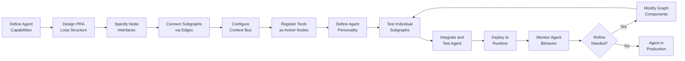
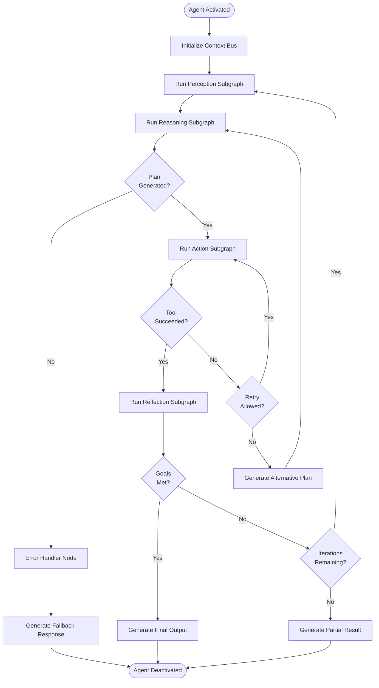
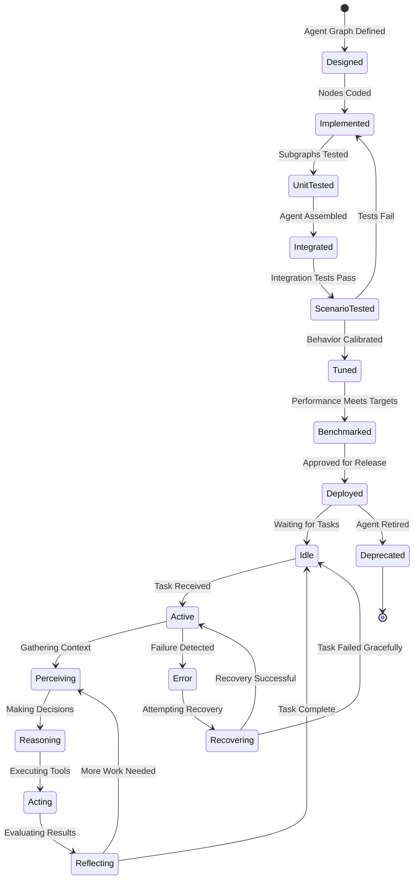
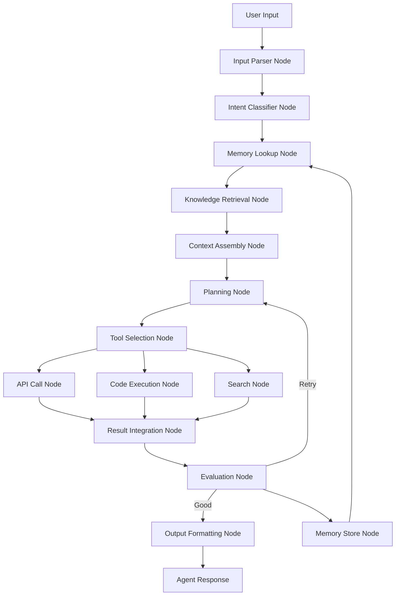
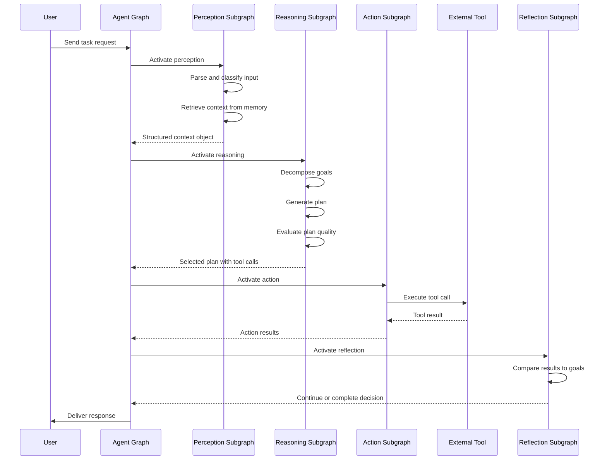

# Agent Engineering for Graphs

## 📌 Overview

Agent Engineering for Graphs is the practice of designing AI agents as interconnected graph-based systems where the agent's capabilities, knowledge, reasoning processes, and actions are all modeled as nodes and edges within a structured graph topology. Rather than treating an agent as a monolithic prompt-and-response system, this approach decomposes the agent into functional subgraphs—each responsible for a distinct capability such as perception, reasoning, tool selection, action execution, and self-reflection. These subgraphs connect through well-defined edges that carry context, decisions, and data between components.

This paradigm recognizes that sophisticated AI agents are fundamentally graph-shaped: they receive inputs through multiple perception channels, reason through chains of thought that branch and merge, select from a repertoire of tools through conditional routing, and take actions that may trigger new perception-reasoning cycles. By making this graph structure explicit, engineers gain precise control over agent behavior, the ability to debug individual components in isolation, and a framework for composing multiple specialized agents into cooperative systems.

Graph-based agent engineering also enables a new level of agent specialization and cooperation. Just as a team of human specialists each contribute their expertise to a shared project, graph-based agents can be designed with focused capabilities that interconnect through shared graph structures. A research agent, a writing agent, and a code-review agent can each be a subgraph that connects to a coordination layer, sharing context and results through the graph's edges without requiring a centralized orchestrator that understands every agent's internals.

## 🎯 Learning Objectives

By studying Agent Engineering for Graphs, you will learn to decompose AI agent capabilities into graph-structured components with clear boundaries and interfaces. You will understand how to model the perception-reasoning-action loop as a repeating subgraph pattern that forms the core of any autonomous agent. This decomposition enables you to design agents that are more modular, testable, and evolvable than monolithic alternatives, while maintaining the coherent behavior that users expect from an intelligent assistant.

You will develop the ability to design multi-capability agents that combine retrieval, generation, code execution, and external tool use into a unified graph structure. This includes understanding how to represent an agent's available tools as a tool graph, how to model tool selection as a graph traversal problem, and how to handle tool execution results as inputs to subsequent reasoning steps. These skills are essential for building agents that can operate effectively in real-world environments where no single model capability is sufficient.

Finally, you will master the design of agent cooperation patterns using shared graph structures, including hierarchical agent teams, peer-to-peer agent networks, and supervisory agent architectures. You will learn how to manage context flow between agents, resolve conflicts in multi-agent decisions, and design graceful degradation when individual agent components fail. These patterns are critical for building production AI systems that must be reliable, scalable, and maintainable.

## 🧠 Definition

Agent Engineering for Graphs is the systematic design and implementation of AI agents as directed graph systems where nodes represent discrete agent capabilities or processing steps, and edges represent the flow of context, decisions, and data between those capabilities. An agent graph is not a visualization of how an agent works—it is the agent's actual execution structure, defining the precise sequence and conditions under which the agent perceives its environment, reasons about what to do, selects and invokes tools, takes actions, and reflects on the results.

The agent graph typically centers around one or more perception-reasoning-action (PRA) loops, each forming a subgraph that can be instantiated, configured, and composed. The perception subgraph handles input processing and context gathering, including retrieval from memory and external knowledge sources. The reasoning subgraph performs decision-making, planning, and tool selection through chains of model calls and conditional routing. The action subgraph executes the chosen actions—whether generating text, calling APIs, modifying files, or delegating to other agents—and feeds results back into the perception subgraph for the next iteration.

## ❓ Why It Matters

Monolithic agent designs—where a single prompt must handle perception, reasoning, tool selection, action formatting, and self-correction—quickly become unmanageable as agent capabilities grow. The prompt becomes a massive, fragile template where changing one section can break interactions with others. Graph-based agent engineering solves this by separating concerns into distinct graph nodes, each with its own prompt, logic, and interface. This modularity means you can upgrade the reasoning component without affecting perception, add new tools without rewriting the planning logic, or swap the underlying model for a specific subgraph without touching the rest of the agent.

Graph-based agents also provide dramatically better debugging and observability compared to monolithic approaches. When a graph-based agent produces a poor result, the execution trace shows exactly which perception node misinterpreted the input, which reasoning node made a faulty decision, or which tool node returned unexpected output. This granular visibility is impossible with a single prompt-response cycle, where you can only see the final output and must guess what went wrong internally. For production AI systems where reliability matters, this observability is not a luxury but a necessity.

Furthermore, graph-based design enables agent capabilities that are simply not feasible with monolithic approaches. Dynamic tool discovery, where the agent can learn about new tools during execution and integrate them into its graph, requires a graph structure that can be modified at runtime. Multi-agent cooperation, where specialized agents share a common context graph, requires interfaces between agent subgraphs. Adaptive reasoning, where the agent adjusts its reasoning depth based on problem complexity, requires conditional graph traversal. These capabilities emerge naturally from graph-based design but are extremely difficult to implement in monolithic agent architectures.

## 🏛️ Core Concepts

The perception subgraph is the agent's interface with the external world, responsible for receiving inputs, parsing them into structured representations, and gathering relevant context. In a graph-based agent, perception is not a single step but a subgraph that may include input parsing nodes, intent classification nodes, context retrieval nodes, and relevance filtering nodes. The perception subgraph produces a structured context object that flows into the reasoning subgraph, ensuring that the agent's decisions are based on a comprehensive and well-organized understanding of the current situation.

The reasoning subgraph is where the agent decides what to do, forming the cognitive core of the agent system. This subgraph typically includes nodes for goal decomposition, plan generation, tool selection, and self-evaluation. The reasoning subgraph may itself contain internal loops—for example, a plan-generate-evaluate-revise cycle that iterates until the agent is satisfied with its plan. The graph structure makes these reasoning loops explicit and controllable, allowing engineers to set iteration limits, inject evaluation criteria, and adjust reasoning depth based on the complexity of the task.

The action subgraph translates the agent's decisions into concrete operations, executing tool calls, generating outputs, or delegating to other agents. Each available tool or capability is represented as a node in the action subgraph, with conditional edges from the reasoning subgraph's tool-selection output determining which action nodes are activated. The action subgraph also includes error handling, result validation, and fallback logic that ensures the agent responds gracefully when actions fail or produce unexpected results.

## 🧩 Key Components

The agent graph definition specifies the complete topology of an agent's capabilities, including all perception, reasoning, and action nodes and the edges connecting them. This definition serves as the agent's architectural blueprint and can be versioned, tested, and deployed independently of the node implementations. A well-designed agent graph definition separates the topology (what capabilities exist and how they connect) from the implementation (how each capability actually works), allowing the same agent structure to be realized with different models, tools, or configurations.

The capability registry is a catalog of available nodes that can be composed into agent graphs. Each entry in the registry specifies a capability's interface (input and output schemas), its requirements (which models, tools, or data sources it needs), and its metadata (description, version, performance characteristics). The registry enables plug-and-play composition of agent capabilities, allowing engineers to assemble custom agents from a library of pre-built components. It also supports capability discovery, where agents can query the registry at runtime to find capabilities that match their current needs.

The context bus is the communication infrastructure that carries data between agent graph nodes. Unlike simple point-to-point edges, the context bus maintains a shared context object that accumulates information as the agent progresses through its perception-reasoning-action cycles. Each node can read from and write to specific sections of the context, and the bus ensures that data dependencies are respected during execution. This shared context model enables nodes to access the full history of the agent's current task without requiring explicit data passing between every pair of nodes.

## 🧭 Mental Model

Think of a graph-based AI agent as a specialized organization within a company. The perception subgraph is like the research and intelligence department—it gathers information from the environment, analyzes incoming requests, and produces briefings for decision-makers. The reasoning subgraph is like the strategy team—it reviews the briefings, develops plans, evaluates options, and selects the best course of action. The action subgraph is like the operations team—it executes the chosen plan, monitors results, and reports back to the research department for the next cycle.

Just as a well-organized company has clear reporting lines, delegated authority, and specialized roles, a well-designed agent graph has clear edges defining how information flows, well-scoped nodes with specific responsibilities, and specialized subgraphs for different types of tasks. The company can grow by adding new departments (capabilities), reorganizing reporting lines (refactoring edges), or creating project teams that span multiple departments (multi-agent cooperation)—all without disrupting the core organizational structure.

## 🗺️ Mind Map

## 🏗️ Architecture Diagram

## 🔄 Workflow

## ⚙️ Internal Working

The internal working of a graph-based agent begins with initialization, where the agent graph is compiled and the context bus is instantiated with the initial task description. During initialization, the agent loads its capability nodes, validates edge connections, and prepares the perception subgraph to receive input. The capability registry is consulted to ensure all required tools and models are available, and any dynamic capabilities—such as plugins or external services—are registered. This initialization phase is critical for catching configuration errors before the agent begins processing.

Once initialized, the agent enters its main perception-reasoning-action loop. The perception subgraph activates first, parsing the input and gathering relevant context from memory, retrieval systems, and the current conversation history. The context bus accumulates this information and makes it available to the reasoning subgraph. The reasoning subgraph then analyzes the context, decomposes the task into goals, generates plans, evaluates those plans against criteria, and selects tools for execution. Each reasoning step is a node in the graph, and the edges between them carry intermediate reasoning products.

The action subgraph executes the tools selected by the reasoning subgraph, handling each tool call as a separate node execution. Tool results flow back through the result merger node, which combines multiple tool outputs into a coherent result set. The reflection subgraph then evaluates whether the agent's goals have been achieved. If not, it updates the context bus with new information and routes back to the perception subgraph for another cycle. If the goals are met, the output generator produces the final response and the agent's execution completes.

## 🔀 Execution Flow

## 📊 Lifecycle

## 📡 Data Flow

## 🤝 Interaction Flow

## 🌍 Real-World Analogy

Consider a senior consultant at a management firm. When a client presents a problem, the consultant doesn't simply respond off the cuff. Instead, they follow a structured cognitive process that maps perfectly to a graph-based agent. First, they listen carefully and take notes (perception)—capturing not just the explicit request but the underlying context, constraints, and unstated needs. Then they step back and analyze the problem (reasoning)—breaking it down into components, considering multiple approaches, evaluating trade-offs, and selecting the best strategy.

Next, the consultant may call on specialists (tools)—pulling in a financial analyst to model scenarios, a technical expert to assess feasibility, or a legal advisor to check compliance. Each specialist returns their analysis, which the consultant integrates into a coherent recommendation (action and integration). Finally, the consultant reviews the recommendation against the client's original goals (reflection)—checking for completeness, accuracy, and feasibility before presenting it. If something doesn't add up, the consultant goes back to the analysis phase with additional questions. This consultant is a graph-based agent, with each cognitive step as a node and the flow of information following the edges of a well-defined graph.

## 💡 Practical Example

Imagine building a software development agent that helps engineers write, review, and debug code. The agent graph begins with a perception subgraph that receives a code change request, parses the existing codebase context, and retrieves relevant documentation and similar code patterns. The intent classifier node determines whether the request is for new code, a bug fix, a refactoring, or a review.

For a bug fix request, the reasoning subgraph activates a debugging plan generator that creates a step-by-step investigation plan. The evaluator node assesses whether the plan is likely to identify the root cause. The tool selector then chooses from action nodes including a log analyzer, a breakpoint setter, a test runner, and a code search tool. As each tool returns results, the reflection node evaluates whether the bug has been identified and fixed. If the fix introduces new issues, detected by a regression testing node, the agent routes back to the reasoning subgraph with the new information. The entire process is traceable through the graph, with each decision and tool call recorded as a node execution with inputs, outputs, and timing information.

## 🧪 Use Cases

**Research Assistant Agents:** A research agent designed to help academics find, synthesize, and cite sources uses a perception subgraph that parses research queries, a reasoning subgraph that plans search strategies and evaluates source relevance, and an action subgraph with nodes for database search, paper download, summarization, and citation formatting. The graph structure allows the agent to iteratively refine its search based on what it finds, branch into parallel literature searches across multiple databases, and merge results into a comprehensive literature review.

**Customer Support Agents:** Customer support agents benefit from graph-based design because different customer issues require different resolution paths. A billing question activates a billing subgraph with nodes for account lookup, charge analysis, and refund processing. A technical issue activates a troubleshooting subgraph with diagnostic nodes, solution lookup nodes, and escalation nodes. The perception subgraph classifies the incoming issue and routes it to the appropriate resolution subgraph, while a shared reflection node ensures consistent quality across all resolution paths.

**Creative Writing Agents:** A creative writing agent uses a planning subgraph to develop story outlines, character arcs, and narrative structures before generating prose. The action subgraph includes nodes for world-building, dialogue generation, scene description, and style transfer. A reflection subgraph evaluates coherence, tone consistency, and engagement, routing back to specific subgraphs for revision. The graph structure allows the agent to work on different story elements in parallel and maintain consistency across long-form content.

**DevOps Agents:** Operations agents that monitor, diagnose, and resolve infrastructure issues use perception nodes for log ingestion and metric analysis, reasoning nodes for root cause hypothesis generation, and action nodes for remediation commands. The graph structure supports escalation patterns where the agent tries increasingly aggressive interventions—from restarting a service to scaling resources to rolling back deployments—based on the results of previous actions.

## ⚖️ Comparison

| Aspect | Monolithic Agent | Graph-Based Agent |
|--------|-----------------|-------------------|
| **Structure** | Single prompt template | Modular node graph |
| **Capabilities** | All in one prompt | Separate subgraphs |
| **Debugging** | Black box reasoning | Per-node tracing |
| **Tool Use** | Inline in prompt | Dedicated action nodes |
| **Evolution** | Rewrite prompt | Add/modify nodes |
| **Testing** | End-to-end only | Subgraph unit tests |
| **Specialization** | Prompt sections | Specialized subgraphs |
| **Multi-Agent** | Ad hoc composition | Graph-level composition |

Graph-based agents trade some simplicity in initial setup for dramatically superior maintainability, debuggability, and extensibility. For simple chatbots with limited capabilities, a monolithic approach may be sufficient. However, any agent that needs to handle diverse tasks, use multiple tools, operate reliably in production, or cooperate with other agents will benefit significantly from graph-based engineering.

## ✅ Best Practices

Design each agent subgraph as an independent, testable unit with clearly defined inputs and outputs. The perception subgraph should produce a standardized context object that any reasoning subgraph can consume. The reasoning subgraph should produce a standardized plan object that any action subgraph can execute. This interface standardization enables you to mix and match subgraphs—for example, using the same perception and action subgraphs with different reasoning strategies—without modifying the connecting edges.

Implement the context bus as a structured, typed object rather than an untyped dictionary. Each section of the context should have a defined schema, making it impossible for nodes to read or write malformed data. This type safety catches integration errors during development rather than at runtime. Document the context schema alongside the agent graph definition, and use automated validation to ensure that all nodes comply with the schema.

Design your agent graph with explicit iteration limits and resource budgets on all loops. The perception-reasoning-action loop should have a maximum iteration count, the planning subgraph should have a maximum plan revision count, and the reflection subgraph should have a maximum reflection depth. These limits prevent the agent from entering infinite loops or consuming excessive resources on difficult tasks. Make the limits configurable so they can be adjusted based on the deployment environment and the criticality of the task.

## ❌ Common Mistakes

The most common mistake in agent graph engineering is creating overly deep reasoning chains without adequate evaluation checkpoints. An agent that reasons through ten sequential steps before checking whether it's on the right track will waste resources and produce poor results when it goes astray early in the chain. Instead, insert evaluation nodes at regular intervals throughout the reasoning subgraph, allowing the agent to course-correct before compounding errors. The graph structure makes this easy—just add evaluation nodes and conditional edges—so there is no excuse for deep, unmonitored reasoning chains.

Another frequent error is treating the context bus as an unbounded accumulation buffer. As the agent iterates through its PRA loops, the context grows with each cycle, and without careful management, it can exceed model context windows, slow down reasoning, or dilute relevant information with noise. Design the context bus with explicit size limits, prioritization mechanisms, and summarization nodes that compress historical context while preserving the most relevant information. Treat context management as a first-class engineering concern, not an afterthought.

Failing to design for graceful degradation is also a common pitfall. When a tool node fails, when a model returns garbled output, or when a retrieval node finds no relevant results, the agent should not simply crash or produce a generic error. Instead, design fallback paths in the graph—alternative tool nodes, simplified reasoning paths, or graceful output nodes that acknowledge limitations. The graph structure makes it straightforward to define these fallbacks as alternative edges, so build them into the initial design rather than adding them reactively after failures occur.

## 🚀 Advanced Topics

**Meta-Agent Architectures:** A meta-agent is an agent whose graph includes nodes that can design, modify, or optimize other agent graphs. This creates a recursive capability where the meta-agent can analyze the performance of a target agent, identify weaknesses in its graph structure, and propose modifications—such as adding new perception nodes, rerouting edges, or adjusting reasoning parameters. Meta-agents enable self-improving agent systems that evolve their own architectures based on experience, pushing toward truly adaptive AI systems.

**Agent Graph Memory Systems:** Advanced agent graphs incorporate sophisticated memory systems that go beyond simple conversation history. Episodic memory nodes store and retrieve specific past interactions, semantic memory nodes maintain generalized knowledge extracted from experience, and procedural memory nodes store optimized action sequences for recurring situations. These memory systems are themselves subgraphs with their own indexing, retrieval, and consolidation logic, creating a multi-layered memory architecture that enables agents to learn and improve over time.

**Federated Agent Networks:** In large-scale deployments, agent graphs from different organizations or systems need to cooperate while maintaining data sovereignty and security boundaries. Federated agent networks define standardized graph interfaces that allow agents to share task context, delegate subtasks, and return results without exposing their internal graph structures or proprietary data. This enables cooperative AI ecosystems where specialized agents from different providers can collaborate on complex tasks while each organization retains control over its own agent capabilities and data.

**Emotional and Social Intelligence in Agent Graphs:** Emerging research explores adding emotional and social reasoning nodes to agent graphs, enabling agents to detect user frustration, adjust their communication style, and manage interpersonal dynamics in multi-agent scenarios. These nodes use sentiment analysis, behavioral pattern recognition, and social context modeling to add a layer of emotional intelligence to the agent's decision-making process. This represents a frontier in agent engineering where the graph structure provides the flexibility needed to integrate multiple forms of intelligence into a coherent agent personality.