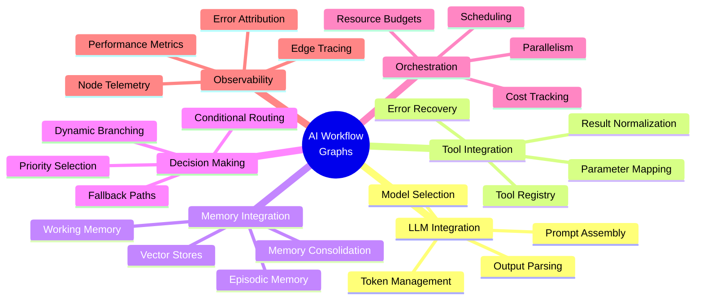
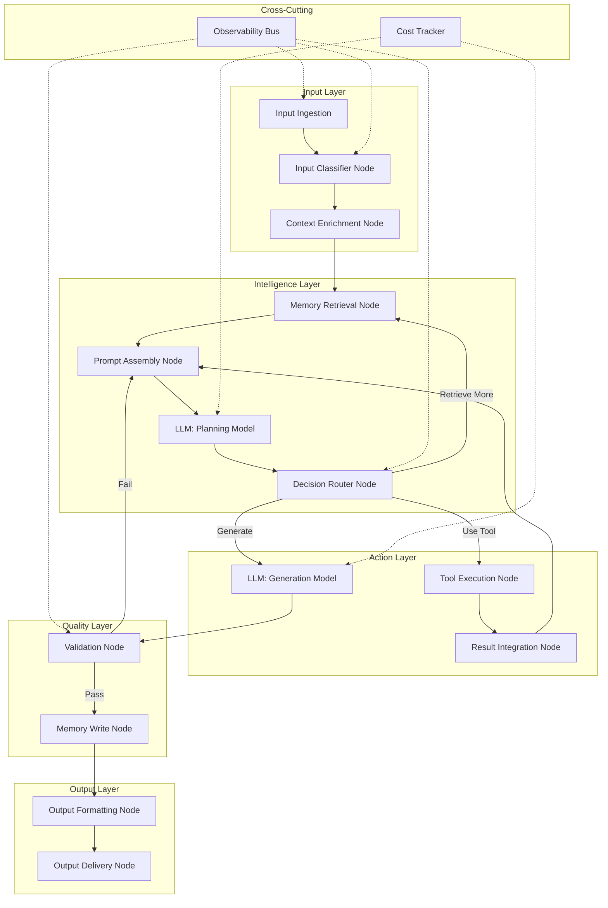
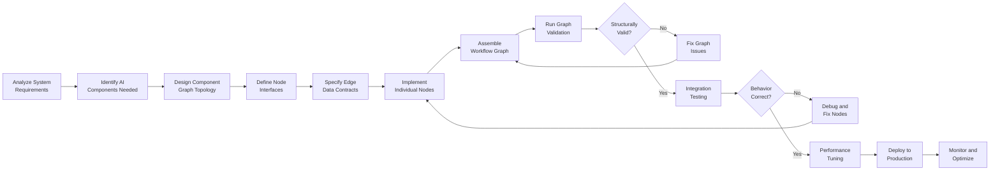
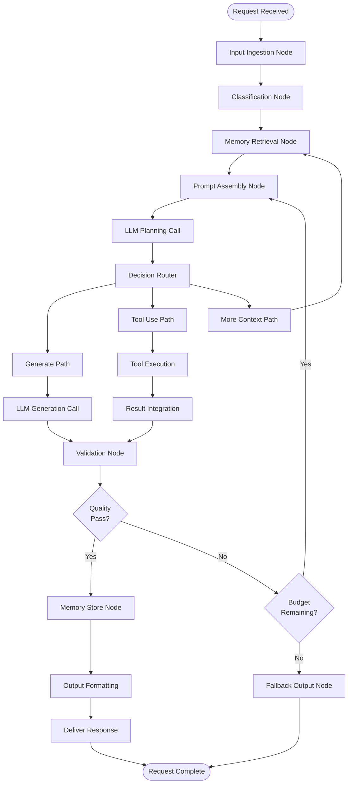
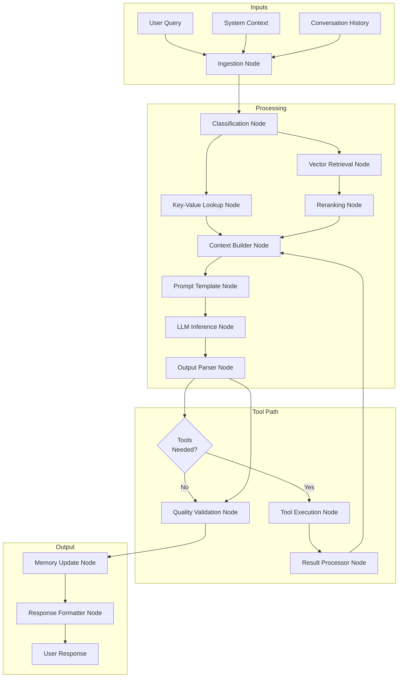
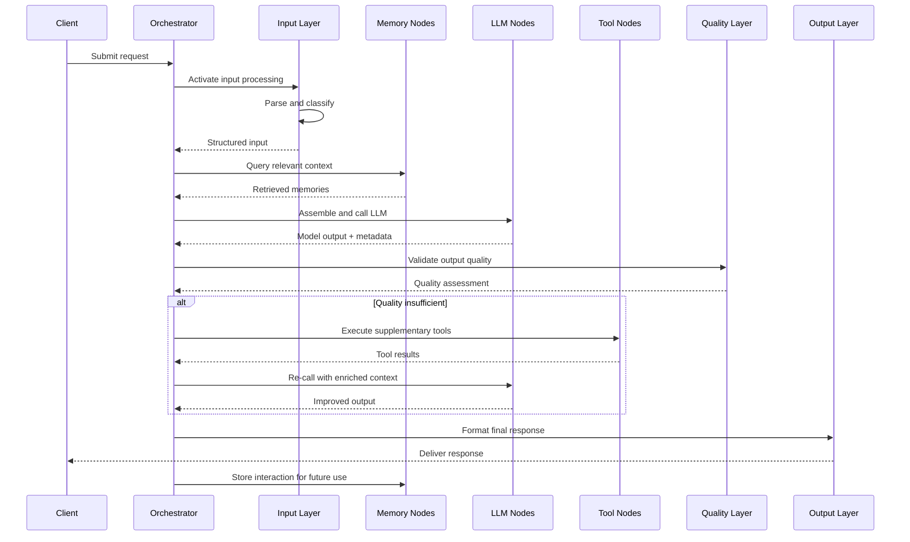

# AI Workflow Graphs

## 📌 Overview

AI Workflow Graphs represent the complete integration of large language model calls, tool usage, memory systems, and decision-making logic into unified, end-to-end graph structures. Unlike workflow graphs that focus primarily on process topology, or agent graphs that center on autonomous behavior, AI Workflow Graphs bring together every component of an AI system—prompts, models, tools, memory, validation, and output—into a single coherent graph that can be designed, executed, monitored, and evolved as one integrated system.

This holistic approach acknowledges that real AI systems are not just chains of model calls or simple tool-using agents, but complex assemblies where LLM outputs inform tool selections, tool results update memory, memory contents shape subsequent prompts, and validation checkpoints determine whether the workflow branches, loops, or terminates. The graph structure makes these interdependencies explicit and manageable, providing a single source of truth for how all AI components interact within the system.

AI Workflow Graphs serve as the capstone of graph engineering for AI systems, combining insights from prompt graphs, context graphs, memory graphs, tool graphs, workflow graphs, and agent graphs into a unified framework. They are the operational blueprint for production AI systems—from simple RAG pipelines to complex multi-agent research systems—expressed in a form that machines can execute, engineers can understand, and operators can monitor. This integration is what transforms individual AI components into reliable, scalable, production-ready systems.

## 🎯 Learning Objectives

By studying AI Workflow Graphs, you will develop the ability to design complete AI systems as integrated graph structures that unify all system components. You will learn how to represent LLM calls, tool invocations, memory operations, and conditional logic as interconnected nodes within a single graph, and how to define the data flow contracts between them. This comprehensive perspective enables you to build AI systems that are architecturally sound, operationally reliable, and functionally complete.

You will master the patterns for integrating heterogeneous AI components—combining retrieval-augmented generation with agentic tool use, chaining multiple model calls with different system prompts, and connecting real-time data sources with persistent memory stores. You will understand how to design the edges between these components to handle data transformation, error recovery, and context management, ensuring that information flows correctly through the entire system regardless of the execution path taken.

Finally, you will learn the operational practices for running AI Workflow Graphs in production, including execution monitoring, performance optimization, cost management, and graceful degradation. You will understand how to instrument graph nodes for observability, how to set resource budgets that prevent runaway costs, and how to design fallback paths that maintain system functionality even when individual components fail. These operational skills are what separate prototype AI systems from production-grade solutions.

## 🧠 Definition

An AI Workflow Graph is a directed graph that serves as the complete executable specification of an AI system, where nodes represent every processing step in the system—including LLM invocations, tool calls, memory reads and writes, data transformations, conditional checks, and output formatting—and edges represent the flow of data, context, and control between these steps. An AI Workflow Graph is not a partial view of one aspect of the system but the full specification, from initial input ingestion through final output delivery, including all branching, looping, error handling, and resource management.

Each node in an AI Workflow Graph has a typed interface specifying its inputs, outputs, configuration, and resource requirements. LLM call nodes specify the model, system prompt, temperature, and token budget. Tool nodes specify the tool interface, required parameters, and timeout. Memory nodes specify the memory store, retrieval strategy, and update policy. This per-node specification enables the execution engine to allocate resources appropriately, enforce constraints, and provide detailed execution telemetry for every step of the workflow.

The edges in an AI Workflow Graph carry not just data but also the semantic contracts between components. An edge from a retrieval node to a prompt assembly node carries retrieved documents along with relevance scores and metadata. An edge from a model call to a validation node carries the model output along with confidence indicators and token usage. An edge from a decision node to a branch node carries the decision result along with the reasoning trace that led to it. These rich edge contracts enable downstream nodes to make informed decisions about how to process their inputs.

## ❓ Why It Matters

Individual AI components—prompts, models, tools, memory stores—each have their own design patterns and best practices, but the interactions between these components are where most production failures occur. A perfectly designed prompt can produce poor results when it receives badly formatted context from a retrieval node. A powerful tool can produce misleading results when the agent selects it based on incomplete reasoning. A well-structured memory store can slow the entire system to a crawl when accessed too frequently or with the wrong query strategy. AI Workflow Graphs make these interactions visible, testable, and optimizable as first-class design concerns.

Without a unified graph representation, AI systems tend to accumulate ad hoc integrations—custom glue code connecting prompts to tools, hardcoded data transformations between model calls, and implicit assumptions about data formats that break when components change. This integration debt grows with each new capability added, eventually making the system fragile and difficult to modify. AI Workflow Graphs eliminate this debt by making every integration explicit in the graph structure, where it can be validated, tested, and refactored using graph-level tools.

AI Workflow Graphs also provide the foundation for AI system governance and compliance. In regulated environments, organizations need to demonstrate how their AI systems make decisions, what data they access, and how they handle errors. A well-documented AI Workflow Graph serves as a living specification that can be audited, reviewed, and certified. The graph structure makes it straightforward to trace any output back through the exact sequence of decisions, data accesses, and model calls that produced it—providing the transparency that regulators, customers, and internal stakeholders require.

## 🏛️ Core Concepts

The LLM call node is the most fundamental building block of an AI Workflow Graph, representing a single invocation of a language model with specific inputs, parameters, and expected outputs. Each LLM node encapsulates not just the model API call but also the prompt construction logic, the output parsing logic, and the error handling strategy. An AI Workflow Graph typically contains multiple LLM nodes with different roles—a classification node that categorizes inputs, a planning node that generates strategies, a generation node that produces content, and an evaluation node that assesses quality. The graph structure allows each LLM node to be optimized independently with the right model, prompt, and parameters for its specific role.

The tool integration subgraph represents the system's interface with external capabilities, including APIs, code execution environments, database queries, and specialized AI services. Tool nodes in the workflow graph define their interface through typed input and output schemas, and the graph's edges carry tool selection decisions from reasoning nodes to the appropriate tool nodes. The tool subgraph also includes pre-processing nodes that prepare inputs for tool APIs and post-processing nodes that normalize tool outputs into the format expected by downstream nodes. This encapsulation allows tools to be swapped, added, or removed by modifying the graph topology without affecting other parts of the system.

The memory integration subgraph manages the system's persistent and ephemeral state across workflow executions. Memory read nodes retrieve relevant context from vector stores, key-value caches, or graph databases, while memory write nodes update these stores with new information discovered during execution. The memory subgraph includes indexing nodes that determine how new information is stored, retrieval nodes that search for relevant past information, and consolidation nodes that merge, deduplicate, or summarize accumulated memory. The edges connecting memory nodes to the rest of the workflow ensure that every LLM call and tool invocation can benefit from the system's accumulated knowledge.

## 🧩 Key Components

The workflow graph orchestrator is the central execution engine that manages the traversal, scheduling, and monitoring of the complete AI workflow. It interprets the graph definition, resolves dependencies between nodes, manages parallel execution where the topology allows, and enforces resource constraints across the entire workflow. The orchestrator also handles workflow-level concerns such as global timeout management, cost tracking across all LLM nodes, and coordinated error recovery that considers the dependencies between failed nodes and their downstream consumers.

The context management system is the shared infrastructure that maintains the evolving state of the workflow as it executes. Unlike simple point-to-point data passing, the context management system provides a structured, versioned context that all nodes can access. It handles context window management for LLM nodes, automatically summarizing or pruning context when it approaches model limits. It also provides context isolation between parallel branches, ensuring that parallel tool calls or model invocations do not interfere with each other while still allowing their results to be merged correctly.

The decision routing engine implements the conditional logic that determines which paths the workflow takes based on intermediate results. This includes simple binary routing (pass/fail validation), multi-way routing (classify input into one of N categories), and dynamic routing (select path based on model confidence scores). The decision routing engine evaluates conditions defined on the graph's conditional edges and activates the appropriate downstream nodes, handling complex routing scenarios such as fan-out with selective activation, conditional merges, and priority-based path selection.

## 🧭 Mental Model

Imagine a modern automated factory where raw materials are transformed into finished products through a carefully designed production line. The factory has receiving docks where raw materials arrive (input nodes), quality inspection stations that sort and route materials (classification nodes), specialized workshops where different transformations occur (LLM call nodes and tool nodes), warehouse sections that store parts and finished goods (memory nodes), and shipping docks that deliver final products (output nodes). Conveyor belts and automated routing systems (edges) connect everything, with switches and diverters (decision nodes) that route materials based on their characteristics.

Now imagine that this factory can reconfigure itself in real time based on what it's producing. If a product requires additional processing, the routing system diverts it through extra workshops. If quality checks fail, the product loops back for rework. If a particular workshop is overwhelmed, the system automatically distributes work to alternative workshops. The factory's blueprint—the master plan showing every workstation, every conveyor belt, and every routing decision—is the AI Workflow Graph. It's the complete, executable specification of how raw inputs become refined outputs through an orchestrated sequence of AI-powered transformations.

## 🗺️ Mind Map



## 🏗️ Architecture Diagram



## 🔄 Workflow



## ⚙️ Internal Working

The internal operation of an AI Workflow Graph begins with the orchestrator loading and compiling the graph definition, which involves parsing the topology, validating all node and edge specifications, and building the runtime data structures needed for execution. During compilation, the orchestrator identifies all LLM call nodes and pre-warms their connections to model APIs, registers all tool nodes with their respective services, and initializes all memory stores referenced by memory nodes. This pre-initialization phase reduces latency during actual execution and catches configuration errors early.

When a request enters the workflow, the orchestrator activates the input layer nodes, which ingest and classify the input, enrich it with initial context, and pass it to the intelligence layer. The intelligence layer's retrieval nodes query memory stores for relevant historical information, which the prompt assembly node combines with the current input to construct prompts for the planning LLM node. The planning node analyzes the enriched input and produces a decision that the routing engine uses to activate the appropriate path through the action layer. This decision might route to a generation LLM node, to a tool execution node, or back to retrieval for additional context.

As the workflow progresses through the action layer, the orchestrator tracks resource consumption across all nodes. Each LLM call's token usage is accumulated, each tool invocation's latency is measured, and each memory access's cost is recorded. The cost tracker node compares running totals against configured budgets and can trigger budget-aware routing—for example, switching from an expensive model to a cheaper one when the budget is running low, or skipping optional enrichment steps when time is constrained. This resource-aware execution ensures that the workflow remains within operational constraints while maximizing output quality.

## 🔀 Execution Flow



## 📊 Lifecycle

```mermaid
stateDiagram-v2
    [*] -> Specified: Requirements Gathered
    Specified -> Designed: Graph Topology Created
    Designed -> Prototyped: Core Path Implemented
    Prototyped -> Tested: Unit Tests Written
    Tested -> Designed: Tests Reveal Issues
    Tested -> Validated: All Tests Pass
    Validated -> Optimized: Performance Profiled
    Optimized -> Staged: Resource Budgets Set
    Staged -> Deployed: Approval Granted
    Deployed -> Running: Live Traffic
    Running -> Monitored: Telemetry Active
    Monitored -> Running: Normal Operation
    Monitored -> Degraded: Resource Pressure
    Degraded -> Running: Pressure Relieved
    Monitored -> Incident: Error Detected
    Incident -> Recovering: Auto-Recovery
    Recovering -> Running: Recovery Successful
    Recovering -> Failed: Recovery Exhausted
    Failed -> Running: Manual Fix Applied
    Running -> Evolving: New Requirements
    Evolving -> Specified: Next Version
    Deployed -> Retired: System Decommissioned
    Retired -> [*]
```

## 📡 Data Flow



## 🤝 Interaction Flow



## 🌍 Real-World Analogy

Consider a sophisticated newsroom that produces in-depth investigative reports. The process begins with a tip or assignment (input), which goes to an editor who classifies its urgency and topic (classification). Researchers then gather background information from the newsroom's archives, previous articles, and external databases (memory retrieval). A lead writer drafts the initial story framework based on all this context (LLM planning call). Depending on the story type, the workflow branches: financial stories might route to data analysts who run calculations (tool calls), political stories might route to fact-checkers who verify claims (validation nodes), and breaking stories might skip enrichment entirely to prioritize speed (conditional routing).

As the story develops, editors review each draft (quality validation), sending it back for revision when needed (iteration loops). Sources are contacted for quotes (external tool calls), and their responses are integrated into the narrative (result integration). The final story is fact-checked one more time, formatted for publication, and delivered to readers. The entire newsroom operates as an AI Workflow Graph—each person is a node, each handoff is an edge, and the editor-in-chief's assignment board is the orchestrator that manages the entire process while tracking costs, deadlines, and quality standards.

## 💡 Practical Example

Imagine building an AI-powered legal document analysis system. The AI Workflow Graph begins with an ingestion node that receives a contract PDF and extracts its text. A classification node determines the contract type (employment, vendor, NDA) and routes it to the appropriate analysis branch. Each branch has a tailored memory retrieval node that pulls relevant legal precedents, regulatory requirements, and company policies from specialized vector stores.

The retrieved context flows into a prompt assembly node that constructs a detailed analysis prompt including the contract text, relevant precedents, and specific analysis criteria. An LLM planning node identifies the key clauses that need examination—termination conditions, liability limits, intellectual property provisions—and creates an analysis plan. A decision router then fans out to multiple specialized LLM nodes that analyze each clause type in parallel, each with a role-specific system prompt focused on that clause's legal implications.

A risk scoring node evaluates each clause analysis and flags items that exceed the company's risk thresholds. Flagged items route to a tool node that queries the company's approved clause library for recommended alternative language. A synthesis LLM node combines all analyses into a structured report with risk ratings, recommended changes, and explanatory notes. A validation node checks the report for completeness and accuracy, and a memory write node stores the analysis for future reference. The final output node formats the report as a PDF with an executive summary, detailed findings, and actionable recommendations.

## 🧪 Use Cases

**Enterprise RAG Systems:** A production retrieval-augmented generation system implemented as an AI Workflow Graph includes input parsing, query expansion, multi-source retrieval, result reranking, context window management, prompt construction, LLM generation, output validation, and citation verification. The graph structure allows each stage to be optimized independently—for example, swapping the reranking algorithm without touching the retrieval or generation stages—while the explicit edges make the data flow between stages visible and testable.

**Multi-Step Reasoning Systems:** Complex reasoning tasks that require chains of model calls—such as mathematical problem solving, multi-hop question answering, or strategic planning—benefit from AI Workflow Graphs that make the reasoning chain explicit. Each reasoning step is a node with its own prompt and validation logic, and edges between steps carry intermediate results that inform subsequent reasoning. The graph structure enables techniques like step-by-step verification, parallel hypothesis exploration, and dynamic reasoning depth adjustment.

**AI-Powered Data Pipelines:** Data processing systems that use AI for classification, extraction, and transformation at various stages are naturally expressed as AI Workflow Graphs. Input data flows through a series of AI-augmented processing nodes, with conditional routing based on AI classification decisions, quality validation nodes that use LLMs to assess data quality, and memory nodes that maintain schemas, dictionaries, and processing rules. The graph structure makes the pipeline's AI usage transparent and auditable.

**Autonomous Research Systems:** Systems that independently conduct research—searching for information, analyzing findings, synthesizing insights, and producing reports—require the full power of AI Workflow Graphs. These systems integrate web search tools, document processing pipelines, multiple specialized LLM calls for different analysis tasks, persistent memory of research progress, and iterative refinement loops. The graph structure enables the system to handle the complexity of autonomous research while remaining maintainable and debuggable.

## ⚖️ Comparison

| Aspect | Simple Chain | Agent Loop | AI Workflow Graph |
|--------|-------------|------------|-------------------|
| **Components** | LLM calls only | Agent + tools | All AI components |
| **Topology** | Linear | Loop-centric | Arbitrary graph |
| **Memory** | None or session | Built-in agent | Dedicated subgraph |
| **Tools** | None or inline | Agent-managed | First-class nodes |
| **Validation** | Post-hoc checking | Agent self-check | Distributed validation |
| **Cost Control** | Per-call limits | Agent budget | Workflow-wide budgets |
| **Observability** | Call logging | Agent traces | Full graph telemetry |
| **Evolution** | Rewrite chain | Modify agent prompt | Refactor graph topology |

AI Workflow Graphs subsume both simple chains and agent loops as special cases, providing a more general and powerful framework. A simple chain is a linear AI Workflow Graph with no branching. An agent loop is an AI Workflow Graph with a single dominant cycle. The full graph framework supports hybrid structures that combine chains, loops, branches, and parallel paths in arbitrary configurations—matching the true complexity of production AI systems.

## ✅ Best Practices

Design your AI Workflow Graph with explicit resource budgets at the graph level, not just at individual node levels. Define total token budgets, maximum tool call counts, overall latency targets, and cost ceilings for the complete workflow. The orchestrator should enforce these budgets by making routing decisions that respect resource constraints—for example, using a cheaper model for low-confidence classifications or skipping optional enrichment steps when approaching the latency budget. This graph-level resource management prevents cost overruns and ensures consistent performance regardless of input complexity.

Implement comprehensive validation at multiple points in the graph rather than relying on a single final check. Place lightweight validation nodes after each major processing stage—after retrieval (are the results relevant?), after LLM calls (is the output coherent?), and after tool execution (are the results valid?). These distributed validation checkpoints catch issues early, when they are easier and cheaper to fix, rather than allowing errors to propagate through multiple downstream nodes. The graph structure makes it straightforward to insert validation nodes at any point in the workflow.

Maintain a strict separation between the workflow graph topology and the node implementations. The graph definition should specify what nodes exist and how they connect, but not how each node works internally. This separation allows you to optimize individual nodes—swapping models, improving prompts, adding caching—without modifying the graph structure. It also enables different teams to own different nodes while a single architect maintains the overall graph topology, aligning with organizational structures and enabling parallel development.

## ❌ Common Mistakes

The most damaging mistake in AI Workflow Graph design is creating tightly coupled nodes that depend on each other's internal implementation details. When a prompt assembly node generates a specific string format that only one particular LLM node can parse, or when a tool node returns results in a format that only one downstream node understands, you've created implicit coupling that makes the graph fragile. Instead, define explicit data schemas on every edge and implement transformation nodes where format conversions are needed. This ensures that nodes can be replaced independently and that the graph remains maintainable as it evolves.

Neglecting cost and latency observability across the complete workflow is another common failure. Teams often monitor individual model call costs but fail to track the cumulative cost of a complete workflow execution, which can be many times higher due to retrieval operations, multiple model calls, and tool invocations. Similarly, individual node latencies may be acceptable while the end-to-end workflow latency is unacceptable due to sequential dependencies. Design your AI Workflow Graph with end-to-end cost and latency tracking from the start, and use this data to drive optimization decisions.

Over-engineering the graph topology with excessive branching and parallelism is a subtle but common mistake. While the graph framework supports arbitrary topologies, overly complex graphs are harder to understand, debug, and maintain. Start with the simplest topology that correctly implements the required functionality, and add complexity only when there is a clear, measurable benefit. A well-designed linear graph with three validation checkpoints is almost always preferable to a complex branched graph that attempts to handle every edge case through topology alone.

## 🚀 Advanced Topics

**Adaptive AI Workflow Graphs:** Advanced systems can modify their own graph topology during execution based on real-time observations. An adaptive workflow might add caching nodes when it detects repeated retrievals for similar queries, insert additional validation nodes when error rates increase, or dynamically adjust the graph's branching structure based on input complexity. This self-optimization requires a sophisticated orchestrator that can safely mutate the running graph, a rich telemetry system that provides the signals for adaptation, and careful guard rails that prevent the graph from evolving into an unstable or inefficient configuration.

**Multi-Tenant AI Workflow Graphs:** In SaaS environments, a single AI Workflow Graph may need to serve multiple tenants with different requirements, data access policies, and quality standards. Multi-tenant workflow graphs use parameterized nodes and conditional edges that adapt based on tenant context, while maintaining strict data isolation through context-scoped memory nodes and tenant-aware tool nodes. The graph structure provides a natural framework for tenant-specific customization without code duplication, as tenant-specific behavior is expressed through configuration rather than through separate workflow implementations.

**AI Workflow Graph Simulation and Testing:** Advanced testing frameworks enable dry-run simulation of AI Workflow Graphs where LLM nodes return mocked responses, tool nodes return predefined results, and memory nodes use synthetic data. These simulations allow engineers to test graph topology, edge contracts, and error handling logic without incurring the cost and variability of real AI calls. Combined with property-based testing techniques, simulation enables comprehensive validation of workflow behavior across a wide range of input scenarios, significantly increasing confidence in the workflow's correctness before deployment.

**Cross-Modal AI Workflow Graphs:** Emerging AI systems combine text, image, audio, and video processing within a single workflow. Cross-modal AI Workflow Graphs include specialized nodes for each modality—vision encoders, speech recognizers, image generators—connected through multimodal fusion nodes that align and combine representations across modalities. The graph structure provides the natural framework for managing the complexity of cross-modal workflows, where different processing paths may be needed for different input types, and where the output modality may differ from the input modality. This approach enables truly multimodal AI systems that can see, hear, read, and generate across all modalities within a unified, well-structured workflow.