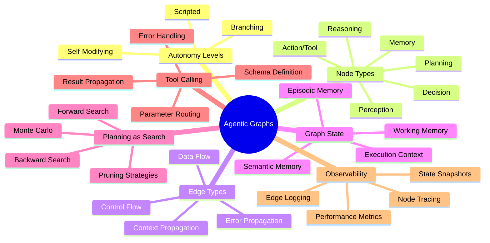
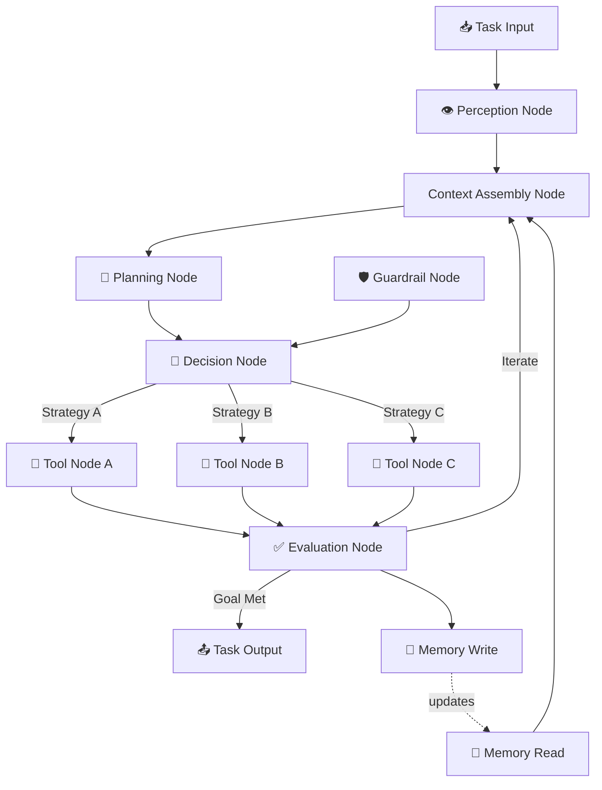
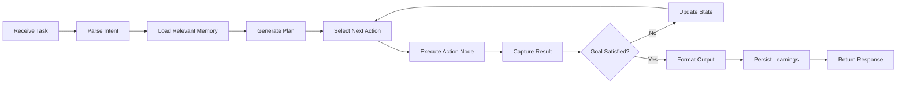
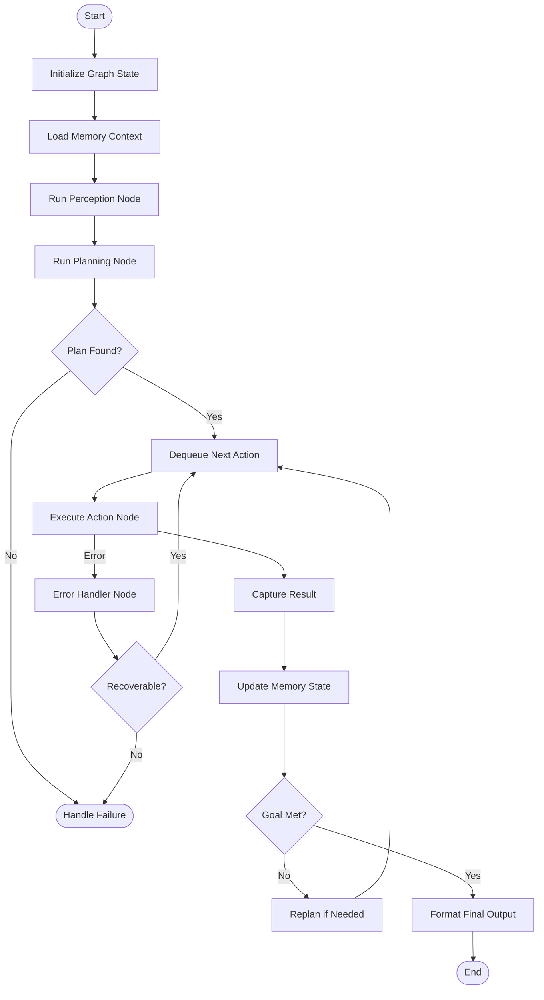
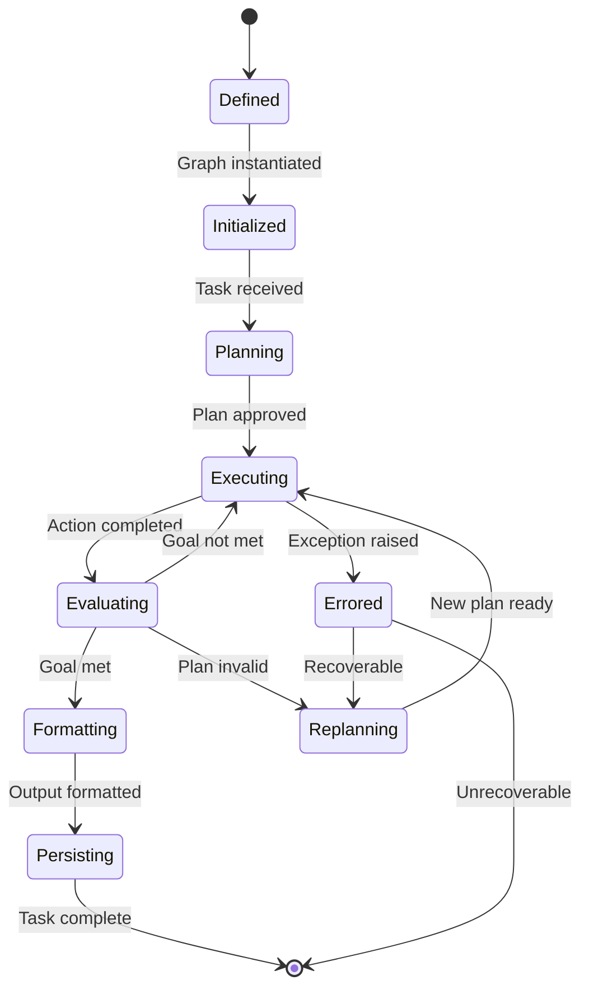
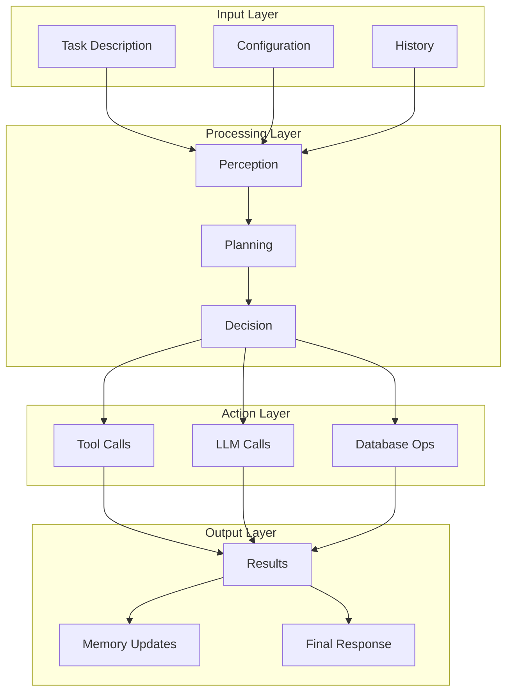
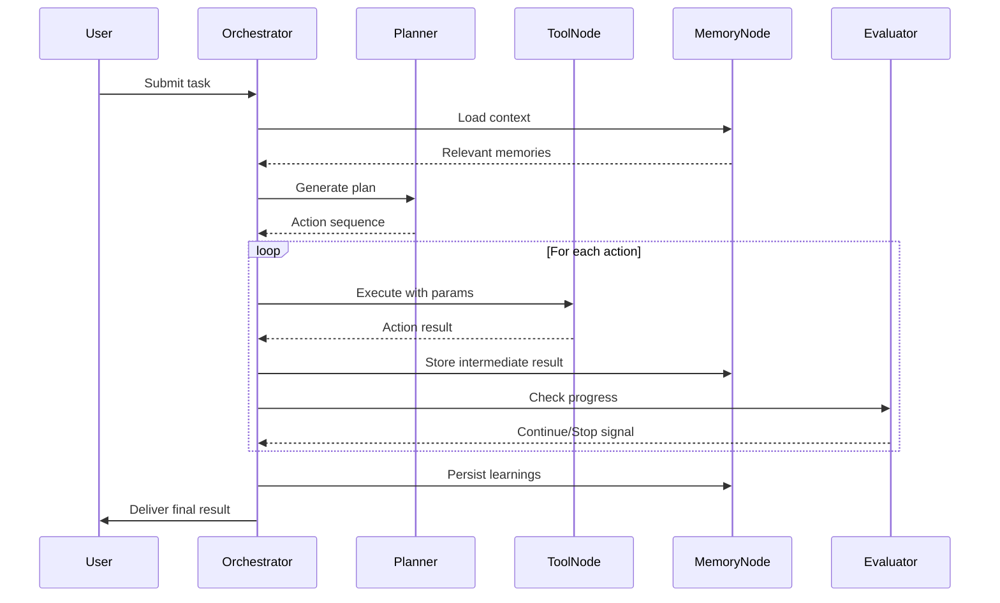

# Agentic Graphs

## 📌 Overview

Agentic graphs represent a paradigm shift in how we design autonomous AI systems by structuring every aspect of an agent's operation — perception, reasoning, tool use, planning, and memory — as an interconnected graph. Rather than treating an agent as a monolithic function that receives input and produces output, agentic graphs decompose the agent into a network of specialized nodes connected by directed edges that define information flow and control transitions. Each node in the graph encapsulates a discrete capability, such as a language model call, a retrieval operation, a tool invocation, or a decision gate, while edges carry the data and control signals between them. This graph-based decomposition enables developers to reason about agent behavior with surgical precision, tracing how information propagates through the system and identifying exactly where failures or bottlenecks occur.

The agentic graph approach emerged from the recognition that real-world agent tasks are rarely linear. An agent researching a complex topic might need to branch into parallel information retrieval paths, merge findings, evaluate quality, and iterate based on what it discovers. Graph structures naturally accommodate these branching, merging, and looping patterns without forcing unnatural linear chains. By making the agent's internal architecture explicit as a graph, developers gain unprecedented visibility into autonomous behavior, can inject guardrails at specific graph nodes, and can dynamically modify the graph topology at runtime based on the agent's evolving understanding of its task. This makes agentic graphs foundational to building reliable, observable, and controllable AI agents that can operate with meaningful autonomy.

## 🎯 Learning Objectives

After studying this document, you will be able to decompose an autonomous AI agent into a graph of interconnected processing nodes and data-flow edges. You will understand how to classify agent autonomy along a spectrum from fully scripted to fully autonomous, and how graph topology reflects that autonomy level. You will be able to design decision graphs that encode an agent's reasoning steps as explicit branching logic, and you will understand how tool-calling maps naturally onto graph operations where tool nodes receive parameters via edges and return results to downstream nodes.

You will also learn to model agent planning as graph search, where the agent explores a space of possible action sequences by traversing and pruning paths through a planning graph. You will understand how agent memory can be represented as graph state — a mutable collection of node and edge attributes that persist across execution steps and evolve as the agent interacts with its environment. Finally, you will be able to evaluate trade-offs between different agentic graph architectures, choosing the right topology and autonomy level for a given application while maintaining observability and safety.

## 🧠 Definition

An agentic graph is a directed graph structure that serves as the operational blueprint for an autonomous AI agent, where nodes represent discrete computational or decision steps and edges represent the flow of data, control, or context between those steps. Unlike static computation graphs found in traditional software or deep learning frameworks, agentic graphs are inherently dynamic — the agent itself may modify the graph structure at runtime, adding new nodes for discovered subtasks, pruning infeasible branches, or rerouting execution based on intermediate results. Each node in an agentic graph typically wraps either a deterministic operation (such as a data transformation or API call) or a probabilistic operation (such as a language model inference), and the edges carry typed payloads including prompts, tool arguments, intermediate results, and metadata about execution state.

The defining characteristic of an agentic graph is that it encodes not just computation, but *autonomy*. The graph includes decision nodes where the agent chooses among multiple possible next steps, loop nodes where the agent iterates until a condition is met, and terminal nodes where the agent determines the task is complete. This makes the graph a first-class representation of the agent's behavioral policy — the mapping from any reachable state to a distribution over possible actions. By externalizing this policy as a graph, developers can inspect, modify, constrain, and monitor agent behavior in ways that are impossible when the policy is implicit within a monolithic model.

## ❓ Why It Matters

Agentic graphs matter because they solve the fundamental tension between agent autonomy and developer control. As AI systems take on increasingly complex, multi-step tasks, the risk of unpredictable or harmful behavior grows proportionally. A monolithic agent that receives a high-level instruction and autonomously executes dozens of unseen steps is a black box — when it fails, debugging requires retracing an invisible chain of reasoning. Agentic graphs make every step explicit and inspectable, creating a traceable execution log where each node invocation is recorded with its inputs, outputs, and the edges that connected it to its neighbors.

Furthermore, agentic graphs enable compositional agent design. Instead of building a new agent from scratch for each task, developers can compose reusable graph subcomponents — a retrieval subgraph, a planning subgraph, a validation subgraph — and wire them together with well-defined interfaces. This composability accelerates development, encourages best-practice patterns, and makes it possible to build libraries of battle-tested agent subgraphs that can be shared across projects. Agentic graphs also provide a natural foundation for safety engineering, since guardrails can be inserted as nodes that filter or transform data flowing through the graph, and monitoring can be attached to specific edges to detect anomalous patterns in real time.

## 🏛️ Core Concepts

The first core concept is the **agent node taxonomy**, which classifies the types of nodes that appear in agentic graphs. Perception nodes handle input processing and interpretation, reasoning nodes perform inference and deliberation, action nodes invoke tools or produce outputs, and control nodes manage branching, looping, and termination decisions. Each node type has distinct interface contracts, error handling requirements, and latency characteristics that affect overall graph performance.

The second core concept is **autonomy levels**, which describe how much freedom the agent has in determining its execution path through the graph. At the lowest level, the graph is fully scripted — every path is predetermined and the agent merely executes nodes in sequence. At intermediate levels, the agent can choose among predefined branches at decision nodes. At the highest level, the agent can dynamically modify the graph itself, adding nodes, creating new edges, and even deleting paths that it determines are unproductive.

The third core concept is **graph state**, the mutable data structure that represents everything the agent knows and remembers at any point during execution. Graph state includes the current node being executed, the accumulated results from completed nodes, the parameters waiting to be passed to pending nodes, and any persistent memory that survives across multiple invocations of the agent. Managing graph state correctly is essential for maintaining agent coherence across multi-step tasks.

## 🧩 Key Components

The **decision node** is the heart of agent autonomy within an agentic graph. A decision node receives context from upstream nodes, applies a selection criterion (which may involve an LLM call, a rule-based condition, or a scoring function), and routes execution to one of several downstream branches. Decision nodes can be binary (yes/no), multi-way (choosing among several tools or strategies), or conditional (checking whether a goal has been achieved and looping back if not). The quality of decisions directly determines agent effectiveness, making decision nodes the primary target for prompt engineering and fine-tuning.

The **tool node** encapsulates interactions with external systems — APIs, databases, code interpreters, search engines, and other tools that extend the agent's capabilities beyond pure language generation. A tool node defines its input schema (what parameters it requires), its output schema (what it returns), and its side effects (what changes it makes in the external world). In an agentic graph, tool-calling is modeled as a graph operation: the agent traverses to the tool node, passes arguments through the incoming edge, waits for the tool to execute, and then routes the result to the next node via the outgoing edge.

The **memory node** provides read and write access to the agent's persistent state. Memory nodes can be short-term (holding information for the duration of a single task execution), episodic (storing specific past experiences for future reference), or semantic (maintaining a knowledge base of general facts). Memory nodes are connected to the graph via read edges (pulling stored information into the current context) and write edges (updating stored information based on new observations). The memory graph itself — the structure of how memories are connected — becomes a key asset that improves agent performance over time.

The **planning node** performs lookahead by constructing or exploring a partial graph of possible future actions before committing to any of them. Planning nodes implement algorithms like tree search, Monte Carlo simulation, or LLM-based chain-of-thought forecasting to evaluate multiple candidate action sequences. The output of a planning node is a recommended path through the agentic graph, which the agent may follow directly or may use as a starting point for further deliberation.

## 🧭 Mental Model

Think of an agentic graph as a city map where the agent is a driver navigating from a starting point (the task instruction) to a destination (the completed task). The nodes are intersections and landmarks — places where the driver makes decisions, gathers information, or takes actions. The edges are the roads connecting them, carrying the driver from one point to the next. Some roads are one-way streets (directed edges), some are highways (fast, high-throughput edges), and some are detours (loop-back edges that return the driver to a previous point when a dead end is reached).

The agent's autonomy level determines whether it follows a GPS route exactly (low autonomy), chooses between a few suggested routes at each intersection (medium autonomy), or explores the city freely, discovering new roads and reevaluating its route at every turn (high autonomy). The agent's memory is like the driver's mental map of the city — it grows richer with experience, allowing the driver to make better route choices in future trips. Guardrails are like traffic laws that prevent the driver from taking certain dangerous roads, no matter how attractive they might seem.

## 🗺️ Mind Map

## 🏗️ Architecture Diagram

## 🔄 Workflow

## ⚙️ Internal Working

The execution of an agentic graph begins when a task input arrives at the graph's entry node. The entry node, typically a perception node, parses the raw input into a structured representation — extracting the user's intent, identifying relevant entities, and determining the task type. This structured representation is then propagated through the graph via data-flow edges to the context assembly node, which combines the parsed input with any relevant information retrieved from memory nodes. The context assembly node produces a rich prompt or context object that encapsulates everything the reasoning nodes need to make good decisions.

The planning node receives this context and generates one or more candidate action plans. Each plan is a proposed path through the graph — a sequence of nodes to visit and edges to traverse. The planner evaluates these candidates using heuristics, past experience stored in memory, or simulated execution, and selects the most promising plan. The selected plan determines which decision branches the agent will initially explore, though the agent may deviate from the plan if intermediate results warrant a change in strategy.

As the agent executes nodes along its chosen path, each node receives its inputs via incoming edges, performs its computation, and produces outputs on its outgoing edges. Tool nodes marshal their parameters, call the external system, and unmarshal the response. Evaluation nodes compare intermediate results against the task's success criteria. If the criteria are not yet met, the evaluation node routes execution back to an earlier node — typically the planning or decision node — for another iteration. This loop continues until the evaluation node determines the goal is satisfied, at which point execution flows to the output node, which formats the final response. Throughout this process, memory nodes are continuously read from and written to, ensuring that the agent's understanding of the task evolves with each iteration.

## 🔀 Execution Flow

## 📊 Lifecycle

## 📡 Data Flow

## 🤝 Interaction Flow

## 🌍 Real-World Analogy

Consider a senior research analyst working on a complex market analysis report. The analyst does not simply read one document and write a conclusion. Instead, they follow a graph-like process: they first understand the research question (perception), then plan their research approach by identifying data sources and methodologies (planning), then systematically gather data from financial databases, news archives, and expert interviews (tool-calling through multiple nodes). At each step, they evaluate whether the information they have is sufficient (evaluation nodes), and if not, they loop back to gather more data or refine their approach (loop-back edges).

The analyst's notebook serves as their memory graph — a web of interconnected notes, data points, and conclusions that grows richer as they work. Their expertise allows them to make autonomous decisions about which sources to prioritize and which leads to pursue (decision nodes), but they also know when to consult a colleague or supervisor for a second opinion (escalation edges). The final report is not just the output of the last step, but a synthesis of information that flowed through many interconnected processing stages — exactly how an agentic graph produces its output.

## 💡 Practical Example

Imagine building an agentic graph for an automated code review assistant. The graph begins with a perception node that receives a pull request and extracts the changed files, the commit messages, and the diff content. A planning node then determines the review strategy — for a small typo fix, it might plan a quick syntax check; for a large feature branch, it plans a comprehensive review covering security, performance, style, and test coverage. The decision node routes execution to the appropriate subgraphs based on the plan.

Each review subgraph contains specialized tool nodes: a security scanner node runs static analysis tools, a performance node benchmarks the changes, a style node checks against linting rules, and a test node runs the test suite. The results from all these nodes flow into an evaluation node that synthesizes the findings, prioritizes issues by severity, and determines whether additional analysis is needed. If the evaluation reveals a potential security vulnerability, the graph loops back to a deeper analysis subgraph. Memory nodes store information about previously reviewed code patterns, common issues in the codebase, and the developer's typical mistakes, allowing the agent to provide increasingly personalized and accurate reviews over time. The final output node generates a structured review comment with specific, actionable feedback.

## 🧪 Use Cases

**Autonomous Research Agents** use agentic graphs to conduct multi-step investigations. The graph structures the research process into literature search nodes, source evaluation nodes, synthesis nodes, and citation management nodes. The planning node determines which databases to query and in what order, while memory nodes track which sources have already been examined and what findings have been accumulated. This enables the agent to conduct thorough research that rivals human literature reviews, with full traceability of every step.

**Customer Support Agents** employ agentic graphs to handle complex support tickets that require multiple system interactions. The graph routes the ticket through a classification node, then branches to specialized handling subgraphs for billing, technical support, or account management. Tool nodes interact with the CRM, billing system, and knowledge base, while memory nodes maintain the customer's history and the agent's understanding of the issue. Evaluation nodes determine whether the issue is resolved or needs escalation.

**DevOps Automation Agents** leverage agentic graphs to manage infrastructure operations. The graph includes monitoring nodes that detect anomalies, diagnosis nodes that analyze root causes, remediation nodes that execute fixes, and verification nodes that confirm the fix was successful. Planning nodes evaluate multiple remediation strategies before executing, and memory nodes maintain a history of past incidents and their resolutions, enabling the agent to apply learned patterns to new situations.

**Creative Writing Agents** use agentic graphs to manage the multi-stage process of producing long-form content. The graph includes brainstorming nodes, outlining nodes, drafting nodes, revision nodes, and fact-checking nodes, connected by edges that allow the agent to iterate on any stage. Memory nodes maintain the story's continuity, character profiles, and style guidelines, ensuring consistency across a long document.

## ⚖️ Comparison

| Aspect | Monolithic Agent | Agentic Graph Agent |
|--------|-----------------|---------------------|
| **Structure** | Single LLM call chain | Explicit graph of nodes and edges |
| **Observability** | Limited to input/output | Every node execution is traceable |
| **Composability** | Hard to reuse components | Subgraphs are independently reusable |
| **Flexibility** | Fixed pipeline | Dynamic topology at runtime |
| **Debugging** | Retrace implicit reasoning | Pinpoint exact node and edge of failure |
| **Safety** | Post-hoc filtering | Guardrails at any graph position |
| **Memory** | Flat context window | Structured memory graph with typed edges |
| **Tool Use** | Hardcoded tool selection | Tool nodes dynamically routed by decisions |
| **Scaling** | Monolithic complexity grows | Complexity managed per subgraph |

## ✅ Best Practices

Design agentic graphs with clear separation of concerns, ensuring each node has a single, well-defined responsibility. A node that tries to do too much — combining perception, reasoning, and action in one step — becomes a black box that defeats the purpose of graph-based design. Keep nodes focused, give them descriptive names, and document their input/output contracts thoroughly. This discipline pays dividends in debugging, testing, and maintenance.

Implement comprehensive tracing at every graph edge, recording not just the data that flows through the edge but also the timestamp, the source and target nodes, and any metadata about the execution context. This trace log is invaluable for debugging agent failures, understanding agent decision-making patterns, and identifying optimization opportunities. Structure trace data so it can be visualized as a graph execution timeline, making it easy to spot where the agent spent its time and where unexpected loops or dead ends occurred.

Design your memory nodes to support both fast retrieval and incremental updates. Use a layered memory architecture where hot memory (recent, frequently accessed information) is kept in fast storage, while cold memory (historical, rarely accessed information) is archived but still searchable. Ensure that memory writes include sufficient metadata — timestamps, source attribution, relevance scores — to support effective retrieval when the memory is read in future task executions.

## ❌ Common Mistakes

The most common mistake in agentic graph design is creating overly rigid graphs that force the agent into a predetermined execution path, negating the benefits of autonomy. If every decision node has only one viable branch, or if the graph never allows backtracking, the system is essentially a scripted pipeline wearing graph clothing. Ensure that your decision nodes have genuine alternatives and that your evaluation nodes can meaningfully trigger replanning.

Another frequent error is neglecting error handling at the graph level. When a tool node fails or returns unexpected results, the graph needs explicit error-propagation edges that route the error to a handler node capable of recovery — whether that means retrying with different parameters, trying an alternative tool, or gracefully degrading the agent's response. A graph without error edges is fragile, because a single node failure can crash the entire agent.

A third common mistake is allowing the graph state to grow unboundedly. As an agent executes many iterations, the accumulated state can become enormous, degrading performance and causing context window overflows. Implement state compaction nodes that periodically summarize, prune, or archive older state entries, keeping the working state focused on information that is currently relevant to the task at hand.

## 🚀 Advanced Topics

**Self-modifying agentic graphs** represent the frontier of agent autonomy, where the agent can alter its own graph structure during execution. This includes dynamically adding new tool nodes when it discovers useful APIs, creating new decision branches based on observed patterns, or pruning graph regions that prove unproductive. Self-modification requires careful safety constraints — the agent should only be allowed to modify graph regions that have been designated as mutable, and all modifications should be logged and reversible.

**Hierarchical agentic graphs** introduce multiple levels of abstraction, where high-level nodes represent complex subgraphs that are expanded at runtime. A high-level planning node might generate a coarse plan with abstract action nodes, and each abstract node is then expanded into a detailed subgraph when execution reaches it. This hierarchical decomposition allows the agent to reason at different levels of granularity, planning broadly at the top level while executing precisely at the leaf level.

**Probabilistic agentic graphs** extend the deterministic graph model by associating probabilities with edges, reflecting the agent's uncertainty about which path is best. Instead of deterministically choosing one branch at a decision node, the agent may sample from a probability distribution, enabling exploration of multiple promising paths. Monte Carlo Tree Search (MCTS) can be applied to these probabilistic graphs, allowing the agent to balance exploration of new strategies with exploitation of known good strategies, dramatically improving performance on complex planning tasks.