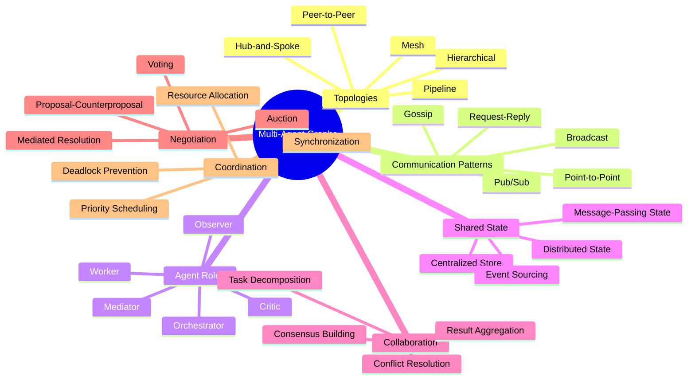
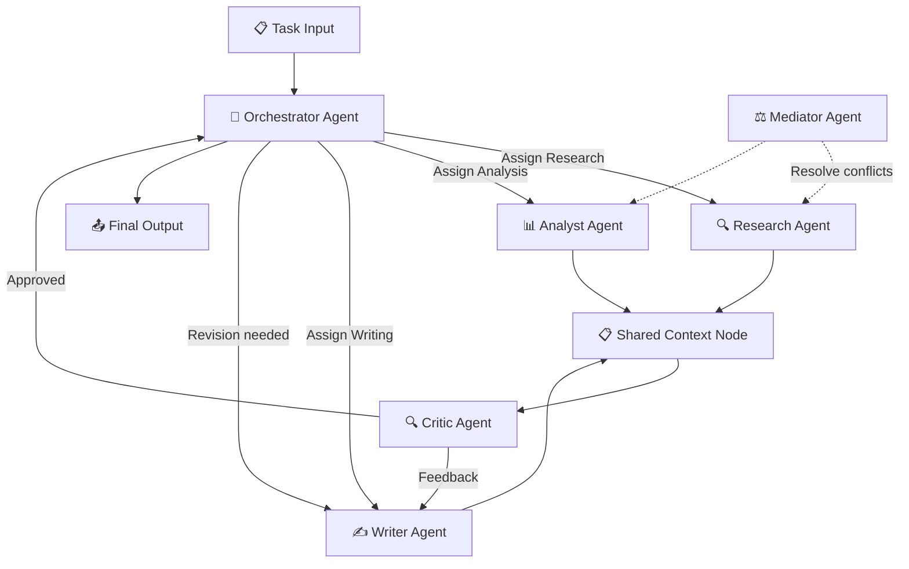
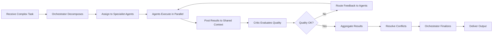
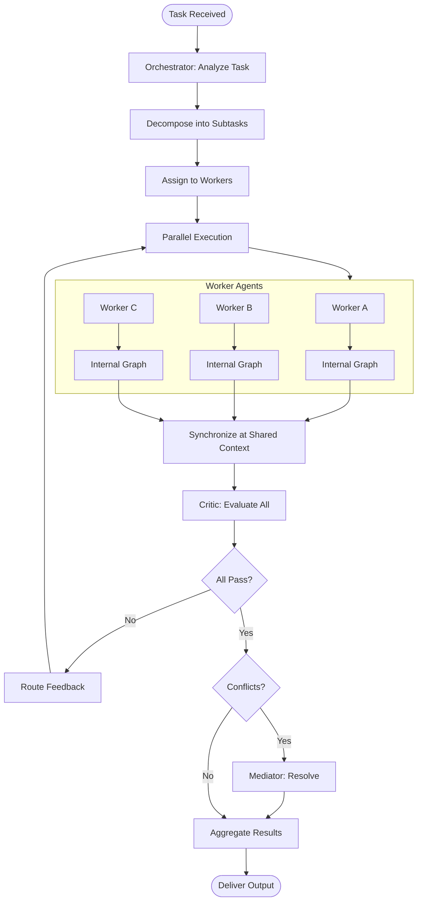
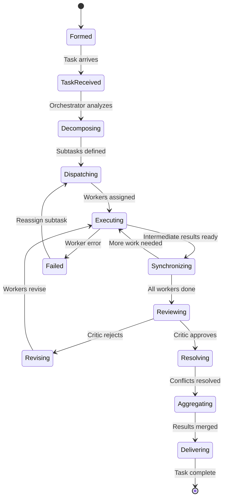
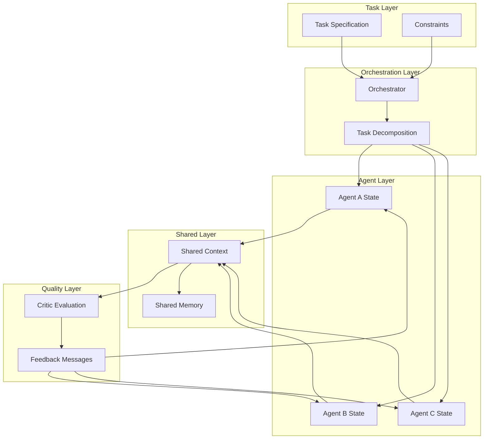
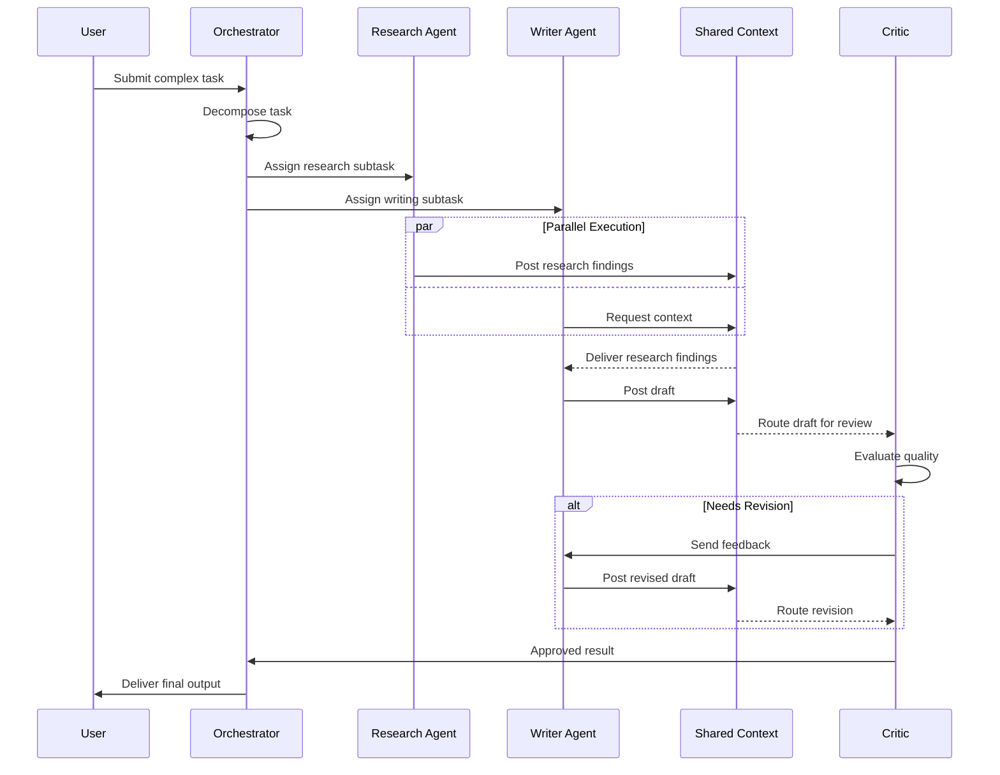

# Multi-Agent Graphs

## 📌 Overview

Multi-agent graphs extend the agentic graph paradigm from a single autonomous agent to coordinated systems of multiple specialized agents, each represented as a node (or subgraph) within a larger interaction graph. In a multi-agent graph, individual agents retain their internal agentic graph structure — their own perception, reasoning, planning, and tool-calling nodes — but they also become participants in an inter-agent communication network. The edges between agent nodes define communication channels, delegation relationships, and shared state dependencies, creating a rich topology that governs how agents collaborate, compete, negotiate, and synchronize their activities. This architectural pattern enables the decomposition of complex tasks into specialized domains, where each agent focuses on what it does best while the graph structure ensures coherent coordination.

The power of multi-agent graphs lies in their ability to model real-world work patterns. In any organization, complex projects are not completed by a single person — they require teams of specialists who communicate, divide work, review each other's contributions, and resolve conflicts. Multi-agent graphs bring this same collaborative intelligence to AI systems. A software development task might involve a requirements analyst agent, an architect agent, a coder agent, a tester agent, and a documentation agent, each with specialized capabilities and each connected to the others through a carefully designed communication topology. The graph structure makes these interactions explicit, manageable, and observable, providing the scaffolding needed to build AI systems that can tackle tasks of genuine complexity.

## 🎯 Learning Objectives

After completing this document, you will understand how to design multi-agent systems as explicit graph structures, with each agent as a node and their interactions as typed edges. You will be able to identify and implement common agent communication patterns, including broadcast, point-to-point, publish-subscribe, and request-reply topologies. You will understand how to define agent roles and specializations within a graph, assigning capabilities and responsibilities to each agent node based on the requirements of the overall task.

You will learn to design agent negotiation and collaboration graphs where agents can propose, evaluate, and refine solutions through structured interaction protocols. You will understand how shared state between agents can be managed through dedicated state nodes, message queues, or shared memory subgraphs, and how to handle the consistency challenges that arise when multiple agents read and write overlapping state. Finally, you will be able to evaluate different agent topology patterns — hub-and-spoke, peer-to-peer, hierarchical, and mesh — and select the appropriate topology for a given multi-agent application based on factors like communication overhead, fault tolerance, and scalability.

## 🧠 Definition

A multi-agent graph is a directed graph in which nodes represent autonomous or semi-autonomous AI agents (each potentially containing its own internal agentic graph) and edges represent communication channels, delegation relationships, or shared state dependencies between those agents. The graph defines the topology of agent interactions — who can talk to whom, in what order, and through what protocols. Each agent node has an internal state, a set of capabilities, and a behavioral policy that determines how it responds to incoming messages and what actions it takes. The edges between agents carry typed messages that may include task assignments, status updates, requests for information, proposed solutions, feedback, or coordination signals.

Multi-agent graphs differ from single agentic graphs in a fundamental way: the intelligence of the system emerges not just from individual agent reasoning, but from the pattern of interactions between agents. A well-designed multi-agent graph can produce results that no single agent could achieve alone, because the collaboration structure allows agents to combine their specialized knowledge, cross-check each other's work, and adapt collectively to changing conditions. The graph topology is not merely a transport layer — it is a critical component of the system's intelligence, shaping what information flows where, which agents can influence each other, and how conflicts and disagreements are resolved.

## ❓ Why It Matters

Multi-agent graphs matter because the complexity ceiling of single-agent systems is fundamentally limited by the breadth of capabilities that any one agent can effectively maintain. As tasks grow more complex — involving multiple domains of expertise, conflicting constraints, and the need for diverse perspectives — a single agent struggles to maintain deep expertise in all relevant areas while also managing the coordination overhead. Multi-agent graphs break through this ceiling by distributing expertise across specialized agents, each of which can be optimized for its specific domain.

Furthermore, multi-agent graphs provide natural fault isolation. If one agent encounters an error or produces a poor result, the graph structure contains the failure within that agent's region and allows other agents to compensate. In a single-agent system, a failure in one reasoning step can cascade through the entire execution. Multi-agent graphs also enable parallelism — agents that are not dependent on each other's outputs can execute simultaneously, dramatically reducing latency for complex tasks. This parallelism is not just an implementation optimization; it is a fundamental property of the graph topology that determines which subtasks can proceed concurrently.

Finally, multi-agent graphs matter because they provide a natural framework for implementing adversarial and competitive dynamics that improve output quality. By including agent nodes with opposing objectives — such as a generator agent and a critic agent — the graph creates an internal quality assurance mechanism where agents push each other toward better solutions. This adversarial pattern, impossible in single-agent systems, is a powerful tool for improving reliability and reducing hallucinations.

## 🏛️ Core Concepts

The first core concept is **agent topology**, which describes the structural pattern of connections between agents in the graph. Common topologies include hub-and-spoke (where a central orchestrator agent coordinates all other agents), peer-to-peer (where agents communicate directly with each other without a central coordinator), hierarchical (where agents are organized in layers with communication flowing up and down the hierarchy), and mesh (where every agent can potentially communicate with every other agent). Each topology has distinct trade-offs in terms of coordination overhead, fault tolerance, communication efficiency, and scalability.

The second core concept is **communication protocols**, the formal rules governing how agents exchange messages through the graph edges. Protocols define message formats, routing rules, delivery guarantees (at-least-once, at-most-once, exactly-once), timeout behaviors, and error handling. In graph terms, each edge type in the multi-agent graph has an associated protocol that constrains what can flow across it and how the receiving agent must respond.

The third core concept is **shared state management**, the challenge of maintaining consistency when multiple agents read and write overlapping data. Shared state in multi-agent graphs can be managed through a variety of patterns, including centralized state stores (where a dedicated state node mediates all access), distributed state with eventual consistency (where each agent maintains a local copy and synchronizes periodically), or message-passing state (where state changes are propagated as messages through the graph edges rather than stored in a shared location).

## 🧩 Key Components

The **orchestrator agent** is a specialized agent node that manages the overall workflow of the multi-agent system. The orchestrator does not typically perform domain-specific work itself; instead, it decomposes tasks, assigns subtasks to worker agents, monitors progress, handles exceptions, and aggregates results. In a hub-and-spoke topology, the orchestrator is the hub — every message between worker agents passes through it. In a peer-to-peer topology, the orchestrator's role is reduced to initialization and final aggregation, with agents coordinating directly.

The **worker agent** is a domain-specialized agent that performs the actual substantive work of the system. Worker agents receive task assignments (typically from the orchestrator or from other worker agents), execute their internal agentic graphs to complete the task, and return results. Each worker agent has a specific role — for example, a research worker, a writing worker, a coding worker, or a review worker — and its internal graph is optimized for that role. Worker agents may also communicate with each other to share information, request clarifications, or coordinate on interdependent subtasks.

The **critic agent** is a specialized agent node whose role is to evaluate the outputs of other agents. The critic applies quality criteria, checks for errors or inconsistencies, and provides constructive feedback. Critic agents are essential for maintaining output quality in multi-agent systems, because individual worker agents may produce plausible-sounding but incorrect results. By routing worker outputs through a critic node before they are accepted, the graph creates a quality gate that catches problems early.

The **shared context node** is a dedicated node (or subgraph) that maintains information that multiple agents need to access. This might include the current task specification, accumulated results from other agents, shared constraints or rules, or a common knowledge base. The shared context node acts as a bulletin board that agents can read from and write to, providing a low-coupling mechanism for sharing information without requiring direct agent-to-agent connections. Access control can be enforced at the shared context node, determining which agents can read or write specific sections of the shared state.

## 🧭 Mental Model

Think of a multi-agent graph as a project team working in a shared office. Each agent is a team member with a specific role — a researcher, a writer, a designer, an editor — sitting at their own desk (their internal agentic graph). The office layout (the graph topology) determines who sits near whom and how easily they can communicate. In a hub-and-spoke office, everyone must go through the project manager to talk to each other. In an open-plan office (mesh topology), anyone can walk up to anyone else's desk.

The whiteboard in the center of the room is the shared context node — a place where anyone can read what others have written and add their own contributions. The project manager's task board, where assignments are posted and progress is tracked, is the orchestrator's internal state. When a researcher finishes gathering data, they write their findings on the whiteboard and notify the writer. The writer reads the findings, produces a draft, and posts it for the editor to review. The editor's red-pen marks are the critic agent's feedback, which the writer incorporates before the final version is submitted. The entire process is visible, traceable, and coordinated — not because anyone is micromanaging, but because the communication structure makes it natural.

## 🗺️ Mind Map

## 🏗️ Architecture Diagram

## 🔄 Workflow

## ⚙️ Internal Working

The execution of a multi-agent graph begins when a task arrives at the orchestrator agent node. The orchestrator analyzes the task, decomposes it into subtasks, and determines which worker agents are best suited for each subtask based on their declared capabilities and current availability. This decomposition is itself a graph operation — the orchestrator may maintain a capability graph that maps agent types to task types, and it performs a matching operation to assign subtasks. The orchestrator then sends task assignment messages to the selected worker agents through the graph edges.

Each worker agent receives its assignment, initializes its internal agentic graph, and begins execution. In a well-designed multi-agent graph, worker agents that do not depend on each other's outputs can execute in parallel, each progressing through its own internal nodes independently. As workers produce intermediate results, they write them to the shared context node, making their findings available to other agents that might need them. This write-and-read pattern enables organic collaboration — a worker agent can discover that another agent's results are relevant to its own task and incorporate that information without explicit orchestration.

When worker agents complete their subtasks, they route their outputs to the critic agent for quality evaluation. The critic applies its evaluation criteria — checking for factual accuracy, logical consistency, completeness, and adherence to constraints — and produces feedback. If the critic identifies issues, the feedback is routed back to the responsible worker agents along feedback edges, triggering revision cycles. If the critic approves, the results flow to the orchestrator for final aggregation. Throughout this process, the mediator agent monitors for conflicts between agents — for example, when two agents produce contradictory results — and resolves them through structured negotiation protocols encoded in the mediator's internal graph.

## 🔀 Execution Flow

## 📊 Lifecycle

## 📡 Data Flow

## 🤝 Interaction Flow

## 🌍 Real-World Analogy

Consider a hospital's medical team treating a complex case. The attending physician acts as the orchestrator, receiving the patient and determining which specialists are needed. The cardiologist, neurologist, and radiologist are worker agents, each examining the patient through their specialized lens and contributing their expert findings. The medical record is the shared context node — a centralized document that all specialists can read from and write to, ensuring everyone has access to the latest information.

When the cardiologist orders a test, the result is posted to the medical record where the neurologist can see it and consider its implications for their own assessment. If the specialists disagree on a diagnosis — the cardiologist believes the issue is cardiac while the neurologist suspects a neurological cause — the case is escalated to a tumor board or multidisciplinary team meeting, which acts as the mediator agent. The mediator facilitates structured discussion, weighs the evidence from each specialist, and guides the team toward a consensus. Throughout this process, the hospital's quality assurance department (the critic agent) monitors for protocol compliance, medication interactions, and diagnostic accuracy. The final treatment plan is an aggregated output that reflects the combined expertise of the entire team, coordinated through the structured communication patterns of the hospital's workflows.

## 💡 Practical Example

Consider building a multi-agent graph system for automated software development. The orchestrator agent receives a feature request and decomposes it into subtasks: requirements analysis, system design, implementation, testing, and documentation. The requirements agent interviews the specification (or a human stakeholder) and produces a detailed requirements document, which it posts to the shared context. The architect agent reads the requirements and produces a system design, including API contracts and data models.

The coder agent reads both the requirements and the design from the shared context and begins implementation, producing code that conforms to the specified contracts. Meanwhile, the test agent, observing the design, begins writing test cases before the code is even complete (test-driven development). Once the coder finishes, the test agent runs the tests against the implementation. Failed tests are routed back to the coder as feedback, triggering a revision cycle. The documentation agent generates user-facing documentation from the requirements and design. The critic agent performs a final review, checking that the implementation matches the requirements, the tests provide adequate coverage, and the documentation is accurate. The mediator agent resolves any conflicts — for example, if the coder's implementation deviates from the architect's design, the mediator facilitates a negotiation between them to reach an acceptable compromise.

## 🧪 Use Cases

**Content Production Pipelines** use multi-agent graphs to manage the creation of complex content like research reports, marketing campaigns, or educational materials. A research agent gathers information, a writer agent drafts content, a fact-checker agent verifies claims, an editor agent improves style and clarity, and a compliance agent ensures regulatory requirements are met. The shared context holds the evolving document, and the critic agent ensures quality at each stage.

**Financial Analysis Systems** employ multi-agent graphs where a market data agent collects real-time financial data, a quantitative analyst agent runs statistical models, a risk assessment agent evaluates portfolio exposure, and a compliance agent checks for regulatory violations. The orchestrator coordinates these agents to produce comprehensive investment analyses that no single agent could generate alone, with the critic agent catching computational errors and the mediator agent resolving disagreements between the quantitative and risk models.

**Autonomous Customer Experience** platforms use multi-agent graphs to handle end-to-end customer interactions. An intent classification agent determines the customer's need, a knowledge retrieval agent finds relevant information, a response generation agent drafts a reply, a sentiment analysis agent monitors customer satisfaction, and an escalation agent decides when to transfer to a human. The shared context maintains the full conversation history, ensuring every agent has the context it needs to make good decisions.

**Scientific Research Automation** leverages multi-agent graphs where a hypothesis generation agent proposes theories, an experiment design agent creates experimental protocols, a data collection agent gathers observations, a statistical analysis agent processes the data, and a peer review agent evaluates the methodology and conclusions. The mediator agent resolves conflicts between the hypothesis and the data, potentially triggering new hypothesis generation.

## ⚖️ Comparison

| Aspect | Single Agent | Hub-and-Spoke Multi-Agent | Peer-to-Peer Multi-Agent |
--------|-------------|--------------------------|--------------------------|
| **Complexity** | Low | Medium | High |
| **Scalability** | Limited | Good | Excellent |
| **Fault Tolerance** | Single point of failure | Orchestrator is SPOF | No SPOF |
| **Coordination** | Internal only | Centralized | Distributed |
| **Specialization** | Generalist | Specialized workers | Highly specialized |
| **Communication** | N/A | Through orchestrator | Direct agent-to-agent |
| **Parallelism** | Sequential steps | Managed parallelism | Natural parallelism |
| **Debugging** | Single trace | Orchestrator trace + agent traces | Distributed traces needed |
| **Emergent Behavior** | None | Limited | Significant |

## ✅ Best Practices

Start with a hub-and-spoke topology and evolve toward more complex topologies only when the complexity of the task demands it. Hub-and-spoke is easier to debug, monitor, and modify, and it provides a natural bottleneck for quality control. Only introduce peer-to-peer communication when you have a clear performance or capability reason to do so, and even then, ensure that the orchestrator retains visibility into all inter-agent communication through logging or monitoring edges.

Define explicit message schemas for every edge type in your multi-agent graph. Each agent-to-agent communication channel should have a documented message format that specifies the required fields, optional fields, data types, and semantic meaning. This contract-based approach prevents the subtle miscommunication bugs that arise when agents make implicit assumptions about message structure. Treat edge schemas with the same rigor you would apply to API contracts in a microservices architecture.

Implement robust shared state management with clear ownership rules. For each piece of shared data, define which agent is the authoritative writer and which agents are readers. This ownership model prevents write-write conflicts and makes it clear who is responsible for data quality. When shared data needs to be modified by multiple agents, implement a structured conflict resolution process — either through a mediator agent or through a versioning system that allows agents to propose changes and resolve conflicts explicitly.

## ❌ Common Mistakes

The most common mistake in multi-agent graph design is creating too many agents with too much overlap in their capabilities. When multiple agents have similar roles, they tend to produce redundant or conflicting outputs, increasing coordination overhead without adding value. Design your agent roles to be clearly differentiated, with minimal capability overlap. If two agents frequently disagree, consider whether they should be merged into a single agent or whether a mediator is needed to resolve their differences.

Another frequent error is neglecting the communication cost of the graph topology. In a mesh topology where every agent can communicate with every other agent, the number of potential communication channels grows quadratically with the number of agents. This creates a coordination overhead that can overwhelm the system, with agents spending more time processing messages from other agents than doing productive work. Design your graph to minimize unnecessary communication — agents should share information through the shared context node rather than sending direct messages whenever possible.

A third common mistake is failing to handle agent failures gracefully. In a multi-agent system, individual agents will fail — they may time out, produce errors, or generate low-quality output. The graph must have explicit failure-handling edges that route around failed agents, reassign their tasks, and notify dependent agents. Without these failure edges, a single agent failure can cascade through the entire system, causing widespread degradation or complete system failure.

## 🚀 Advanced Topics

**Dynamic agent spawning** takes multi-agent graphs beyond static topologies by allowing the orchestrator to create new agent nodes at runtime in response to task demands. When the orchestrator encounters a subtask that does not match any existing worker agent's capabilities, it can instantiate a new specialized agent with an appropriately configured internal graph. This dynamic capability allows the system to adapt to unexpected task requirements without preconfiguring every possible agent type. However, dynamic spawning introduces challenges in agent lifecycle management, resource allocation, and quality assurance for newly created agents.

**Agent negotiation protocols** formalize how agents reach agreement when they have conflicting goals or interpretations. Advanced negotiation graphs implement multi-round protocols where agents propose solutions, critique each other's proposals, make concessions, and converge on a consensus. These protocols can be modeled as game-theoretic interactions on the graph, with each agent's strategy influenced by the graph topology and the information available through its edges. Reinforcement learning can be applied to optimize negotiation strategies over time, allowing agents to learn from past negotiations and improve their collaborative efficiency.

**Emergent behavior monitoring** addresses the challenge that multi-agent graphs can exhibit behaviors that were not explicitly programmed — emergent properties that arise from the interaction dynamics between agents. Advanced monitoring systems observe the execution patterns of the multi-agent graph and detect emergent behaviors, both positive (such as creative problem-solving approaches discovered through agent collaboration) and negative (such as feedback loops that cause agents to reinforce each other's errors). By modeling the multi-agent graph as a complex adaptive system, developers can anticipate and manage emergent behaviors, ensuring they enhance rather than undermine system performance.