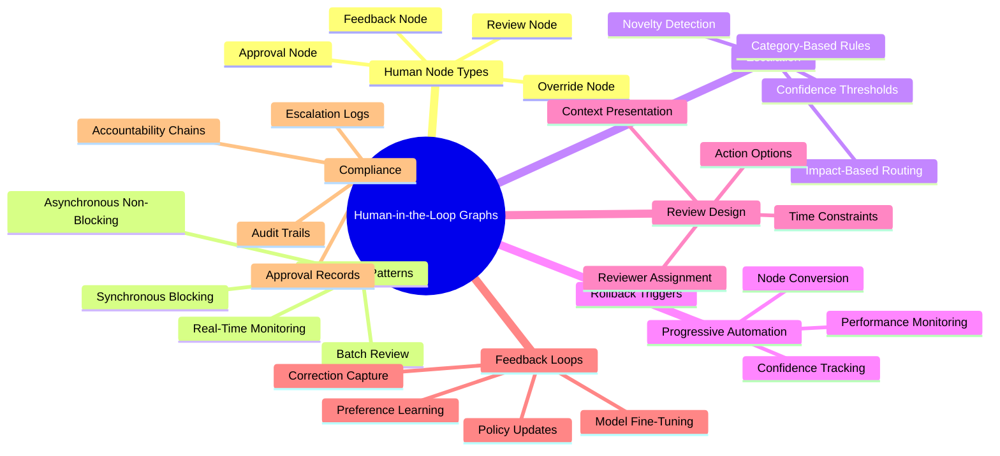
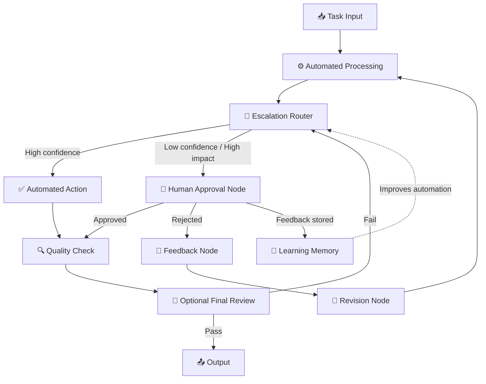
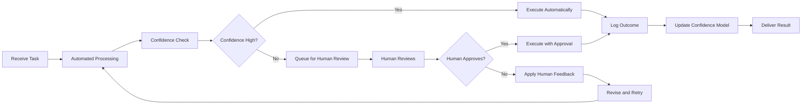
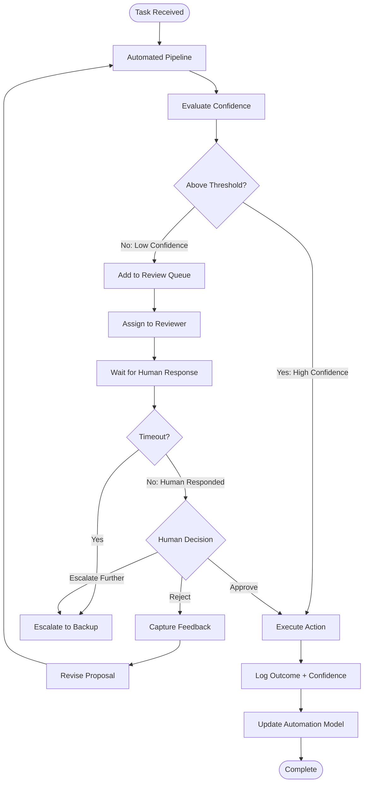
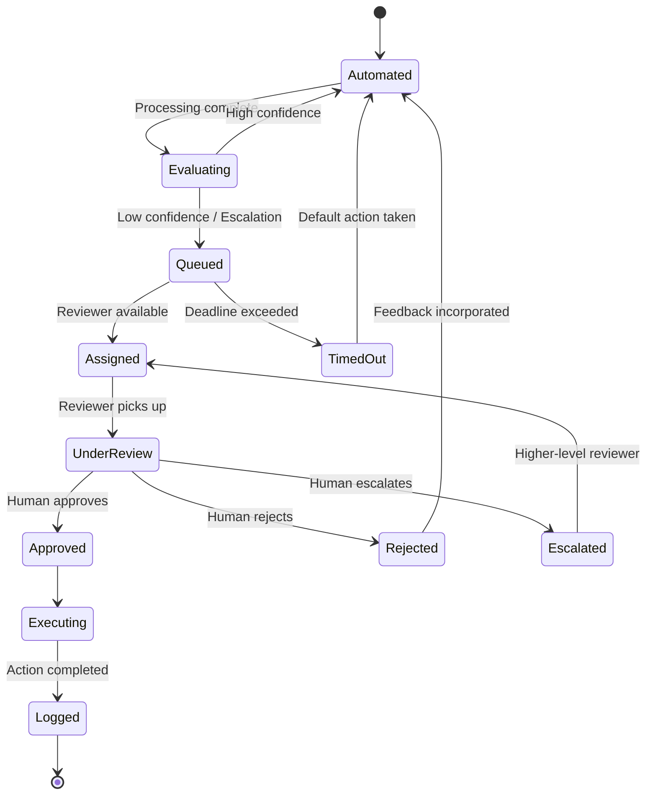
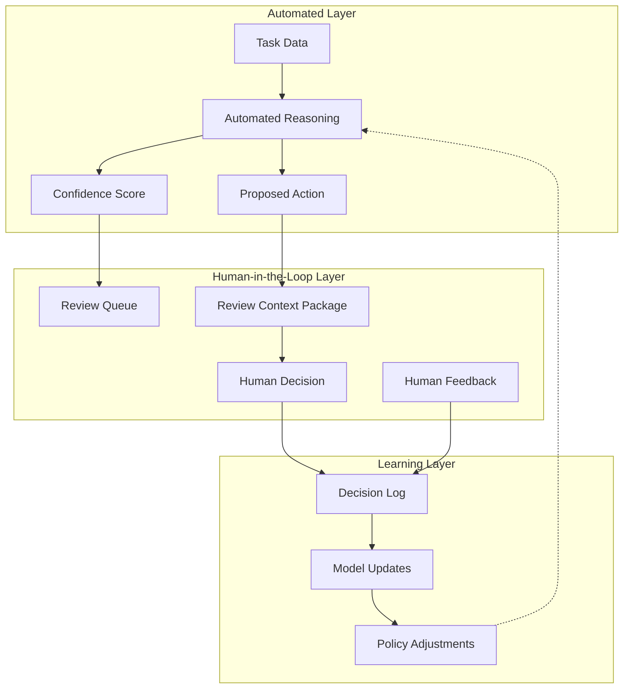
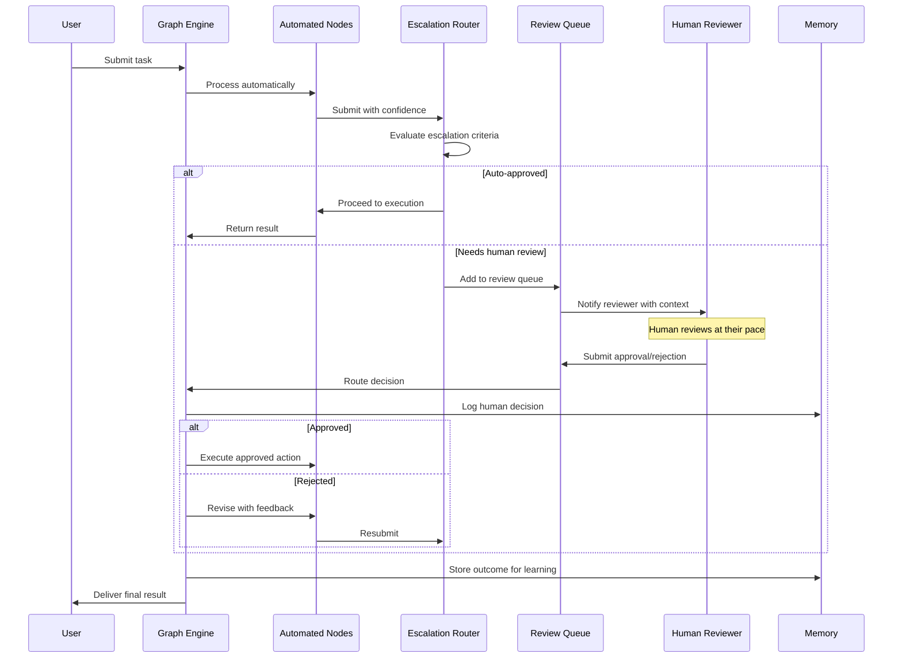

# Human-in-the-Loop Graphs

## 📌 Overview

Human-in-the-loop (HITL) graphs integrate human judgment, oversight, and feedback directly into graph-based AI systems by representing human participants as first-class nodes within the graph structure. Rather than treating human input as an external factor that interrupts or modifies the graph's execution, HITL graphs make human involvement an integral part of the graph topology, with dedicated human nodes, approval edges, review checkpoints, and escalation paths that are as well-defined and well-documented as any automated component. This approach recognizes that for many real-world applications, fully autonomous AI systems are neither desirable nor trustworthy — critical decisions require human judgment, regulatory compliance demands human sign-off, and complex edge cases benefit from human intuition and experience.

The HITL graph approach provides a systematic framework for deciding exactly where, when, and how humans participate in graph execution. Some nodes in the graph may be fully automated, executing without any human involvement. Others may require human approval before their outputs are propagated to downstream nodes. Still others may asynchronously collect human feedback that is incorporated into the graph's state and influences future execution. By making these human interaction points explicit as graph nodes and edges, developers can reason precisely about the human's role, optimize the balance between automation speed and human oversight quality, and ensure that human involvement occurs at the most impactful points in the workflow.

## 🎯 Learning Objectives

After studying this document, you will be able to design graph systems that integrate human feedback as a structured, first-class component of the execution graph. You will understand how to create human approval nodes that pause graph execution until a human reviewer provides explicit authorization to proceed. You will learn to design human review checkpoints at strategic points in the graph where human judgment adds the most value — typically before irreversible actions, at quality gates, and when the system's confidence is low.

You will also learn to implement asynchronous human input patterns where the graph does not block waiting for human response but continues processing other branches and incorporates human feedback when it arrives. You will understand how to design escalation graphs that automatically route decisions to human reviewers when predefined conditions are met — such as when confidence scores fall below a threshold, when the detected task type requires human expertise, or when the financial impact exceeds a certain amount. Finally, you will be able to design progressive automation patterns where the system gradually reduces human involvement over time as it builds confidence in its own capabilities, while still maintaining the ability to escalate to humans when needed.

## 🧠 Definition

A human-in-the-loop graph is a directed graph that includes one or more human participant nodes, which represent points in the execution flow where a human provides input, makes a decision, reviews an output, or provides feedback. Human nodes have distinct characteristics compared to automated nodes: they have unpredictable latency (a human may respond in seconds or hours), they provide qualitative judgments rather than deterministic outputs, and they introduce non-determinism that cannot be eliminated through system design. The edges connecting human nodes to the rest of the graph define the information that the human receives (incoming edges carrying context, proposals, or requests) and the information the human provides (outgoing edges carrying decisions, approvals, corrections, or guidance).

Human-in-the-loop graphs exist on a spectrum of human involvement. At one extreme, every decision node is a human node — the graph is essentially a workflow management system that routes tasks between human workers with AI providing assistance. At the other extreme, the graph is fully automated with a single human node at the very end for final approval. Most practical HITL graphs fall between these extremes, with human nodes placed at critical junctures and automated nodes handling the routine processing in between. The key design challenge is finding the right placement and frequency of human nodes to maximize both efficiency (minimizing human wait time) and reliability (ensuring human judgment is applied where it matters most).

## ❓ Why It Matters

Human-in-the-loop graphs matter because they bridge the gap between the promise of AI automation and the practical reality that humans remain essential for trustworthy, responsible, and effective AI systems. In regulated industries like healthcare, finance, and legal services, fully autonomous AI systems face regulatory barriers that require human oversight for high-stakes decisions. HITL graphs provide the structural framework to satisfy these requirements without sacrificing the efficiency gains of automation — the graph makes it clear exactly where human oversight occurs and how it integrates with the automated components.

HITL graphs also matter because they address the fundamental trust problem in AI systems. Users and stakeholders are more willing to adopt AI systems when they can see exactly where and how human judgment is incorporated. By making human nodes visible and explicit in the graph, the system becomes more transparent and accountable. When something goes wrong, the execution trace shows not just what the automated components did, but also what the human reviewer saw, what decision they made, and why. This traceability is essential for debugging, compliance auditing, and continuous improvement of the system.

Furthermore, HITL graphs create a natural feedback loop for system improvement. Every human decision in the graph generates training data — examples of what the automated components got right and wrong. By capturing these human decisions and feeding them back into the system's models and heuristics, the graph enables progressive automation, where the system learns from human feedback to handle more cases autonomously over time, reducing the burden on human reviewers while maintaining or improving output quality.

## 🏛️ Core Concepts

The first core concept is the **human approval node**, a graph node that pauses execution and presents information to a human reviewer, then waits for an explicit approval or rejection before propagating execution to the next node. Approval nodes define what information the human sees (the approval context), what actions the human can take (approve, reject, request changes, or escalate), and what happens to the graph state based on the human's decision. Approval nodes are the most common and most straightforward HITL pattern, providing a clear checkpoint where human judgment is required before the system proceeds.

The second core concept is **asynchronous human input**, a pattern where the graph does not block at a human node but instead continues execution along other paths while waiting for human input. Asynchronous patterns are essential when human response times are long relative to the system's processing needs. For example, a content moderation system might flag a post for human review but continue processing other posts in parallel. When the human reviewer eventually responds, their input is incorporated into the graph state and may trigger follow-up actions.

The third core concept is the **escalation graph**, a subgraph that automatically determines when and how to escalate a decision to a human. Escalation is triggered by conditions such as low confidence scores, detection of sensitive content, financial thresholds, or the identification of novel situations not covered by the system's training data. The escalation graph routes the decision to the appropriate human reviewer based on the type of escalation, provides the reviewer with full context, and handles the human's response — whether it is a direct decision, a request for more information, or a delegation to another reviewer.

The fourth core concept is **progressive automation**, a design philosophy where the system starts with extensive human involvement and gradually reduces it as the system demonstrates reliability. In graph terms, progressive automation means that human approval nodes can be dynamically converted to automated nodes when the system's confidence in handling that decision exceeds a threshold, and they can be converted back to human nodes if the system's performance degrades. This dynamic adjustment ensures that human resources are focused on the decisions where they add the most value.

## 🧩 Key Components

The **human approval node** is the most fundamental HITL component. It receives a payload from upstream nodes (typically a proposed action, generated content, or a decision recommendation), formats this payload into a human-readable review interface, and presents it to the designated human reviewer. The node then blocks further execution on that graph path until the human responds. The human's response — approve, reject with feedback, or request modifications — is captured as a structured output that determines which downstream edge the graph traverses. Approval nodes should include timeout mechanisms that handle cases where the human does not respond within a defined period, triggering escalation to an alternative reviewer or a default action.

The **human feedback node** is a more flexible HITL component that collects human input without necessarily blocking graph execution. Feedback nodes can be embedded in the graph as optional side-channels that capture human corrections, ratings, or annotations. Unlike approval nodes, feedback nodes do not control the main execution path — instead, they store human input in the graph's memory or shared state, where it influences future executions. Feedback nodes are essential for building the training data that enables progressive automation.

The **escalation router** is a decision node that evaluates whether a particular decision should be handled by an automated component or escalated to a human. The escalation router examines factors such as the confidence score of the automated decision, the category of the decision, the potential impact of an incorrect decision, and the current availability of human reviewers. Based on these factors, the router directs execution to either the automated action node or the human approval node. Escalation routers can be configured with different thresholds for different decision types, allowing fine-grained control over when human involvement is triggered.

The **review queue node** manages the interface between the graph's execution engine and human reviewers. When multiple items require human review, the queue node prioritizes them based on urgency, impact, and reviewer expertise, assigns them to available reviewers, and tracks review status. The queue node maintains the pending state for each review item, handles reviewer assignment and reassignment, and provides the monitoring interface that shows the current backlog of items awaiting human input. In a multi-agent HITL graph, the review queue may be a shared context node that multiple agents can read from and write to.

## 🧭 Mental Model

Think of a human-in-the-loop graph as a manufacturing quality control process on an assembly line. Most steps in the assembly are automated — machines cut, weld, paint, and assemble components with speed and precision. But at critical points in the line, the product pauses on a conveyor belt and a human inspector examines it. The inspector checks for subtle defects that the machines might miss — a misaligned seam, a color inconsistency, a structural weakness — and decides whether the product passes, needs rework, or must be scrapped.

The inspector's station is like a human approval node: it halts the flow, presents the product for review, and waits for a decision. But the factory also has a suggestion box where workers can note patterns they observe — "the welding machine on line 3 has been producing slightly weak joints lately." This is like a human feedback node: it doesn't stop production, but it captures insights that improve the process over time. And when a machine detects an anomaly it cannot classify, it alerts the floor supervisor — this is the escalation graph routing an uncertain decision to human judgment. Over time, as the machines are recalibrated based on inspector feedback, fewer products need manual inspection — this is progressive automation in action.

## 🗺️ Mind Map

## 🏗️ Architecture Diagram

## 🔄 Workflow

## ⚙️ Internal Working

The execution of a human-in-the-loop graph begins like any other graph — a task arrives at the entry node and flows through automated processing nodes that handle the routine aspects of the task. These automated nodes may include perception, classification, retrieval, reasoning, and initial action generation, all executing without human involvement. The key difference emerges when the execution reaches an escalation router or a human approval node.

When execution reaches an escalation router, the router evaluates the current state of the task and the automated system's confidence in its proposed action. This evaluation considers multiple factors: the confidence score produced by the reasoning node, the category of the task (some categories may always require human review), the potential impact of an incorrect action (high-impact decisions are escalated even with moderate confidence), and the novelty of the situation (if the task falls outside the system's training distribution, it is escalated). The router uses these factors to make a routing decision — if all indicators suggest the automated action is safe and reliable, execution flows to the automated action node; otherwise, execution is redirected to a human approval node.

At the human approval node, the graph's execution engine creates a review package containing all the context the human reviewer needs: the original task, the automated system's proposed action, the confidence score, the reasoning chain that led to the proposal, and any relevant historical data. This package is delivered to the human reviewer through the review interface — which may be a web dashboard, an email notification, a Slack message, or any other appropriate channel. The graph then enters a waiting state on this execution path. When the human responds, their decision is parsed into a structured format and used to determine the next edge to traverse. If approved, execution continues to the action execution node; if rejected with feedback, execution flows to a revision node that incorporates the human's feedback and retraces the automated processing.

Throughout this process, every human decision is logged in the graph's memory, creating a growing dataset of human judgments that can be used to improve the automated components. Over time, as the automated system's confidence scores align more closely with human judgments (because the system has learned from the accumulated feedback), fewer decisions require escalation, and the system naturally moves toward greater automation.

## 🔀 Execution Flow

## 📊 Lifecycle

## 📡 Data Flow

## 🤝 Interaction Flow

## 🌍 Real-World Analogy

Consider the process of approving a mortgage loan application at a bank. The initial processing is fully automated — the system verifies the applicant's identity, pulls their credit score, calculates their debt-to-income ratio, and runs the numbers through an approval model. This automated pipeline produces a recommendation (approve or deny) along with a confidence score. For straightforward applications where the numbers clearly support approval, the system may auto-approve — this is the high-confidence automated path.

But for borderline cases — perhaps the applicant has a slightly unusual income structure, or the property is in a flood zone, or the loan amount is unusually large — the automated system flags the application for human review. The application is placed in a queue and routed to a human loan officer who has expertise in the specific type of complication detected. The loan officer reviews the full application, the automated system's recommendation, and the reasoning behind it, then makes a final decision. If the loan officer approves, the application proceeds to closing. If they identify issues, they may request additional documentation or modify the loan terms.

Every decision — both automated and human — is logged in the bank's audit trail. Over time, the bank analyzes these logs to improve its automated models, gradually expanding the range of applications that can be auto-approved while maintaining quality. This is progressive automation: the bank's automated system handles more cases over time, but always with the safety net of human review for uncertain situations.

## 💡 Practical Example

Imagine building a HITL graph for an AI-powered code deployment system. The graph begins with automated nodes that run the CI/CD pipeline: building the code, running unit tests, performing static analysis, and executing integration tests. An escalation router then evaluates the results: if all tests pass, the code has no security vulnerabilities, and the change is low-risk (affecting few files and no critical systems), the router approves automatic deployment to the staging environment.

However, if any test fails, if a new security vulnerability is detected, or if the change affects critical infrastructure, the escalation router queues the deployment for human review. The human reviewer — a senior engineer — receives a review package containing the diff, the test results, the security scan output, and the automated system's risk assessment. The reviewer can approve the deployment, reject it with specific feedback (such as "add more test coverage for the new database migration"), or escalate to a wider team review for especially risky changes.

When the reviewer rejects a deployment with feedback, the graph routes the feedback to a revision node, which creates a new task for the developer to address the issues. Once the developer pushes a fix, the graph re-enters the automated pipeline. Every approval and rejection is logged, and over time the system learns which types of changes tend to pass human review and which tend to fail, adjusting its confidence thresholds accordingly. A progressive automation policy might start by requiring human review for all deployments, then gradually auto-approve deployments that only touch non-critical files with all tests passing, expanding the auto-approval criteria as the system's reliability is demonstrated.

## 🧪 Use Cases

**Medical Diagnosis Assistance** systems use HITL graphs where AI performs initial analysis of medical images or patient data, and a human radiologist or physician reviews the AI's findings before a diagnosis is finalized. The escalation router considers the AI's confidence and the severity of the detected condition — a high-confidence detection of a clear fracture may be routed directly to the physician with a recommendation, while a low-confidence finding of a subtle anomaly is escalated for immediate expert review. Human feedback on AI interpretations is continuously captured to improve diagnostic accuracy over time.

**Financial Trading Systems** employ HITL graphs where algorithms execute routine trades automatically but escalate to human traders for unusual market conditions, large positions, or novel instruments. The graph includes approval nodes for trades exceeding size thresholds, review checkpoints for new strategy deployments, and feedback nodes where traders can correct algorithmic misinterpretations. Progressive automation gradually expands the range of market conditions the system handles autonomously as it demonstrates reliable performance.

**Content Moderation Platforms** use HITL graphs where AI classifiers handle clearly safe or clearly violating content automatically, but route ambiguous content to human moderators. The escalation graph considers the classifier's confidence, the content's potential viral reach, the reporter's history, and the content creator's standing. Human moderators' decisions are logged and fed back to improve the classifiers, progressively reducing the volume of content requiring human review.

**Legal Document Review** systems leverage HITL graphs where AI performs initial document classification and relevance scoring for e-discovery, and human attorneys review the AI's recommendations for privilege, relevance, and responsiveness. The escalation router flags documents where the AI's confidence is low or where the legal implications are significant. Attorney feedback improves the AI's understanding of the specific case's document taxonomy over the course of the review.

## ⚖️ Comparison

| Aspect | Fully Automated | HITL with Sync Approval | HITL with Async Feedback | Progressive HITL |
|--------|----------------|------------------------|-------------------------|-----------------|
| **Speed** | Fastest | Slower (blocking) | Fast (non-blocking) | Improves over time |
| **Reliability** | Depends on model | High (human gate) | Medium (delayed review) | Increasing |
| **Human Burden** | None | High (every critical step) | Low (periodic review) | Decreasing |
| **Adaptability** | Fixed | High (human adapts) | Medium | High |
| **Audit Trail** | Automated logs | Full human signatures | Feedback log | Progressive log |
| **Best For** | Low-stakes, high-volume | High-stakes decisions | Content review, monitoring | Evolving systems |
| **Complexity** | Low | Medium | Medium-High | High |

## ✅ Best Practices

Place human approval nodes at points of no return — immediately before the graph executes actions that are difficult or impossible to reverse. This includes actions that modify external systems (deploying code, sending emails, executing financial transactions), actions that produce public-facing outputs (publishing content, making recommendations), and actions that consume significant resources (expensive API calls, long-running computations). By concentrating human review at these critical junctures, you maximize the value of human oversight while minimizing the latency impact on the overall workflow.

Design review interfaces that give humans exactly the information they need to make good decisions — no more and no less. A review interface that presents too much information overwhelms the reviewer and slows down the process; one that presents too little leads to uninformed decisions. Structure the review context to highlight the key factors that influenced the automated system's recommendation, the uncertainty or controversy in the decision, and the potential consequences of each possible action. Include clear, actionable options for the reviewer — avoid open-ended response fields when structured choices (approve, reject, modify, escalate) are sufficient.

Implement comprehensive logging for every human interaction in the graph, capturing not just the decision but also the context that was presented, the time taken to decide, and the reviewer's identity. This audit trail serves multiple purposes: it supports compliance requirements, enables analysis of human decision patterns, provides training data for improving automated components, and creates accountability for critical decisions. Structure your logs so they can be queried to answer questions like "What percentage of escalated decisions were overturned by humans?" and "Which types of tasks most frequently require human review?"

## ❌ Common Mistakes

The most common mistake in HITL graph design is creating review fatigue by placing human approval nodes at too many points in the graph. When humans are asked to review every minor decision, they become desensitized and start approving without careful examination — a phenomenon known as "rubber-stamping." This negates the safety benefit of human oversight while still paying the latency cost. Design your escalation thresholds carefully, and monitor human approval rates — if reviewers are approving more than 95% of items, you likely have too many approval nodes.

Another frequent error is providing inadequate context to human reviewers. When the review interface shows only the automated system's output without the reasoning, data, or alternatives that led to it, the reviewer cannot make an informed decision. They may approve something that looks reasonable but is based on flawed reasoning, or reject something that is actually correct because they don't understand the system's logic. Always include the automated system's reasoning chain, the relevant data points, and the confidence factors in the review package.

A third common mistake is failing to handle the asynchronous nature of human responses properly. If the graph blocks indefinitely waiting for a human reviewer who is unavailable, the entire system stalls. Implement timeout mechanisms, backup reviewer assignments, and graceful degradation paths that allow the system to take a default action (or a safer conservative action) when human review is not available within a defined time window. Similarly, ensure that asynchronous feedback nodes correctly handle cases where feedback arrives after the relevant graph execution has already completed.

## 🚀 Advanced Topics

**Adaptive escalation policies** use machine learning to dynamically adjust escalation thresholds based on observed patterns. Instead of static confidence thresholds, an adaptive policy learns from the accumulated log of human decisions to identify the optimal escalation criteria for different task types, time periods, and reviewer characteristics. For example, the policy might learn that human reviewers are more likely to reject automated decisions during certain hours (perhaps when they are fatigued) and lower the escalation threshold accordingly, or that certain types of tasks have a higher false-positive rate and should be escalated more aggressively.

**Multi-reviewer consensus graphs** extend the single-reviewer approval pattern to require agreement from multiple human reviewers before proceeding. These graphs implement structured consensus protocols — such as majority voting, unanimous consent, or expert-override models — where multiple reviewers independently evaluate the same decision and their judgments are aggregated. Multi-reviewer graphs are used in high-stakes domains where a single reviewer's judgment is considered insufficient, such as medical diagnosis, legal proceedings, or security clearance decisions. The graph manages the coordination between reviewers, handles disagreements, and implements tie-breaking rules.

**Human-AI collaborative reasoning** represents the most advanced HITL pattern, where the human and the AI system engage in a structured dialogue through the graph, jointly exploring a problem space rather than the human simply approving or rejecting the AI's output. In this pattern, the graph includes iterative interaction nodes where the AI presents its reasoning, the human asks questions or raises concerns, the AI refines its analysis, and the cycle continues until both parties converge on a shared understanding. This collaborative reasoning graph produces outcomes that are better than either the human or the AI could produce alone, combining the AI's ability to process large volumes of information with the human's ability to apply judgment, experience, and common sense.