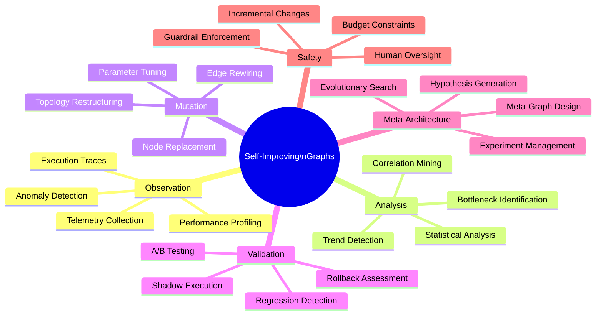
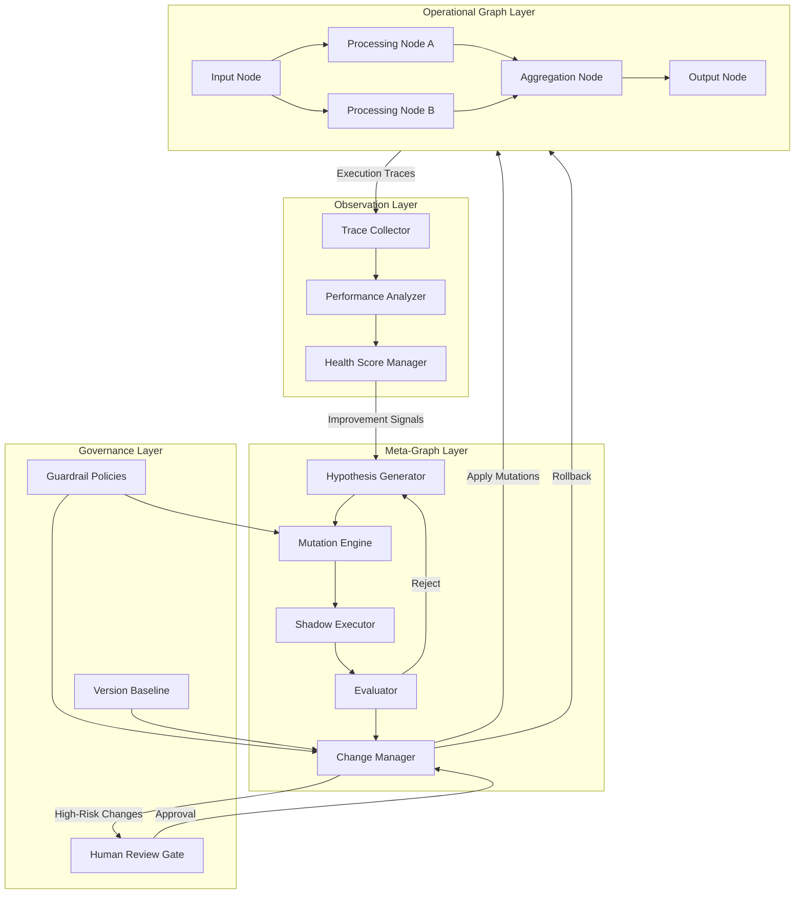
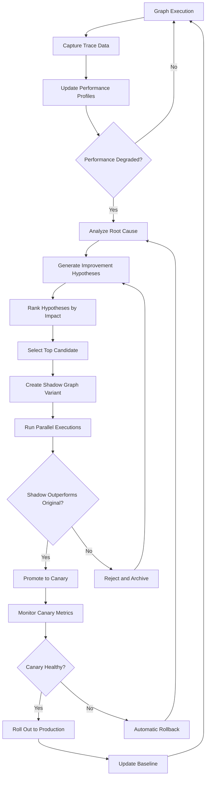
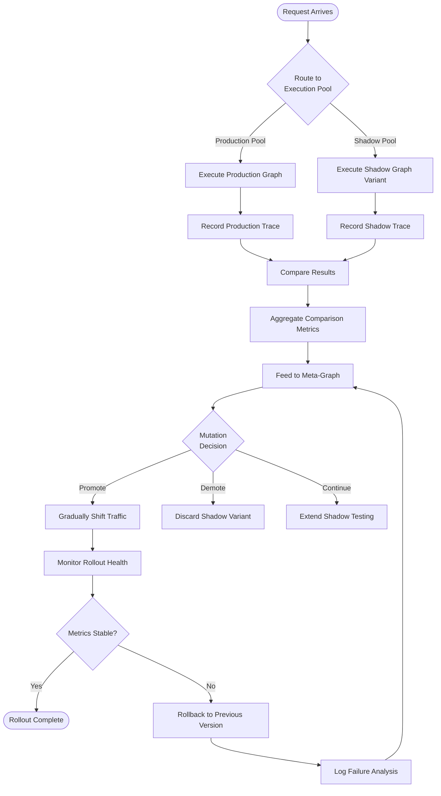
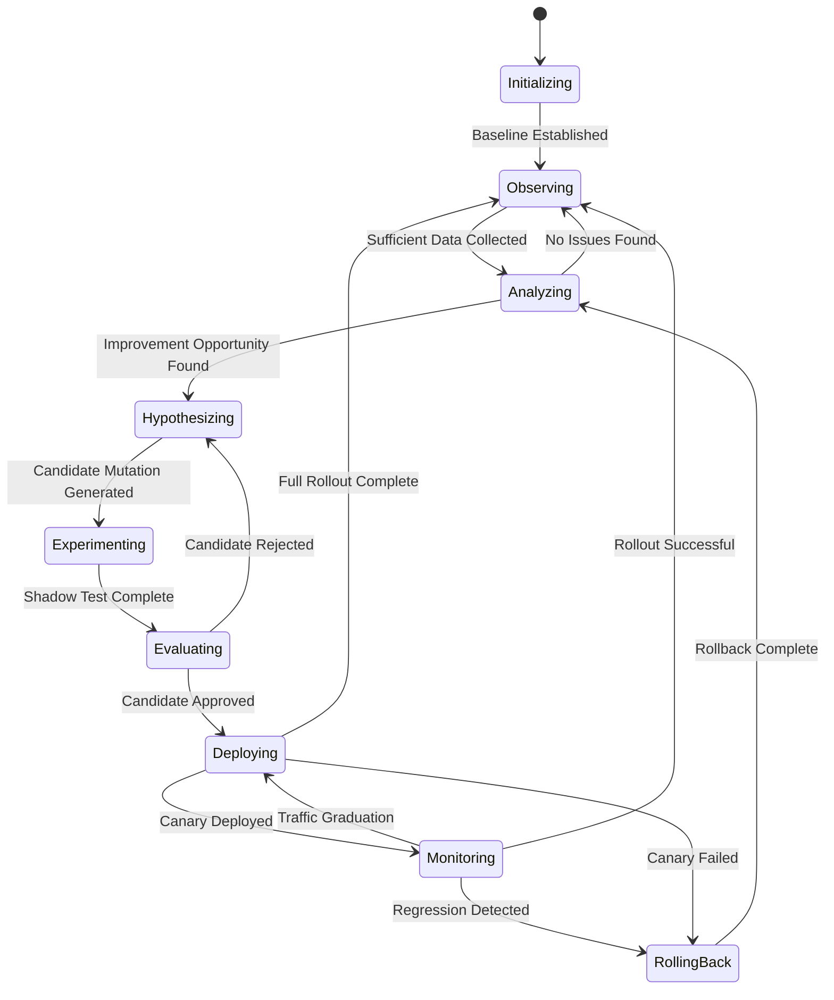
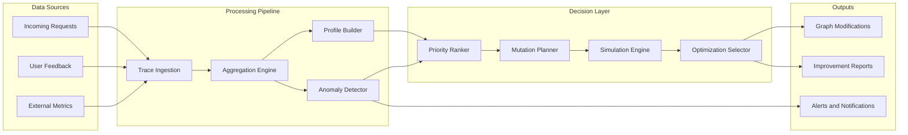
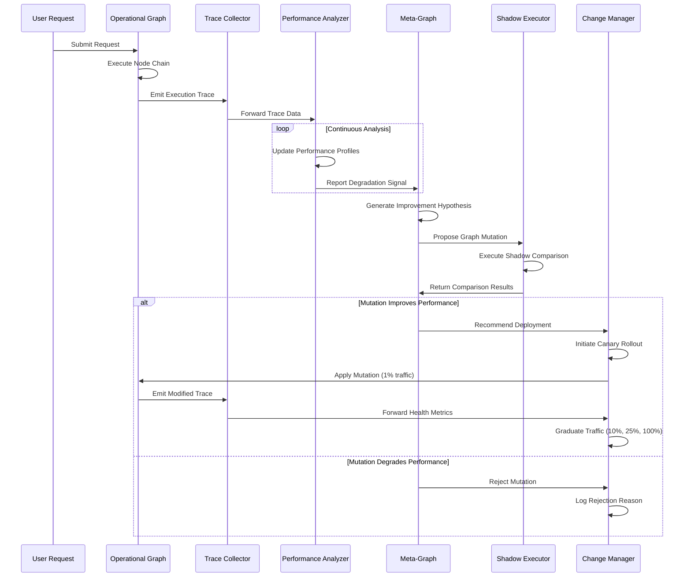

# Self-Improving Graphs

## 📌 Overview

Self-Improving Graphs represent one of the most advanced frontiers in graph engineering, where graph-based systems gain the ability to modify, optimize, and evolve their own structure and behavior over time. Unlike static graph topologies that require manual intervention to update, self-improving graphs embed reflection, evaluation, and mutation capabilities directly into the graph runtime. These systems monitor their own execution traces, identify inefficiencies, and apply targeted modifications to enhance performance without human oversight. The concept draws inspiration from compiler optimization passes, evolutionary algorithms, and neural architecture search, but adapts these ideas specifically for the domain of interconnected AI prompts, tools, workflows, and agent systems.

At their core, self-improving graphs treat the graph itself as a mutable artifact that can be versioned, benchmarked, and iteratively refined. Each execution generates valuable telemetry data—latency measurements, error rates, output quality scores, and resource consumption metrics—that feeds back into a meta-layer of evaluation nodes. These meta-nodes analyze accumulated performance data and decide when and how to restructure the graph. This creates a powerful feedback loop where the system becomes progressively more efficient, accurate, and resilient with every cycle of execution and reflection. The result is a living architecture that adapts to changing workloads, user patterns, and environmental conditions.

The significance of self-improving graphs extends beyond mere optimization. They embody a fundamental shift from treating AI pipelines as fixed engineering artifacts to treating them as dynamic, learning systems. This paradigm enables organizations to deploy graph-based workflows that improve autonomously, reducing maintenance burden while simultaneously increasing system quality. Whether applied to prompt chains that refine their own wording, agent networks that reorganize their communication pathways, or tool orchestration graphs that optimize their execution order, self-improving graphs represent the convergence of graph engineering and machine learning in a deeply practical way.

## 🎯 Learning Objectives

By studying Self-Improving Graphs, practitioners will develop the ability to design graph systems that incorporate built-in self-assessment and self-modification capabilities. You will learn to architect meta-evaluation layers that can objectively measure graph performance across multiple dimensions including accuracy, latency, cost, and user satisfaction. Understanding these patterns enables you to build systems that autonomously detect when a graph component is underperforming and trigger appropriate remediation actions, whether that involves rewiring connections, replacing nodes, or adjusting parameters.

You will gain proficiency in implementing graph mutation patterns that safely modify running graph topologies without introducing regressions or breaking existing dependencies. This includes learning rollback strategies, A/B testing at the graph level, and progressive rollout techniques for structural changes. You will also understand how to design execution trace collection systems that capture the right granularity of telemetry data to fuel meaningful self-improvement decisions without imposing excessive overhead on the primary graph execution path.

Additionally, you will explore the design of meta-graphs—higher-order graph structures whose purpose is to observe, evaluate, and optimize other graphs. You will learn how evolutionary strategies can be applied to graph topology search, how reinforcement learning signals can guide structural decisions, and how to establish guardrails that prevent self-modification from producing unsafe or degraded behaviors. These skills are essential for anyone building production-grade AI systems that must operate reliably over extended periods while continuously improving.

## 🧠 Definition

A Self-Improving Graph is a graph-based computational system that incorporates self-observation, self-evaluation, and self-modification mechanisms into its runtime architecture, enabling it to iteratively optimize its own structure, node configurations, edge routing, and execution strategies based on accumulated performance data and feedback signals. The system maintains a dual-layer architecture: the primary operational graph that performs the intended task, and a meta-graph that monitors, analyzes, and modifies the operational graph. This dual structure creates a closed-loop control system where the graph's own behavior becomes the input that drives its evolution.

Self-improvement in this context encompasses several distinct but related capabilities. Structural mutation refers to adding, removing, or rewiring nodes and edges in the graph topology. Parametric optimization involves adjusting the configuration, weights, thresholds, or prompts associated with individual nodes without changing the graph structure. Routing optimization focuses on improving how data and control flow traverse the graph, potentially discovering shorter or more reliable execution paths. Behavioral adaptation covers changes to node logic itself, such as updating prompt templates, refining decision boundaries, or modifying tool invocation strategies based on observed outcomes.

The defining characteristic that separates self-improving graphs from merely configurable or manually optimized graphs is the autonomy of the improvement cycle. While humans may set the initial objectives, constraints, and safety boundaries, the graph itself determines the specific modifications to make, when to make them, and how to validate their effectiveness. This requires the system to maintain rich execution histories, perform statistical analysis on performance trends, generate and evaluate candidate modifications, and manage the safe deployment of approved changes—all as integral parts of the graph runtime.

## ❓ Why It Matters

Self-Improving Graphs matter because they address one of the most persistent challenges in deploying AI systems at scale: the maintenance and optimization burden that grows linearly with system complexity. Traditional graph-based workflows require dedicated engineering teams to monitor performance, identify bottlenecks, and push updates—a process that is slow, expensive, and prone to human oversight gaps. Self-improving graphs automate this entire cycle, transforming maintenance from a periodic manual activity into a continuous automated process that responds to degradation in real-time rather than waiting for the next scheduled review.

In rapidly evolving AI landscapes, the optimal graph structure for a given task can change frequently as new models become available, user patterns shift, and data distributions drift. A prompt chain that performed excellently last month may underperform today due to model updates or changing query patterns. Self-improving graphs provide a mechanism for systems to adapt to these changes autonomously, maintaining high performance without requiring constant human attention. This is particularly critical for production systems that serve millions of users and cannot afford prolonged periods of suboptimal performance between manual optimization cycles.

Furthermore, self-improving graphs unlock capabilities that are fundamentally impossible with static architectures. They can discover novel execution pathways that human designers would never consider, optimize for multi-objective trade-offs that are too complex for manual analysis, and continuously explore the design space to find global optima rather than settling for locally good configurations. This represents a paradigm shift from engineering as construction to engineering as cultivation—where practitioners define the growth conditions and constraints, and the system itself determines the optimal form within those boundaries.

## 🏛️ Core Concepts

The conceptual foundation of self-improving graphs rests on several interconnected ideas that together enable autonomous graph evolution. The first is the Observer-Mutator Pattern, which separates the concerns of monitoring graph performance from modifying graph structure. Observer nodes passively collect execution telemetry, while mutator nodes actively propose and apply structural changes. This separation ensures that the system can simultaneously monitor performance and implement improvements without creating feedback loops that distort measurements. The observer layer maintains a pristine view of system behavior, while the mutator layer operates with full awareness of the modification history and its effects.

The second core concept is Execution Trace Analysis, which provides the empirical basis for improvement decisions. Every node execution, edge traversal, and data transformation is recorded in a structured trace log that captures inputs, outputs, timestamps, resource usage, and outcome quality. These traces are aggregated into performance profiles for each node, edge, and path through the graph. Statistical analysis of these profiles reveals patterns such as consistently slow nodes, frequently failing paths, quality degradation trends, and correlation between input characteristics and output quality. This rich dataset forms the evidence base upon which all improvement decisions are grounded.

The third foundational concept is Safe Mutation Protocols, which govern how structural changes are proposed, validated, and deployed. Self-improvement without safety constraints risks catastrophic degradation through cascading failures or the introduction of subtle correctness bugs. Safe mutation protocols implement principles such as incremental change (modifying one element at a time), shadow execution (running modified and original versions in parallel), automatic rollback (reverting changes that degrade performance), and budget constraints (limiting the rate and scope of modifications). Together, these protocols ensure that the graph's pursuit of improvement does not compromise its reliability.

A fourth essential concept is the Meta-Graph Architecture, where a higher-order graph system oversees the optimization of one or more operational graphs. The meta-graph contains nodes for hypothesis generation (proposing potential improvements), experimentation (testing hypotheses in controlled conditions), evaluation (assessing results against objectives), and deployment (rolling out successful changes). The meta-graph itself may also be subject to self-improvement, creating a recursive optimization capability where the system learns not only how to improve its operational performance but also how to improve its improvement process.

## 🧩 Key Components

Self-improving graphs consist of several specialized components that work together to enable autonomous optimization. The **Execution Trace Collector** captures detailed records of every graph execution, including node-level timing data, input-output pairs, error conditions, and intermediate state transitions. This component must be designed for minimal performance overhead, typically using asynchronous logging and ring buffers to avoid impacting the primary execution path. The trace collector produces structured event streams that feed into downstream analysis components, maintaining chronological ordering and causal relationships between events.

The **Performance Analyzer** processes accumulated execution traces to generate actionable insights about graph behavior. It computes rolling statistics for each node and edge, identifies performance trends and anomalies, correlates failures with input characteristics, and produces health scores for different graph regions. The analyzer employs statistical techniques such as moving averages, exponential smoothing, percentile analysis, and change-point detection to distinguish between normal variance and genuine performance shifts that warrant intervention. Its output is a prioritized list of improvement opportunities with associated confidence levels.

The **Mutation Engine** is responsible for generating candidate graph modifications based on the analyzer's findings. It maintains a library of mutation operators such as node replacement (swapping an underperforming node with an alternative), edge rewiring (changing data flow paths), parameter tuning (adjusting node configurations), and topology restructuring (adding or removing nodes). Each mutation operator has preconditions that must be met, expected impact estimates, and risk assessments. The mutation engine generates a portfolio of candidate changes ranked by expected improvement and implementation risk.

The **Shadow Executor** provides a safe sandbox for testing proposed mutations without affecting the production graph. It creates parallel execution environments where modified graph versions can process real or synthetic workloads alongside the current production version. The shadow executor captures detailed comparison metrics between original and modified executions, enabling data-driven decisions about whether to promote a mutation to production. This component is critical for maintaining system reliability during the improvement process.

The **Change Manager** orchestrates the controlled rollout of approved mutations, implementing canary deployments, progressive traffic shifting, and automated rollback procedures. It maintains a version history of the graph topology, enables point-in-time restoration, and coordinates with monitoring systems to detect regressions in real-time. The change manager also enforces governance policies such as maximum modification rates, mandatory cooling-off periods between changes, and human approval requirements for high-risk modifications.

## 🧭 Mental Model

Think of a self-improving graph as a garden that tends to itself. The primary graph is like the garden's plant layout—flowers, pathways, irrigation channels, and garden beds all arranged to create a beautiful and productive ecosystem. The meta-graph is the gardener who observes which plants are thriving and which are struggling, then makes adjustments: pruning overgrown branches (removing redundant nodes), redirecting water flow (rewiring edges), replacing dying plants with hardier varieties (swapping underperforming components), and even experimenting with new arrangements in a small test plot before applying changes garden-wide.

Just as a skilled gardener does not make all changes at once but introduces modifications gradually while observing their effects, a self-improving graph applies mutations incrementally with continuous monitoring. The gardener knows that removing one plant might affect the pollination patterns for neighboring plants, just as the mutation engine understands that changing one node can ripple through the entire graph. The gardener also maintains a journal of what worked and what did not, building up institutional knowledge that guides future decisions—exactly as the meta-graph accumulates performance data to inform increasingly sophisticated improvement strategies.

This analogy extends to seasonal adaptation: just as gardens evolve through spring planting, summer growth, autumn harvest, and winter pruning, self-improving graphs cycle through phases of exploration (trying new configurations), exploitation (scaling successful patterns), consolidation (stabilizing around good solutions), and reflection (deep analysis of accumulated experience). The key insight is that both the garden and the graph are open systems that continuously interact with their environment, and their ability to adapt is what ensures long-term health and productivity.

## 🗺️ Mind Map

## 🏐️ Architecture Diagram

## 🔄 Workflow

## ⚙️ Internal Working

The internal operation of a self-improving graph follows a continuous cycle of observation, analysis, hypothesis generation, experimentation, and deployment. During the observation phase, every execution of the operational graph generates a detailed trace record that is appended to a time-series database. Each trace includes a unique execution identifier, timestamps for every node entry and exit, the complete input data, all intermediate outputs, any error conditions encountered, and a final outcome assessment. The trace collector uses a non-blocking append-only log to ensure that observation never impedes the primary execution path, even under high load conditions.

In the analysis phase, the performance analyzer processes batches of recent traces to update rolling performance profiles. For each node, it computes metrics such as average and p99 latency, success rate, output quality score distribution, and resource utilization. For each edge, it tracks data throughput, transformation fidelity, and propagation delay. The analyzer compares current metrics against historical baselines and configurable thresholds to identify statistically significant changes. It also performs cross-node correlation analysis to identify situations where poor performance in one node is caused by degraded inputs from an upstream node rather than an intrinsic problem with the node itself.

The hypothesis generation phase leverages the analysis results to propose specific, actionable improvements. The mutation engine maintains a catalog of transformation patterns, each with applicability conditions, expected impact models, and risk classifications. When the analyzer flags a problem area, the mutation engine matches it against applicable transformation patterns and generates concrete modification proposals. For example, if a node consistently shows high latency, the mutation engine might propose splitting it into smaller specialized nodes, replacing it with a more efficient alternative, caching its outputs for frequently repeated inputs, or pre-computing results during idle periods.

During the experimentation phase, proposed mutations are tested in shadow execution environments. The shadow executor creates a modified copy of the graph, routes a representative sample of incoming requests to both the original and modified versions, and captures comparative performance data. The evaluator component applies statistical significance tests to determine whether observed improvements are genuine or within the range of normal variance. Only mutations that demonstrate statistically significant improvement across multiple evaluation criteria are promoted to the deployment phase.

The deployment phase follows a progressive rollout strategy. Approved mutations are first deployed to a small percentage of traffic (typically 1-5%) as a canary release. The change manager monitors key performance indicators during the canary period, comparing them against pre-deployment baselines. If metrics remain healthy, traffic is gradually shifted to the modified graph in increments of 10-25%. At any point during rollout, if degradation is detected, the change manager automatically initiates a rollback to the previous version. This multi-stage deployment process ensures that self-improvement never compromises system reliability.

## 🔀 Execution Flow

## 📊 Lifecycle

## 📡 Data Flow

## 🤝 Interaction Flow

## 🌍 Real-World Analogy

Consider a professional kitchen in a high-end restaurant that operates as a self-improving graph. The kitchen's workflow—from receiving orders to plating dishes—is a graph of interconnected stations: the prep station, various cooking stations, the plating station, and the expediting station. Each station is a node, and the handoffs between stations are edges. In a traditional kitchen, this workflow remains fixed regardless of performance issues. In a self-improving kitchen, the head chef (meta-graph) continuously observes timing data, error rates (returned dishes), and customer satisfaction scores (execution outcomes).

When the meta-chef notices that the grill station consistently becomes a bottleneck during dinner service, triggering delays that cascade to plating and expediting, the improvement cycle activates. The meta-chef might hypothesize that splitting the grill station into two specialized nodes—one for searing and one for slow-cooking—would reduce contention. Before making this change permanently, the kitchen runs a shadow test during a slower service period, comparing the new layout against the old one using the same order mix. If the split station reduces overall ticket times without compromising quality, the change is rolled out progressively, starting with a single service before becoming permanent.

This analogy captures the essence of self-improving graphs: continuous observation, data-driven hypothesis generation, safe experimentation, and progressive deployment. Just as the kitchen evolves its layout based on what actually happens during service rather than what was planned on paper, self-improving graphs evolve based on real execution behavior rather than theoretical design assumptions.

## 💡 Practical Example

Imagine a customer support AI system built as a graph with nodes for intent classification, entity extraction, knowledge retrieval, response generation, and quality validation. Over time, the self-improving graph notices through execution traces that the entity extraction node frequently misidentifies product names when they appear in casual language (e.g., "my phone keeps dying" vs. "my iPhone 15 Pro has battery issues"). The performance analyzer detects that 23% of queries involving product complaints result in incorrect entity extraction, leading to irrelevant knowledge retrieval and ultimately poor response quality.

The meta-graph generates a hypothesis: inserting a paraphrasing node between intent classification and entity extraction would normalize casual language into more structured phrasing before entity extraction attempts to identify products. The mutation engine creates a shadow graph variant with the new node inserted, using a lightweight paraphrasing model. During shadow testing over 10,000 concurrent requests, the modified graph shows a 31% improvement in entity extraction accuracy and a 19% improvement in overall response quality scores, with only a 40ms increase in average latency.

The change manager promotes this mutation through the canary deployment pipeline, monitoring each stage for regressions. After successful graduation to 100% traffic, the system continues monitoring and discovers that the paraphrasing node itself has become a latency bottleneck for simple queries that do not need paraphrasing. The meta-graph then generates a new hypothesis: adding a conditional routing node that bypasses paraphrasing for queries already containing structured product references. This second mutation is tested, validated, and deployed, further improving performance. This cycle continues indefinitely, with each improvement building on previous optimizations.

## 🧪 Use Cases

Self-improving graphs find powerful application across numerous domains. In **AI-powered code review systems**, a graph of linting, analysis, and suggestion nodes can learn which suggestions developers actually accept and which they dismiss, gradually pruning ineffective checkers and promoting the most valuable ones to earlier positions in the pipeline. Over time, the system develops an optimized review sequence that maximizes actionable output while minimizing noise, all without manual tuning.

In **multi-stage data pipeline orchestration**, self-improving graphs can optimize the order and parallelism of transformations based on observed data characteristics. A pipeline processing diverse data sources might discover that certain transformation orders produce better results for specific data types, leading to dynamic reordering based on input classification. The graph might also learn to pre-warm compute resources for frequently occurring data patterns, reducing cold-start latency for common workload types.

For **conversational AI systems**, self-improving dialogue graphs can optimize conversation flows by identifying paths that lead to successful resolution versus those that result in user frustration and escalation. The graph might discover that certain clarification questions are more effective when asked earlier in the conversation, or that specific handoff criteria between automated and human agents produce better outcomes. These insights drive structural modifications to the conversation graph that improve resolution rates over time.

In **automated testing pipelines**, self-improving graphs can learn which test sequences are most effective at catching regressions for different types of code changes. The graph reorganizes its test selection and prioritization nodes based on historical failure data, ensuring that the most informative tests run first while eliminating redundant or consistently passing tests that consume resources without adding coverage value.

## ⚖️ Comparison

| Aspect | Static Graphs | Configurable Graphs | Self-Improving Graphs |
|--------|--------------|-------------------|----------------------|
| **Modification** | Manual code changes | Parameter adjustment via config | Autonomous structural and parametric changes |
| **Optimization** | Periodic human review | Predefined rule-based tuning | Continuous data-driven optimization |
| **Adaptation Speed** | Days to weeks | Hours (config deployment) | Minutes to hours (automated) |
| **Improvement Source** | Human expertise | Human-defined rules | Execution data and meta-analysis |
| **Maintenance Burden** | High | Medium | Low (after initial setup) |
| **Risk Profile** | Changes tested before deploy | Changes bounded by config schema | Changes validated by shadow execution |
| **Discovery Capability** | Limited to human imagination | Limited to predefined rules | Can discover novel optimization strategies |
| **Complexity Overhead** | Low | Medium | High (meta-layer required) |

Self-improving graphs trade increased architectural complexity for dramatically reduced ongoing maintenance costs and superior long-term performance. While static and configurable graphs are appropriate for simple or stable workloads, self-improving graphs excel in dynamic environments where optimal configurations change frequently and the cost of manual optimization is prohibitive.

## ✅ Best Practices

Design self-improving graphs with clear, measurable objective functions that guide the improvement process. Define specific metrics for success—such as latency percentiles, accuracy thresholds, cost budgets, or quality scores—and ensure that the meta-graph optimizes against these explicit objectives rather than pursuing vague notions of "better." Well-defined objectives prevent the system from optimizing for irrelevant metrics or making changes that improve one dimension at the unacceptable expense of another. Establish multi-objective scoring functions that balance competing concerns like speed versus accuracy, and set minimum thresholds that no modification may violate.

Implement comprehensive shadow execution capabilities that enable thorough testing of proposed mutations before they affect production traffic. Shadow testing should use statistically significant sample sizes and cover diverse input conditions, not just average-case scenarios. Include edge cases, failure conditions, and load spikes in the shadow testing regime to ensure that proposed improvements are robust across the full range of operating conditions. Maintain historical shadow test results to build institutional knowledge about which types of mutations tend to succeed or fail.

Establish strong governance policies that define the boundaries of autonomous modification. While self-improvement implies autonomy, responsible deployment requires human-defined constraints on what changes are permissible, how frequently they can occur, and what the maximum scope of any single modification may be. Implement mandatory human approval gates for high-risk changes such as modifications to security-critical nodes, changes that affect data privacy, or structural alterations that could impact system availability. Create clear escalation procedures for situations where the self-improvement cycle cannot find a satisfactory solution.

Maintain comprehensive version history and rollback capabilities for every graph modification. The ability to quickly revert to any previous version is the ultimate safety net for self-improving systems. Implement immutable version snapshots before each modification, with efficient storage strategies that balance retention length against storage costs. Design the system so that rollback can be initiated manually, automatically (in response to detected regressions), or conditionally (based on rollback policies triggered by specific metric thresholds).

## ❌ Common Mistakes

The most dangerous mistake in building self-improving graphs is allowing unconstrained mutation without adequate safety mechanisms. Systems that can modify themselves without limits risk entering degenerate states where the graph becomes increasingly complex, brittle, or inefficient due to accumulated modifications that individually seemed beneficial but collectively created an unsustainable architecture. This is analogous to software bloat in manually maintained systems, but it can happen much faster when modifications are automated. Always implement mutation budgets, complexity limits, and periodic architectural review processes that can identify and correct structural drift.

Another frequent error is optimizing for proxy metrics rather than true objectives. If the meta-graph optimizes for latency reduction but ignores output quality, it may discover that simply skipping processing nodes produces excellent latency numbers at the cost of useless outputs. Ensure that objective functions capture the full spectrum of desired system behavior and that no critical dimension is left unmeasured. Implement sanity checks that verify the semantic validity of improvements, not just their statistical significance.

A third common mistake is insufficient statistical rigor in the evaluation of proposed mutations. Systems that promote changes based on small sample sizes or without proper significance testing will make many decisions based on noise rather than signal, leading to frequent unnecessary modifications and rollbacks. Implement proper hypothesis testing with appropriate significance levels, confidence intervals, and minimum sample sizes. Use sequential testing methods that can detect both improvements and degradations early while controlling for false positive rates across multiple comparisons.

## 🚀 Advanced Topics

Recursive self-improvement represents the frontier of this field, where the meta-graph itself becomes subject to self-improvement. In this architecture, a meta-meta-graph observes the meta-graph's improvement decisions and optimizes the improvement strategy itself. For example, if the meta-graph consistently generates ineffective hypotheses for certain types of problems, the meta-meta-graph might modify the hypothesis generation logic to explore different solution spaces. This recursive structure creates a hierarchy of optimization layers, each improving the layer below it, potentially leading to exponential improvement trajectories. However, recursive self-improvement also amplifies risks, requiring increasingly sophisticated safety mechanisms at each level.

Federated self-improvement extends the concept across multiple graph instances operating in different environments or serving different user populations. Each instance runs its own improvement cycle but shares learned mutations and their outcomes with other instances through a federation protocol. This enables cross-pollination of improvements: a mutation that works well in one environment can be tested and potentially adopted by others. Federated approaches also enable collective learning where patterns observed across many instances reveal improvement opportunities that no single instance could detect on its own, similar to federated learning in machine learning.

Evolutionary graph search applies genetic algorithm principles to graph topology optimization. The meta-graph maintains a population of candidate graph variants, each with different structures or configurations. Variants that perform well are selected as parents for the next generation, and their characteristics are combined through crossover operations (merging structural elements from different variants) and mutation operations (introducing random structural variations). Over many generations, this evolutionary process explores the design space more broadly than incremental improvement alone, potentially discovering fundamentally superior architectures that would never be reached through sequential refinement.

Transfer learning for graph structures enables self-improving graphs to leverage optimization knowledge gained from one graph to accelerate the improvement of another. When a new graph is deployed, it can initialize its meta-graph with policies, mutation operator preferences, and structural priors learned from similar graphs in the same domain. This dramatically reduces the cold-start period where a new self-improving graph must learn from scratch, allowing it to benefit from the collective experience of all previously deployed systems. Transfer learning is particularly valuable in organizations that deploy many similar graph-based systems across different clients or use cases.