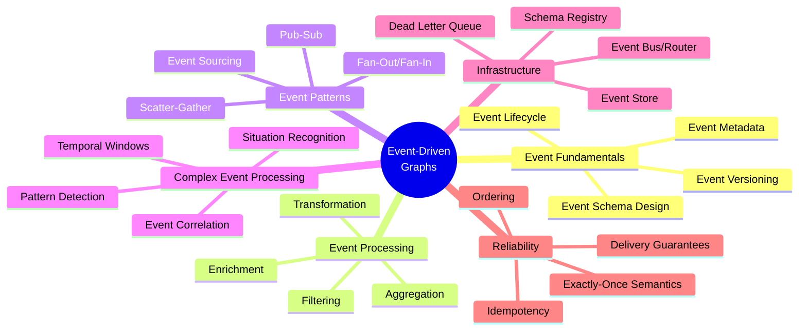
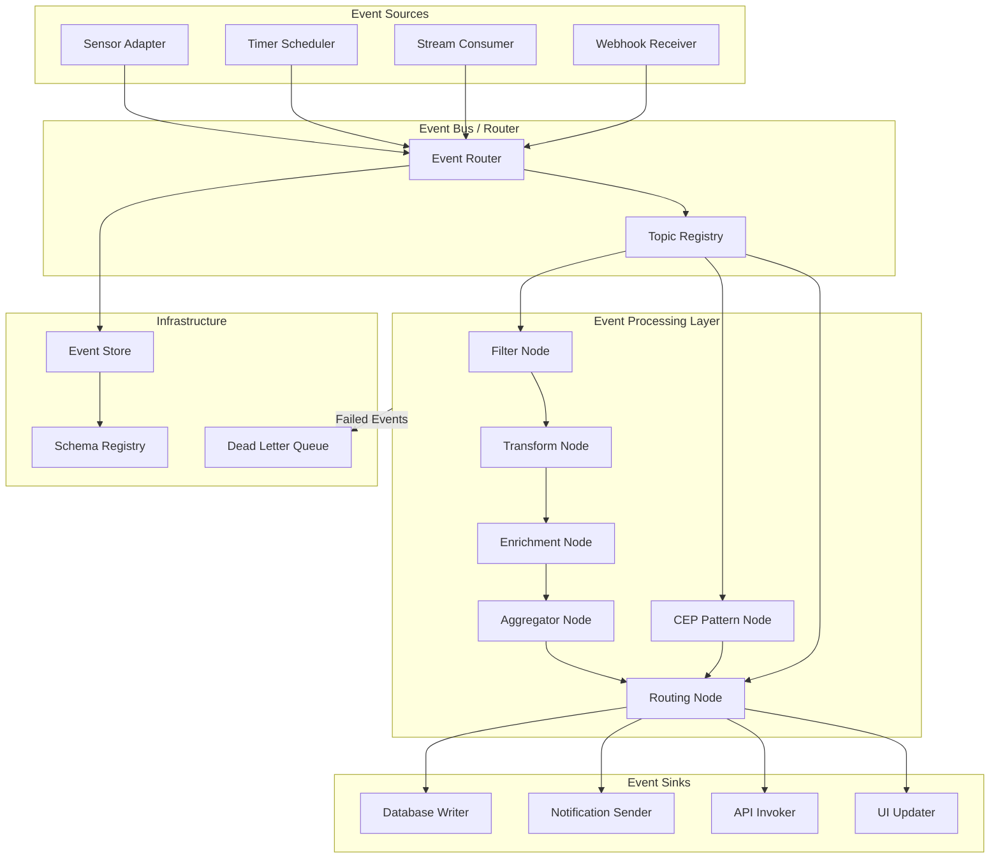
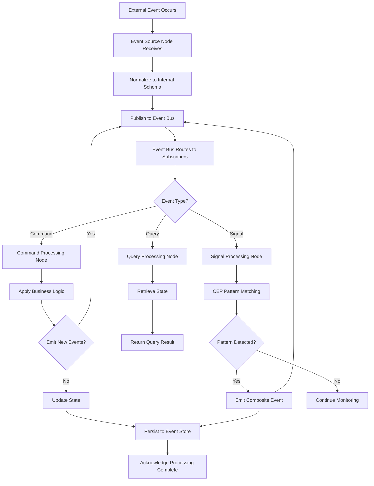
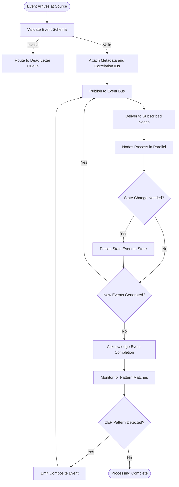
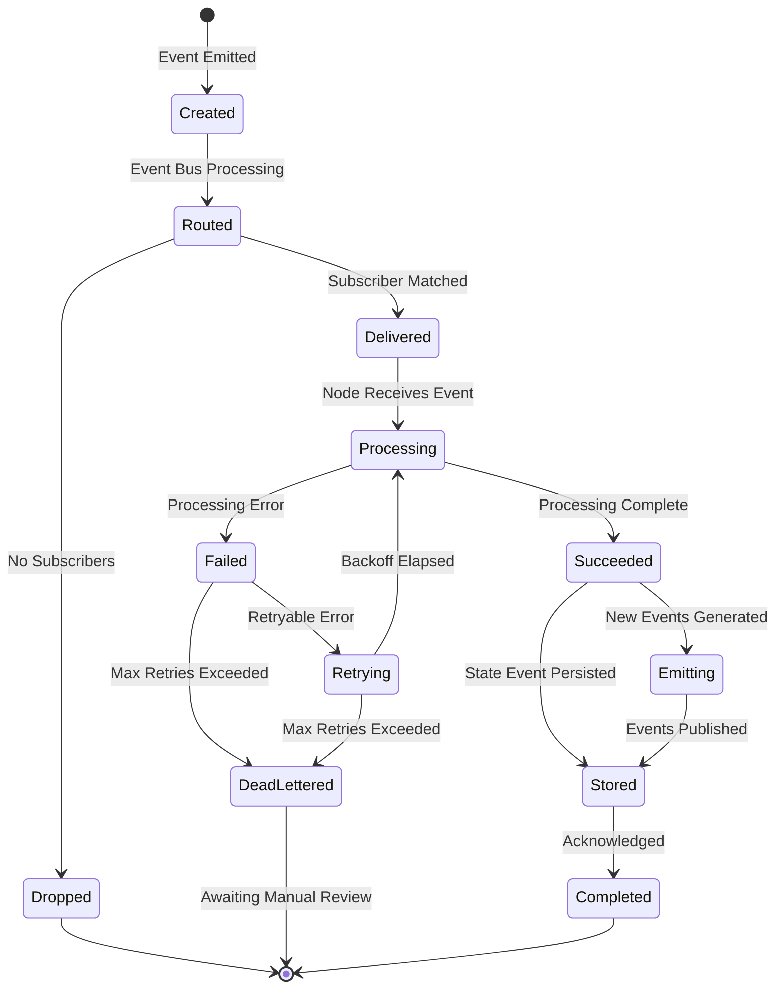
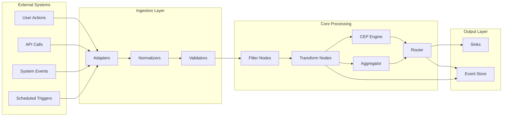
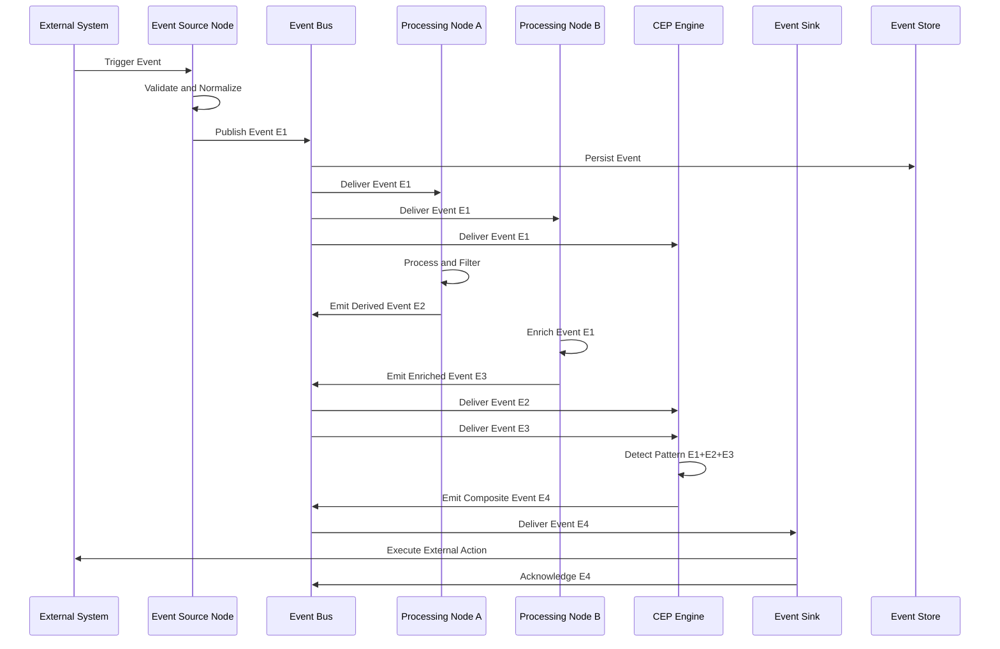

# Event-Driven Graphs

## 📌 Overview

Event-Driven Graphs represent a paradigm where graph-based AI systems are triggered, directed, and controlled by discrete events rather than by synchronous request-response cycles or fixed schedules. In this architecture, nodes within the graph remain idle until specific events activate them, creating a highly responsive and loosely coupled system that can react to external stimuli in real time. Events serve as the fundamental unit of communication between graph components, carrying structured payloads that trigger state transitions, initiate processing pipelines, and propagate information across the graph topology. This approach naturally aligns with the inherently event-driven nature of real-world AI applications, where user actions, system alerts, data arrivals, and environmental changes all manifest as discrete occurrences that demand immediate attention.

The power of event-driven graphs lies in their ability to decouple the producers of information from the consumers of that information. In a traditional request-driven graph, node A must explicitly call node B, creating tight temporal and structural coupling. In an event-driven graph, node A publishes an event, and any number of nodes that have registered interest in that event type can react independently. This decoupling enables massive scalability, as new event consumers can be added without modifying existing producers, and it enables flexible routing patterns where the same event can trigger different processing paths depending on the current system state or event context.

Event-driven graph architectures are particularly well-suited for AI systems that must operate in dynamic, unpredictable environments. A prompt processing graph that activates only when new documents arrive for analysis, an agent orchestration graph that responds to incoming user messages, or a tool coordination graph that triggers workflows based on external API callbacks all benefit from the event-driven approach. By making events the primary control flow mechanism, these systems achieve natural integration with the broader event-driven infrastructure that dominates modern software architecture, including message queues, event streams, and pub-sub systems.

## 🎯 Learning Objectives

By studying Event-Driven Graphs, you will learn to design graph systems where execution is naturally triggered and guided by events rather than explicit invocation chains. You will understand how to identify the events that should drive your graph's behavior, how to structure event schemas that carry the right information between nodes, and how to design event processing nodes that can handle the inherent asynchrony and unpredictability of event-driven execution. These skills are fundamental for building AI systems that integrate naturally with modern event-driven architectures and real-time data pipelines.

You will develop proficiency in implementing event correlation techniques that allow your graph to detect meaningful patterns across multiple related events. This includes temporal correlation (events occurring within a time window), causal correlation (events that are logically related through cause and effect), and contextual correlation (events that share common attributes such as user ID or session identifier). You will learn how Complex Event Processing (CEP) principles can be embedded directly into graph nodes, enabling the graph to recognize high-level situations from low-level event streams and trigger appropriate responses.

Additionally, you will master event sourcing patterns as applied to graph systems, where the complete history of graph state changes is captured as an immutable event log. This enables powerful capabilities such as temporal queries (asking what the graph state was at any point in time), event replay (reconstructing graph state by reprocessing historical events), and audit trails (providing complete provenance for every graph decision). You will also learn to handle the unique challenges of event-driven execution, including event ordering, exactly-once processing semantics, and event schema evolution over time.

## 🧠 Definition

An Event-Driven Graph is a graph-based computational system whose execution lifecycle is primarily controlled by the arrival, processing, and propagation of discrete events. Events are immutable records of something that has happened, carrying a structured payload of relevant data along with metadata such as timestamps, source identifiers, and correlation IDs. In an event-driven graph, nodes function as event processors that subscribe to specific event types, apply transformations or decisions to incoming events, and optionally emit new events that propagate to downstream nodes. The graph's topology defines the event routing relationships: which nodes receive which events and in what order.

Event-driven graphs are characterized by several distinguishing properties. First, they are inherently asynchronous—the producer of an event does not wait for consumers to process it. Second, they are loosely coupled—event producers and consumers are unaware of each other's implementation details, connected only by the event schema they share. Third, they are stateful in their processing—nodes typically maintain internal state that accumulates across multiple events, enabling pattern recognition and temporal reasoning. Fourth, they support fan-out and fan-in patterns—a single event can trigger multiple processing paths, and multiple events can converge to trigger a single downstream action.

The concept extends beyond simple publish-subscribe messaging to encompass rich event processing semantics. Event filtering nodes selectively forward events based on content criteria. Event transformation nodes modify event payloads, enrich them with additional data, or restructure them for downstream consumers. Event aggregation nodes combine multiple related events into composite events that represent higher-level occurrences. Event correlation nodes detect patterns across event sequences, such as detecting that three failed login attempts followed by a successful login constitutes a potential security incident. Together, these processing capabilities enable event-driven graphs to function as sophisticated event processing engines with the added structure and composability of graph-based architecture.

## ❓ Why It Matters

Event-Driven Graphs matter because they bridge the gap between the event-driven reality of production systems and the graph-based architecture of AI workflows. Modern AI systems rarely operate in isolation—they must integrate with user interfaces, external APIs, databases, messaging systems, and monitoring infrastructure, all of which communicate through events. Building graph systems that are natively event-driven eliminates the impedance mismatch between the AI layer and the surrounding infrastructure, reducing integration complexity and enabling seamless real-time responsiveness.

The event-driven approach also provides natural scalability characteristics. Event-driven graphs can process events at the rate they arrive, naturally handling bursty workloads through event buffering and backpressure mechanisms. Individual nodes can be scaled independently based on the event volume they process, and the graph topology can be reconfigured without shutting down the entire system. This elasticity is essential for AI systems that experience variable demand, such as customer support graphs that handle peak loads during business hours or content analysis graphs that must process sudden influxes of new documents.

Furthermore, event-driven graphs enable a fundamentally different relationship between AI systems and their environment. Rather than the AI system polling for work or waiting for explicit invocations, it becomes a living participant in the event ecosystem, reacting to the same events that drive the rest of the organization's operations. This enables AI systems to provide contextual, timely responses that are grounded in the actual flow of business events—processing an order the instant it is placed, flagging an anomaly the moment sensor data arrives, or initiating a customer retention workflow the second a churn signal is detected. This real-time integration is increasingly a competitive differentiator rather than a nice-to-have.

## 🏛️ Core Concepts

The foundational concept of event-driven graphs is the Event Schema, which defines the structure, semantics, and metadata of events that flow through the graph. A well-designed event schema includes both a payload section containing the business data relevant to the event and a metadata section containing information needed for routing, correlation, and processing. Event schemas must be designed for evolvability, as the needs of the graph will change over time. Schema versioning strategies, backward compatibility rules, and schema registries are essential infrastructure for managing the evolution of event contracts across the graph's lifecycle.

Event Sourcing is a core pattern where the graph's state is derived entirely from a sequence of events rather than being stored directly. Each state change is captured as an event in an append-only log, and the current state is reconstructed by replaying these events. In the context of event-driven graphs, this means that the complete execution history of the graph is preserved, enabling powerful capabilities. You can query what the graph knew at any point in time, reconstruct how a particular decision was made by tracing the events that led to it, or even rebuild the entire graph state by replaying historical events through a fresh instance.

Complex Event Processing (CEP) is the discipline of identifying meaningful patterns across multiple events, often in real time. In event-driven graphs, CEP capabilities are embedded in specialized nodes that consume event streams and detect patterns such as sequences (event A followed by event B within 5 minutes), absence (event A occurs without event B within a timeout window), conjunction (events A and B both occur regardless of order), and negation (event A occurs but event B does not follow). CEP nodes in the graph can transform low-level atomic events into high-level composite events that trigger meaningful downstream actions.

Event Correlation is the mechanism by which the graph determines which events are related to each other and should be processed together. Correlation is typically achieved through correlation identifiers embedded in event metadata, such as a session ID that links all events from a single user interaction, or a process ID that links all events from a single workflow execution. Correlation enables the graph to maintain contextual awareness across event sequences, ensuring that an event processing node has access to the full history of related events when making decisions. Without effective correlation, the graph would treat each event in isolation, losing the contextual richness that comes from understanding event sequences.

## 🧩 Key Components

The **Event Bus** or **Event Router** is the central nervous system of an event-driven graph, responsible for delivering events from producers to consumers according to routing rules. The event bus implements pub-sub semantics, allowing nodes to subscribe to specific event types or event patterns. It handles message delivery guarantees (at-least-once, at-most-once, exactly-once), maintains event ordering where required, and manages subscription lifecycle as nodes join and leave the graph. The event bus may be implemented as an in-memory dispatcher for single-process graphs or as a distributed message broker for distributed deployments.

**Event Source Nodes** are specialized graph nodes that generate events from external triggers. These might include webhook receivers that convert incoming HTTP requests into graph events, stream consumers that read from external event sources like Kafka or RabbitMQ, sensor adapters that convert hardware signals into structured events, or timer nodes that generate periodic events for scheduled processing. Event source nodes are responsible for normalizing diverse external event formats into the standardized event schema used within the graph, ensuring consistent processing regardless of the event origin.

**Event Processing Nodes** form the computational core of the graph, each subscribing to one or more event types and implementing specific processing logic. Processing nodes may filter events (forwarding only those matching certain criteria), transform events (modifying payloads or enriching with additional data), aggregate events (combining multiple events into composite results), or route events (directing events to different downstream paths based on content). Each processing node maintains its own subscription configuration, processing state, and error handling strategy, functioning as an independent unit of computation within the larger graph.

**Event Sink Nodes** are the output endpoints of the graph, responsible for translating graph-internal events into external actions. Sinks might send notifications via email or messaging platforms, write results to databases or data lakes, invoke external APIs, update user interfaces through WebSocket connections, or trigger workflows in other systems. Event sinks handle the impedance mismatch between the graph's internal event format and the specific protocols and formats required by external systems, ensuring clean integration boundaries.

The **Event Store** is a persistent, append-only log that records every event processed by the graph. It serves multiple purposes: providing durability guarantees (events are not lost if the system fails), enabling event replay (reprocessing historical events through modified graph versions), supporting temporal queries (examining the graph's state at any past point), and providing audit trails (demonstrating exactly what happened and when). The event store is the foundation for event sourcing patterns and is critical for debugging, compliance, and system recovery.

The **CEP Engine** is a specialized component (often implemented as a set of graph nodes) that performs complex event pattern matching across event streams. It maintains sliding time windows, tracks event sequences, evaluates pattern conditions, and emits composite events when patterns are detected. The CEP engine enables the graph to reason about event relationships that span time and multiple event sources, transforming raw event streams into meaningful situational awareness.

## 🧭 Mental Model

Imagine a newsroom where the entire operation is driven by incoming news feeds. Reporters (event source nodes) monitor various channels—wire services, social media, tip lines—and when a significant story breaks, they file a report (emit an event). Editors (event processing nodes) receive these reports based on their beat assignments: a business editor subscribes to financial news events, a sports editor to athletic events. Each editor applies their expertise (processing logic) to the incoming reports, perhaps combining multiple related reports about the same story (event aggregation) or flagging developing patterns like a series of factory accidents in the same region (event correlation).

When an editor identifies a story that meets certain criteria, they pass it to the layout team (event routing), who might send it to different sections of the newspaper (event sinks) based on its nature—a breaking news alert goes to the digital team for immediate publication, a feature story goes to the weekend magazine team, and an investigative lead goes to the deep-dive team. Throughout this process, every decision, every report, and every editorial action is recorded in the newsroom's archive (event store), creating a complete record that can be reviewed later to understand how and why a particular story was handled the way it was.

This newsroom analogy captures the key characteristics of event-driven graphs: the flow is driven entirely by incoming events (news), processing is distributed across specialized nodes (editors) that subscribe to relevant event types, the same event can trigger multiple independent responses (different editorial treatments), and the complete history is preserved for retrospective analysis. The newsroom does not poll for news—it reacts to it—and neither does an event-driven graph.

## 🗺️ Mind Map

## 🏗️ Architecture Diagram

## 🔄 Workflow

## ⚙️ Internal Working

The internal operation of an event-driven graph begins when an event source node detects an external trigger and converts it into a standardized internal event. The source node validates the incoming data against the expected schema, attaches metadata such as a unique event ID, a timestamp, a source identifier, and any correlation identifiers derived from the context. The normalized event is then published to the event bus, which consults its subscription registry to determine which nodes should receive this event type.

The event bus delivers the event to all subscribed processing nodes, respecting any configured delivery guarantees. For at-least-once delivery, the bus may redeliver events if acknowledgment is not received within a timeout. For ordered delivery within a correlation group, the bus ensures that events with the same correlation ID are delivered to each subscriber in the order they were published. The bus also handles subscription management, allowing nodes to dynamically subscribe to or unsubscribe from event types during graph execution.

When a processing node receives an event, it first checks its internal state for any relevant context from previously processed related events (identified through correlation IDs). It then applies its specific processing logic—filtering based on event content, transforming the payload, enriching it with data from external sources, or evaluating it against CEP pattern definitions. If the processing produces new events, these are published back to the event bus for delivery to downstream nodes. If the processing updates internal state, the state change is recorded as an event in the event store, maintaining the event sourcing invariant.

The CEP engine operates continuously, maintaining sliding time windows over incoming event streams and evaluating registered pattern definitions against the events within each window. When a pattern match is detected—such as three error events from the same source within five minutes—the engine emits a composite event representing the detected situation. This composite event enters the normal event flow and can trigger downstream processing nodes that handle the high-level situation rather than individual low-level events.

Event sink nodes receive events that have traversed the processing graph and translate them into external actions. Each sink is responsible for adapting the graph's internal event format to the specific protocol and data format required by the external system. Sinks also handle idempotency concerns, ensuring that if the same event is delivered multiple times (due to at-least-once semantics), the external action is performed only once. Failed sink operations route events to a dead letter queue for manual inspection and reprocessing, preventing transient failures from causing event loss.

## 🔀 Execution Flow

## 📊 Lifecycle

## 📡 Data Flow

## 🤝 Interaction Flow

## 🌍 Real-World Analogy

Consider an air traffic control system, which is perhaps the quintessential event-driven system. Radar stations continuously emit blip events (aircraft positions), pilots transmit radio events (communications), weather stations generate weather events (conditions), and airports broadcast status events (runway availability). The air traffic control system does not poll each of these sources—events flow continuously, and controllers (processing nodes) react to them in real time.

A conflict detection system (CEP node) monitors the stream of position events and correlates them across aircraft, detecting when two aircraft are on converging paths that will bring them too close together. When this pattern is detected, the CEP node emits a conflict alert event, which is routed to the responsible controller's display (event sink). The controller processes this alert and issues a heading change instruction, which becomes a new radio event flowing back into the system. The complete event history is recorded (event store) for later analysis of incident response and safety improvement.

This analogy perfectly illustrates event-driven graph principles: the system operates entirely through event flow, multiple event types from diverse sources are correlated to detect meaningful situations, responses to situations generate new events that enter the flow, and the complete event history is preserved for analysis. The air traffic control system does not stop and ask for updates—it continuously processes the event stream and reacts to emerging patterns in real time.

## 💡 Practical Example

Consider a real-time fraud detection system built as an event-driven graph for an e-commerce platform. The graph receives events from multiple sources: transaction events (purchases, refunds, transfers), account events (login, password change, profile update), device events (new device registration, IP geolocation change), and behavioral events (browsing patterns, cart modifications, session duration changes).

A correlation node links events sharing the same account ID, building a temporal picture of each user's activity. A CEP node monitors correlated event streams for fraud patterns: a rapid sequence of high-value transactions from a new device in a different country, followed by an immediate password change and a large gift card purchase. This pattern—individually, each event might be benign, but together they strongly suggest account takeover—triggers a composite "suspected fraud" event.

The fraud event routes through a decision node that assesses confidence score and transaction value. High-confidence, high-value cases trigger an immediate account freeze event (sent to the account management sink), a notification event (sent to the security team sink), and a case creation event (sent to the investigation workflow sink). Medium-confidence cases trigger enhanced authentication events that require additional verification from the user before proceeding. Low-confidence cases are logged for model training purposes. The entire event history for any account can be reconstructed from the event store, providing complete auditability for regulatory compliance and investigation.

## 🧪 Use Cases

Event-driven graphs excel in **real-time analytics and monitoring** scenarios where AI systems must process continuous streams of data and detect patterns as they emerge. An infrastructure monitoring graph might receive events from servers, applications, and network devices, use CEP nodes to detect performance degradation patterns, and trigger automated remediation workflows when specific threshold patterns are observed. The graph can evolve to incorporate new event types and detection patterns as the monitored infrastructure changes.

In **conversational AI systems**, event-driven graphs naturally model the asynchronous, message-based nature of human-computer dialogue. Each user message is an event that triggers the dialogue graph, which may invoke intent recognition nodes, context retrieval nodes, response generation nodes, and feedback collection nodes. The event-driven approach handles the inherent unpredictability of conversation timing, supports multiple concurrent conversations through correlation IDs, and enables the system to react to non-verbal events such as user inactivity timeouts or session resumption signals.

For **supply chain orchestration**, event-driven graphs coordinate complex workflows spanning multiple organizations and systems. Order events, shipping events, inventory events, and demand forecast events flow through a graph that applies business rules, detects exceptions (such as delayed shipments that will cause stockouts), and triggers corrective actions (such as rerouting shipments or adjusting production schedules). The event sourcing capability provides complete traceability from customer order to final delivery, with every decision and state change recorded as an immutable event.

In **content moderation systems**, event-driven graphs process streams of user-generated content events, applying multiple analysis nodes in parallel—text classification, image analysis, behavioral pattern detection—and correlating results to make moderation decisions. The graph can adapt to emerging content trends by adding new event processing nodes and CEP patterns without disrupting the existing moderation pipeline.

## ⚖️ Comparison

| Aspect | Request-Driven Graphs | Polling-Based Graphs | Event-Driven Graphs |
|--------|----------------------|---------------------|---------------------|
| **Trigger** | Explicit invocation | Periodic checking | Event arrival |
| **Coupling** | Tight (caller knows callee) | Medium (poller knows source) | Loose (producers and consumers decoupled) |
| **Responsiveness** | Immediate (when invoked) | Delayed (poll interval) | Immediate (event push) |
| **Scalability** | Limited by caller capacity | Wasted resources on empty polls | Natural elasticity via event buffering |
| **State Management** | Often explicit | Often explicit | Natural via event sourcing |
| **Debugging** | Request-scoped tracing | Time-interval analysis | Full event history replay |
| **Integration** | Point-to-point | Polling endpoints | Native pub-sub integration |
| **Complexity** | Lower | Medium | Higher (ordering, delivery guarantees) |

Event-driven graphs offer superior responsiveness, scalability, and integration capabilities compared to alternatives, but they introduce complexity in areas such as event ordering, delivery guarantee management, and debugging of distributed asynchronous flows. The choice between approaches depends on the specific requirements of the system, with event-driven graphs being the clear choice for real-time, loosely coupled, and highly integrated AI systems.

## ✅ Best Practices

Design event schemas for long-term stability and evolvability from the outset. Use explicit version fields in event schemas and maintain backward compatibility when making changes. Adopt a schema registry that documents all event types, their versions, and the consumers that depend on them. When schema changes are necessary, use additive modifications (adding optional fields) rather than breaking changes (removing or renaming fields), and plan migration paths that allow producers and consumers to upgrade independently. This disciplined approach to schema management prevents the compatibility cascades that can paralyze event-driven systems.

Implement robust idempotency in all event processing nodes. Because event delivery guarantees like at-least-once mean that nodes may receive the same event multiple times, every processing operation must be idempotent—producing the same result whether executed once or multiple times. Use deduplication keys derived from event IDs, employ idempotent write operations (such as upserts rather than inserts), and track processed event IDs in each node's state to detect and skip duplicate deliveries. Idempotency is not optional in event-driven systems; it is a fundamental requirement for correctness.

Structure your graph to minimize event fan-out complexity and maximize independent processing. While event-driven architectures naturally support fan-out (one event triggering multiple downstream paths), uncontrolled fan-out can create exponential event multiplication that overwhelms the system. Design event routing to be selective, use aggregation nodes to consolidate results from parallel paths, and implement circuit breakers that limit event propagation when downstream nodes are overwhelmed. Balance the desire for comprehensive event processing against the practical need to manage event volume.

Leverage event sourcing comprehensively by making the event store the single source of truth for all graph state. Avoid maintaining separate state databases alongside the event store, as this creates consistency challenges and undermines the benefits of event sourcing. When state queries are performance-critical, build materialized views from the event store using event replay, but always derive the authoritative state from the event log. This ensures that the graph's complete history is preserved and that state can always be reconstructed accurately.

## ❌ Common Mistakes

A prevalent mistake is treating events as simple messages without considering their role as the authoritative record of state changes. When events are used merely as notification mechanisms without proper persistence and ordering guarantees, the system loses the powerful capabilities that event sourcing provides. Events should be treated as immutable facts that fully describe what happened, carrying enough information to reconstruct any downstream state without requiring additional queries to external systems.

Another common error is neglecting event ordering requirements, particularly for events within the same correlation group. If a user's events arrive out of order (e.g., a "session ended" event arrives before the "session started" event), processing nodes may make incorrect decisions. Implement partition-based ordering that guarantees in-order delivery for events sharing a correlation ID, even when the overall event stream is processed in parallel across multiple nodes. This requires careful key selection for event partitioning and an understanding of the ordering guarantees provided by your event bus implementation.

A third frequent mistake is creating event processing nodes that are too coarse-grained, attempting to handle multiple event types and processing concerns in a single node. This leads to monolithic processing logic that is difficult to test, evolve, and scale independently. Design each node to handle a single event type or a closely related set of event types, with a single clear responsibility. This enables targeted scaling (adding instances of only the bottleneck node), independent deployment (updating one node's logic without affecting others), and simplified debugging (tracing a specific event type through a focused processing path).

## 🚀 Advanced Topics

Event Schema Evolution strategies address the challenge of changing event structures over time without breaking existing consumers. Advanced approaches include schema translation layers that automatically convert between schema versions, dual-write strategies where producers emit events in both old and new formats during migration periods, and consumer-side schema reconciliation that allows different consumers to process the same event using different schema versions simultaneously. Schema evolution in event-driven graphs requires coordination across all producers and consumers, making it fundamentally more challenging than in request-driven systems where caller and callee can be updated together.

Distributed event-driven graphs span multiple processes, machines, or even data centers, with the event bus implemented as a distributed message broker. This introduces challenges in exactly-once processing semantics, distributed state management, and graph-wide consistency. Advanced implementations use distributed transaction protocols, consensus algorithms for event ordering, and partitioned event stores that maintain ordering guarantees within partitions while allowing parallel processing across partitions. Techniques such as event sourcing combined with snapshotting reduce the cost of state reconstruction in distributed environments.

Event-driven graph choreography versus orchestration represents an architectural spectrum. In choreography, nodes react to events independently without a central coordinator, leading to highly decoupled but potentially difficult-to-understand flows. In orchestration, a central workflow engine directs event processing, providing clear visibility but introducing a single point of coordination. Hybrid approaches combine elements of both, using choreography for routine event processing and orchestration for complex multi-step workflows that require centralized coordination. The choice between choreography and orchestration affects the graph's resilience, observability, and evolvability.

Causal event ordering extends traditional temporal ordering by ensuring that events are processed in causal order, not just in the order they were received. If event A causes event B (e.g., a user registration event causes a welcome email event), then B should always be processed after A, regardless of network delays or partitioning. Implementing causal ordering requires embedding causal dependency metadata in events and using dependency-aware scheduling in the event bus. This is particularly important in AI systems where causal relationships between events carry semantic significance that would be lost with purely temporal ordering.