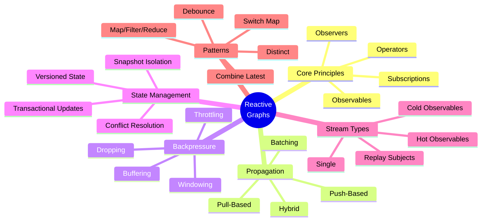
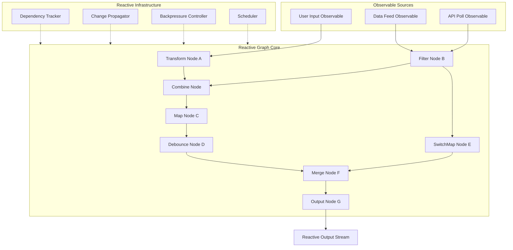
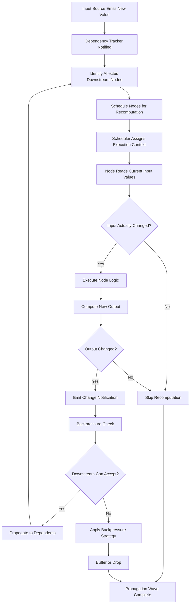
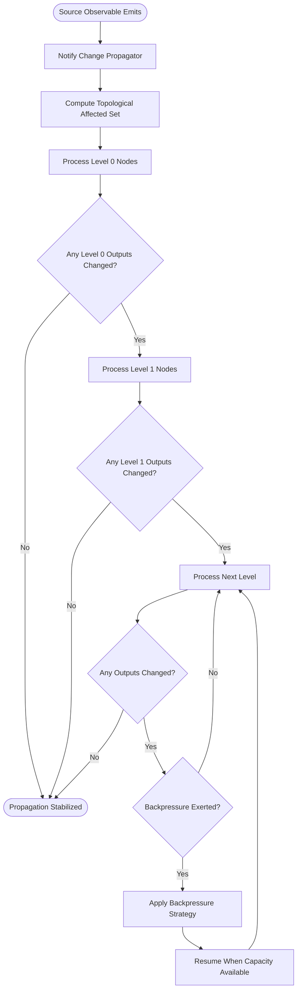
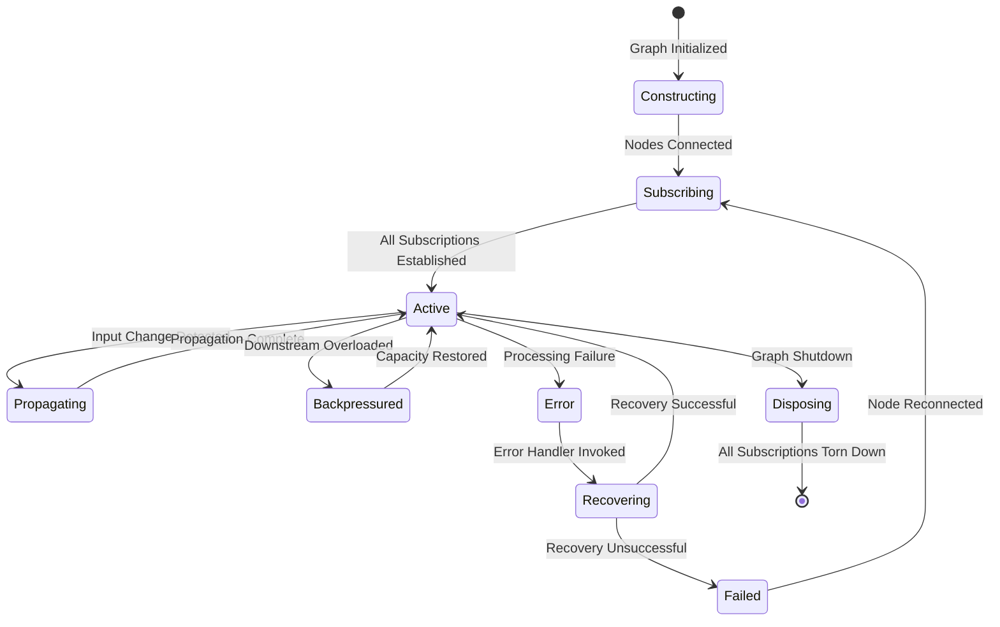
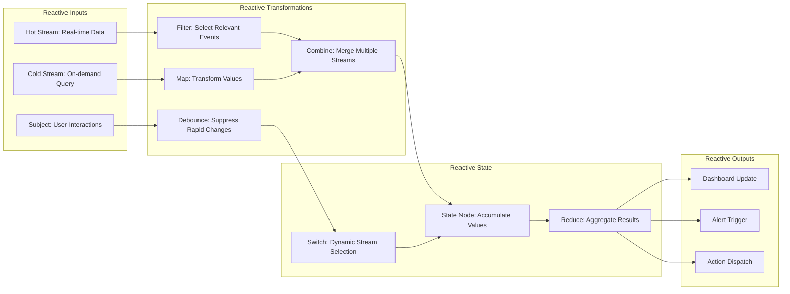
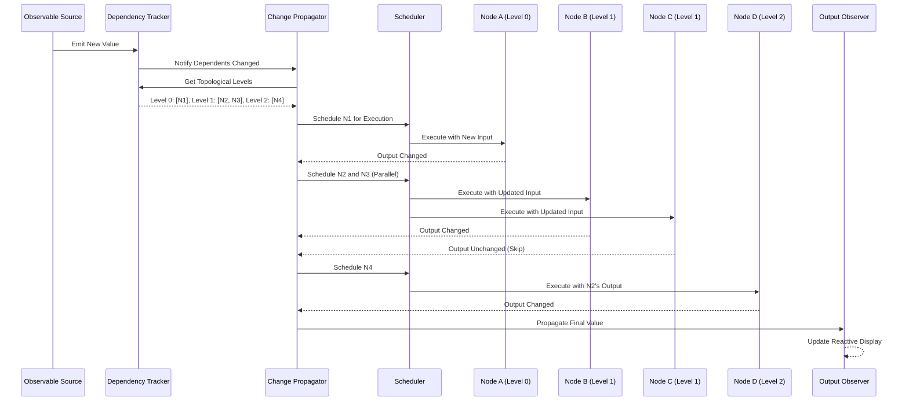

# Reactive Graphs

## 📌 Overview

Reactive Graphs apply the principles of reactive programming to graph-based AI systems, creating architectures where data changes propagate automatically through the graph topology, and nodes respond to changing inputs with minimal latency and maximum efficiency. In a reactive graph, nodes do not pull data on demand or wait for explicit invocations—they observe their input sources and react immediately when those sources change. This creates a system where the graph functions as a living network of interconnected observers, each node continuously maintaining an up-to-date view of its outputs based on the current state of its inputs. The result is a graph that is always ready to provide current results without requiring explicit refresh or recomputation.

The reactive paradigm brings several powerful properties to graph engineering. First, it eliminates the need for manual state synchronization between nodes, as changes propagate automatically through the graph's dependency structure. Second, it enables fine-grained incremental computation, where only the nodes affected by a change need to re-execute, rather than recomputing the entire graph. Third, it provides natural support for continuous data streams, allowing the graph to process real-time data as a first-class concern rather than as a special case. These properties make reactive graphs particularly well-suited for AI systems that must maintain up-to-date outputs in response to continuously changing inputs.

The application of reactive principles to graph engineering creates a distinctive architectural style that differs significantly from both imperative (step-by-step execution) and event-driven (trigger-based execution) approaches. Reactive graphs maintain a persistent, living representation of their computation that is always current, rather than executing discrete runs that produce point-in-time results. This persistent computation model aligns naturally with applications such as real-time dashboards, streaming analytics, interactive AI assistants, and adaptive agent systems where the system must continuously reflect the current state of its environment.

## 🎯 Learning Objectives

By studying Reactive Graphs, you will learn to design graph systems where data changes automatically propagate through the topology, triggering recomputation only where necessary. You will understand how to implement observable nodes that emit change notifications when their state or output changes, and how to build dependent nodes that subscribe to these notifications and update themselves accordingly. This knowledge enables you to build systems that maintain real-time consistency across complex AI pipelines without the overhead of full recomputation.

You will develop proficiency in managing reactive data flows, including techniques for handling multiple concurrent change propagation waves, preventing infinite update loops through cycle detection and signal stabilization, and optimizing propagation paths to minimize unnecessary recomputation. You will learn how backpressure mechanisms work in reactive graph systems, enabling downstream nodes to communicate their processing capacity to upstream nodes and preventing resource exhaustion when data changes arrive faster than they can be processed.

Additionally, you will master reactive state management patterns that provide consistent, predictable behavior in the face of concurrent and overlapping state changes. You will learn to distinguish between different reactive stream types—hot observables that represent ongoing data sources and cold observables that represent one-time computations—and understand how these distinctions affect graph behavior. You will also explore how reactive graphs integrate with modern reactive programming frameworks and libraries, and how to leverage these tools to implement reactive graph systems efficiently.

## 🧠 Definition

A Reactive Graph is a graph-based computational system where nodes function as reactive observers that automatically propagate data changes through the graph topology, maintaining up-to-date outputs by incrementally recomputing only the affected portions of the graph in response to input changes. In this architecture, each node establishes observation relationships with its input dependencies, and when any dependency's output changes, the node automatically re-executes to update its own output. This creates a continuous, push-based data flow where changes ripple through the graph from their origin to all affected downstream nodes.

Reactive graphs are built on three foundational reactive programming concepts: observables, observers, and operators. Observables represent data sources that emit values over time—these might be user inputs, external data feeds, or the outputs of upstream graph nodes. Observers are the nodes that subscribe to observables and react to emitted values by executing their processing logic. Operators are the transformation functions applied within nodes that map input observables to output observables, supporting operations such as filtering, mapping, reducing, and combining multiple input streams.

The defining characteristic of a reactive graph is its automatic dependency tracking and change propagation. When a node's output changes, the graph runtime identifies all downstream nodes that depend on that output and schedules them for re-execution. This dependency graph of data flow relationships is distinct from (though often related to) the graph's structural topology. A node may structurally receive data from multiple upstream nodes but only actually depend on a subset of their outputs. The reactive runtime tracks these semantic dependencies to minimize unnecessary recomputation.

Reactive graphs also implement the concept of signal propagation, where changes are treated as signals that flow through the graph with specific propagation semantics. Signals may be synchronous (processing completes before the propagation continues) or asynchronous (processing is scheduled and propagation continues immediately). They may be buffered (accumulating multiple changes before propagating) or unbuffered (propagating each change immediately). The choice of propagation semantics significantly affects the graph's latency, throughput, and resource consumption characteristics.

## ❓ Why It Matters

Reactive Graphs matter because they eliminate the fundamental tension between data freshness and computational efficiency that plagues traditional graph architectures. In a pull-based or batch-based graph, there is always a trade-off between how frequently you recompute results and how much computational resources you consume. Recompute too rarely and your results become stale; recompute too frequently and you waste resources on redundant calculations. Reactive graphs resolve this tension by computing exactly when and where needed—only the affected nodes re-execute, and only when their inputs actually change.

For AI systems that operate in dynamic environments, this efficiency is not merely a performance optimization—it is an architectural necessity. A recommendation graph that must reflect real-time user behavior, a monitoring graph that must detect anomalies as sensor data arrives, or an agent graph that must adapt its strategy as environmental conditions change all require the kind of immediate, fine-grained responsiveness that reactive graphs provide. The alternative—polling for changes or recomputing on fixed schedules—introduces latency that may be unacceptable for time-sensitive AI applications.

Furthermore, reactive graphs provide a cleaner mental model for building complex AI systems. Instead of reasoning about when to trigger computations and how to keep state synchronized, developers can focus on defining the relationships between data sources and processing nodes, trusting the reactive runtime to handle propagation correctly. This declarative approach to graph engineering reduces the cognitive burden on developers and produces systems that are easier to reason about, debug, and maintain. The reactive paradigm also encourages a functional style of node implementation, where nodes are pure functions of their inputs, leading to more testable and predictable behavior.

## 🏛️ Core Concepts

The foundational concept of reactive graphs is the Observable-Observer relationship. An observable is a data source that can emit zero or more values over time, optionally terminating with a completion signal or an error. Each graph node that produces output acts as an observable, and each node that consumes input acts as an observer. The graph runtime manages the subscription relationships between observables and observers, ensuring that change notifications flow correctly through the dependency structure. Observables may be cold (starting fresh for each subscriber, like reading a file) or hot (broadcasting the same values to all subscribers, like a live data feed).

Signal Propagation defines how changes move through the graph. In push-based propagation, nodes actively push their output changes to downstream subscribers. In pull-based propagation, nodes mark themselves as dirty and downstream nodes pull updated values when they need them. Hybrid approaches combine both strategies, using push for immediate notification and pull for on-demand value retrieval. The propagation strategy affects latency (push is faster), efficiency (pull avoids unnecessary computation), and consistency (different strategies provide different guarantees about when all nodes reflect the latest changes).

Backpressure is the mechanism by which downstream nodes communicate their processing capacity to upstream nodes, preventing the system from being overwhelmed when data changes arrive faster than they can be processed. In a reactive graph, if a downstream node is slow to process incoming changes, it signals this to its upstream dependencies, which can then apply strategies such as buffering changes, dropping intermediate values (keeping only the latest), or reducing their own emission rate. Backpressure is essential for maintaining system stability under load and preventing cascading failures caused by resource exhaustion.

Reactive State Management refers to the patterns and mechanisms for maintaining consistent state across the graph in the presence of concurrent and overlapping changes. When multiple input changes arrive simultaneously, the reactive runtime must determine the correct order of propagation and ensure that nodes see a consistent snapshot of their inputs. This may involve batching simultaneous changes, implementing transactional propagation (where all affected nodes update atomically), or using versioned state (where each state update creates a new version, allowing readers to see consistent snapshots). The choice of state management strategy affects the graph's behavior under concurrent modification.

## 🧩 Key Components

The **Dependency Tracker** is the component that maintains the graph's reactive dependency structure, mapping each node to its upstream dependencies and downstream dependents. When a node is added to the graph, the dependency tracker analyzes its input requirements and establishes observation subscriptions with the appropriate upstream nodes. When a node is removed, the dependency tracker tears down its subscriptions and notifies downstream nodes that their dependency has been removed. The dependency tracker is also responsible for detecting cycles in the dependency structure, which would cause infinite update loops if not handled.

The **Change Propagator** manages the flow of change notifications through the graph. When a node's output changes, it notifies the change propagator, which identifies all downstream dependents and schedules them for re-execution. The propagator may use different scheduling strategies: breadth-first (processing all nodes at the current depth before moving deeper), depth-first (following a single path to its end before backtracking), or priority-based (processing the most critical nodes first). The propagator also handles deduplication, ensuring that a node scheduled multiple times due to multiple upstream changes is executed only once with all its pending input changes.

**Observable Nodes** are graph nodes that implement the observable interface, emitting their output as a stream of values that downstream nodes can subscribe to. Each observable node maintains a list of current subscribers and is responsible for notifying them when its output changes. Observable nodes may implement different emission strategies: eager (emitting immediately upon computation), deferred (emitting only when subscribers are present), or cached (emitting the most recent value to new subscribers immediately upon subscription). The choice of emission strategy affects the graph's startup behavior and resource usage.

**Operator Nodes** implement reactive transformation operators that map input observables to output observables. Common operator patterns include map (transforming each input value), filter (selectively forwarding values based on a predicate), debounce (suppressing rapid successive changes), distinct (suppressing duplicate values), combineLatest (merging the most recent values from multiple inputs), and switchMap (switching to a new inner observable when a new input arrives). Operator nodes are the building blocks of reactive processing logic and can be composed to create complex data transformation pipelines.

The **Backpressure Controller** manages flow control between nodes with different processing rates. It monitors the processing capacity of each node (measured by queue depth, processing latency, or resource utilization) and applies backpressure signals to upstream nodes when capacity is constrained. Backpressure strategies include buffer (queuing excess items until capacity is available), drop (discarding items when the buffer is full), latest (keeping only the most recent item and discarding older ones), and throttle (reducing the emission rate of upstream nodes). The backpressure controller ensures that the graph remains stable under varying load conditions.

The **Scheduler** controls the execution context for node re-execution, determining whether processing happens synchronously on the emitting thread, asynchronously on a separate thread pool, or on a dedicated scheduler for specific processing types (such as I/O-bound or CPU-bound operations). The scheduler is critical for preventing the reactive graph from blocking and for enabling parallel processing of independent change propagation paths. It also manages the priority of different propagation waves, ensuring that high-priority changes (such as user-triggered updates) are processed before lower-priority background updates.

## 🧭 Mental Model

Imagine a complex spreadsheet with thousands of cells, each containing formulas that reference other cells. When you change the value in one cell, the spreadsheet does not recompute every formula on the sheet—it identifies only the cells that depend (directly or transitively) on the changed cell and recomputes those. The change ripples outward from the modified cell through the dependency network, updating only what needs to be updated. This is precisely how a reactive graph works, but at the scale of AI processing nodes rather than spreadsheet cells.

Now extend this analogy to a live dashboard connected to real-time data feeds. Stock prices update continuously, each change triggering recomputation of portfolio values, risk metrics, and alert thresholds. A price change for one stock might affect the calculations for dozens of portfolios that hold that stock, each of which might trigger risk limit checks, rebalancing suggestions, or compliance alerts. The dashboard remains always current, but computation is precisely targeted—only the affected portfolios and their downstream metrics are recalculated.

The reactive graph is the generalization of this spreadsheet/dashboard model to arbitrary AI processing. Instead of cells, you have AI processing nodes. Instead of cell references, you have graph edges carrying observable data flows. Instead of formulas, you have node processing functions. And instead of a spreadsheet engine, you have a reactive runtime that tracks dependencies, propagates changes, and manages backpressure. The key insight is that the reactive paradigm lets you express complex AI systems as networks of relationships rather than sequences of steps, and the runtime handles the mechanics of keeping everything up to date.

## 🗺️ Mind Map

## 🏗️ Architecture Diagram

## 🔄 Workflow

## ⚙️ Internal Working

The internal operation of a reactive graph centers on the change propagation cycle that maintains all node outputs in a consistent, up-to-date state. When an observable source node emits a new value, the reactive runtime initiates a propagation wave. The dependency tracker consults its dependency graph to identify all nodes that directly or transitively depend on the changed source. These nodes are organized into topological levels, where nodes at level zero depend directly on the source, nodes at level one depend on level-zero nodes, and so on.

The change propagator processes nodes level by level, ensuring that a node is only re-executed after all its upstream dependencies have been updated. For each node, the propagator first checks whether any of its inputs have actually changed using value equality comparison. If no inputs have changed, the node is skipped entirely (a process known as short-circuit propagation). If inputs have changed, the node's processing function is invoked with the current input values, producing a new output. The new output is compared against the previous output, and only if they differ is a change notification emitted to downstream dependents.

The scheduler determines the execution context for each node re-execution. CPU-intensive nodes may be scheduled on compute-optimized thread pools, while I/O-bound nodes (such as those that fetch data from external sources) may be scheduled on I/O-optimized pools. The scheduler also manages concurrency within a single propagation wave: nodes at the same topological level that do not depend on each other can be executed in parallel, significantly reducing the total propagation latency for graphs with wide dependency structures.

Backpressure is continuously monitored throughout the propagation process. Each node maintains an internal buffer for incoming change notifications, and the backpressure controller monitors buffer utilization across the graph. When a node's buffer exceeds a threshold, the controller signals upstream nodes to reduce their emission rate. The specific backpressure strategy applied depends on the node's configuration and the nature of its processing: time-sensitive nodes might use a "latest" strategy (keeping only the most recent value), while accuracy-sensitive nodes might use a "buffer" strategy (queuing all values for sequential processing).

Cycle detection is a critical safety mechanism in reactive graphs. If node A depends on node B which depends on node A, a change to either node would trigger an infinite propagation loop. The dependency tracker analyzes the dependency structure when nodes are connected and rejects connections that would create cycles. For use cases that genuinely require cyclic dependencies (such as feedback loops in agent systems), the graph supports explicit cycle-breaking mechanisms such as delay nodes, snapshot reads, or convergence detectors that terminate propagation when values stabilize within a tolerance threshold.

## 🔀 Execution Flow

## 📊 Lifecycle

## 📡 Data Flow

## 🤝 Interaction Flow

## 🌍 Real-World Analogy

Consider a modern smart home system where various sensors and devices form a reactive graph. Temperature sensors emit continuous readings (hot observables), motion detectors emit discrete events, and smart thermostats, lights, and security systems are the reactive processing nodes. When the temperature sensor in the living room emits a new reading of 78°F, the change propagates through the dependency graph: the thermostat node recalculates its cooling strategy, the energy monitoring node updates its consumption projection, and the comfort optimization node adjusts its recommendations.

Crucially, not every temperature change triggers every downstream action. The thermostat node might have a debounce operator that suppresses changes within 0.5°F to avoid rapid cycling of the HVAC system. The energy monitoring node might use a throttle operator to update its projections only every 5 minutes. The security system's dependency graph is completely separate—it depends on motion sensors and door contacts, not on temperature readings—so it is entirely unaffected by temperature changes. This is reactive graph optimization in action: precise, efficient propagation of relevant changes to the nodes that actually need them.

Now imagine the homeowner opens a window, triggering the window sensor observable. The thermostat node receives this new input (combined with the current temperature via a combineLatest operator) and determines that cooling is now wasteful with the window open. It emits a new state that propagates to the HVAC control node, which suspends cooling. The energy monitoring node updates its projection, and the homeowner's mobile app (an output observer) displays the updated status. All of this happens automatically, in real time, without any explicit triggering or polling—a perfect illustration of reactive graph principles in a tangible, everyday context.

## 💡 Practical Example

Consider a real-time AI-powered writing assistant built as a reactive graph. The graph has observable sources for the user's current text (a text input observable that emits on every keystroke), the user's writing context (document type, audience, tone preferences), and external knowledge sources (style guides, terminology databases). These sources feed into a network of reactive processing nodes that provide continuous, up-to-date assistance.

The text input observable connects to a debounce node (suppressing rapid keystrokes and emitting only after 300ms of inactivity), which feeds a text analysis node that computes readability metrics, tone analysis, and grammar checks. These analysis results flow through filter nodes that suppress suggestions the user has previously dismissed, and through priority nodes that rank remaining suggestions by relevance. The combined suggestion stream is then displayed in the UI as an always-current sidebar that updates in real time as the user writes.

When the user changes the document type from "email" to "report," this change propagates through the graph. The tone analysis node recalculates with the new context, the style guide node switches to the appropriate corporate style guide, and the suggestion priority node re-ranks suggestions based on the new document type's priorities. All of this happens reactively—the user does not need to click "analyze" or wait for a processing cycle. The graph simply maintains its outputs as current reflections of its inputs, providing a seamless, responsive writing assistance experience.

## 🧪 Use Cases

Reactive graphs are exceptionally well-suited for **real-time AI dashboards** where multiple derived metrics must be continuously updated as underlying data changes. A financial trading dashboard might have observable sources for market data feeds, portfolio positions, and risk parameters, with reactive nodes computing real-time P&L, risk exposure, margin requirements, and compliance checks. Any change in market data or portfolio composition propagates through the dependency graph, updating all affected metrics in milliseconds while leaving unrelated metrics untouched.

In **adaptive AI agents**, reactive graphs enable the agent's decision-making to continuously adapt to changing environmental conditions. An autonomous driving agent's planning graph might have observable sources for sensor data (LIDAR, cameras, GPS), traffic information, and passenger preferences. Reactive nodes continuously update the agent's understanding of the environment, re-evaluate route options, and adjust driving behavior. The agent's decisions are always based on the freshest available information, without the latency of periodic polling or batch processing.

For **collaborative AI editing tools**, reactive graphs enable real-time synchronization of AI assistance across multiple users. Each user's cursor position, text selection, and edits are observable sources that feed into shared reactive nodes providing contextual suggestions, conflict detection, and consistency checking. When one user makes a change, the graph propagates the implications to all connected users' views in real time.

In **continuous model monitoring**, reactive graphs connect model inference outputs, ground truth arrival streams, and performance metric calculations into a self-updating monitoring system. As new inference results arrive and ground truth labels become available, the graph automatically updates accuracy metrics, drift indicators, and alert thresholds without requiring batch recomputation.

## ⚖️ Comparison

| Aspect | Imperative Graphs | Event-Driven Graphs | Reactive Graphs |
|--------|------------------|---------------------|-----------------|
| **Control Flow** | Explicit execution steps | Event-triggered execution | Change-propagated execution |
| **State Sync** | Manual | Event-correlated | Automatic via dependencies |
| **Computation** | Full recomputation | Targeted to event path | Incremental (affected nodes only) |
| **Data Freshness** | Point-in-time | Near real-time | Continuous / real-time |
| **Coupling** | Tight (call chains) | Loose (event contracts) | Structural (observable subscriptions) |
| **Backpressure** | Not applicable | Queue-based | Native reactive backpressure |
| **Cycle Handling** | Explicit loops | Event loops | Cycle detection / convergence |
| **Best For** | Batch processing | Discrete triggers | Continuous data flows |

Reactive graphs provide the most automated and fine-grained approach to data propagation but require careful design to avoid pitfalls such as unnecessary recomputation, memory leaks from unconsumed observables, and complexity in debugging cascading updates. They are the ideal choice when data freshness and responsiveness are paramount.

## ✅ Best Practices

Design your reactive graph's dependency structure to minimize unnecessary propagation by keeping dependency graphs narrow and shallow. Nodes should depend only on the inputs they genuinely need, and you should decompose complex nodes into smaller, focused nodes that can be independently updated. This fine-grained dependency structure allows the reactive runtime to skip large portions of the graph when changes occur in isolated regions, dramatically reducing computational overhead. Avoid creating nodes that depend on the entire graph state, as this forces full recomputation on every change.

Implement comprehensive backpressure handling from the beginning, not as an afterthought. Every reactive graph will eventually encounter situations where data changes arrive faster than they can be processed, and handling this gracefully is essential for system stability. Define backpressure strategies for each node based on its role: critical nodes should buffer and never drop, while non-critical display nodes can drop intermediate values. Test your backpressure handling under sustained high-load conditions to ensure the graph degrades gracefully rather than catastrophically.

Use appropriate reactive operators to control the frequency and granularity of propagation. Debounce rapid input changes when the downstream processing is expensive and the intermediate values are not needed. Use distinct to suppress duplicate values. Use throttle to limit the maximum propagation rate. These operators are not just convenience features—they are essential tools for managing the computational cost of reactive graphs and preventing unnecessary work that would waste resources and increase latency.

Ensure proper cleanup of observable subscriptions to prevent memory leaks. In reactive graphs, every subscription creates a reference that must be explicitly disposed when no longer needed. Failing to dispose subscriptions—particularly for long-lived observables like data feeds or user interaction streams—causes nodes to remain in memory and continue receiving updates even after they are logically no longer part of the graph. Implement subscription lifecycle management as a core part of your graph's node management, and use tools like subscription tracking and leak detection during development.

## ❌ Common Mistakes

The most insidious mistake in reactive graphs is creating hidden synchronous dependencies that defeat the purpose of reactive propagation. If a node's processing function directly queries another node's current value rather than subscribing to its observable output, it creates a synchronous coupling that bypasses the reactive runtime. This node will not be automatically notified of changes and will not participate in the reactive dependency graph, leading to stale results and inconsistent state. All inter-node data access must go through the observable subscription mechanism.

Another frequent error is neglecting to handle the completion and error signals that are part of the reactive contract. Observables can complete (signaling no more values will be emitted) or error (signaling an unrecoverable failure), and every observer must handle both cases. Failing to handle completion can leave nodes waiting indefinitely for updates that will never arrive, while failing to handle errors can leave the graph in an inconsistent state with some nodes updated and others not. Implement comprehensive error and completion handlers that propagate these signals appropriately through the graph.

A third common mistake is over-synchronizing reactive updates, converting what should be asynchronous, concurrent propagation into sequential, blocking processing. If every node in the propagation path blocks until its downstream dependents have finished processing, the graph loses the concurrency benefits that reactive architectures should provide. Use asynchronous scheduling and avoid blocking operations within node processing functions. Let the reactive runtime manage concurrency and ordering, and design nodes to be non-blocking and thread-safe.

## 🚀 Advanced Topics

Reactive graph debugging and observability present unique challenges because the system's behavior is driven by the timing and ordering of change propagation waves, which can be difficult to trace. Advanced debugging approaches include reactive dependency visualization tools that display the live dependency graph with highlighted propagation paths, time-travel debugging that allows developers to replay propagation histories and inspect intermediate values at any point, and reactive breakpoints that pause propagation at specific nodes to allow inspection. These tools are essential for understanding why a reactive graph is behaving unexpectedly.

Reactive graph composition involves building larger reactive graphs by composing smaller reactive subgraphs, each encapsulating a specific capability. This requires careful management of observable boundaries—determining which internal observables are exposed as external interfaces and how subscriptions are managed across composition boundaries. Advanced composition patterns include configurable subgraphs (where the internal topology is parameterized), dynamic subgraph switching (where the active subgraph changes based on runtime conditions), and recursive subgraphs (where a subgraph contains instances of itself for handling nested data structures).

Signal-based consistency models extend reactive graphs with formal guarantees about the consistency of node outputs during propagation. Linearizable consistency ensures that all nodes see a single, globally consistent order of changes. Eventual consistency allows temporary inconsistencies that resolve as propagation completes. Causal consistency ensures that causally related changes are seen in the correct order by all nodes. The choice of consistency model affects the graph's latency, complexity, and correctness guarantees, and different parts of the same graph may use different consistency levels based on their requirements.

Reactive machine learning integrates reactive graph patterns with online model inference, enabling models to update their predictions continuously as input features change. This includes reactive feature computation (where feature engineering is expressed as a reactive graph that incrementally updates features), reactive ensemble management (where multiple model predictions are combined reactively), and reactive model versioning (where model updates are rolled out through reactive propagation rather than explicit deployment). This integration creates AI systems that are inherently real-time and continuously up to date.