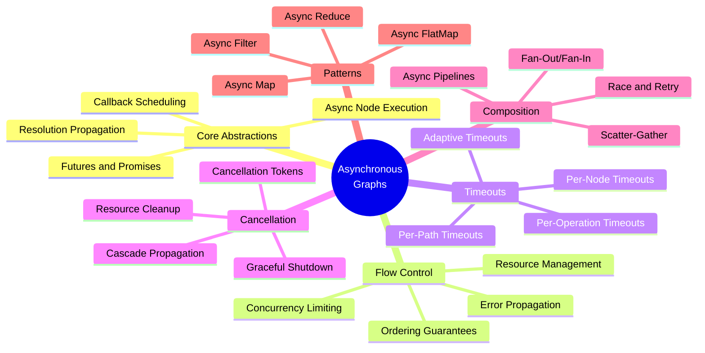
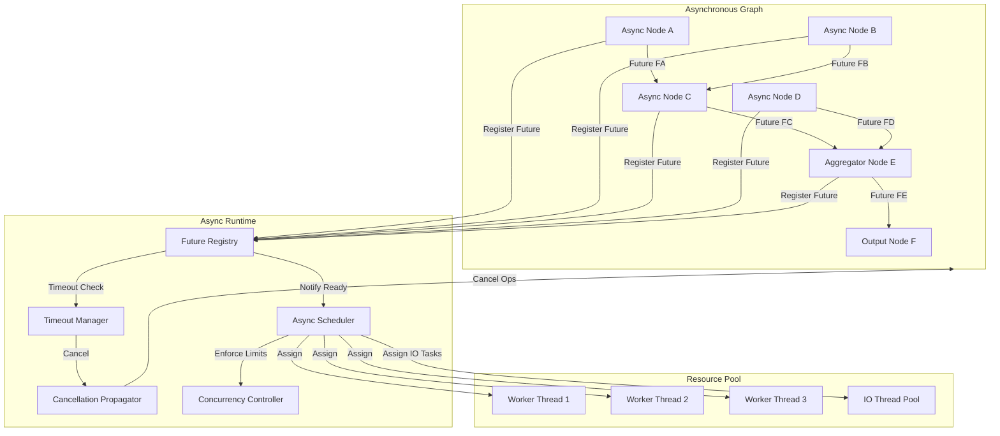
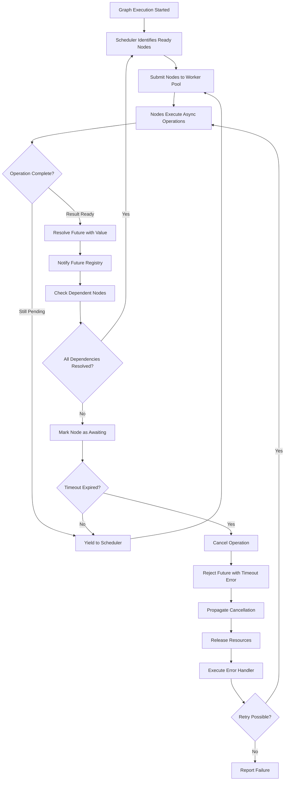
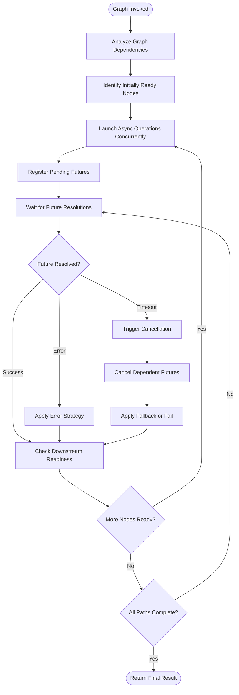
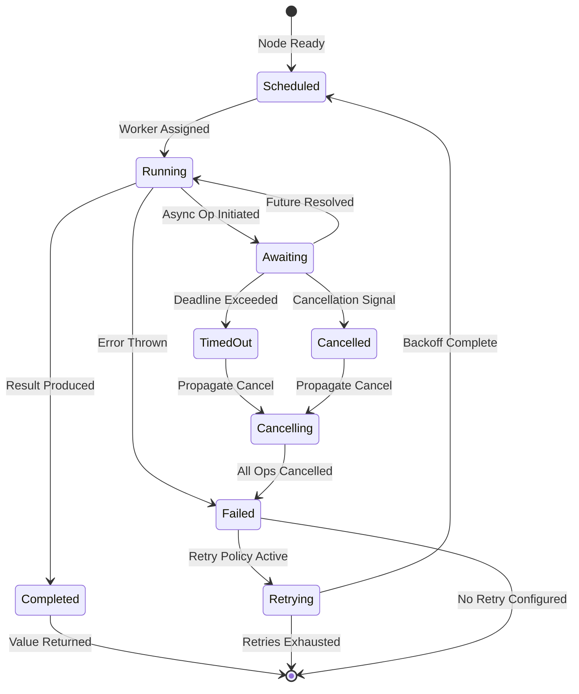
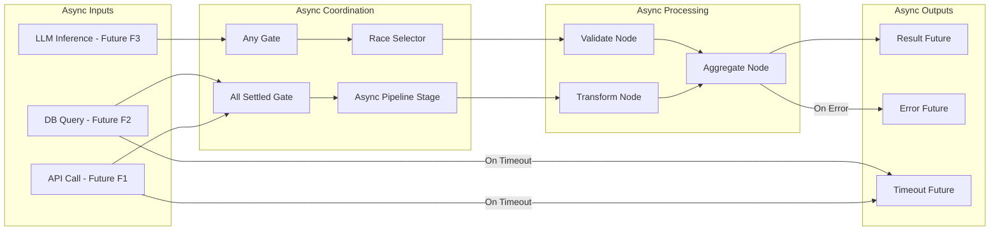
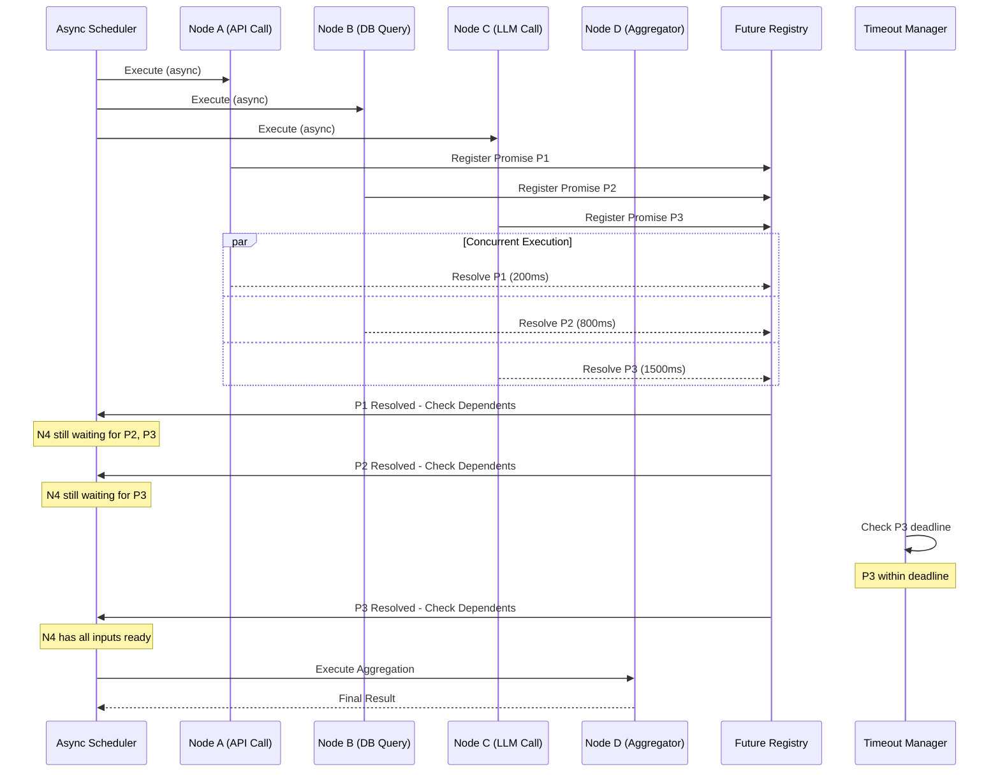

# Asynchronous Graphs

## 📌 Overview

Asynchronous Graphs address the fundamental reality that modern AI systems must interact with inherently asynchronous operations: external API calls that take unpredictable amounts of time, large language model inference that may require seconds to complete, database queries whose latency varies with load, and user interactions that happen at unpredictable intervals. Rather than forcing these operations into a synchronous execution model that wastes resources waiting for responses, asynchronous graph systems embrace the asynchrony, allowing nodes to initiate operations and continue processing other work while awaiting results. This approach dramatically improves throughput, resource utilization, and user-perceived responsiveness in graph-based AI systems.

The challenge of asynchrony in graph systems goes far beyond simply making individual node operations non-blocking. When nodes execute asynchronously, the graph must manage the complex coordination of multiple concurrent operations, handle the partial failure of asynchronous tasks, maintain consistency when results arrive out of order, and provide meaningful error handling when asynchronous operations time out or are cancelled. The graph's execution semantics must account for the fact that at any given moment, multiple nodes may be in various stages of execution—some waiting for external responses, some actively processing, and some producing outputs that downstream nodes are already awaiting.

Asynchronous graph engineering requires a comprehensive approach that encompasses async node execution models, futures and promises as the currency of async coordination, sophisticated flow control mechanisms that manage concurrency and ordering, robust timeout and cancellation handling, and composition patterns that allow complex async workflows to be built from simpler async building blocks. Together, these capabilities enable the construction of AI graph systems that can efficiently orchestrate dozens or hundreds of concurrent asynchronous operations while maintaining correctness, reliability, and predictable behavior.

## 🎯 Learning Objectives

By studying Asynchronous Graphs, you will learn to design graph systems that efficiently manage concurrent asynchronous operations across multiple nodes. You will understand the fundamental difference between concurrency and parallelism in the context of graph execution, and how to leverage async node execution to maximize throughput while maintaining correct ordering semantics. You will learn to implement node execution models that properly handle the lifecycle of async operations, from initiation through awaiting, timeout, cancellation, and completion.

You will develop proficiency with futures and promises as coordination primitives for asynchronous graph execution. You will understand how to represent pending node outputs as futures that downstream nodes can await, how to compose multiple futures into complex async workflows using patterns like all-settled (waiting for all operations regardless of success), any (proceeding with the first successful result), and race (proceeding with whatever completes first). You will also learn to handle the error propagation challenges unique to async graphs, where errors may originate from operations that are no longer on the call stack when they are detected.

Additionally, you will master advanced async composition patterns including fan-out/fan-in (launching multiple async operations and collecting their results), pipelines (chaining async operations where each stage processes results from the previous one), and scatter-gather (distributing work across multiple async workers and aggregating results). You will learn to implement sophisticated timeout and cancellation strategies that ensure resources are properly released and the graph can recover gracefully from partial failures. These skills are essential for building production-grade AI graph systems that interact with the real world's inherently asynchronous nature.

## 🧠 Definition

An Asynchronous Graph is a graph-based computational system where nodes initiate and manage operations that may complete at a later time, with the graph runtime providing coordination mechanisms that allow dependent nodes to proceed when their required inputs become available, without requiring synchronous blocking during the waiting period. In an asynchronous graph, node execution is non-blocking: when a node initiates an async operation (such as an API call or model inference), it yields control back to the graph scheduler, which can allocate processing resources to other nodes that are ready to execute.

The key abstraction in asynchronous graphs is the future (also called a promise or deferred value), which represents a value that may not be available yet but will be at some point in the future. Each node's output is represented as a future, and downstream nodes subscribe to these futures, registering callbacks that will be invoked when the future resolves. The graph runtime manages the scheduling and execution of these callbacks, ensuring that nodes execute as soon as their input futures are all resolved and execution resources are available. This creates a demand-driven execution model where processing flows naturally through the graph as async operations complete, without requiring explicit thread management or synchronization from the node implementations.

Asynchronous graphs distinguish between several types of async operations. I/O-bound operations involve waiting for external systems (APIs, databases, file systems) and are latency-driven—their duration is determined by external response times rather than computational complexity. CPU-bound operations involve computation that may be parallelized across cores but still requires dedicated processing time. Concurrent operations are multiple independent operations that can progress simultaneously, while parallel operations are multiple operations that execute simultaneously on multiple processing units. Understanding these distinctions is essential for designing async graphs that make effective use of available resources.

The asynchronous graph runtime provides several critical services: a scheduler that manages the execution of ready nodes across available processing resources, a future registry that tracks all pending operations and their dependents, a timeout manager that enforces time limits on async operations, and a cancellation propagator that can terminate in-flight operations when they are no longer needed. Together, these services create an execution environment where complex async workflows can be expressed declaratively as graph structures and executed efficiently by the runtime.

## ❓ Why It Matters

Asynchronous Graphs matter because the vast majority of real-world AI operations are inherently asynchronous, and forcing them into a synchronous execution model creates massive inefficiencies. Consider a graph that calls three external APIs to gather context before generating a response. In a synchronous model, the graph must wait for each API call to complete sequentially, even if the calls are independent. If each call takes 500 milliseconds, the total wait is 1.5 seconds. In an asynchronous model, all three calls execute concurrently, and the total wait is approximately 500 milliseconds—a 3x improvement. This difference compounds dramatically as graph complexity increases and as the number of independent async operations grows.

Beyond performance, asynchronous execution is essential for building responsive AI systems that can handle multiple concurrent requests. A conversational AI agent serving multiple users must be able to process one user's request (which may involve multiple async LLM calls) while simultaneously managing ongoing conversations with other users. Synchronous processing would serialize all user interactions, creating unacceptable latency. Asynchronous graph execution enables the system to interleave processing for multiple concurrent users, maintaining responsiveness for all of them.

Asynchronous graphs also provide superior fault isolation and resilience. In a synchronous graph, a slow or failing node blocks the entire execution chain, potentially causing timeouts for all downstream processing. In an asynchronous graph, a slow node affects only the specific futures that depend on its output—other independent branches of the graph continue processing normally. This isolation prevents cascading failures and allows the graph to make partial progress even when some operations are slow or fail. Combined with timeout handling and cancellation, this enables the construction of AI systems that degrade gracefully under adverse conditions rather than failing catastrophically.

## 🏛️ Core Concepts

The foundational concept of asynchronous graphs is the Future-Promise duality. A promise is the producer-side abstraction—an object representing a commitment to provide a value at some future time. A future is the consumer-side abstraction—an object representing the anticipated value that can be awaited. When a node initiates an async operation, it creates a promise that it will resolve with the operation's result. Downstream nodes receive the corresponding future and can await it, attaching callbacks that execute when the future resolves. This separation of production and consumption enables clean, decoupled coordination of async operations across the graph.

Async Flow Control encompasses the mechanisms that manage how asynchronous operations are coordinated within the graph. Concurrency limiting controls how many async operations can execute simultaneously, preventing resource exhaustion. Ordering guarantees ensure that when multiple futures resolve, their results are processed in a specific order (such as the order they were initiated). Error handling strategies determine how failures in async operations propagate through the graph—whether a single failure cancels the entire branch, is silently ignored, or triggers fallback processing. These flow control mechanisms are the essential glue that holds asynchronous graph execution together.

Timeout and Cancellation are the safety mechanisms that prevent asynchronous graphs from hanging indefinitely when operations are slow or no longer needed. Every async operation in a well-designed graph has an associated timeout that limits how long the graph will wait for its completion. When a timeout expires, the operation is cancelled, resources are released, and the graph takes appropriate action (such as using a fallback result or failing gracefully). Cancellation propagation ensures that when a higher-level operation is cancelled or times out, all of its subsidiary async operations are also cancelled, preventing resource leaks from orphaned operations that continue running after their results are no longer needed.

Async Composition Patterns are the building blocks for constructing complex asynchronous workflows from simpler ones. The fan-out pattern launches multiple independent async operations concurrently and collects all results. The pipeline pattern chains async operations sequentially, where each stage begins only after the previous stage completes. The scatter-gather pattern distributes work items across multiple async workers and aggregates results. The race pattern runs multiple async operations in parallel and proceeds with the first one to complete. The retry pattern automatically re-attempts failed async operations with configurable backoff strategies. These patterns can be composed to express arbitrarily complex async workflows as graph structures.

## 🧩 Key Components

The **Async Scheduler** is the central coordinator of asynchronous graph execution, managing a pool of execution resources and scheduling nodes for execution based on the availability of their input futures. The scheduler maintains a ready queue of nodes whose inputs are all resolved and an awaiting set of nodes that are waiting for one or more input futures. When a future resolves, the scheduler checks whether any awaiting nodes now have all their inputs available and, if so, moves them to the ready queue. The scheduler assigns ready nodes to execution resources based on configurable policies such as priority ordering, fairness guarantees, or resource affinity.

The **Future Registry** tracks all pending futures in the graph, maintaining the mapping between each future and its dependents (the nodes that are waiting for it to resolve). When a future resolves, the registry notifies all dependents and provides them with the resolved value (or error). The registry also tracks future metadata such as creation time, timeout deadline, and cancellation status. For debugging and observability, the registry maintains a live view of all pending futures, their ages, and their dependency relationships, enabling operators to identify slow operations and potential bottlenecks.

**Async Node Wrappers** are the execution containers for individual graph nodes in an asynchronous context. Each wrapper manages the complete lifecycle of a node's async execution: initiating the node's operation, managing its future, applying timeout constraints, handling cancellation requests, and processing the result or error when the operation completes. The wrapper shields the node implementation from the complexities of async coordination, allowing node developers to write simple processing functions while the wrapper handles all the async plumbing.

The **Timeout Manager** enforces time limits on asynchronous operations. It maintains a priority queue of pending timeouts, ordered by deadline, and checks for expired timeouts at regular intervals. When a timeout expires, the manager initiates cancellation of the associated operation and notifies the graph that the future has been rejected with a timeout error. The timeout manager supports different timeout scopes: per-operation timeouts (limits on individual async calls), per-node timeouts (limits on a node's total execution including retries), and per-path timeouts (limits on the total execution time from graph entry to a specific output).

The **Cancellation Propagator** ensures that when an async operation is cancelled, all of its subsidiary operations are also cancelled. When a node is cancelled (due to a timeout, upstream failure, or explicit cancellation request), the propagator identifies all futures that were created by this node's execution and sends cancellation signals to the operations they represent. This cascading cancellation ensures that resources are promptly released and that no orphaned operations continue consuming resources after their results are no longer needed. The propagator handles the complexity of partial cancellation, where some subsidiary operations may have already completed while others are still in progress.

The **Concurrency Controller** manages the level of parallelism in the graph's async execution. It implements semaphore-based limits on the number of concurrent async operations, preventing resource exhaustion when the graph initiates many operations simultaneously. The controller supports global concurrency limits (total concurrent operations across the graph), per-node-type limits (limiting concurrency for specific resource-intensive node types), and adaptive limits that adjust based on system load and observed performance. By preventing unbounded concurrency, the controller ensures that the graph remains stable and responsive under all load conditions.

## 🧭 Mental Model

Imagine a busy restaurant kitchen where the head chef orchestrates multiple dishes simultaneously rather than cooking them one at a time. Each dish represents a graph execution, and each cooking step (searing, baking, plating) represents a node. The chef starts a steak searing on the grill (initiates an async operation), then immediately starts sautéing vegetables in another pan (initiates another async operation), then checks if the dessert needs to come out of the oven (checks a pending future). The chef does not stand idle waiting for the steak to finish searing—while it cooks, other work progresses.

When the steak is done (future resolves), the chef picks it up and moves to the next step (plating). If the vegetables burn while the chef is occupied elsewhere (timeout), the chef discards them and starts fresh (cancellation and retry). If a customer cancels their order (external cancellation), the chef stops cooking that dish immediately and reallocates resources to other orders (cancellation propagation). The kitchen's expediting system tracks which dishes are in progress, which are waiting on components, and which are ready to serve (the future registry and scheduler).

The key insight from this analogy is that asynchronous execution is about overlapping wait times. The total time to prepare a multi-course meal is not the sum of all cooking times—it is the time along the longest chain of sequential dependencies. The asynchronous graph operates the same way: by initiating independent operations concurrently and only waiting where dependencies require it, the graph minimizes total execution time while efficiently utilizing all available resources.

## 🗺️ Mind Map

## 🏗️ Architecture Diagram

## 🔄 Workflow

## ⚙️ Internal Working

The internal operation of an asynchronous graph begins when the scheduler performs an initial analysis of the graph topology to identify which nodes have all their inputs available (either as static initial values or as immediately-resolved futures). These nodes are placed in the ready queue and submitted to the worker pool for execution. As each node executes, it may initiate one or more asynchronous operations, each of which returns a promise. The node registers these promises with the future registry and then yields control back to the scheduler.

The future registry maintains a dependency graph of pending futures and the nodes that await them. When a promise resolves (either successfully with a value or unsuccessfully with an error), the future registry updates its records and notifies the scheduler. The scheduler then checks each awaiting node to determine if all of its input futures are now resolved. If so, the node is moved to the ready queue. If a future resolves with an error, the scheduler applies the configured error handling strategy for that node's dependencies: fail-fast (immediately reject the dependent node), fail-slow (wait for all futures, then report errors), or fallback (substitute a default value for the failed future).

The timeout manager operates on a timer that periodically checks all pending futures against their deadlines. Deadlines are established when async operations are initiated, based on the configured timeout policy. When a deadline is found to have expired, the timeout manager invokes the cancellation propagator with the expired future's cancellation token. The cancellation propagator follows the cancellation token chain to identify all async operations that were initiated as part of the same execution branch and sends cancellation signals to each one. Each operation is responsible for checking its cancellation token periodically and terminating gracefully if cancellation is requested.

The concurrency controller sits between the scheduler and the worker pool, enforcing limits on how many operations of each type can execute simultaneously. When the scheduler wants to submit a node for execution, the concurrency controller checks whether the submission would exceed any applicable limit. If the limit would be exceeded, the node is placed in a waiting queue and will be submitted when a slot becomes available (when another operation of the same type completes). This mechanism prevents resource exhaustion and ensures fair access to shared resources across different graph execution paths.

When a graph execution completes (either successfully or due to an unrecoverable error), the runtime performs cleanup to ensure no resources are leaked. All pending futures are cancelled, all awaiting nodes are terminated, and all worker pool assignments are released. The runtime also produces an execution summary that includes timing data for each node, the number of concurrent operations at peak, timeout and cancellation statistics, and the final resolved value or error. This summary provides valuable insights for optimizing the graph's async performance.

## 🔀 Execution Flow

## 📊 Lifecycle

## 📡 Data Flow

## 🤝 Interaction Flow

## 🌍 Real-World Analogy

Consider an air travel booking system as an asynchronous graph. When you search for flights, the system must simultaneously query multiple airlines (each an async API call with unpredictable response times), check hotel availability, and verify seat maps. These operations are independent and can all execute concurrently. The booking system does not wait for Airline A to respond before querying Airline B—it launches all queries simultaneously and collects results as they arrive.

As results come back, the system's aggregator node (acting as an async fan-in point) begins assembling options. Airline A responds in 300ms, Airline B in 800ms, and Airline C in 1.2 seconds. The system can begin displaying results from Airlines A and B while still waiting for C, providing a responsive user experience. If Airline C's API times out (say, 5 seconds), the system cancels that request, removes C's results from consideration, and presents the available options from A and B—the user never has to wait for the slowest airline.

If the user selects a flight and proceeds to payment, but the payment gateway is slow, the system sets a timeout. If payment does not complete within 30 seconds, the system cancels the payment attempt, releases the held seat inventory (cancellation propagation to the airline booking node), and presents an error message offering to retry. The entire process is a complex asynchronous graph where multiple independent operations run concurrently, results are collected as they arrive, timeouts prevent indefinite waiting, and cancellations ensure resources are properly released when operations are abandoned.

## 💡 Practical Example

Consider an AI research assistant built as an asynchronous graph that processes a user's research query by simultaneously gathering information from multiple sources. When a user asks "Compare recent advances in quantum error correction," the graph initiates several concurrent async operations: a web search node queries multiple academic databases, a document retrieval node fetches relevant papers from the knowledge base, a citation analysis node looks up related work, and a summarization model pre-warms its inference context.

The web search node fans out to three separate API calls (Google Scholar, arXiv, and Semantic Scholar) running concurrently. Each returns results at different speeds—arXiv responds in 200ms, Google Scholar in 500ms, and Semantic Scholar in 1.5 seconds. As each result arrives, it flows through a filtering node that removes duplicates and ranks relevance. The filtered results join with the document retrieval results at an aggregation node that uses an all-settled gate to wait for all sources before producing a comprehensive research summary.

Meanwhile, the timeout manager monitors all operations. The web search has a 3-second timeout, document retrieval has a 10-second timeout, and the overall graph execution has a 30-second timeout. If Semantic Scholar is slow, the graph can still produce a useful result from the other sources. If the user navigates away before the graph completes, a cancellation token propagates through all in-flight operations, immediately terminating API calls in progress and releasing any pre-warmed model resources. The result is a responsive, resource-efficient system that maximizes parallelism while gracefully handling the unpredictable nature of real-world async operations.

## 🧪 Use Cases

Asynchronous graphs are essential for **multi-model AI pipelines** that orchestrate inference across multiple LLM providers simultaneously. A content generation pipeline might query GPT-4, Claude, and Gemini in parallel for the same prompt, then use a selection node to choose the best response based on quality scoring. The async approach reduces total latency from the sum of all model latencies to the maximum, dramatically improving response time. If one model is slow or unavailable, the system can proceed with results from the others, providing resilience against individual provider outages.

In **distributed data processing for AI**, asynchronous graphs coordinate data collection, preprocessing, feature extraction, and model inference across distributed systems. A graph processing user behavior data might concurrently fetch data from multiple databases, stream-process incoming events, and query feature stores, with each operation running as an independent async task. The graph's fan-in nodes aggregate results into a unified feature vector for model inference, while fan-out nodes distribute inference requests across a model serving cluster.

For **conversational AI with tool use**, asynchronous graphs manage the inherent asynchrony of multi-turn conversations where the user may take unpredictable amounts of time to respond. The graph maintains the conversation state as a persisted future that can be awaited when the user's next message arrives, while releasing compute resources in the meantime. Tool calls within the conversation (such as database lookups or API requests) execute asynchronously, allowing the system to prepare partial responses or prefetch likely-needed information while awaiting tool results.

In **batch AI processing systems**, asynchronous graphs orchestrate large-scale processing jobs by distributing work across many async workers. An image processing pipeline might scatter thousands of images across a pool of async processing nodes, each running inference independently, then gather all results for aggregation. The concurrency controller ensures the pool is optimally utilized without overloading system resources, while the timeout manager ensures that stuck jobs do not delay the overall batch completion.

## ⚖️ Comparison

| Aspect | Synchronous Graphs | Concurrent Graphs | Asynchronous Graphs |
|--------|-------------------|-------------------|---------------------|
| **Execution** | Sequential, blocking | Concurrent via threads | Non-blocking with futures |
| **Waiting** | Thread blocks | Thread waits | Callback/await, no thread block |
| **Resource Use** | Low concurrency | High thread overhead | Efficient, scalable concurrency |
| **Latency** | Sum of sequential ops | Limited by thread count | Limited by slowest dependency chain |
| **Cancellation** | Not applicable | Thread interruption | Structured cancellation tokens |
| **Error Handling** | Try/catch on stack | Exception propagation | Future rejection and error handlers |
| **Complexity** | Simple | Moderate | High |
| **Best For** | Simple, fast operations | CPU-bound parallelism | I/O-bound, multi-service orchestration |

Asynchronous graphs provide the most efficient and scalable approach for I/O-bound AI workloads but introduce significant complexity in areas such as error handling, debugging, and resource management. Synchronous graphs are appropriate for simple, fast operations where the overhead of async coordination is not justified, while concurrent (thread-based) graphs are appropriate for CPU-bound parallelism where async I/O is not the bottleneck.

## ✅ Best Practices

Design your async graph with explicit timeout policies at every level of granularity. Define per-operation timeouts that reflect realistic expectations for each external service, per-node timeouts that account for the total time including retries, and per-path timeouts that limit the total end-to-end execution time. Use adaptive timeout strategies that adjust based on historical response times—a service that typically responds in 100ms should have a tighter timeout than one that typically takes 2 seconds. Document all timeout values and their rationale, and monitor timeout rates in production to identify services that are degrading.

Implement structured cancellation throughout your graph using cancellation tokens that are explicitly passed through the async operation chain. Every async operation should accept a cancellation token as a parameter and check it periodically during long-running operations. When cancellation is requested, the operation should release all acquired resources (close connections, release locks, dispose handles) before terminating. This structured approach ensures clean resource release and prevents the resource leaks that occur when operations are abandoned without proper cleanup.

Use appropriate async composition patterns for each situation rather than defaulting to simple sequential or parallel execution. Use Promise.allSettled (wait for all, regardless of success) when you need all results but can handle individual failures. Use Promise.any (proceed with first success) when redundancy is acceptable. Use Promise.race (proceed with first completion) when you want the fastest response regardless of success or failure. Choosing the right composition pattern for each node's dependencies significantly affects the graph's performance, resilience, and resource efficiency.

Implement comprehensive observability for asynchronous operations, including tracking the duration of every async operation, the queue time before execution, the concurrency level at each point in the graph, and the rate of timeouts and cancellations. Async graphs are inherently harder to debug than synchronous ones because the execution context is distributed across multiple callbacks and the call stack does not capture the complete execution history. Structured logging, distributed tracing with correlation IDs, and real-time dashboards showing pending futures and their ages are essential for maintaining visibility into async graph behavior.

## ❌ Common Mistakes

The most common and dangerous mistake in asynchronous graphs is ignoring cancellation, leading to resource leaks and wasted computation. When a graph execution is abandoned—due to a user navigating away, a timeout expiring, or an upstream error—all in-flight async operations must be cancelled. Failing to cancel these operations means that API calls continue consuming network bandwidth, model inference continues consuming GPU resources, and database connections remain held long after their results are needed. In high-traffic systems, uncancellable operations accumulate rapidly, leading to resource exhaustion and degraded performance. Always design cancellation as a first-class concern.

Another prevalent error is mishandling errors in async operations, particularly the tendency to silently swallow errors. When a future rejects with an error and no error handler is attached, the error can go unnoticed, leading to subtle bugs where the graph produces incomplete or incorrect results without any indication of failure. Implement strict error handling policies: every async operation must have an explicit error handling strategy, whether that is retry, fallback, propagation, or fail-fast. Use type systems or linting rules to enforce that async operations have proper error handling.

A third frequent mistake is creating unbounded concurrency, particularly in fan-out patterns where the number of async operations depends on input data. If a node fans out to N async operations where N is determined by the size of an input collection, a large input can create thousands of concurrent operations that overwhelm system resources. Always apply concurrency limits to fan-out patterns, using the concurrency controller to cap the number of simultaneous operations and queue the rest. Design for worst-case input sizes and test with deliberately large inputs to ensure your concurrency limits are effective.

## 🚀 Advanced Topics

Structured concurrency is an advanced programming model that treats all async operations spawned within a scope as children of that scope, with the guarantee that no operation outlives the scope. In the context of asynchronous graphs, this means that the graph execution scope owns all async operations initiated during that execution, and when the scope ends (successfully or due to error/cancellation), all child operations are automatically cancelled. Structured concurrency eliminates the class of bugs where orphaned async operations continue running after their parent context has been abandoned, and it provides a clear ownership model for async resources.

Async graph checkpointing and recovery addresses the challenge of maintaining graph state across failures in long-running async workflows. When a graph execution spans minutes or hours and involves many async operations, a failure partway through can waste significant completed work. Checkpointing periodically snapshots the graph's resolved futures and the state of in-progress nodes, enabling the execution to be resumed from the last checkpoint rather than restarted from the beginning. This is particularly important for AI workflows involving expensive operations like large-scale model training or batch inference over massive datasets.

Adaptive async optimization uses runtime performance data to dynamically adjust the graph's async behavior. This includes adaptive concurrency limits that increase when the system has spare capacity and decrease when it is under load, adaptive timeouts that adjust based on observed response time distributions, and adaptive scheduling that prioritizes operations on the critical path (the longest chain of sequential dependencies that determines total execution time). Machine learning models can be trained on historical execution data to predict optimal concurrency and timeout settings for different workload patterns, enabling the graph to self-tune its async performance over time.

Colored async execution extends the basic async model with context propagation, where each async operation carries a context (similar to a coroutine context or execution context) that flows through the entire async call chain. This context carries information such as the current graph execution ID, tracing spans, cancellation tokens, logging context, and security credentials. Colored execution ensures that all async operations within a single graph execution share consistent context, even when they execute on different threads or processes, and it enables cross-cutting concerns like distributed tracing and security propagation to work seamlessly with async graph execution.