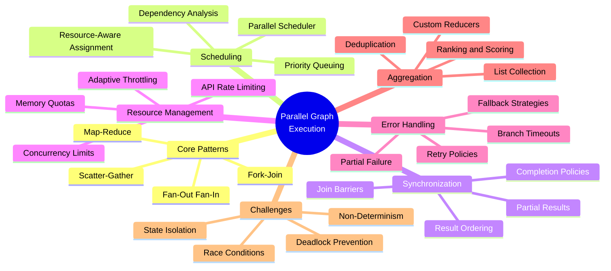
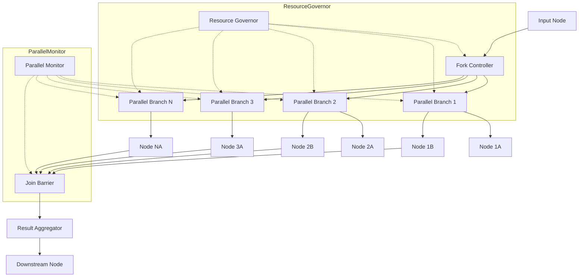
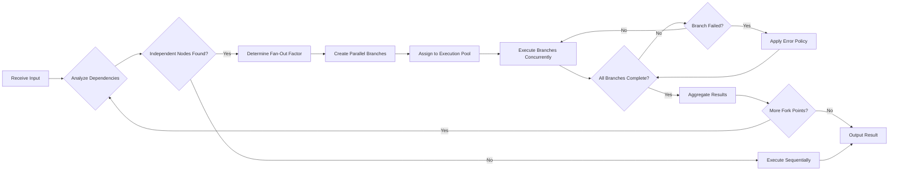
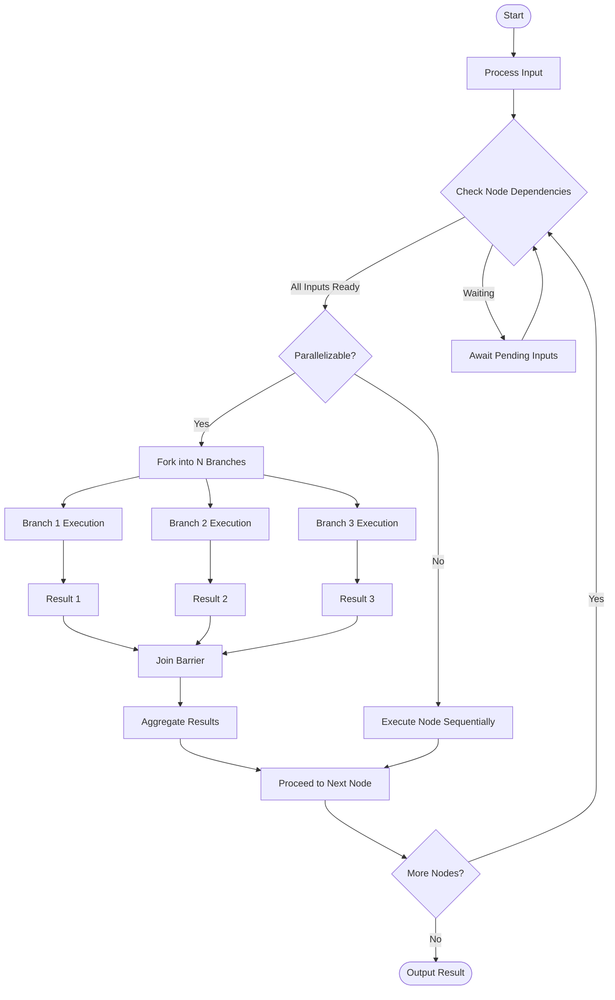
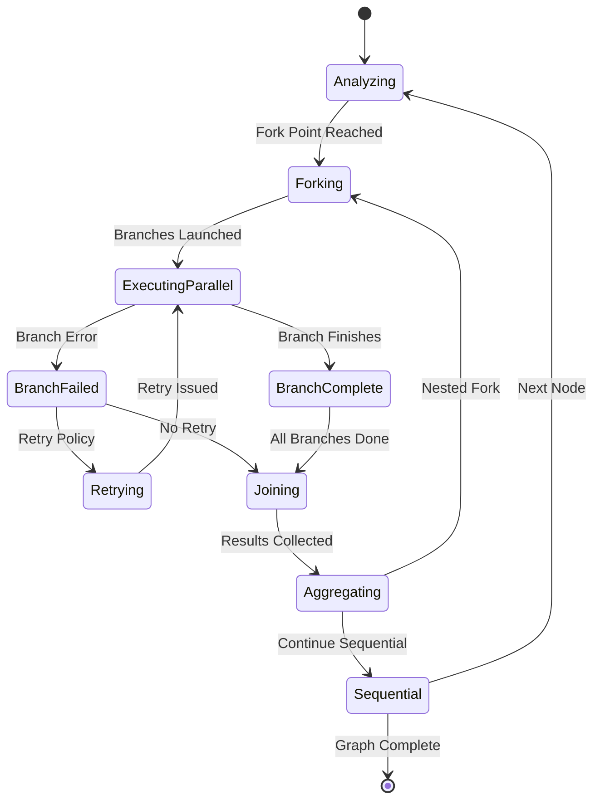
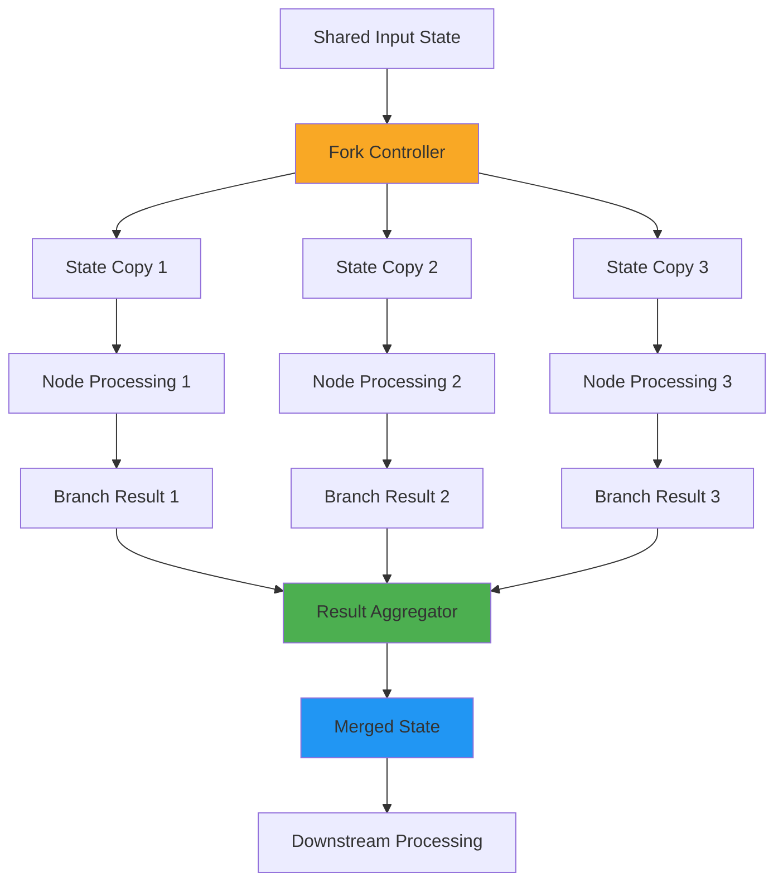
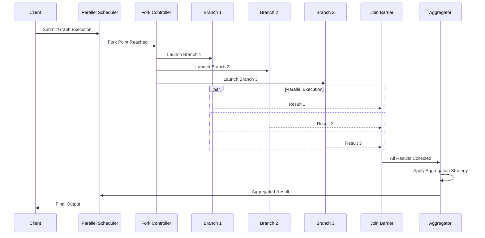

# Parallel Graph Execution

## 📌 Overview

Parallel Graph Execution is the practice of simultaneously executing multiple independent nodes within a graph-based AI system to reduce overall latency and maximize hardware utilization. In graph-engineered systems, many computational steps—such as calling multiple external APIs, running independent retrievers, evaluating different prompt strategies, or processing distinct data partitions—have no logical dependency on one another. Rather than executing these steps sequentially, parallel execution launches them concurrently, allowing the graph to produce results in the time it takes the slowest branch to complete rather than the sum of all branches. This fundamental optimization transforms graph performance, especially in I/O-heavy AI workflows where nodes spend significant time waiting for external responses.

The engineering challenge of parallel graph execution extends well beyond simply spawning concurrent tasks. A parallel graph runtime must identify which nodes can safely execute in parallel, manage shared state access to prevent data corruption, coordinate the aggregation of results from parallel branches, handle partial failures where some parallel branches succeed while others fail, and enforce resource limits to prevent parallel execution from overwhelming downstream systems. These concerns require a sophisticated runtime that understands the graph's dependency structure and can make intelligent scheduling decisions that balance throughput, resource consumption, and error resilience.

In the context of AI agent systems, parallel execution becomes especially powerful when combined with fan-out/fan-in patterns. A single agent decision can trigger parallel retrieval from multiple knowledge sources, parallel evaluation by multiple scoring models, or parallel generation of candidate responses that are later ranked and selected. The graph structure makes these parallel patterns natural to express and efficient to execute, since the dependency relationships between nodes are explicit and the runtime can use them to determine the optimal parallel execution schedule automatically.

## 🎯 Learning Objectives

By studying Parallel Graph Execution, you will learn to design graph systems that exploit concurrency to minimize end-to-end latency and maximize resource utilization. You will understand the fundamental principles of fork-join patterns, where a graph execution forks into multiple parallel branches and later joins to aggregate results. You will learn to identify parallelism opportunities within existing graph structures by analyzing dependency relationships and recognizing independent subtrees that can execute concurrently without correctness risks.

You will develop proficiency with fan-out/fan-in patterns, the most common parallel execution topology in AI graph systems. You will understand how to implement fan-out (distributing work across multiple parallel branches), fan-in (collecting and aggregating results from parallel branches), and the synchronization mechanisms required to ensure that fan-in only proceeds after all parallel branches have completed. You will also learn hybrid patterns such as selective fan-in (proceeding with partial results when some branches fail) and conditional fan-out (dynamically determining how many parallel branches to launch based on runtime conditions).

Additionally, you will master the critical challenges of parallel execution including race conditions, shared state management, resource throttling, and result aggregation strategies. You will learn to implement timeout policies for parallel branches, design fallback mechanisms for failed parallel paths, and create monitoring systems that provide visibility into the performance characteristics of parallel execution. These skills are essential for building production-grade AI systems that must meet strict latency requirements while processing complex multi-step workflows.

## 🧠 Definition

Parallel Graph Execution is a computational strategy in which a graph runtime identifies independent nodes or subgraphs and executes them simultaneously across multiple processing units, threads, or processes, with the results being merged at synchronization points to continue downstream processing. In a parallel graph, the execution model shifts from a single thread of control that visits one node at a time to a coordinated set of concurrent executions that respect the graph's dependency edges. Nodes with no unresolved dependencies can execute in parallel, while nodes that depend on outputs from parallel branches must wait at synchronization barriers until all required inputs are available.

The fundamental unit of parallel execution is the parallel branch—a set of nodes that can execute concurrently because they share no dependency edges between them. When a graph execution reaches a fork point (a node whose output feeds multiple independent downstream subgraphs), the runtime creates parallel execution contexts for each branch and schedules them on available processing resources. Each branch executes independently, producing its own result. When all branches reach their respective endpoints, the execution reaches a join point where results are collected and passed to the next node. This fork-join pattern is the canonical structure of parallel graph execution.

Parallel execution in graph systems differs from general-purpose parallelism in several important ways. First, the dependency structure is explicit in the graph topology, eliminating the need for developers to manually manage synchronization. Second, the granularity of parallelism is at the node or subgraph level, which is typically coarser than thread-level parallelism and therefore has lower coordination overhead. Third, the graph runtime can make globally optimal scheduling decisions because it has complete visibility into the dependency structure, resource requirements, and estimated durations of all pending nodes. These properties make graph-based parallelism particularly well-suited for AI workflows, where operations tend to be coarse-grained, I/O-bound, and have clearly defined dependency relationships.

## ❓ Why It Matters

Parallel Graph Execution matters because latency is the single most critical performance metric for interactive AI systems. Users expect sub-second responses from chatbots, search engines, and AI assistants, yet the workflows powering these systems often involve dozens of computational steps including retrieval from multiple databases, calls to multiple LLM endpoints, evaluation by multiple scoring models, and transformation through multiple processing pipelines. Executing these steps sequentially can easily result in multi-second response times that degrade user experience and reduce engagement. Parallel execution directly attacks this problem by overlapping the execution of independent steps, reducing total latency to the duration of the critical path rather than the sum of all steps.

Beyond user-facing latency, parallel execution dramatically improves throughput for batch AI workloads. An AI system processing a large corpus of documents can parallelize document processing across multiple workers, each executing the same graph structure on different data. An evaluation pipeline comparing multiple model configurations can run those configurations in parallel. A monitoring system checking the health of multiple AI services can issue parallel health checks. In all these cases, parallel execution multiplies effective processing capacity without requiring additional algorithmic optimization.

Parallel execution also enables new capabilities that are impractical or impossible with sequential execution. Ensemble methods that combine results from multiple models require parallel inference. Multi-source retrieval that queries multiple knowledge bases simultaneously requires parallel API calls. Redundant execution that runs the same operation on multiple providers for reliability requires parallel invocation with result comparison. These patterns are foundational to robust, high-performance AI systems and depend entirely on the ability to execute graph nodes in parallel. Without parallel execution, AI systems would be limited to simple sequential pipelines that cannot leverage the full power of modern multi-core hardware and distributed infrastructure.

## 🏛️ Core Concepts

**Fork-Join Patterns** are the foundational parallel execution pattern in graph systems. The fork operation splits a single execution stream into multiple parallel streams, each executing an independent branch of the graph. The join operation synchronizes all parallel streams, collecting their results and passing the aggregated output to the next sequential node. The fork point is typically a node that produces output consumed by multiple independent downstream subgraphs, while the join point is a node that requires inputs from all parallel branches before it can execute. The fork-join pattern provides a clean, well-understood model for expressing parallelism that maps naturally to graph structures.

**Fan-Out and Fan-In** describe the topology of parallel execution. Fan-out refers to the number of parallel branches launched from a fork point—a fan-out of N means N independent branches execute concurrently. Fan-in refers to the collection of results from parallel branches at a join point. The fan-out factor determines the degree of parallelism and directly impacts resource consumption, while the fan-in strategy determines how results from parallel branches are combined. Common fan-in strategies include concatenation (combining all results into a list), voting (selecting the most common result), scoring (ranking results and selecting the best), and reduction (applying a combining function like sum, max, or merge).

**Race Conditions in Parallel Graphs** occur when multiple parallel branches access or modify shared state concurrently, leading to non-deterministic behavior. In graph systems, race conditions typically arise when parallel nodes write to overlapping state keys, when parallel branches read state that another branch is modifying, or when the order of result aggregation affects downstream behavior. Preventing race conditions requires careful state management including immutable state copies per branch, explicit locking mechanisms for shared resources, or state partitioning that ensures each parallel branch operates on disjoint state regions. The graph's declarative structure helps by making data dependencies explicit, but developers must still design their nodes to be safe under parallel execution.

**Resource Management for Parallel Nodes** addresses the challenge of preventing parallel execution from overwhelming system resources. Each parallel branch consumes processing resources (CPU, memory, network connections, API rate limits), and uncontrolled parallelism can exhaust these resources, leading to degraded performance or system failure. Effective resource management involves concurrency limiting (capping the maximum number of parallel branches), resource-aware scheduling (considering resource availability when assigning branches to execution slots), and adaptive parallelism (dynamically adjusting the fan-out factor based on current system load and observed response times). These mechanisms ensure that parallel execution improves performance without creating resource contention that negates its benefits.

**Result Aggregation** is the process of combining outputs from parallel branches into a unified result that downstream nodes can process. Aggregation strategies vary widely depending on the application: in retrieval-augmented generation, aggregation might involve merging and deduplicating document results from multiple sources; in ensemble model systems, aggregation might involve weighted averaging of model outputs; in multi-tool agent systems, aggregation might involve structuring tool results into a unified context. The aggregation strategy must handle partial results gracefully (when some parallel branches fail), deduplicate overlapping information, and present results in a format that downstream nodes can efficiently process.

## 🧩 Key Components

The **Parallel Scheduler** is responsible for determining which nodes can execute in parallel and assigning them to available execution resources. The scheduler analyzes the graph's dependency structure to build a parallel execution plan, identifying maximal sets of independent nodes that can run concurrently. It maintains a pool of execution workers and assigns ready nodes to workers based on configurable policies such as priority ordering, estimated duration (shortest job first), or resource requirements. The scheduler continuously monitors the status of parallel branches and triggers join operations when all branches for a given fork point have completed.

The **Fork Controller** manages the creation and lifecycle of parallel execution branches. When a fork point is reached, the fork controller creates execution contexts for each parallel branch, initializes branch-local state (copies of shared state or references to immutable data), and submits branches to the scheduler for execution. The fork controller tracks the expected number of branches, the set of branches that have completed, and any branches that have failed or timed out. It implements fork policies such as static fan-out (always launch N branches), dynamic fan-out (determine N based on input data or configuration), and conditional fan-out (launch branches only when certain conditions are met).

The **Join Barrier** is the synchronization primitive that ensures downstream nodes execute only after all parallel branches have completed. The join barrier maintains a count of outstanding parallel branches and blocks execution until all branches have reported their results or failures. When all branches are complete, the barrier releases the aggregated results to the downstream node. Advanced join barriers support configurable completion policies: all-complete (wait for every branch), N-of-M (proceed when N out of M branches complete), first-complete (proceed with whichever branch finishes first), and best-effort (proceed when a timeout expires with whatever results are available).

The **Result Aggregator** combines outputs from parallel branches into a unified result structure. The aggregator supports multiple aggregation strategies including list collection (gathering all results into an ordered list), map construction (keying results by branch identifier), deduplication (removing duplicate entries across branches), ranking (scoring and sorting results), and custom aggregation functions provided by the graph developer. The aggregator also handles error results from failed branches, either by excluding them, replacing them with default values, or propagating errors to the error handling subsystem.

The **Resource Governor** prevents parallel execution from consuming excessive system resources. It implements concurrency limits (maximum parallel branches), per-resource quotas (maximum memory, network connections, or API calls), and adaptive throttling that reduces parallelism when resource utilization exceeds thresholds. The resource governor works closely with the scheduler, providing real-time resource availability information that the scheduler uses to make scheduling decisions. It also implements backpressure mechanisms that slow down or pause fork operations when the system is under heavy load, preventing cascading resource exhaustion.

The **Parallel Monitor** provides observability into parallel execution, tracking metrics such as parallel branch count, branch execution durations, resource utilization, and aggregation timing. The monitor enables operators to identify performance bottlenecks (branches that are consistently slower than others), resource hotspots (branches that consume disproportionate resources), and failure patterns (branches that frequently fail or timeout). This observability is essential for tuning parallel execution parameters and ensuring that parallelism delivers its expected performance benefits.

## 🧭 Mental Model

Imagine a newsroom where an editor assigns a breaking story to multiple reporters simultaneously. One reporter calls the police department for official statements, another interviews witnesses at the scene, a third searches the archive for related historical context, and a fourth contacts expert analysts for commentary. Each reporter works independently and in parallel—the editor does not wait for the police statement before sending out the witness interviewer. Each reporter returns to the editor with their findings at different times. The editor then joins all the reports together, synthesizes a coherent narrative, and publishes the story. The total time to produce the story is the time of the slowest reporter, not the sum of all reporting times.

In this analogy, the editor is the fork-join controller, the reporters are parallel branches, the assignments are fan-out, and the story synthesis is fan-in aggregation. If one reporter's source is unavailable (a failed branch), the editor can still publish a story using the other reporters' findings (partial result handling). If the story needs to be filed quickly (a timeout), the editor publishes with whatever information has arrived so far (first-complete or best-effort join). The editor must also manage resources—they cannot assign more reporters than are available, and each reporter needs equipment and access (resource governance).

The critical insight is that parallel execution does not make any individual reporter faster—it eliminates the wasted time of waiting for one reporter to finish before starting another. The graph structure makes this optimization natural by making the independence of reporting tasks explicit: the police statement, witness interviews, archive research, and expert commentary are independent subtasks that happen to feed into the same synthesis step. The graph runtime, like the skilled editor, recognizes this independence and orchestrates parallel execution to minimize the total time from assignment to publication.

## 🗺️ Mind Map

## 🏗️ Architecture Diagram

## 🔄 Workflow

## ⚙️ Internal Working

The internal operation of a parallel graph execution engine proceeds through several well-defined phases. First, during the **dependency analysis phase**, the runtime examines the graph structure to identify all fork points—nodes whose outputs feed multiple independent downstream subgraphs. For each fork point, the runtime determines the set of parallel branches by tracing the graph topology from the fork point until branches converge at join points. This analysis produces a parallel execution plan that specifies which nodes can execute in parallel and where synchronization barriers must be placed.

Second, during the **fork phase**, when execution reaches a fork point, the runtime creates independent execution contexts for each parallel branch. Each context receives a copy of the current graph state (or a reference to immutable shared state, depending on the system's state management strategy). The runtime then submits each branch to the parallel scheduler, which assigns branches to available execution workers. The fork controller records the expected branch count and initializes the join barrier.

Third, during the **parallel execution phase**, each branch executes independently on its assigned worker. The runtime monitors branch progress, tracking which branches have completed, which are still executing, and which have failed or timed out. The resource governor continuously evaluates resource utilization and may throttle the admission of new branches if resources are scarce. The parallel monitor collects timing and resource metrics for each branch.

Fourth, during the **join phase**, the join barrier waits for all parallel branches to complete according to the configured completion policy. When the completion condition is met, the result aggregator collects outputs from all completed branches and applies the configured aggregation strategy. The aggregated result is then passed to the next node in the graph for continued processing. If any branches failed, the error handling subsystem determines whether to propagate the error, use partial results, or apply fallback logic.

## 🔀 Execution Flow

## 📊 Lifecycle

## 📡 Data Flow

## 🤝 Interaction Flow

## 🌍 Real-World Analogy

Consider a medical diagnostic center where a patient arrives for a comprehensive health screening. The attending physician does not order tests one at a time, waiting for each result before ordering the next. Instead, they simultaneously order blood work from the lab, an X-ray from radiology, an echocardiogram from cardiology, and a vision test from ophthalmology. Each department processes the patient's request independently and in parallel. The blood technician draws samples and runs panels, the radiologist captures and reviews images, the cardiologist performs the ultrasound, and the optometrist conducts the eye exam—all concurrently.

The physician's review session is the join point. They do not begin their analysis until all test results are available (or until a critical result arrives that requires immediate attention, analogous to a first-complete join policy). When results arrive, the physician aggregates them into a comprehensive health assessment, noting correlations between findings across departments. If one department's results are delayed, the physician can begin preliminary analysis with available results but must wait for complete data before finalizing the diagnosis.

This analogy perfectly captures the essence of parallel graph execution. The physician is the graph orchestrator, the test orders are fan-out, the concurrent department processing is parallel branch execution, the review session is the join barrier, and the comprehensive assessment is result aggregation. The diagnostic center's resource management—scheduling rooms, equipment, and staff to handle multiple concurrent patients—mirrors the resource governor in a parallel graph system. The key principle is identical: independent tasks are executed concurrently to minimize total time, with synchronization only where dependencies require it.

## 💡 Practical Example

Imagine building an AI-powered research assistant that must gather information about a complex topic. The graph structure includes a topic analysis node that identifies key aspects to research, followed by parallel retrieval nodes that query different knowledge sources simultaneously. One branch searches the web via a search API, another queries an internal knowledge base, a third retrieves relevant academic papers, and a fourth checks real-time data sources. Each branch is independent—they do not need results from other branches to execute—but all results are needed by the downstream synthesis node.

In a sequential execution model, the total retrieval time would be the sum of all four API calls: perhaps 800 milliseconds for web search, 400 milliseconds for the knowledge base, 1200 milliseconds for academic papers, and 300 milliseconds for real-time data—a total of 2.7 seconds. With parallel execution, all four calls happen simultaneously, and the total retrieval time is approximately 1.2 seconds (the slowest branch). This 2.25x speedup directly improves the user experience by delivering faster responses.

The synthesis node then receives aggregated results from all four branches, deduplicates overlapping information, ranks sources by relevance, and generates a comprehensive research summary. If the academic paper search times out, the system still proceeds with results from the other three sources, producing a slightly less comprehensive but still useful summary. The resource governor ensures that no more than six parallel API calls are active at any time, preventing rate limit violations across the various APIs. The parallel monitor tracks the latency of each retrieval branch, enabling the system to identify and optimize consistently slow sources.

## 🧪 Use Cases

**Multi-Source Retrieval Augmented Generation (RAG):** Parallel graph execution is essential for RAG systems that retrieve from multiple knowledge sources. When a user query requires information from a vector database, a structured database, a web search engine, and a document store, all four retrieval operations can execute in parallel. The join barrier ensures the generation node receives all retrieved documents before composing a response. This pattern is one of the most common and impactful applications of parallel execution in AI systems, directly reducing query response time by a factor proportional to the number of independent sources.

**Ensemble Model Inference:** AI systems that use multiple models to improve prediction quality—such as running the same prompt through different LLMs and selecting the best response—require parallel execution of multiple inference branches. Each branch invokes a different model API, and the aggregation node applies a scoring function to select or combine results. Parallel execution ensures that the total inference time is determined by the slowest model rather than the sum of all model latencies, making ensemble approaches practical for latency-sensitive applications.

**Multi-Tool Agent Execution:** AI agents that use multiple tools to accomplish tasks can invoke independent tools in parallel. For example, an agent planning a trip might simultaneously check flight prices, hotel availability, weather forecasts, and local event schedules. These tool calls are independent and benefit enormously from parallel execution. The agent's planning node then aggregates all tool results to construct a comprehensive travel recommendation.

**Parallel Document Processing:** Batch AI systems that process large collections of documents can parallelize document-level processing. Each document follows the same graph structure (extract, classify, summarize, index), but different documents are processed in parallel across multiple workers. This map-style parallelism multiplies throughput linearly with the number of available workers, enabling rapid processing of document corpora that would take impractically long to process sequentially.

**Redundant Execution for Reliability:** Critical AI operations can be executed in parallel across multiple providers or model instances, with the first successful result being used (race pattern). This provides fault tolerance against individual provider outages or degraded performance. The result comparator at the join point selects the fastest valid response, ensuring both reliability and low latency.

## ⚖️ Comparison

| Aspect | Sequential Execution | Parallel Execution | Asynchronous Execution |
|---|---|---|---|
| **Latency** | Sum of all node times | Slowest branch time | Varies by I/O overlap |
| **Throughput** | One node at a time | Multiple nodes concurrently | Multiple pending operations |
| **Complexity** | Low, linear flow | Medium, needs sync | High, needs coordination |
| **Resource Usage** | Minimal | Higher, scales with fan-out | Moderate, event-driven |
| **State Management** | Simple, single thread | Requires isolation | Requires futures |
| **Error Handling** | Straightforward | Must handle partial failures | Complex async error propagation |
| **Best For** | Simple chains, debugging | Independent branches, I/O bound | Mixed sync/async operations |
| **Determinism** | Fully deterministic | May vary in order | Non-deterministic timing |

Parallel execution occupies a middle ground between the simplicity of sequential execution and the flexibility of fully asynchronous execution. It provides substantial latency improvements over sequential execution while maintaining more predictable behavior than fully asynchronous systems. The choice between these models depends on the graph's structure, the system's latency requirements, and the complexity tolerance of the development team.

## ✅ Best Practices

**Isolate Branch State:** Each parallel branch should operate on its own copy of the graph state to prevent race conditions and ensure deterministic behavior. While copying state for every branch has a memory cost, it eliminates the entire class of bugs caused by concurrent state mutation. If state is too large to copy, use copy-on-write strategies or restrict parallel branches to read-only access to shared state with explicit synchronization for any writes.

**Implement Configurable Timeouts:** Every parallel branch should have a timeout that prevents the entire graph from waiting indefinitely for a slow or hung branch. Timeouts should be configurable at both the branch level and the join level. Branch-level timeouts cancel individual slow operations, while join-level timeouts allow the graph to proceed with partial results when the overall parallel section exceeds its time budget. Set timeouts based on observed latency distributions (such as the 99th percentile) rather than optimistic estimates.

**Design for Partial Failure:** Parallel execution increases the probability that at least one branch will fail, since more operations are running concurrently. Design your aggregation logic to handle missing results gracefully—use default values, reduce the quality of output rather than failing entirely, or implement branch-level fallbacks that provide lower-quality results when primary operations fail. The system should degrade gracefully rather than catastrophically when parallel branches encounter errors.

**Monitor and Tune Parallelism:** Implement comprehensive monitoring of parallel execution metrics including branch latency distributions, resource utilization, failure rates, and aggregation timing. Use these metrics to tune fan-out factors, timeout values, and resource limits. A fan-out of 10 may provide better throughput than 20 if the system's resources are saturated at 15 concurrent branches. Regularly review parallel execution performance to identify optimization opportunities.

**Use Semantic Aggregation:** The aggregation strategy should reflect the semantic meaning of the parallel branches rather than simply concatenating results. If branches retrieve from different sources, implement source-aware aggregation that accounts for the different quality and format of each source. If branches evaluate different criteria, implement weighted combination that reflects the relative importance of each criterion. Thoughtful aggregation transforms parallel execution from a mere performance optimization into a capability that produces qualitatively better results.

## ❌ Common Mistakes

**Ignoring State Isolation:** The most common and dangerous mistake in parallel graph execution is allowing parallel branches to mutate shared state without synchronization. This leads to race conditions that produce non-deterministic results—sometimes the graph produces correct output, sometimes it produces corrupted output, depending on the exact timing of parallel execution. These bugs are extremely difficult to reproduce and debug because they depend on scheduling decisions made by the operating system. Always isolate branch state, even if it requires additional memory allocation.

**Unbounded Fan-Out:** Launching an unbounded number of parallel branches based on input data size is a recipe for resource exhaustion. For example, processing a list of 1000 items by fanning out to 1000 parallel branches will overwhelm memory, network connections, and downstream APIs. Always cap the fan-out factor and use batching or pagination to process large data sets with controlled parallelism. The fan-out should be a configurable parameter, not a function of input size.

**Ignoring the Slowest Branch:** A common optimization mistake is focusing on making the average branch faster while ignoring the slowest branch, which determines total parallel execution time. If nine out of ten branches complete in 100 milliseconds but one consistently takes 2 seconds, the total execution time is 2 seconds regardless of how fast the other branches are. Profile branch latency distributions and optimize the long tail rather than the average. Consider implementing branch-level timeouts that allow the join to proceed without the slowest branch if it exceeds a threshold.

**Synchronous Aggregation:** Blocking the join barrier until all branches complete, even when some branches are known to be unnecessary, wastes resources and adds latency. Implement smart completion policies that can proceed with partial results when appropriate. If a confidence-scoring branch determines that results are already sufficient, the join should not wait for additional retrieval branches. Design completion policies that are aware of the semantic meaning of branch results, not just their mechanical completion status.

**Neglecting Resource Contention:** Parallel branches often compete for the same resources—database connection pools, API rate limits, GPU memory, and network bandwidth. Running too many parallel branches can cause contention that makes every branch slower, potentially making parallel execution slower than sequential execution. Monitor resource utilization during parallel execution and implement backpressure mechanisms that reduce parallelism when contention is detected.

## 🚀 Advanced Topics

**Adaptive Parallelism** dynamically adjusts the fan-out factor based on real-time performance observations. The runtime monitors branch latency, success rate, and resource utilization, and uses this information to determine the optimal number of parallel branches for the current system conditions. Under light load, the system may increase fan-out to maximize throughput. Under heavy load or when latency is degrading, the system reduces fan-out to prevent resource contention. Machine learning models can be trained on historical execution data to predict the optimal fan-out for a given input characteristics and system state, enabling pre-emptive parallelism adjustment rather than reactive throttling.

**Speculative Parallel Execution** launches branches that may not be needed, based on predicted execution paths. If the speculation is correct, the results are already available when needed, eliminating latency. If the speculation is incorrect, the results are discarded. This technique is particularly powerful in decision graphs where the outcome of a conditional node determines which branches are needed. By speculatively executing all possible branches in parallel, the system eliminates the latency of the decision node—results are available immediately regardless of which branch is selected. The cost is wasted resources for the unselected branches, making this technique suitable only when the wasted computation is inexpensive relative to the latency savings.

**Parallel Graph Checkpointing** extends fault tolerance to parallel execution by periodically saving the state of all parallel branches to durable storage. If the system fails during parallel execution, the checkpoint enables recovery without re-executing completed branches. Implementing checkpointing for parallel execution is more complex than for sequential execution because the checkpoint must capture the state of multiple concurrent execution contexts and ensure consistency across them. Techniques such as coordinated checkpointing (pausing all branches to take a consistent snapshot) and uncoordinated checkpointing (logging individual branch state with dependency information for reconstruction) offer different tradeoffs between overhead and recovery complexity.

**Hierarchical Parallelism** nests parallel execution within parallel branches, creating a tree of parallel execution contexts. For example, a top-level fan-out might launch five parallel branches, each of which contains its own internal fan-out with three sub-branches, resulting in fifteen concurrent operations organized in a two-level hierarchy. Hierarchical parallelism enables the expression of complex parallel workflows that have both coarse-grained and fine-grained parallelism. The runtime must manage nested join barriers and ensure that inner parallel sections complete before their containing branches report completion to outer join barriers. Resource management becomes more complex because the total number of concurrent operations is the product of fan-out factors at each level, requiring careful capacity planning.
