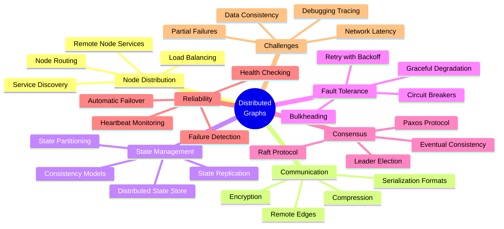
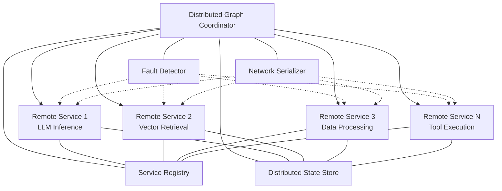
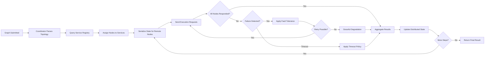
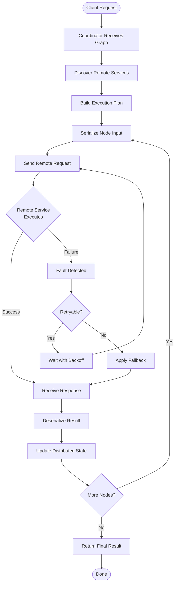
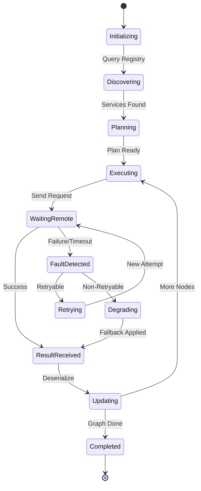
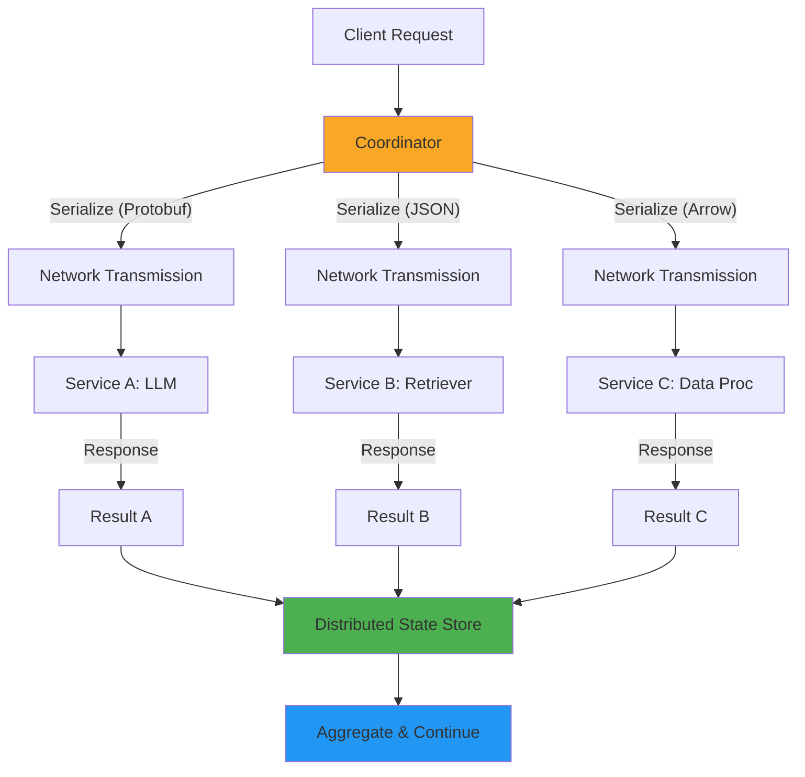
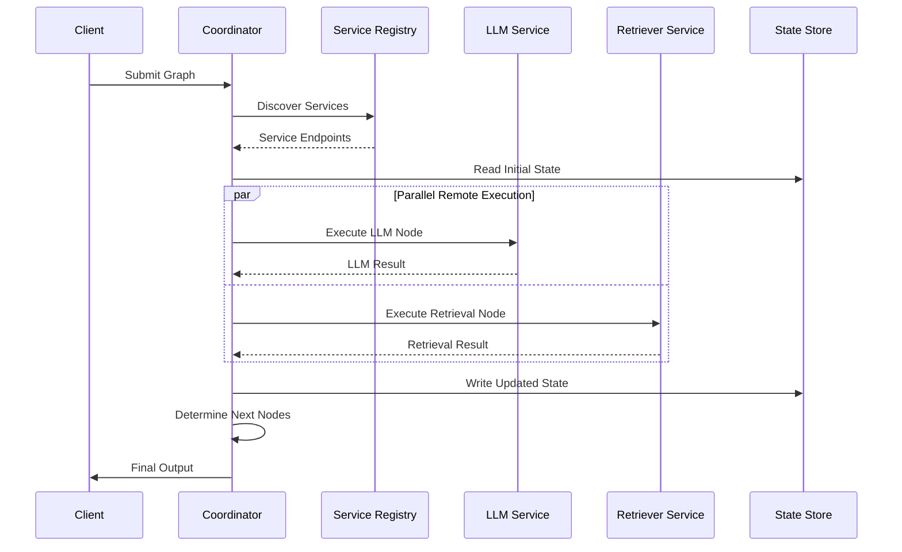

# Distributed Graphs

## 📌 Overview

Distributed Graphs extend the graph engineering paradigm beyond a single machine, enabling graph nodes and subgraphs to execute across multiple machines, services, and network boundaries. In modern AI systems, it is common for different components of a workflow to reside on different infrastructure: a retrieval node might run on a vector database service, an LLM inference node might execute on a GPU cluster, a data transformation node might run on a stream processing platform, and a human review node might involve an entirely separate web application. Distributed graphs provide the framework for orchestrating these geographically and organizationally distributed components as a single coherent graph workflow, maintaining the clarity and manageability of graph-based design while leveraging the scalability and specialization of distributed infrastructure.

The fundamental challenge of distributed graphs is that the assumptions that hold in single-machine execution break down across network boundaries. Local function calls become remote procedure calls subject to network latency, failure modes, and serialization overhead. Shared memory becomes distributed state that must be synchronized across machines. Atomic operations become distributed transactions that require consensus protocols. Debugging a single-process execution becomes distributed tracing across multiple services. A robust distributed graph system must address all of these challenges while preserving the graph's semantic guarantees—the graph should behave correctly regardless of which machines its nodes execute on.

Distributed graph engineering sits at the intersection of graph orchestration, distributed systems, and AI workflow management. It requires understanding of network serialization protocols, distributed state management patterns, fault tolerance mechanisms, consensus algorithms, and service discovery. The payoff is enormous: distributed graphs enable AI systems that scale horizontally across clusters, that leverage specialized hardware and services where they provide the most value, and that achieve levels of reliability and availability that are impossible with single-machine deployment. For enterprise AI systems that must serve global users, process massive data volumes, and integrate with diverse external systems, distributed graph execution is not a luxury but a necessity.

## 🎯 Learning Objectives

By studying Distributed Graphs, you will learn to design and deploy graph-based AI systems that span multiple machines and services. You will understand the fundamental challenges that arise when graph execution crosses network boundaries, including increased latency, new failure modes, serialization requirements, and distributed state consistency. You will learn to architect graph systems that gracefully handle these challenges while maintaining the semantic correctness and performance characteristics expected by end users and downstream systems.

You will develop proficiency with distributed node execution models, where individual graph nodes are implemented as remote services that communicate via network protocols. You will understand how to define remote edges that connect nodes across service boundaries, how to serialize and deserialize graph state for network transmission, and how to manage the lifecycle of remote node executions including connection establishment, request routing, response handling, and connection teardown. You will learn to implement service discovery mechanisms that allow graph nodes to locate and communicate with remote node services dynamically.

Additionally, you will master distributed state management strategies including state replication, partitioning, and consensus. You will understand how to implement fault tolerance through retry policies, circuit breakers, and graceful degradation. You will learn to apply consensus protocols for distributed decision-making within graphs, ensuring that distributed nodes agree on critical values such as workflow state transitions and leader election. These skills are essential for building production AI systems that must operate reliably at scale across distributed infrastructure.

## 🧠 Definition

A Distributed Graph is a graph-based computational system whose nodes execute on two or more physically or logically separate machines, communicating through network protocols rather than local function calls or shared memory. In a distributed graph, the graph topology remains conceptually unified—a single graph with nodes and edges as usual—but the physical execution of nodes is distributed across a network. Edges that connect nodes on different machines become remote edges that require network communication, serialization of data, and handling of network-level failure modes that do not exist in local execution.

The key abstraction in distributed graphs is the remote node—a graph node whose execution is delegated to a remote service. The graph runtime acts as a client that sends execution requests to the remote service and receives results in response. From the graph's perspective, a remote node behaves like a local node: it receives input from its incoming edges, performs computation, and produces output on its outgoing edges. The difference is entirely in the execution mechanism: instead of calling a local function, the runtime serializes the input, transmits it over the network, waits for the remote service to execute, receives the serialized result, and deserializes it back into graph state. This transparency is the fundamental design goal of distributed graph systems—making distribution an implementation detail that does not affect the graph's logical structure.

Distributed graphs can be classified along several dimensions. Homogeneous distributed graphs run identical node runtime software on all machines, differing only in the data and configuration assigned to each. Heterogeneous distributed graphs run different software on different machines, reflecting the specialization of different nodes—for example, some machines run LLM inference servers while others run database query engines. Tight-coupled distributed graphs maintain low-latency, high-bandwidth connections between nodes (typically within a single data center), while loosely-coupled distributed graphs span wide-area networks with higher latency and lower reliability. The design of a distributed graph system must account for its position along all of these dimensions.

## ❓ Why It Matters

Distributed Graphs matter because real-world AI systems inevitably outgrow the capacity of a single machine. A single machine has finite CPU cores, finite memory, finite GPU capacity, and finite network bandwidth. As AI workloads grow in complexity—more retrieval sources, larger models, more sophisticated reasoning chains—they quickly exceed these limits. Distributed graphs provide the architectural framework for scaling AI workloads beyond single-machine constraints by distributing computation across multiple machines that collectively provide the resources needed for complex AI workflows.

Distributed graphs also matter because of the organizational reality that different AI system components are often owned and operated by different teams. A retrieval service might be maintained by the data engineering team, an LLM gateway by the ML platform team, and a business logic service by the application team. Each team deploys and scales their service independently. Distributed graphs provide the orchestration layer that connects these independently operated services into coherent AI workflows without requiring centralized deployment or monolithic architecture. This organizational decoupling enables teams to work autonomously while still contributing to integrated AI systems.

Furthermore, distributed graphs are essential for achieving the reliability and availability levels required by production AI systems. A single-machine graph system has a single point of failure—if the machine fails, the entire system is unavailable. A distributed graph can achieve high availability by replicating critical nodes across multiple machines, implementing automatic failover, and distributing load across multiple instances. When one machine fails, the graph runtime routes execution to surviving instances, maintaining system availability. Combined with geographic distribution across multiple data centers, distributed graphs can achieve the five-nines (99.999%) availability that enterprise AI applications demand.

## 🏛️ Core Concepts

**Distributed Node Execution** is the mechanism by which graph nodes are executed on remote machines. Each remote node is backed by a service endpoint that accepts execution requests, processes them, and returns results. The graph runtime communicates with remote nodes through a client interface that abstracts the network communication details. The execution model supports multiple interaction patterns: request-response (the most common, where the runtime sends input and waits for output), event-driven (where the remote node processes asynchronously and sends results via callbacks), and streaming (where results are returned incrementally as they become available). Each pattern has different latency, resource, and complexity characteristics.

**Remote Edges** are graph edges that cross machine boundaries. Unlike local edges, which pass data through in-memory references, remote edges require data to be serialized, transmitted over a network, and deserialized at the receiving end. This introduces several concerns: serialization format selection (JSON for interoperability, Protocol Buffers for efficiency, Apache Arrow for large data), compression to reduce network bandwidth, encryption for security, and batching to amortize network round-trip overhead. Remote edges also introduce the possibility of partial failures where the sending node succeeds but the receiving node never gets the data, requiring acknowledgment and retry mechanisms.

**Network Serialization** is the process of converting in-memory graph state into a format suitable for network transmission and reconstructing it at the receiving end. Serialization is a critical concern in distributed graphs because AI workflow data often includes complex types: large language model outputs, structured documents, embedding vectors, and tool execution results. The serialization format must balance efficiency (minimizing the size of serialized data to reduce network latency and cost) with flexibility (supporting the diverse data types that flow through AI graphs) and compatibility (ensuring that different services can correctly interpret each other's serialized data, even when they are implemented in different programming languages). Schema registries and versioned serialization formats help manage compatibility across evolving services.

**Distributed State Management** addresses the challenge of maintaining consistent graph state across multiple machines. In a single-machine graph, state is stored in memory and is immediately accessible to all nodes. In a distributed graph, state must be stored in a distributed data store (such as Redis, etcd, or a distributed database) that all machines can access. This introduces questions of consistency: when multiple machines read and write shared state, what guarantees does the system provide? Strong consistency ensures all machines see the same state at all times but requires coordination overhead. Eventual consistency allows temporary divergence but may lead to nodes operating on stale data. The choice depends on the application's tolerance for inconsistency versus its need for performance.

**Fault Tolerance in Distributed Graphs** encompasses the mechanisms that enable a distributed graph to continue operating correctly when individual machines, networks, or services fail. Fault tolerance in distributed systems is fundamentally more complex than in single-machine systems because partial failures are the norm rather than the exception—a distributed system can experience the failure of some but not all of its components at any time. Key fault tolerance mechanisms include retry with exponential backoff (automatically re-attempting failed operations with increasing delays), circuit breakers (temporarily stopping requests to a failing service to allow it to recover), bulkheading (isolating resources for different services so one failure does not cascade), and graceful degradation (continuing to provide reduced functionality when some services are unavailable).

**Consensus in Distributed Graph Systems** is the process by which distributed nodes agree on a value or decision, such as the current state of the graph execution, the assignment of a task to a worker, or the outcome of a conditional edge evaluation. Consensus is required whenever multiple machines must make a coordinated decision, and it is fundamentally challenging in distributed systems because of the possibility of network partitions (where some machines cannot communicate with others). Distributed graph systems use consensus protocols ranging from simple leader election (where one machine makes decisions and others follow) to full consensus algorithms like Raft or Paxos (which guarantee agreement even during network partitions, at the cost of availability during partitions). The choice of consensus mechanism depends on the system's consistency requirements and its tolerance for reduced availability during failures.

## 🧩 Key Components

The **Distributed Graph Coordinator** is the central orchestrator that manages the execution of a graph across multiple machines. The coordinator maintains the graph's topology and current execution state, assigns nodes to remote execution services, manages the flow of data between remote nodes, and handles fault recovery. The coordinator may itself be distributed for high availability, using a consensus protocol to ensure that a failover coordinator has a consistent view of the graph's execution state. The coordinator does not execute nodes itself—it delegates execution to remote services and manages the resulting distributed execution.

**Remote Node Services** are the server-side components that execute graph nodes on remote machines. Each service exposes one or more node execution endpoints that accept serialized input, execute the node's logic, and return serialized output. Services may be specialized for specific node types (for example, an LLM inference service that executes all LLM nodes, or a retrieval service that executes all knowledge base queries) or general-purpose (accepting any node definition and executing it). Services register themselves with a service registry, allowing the coordinator to discover available services and route node execution requests to appropriate instances.

The **Service Registry** maintains a directory of available remote node services, their capabilities, their current health status, and their network endpoints. When the coordinator needs to execute a node, it queries the service registry to find one or more services capable of executing that node type. The registry supports service discovery (finding services by capability), load balancing (distributing execution across multiple service instances), and health checking (detecting and removing failed services from the registry). The registry itself must be highly available, typically implemented using a distributed key-value store like Consul, etcd, or ZooKeeper.

The **Distributed State Store** provides shared state storage accessible by all machines participating in the distributed graph execution. It stores the graph's current state, node execution results, and any shared data that nodes need to access. The state store must provide consistency guarantees appropriate for the application—strong consistency for critical state that must be accurate (such as execution status and decision points), and eventual consistency for data that can tolerate brief inconsistency (such as cached retrieval results). The state store also typically provides durability guarantees, persisting state to disk to survive machine failures.

The **Network Serializer** handles the conversion of in-memory data structures to and from network-transmittable formats. It supports multiple serialization formats (JSON, Protocol Buffers, MessagePack, Apache Arrow) and selects the appropriate format based on the data type, the communicating services' capabilities, and performance requirements. The serializer also handles compression (using algorithms like gzip or zstd to reduce network payload size), encryption (ensuring data confidentiality in transit), and schema validation (ensuring that serialized data conforms to expected schemas before deserialization).

The **Fault Detector** monitors the health of remote services and network connectivity, detecting failures and triggering appropriate responses. The fault detector implements heartbeat monitoring (periodic health checks to services), timeout detection (identifying services that fail to respond within expected timeframes), and anomaly detection (identifying services that are responding but producing errors or degraded performance). When a fault is detected, the fault detector notifies the coordinator, which initiates fault recovery procedures such as retrying on a different service instance, triggering a circuit breaker, or initiating graceful degradation.

## 🧭 Mental Model

Imagine a large international film production where the director (the graph coordinator) orchestrates a complex movie across multiple studios and locations worldwide. The screenplay (the graph definition) specifies every scene, every dialogue, and every transition. But the actual filming happens in different countries: action sequences are shot at a studio in New Zealand, romantic scenes are filmed in Paris, and indoor dialogue is recorded at a soundstage in London. Each location has its own local crew and equipment (remote node services), but the director must ensure that all the pieces fit together into a coherent film.

When the director needs a scene filmed (executes a node), they don't travel to the location themselves—they send detailed instructions via satellite link (remote edge with serialization). The local crew receives the instructions, films the scene, and sends back the raw footage (execution result). If the New Zealand studio is unavailable due to weather, the director reschedules that scene to a backup studio in Australia (fault tolerance and retry). The director maintains a master shooting schedule (distributed state) that tracks which scenes are completed, which are in progress, and which are pending, ensuring that all locations are working from the same plan (consensus on execution state).

The challenge is that each location operates independently with its own local constraints, time zones, and equipment. The director must manage communication delays (network latency), handle the possibility that footage from one location might be lost or corrupted (partial failure), and ensure that all locations agree on creative decisions (consensus). Despite these challenges, the result is a film that could never have been produced in a single location—a production whose scale and quality exceeds what any single studio could achieve alone. This is the essence of distributed graphs: enabling graph-based AI systems whose capability and scale exceed what any single machine can provide.

## 🗺️ Mind Map

## 🏗️ Architecture Diagram

## 🔄 Workflow

## ⚙️ Internal Working

The internal operation of a distributed graph system involves several coordinated phases. During the **topology analysis phase**, the coordinator parses the graph definition and classifies each edge as local (connecting nodes on the same machine) or remote (connecting nodes on different machines). This classification determines the communication mechanism for each edge: local edges use in-memory data passing, while remote edges require network serialization and transmission. The coordinator also identifies nodes that require specific capabilities (GPU access, database connectivity, specific model availability) and maps these requirements to available services in the registry.

During the **service discovery and assignment phase**, the coordinator queries the service registry to identify available services for each node. The registry returns a list of service instances capable of executing each node, along with their current health status, load level, and network location. The coordinator uses this information to assign nodes to specific service instances, considering factors such as data locality (assigning nodes to services that are close to the data they need to access), load balancing (distributing work evenly across instances), and fault isolation (avoiding assigning critical nodes to the same machine to prevent correlated failures).

During the **execution phase**, the coordinator orchestrates node execution across the assigned services. For each node, the coordinator serializes the node's input from the distributed state store, transmits the execution request to the assigned service, and awaits the response. The network serializer handles format conversion, compression, and encryption. The fault detector monitors the request and, if the service does not respond within the expected timeframe, triggers the fault tolerance mechanisms. When the service responds, the coordinator deserializes the result, updates the distributed state store, and determines which downstream nodes are now ready for execution.

During the **fault recovery phase**, when a service failure is detected, the coordinator initiates recovery procedures. If the node has retryable semantics, the coordinator retries the execution on a different service instance. If a circuit breaker is open for the service, the coordinator uses a cached or default result. If the node is critical and no fallback is available, the coordinator marks the graph execution as failed and initiates cleanup of any in-flight operations. Throughout this process, the coordinator updates the distributed state store to reflect the current execution status, ensuring that any failover coordinator can reconstruct the execution state and continue processing.

## 🔀 Execution Flow

## 📊 Lifecycle

## 📡 Data Flow

## 🤝 Interaction Flow

## 🌍 Real-World Analogy

Consider a global supply chain for manufacturing a complex product like a smartphone. The product design (the graph definition) specifies every component and how they fit together. But the actual manufacturing happens in dozens of factories across multiple countries: the display is manufactured in South Korea, the processor is fabricated in Taiwan, the battery is produced in China, and the assembly happens in India. Each factory (remote node service) specializes in its component and operates independently, but the overall coordination (the distributed graph coordinator) ensures all components come together at the right time and place.

When the coordinator needs a component (executes a node), it sends specifications to the appropriate factory via the global logistics network (remote edges). The factory produces the component and ships it back (execution result). If a factory experiences a disruption—say, a port closure or a power outage—the coordinator activates backup suppliers (fault tolerance with retry on alternative services). The coordinator maintains a master production schedule (distributed state) that all factories reference, and when changes occur, updated schedules are propagated to all parties (state synchronization and consensus).

The supply chain must handle challenges remarkably similar to distributed graphs: communication delays across time zones (network latency), the possibility that a shipment is lost or damaged in transit (partial failure), the need for all factories to agree on specifications (consensus), and the requirement to maintain production even when some suppliers are unavailable (graceful degradation). The result is a manufacturing system whose scale and efficiency far exceed what any single factory could achieve, just as distributed graphs enable AI systems whose capability exceeds what any single machine can provide.

## 💡 Practical Example

Consider building a distributed AI customer support system where the graph spans multiple specialized services. The graph begins with a classification node running on a lightweight CPU service that categorizes the customer's issue. Based on the classification, the graph routes to different parallel branches: a retrieval node that queries a knowledge base service, an LLM node that runs on a GPU cluster for generating a draft response, and a sentiment analysis node that runs on a real-time analytics service. Each of these services is independently deployed, scaled, and maintained by different teams.

When the classification node determines the issue is a billing inquiry, the coordinator sends a retrieval request to the knowledge base service (serializing the query as JSON), an inference request to the LLM service (serializing the prompt and context as Protocol Buffers for efficiency), and an analysis request to the sentiment service (serializing the conversation history as a compressed payload). These three requests execute in parallel across different machines, potentially in different data centers. The LLM service may take 2 seconds for inference, the retrieval service may take 200 milliseconds, and the sentiment service may take 50 milliseconds. The total time is determined by the slowest service (2 seconds), not the sum.

If the LLM service becomes overloaded and fails to respond within 3 seconds, the circuit breaker opens, and the coordinator falls back to a cached template response. The sentiment service result is still collected and used to adjust the tone of the template. The distributed state store records the entire interaction for audit purposes, and the fault detector logs the LLM service failure for the operations team to investigate. Despite the partial failure, the customer receives a response within the expected timeframe, demonstrating the fault tolerance that distributed graphs provide.

## 🧪 Use Cases

**Multi-Cloud AI Workflows:** Enterprises that deploy AI services across multiple cloud providers (AWS, GCP, Azure) use distributed graphs to orchestrate workflows that leverage each provider's strengths. A graph might use GCP's TPU infrastructure for model training, AWS's SageMaker for inference, and Azure's cognitive services for specific AI capabilities. The distributed graph coordinator routes each node to the appropriate cloud provider, managing authentication, data transfer, and fault tolerance across cloud boundaries.

**Federated AI Systems:** AI systems that must operate across organizational boundaries—such as healthcare AI that processes data from multiple hospitals, or financial AI that aggregates analysis from multiple banks—use distributed graphs to orchestrate computation while respecting data sovereignty constraints. Nodes execute on each organization's infrastructure, processing local data without transferring it across boundaries. Only aggregated, anonymized results flow between organizations, enabling collaborative AI while maintaining privacy compliance.

**Global AI Serving:** AI services that serve users worldwide deploy distributed graphs across multiple geographic regions to minimize latency. A user in Asia connects to a nearby graph coordinator, which routes LLM inference to a local GPU cluster, retrieval to a regional knowledge base, and content generation to a regional service. The distributed graph ensures that the user experiences low latency while the system maintains a consistent global execution model.

**Hybrid Edge-Cloud AI:** AI systems that combine edge computing (for low-latency operations) with cloud computing (for resource-intensive operations) use distributed graphs to seamlessly blend edge and cloud execution. Time-sensitive nodes (voice recognition, sensor processing) execute on edge devices, while computationally intensive nodes (large model inference, complex reasoning) execute in the cloud. The distributed graph manages the communication between edge and cloud, handling the different reliability, latency, and bandwidth characteristics of each environment.

**Multi-Tenant AI Platforms:** AI platform providers that serve multiple customers use distributed graphs to isolate and orchestrate each customer's AI workflows independently. Each customer's graph execution is isolated in its own namespace but shares the underlying distributed infrastructure. The distributed graph system manages resource allocation, fair scheduling, and isolation between tenants while providing each tenant with the full capabilities of the graph execution framework.

## ⚖️ Comparison

| Aspect | Single-Machine Graphs | Distributed Graphs | Federated Graphs |
|---|---|---|---|
| **Latency** | Very low (memory) | Higher (network) | Variable (WAN) |
| **Scalability** | Limited by one machine | Horizontal scaling | Cross-organization |
| **Fault Tolerance** | Process-level only | Machine-level | Organization-level |
| **Complexity** | Low | High | Very High |
| **State** | In-memory | Distributed store | Partitioned per org |
| **Deployment** | Single binary | Multiple services | Multi-admin |
| **Debugging** | Standard tools | Distributed tracing | Cross-org tracing |
| **Data Gravity** | All data local | Data must travel | Data stays local |

Distributed graphs trade the simplicity and low latency of single-machine execution for the scalability, fault tolerance, and organizational flexibility that production AI systems require. The choice between single-machine and distributed deployment depends on the system's scale requirements, reliability needs, and organizational constraints. Many systems start as single-machine graphs and evolve to distributed graphs as their requirements grow.

## ✅ Best Practices

**Design for Network Failure:** Every remote node invocation should be designed with the assumption that it may fail due to network issues, service unavailability, or timeout. Implement retry policies with exponential backoff and jitter to handle transient failures. Use circuit breakers to prevent cascading failures when a remote service is persistently unavailable. Always define fallback behavior for critical nodes so that the graph can continue operating (possibly with reduced capability) when remote services are unavailable. Treat network failure as a normal operating condition, not an exceptional one.

**Minimize Remote Edge Payload Size:** Network bandwidth is a scarce and expensive resource in distributed systems. Minimize the amount of data transmitted over remote edges by sending only the information that the receiving node actually needs. Use compression for large payloads. Consider sending references (keys or pointers) to data stored in the distributed state store rather than transmitting the data itself. For large datasets, use streaming protocols that transfer data in chunks rather than loading entire payloads into memory at once.

**Implement Comprehensive Distributed Tracing:** Debugging distributed graphs is fundamentally harder than debugging single-machine graphs because execution spans multiple processes and machines. Implement distributed tracing that assigns a unique trace ID to each graph execution and propagates it across all remote invocations. Each remote service should log its execution with the trace ID, enabling operators to reconstruct the complete execution path of a graph across all participating services. Use open standards like OpenTelemetry for tracing instrumentation.

**Use Schema Versioning for Serialization:** As distributed graph services evolve independently, the data formats they exchange must remain compatible. Use schema versioning for all serialized data, and design services to be forward-compatible (able to handle data from newer versions) and backward-compatible (able to handle data from older versions). Use a schema registry to manage format definitions and enforce compatibility rules. When breaking changes are unavoidable, implement a transition period where both old and new formats are supported.

**Implement Idempotent Node Execution:** In distributed systems, it is common for the coordinator to retry a node execution if the response is lost (the service executed the request but the response did not reach the coordinator). If node execution is not idempotent (producing the same result when executed multiple times with the same input), retries can cause incorrect behavior such as duplicate database writes or duplicate API calls. Design all remote nodes to be idempotent, or implement deduplication mechanisms that detect and discard duplicate executions.

## ❌ Common Mistakes

**Assuming Reliable Network Communication:** The most fundamental mistake in distributed graph design is assuming that the network always delivers messages correctly and promptly. In reality, networks drop packets, introduce variable latency, and can partition, isolating groups of machines from each other. Designing a distributed graph as if it were a local graph leads to systems that work in development but fail unpredictably in production. The CAP theorem tells us that distributed systems must choose between consistency and availability during network partitions—a choice that does not arise in single-machine systems.

**Synchronous Remote Calls Without Timeouts:** Making synchronous remote calls without timeouts is a guaranteed path to system-wide hangs. If a remote service becomes unresponsive, every graph execution that needs that service will hang indefinitely, eventually exhausting the coordinator's thread pool and bringing down the entire system. Every remote call must have a timeout, and the timeout value must reflect realistic expectations for the service's response time under load, not just its typical response time.

**Neglecting Serialization Overhead:** Developers often underestimate the cost of serializing and deserializing complex AI data structures. Large language model outputs, embedding vectors, and document collections can be expensive to serialize, especially using text-based formats like JSON. This serialization overhead can negate the benefits of distributing computation. Profile serialization costs early in development and choose efficient binary formats (Protocol Buffers, MessagePack, Apache Arrow) for large or performance-critical data.

**Single Coordinator Bottleneck:** Using a single coordinator for all graph executions creates a scalability bottleneck and a single point of failure. As the number of concurrent graph executions grows, the coordinator becomes overloaded. If the coordinator fails, all in-flight executions are disrupted. Deploy the coordinator as a distributed, stateless service behind a load balancer, with execution state stored in the distributed state store rather than in the coordinator's memory. This allows multiple coordinator instances to share the load and provides automatic failover if one instance fails.

**Ignoring Data Gravity:** Data gravity refers to the tendency for computations to be most efficient when they execute close to the data they need. In distributed graphs, failing to consider data locality means sending large datasets over the network when they could be processed locally. Place retrieval and processing nodes close to the data stores they access, and send small control messages and aggregated results over the network rather than raw data. Design the graph topology with data gravity in mind, co-locating data-intensive nodes with their data sources.

## 🚀 Advanced Topics

**Distributed Graph Partitioning** involves dividing a large graph into subgraphs that can execute on different machines, minimizing cross-machine communication while balancing computational load. Graph partitioning algorithms analyze the graph topology to identify natural clusters of tightly connected nodes that should be co-located, and cut points (edges that cross partition boundaries) that will require remote communication. The quality of the partitioning directly impacts performance: good partitioning minimizes remote edges and balances load evenly; poor partitioning creates communication hotspots and load imbalance. Advanced partitioning algorithms use spectral methods, community detection, and machine learning to optimize partitioning for specific workload characteristics.

**Event-Driven Distributed Graphs** replace the request-response execution model with an event-driven architecture where nodes communicate by publishing events to a message broker (such as Apache Kafka or RabbitMQ) rather than making direct remote calls. This decouples nodes in time and space—a publishing node does not need to know which nodes will consume its output, and consuming nodes do not need to be available when the event is published. Event-driven architecture provides superior scalability and fault tolerance but introduces challenges in exactly-once processing, event ordering, and workflow state management. This approach is particularly powerful for AI systems that must process streaming data or integrate with event-driven enterprise architectures.

**Distributed Graph Caching** places caching layers at multiple points in the distributed graph to reduce redundant computation and network communication. Node-level caching stores the results of previous node executions and returns cached results when the same input is encountered again. Edge-level caching stores serialized data at network boundaries to avoid re-serialization and re-transmission. Service-level caching places caches in front of remote services to absorb repeated requests. Multi-level caching with appropriate invalidation strategies can dramatically reduce the computational cost and network traffic of distributed graph execution, especially for AI workloads with recurring patterns.

**Cross-Datacenter Graph Execution** extends distributed graphs beyond a single data center to span multiple geographic locations. This introduces new challenges including higher and more variable network latency, higher probability of network partitions, data sovereignty regulations that restrict where certain data can be processed, and the need for geo-aware routing that directs execution to the nearest available service. Cross-datacenter graph systems typically employ a hierarchical architecture where each data center has a local coordinator that manages execution within its region, and a global coordinator that manages cross-region coordination and state synchronization. This hierarchical approach balances the need for low-latency local execution with the need for global consistency and coordination.