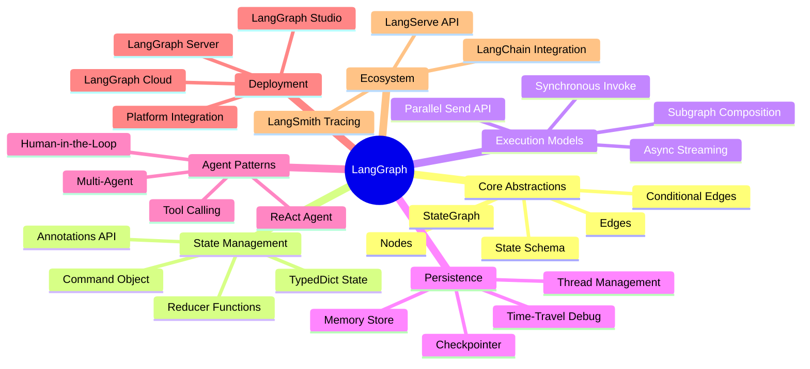
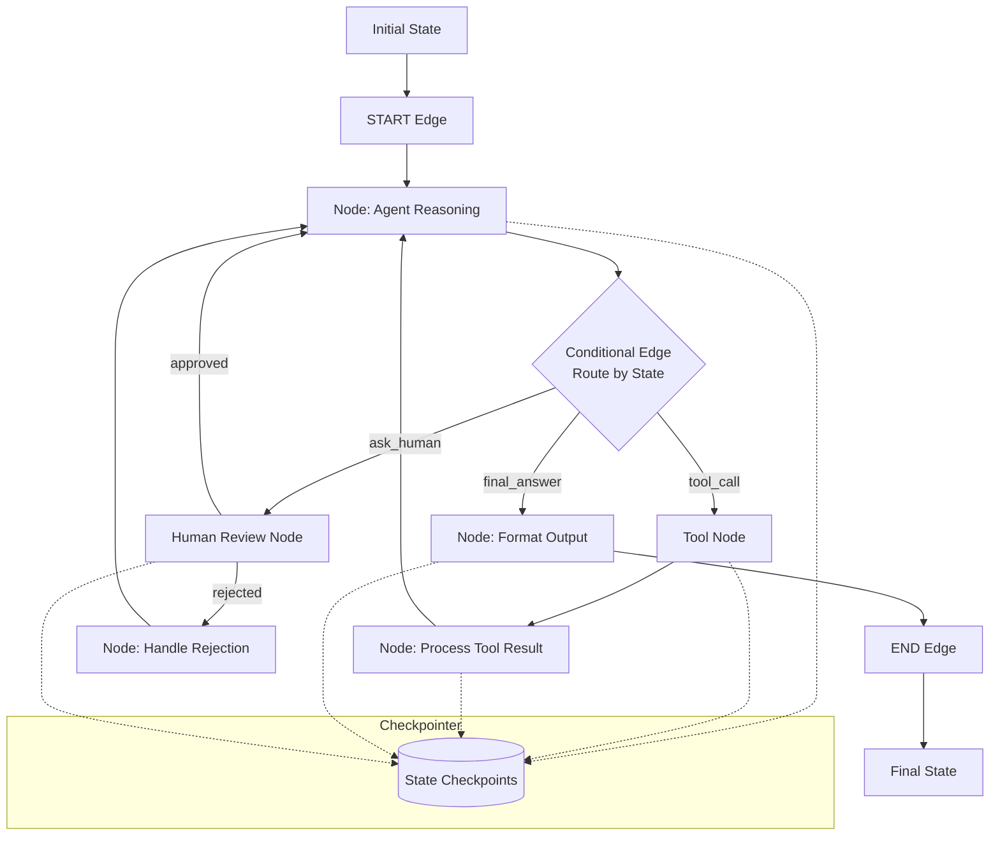
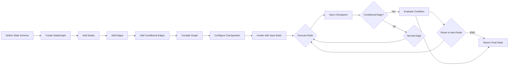
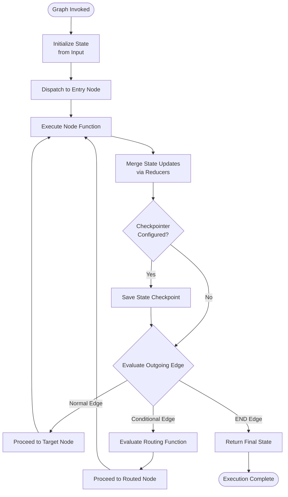
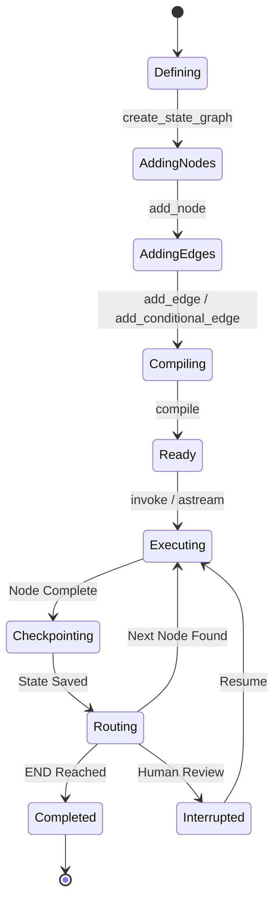
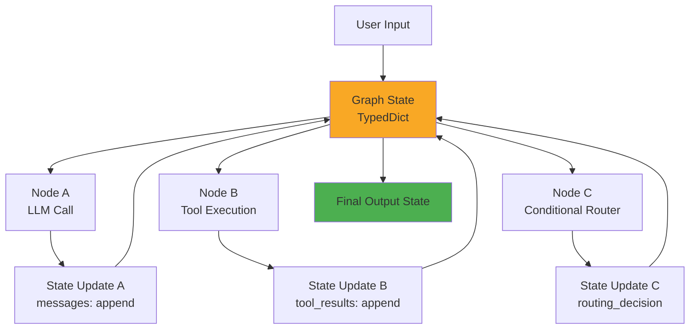
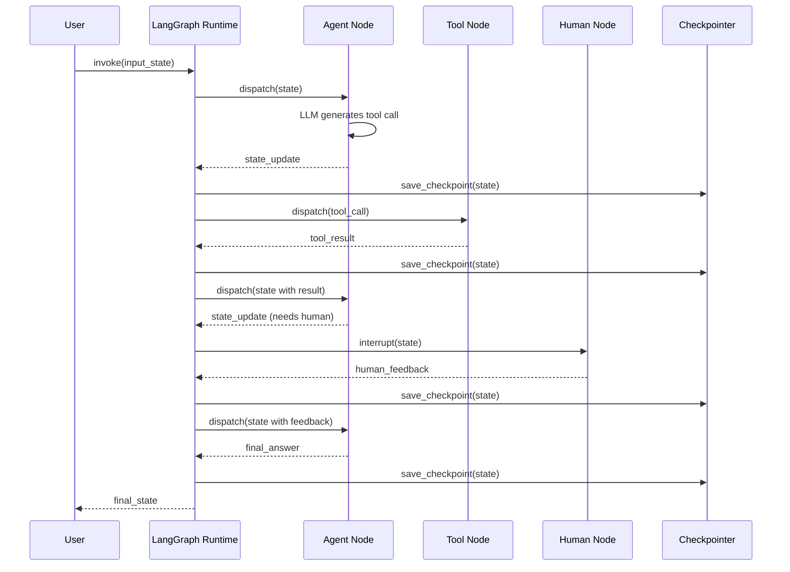

# LangGraph

## 📌 Overview

LangGraph is a production-grade framework for building stateful, multi-actor applications with large language models, designed and maintained by LangChain. It extends the graph engineering paradigm into the practical domain of AI application development, providing concrete implementations of the abstract graph concepts discussed throughout this documentation series. LangGraph treats AI workflows as directed graphs where nodes represent computation steps (such as LLM calls, tool invocations, data transformations, or human interactions) and edges represent the flow of data and control between these steps. By modeling AI applications as graphs, LangGraph provides a level of control, observability, and extensibility that is difficult to achieve with simpler chain-based or sequential architectures.

The framework addresses a critical gap in the LLM application ecosystem. While early LLM frameworks focused on simple prompt chaining—where one LLM call feeds into the next in a fixed sequence—real-world AI applications require complex, dynamic workflows. An AI agent might need to reason about a problem, decide which tools to use, execute those tools, evaluate the results, potentially retry or try alternative approaches, and eventually produce a final answer. These workflows involve loops, conditional branching, parallel execution, and human intervention—patterns that are naturally expressed as graphs but awkward to express as chains. LangGraph provides the graph primitives needed to build these sophisticated workflows with clean, maintainable code.

LangGraph's design philosophy emphasizes developer control and production readiness. Unlike frameworks that abstract away the execution details behind high-level APIs, LangGraph makes the graph structure explicit and gives developers fine-grained control over state management, node execution, edge routing, and error handling. This explicitness makes applications easier to debug (you can inspect the graph structure and execution trace), easier to test (you can test individual nodes and edges in isolation), and easier to deploy (the graph definition is a declarative specification that maps naturally to infrastructure). Combined with built-in support for persistence, streaming, human-in-the-loop workflows, and deployment to popular platforms, LangGraph provides a complete toolkit for building production AI systems.

## 🎯 Learning Objectives

By studying LangGraph, you will learn to use a leading graph engineering framework to build production-ready AI applications. You will understand LangGraph's core abstraction—the StateGraph—and how it encapsulates the graph topology, state schema, and execution semantics of an AI workflow. You will learn to define nodes as Python functions that read from and write to a shared state object, and to define edges that control the flow of execution between nodes, including conditional edges that route dynamically based on the current state.

You will develop proficiency with LangGraph's state management system, which provides typed, structured state that flows through the graph and is modified by nodes at each step. You will understand how to define state schemas using Python type annotations and Pydantic models, how to control which nodes can read and write which parts of the state using reducer functions, and how to persist state across executions using LangGraph's built-in checkpointer system. You will learn to implement common state patterns including accumulating results, maintaining conversation history, tracking tool execution logs, and managing agent planning state.

Additionally, you will master LangGraph's advanced features including subgraphs (embedding one graph inside another for modularity and reuse), parallel node execution (using the Send API for map-reduce patterns), streaming (incrementally producing output as nodes execute), human-in-the-loop workflows (pausing execution for human review and approval), and deployment patterns for production environments. You will also learn how LangGraph compares to alternative frameworks, enabling you to make informed technology choices for your AI projects.

## 🧠 Definition

LangGraph is an open-source Python framework that enables developers to build stateful, multi-step AI applications by defining them as directed graphs. The framework's central abstraction is the StateGraph—a graph where each node is a Python function that receives the current graph state as input and returns state updates, and each edge defines a directed transition from one node to another. The graph maintains a typed state object that is threaded through all node executions, providing a shared context that nodes can read from and write to. This state-centric design makes LangGraph particularly well-suited for building AI agents that must maintain context, make decisions based on accumulated information, and coordinate multiple computational steps.

LangGraph's execution model is deterministic and replayable. Given the same initial state and the same node functions, a LangGraph graph will always produce the same execution path and final state. This determinism is critical for debugging (you can reproduce and analyze any execution), testing (you can write deterministic tests for graph behavior), and deployment (you can reason about the graph's behavior without worrying about non-deterministic scheduling). The framework achieves this determinism through explicit graph definitions—every possible execution path is defined by the graph's edges, and the runtime follows these definitions precisely.

The framework provides several specialized graph types beyond the basic StateGraph. MessageGraph is optimized for chatbot-style applications where state is a list of messages. The Send API enables parallel execution patterns where a single node fans out to multiple parallel node invocations. Subgraphs allow embedding one StateGraph inside another, enabling modular composition of complex workflows from simpler, reusable components. Each of these specialized types builds on the same core abstraction—nodes that transform state, connected by edges that define execution flow—while providing convenience features for common patterns.

LangGraph integrates closely with the broader LangChain ecosystem but is designed to be framework-agnostic at its core. Nodes can use LangChain's LLM abstractions (ChatModels, Chains, Tools) but can also use any Python function, including direct API calls, database queries, or custom computation. This flexibility means that LangGraph can orchestrate AI workflows that span multiple frameworks and libraries, serving as a universal graph-based orchestration layer for AI applications.

## ❓ Why It Matters

LangGraph matters because it bridges the gap between the theoretical power of graph-based AI workflows and the practical reality of building production applications. Before LangGraph, developers who wanted to build complex AI agents had two unattractive options: use simple chain-based frameworks that could not express complex workflows (forcing them to write ad-hoc control flow in Python code that was hard to debug and maintain), or build custom graph execution engines from scratch (requiring enormous engineering effort for infrastructure that was not their core product). LangGraph provides a production-ready graph execution engine out of the box, letting developers focus on their AI logic rather than graph infrastructure.

LangGraph matters because it makes graph engineering accessible to AI application developers. The concepts of nodes, edges, state, and conditional routing are intuitive and well-documented in LangGraph, allowing developers to express complex workflows in clean, readable Python code. The framework's type-safe state management catches errors at development time rather than at runtime. Its visual debugging tools let developers inspect graph structures and execution traces. Its persistence and streaming support addresses the practical requirements of production deployment. By lowering the barrier to graph engineering, LangGraph enables a broader community of developers to build sophisticated AI applications.

Furthermore, LangGraph matters because it provides a shared vocabulary and set of patterns for the AI engineering community. As the ecosystem of LangGraph applications grows, developers can share graph patterns, reusable subgraphs, and deployment configurations. The framework's explicit graph definitions serve as documentation—reading a LangGraph graph definition tells you exactly what an AI application does, in what order, and under what conditions. This shared vocabulary accelerates development, facilitates code review, and enables the kind of compositional reuse that drives software engineering productivity.

## 🏛️ Core Concepts

**StateGraph** is the primary building block in LangGraph. A StateGraph is defined by three things: a state schema (a Python type definition specifying the structure of the data that flows through the graph), a set of nodes (Python functions that receive the current state and return partial state updates), and a set of edges (directed connections between nodes that define the execution order). The StateGraph is compiled into an executable graph that can be invoked with an initial state and produces a final state after executing all nodes in the appropriate order. The state schema typically uses Python's TypedDict or Pydantic BaseModel to provide type safety and documentation.

**Nodes** are the computational units of a LangGraph graph. Each node is a Python function that takes the current graph state as input and returns a dictionary of state updates. The node does not modify the state directly—it returns updates that the runtime applies to the state, producing a new state for the next node. This functional approach ensures that state transitions are explicit and trackable. Nodes can perform any computation: calling LLMs, executing tools, querying databases, transforming data, or interacting with external services. A node's return value is merged with the current state, with the merging behavior controlled by reducer functions defined in the state schema.

**Edges** define the flow of execution between nodes. Normal edges specify an unconditional transition from one node to another—when the source node completes, execution proceeds to the destination node. Conditional edges specify a dynamic transition based on the current state—a routing function examines the state and returns the name of the next node to execute. Conditional edges are the mechanism for implementing branching logic, decision points, and loops in the graph. A special START edge connects the graph's entry point to the first node, and END edges connect terminal nodes to the graph's exit.

**State and Reducers** are LangGraph's mechanism for managing shared data across the graph. The state is a typed dictionary that accumulates information as the graph executes. Each key in the state dictionary can have an associated reducer function that defines how new values are merged with existing values. The default reducer simply replaces the old value with the new one. Common custom reducers include appending (accumulating a list of messages or results), merging (combining dictionaries), and deduplicating (adding to a set). Reducers give nodes fine-grained control over state modification, enabling patterns where multiple nodes contribute to the same state key without overwriting each other's contributions.

**Checkpointer** is LangGraph's persistence mechanism that saves the graph's state after each node execution. When a graph is configured with a checkpointer, the runtime automatically persists the state after every node, enabling features like time-travel debugging (inspecting the state at any point in the execution history), resumable execution (pausing a graph and resuming it later, possibly on a different machine), and fault recovery (restarting a graph from its last checkpoint after a failure). LangGraph includes several checkpointer implementations including in-memory (for development), SQLite (for single-server deployment), and PostgreSQL (for production).

**Subgraphs** enable modular composition by allowing one StateGraph to be embedded as a node within another StateGraph. The parent graph treats the subgraph as a single node—executing it by passing state in and receiving state out—while internally the subgraph executes its own nodes and edges. Subgraphs can have their own state schemas that map to the parent's state, providing encapsulation and reuse. This composition pattern is essential for building complex workflows from manageable, testable, reusable components.

## 🧩 Key Components

**StateGraph Builder** is the primary API for constructing LangGraph graphs. The builder provides methods for adding nodes (`add_node`), adding edges (`add_edge`), adding conditional edges (`add_conditional_edges`), and setting entry/exit points (`set_entry_point`, `set_finish_point`). The builder compiles the graph definition into an executable `CompiledGraph` that can be invoked with input state. The builder enforces structural constraints such as ensuring all conditional edge targets are valid node names and that the graph has no unreachable nodes (unless explicitly allowed).

**Compiled Graph** is the executable artifact produced by compiling a StateGraph. The compiled graph is optimized for execution—it resolves all edge targets, validates the state schema, and prepares internal data structures for efficient node dispatch. The compiled graph provides the `invoke` method (for synchronous execution), `astream` method (for streaming execution), and `ainvoke` method (for asynchronous execution). It also supports configuration parameters that control behavior such as checkpointer selection, thread IDs for stateful conversations, and debugging flags.

**Command Object** is LangGraph's mechanism for nodes to return both state updates and execution control instructions in a single response. A Command can include state updates (merged into the graph state via reducers), a `goto` field (specifying the next node to execute, overriding the normal edge routing), and a `resume` field (providing a value to a node that is waiting for human input). This unified return type gives nodes expressive control over both data flow and control flow, enabling patterns that are difficult to express with separate state returns and edge definitions.

**Tool Node** is a built-in LangGraph node that bridges the gap between LLM tool calls and graph execution. When an LLM generates a tool call (as part of its response), the Tool Node automatically executes the specified tool with the provided arguments and returns the result to the graph state. The Tool Node handles tool execution errors, formats tool results for the LLM, and supports both synchronous and asynchronous tool implementations. It is the standard mechanism for connecting LLMs to external tools in LangGraph agent architectures.

**Memory Store** provides long-term memory that persists across multiple graph executions, separate from the per-execution state managed by the checkpointer. While the checkpointer saves the state of a single graph execution, the Memory Store provides a key-value store that graphs can read from and write to across executions. This is essential for applications that need to remember information from previous conversations or build up knowledge over time. The Memory Store supports namespaces for organizing memories and is typically backed by a database for durability.

**LangGraph Studio** is a visual development environment for building and debugging LangGraph applications. Studio provides a visual representation of the graph structure, real-time execution tracing that shows which nodes are executing and what state they're producing, and interactive debugging that allows developers to step through graph execution node by node. Studio integrates with the LangGraph Server for deployment, providing a seamless development-to-production workflow.

## 🧭 Mental Model

Think of LangGraph as a sophisticated assembly line in a smart factory. The factory floor layout is the graph definition—it shows every workstation (node), every conveyor belt connecting workstations (edge), and every quality check station that decides where to route items next (conditional edge). The product being assembled is the state—it starts as raw materials (initial state), and each workstation adds components or modifies the product (state updates) as it passes through. The factory's quality control system is the checkpointer—it takes a snapshot of the product at every station, so if something goes wrong, you can trace back to see exactly where and why.

When a new order comes in (a graph invocation), the product starts at the first workstation (the entry node). After the workstation finishes its work, the conveyor belt system (edges) routes it to the next station based on the product's current state. If the quality check at station three (a conditional edge) determines the product needs rework, it routes back to station two (a loop). If the product needs special handling, it might be routed to a side station (a subgraph) that handles a specific operation before returning to the main line.

The factory can handle multiple orders simultaneously (multiple graph executions), each tracked independently with its own conveyor belt and quality control records (separate state threads). The factory manager (the developer) can look at the floor plan (the graph definition) to understand the entire process at a glance, and can inspect the quality control records (checkpoints) to diagnose any issues. If a workstation needs to be upgraded (a node needs to be changed), the manager can modify it without redesigning the entire factory floor, because the graph structure separates the individual operations from the overall workflow.

## 🗺️ Mind Map

## 🏗️ Architecture Diagram

## 🔄 Workflow

## ⚙️ Internal Working

The internal operation of LangGraph proceeds through several well-defined phases. During the **graph definition phase**, the developer creates a StateGraph, specifies a state schema using TypedDict or Pydantic models, adds nodes (Python functions), and adds edges (normal and conditional). Each node function is registered with a name that identifies it in the graph. Conditional edges are registered with a routing function that takes the current state and returns the name of the next node. The state schema may define reducer functions for individual state keys, specifying how updates from different nodes are merged.

During the **compilation phase**, the `compile()` method validates the graph structure and produces an executable CompiledGraph. Validation checks include verifying that all edge targets reference existing nodes, that the graph has a valid entry point, that there are no disconnected node clusters (unless the developer explicitly allows them), and that the state schema is internally consistent. The compiler also resolves the inheritance chain for state schemas, builds internal lookup tables for efficient node dispatch, and prepares the checkpointer integration. The compiled graph is a frozen, immutable artifact that can be safely shared across threads and executions.

During the **execution phase**, the runtime processes the graph step by step. It begins by creating the initial state from the input and any default values in the state schema. It then dispatches the first node (specified by the entry point edge). The node function receives the current state and returns a partial state update. The runtime merges this update into the current state using the reducer functions defined in the schema. If a checkpointer is configured, the runtime saves the new state as a checkpoint before proceeding. The runtime then evaluates the outgoing edges from the completed node: if it's a normal edge, execution proceeds to the specified node; if it's a conditional edge, the routing function is called with the current state to determine the next node; if it's an END edge, execution terminates and the final state is returned.

During the **state management phase**, the runtime handles the complexities of state updates. When a node returns a partial state update (a dictionary with some but not all state keys), the runtime merges only the specified keys into the current state, leaving other keys unchanged. If a key has a custom reducer, the reducer is called with the current value and the new value to produce the merged result. For example, if the messages key has an append reducer, a node that returns `{"messages": [new_message]}` will append the new message to the existing list rather than replacing it. This reducer-based merging enables multiple nodes to contribute to shared state keys without conflicts.

## 🔀 Execution Flow

## 📊 Lifecycle

## 📡 Data Flow

## 🤝 Interaction Flow

## 🌍 Real-World Analogy

Imagine a sophisticated air traffic control system where the control tower manages the flow of aircraft through a series of decision points. Each aircraft (a piece of state) enters the controlled airspace with an initial flight plan (the input state). The radar controller (a node) tracks the aircraft and updates its position in the system (state update). Based on the aircraft's position, destination, and weather conditions (conditional edge evaluation), the system routes it to the appropriate next step—perhaps holding pattern (a loop node), direct approach (a normal edge), or diversion to an alternate airport (a conditional branch).

The air traffic control system maintains a complete record of every aircraft's journey through the airspace (the checkpointer). If an emergency occurs, controllers can review the exact sequence of decisions and aircraft states that led to the situation. If a controller needs to be replaced mid-shift (a failover), the incoming controller has a complete, up-to-date picture of every aircraft's status. Specialized controllers handle specific tasks—ground control for taxiing, approach control for landings, en-route control for cruising—each operating as a specialized node within the overall system.

This analogy captures LangGraph's essence: a structured, stateful system where discrete decision points (nodes) process items (state) according to defined rules (edges), with complete auditability (checkpoints) and the ability to handle exceptions (human-in-the-loop interrupts). Just as air traffic control safely manages thousands of concurrent flights through a well-defined procedural framework, LangGraph manages complex AI workflows through its graph-based execution model.

## 💡 Practical Example

Consider building a customer support AI agent using LangGraph. The agent must understand the customer's query, determine whether it can answer directly or needs to look up information, potentially use tools like a knowledge base search or account lookup, and always ensure the response is appropriate before sending it to the customer. Here's how this maps to LangGraph concepts.

The state schema defines a TypedDict with keys for `messages` (the conversation history, with an append reducer), `customer_id` (the identified customer), `search_results` (knowledge base results), and `next_action` (the routing decision). The graph has nodes for `classify_intent` (categorizes the customer's message), `answer_directly` (generates a response from the LLM's knowledge), `search_knowledge_base` (queries the knowledge base), `lookup_account` (retrieves customer account data), and `format_response` (finalizes the response for the customer).

The edges define the workflow: START connects to `classify_intent`. A conditional edge from `classify_intent` routes to `answer_directly` for simple questions, to `search_knowledge_base` for product information, or to `lookup_account` for account-related questions. Both `search_knowledge_base` and `lookup_account` connect back to `answer_directly` via an intermediate node that incorporates the retrieved information into the LLM context. A conditional edge from `answer_directly` routes to `format_response` for normal responses or to a human review node for sensitive topics. The checkpointer saves state after every node, enabling conversation continuity across multiple interactions and providing an audit trail of every decision the agent made.

This LangGraph implementation provides clear advantages over a simpler chain-based approach: the graph structure makes the agent's decision logic explicit and visualizable, the checkpointer enables conversation persistence and debugging, the conditional edges make the routing logic testable in isolation, and the modular node structure allows individual components to be updated without affecting the overall workflow. The agent can be extended with new node types (such as a sentiment analysis node or a translation node) by adding nodes and edges to the graph, without restructuring the existing code.

## 🧪 Use Cases

**Conversational AI Agents:** LangGraph excels at building stateful chatbots and conversational agents that maintain context across multiple turns, use tools to retrieve information, and handle complex multi-step conversations. The checkpointer provides conversation persistence, the state schema manages message history, and conditional edges implement the agent's decision logic. This is the most common use case for LangGraph and the one for which its design is most naturally suited.

**Multi-Step Research Assistants:** AI research assistants that must query multiple sources, synthesize information, and produce comprehensive reports benefit from LangGraph's ability to express complex workflows as graphs. Nodes handle individual research steps (web search, paper retrieval, data extraction, analysis), edges define the research methodology, and the state accumulates findings across the research process. The graph structure makes the research methodology explicit and modifiable.

**Code Generation and Review Pipelines:** Automated code generation systems that must generate code, run tests, review results, and iterate can be expressed as LangGraph graphs where nodes handle generation, testing, review, and refinement. Conditional edges route code back for revision when tests fail or review identifies issues. The checkpointer enables tracking the complete history of code generation iterations.

**Data Processing Workflows:** ETL (Extract, Transform, Load) and data processing pipelines benefit from LangGraph's graph structure, which naturally expresses the sequential and conditional steps of data processing. Nodes handle individual processing steps, edges define the data flow, and the state carries the data being processed. LangGraph's streaming support enables incremental output as data is processed.

**Multi-Agent Systems:** LangGraph supports multi-agent architectures where different agents (each potentially implemented as their own subgraph) collaborate on complex tasks. The parent graph coordinates agent interactions, routes tasks to appropriate agents, and aggregates results. Each agent subgraph manages its own internal state while communicating with other agents through the parent graph's state. This pattern enables sophisticated AI systems that combine specialized agents for different capabilities.

## ⚖️ Comparison

| Aspect | LangGraph | LangChain Chains | AutoGen | CrewAI |
|---|---|---|---|---|
| **Core Model** | Stateful graphs | Linear chains | Agent chat | Role-based crews |
| **Control Flow** | Explicit edges | Sequential/conditional | Conversation-driven | Task delegation |
| **State Management** | Typed state + reducers | Implicit memory | Shared context | Task outputs |
| **Loops** | Native support | Limited | Conversation loops | Sequential tasks |
| **Parallelism** | Send API | Batch chains | Group chat | Parallel tasks |
| **Persistence** | Built-in checkpointer | Limited | External | External |
| **Visualization** | LangGraph Studio | LangSmith | Minimal | Crew dashboard |
| **Composition** | Subgraphs | Chain composition | Limited | Crew nesting |
| **Human-in-Loop** | Native interrupts | Callbacks | Manual | Manual |
| **Best For** | Complex stateful workflows | Simple pipelines | Multi-agent chat | Team-based AI |

LangGraph's primary differentiator is its explicit graph structure, which provides superior control, debuggability, and composability compared to chain-based or conversation-based frameworks. While LangChain Chains are simpler for basic sequential workflows, they become unwieldy for complex workflows involving loops, parallelism, and conditional routing. AutoGen and CrewAI excel at multi-agent collaboration but provide less explicit control over execution flow. LangGraph occupies the sweet spot for developers who need the power of graph-based orchestration with the ergonomics of a well-designed Python framework.

## ✅ Best Practices

**Design State Schemas Carefully:** The state schema is the foundation of a LangGraph application. Invest time in designing a state schema that clearly separates concerns, uses appropriate types, and defines reducers that prevent accidental data loss. Use separate keys for different types of data (messages, tool results, routing decisions, metadata) rather than dumping everything into a single generic dictionary. Use Pydantic models for complex state values to get validation and documentation. Use the `Annotated` type to attach reducers to state keys, making the merging behavior explicit and type-safe.

**Keep Nodes Focused and Testable:** Each node should do one thing well. A node that both calls an LLM and decides what to do next is doing too much—split it into separate nodes so that each can be tested, debugged, and modified independently. Write unit tests for each node function by calling it directly with test state inputs and verifying the returned updates. This unit testing approach is one of LangGraph's major advantages over frameworks that make it difficult to test individual components in isolation.

**Use Conditional Edges for All Routing Logic:** Resist the temptation to implement routing logic inside node functions (such as returning a `goto` command from every node). Instead, use the graph's conditional edges to express routing decisions. This keeps the graph's control flow visible in the graph definition, makes the routing logic testable, and enables visualization tools to show the complete execution paths. Reserve the `goto` command for truly dynamic cases where the routing target cannot be determined from the state alone.

**Leverage Subgraphs for Modularity:** As your graph grows beyond 5-7 nodes, consider breaking it into subgraphs. Each subgraph should encapsulate a coherent piece of functionality—a retrieval pipeline, a reasoning loop, a formatting step. Subgraphs can be developed, tested, and versioned independently, and can be reused across different parent graphs. The subgraph boundary also provides a natural scope for state encapsulation, keeping each subgraph's internal state private while exposing only the necessary inputs and outputs.

**Always Use a Checkpointer in Production:** Even if your application doesn't seem to need persistence, the checkpointer provides critical production capabilities: execution tracing for debugging, fault recovery after crashes, and the ability to inspect any past execution. The checkpointer's overhead is minimal (a database write per node execution) and the benefits are enormous. Use the SQLite checkpointer for development and the PostgreSQL checkpointer for production deployment.

## ❌ Common Mistakes

**Mutating State Inside Nodes:** The most common LangGraph mistake is modifying the state dictionary directly inside a node function instead of returning state updates. LangGraph's execution model requires nodes to be pure functions that return updates—the runtime then merges these updates into the state. Mutating state directly breaks the checkpointer's ability to track changes, breaks streaming, and can cause race conditions in parallel execution. Always return a dictionary of updates and let the runtime handle state management.

**Overly Broad Conditional Edges:** Conditional edges that route to too many possible nodes create graphs that are difficult to understand, test, and debug. A conditional edge with ten possible targets is a code smell—consider refactoring the routing logic into multiple sequential conditional edges (first a coarse classification, then finer-grained routing) or using subgraphs to encapsulate the complex routing within a dedicated component. Clear, readable routing is essential for maintaining complex LangGraph applications.

**Ignoring Reducer Semantics:** When a state key uses a non-default reducer (such as append), developers sometimes forget that the reducer determines how updates are merged. Returning `{"messages": "a single string"}` when the messages key has an append reducer expecting a list will cause a runtime error. Always ensure that the format of your state updates matches the expectations of the reducers defined in the state schema. Write tests that verify the reducer behavior for each state key.

**Building Monolithic Graphs:** As applications grow, developers often add more and more nodes to a single graph rather than breaking it into subgraphs. This creates graphs with dozens of nodes that are difficult to understand, test, and maintain. Set a threshold (such as 7-10 nodes) and refactor into subgraphs when a graph exceeds it. The refactoring pays for itself in improved development velocity and reduced debugging time.

**Neglecting Error Handling in Nodes:** Nodes that call external services (LLMs, APIs, databases) can fail, and these failures must be handled gracefully. Return error information in the state update rather than raising exceptions, allowing downstream nodes (or conditional edges) to route to error handling logic. Use try-except blocks in node functions and include error details in the returned state. Design the graph with error handling paths—dedicated nodes or conditional edge branches that handle specific error types.

## 🚀 Advanced Topics

**Dynamic Graph Construction** involves building LangGraph graphs programmatically based on configuration, user input, or runtime conditions. Rather than defining a fixed graph structure, the developer writes code that constructs the StateGraph by adding nodes and edges based on parameters. This enables patterns like configurable agent architectures (where the user selects which tools are available and the graph is built accordingly), multi-tenant systems (where different tenants have different graph structures), and self-modifying agents (where the agent can add new nodes and edges to its own graph based on learned patterns). Dynamic graph construction requires careful validation to ensure the resulting graph is structurally sound.

**Streaming Architectures** in LangGraph go beyond simple output streaming to support fine-grained streaming of intermediate results. LangGraph supports four levels of streaming: value streaming (receiving the complete state after each node), update streaming (receiving only the state delta produced by each node), event streaming (receiving structured events including custom events emitted by nodes), and token streaming (receiving individual LLM tokens as they are generated). Advanced streaming architectures combine these levels to provide real-time visibility into graph execution—for example, streaming LLM tokens from a generation node while simultaneously streaming progress updates from a parallel retrieval node.

**Multi-Agent Orchestration** with LangGraph involves building systems where multiple AI agents, each with their own subgraph, collaborate on complex tasks. LangGraph's `create_react_agent` factory provides a quick way to create ReAct-style agent subgraphs, while the parent graph coordinates agent interactions. Advanced patterns include supervisor architectures (a manager agent delegates tasks to worker agents), swarm architectures (agents communicate directly with each other through a shared message bus), and hierarchical architectures (multi-level supervisor structures). Each agent subgraph can have its own state, tools, and LLM configuration, enabling true specialization while the parent graph provides coordination.

**LangGraph Platform Deployment** extends LangGraph from a library to a platform with managed deployment, scaling, and monitoring. The LangGraph Platform provides a server that hosts compiled graphs as API endpoints, automatic scaling based on request volume, integrated persistence with managed checkpointers, and observability through LangSmith integration. Advanced deployment patterns include blue-green deployments (running two graph versions simultaneously for zero-downtime updates), canary deployments (routing a fraction of traffic to a new graph version for testing), and multi-region deployment (running graph instances in multiple geographic regions for low-latency access). The platform's API supports both synchronous invocation and Server-Sent Events (SSE) for streaming responses, making it suitable for both backend-to-backend and client-facing applications.