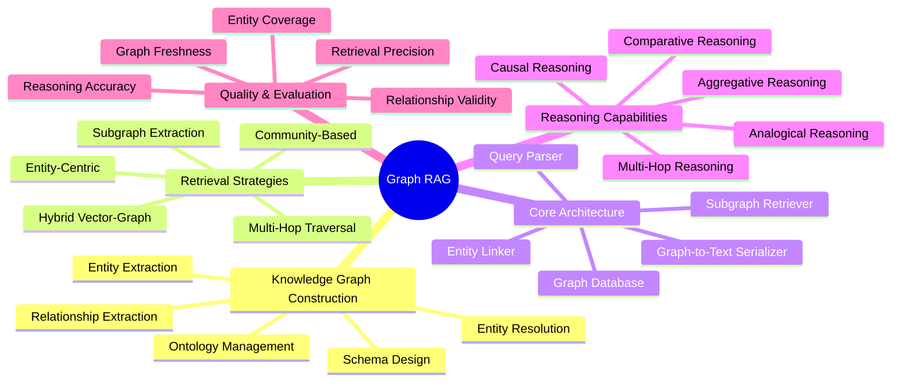
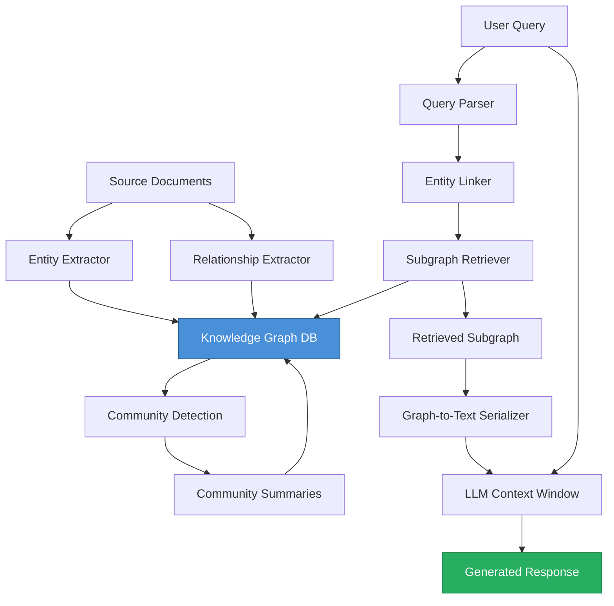
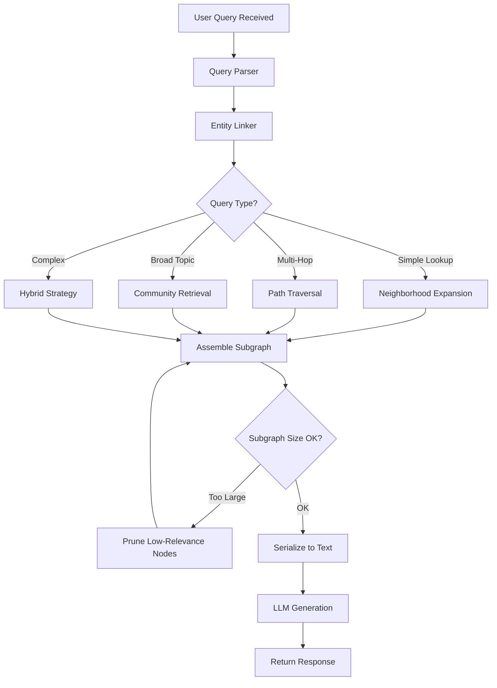
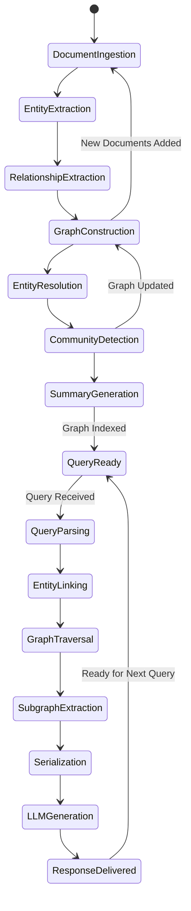
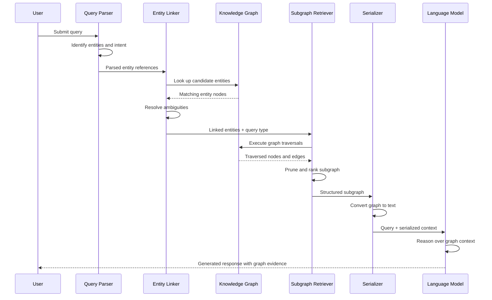

# Graph RAG

## 📌 Overview

Graph RAG represents a paradigm shift in how retrieval-augmented generation systems access and reason over structured knowledge. Traditional RAG systems rely on vector similarity search over flat text chunks, which works well for simple fact retrieval but struggles with complex, multi-faceted questions that require connecting disparate pieces of information. Graph RAG addresses this limitation by organizing retrieved knowledge as a graph—a network of entities, relationships, and community structures—enabling the AI to traverse and reason over interconnected knowledge rather than treating each piece of information in isolation. This approach transforms RAG from a simple "fetch and generate" mechanism into a sophisticated knowledge navigation system.

The emergence of Graph RAG is driven by the recognition that human knowledge is inherently relational. When a medical professional asks about drug interactions, they need to understand relationships between drugs, conditions, dosages, and patient histories—relationships that are naturally expressed as graph edges. When a legal researcher investigates case law, they need to trace chains of precedent, distinguishing, and overruling—patterns that are naturally expressed as graph paths. Graph RAG captures these relational structures and makes them available to the LLM during generation, dramatically improving the quality and accuracy of responses for complex queries.

Graph RAG systems typically combine three key elements: a knowledge graph that encodes entities and relationships extracted from source documents, a graph-based retrieval mechanism that identifies relevant subgraphs rather than individual chunks, and an LLM that receives both the user query and the retrieved graph context to generate its response. This combination enables capabilities that are impossible with traditional RAG, including multi-hop reasoning (following chains of relationships to answer questions), community-aware retrieval (understanding how different clusters of knowledge relate to each other), and entity-driven disambiguation (using graph structure to resolve ambiguous references).

## 🎯 Learning Objectives

By studying Graph RAG, you will learn to design retrieval systems that leverage graph-structured knowledge to dramatically improve the quality of LLM-generated responses. You will understand the fundamental differences between vector-based and graph-based retrieval, and when each approach is most appropriate. You will learn to build knowledge graphs from unstructured text using entity extraction and relationship identification techniques, and to integrate these graphs into RAG pipelines that serve relevant, interconnected context to language models.

You will develop proficiency with graph-based retrieval strategies, including entity-centric retrieval (finding all information related to a specific entity), relationship-path retrieval (tracing connections between entities), and community-based retrieval (identifying clusters of related entities that collectively address a query). You will understand how to implement multi-hop reasoning paths that traverse multiple edges in the knowledge graph to connect distant concepts, enabling the RAG system to answer questions that require synthesizing information across multiple documents or domains.

Additionally, you will master the architectural patterns for building production Graph RAG systems, including hybrid retrieval (combining vector search with graph traversal), community detection algorithms (such as Leiden or Louvain) for organizing large knowledge graphs into manageable clusters, and entity resolution techniques for maintaining graph quality. You will also learn to evaluate Graph RAG systems using metrics that capture relational reasoning quality, not just fact retrieval accuracy.

## 🧠 Definition

Graph RAG is a retrieval-augmented generation architecture that uses graph-structured knowledge representations—typically knowledge graphs—as the primary retrieval substrate, rather than or in addition to traditional vector embeddings. In a Graph RAG system, source documents are processed to extract entities (people, organizations, concepts, events) and the relationships between them, which are stored as nodes and edges in a knowledge graph. When a user query arrives, the system identifies relevant entities and relationships in the graph, retrieves a connected subgraph that provides context for the query, and passes this structured context along with the query to an LLM for response generation.

The "graph" in Graph RAG refers not to mathematical graph theory but to the engineering practice of representing knowledge as interconnected nodes and edges. Each node represents a discrete piece of knowledge—an entity, a concept, a document, or a claim—and each edge represents a defined relationship between two pieces of knowledge. This graph structure enables retrieval strategies that are impossible with flat vector spaces: following relationship paths, exploring neighborhoods around entities, and leveraging community structure to provide broad context. The graph serves as a navigable map of organizational or domain knowledge that the RAG system can traverse intelligently.

Graph RAG is distinct from simply adding a knowledge graph to a traditional RAG pipeline. In a true Graph RAG system, the graph is not a supplementary data source but the primary organizing principle for retrieval. The retrieval algorithm thinks in terms of graph traversals, subgraph extraction, and entity linking rather than similarity scores over embedding vectors. This means the entire retrieval strategy—from query understanding to result ranking—is designed around the graph structure, leading to fundamentally different and often superior retrieval patterns for complex, relational queries.

## ❓ Why It Matters

Graph RAG matters because it solves the most significant limitation of traditional RAG: the inability to reason about relationships between pieces of information. Standard vector-based RAG excels at finding the most similar text chunk to a query, but it has no concept of how that chunk relates to other chunks, whether the entities mentioned in it connect to entities in other documents, or whether the answer to a question requires combining information from multiple disconnected sources. This limitation manifests as incomplete, inaccurate, or confidently wrong answers when users ask questions that require connecting dots across a knowledge base. Graph RAG directly addresses this by making relationships a first-class citizen in the retrieval process.

Graph RAG matters because it enables a new class of AI applications that require deep relational understanding. Investigative analysis tools that trace connections between people, organizations, and events need graph-structured retrieval. Medical diagnosis assistants that must consider drug interactions, comorbidities, and treatment histories need graph-structured retrieval. Legal research platforms that navigate case law precedents and statutory hierarchies need graph-structured retrieval. Supply chain optimization systems that model dependencies between suppliers, components, and logistics networks need graph-structured retrieval. None of these applications can be adequately served by flat vector search alone.

Furthermore, Graph RAG matters because it provides a natural mechanism for explainability and trust. When a Graph RAG system retrieves a subgraph, the path it followed through the knowledge graph is visible and auditable. Users can see not just what information was retrieved but why it was retrieved—what entities connected the query to the retrieved context. This transparency is critical for enterprise applications where AI-generated answers must be traceable to their sources and reasoning must be defensible. Graph RAG's explicit relational structure provides a level of interpretability that is inherently difficult to achieve with vector-only approaches.

## 🏛️ Core Concepts

**Knowledge Graph Construction** is the foundational process of building the graph that powers Graph RAG. This involves ingesting source documents, identifying entities within those documents (using named entity recognition or LLM-based extraction), identifying relationships between entities (using relationship extraction models or pattern matching), and storing the resulting entity-relationship triples in a graph database. The quality of the knowledge graph directly determines the quality of Graph RAG retrieval, making this process critical. Construction typically involves iterative refinement, including entity resolution (merging duplicate entities), relationship validation (ensuring extracted relationships are accurate), and schema enforcement (maintaining a consistent ontology for entity types and relationship types).

**Entity-Driven Retrieval** is a retrieval strategy that begins by identifying entities mentioned in or implied by the user query, then retrieves all information connected to those entities in the knowledge graph. Rather than searching for similar text, entity-driven retrieval searches for related entities. If a user asks about "the impact of Tesla's Gigafactory on the Nevada economy," the system identifies the entities Tesla, Gigafactory, and Nevada, retrieves the subgraph connecting these entities (including intermediate entities like employment statistics, tax revenue, infrastructure development), and provides this connected context to the LLM. This approach naturally handles entity disambiguation through graph structure—if the query refers to the Tesla energy company rather than Nikola Tesla the inventor, the graph neighborhood around each entity makes the correct interpretation obvious.

**Multi-Hop Reasoning** refers to the ability to traverse multiple edges in the knowledge graph to connect entities that are not directly related. In a knowledge graph, Entity A might be connected to Entity B, which is connected to Entity C, which is connected to Entity D. If a query requires information about the relationship between A and D, the system must follow the path A→B→C→D, potentially collecting contextual information at each hop. Multi-hop reasoning is one of the most powerful capabilities of Graph RAG, enabling answers to questions like "Which pharmaceutical companies that supply drugs for diabetes also manufacture vaccines?"—a question that requires traversing from pharmaceutical companies to drugs to indications to other drugs to manufacturers.

**Community Detection** is the process of identifying clusters or communities of densely interconnected entities within the knowledge graph. Communities represent coherent topics, domains, or themes within the broader knowledge base. For example, in a corporate knowledge graph, one community might cluster around product development, another around financial operations, and another around human resources. Community detection algorithms (such as Leiden, Louvain, or connected components) automatically identify these clusters. In Graph RAG, community structure is used for two purposes: summarization (generating community-level summaries that provide broad context before diving into specific entities) and retrieval pruning (limiting graph traversal to relevant communities to reduce computational cost).

**Hybrid Retrieval** combines vector-based similarity search with graph-based traversal to leverage the strengths of both approaches. Vector search excels at finding semantically similar content for simple, fact-based queries, while graph traversal excels at connecting related concepts for complex, relational queries. A hybrid system might first use vector search to identify relevant document chunks, then extract entities from those chunks and traverse the knowledge graph to find additional related context. Or it might use graph traversal to identify a candidate set of entities and relationships, then use vector search to rank and filter the results. The specific hybrid strategy depends on the application requirements and the characteristics of the knowledge base.

## 🧩 Key Components

**Graph Database** is the storage layer that persists the knowledge graph used by Graph RAG. Popular choices include Neo4j (a native graph database with Cypher query language), Amazon Neptune (a managed graph database service), and property graph stores like Memgraph or FalkorDB. The graph database must support efficient traversal queries (following paths through the graph), neighborhood queries (finding all nodes connected to a given node), and subgraph extraction (retrieving a connected portion of the graph). Performance characteristics vary significantly between graph databases, and the choice depends on the expected graph size, query patterns, and deployment requirements.

**Entity Extractor** is the component responsible for identifying entities in source documents and user queries. Modern Graph RAG systems typically use LLM-based extraction, where an LLM is prompted to identify entities and their types from text passages. The extractor outputs structured entity records (name, type, description, source document) that are inserted into the knowledge graph. Entity extraction quality is critical—if the extractor misses important entities or creates spurious ones, the entire Graph RAG pipeline suffers. Robust systems include entity extraction validation, where extracted entities are checked against existing graph entities for deduplication and consistency.

**Relationship Extractor** identifies and classifies the relationships between entities in source documents. Like entity extraction, modern systems use LLM-based extraction with carefully designed prompts that specify the relationship types in the graph schema. The relationship extractor outputs triples (subject, predicate, object) that become edges in the knowledge graph. Relationship extraction is often harder than entity extraction because relationships can be implicit (stated indirectly through context rather than explicitly) and because the same relationship can be expressed in many different linguistic forms. High-quality relationship extraction is essential for enabling multi-hop reasoning, as reasoning paths are composed of relationship edges.

**Query Parser and Entity Linker** processes the user query to identify the entities and relationships it references. The query parser breaks the query into its semantic components, identifying the core question, constraints, and entity references. The entity linker maps these references to specific nodes in the knowledge graph, handling ambiguity (e.g., distinguishing "Apple" the company from "apple" the fruit) using graph context. The output of this component is a structured query representation that drives the graph retrieval process. In advanced systems, the query parser also identifies the query type (simple lookup, multi-hop, comparative, aggregative) to select the appropriate retrieval strategy.

**Subgraph Retriever** is the core retrieval component that traverses the knowledge graph to extract relevant context for the query. Given the structured query from the entity linker, the subgraph retriever executes one or more graph traversal strategies: expanding neighborhoods around query entities, following relationship paths between entities, exploring communities identified as relevant, or executing predefined graph query patterns. The retriever assembles the traversed nodes and edges into a coherent subgraph that will be serialized into text for the LLM. The retriever must balance comprehensiveness (including enough context) with relevance (excluding noise) and size (the LLM has a finite context window).

**Graph-to-Text Serializer** converts the retrieved subgraph into a textual representation that the LLM can process. This is a deceptively important component—the way graph structure is represented in text significantly affects the LLM's ability to reason about it. Common serialization formats include triple lists ("Tesla - manufactures - Model S"), natural language narratives ("Tesla manufactures the Model S, which is an electric vehicle"), and structured templates that preserve hierarchical relationships. Advanced serializers use the LLM's known strengths, presenting graph information in formats that the model has been trained to understand well, such as structured lists, JSON-like representations, or narrative descriptions that explicitly state relationships.

## 🧭 Mental Model

Imagine you are a research librarian in a vast library where every book, article, and document has been meticulously cross-referenced with index cards. Each index card represents an entity (a person, place, concept, or event), and the cross-references on each card point to related entities—just like edges in a knowledge graph. When a patron asks a complex question like "How did the invention of the printing press influence the Protestant Reformation?" you don't just search for books matching those keywords. Instead, you pull the index card for "printing press," follow the cross-references to related technologies, economic changes, and key figures, then pull the card for "Protestant Reformation" and trace its connections to religious, political, and social movements.

As you follow these cross-reference chains, you build a mental map of connections—a subgraph—that shows how the printing press enabled the mass production of texts, how Martin Luther's theses were rapidly distributed through printed pamphlets, how literacy rates increased, and how the Catholic Church's control over religious interpretation was challenged. You then present this interconnected web of information to the patron, who can see not just individual facts but the relational structure that explains the causal chain. This is exactly what Graph RAG does: it follows the cross-references (graph edges) to build a connected body of knowledge (subgraph) that addresses the query.

The key insight is that the librarian's value comes not from knowing individual facts but from knowing how facts relate to each other. A traditional RAG system is like a librarian who can only find individual books but cannot follow the cross-references. Graph RAG is like a librarian who understands the entire cross-reference system and can navigate it intelligently to answer complex, multi-faceted questions. The knowledge graph is the card catalog system, the subgraph retriever is the librarian following cross-references, and the LLM is the librarian synthesizing the collected information into a coherent answer.

## 🗺️ Mind Map



## 🏗️ Architecture Diagram



## 🔄 Workflow

```mermaid
flowchart LR
    A[Ingest Documents] --> B[Extract Entities]
    B --> C[Extract Relationships]
    C --> D[Build Knowledge Graph]
    D --> E[Detect Communities]
    E --> F[Generate Community Summaries]
    F --> G[Graph Ready for Queries]
    
    G --> H[Receive User Query]
    H --> I[Parse and Link Entities]
    I --> J[Traverse Knowledge Graph]
    J --> K[Extract Relevant Subgraph]
    K --> L[Serialize to Text]
    L --> M[Generate LLM Response]
    M --> N[Return Answer with Sources]
```



## ⚙️ Internal Working

The Graph RAG pipeline operates in two major phases: the offline indexing phase and the online query phase. During the offline indexing phase, source documents are processed to build the knowledge graph. Each document is first segmented into manageable passages, and each passage is processed by the entity extractor to identify named entities, concepts, and other salient items. The extracted entities are normalized (resolving variations like "United States," "U.S.," and "USA" to a single canonical entity) and inserted as nodes in the knowledge graph database.

Next, the relationship extractor processes each passage to identify how the extracted entities relate to each other. This produces relationship triples that become edges in the knowledge graph. The relationship extraction is typically guided by a predefined schema that specifies the valid relationship types (e.g., "works_for," "located_in," "causes," "part_of"), ensuring consistency across the graph. The extracted relationships are validated against the schema and inserted into the graph database alongside metadata such as source document, passage location, and extraction confidence.

Once the knowledge graph is populated, community detection algorithms analyze the graph structure to identify clusters of densely interconnected entities. These communities represent coherent topics or domains within the knowledge base. For each community, an LLM generates a summary that captures the key themes and relationships within that cluster. These community summaries serve as a high-level index into the knowledge graph, enabling the query phase to quickly identify which parts of the graph are relevant to a given query without traversing the entire graph.

During the online query phase, the user query is processed by the query parser, which identifies the entities, relationships, and question types referenced in the query. The entity linker maps these references to specific nodes in the knowledge graph, resolving ambiguities using graph context. The subgraph retriever then executes one or more traversal strategies starting from the linked entities, expanding outward through the graph along relevant relationship edges. The traversal is typically bounded by a hop limit (maximum number of edges to traverse) and a relevance threshold (minimum relevance score for including a node).

The retrieved subgraph is serialized into a textual format that preserves the relational structure, along with any relevant community summaries. This serialized context is combined with the user query and fed to the LLM, which generates a response that draws on the interconnected knowledge provided by the graph. The LLM's response is enhanced by the graph structure because it can see not just isolated facts but the relationships between them, enabling more nuanced, accurate, and comprehensive answers.

## 🔀 Execution Flow



## 📊 Lifecycle



## 📡 Data Flow

```mermaid
flowchart TD
    DOC[(Source Documents)] |"Raw text content"| EX[Entity & Relation Extractors]
    EX |"Entity nodes + Relationship edges"| KG[(Knowledge Graph)]
    KG |"Graph structure"| CD[Community Detection Algo]
    CD |"Community assignments"| CS[Community Summarizer LLM]
    CS |"Topic summaries"| KG
    
    QRY[(User Query)] |"Natural language question"| QP[Query Parser]
    QP |"Parsed entities + intent"| EL[Entity Linker]
    EL |"Linked graph nodes"| SR[Subgraph Retriever]
    SR |"Graph traversal queries"| KG
    KG |"Matching nodes & edges"| SR
    SR |"Extracted subgraph"| SER[Graph-to-Text Serializer]
    SER |"Structured text context"| CTX[Context Assembly]
    QRY |"Original query"| CTX
    CTX |"Query + graph context"| LLM[Language Model]
    LLM |"Generated answer"| OUT[(Response)]
```

## 🤝 Interaction Flow



## 🌍 Real-World Analogy

Think of Graph RAG as a seasoned detective investigating a complex case. A traditional RAG system is like a detective who can search through file cabinets and pull out individual documents that mention specific keywords. If you ask about a suspect's connections to a criminal network, the detective pulls every file mentioning the suspect's name and hands you a stack of papers. You have to manually read through each paper and figure out the connections yourself.

Graph RAG, on the other hand, is like a detective who maintains a detailed evidence board—the kind you see in crime shows with photos, documents, and red strings connecting related pieces of evidence. Each photo is an entity (a person, location, or event) and each red string is a relationship ("was seen with," "transferred money to," "works at"). When you ask about the suspect's connections, the detective doesn't just give you files—they trace the red strings on the evidence board, showing you the network of connections: the suspect knows Person A, who works at Company B, which is funded by Organization C, which has ties to Location D. The detective presents this connected map of evidence, making the relationships immediately visible and understandable.

The evidence board is the knowledge graph, the red strings are the relationship edges, and the detective's process of tracing connections is graph traversal. Just as the evidence board makes complex investigations tractable by making relationships visual and navigable, Graph RAG makes complex knowledge queries tractable by making relationships explicit and traversable. The detective wouldn't be nearly as effective with just a pile of unconnected files, and neither is a traditional RAG system when faced with relational questions.

## 💡 Practical Example

Consider a pharmaceutical company building an AI assistant for its research team. The team needs to ask questions like "What are the potential drug interactions between Compound X and the current standard of care for Condition Y, and have any of our competitors published research on this combination?" A traditional RAG system would search for documents containing these keywords and return the most similar chunks—perhaps a paper about Compound X, another about the standard of care, and a third about a competitor's research. But the connections between these documents would be lost.

A Graph RAG system for this pharmaceutical company would maintain a knowledge graph where nodes represent compounds, conditions, proteins, pathways, clinical trials, publications, and researchers, and edges represent relationships like "treats," "interacts_with," "inhibits," "published_by," and "competes_with." When the researcher asks the question, the system identifies the entities Compound X, Condition Y, and the standard of care drug. It traverses the graph from Compound X along "interacts_with" edges to find known drug interactions, from Condition Y along "treats" edges to find related compounds, and from the standard of care along "competes_with" edges to find competitor research. The resulting subgraph shows the complete picture: Compound X interacts with the standard of care through a shared metabolic pathway, two competitors have published on related combinations, and a clinical trial at another institution found concerning results. The LLM receives this interconnected context and generates a comprehensive, well-sourced answer that a traditional RAG system could never produce.

## 🧪 Use Cases

**Enterprise Knowledge Management** is perhaps the most impactful use case for Graph RAG. Large organizations have thousands of internal documents—policies, procedures, project reports, meeting notes, technical specifications—that are deeply interconnected. An employee might ask, "What is the approval process for a new vendor, and which recent projects have used vendors in a similar category?" Graph RAG can traverse the organizational knowledge graph from the "vendor approval" process node through related policies, responsible teams, and recent project nodes to provide a complete, connected answer. The graph structure naturally captures organizational relationships that flat document search cannot.

**Investigative Journalism and Intelligence Analysis** requires connecting disparate pieces of information to reveal hidden patterns. A Graph RAG system can maintain a knowledge graph of people, organizations, financial transactions, communications, and events, enabling analysts to ask questions like "Which individuals connected to Organization A have also had financial dealings with Organization B in the last five years?" The multi-hop traversal capabilities of Graph RAG make it ideally suited for these connection-finding tasks, where the answer lies not in any single document but in the pattern of relationships across many documents.

**Clinical Decision Support** in healthcare benefits enormously from Graph RAG because medical knowledge is inherently relational. Drugs interact with each other, conditions share symptoms, treatments have contraindications based on patient history, and clinical guidelines reference multiple interconnected protocols. A Graph RAG system for clinical decision support can maintain a knowledge graph of diseases, drugs, symptoms, procedures, guidelines, and patient records, enabling clinicians to ask complex questions that require traversing multiple relationship types. The graph structure also supports explainability, as clinicians can see the reasoning path that led to a recommendation.

**Legal Research and Compliance** involves navigating complex hierarchies of statutes, regulations, case law, and organizational policies. A Graph RAG system can model the legal knowledge as a graph where statutes cite other statutes, cases distinguish or overrule other cases, and regulations reference specific statutory provisions. When a lawyer asks whether a particular business practice complies with applicable regulations, the system can traverse the regulatory graph from the practice through applicable regulations, referenced statutes, and relevant case law to provide a comprehensive compliance analysis with explicit citation chains.

## ⚖️ Comparison

| Aspect | Traditional Vector RAG | Graph RAG | Hybrid RAG |
|--------|----------------------|-----------|------------|
| **Retrieval Mechanism** | Vector similarity search | Graph traversal | Both combined |
| **Best For** | Simple fact retrieval | Relational, multi-hop queries | General-purpose |
| **Relationship Awareness** | None (implicit in embeddings) | Explicit (edges in graph) | Moderate |
| **Setup Complexity** | Low (embed and store) | High (extract entities/relations) | High |
| **Maintenance** | Re-embed updated docs | Update graph structure | Both pipelines |
| **Multi-Hop Reasoning** | Weak (relies on LLM) | Strong (graph paths) | Good |
| **Explainability** | Low (similarity scores) | High (visible paths) | Moderate |
| **Scalability** | Excellent (vector DBs) | Good (graph DBs) | Moderate |
| **Handling Ambiguity** | Low (context-free similarity) | High (graph disambiguation) | Good |

## ✅ Best Practices

**Start with a clear schema** before building your knowledge graph. Define the entity types, relationship types, and properties that your Graph RAG system will use. A well-designed schema ensures consistency across the graph and makes retrieval more predictable. However, avoid over-constraining the schema—leave room for new entity types and relationship types to emerge as the knowledge base grows. The best schemas balance structure with flexibility, providing enough constraints to maintain quality while allowing the graph to evolve with the domain.

**Invest in entity resolution early** because duplicate or ambiguous entities are the most common source of Graph RAG quality issues. Two references to "John Smith" might refer to the same person or different people, and the system must correctly make this determination. Implement robust entity resolution that considers name variations, contextual clues, and graph neighborhood similarity. Periodically audit the knowledge graph for duplicates, inconsistencies, and stale information. Clean graph structure is the foundation of reliable Graph RAG retrieval.

**Design your graph serialization carefully** because the way you convert graph structure to text significantly impacts LLM performance. Test multiple serialization formats (triple lists, natural language narratives, structured templates) and measure which produces the best LLM responses for your specific use case. Include relationship directionality ("A causes B" is different from "B causes A"), entity types (helping the LLM understand what kind of thing each node represents), and confidence scores (allowing the LLM to weigh information reliability). The serialization is the bridge between graph structure and LLM understanding—optimize it accordingly.

**Implement progressive retrieval** that starts with a small, high-confidence subgraph and expands only if the initial context is insufficient. This approach manages the LLM's context window efficiently and reduces latency. Begin with direct entity neighborhoods, expand to one-hop traversals if needed, and only perform multi-hop traversals for complex queries that clearly require them. Use community summaries as a first-pass filter to identify which parts of the graph are relevant before doing expensive traversals.

## ❌ Common Mistakes

**Building an overly dense knowledge graph** is a frequent mistake that degrades Graph RAG performance. When every possible entity and relationship is extracted from source documents, the graph becomes so densely connected that graph traversal retrieves too much noise along with the relevant information. The LLM receives an overwhelming amount of context, much of it irrelevant, which degrades response quality. Instead, be selective about which entities and relationships to include, focusing on those that are most likely to be useful for the types of queries your system will handle.

**Ignoring graph maintenance** leads to gradual degradation of Graph RAG quality. Knowledge graphs are not static—they must be updated as source documents change, new information becomes available, and entity relationships evolve. Systems that build the knowledge graph once and never update it will produce increasingly outdated and inaccurate results. Implement regular graph refresh cycles, incremental update pipelines, and monitoring systems that detect stale or inconsistent information.

**Using graph traversal without relevance scoring** is another common mistake. Just because two entities are connected in the knowledge graph doesn't mean that connection is relevant to the current query. A naive traversal that follows all edges from a query entity will quickly accumulate irrelevant nodes, especially in densely connected graphs. Always implement relevance scoring that considers edge type relevance, node type relevance, and path relevance to the specific query. Prune low-scoring nodes before serializing the subgraph for the LLM.

**Neglecting the query understanding step** undermines the entire Graph RAG pipeline. If the system cannot accurately identify the entities and relationships referenced in the user query, it will retrieve the wrong subgraph, and no amount of sophisticated graph traversal or LLM prompting can compensate. Invest in robust query parsing and entity linking, and test these components thoroughly with real user queries. Consider using the LLM itself for query understanding, as it can handle the ambiguity and complexity of natural language queries better than rule-based parsers.

## 🚀 Advanced Topics

**Dynamic Knowledge Graphs** extend the static Graph RAG model by supporting knowledge graphs that evolve in real time. In dynamic systems, new entities and relationships are added to the graph as new information arrives (from live data feeds, user interactions, or external API calls), and existing entities and relationships are updated or deprecated as information changes. This requires incremental graph update mechanisms, temporal reasoning capabilities (understanding that a relationship that was true in 2020 may not be true in 2024), and conflict resolution strategies (handling cases where new information contradicts existing graph content).

**Personalized Graph RAG** tailors retrieval to individual users by incorporating user-specific graph structures. Each user has their own set of entities, relationships, and community memberships that reflect their interests, expertise, and interaction history. A personalized Graph RAG system maintains a user knowledge graph (or user-specific subgraphs of the global knowledge graph) and retrieves context that is not just relevant to the query but also relevant to the user's context. This enables applications like personalized research assistants that understand the user's prior work and can make connections to their existing knowledge.

**Graph RAG with Agentic Workflows** combines Graph RAG with AI agent capabilities, where the agent autonomously decides how to traverse the knowledge graph based on intermediate results. Rather than following a fixed retrieval strategy, the agent can dynamically plan its graph traversal, deciding which entities to explore, which paths to follow, and when it has gathered enough information to generate a response. This agentic approach is particularly powerful for exploratory research tasks where the optimal retrieval strategy is not known in advance and must be discovered through iterative investigation of the knowledge graph.

**Cross-Lingual Graph RAG** addresses the challenge of building knowledge graphs and performing retrieval across multiple languages. Entities mentioned in different languages must be linked to the same graph node ("United States" = "États-Unis" = "Estados Unidos"), and relationships expressed in different languages must be mapped to the same graph edges. Cross-lingual Graph RAG enables users to ask questions in one language and receive answers that draw on knowledge extracted from documents in multiple languages, with the graph structure serving as a language-agnostic representation of knowledge that bridges the linguistic gap.
