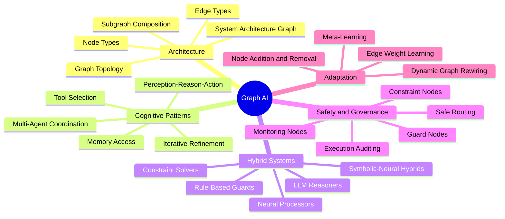
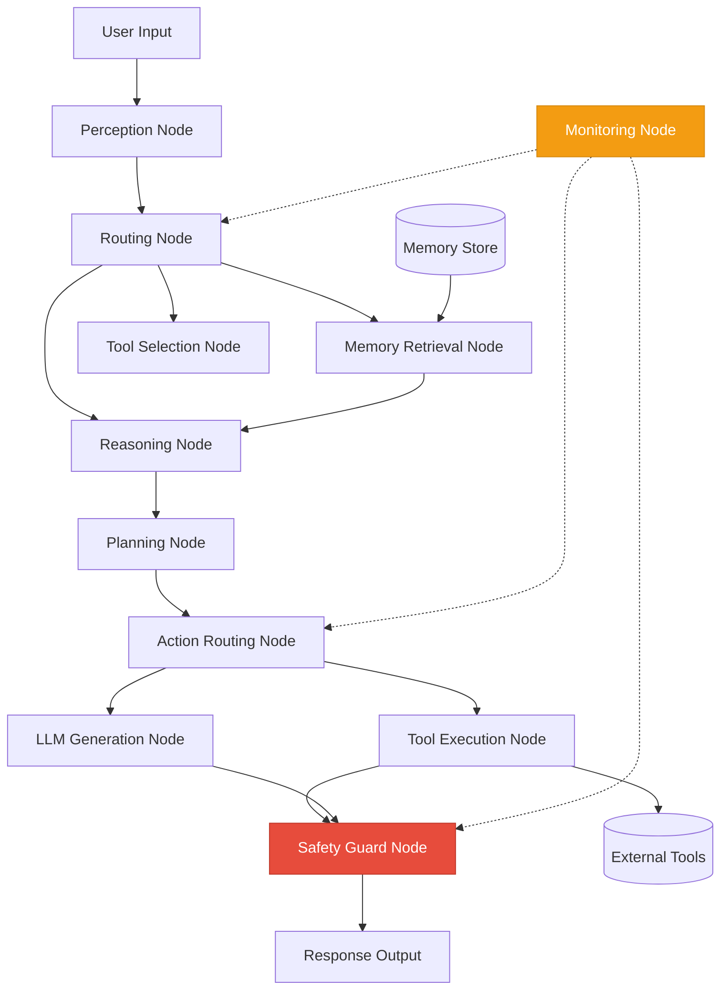
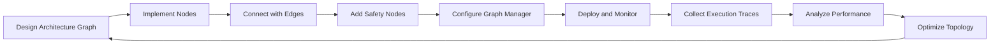
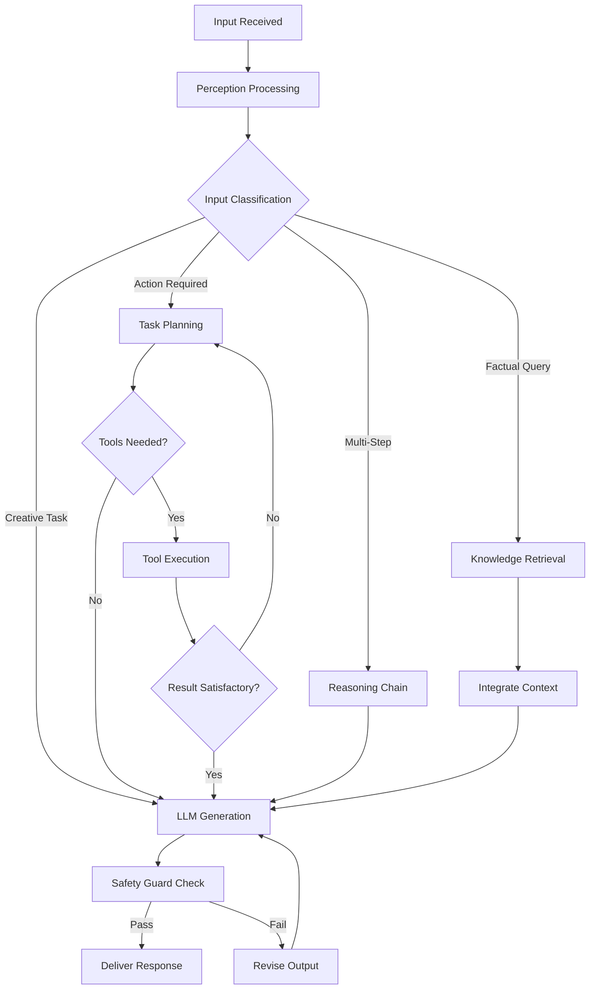
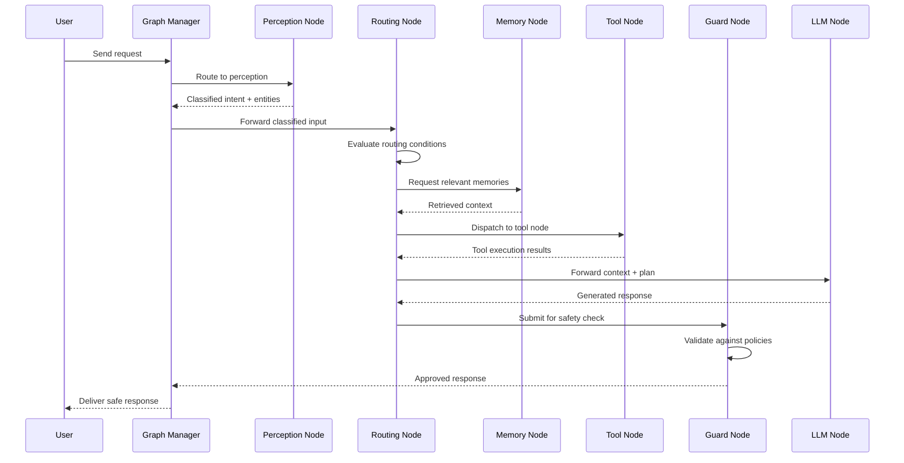

# Graph AI

## 📌 Overview

Graph AI represents the convergence of graph-structured system design with artificial intelligence capabilities, creating AI systems whose architecture, memory, reasoning, and tool use are organized as interconnected graph structures rather than flat pipelines or monolithic architectures. This is fundamentally distinct from using graph neural networks for machine learning tasks—instead, Graph AI is about engineering the AI system itself as a graph, where nodes are processing units (LLM calls, tool invocations, data transformations) and edges define the flow of information and control between them. This graph-based organization enables AI systems that are more modular, more interpretable, more adaptable, and more capable of complex reasoning than their non-graph counterparts.

The motivation for Graph AI stems from the limitations of pipeline-based and monolithic AI architectures. Traditional AI systems process inputs through a fixed sequence of steps, which works well for well-defined tasks but breaks down when the task requires dynamic adaptation, parallel processing, or iterative refinement. Monolithic AI systems bundle all capabilities into a single model or service, making them difficult to debug, extend, and compose. Graph AI addresses both limitations by decomposing the AI system into a network of specialized components connected by explicit data and control flows, enabling the system to dynamically route information, parallelize processing, and iteratively refine its outputs.

Graph AI systems are particularly powerful in the context of AI agents—autonomous systems that must perceive, reason, plan, and act in complex environments. An AI agent's behavior is inherently graph-like: it maintains a network of beliefs and goals (a belief graph), reasons by traversing relationships between concepts (reasoning graphs), plans actions by searching through a space of possible action sequences (planning graphs), and coordinates with other agents through structured communication protocols (interaction graphs). Graph AI provides the architectural framework for building these sophisticated agent systems with clean, maintainable, and extensible designs.

## 🎯 Learning Objectives

By studying Graph AI, you will learn to design AI systems whose architecture reflects the inherent graph structure of intelligent behavior. You will understand how to decompose complex AI capabilities into specialized graph nodes—each responsible for a well-defined function such as perception, reasoning, planning, or action—and connect these nodes with edges that define the flow of information and control. You will learn to design graph topologies that enable the specific capabilities your AI system needs, whether that is sequential processing, parallel decomposition, iterative refinement, or dynamic routing.

You will develop proficiency with the key architectural patterns of Graph AI, including the agent loop graph (perceive-reason-act cycles), the tool-use graph (dynamic tool selection and composition), the memory graph (hierarchical, episodic, and semantic memory organized as interconnected structures), and the multi-agent graph (communication and coordination protocols between multiple AI agents). You will understand how these patterns compose and interact, enabling you to build AI systems that combine multiple capabilities into a coherent, well-organized architecture.

Additionally, you will master the engineering challenges specific to Graph AI, including graph-level observability (monitoring the behavior of the entire graph, not just individual nodes), graph-level safety (ensuring that the system behaves safely even when individual nodes produce unexpected outputs), and graph-level optimization (improving the performance of the system by optimizing the graph topology, node implementations, and edge routing). You will also learn about the emerging area of symbolic-neural graph hybrids, which combine the reliability of symbolic reasoning with the flexibility of neural networks within a unified graph architecture.

## 🧠 Definition

Graph AI is the engineering discipline of designing artificial intelligence systems as interconnected graph structures, where nodes represent computational or cognitive capabilities and edges represent the flow of information, control, or influence between these capabilities. In a Graph AI system, the "intelligence" of the system emerges not from a single monolithic component but from the interactions and relationships between multiple specialized components organized in a graph topology. The graph structure is not merely an implementation detail—it is the fundamental architectural principle that determines the system's capabilities, behavior, and properties.

The "graph" in Graph AI refers to the system architecture graph, which defines how components of the AI system are organized and how they interact. This is distinct from knowledge graphs (which represent domain knowledge) and from computational graphs (which represent the data flow within a single model). The system architecture graph is a higher-level structure that may encompass multiple models, tools, memory stores, and external services as nodes, with edges that can represent data flow, control flow, dependency relationships, or communication channels. The graph topology is typically designed by the system architect, though it may also be dynamically modified by the AI system itself during operation.

Graph AI is closely related to but distinct from several adjacent concepts. It differs from Graph Neural Networks (GNNs) in that GNNs use graph structures as input data for machine learning, while Graph AI uses graph structures as the architecture for the AI system itself. It differs from Knowledge Graphs in that knowledge graphs represent domain knowledge, while Graph AI represents the system's processing architecture. It differs from simple workflow graphs in that Graph AI emphasizes the cognitive and adaptive aspects of the system—the graph is not just a static workflow but a dynamic structure that can modify itself based on experience and context.

## ❓ Why It Matters

Graph AI matters because it provides a principled architecture for building the next generation of AI systems that are too complex for monolithic or pipeline-based designs. As AI systems take on more sophisticated tasks—multi-step reasoning, tool use, multi-agent collaboration, long-horizon planning—the limitations of flat architectures become increasingly apparent. A system that must reason about a problem, decide which tools to use, execute those tools, evaluate the results, potentially revise its approach, and coordinate with other agents cannot be cleanly expressed as a pipeline. Graph AI provides the architectural framework that makes these complex behaviors tractable by decomposing them into a network of simpler, well-defined components.

Graph AI matters because it enables properties that are difficult or impossible to achieve with other architectures. Modularity is inherent in graph-based design—each node can be developed, tested, and deployed independently. Observability comes naturally because the graph structure makes the system's processing steps explicit and traceable. Adaptability emerges from the graph's ability to dynamically route information through different paths based on the current context. Composability is enabled by the graph's ability to embed subgraphs and connect to external graph-based systems. These properties are not afterthoughts or add-ons—they are inherent consequences of organizing the system as a graph.

Furthermore, Graph AI matters because it provides a shared conceptual framework for the rapidly evolving field of AI engineering. As new AI capabilities emerge—new models, new tools, new reasoning techniques—graph-based architectures provide a natural way to integrate them. A new reasoning technique becomes a new type of node in the graph. A new tool becomes a new tool node with defined input/output edges. A new coordination protocol becomes a new subgraph pattern. This extensibility means that Graph AI systems can evolve with the AI field without requiring fundamental architectural redesigns, providing a sustainable foundation for long-term AI development.

## 🏛️ Core Concepts

**System Architecture Graph** is the foundational concept of Graph AI—the graph that defines how the AI system's components are organized and how they interact. Each node in the architecture graph represents a processing unit, which could be an LLM call, a tool invocation, a data transformation, a memory access, a decision point, or a subgraph that encapsulates a complex sub-process. Each edge represents a directional flow of information or control between two processing units. The topology of this graph—the arrangement of nodes and edges—determines the system's capabilities, performance characteristics, and behavioral properties. Designing the architecture graph is the primary design activity in Graph AI.

**Cognitive Graph Patterns** are reusable graph topologies that implement common AI cognitive capabilities. The perception-reasoning-action loop is a cognitive graph pattern where a perception node processes inputs, a reasoning node generates plans or decisions, and an action node executes the plan. The tool-selection graph is a pattern where a planning node analyzes a task, a selection node chooses appropriate tools, and execution nodes invoke those tools. The memory-access graph is a pattern where a relevance node determines which memories to retrieve, a retrieval node fetches those memories, and an integration node combines them with current context. These patterns can be composed and nested to build complex AI systems from well-understood building blocks.

**Symbolic-Neural Hybrids** are Graph AI systems that combine symbolic reasoning components (rule-based processors, logic engines, constraint solvers) with neural processing components (LLMs, embeddings, classifiers) within a unified graph architecture. The graph structure provides the interface between these fundamentally different types of processing: symbolic nodes produce structured, deterministic outputs that neural nodes can interpret, and neural nodes produce flexible, probabilistic outputs that symbolic nodes can constrain and validate. This hybrid approach leverages the strengths of both paradigms—neural components handle the ambiguity and flexibility of natural language and perception, while symbolic components handle the precision and reliability required for planning, constraint satisfaction, and safety verification.

**Graph-Based AI Safety** is the application of graph structure to ensure that AI systems behave safely and predictably. In a graph-based architecture, safety constraints can be embedded as dedicated nodes and edges in the graph—guard nodes that validate outputs before they are passed to the next stage, constraint nodes that enforce invariants on the system's state, and monitoring nodes that observe the graph's execution and intervene when unsafe patterns are detected. The graph structure makes safety properties explicitly verifiable: you can analyze the graph topology to determine whether all possible execution paths pass through safety checks, whether there are unprotected edges that could bypass safety constraints, and whether the system's state space is bounded by safety invariants.

**Dynamic Graph Adaptation** refers to the ability of a Graph AI system to modify its own architecture graph during operation based on experience and context. Unlike static graph architectures that are fixed at design time, adaptive Graph AI systems can add new nodes (learning new capabilities), remove unnecessary nodes (pruning inefficient processing), rewire edges (changing the flow of information based on what works), and reconfigure subgraphs (adapting to new task requirements). This self-modification capability enables AI systems that improve their own architecture through experience—a form of meta-learning where the system not only learns within its current architecture but learns to improve the architecture itself.

## 🧩 Key Components

**Processing Nodes** are the computational units of a Graph AI system. Each processing node encapsulates a specific capability—an LLM invocation, a retrieval query, a calculation, an API call, or a sub-graph execution. Processing nodes have well-defined input and output interfaces, making them composable and replaceable. In well-designed Graph AI systems, processing nodes are independently testable: you can provide a node with a known input and verify its output without running the entire graph. This testability is a major advantage of graph-based architectures over monolithic AI systems, where individual capabilities are intertwined and difficult to isolate.

**Routing Nodes** are specialized processing nodes that control the flow of information through the graph based on the current state or context. A routing node examines its input and determines which downstream node or nodes should receive the output. This enables conditional branching (different processing paths for different inputs), dynamic dispatch (selecting the best tool or model for a given task), and parallel fan-out (sending information to multiple nodes simultaneously). Routing nodes are the mechanism that gives Graph AI systems their adaptive, context-sensitive behavior—they are the decision points that make the graph a dynamic processing network rather than a static pipeline.

**Memory Nodes** provide the Graph AI system with access to persistent and ephemeral memory stores. Memory nodes encapsulate the complexity of memory management—encoding information for storage, retrieving relevant information, managing memory capacity, and handling memory conflicts—behind a clean interface that the rest of the graph can use. Different types of memory nodes provide different memory capabilities: short-term memory nodes maintain the current conversation context, episodic memory nodes store and retrieve past interactions, semantic memory nodes manage domain knowledge, and working memory nodes provide a scratchpad for intermediate reasoning results.

**Tool Nodes** are processing nodes that interface with external tools, services, and APIs. Each tool node encapsulates a specific external capability—a web search, a database query, a code execution environment, a file system access, or a third-party API—behind a standardized interface. Tool nodes handle the complexity of API authentication, request formatting, response parsing, error handling, and retry logic, providing the rest of the graph with a clean abstraction. The graph's routing nodes decide which tool nodes to invoke based on the current task, enabling dynamic tool selection and composition that is one of the hallmarks of agentic AI systems.

**Safety Nodes** are specialized nodes that monitor and constrain the behavior of the Graph AI system. Guard nodes validate the outputs of other nodes before they are passed downstream, checking for safety violations such as harmful content, privacy breaches, or unsafe action recommendations. Constraint nodes enforce invariants on the system's state, ensuring that the system always operates within safe boundaries. Monitoring nodes observe the graph's execution patterns and raise alerts when anomalous or potentially unsafe behavior is detected. Safety nodes can be placed at strategic points in the graph to create safety checkpoints that all execution paths must pass through.

**Graph Manager** is the runtime component that executes the Graph AI system's architecture graph. The graph manager is responsible for node scheduling (determining the order and parallelism of node execution), state management (maintaining the shared state that flows through the graph), error handling (managing failures, retries, and fallbacks), and observability (collecting execution traces, metrics, and logs). The graph manager interprets the graph topology and orchestrates the execution of nodes accordingly, ensuring that data flows correctly through the edges and that conditional routing decisions are properly evaluated. It is the runtime engine that brings the static graph definition to life.

## 🧭 Mental Model

Imagine a sophisticated kitchen in a high-end restaurant, where different stations are connected by a system of conveyor belts and communication channels. The grill station, the pastry station, the sauce station, and the plating station are all separate workstations (nodes), each staffed by a specialist chef. The conveyor belts between stations (edges) carry partially completed dishes from one station to the next. The head chef (routing node) examines each order as it comes in and decides which stations need to be involved and in what order—a complex dish might go through the sauce station first, then the grill, then back to the sauce station for finishing, while a simple dish goes straight to the grill and then to plating.

The kitchen also has a recipe library (memory node) that chefs consult for preparation details, a spice rack (tool node) that provides standardized ingredients, and a quality control station (safety node) that inspects every dish before it leaves the kitchen. If the quality control station detects an issue, the dish is routed back to the appropriate station for correction. The kitchen's workflow is not a simple assembly line—it's a dynamic graph where dishes can take different paths, visit stations in different orders, and even loop back for additional work. The head chef adapts the routing in real time based on the current workload, ingredient availability, and order priority.

This restaurant kitchen is a Graph AI system. The stations are processing nodes, the conveyor belts are data flow edges, the head chef's routing decisions are conditional edges, the recipe library is a memory node, the spice rack is a tool node, and quality control is a safety node. The graph structure allows the kitchen to handle enormous complexity—hundreds of different dishes, each requiring different combinations of stations in different orders—while maintaining quality, efficiency, and adaptability. Replace the kitchen stations with AI capabilities and the dishes with user requests, and you have a Graph AI system.

## 🗺️ Mind Map



## 🏗️ Architecture Diagram



## 🔄 Workflow



## ⚙️ Internal Working

The internal operation of a Graph AI system begins when the graph manager receives an input—typically a user query, an event, or a trigger from another system. The graph manager identifies the entry point node in the architecture graph and invokes it with the input. The entry node processes the input (for example, a perception node might tokenize and classify the input) and produces an output that is passed along the outgoing edges to the next nodes in the graph. Each node in turn processes its input and produces output, with the graph manager managing the flow of data through the edges according to the graph topology.

When a routing node is encountered, the graph manager pauses linear execution and evaluates the routing condition. The routing node examines the current state—including the outputs of previous nodes, the original input, and any memory that has been retrieved—and determines which downstream path to take. The graph manager then invokes the selected downstream node or nodes. If multiple paths are selected, the graph manager may execute them in parallel or in a specified order, depending on the graph configuration. This conditional routing is what gives Graph AI systems their adaptive behavior, as the execution path through the graph is determined dynamically based on the context at each decision point.

Tool nodes, when invoked, interact with external systems to extend the AI system's capabilities beyond what is possible with LLM processing alone. The tool node formats the request for the external tool, sends it, waits for the response, parses the result, and returns it to the graph. If the tool call fails, the tool node handles the error according to its configuration—retrying with backoff, falling back to an alternative tool, or returning an error signal that the graph can handle. The graph manager tracks all tool invocations as part of the execution trace, providing a complete record of the system's external interactions.

Safety nodes intercept data flowing through the graph and validate it against safety criteria. A guard node might check that an LLM's output does not contain harmful instructions, that a tool's result does not contain sensitive data, or that a planned action does not violate safety constraints. If a safety check fails, the guard node can take corrective action—modifying the output, routing to a fallback node, or terminating the execution. Because safety nodes are part of the graph topology, they are guaranteed to be executed on every relevant execution path, providing a structural guarantee of safety that is difficult to achieve with non-graph architectures.

Throughout execution, the monitoring node observes the graph's behavior, collecting metrics on node execution times, routing decisions, tool success rates, and state changes. The monitoring node can detect anomalies in real time—unusual routing patterns, unexpected error rates, or state drift—and trigger alerts or interventions. This continuous monitoring provides the observability needed to understand and improve the Graph AI system's behavior over time, forming the feedback loop that drives system optimization and adaptation.

## 🔀 Execution Flow



## 📊 Lifecycle

```mermaid
stateDiagram-v2
    [*] --> Design
    Design --> Implement
    Implement --> Test
    Test --> Deploy
    Deploy --> Monitor
    Monitor --> Analyze
    Analyze --> Optimize
    Optimize --> Deploy: Graph Updated
    
    Deploy --> Scale: Load Increases
    Scale --> Deploy: Scaled
    
    Monitor --> Alert: Anomaly Detected
    Alert --> Investigate
    Investigate --> Fix
    Fix --> Deploy: Patch Applied
    
    Analyze --> Adapt: Architecture Change Needed
    Adapt --> Design: Redesign Graph
```

## 📡 Data Flow

```mermaid
flowchart TD
    INP[(User Input)] --> PER[Perception Node]
    PER |"Classified input + intent"| MEM[Memory Node]
    MEM |"Retrieved context"| RT[Routing Node]
    RT |"Task + context"| RSN[Reasoning Node]
    RSN |"Reasoning trace + plan"| PLN[Planning Node]
    PLN |"Action plan"| TL[Tool Node]
    TL |"Tool results"| RSN
    RSN |"Final reasoning"| GEN[LLM Generation Node]
    GEN |"Draft response"| GRD[Guard Node]
    GRD |"Validated response"| OUT[(Response)]
    
    MON[Monitoring Node] -.->|"Metrics & traces"| DASH[(Observability Dashboard)]
    GRD -.->|"Safety events"| MON
```

## 🤝 Interaction Flow



## 🌍 Real-World Analogy

Think of Graph AI as the nervous system of a complex organism. In biology, the nervous system is not a single processing unit but a vast network of specialized neurons connected by synapses. Sensory neurons (perception nodes) detect stimuli and convert them into signals. Interneurons (routing and reasoning nodes) process and route these signals, making decisions about how to respond. Motor neurons (action nodes) execute responses by activating muscles. The entire system is organized as a graph—billions of nodes connected by trillions of edges—and its intelligence emerges from the patterns of connection and activation across this graph.

Just as the nervous system's graph structure enables capabilities that no single neuron could achieve—consciousness, learning, coordinated movement—Graph AI's graph structure enables capabilities that no single AI component could achieve. A single LLM can generate text, but it cannot reliably use tools, maintain long-term memory, enforce safety constraints, or coordinate with other agents. By organizing multiple specialized components as a graph, Graph AI creates systems that combine these capabilities into a coherent, adaptive intelligence.

The analogy extends further. Just as the nervous system has specialized subsystems—the visual cortex for processing sight, the motor cortex for controlling movement, the hippocampus for memory—Graph AI systems have specialized subgraphs for different capabilities. Just as the nervous system has reflex arcs (fast, hardwired paths for urgent responses), Graph AI has safety nodes that provide fast, hardwired safety checks. And just as the nervous system can rewire itself through neuroplasticity, adaptive Graph AI systems can modify their own graph structure based on experience.

## 💡 Practical Example

Consider a customer service AI assistant for a large e-commerce platform. A traditional approach might use a single LLM fine-tuned on customer service conversations, but this monolithic system would struggle with the complexity of real customer interactions—looking up order status, processing returns, checking inventory, applying promotions, escalating to human agents, and complying with company policies.

A Graph AI approach designs this system as an architecture graph. The perception node classifies the customer's intent (order inquiry, return request, complaint, etc.). The routing node directs the flow based on the classification: order inquiries go to the order lookup subgraph, return requests go to the returns processing subgraph, and complaints go to the escalation subgraph. Each subgraph has its own specialized nodes—the order lookup subgraph has a database query node, an inventory check node, and a delivery tracking node, connected in a graph that first checks the order database, then optionally checks inventory and tracking based on what the customer asks.

Safety nodes are embedded throughout: a policy compliance node checks that all responses conform to company policies, a privacy guard node ensures that customer data is not exposed inappropriately, and an escalation safety node ensures that requests outside the AI's competence are always routed to a human agent. The monitoring node tracks customer satisfaction signals, response times, and escalation rates, providing data that drives continuous improvement of the graph architecture. This Graph AI system handles far more complexity, more reliably, and more safely than any monolithic LLM could achieve.

## 🧪 Use Cases

**Autonomous AI Agents** are the most prominent use case for Graph AI. An autonomous agent must perceive its environment, reason about what to do, select and use tools, evaluate results, and potentially revise its approach. This cycle of perception, reasoning, and action is naturally expressed as a graph with conditional edges that enable looping and adaptation. Frameworks like LangGraph implement this pattern directly, providing the graph infrastructure for building sophisticated agents that can handle complex, multi-step tasks.

**Multi-Agent Systems** use Graph AI to model the interactions between multiple AI agents, each with its own capabilities and goals. The inter-agent communication graph defines who can communicate with whom, what information they share, and how they coordinate their actions. This is essential for applications like collaborative research (multiple specialized research agents contributing to a shared analysis), software development (a coding agent, a testing agent, and a review agent working together), and complex decision-making (multiple agents with different perspectives contributing to a group decision).

**Adaptive Personalization Systems** use Graph AI to dynamically adjust their behavior based on user interactions. The system's architecture graph includes nodes for user modeling, preference tracking, content recommendation, and feedback processing. As the user interacts with the system, the graph's routing adapts—content is routed through different processing paths based on the user's inferred preferences, and the graph topology itself may evolve as new user patterns are discovered. This adaptive graph architecture enables personalization that is far more sophisticated than simple rule-based or collaborative filtering approaches.

**AI-Powered Scientific Research** uses Graph AI to orchestrate complex research workflows that combine literature review, hypothesis generation, experimental design, data analysis, and result interpretation. Each of these capabilities is a node (or subgraph) in the architecture graph, and the connections between them define the research workflow. The graph can dynamically adjust the workflow based on intermediate results—if the data analysis node produces unexpected findings, the routing node may send the results back to the hypothesis generation node for revision, creating an iterative research cycle that mirrors how human scientists work.

## ⚖️ Comparison

| Aspect | Monolithic AI | Pipeline AI | Graph AI |
|--------|-------------|-------------|----------|
| **Architecture** | Single model/service | Fixed sequence | Dynamic network |
| **Adaptability** | Low (model weights only) | Low (fixed steps) | High (dynamic routing) |
| **Modularity** | None | Moderate | High |
| **Observability** | Black box | Moderate | High (graph traces) |
| **Safety Integration** | Post-hoc filtering | Step-level checks | Structural guarantees |
| **Tool Use** | Limited/bolted on | Sequential only | Dynamic composition |
| **Multi-Agent** | Not supported | Difficult | Natural fit |
| **Debugging** | Very difficult | Moderate | Easier (node isolation) |
| **Evolution** | Retrain model | Rewrite pipeline | Extend graph |

## ✅ Best Practices

**Design the graph topology before implementing nodes.** The graph structure is the most important architectural decision in a Graph AI system—it determines what capabilities are possible, how information flows, and where safety checks are placed. Start by sketching the graph on paper or a whiteboard, identifying the major processing steps, decision points, and data flows. Validate the topology by tracing several representative inputs through the graph to ensure that all necessary paths exist and that safety nodes are positioned correctly. Only after the topology is validated should you begin implementing individual nodes.

**Keep nodes focused and composable.** Each node in the graph should do one thing well—a single LLM call, a single tool invocation, a single transformation. Nodes that try to do too much become difficult to test, debug, and reuse. If a node is becoming complex, consider decomposing it into a subgraph with multiple simpler nodes. Composability is a key advantage of graph architectures, and you lose this advantage when nodes become monolithic. Well-designed nodes can be reused across different graphs and different projects, accelerating development.

**Embed safety as a structural property, not a post-hoc add-on.** Safety nodes should be integral parts of the graph topology, positioned so that all potentially dangerous outputs must pass through them before reaching users or external systems. Analyze the graph to identify all execution paths and ensure that every path that could produce user-visible output passes through at least one safety check. Use guard nodes at output boundaries, constraint nodes at state transition points, and monitoring nodes throughout the graph. Structural safety is more reliable than behavioral safety because it is enforced by the architecture, not by the correctness of individual components.

**Implement comprehensive graph-level observability.** Don't just monitor individual nodes in isolation—monitor the graph as a system. Track which paths through the graph are most frequently taken, where bottlenecks occur, which routing decisions are most common, and how the graph's behavior changes over time. Graph-level metrics reveal patterns that node-level metrics miss, such as routing drift (the graph gradually taking different paths than intended), emergent loops (unexpected cycles in the execution), and safety node activation rates (how often safety checks are triggering). Use execution traces to debug issues that span multiple nodes.

## ❌ Common Mistakes

**Creating over-complex graph topologies** is a common mistake that undermines the benefits of Graph AI. When every possible processing step, edge case, and fallback is represented as a separate node, the graph becomes so complex that it is difficult to understand, debug, and maintain. Start with the simplest graph that solves the problem and add complexity only when needed. A graph with ten well-chosen nodes will outperform a graph with fifty poorly organized nodes, because the simpler graph is easier to reason about, easier to test, and easier to optimize.

**Treating the graph as a fixed workflow** misses the key advantage of Graph AI over pipeline architectures. If every input follows the same path through the graph with no conditional routing, the graph is just a pipeline drawn differently. Leverage the graph structure by including meaningful routing decisions, conditional edges, and dynamic paths that adapt to the input. The graph should feel alive—different inputs should take different paths, and the system should be able to loop, branch, and parallelize as needed.

**Neglecting error handling at the graph level** leads to fragile systems. In a graph architecture, errors can propagate along edges just like data. A tool node that fails, a memory node that times out, or an LLM node that produces malformed output can cause downstream nodes to fail in cascade. Design the graph with error-handling edges that route errors to recovery nodes, implement retry logic at nodes that interact with external systems, and ensure that safety nodes can handle unexpected input formats. The graph topology should include explicit error paths, not just happy paths.

**Failing to test at the graph level** is a mistake that allows bugs to hide in the interactions between nodes. Unit testing individual nodes is necessary but not sufficient—you must also test the graph as a whole, verifying that routing decisions are correct for different inputs, that data flows correctly through the edges, that safety nodes catch all violations, and that the graph terminates correctly for all expected inputs. Graph-level integration tests should cover the major execution paths through the graph, including error paths and edge cases.

## 🚀 Advanced Topics

**Self-Modifying Graph Architectures** represent the frontier of Graph AI, where the system can modify its own graph topology during operation. This goes beyond dynamic routing (selecting among pre-defined paths) to actual architectural change—adding new nodes, removing unused nodes, creating new edges, and even restructuring subgraphs. Self-modification is driven by performance feedback: if the system observes that a particular path through the graph consistently produces poor results, it may create an alternative path; if it discovers a useful combination of processing steps, it may create a new subgraph that encapsulates that combination. This capability requires careful safety constraints to prevent the system from creating unsafe architectures.

**Graph-Based Explainability** leverages the graph structure to provide rich explanations of AI system behavior. Because every processing step is a node and every data flow is an edge, the graph provides a complete, traceable record of how the system arrived at its output. Advanced explainability systems can summarize execution traces, identify the critical path that most influenced the output, and compare the execution path for a given input against paths for similar inputs. This graph-based explainability is far more informative than post-hoc explanation methods applied to monolithic models, because it reflects the actual processing that occurred rather than inferred explanations.

**Federated Graph AI** extends the graph architecture across multiple organizations or compute environments, enabling AI systems that span institutional boundaries while preserving data privacy. In a federated Graph AI system, different nodes in the graph are hosted by different organizations, and edges represent secure communication channels between them. Each organization maintains control over its own nodes and data, while the graph topology enables collaborative AI capabilities that no single organization could achieve alone. This is particularly relevant for healthcare, finance, and government applications where data sharing is restricted but collaborative AI is necessary.

**Neuro-Symbolic Graph Architectures** represent an advanced form of symbolic-neural hybrid where the boundary between symbolic and neural processing is not fixed but dynamically negotiated by the graph itself. In these architectures, a meta-routing node decides for each processing step whether to use a symbolic approach (precise, deterministic, but rigid) or a neural approach (flexible, creative, but potentially unreliable) based on the current context and the system's confidence level. This dynamic allocation enables systems that are precise when precision is needed and flexible when flexibility is needed, all within a unified graph architecture that manages the transition between modes seamlessly.