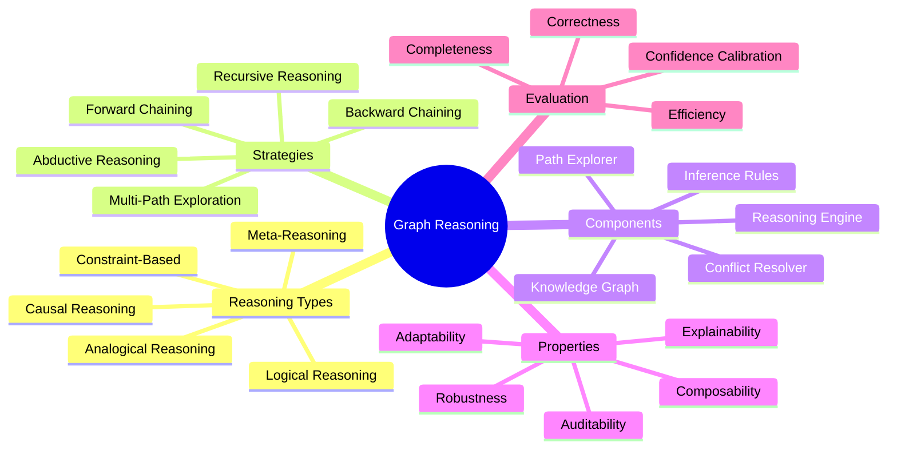
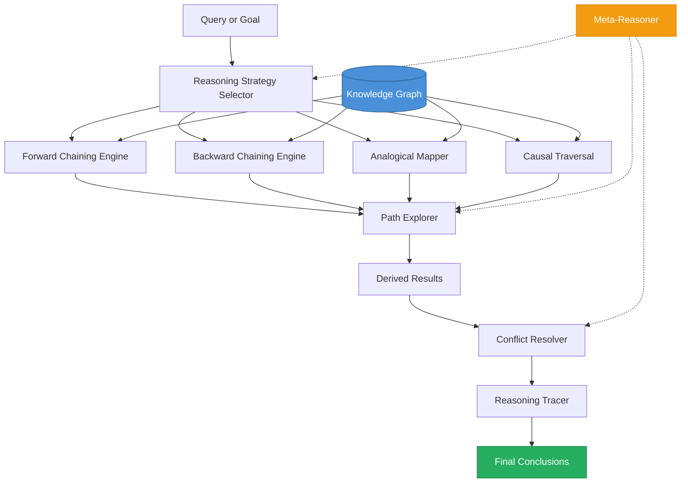
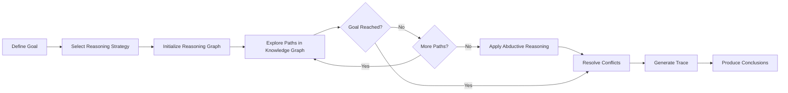
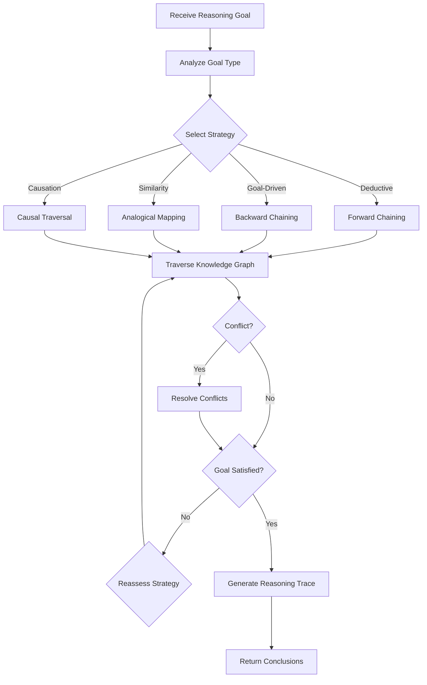
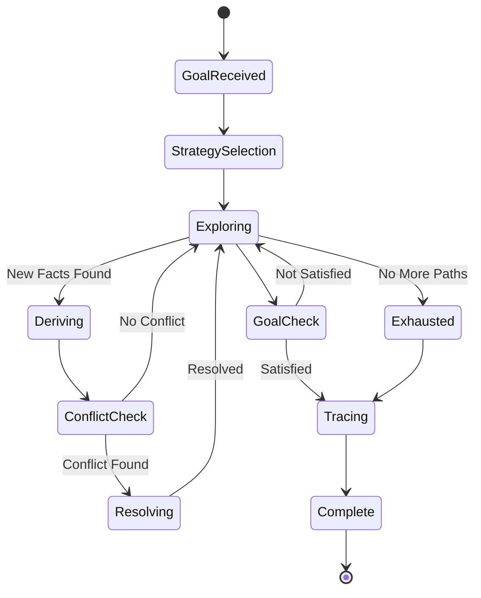
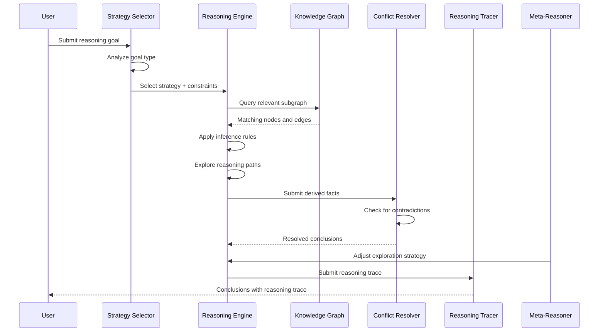

# Graph Reasoning

## 📌 Overview

Graph Reasoning is the practice of structuring and executing reasoning processes as traversals and transformations over graph-structured knowledge representations. Unlike linear reasoning approaches—such as chain-of-thought prompting, which processes information in a sequential, step-by-step manner—graph reasoning allows AI systems to explore multiple reasoning paths simultaneously, backtrack when a path proves unproductive, and synthesize conclusions from multiple interconnected lines of evidence. The graph structure serves as both the medium in which reasoning occurs (the knowledge is organized as a graph) and the mechanism by which reasoning proceeds (the reasoning process itself follows graph paths).

The need for graph reasoning arises from the inherent complexity of real-world problems, which rarely succumb to purely linear analysis. A medical diagnosis may require considering symptoms, test results, drug interactions, patient history, and comorbidities—all interconnected through a web of relationships. A legal argument may require tracing precedents through layers of case law, distinguishing facts, and identifying analogous situations across different jurisdictions. These problems demand reasoning that can follow multiple threads, explore connections, and integrate findings across a network of related information—precisely the capabilities that graph reasoning provides.

Graph reasoning is not a single technique but a family of related approaches that share the common principle of organizing reasoning as graph operations. Logical reasoning on graphs applies formal logic rules to derive new conclusions from existing graph relationships. Analogical reasoning on graphs identifies structural similarities between different subgraphs to transfer knowledge from a known domain to an unknown one. Causal reasoning on graphs traces cause-effect relationships to understand why events occurred and predict what will happen next. Meta-reasoning on graphs reasons about the reasoning process itself, evaluating the quality of reasoning paths and selecting better strategies. Each of these approaches leverages the graph structure in different ways, but all benefit from the graph's ability to represent and navigate complex relationships.

## 🎯 Learning Objectives

By studying Graph Reasoning, you will learn to design AI systems that reason by traversing, transforming, and analyzing graph-structured knowledge. You will understand the fundamental types of graph reasoning—logical, analogical, causal, and meta—and when each is most appropriate for a given problem. You will learn to represent reasoning problems as graph structures, define reasoning rules that operate on graph elements, and design reasoning strategies that efficiently navigate the graph to reach sound conclusions.

You will develop proficiency with graph-based logical reasoning, including forward chaining (deriving new facts from existing facts by applying rules), backward chaining (working backward from a goal to find supporting facts), and abductive reasoning (inferring the most likely explanation for observed evidence). You will understand how these reasoning strategies map to graph traversal patterns and how to implement them efficiently using graph databases and graph algorithms. You will also learn to combine logical reasoning with the flexibility of LLM-based reasoning, creating hybrid systems that benefit from both formal rigor and creative insight.

Additionally, you will master advanced reasoning patterns including multi-path reasoning (exploring multiple candidate solutions in parallel), constraint-based reasoning (using graph constraints to prune the search space), and recursive reasoning (applying reasoning rules to the results of previous reasoning steps). You will learn to evaluate the quality of graph reasoning using metrics that capture not just correctness but also efficiency, explainability, and robustness to incomplete or contradictory information.

## 🧠 Definition

Graph Reasoning is the computational process of deriving new knowledge, making decisions, or solving problems by performing operations on graph-structured data. In a graph reasoning system, knowledge is represented as a graph of nodes (representing entities, concepts, propositions, or states) and edges (representing relationships, implications, causal links, or transitions), and reasoning proceeds by traversing this graph, applying transformation rules at each node or edge, and accumulating derived knowledge. The reasoning process itself can be viewed as a traversal or exploration of the graph, where each step in the reasoning corresponds to following an edge from one node to another.

The distinction between graph reasoning and other forms of AI reasoning lies in the role of relationships. In linear reasoning (such as chain-of-thought), each step follows from the previous step in a single chain. In tree reasoning (such as tree-of-thought), each step may branch into multiple possibilities, but the branches are independent and do not reconnect. In graph reasoning, the reasoning paths can branch, merge, loop, and interconnect in arbitrary ways, reflecting the true complexity of relational knowledge. A conclusion reached via one reasoning path can feed into another path, creating a web of interconnected reasoning that more closely mirrors how human experts actually think about complex problems.

Graph reasoning operates at two levels simultaneously. At the knowledge level, it operates on the knowledge graph—the structured representation of domain knowledge that provides the facts and relationships the reasoning process works with. At the process level, it operates on the reasoning graph—the dynamic structure that represents the current state of the reasoning process, including explored paths, pending branches, derived conclusions, and reasoning goals. The interaction between these two graphs—the static knowledge graph and the dynamic reasoning graph—is what gives graph reasoning its power.

## ❓ Why It Matters

Graph Reasoning matters because many of the most valuable AI applications require reasoning that goes beyond simple sequential inference. Scientific research requires integrating evidence from multiple sources, identifying patterns across experiments, and building causal explanations—reasoning patterns that are inherently graph-like. Legal analysis requires tracing chains of precedent, distinguishing analogous cases, and constructing arguments from interconnected legal principles. Financial analysis requires understanding the web of relationships between companies, markets, regulations, and economic indicators. These applications demand reasoning capabilities that linear approaches simply cannot provide.

Graph Reasoning matters because it provides a natural framework for handling incomplete, contradictory, and uncertain information. In real-world reasoning, you rarely have all the facts, and the facts you do have may conflict with each other. Graph reasoning handles this by maintaining multiple reasoning paths in parallel, each potentially leading to different conclusions. The graph structure makes it explicit when two reasoning paths lead to contradictory conclusions, enabling the system to identify and resolve conflicts rather than being forced to choose one path prematurely. This ability to maintain and reconcile multiple lines of reasoning is essential for robust, trustworthy AI systems.

Furthermore, Graph Reasoning matters because it produces reasoning that is inherently more explainable and auditable than alternative approaches. When an AI system reasons through a graph, every step of the reasoning corresponds to a node or edge in the graph, creating a complete, traceable record of the reasoning process. This traceability is critical for applications where AI decisions must be justified—medical diagnoses, legal recommendations, financial advice, and safety-critical decisions. The graph structure makes the reasoning visible: you can see which facts were considered, which relationships were followed, which alternatives were explored, and why a particular conclusion was reached. This transparency builds trust and enables meaningful human oversight of AI reasoning.

## 🏛️ Core Concepts

**Logical Reasoning on Graphs** applies formal or semi-formal logic rules to derive new knowledge from existing graph content. In forward chaining, the system starts with known facts (nodes and edges in the knowledge graph) and applies inference rules to derive new facts, iteratively expanding the graph with newly derived knowledge until no more derivations are possible or a goal is reached. In backward chaining, the system starts with a goal or hypothesis and searches backward through the graph for supporting facts, following implication edges in reverse to find evidence. Forward chaining is data-driven (it derives everything that can be derived from the available facts), while backward chaining is goal-driven (it derives only what is needed to support a specific conclusion).

**Analogical Reasoning via Graph Mapping** identifies structural similarities between two different subgraphs and transfers knowledge from the known subgraph (the source) to the unknown subgraph (the target). The core mechanism is graph isomorphism detection—finding a mapping between the nodes and edges of the source graph and the target graph that preserves structural relationships. If the source graph represents a known situation with a known outcome, and the target graph has a similar structure, the system can infer that the target situation may have a similar outcome. This is how human experts reason by analogy: a lawyer argues that a new case should be decided similarly to a precedent because the factual structures are analogous, or an engineer transfers a solution from one domain to another because the problem structures are similar.

**Causal Reasoning as Graph Traversal** models cause-effect relationships as directed edges in a causal graph, where an edge from Node A to Node B means "A causes B" or "A influences B." Causal reasoning proceeds by traversing these causal edges to understand the downstream effects of an action, the upstream causes of an observed event, or the confounding variables that might explain a correlation. The causal graph distinguishes between correlation and causation by making the causal direction of each relationship explicit. This is critical for applications like policy analysis (what will happen if we change X?), root cause analysis (why did event Y occur?), and treatment planning (what intervention will address the root cause of condition Z?).

**Meta-Reasoning on Graphs** is reasoning about the reasoning process itself—the system evaluates its own reasoning paths, identifies which strategies are working and which are not, and adapts its approach accordingly. In a graph reasoning context, meta-reasoning operates on the reasoning graph (the dynamic structure representing the current reasoning state) rather than the knowledge graph. The meta-reasoner might identify that a particular reasoning path has been explored extensively without reaching a conclusion and decide to prune it. It might notice that certain types of graph edges have been more productive than others and prioritize those. It might detect that the current reasoning strategy is unlikely to succeed and switch to a different strategy. Meta-reasoning is what separates sophisticated reasoning systems from simple rule-application engines.

**Constraint-Based Reasoning** uses constraints defined on the graph to prune the reasoning search space and focus attention on the most promising paths. Constraints can be defined on node properties (only consider entities of a certain type), edge properties (only follow relationships of a certain type), path properties (only consider paths shorter than N hops), or global properties (the solution must satisfy certain consistency conditions). By applying constraints early in the reasoning process, the system avoids wasting computational resources on irrelevant paths and can focus its reasoning on the most productive areas of the graph.

## 🧩 Key Components

**Knowledge Graph** provides the structured knowledge base that graph reasoning operates on. The knowledge graph contains the facts, relationships, and domain knowledge that the reasoning process draws upon. The quality, completeness, and organization of the knowledge graph directly determine the quality of the reasoning that can be performed on it. A well-structured knowledge graph with clear entity types, consistent relationship types, and rich attribute data enables more precise and efficient reasoning than a poorly structured graph.

**Reasoning Engine** is the computational core that executes reasoning operations on the knowledge graph. The reasoning engine implements the traversal algorithms (breadth-first, depth-first, bidirectional), the inference rules (forward chaining, backward chaining, abduction), and the search strategies (heuristic search, beam search, Monte Carlo tree search) that drive the reasoning process. The reasoning engine maintains the reasoning state—the current set of explored paths, derived conclusions, pending branches, and reasoning goals—and updates this state as reasoning progresses.

**Inference Rules** define the logical operations that the reasoning engine can apply. Each rule specifies a pattern to match in the graph and the new knowledge to derive when the pattern is matched. Inference rules can be hand-crafted by domain experts, learned from data, or generated by an LLM. The rule set defines the reasoning vocabulary of the system—the types of inferences it is capable of making.

**Path Explorer** manages the exploration of multiple reasoning paths through the graph. In graph reasoning, there are typically many possible paths from the current state to a conclusion, and the path explorer must decide which paths to explore, in what order, and when to abandon a path that is not productive. The path explorer implements search strategies such as best-first search (prioritizing the most promising path), beam search (maintaining a fixed number of top candidate paths), and parallel exploration (exploring multiple paths simultaneously).

**Conflict Resolver** handles situations where different reasoning paths lead to contradictory conclusions. In a graph reasoning system, it is common for multiple paths to produce conflicting results—especially when the knowledge graph contains incomplete or noisy information. The conflict resolver identifies contradictions, evaluates the evidence supporting each conclusion, and resolves the conflict by selecting the better-supported conclusion or by maintaining both conclusions with appropriate confidence annotations.

**Reasoning Tracer** records the complete reasoning process as a trace graph—a graph that documents every step of the reasoning, including which facts were used, which rules were applied, which paths were explored and abandoned, and which conclusions were derived. The trace graph is the basis for explanation and audit: it allows the system to explain its reasoning to users, allows developers to debug the reasoning process, and allows auditors to verify that the reasoning was sound.

## 🧭 Mental Model

Think of Graph Reasoning as a detective's investigation board—the kind you see in police procedurals with photos, documents, and red strings connecting related pieces of evidence. Each piece of evidence is a node on the board, and each red string is an edge representing a known or suspected relationship. When a new piece of evidence arrives, the detective doesn't process it in isolation—they look at the existing web of connections and figure out where the new evidence fits. Does it confirm an existing hypothesis (strengthening a path in the reasoning graph)? Does it contradict a previous conclusion (creating a conflict that needs resolution)? Does it connect two previously unrelated pieces of evidence (creating a new path that could lead to a breakthrough)?

The detective's reasoning process is a graph traversal. Starting from a suspect, they follow connections to motives, opportunities, and alibis. At each step, they may branch—exploring multiple suspects in parallel—or backtrack—abandoning a line of inquiry that leads to a dead end. They constantly compare the structure of the current case to past cases they have solved (analogical reasoning), looking for patterns that might suggest a solution. When they identify a likely sequence of events (a causal chain), they trace it forward and backward to verify consistency.

The critical insight is that the detective's reasoning power comes not from any single piece of evidence but from the web of connections between pieces of evidence. A fingerprint at the scene is just a fingerprint—its significance comes from the fact that it connects to a specific person, who has a specific relationship to the victim, who had a specific motive. The graph structure makes these connections explicit and navigable, enabling the kind of multi-faceted, interconnected reasoning that solves complex cases. Graph Reasoning gives AI systems the same kind of investigative capability.

## 🗺️ Mind Map



## 🏗️ Architecture Diagram



## 🔄 Workflow



## ⚙️ Internal Working

The graph reasoning process begins when a query or goal is presented to the system. The reasoning strategy selector analyzes the goal and the available knowledge to determine which reasoning strategy (or combination of strategies) is most appropriate. A goal that asks "what can we conclude from these facts?" suggests forward chaining. A goal that asks "is this hypothesis true?" suggests backward chaining. A goal that asks "what caused this event?" suggests causal reasoning. A goal that asks "what is this similar to?" suggests analogical reasoning. In practice, complex goals often require a combination of strategies working together.

Once the strategy is selected, the reasoning engine initializes the reasoning graph—a dynamic data structure that tracks the current state of the reasoning process. The reasoning graph contains the starting nodes (the facts or hypotheses relevant to the goal), the frontier (the set of nodes and edges that have not yet been explored), the explored set (nodes and edges already processed), and the derived set (new conclusions that have been reached). The reasoning engine then begins exploring paths through the knowledge graph, following edges and applying inference rules according to the selected strategy.

As the reasoning progresses, the path explorer manages the exploration of multiple paths simultaneously. In beam search, it maintains a fixed number of the most promising paths and prunes less promising ones. In parallel exploration, it distributes path exploration across multiple processing units. At each step, the path explorer evaluates the promise of each active path based on heuristic metrics such as relevance to the goal, confidence of derived facts, and coverage of the problem space. Paths that score poorly are pruned; paths that score well are expanded.

When the reasoning engine derives new facts, the conflict resolver checks for contradictions with previously derived facts or with facts in the knowledge graph. If a contradiction is found, the conflict resolver evaluates the evidence supporting each side of the contradiction—considering the number of reasoning steps, the confidence of source facts, and the reliability of inference rules—and resolves the conflict by selecting the better-supported conclusion or by annotating both conclusions with their respective confidence levels. The conflict resolver's decisions are themselves recorded in the reasoning trace, providing a complete audit trail.

Throughout the process, the meta-reasoner monitors the reasoning state and makes strategic adjustments. If the reasoning is making slow progress, the meta-reasoner may suggest switching to a different strategy. If certain types of edges are proving unproductive, the meta-reasoner may suggest pruning those edge types from future exploration. If the reasoning is approaching a resource limit, the meta-reasoner may suggest terminating early and returning the best conclusions found so far. This self-reflective capability is what enables graph reasoning systems to handle the full complexity of real-world reasoning problems.

## 🔀 Execution Flow



## 📊 Lifecycle



## 📡 Data Flow

```mermaid
flowchart TD
    QUERY[(Reasoning Goal)] --> STRAT[Strategy Selector]
    STRAT |"Strategy + constraints"| ENGINE[Reasoning Engine]
    KG[(Knowledge Graph)] |"Facts + relations"| ENGINE
    ENGINE |"Traversal queries"| KG
    KG |"Matching subgraphs"| ENGINE
    ENGINE |"Derived facts"| CONFLICT[Conflict Resolver]
    CONFLICT |"Resolved conclusions"| TRACER[Reasoning Tracer]
    TRACER |"Reasoning trace"| FINAL[(Final Conclusions)]
    META[Meta-Reasoner] -.->|"Strategy adjustments"| STRAT
    META -.->|"Path pruning"| ENGINE
```

## 🤝 Interaction Flow



## 🌍 Real-World Analogy

Think of Graph Reasoning as a seasoned physician diagnosing a complex patient. The physician does not simply work through a checklist of symptoms in a linear fashion. Instead, they maintain a mental web of interconnected observations: the patient's symptoms, medical history, family history, current medications, lab results, and lifestyle factors. Each new piece of information is placed into this web and evaluated in the context of its connections to other information.

When a lab result comes back abnormal, the physician doesn't just note it—they consider what could cause it by traversing the causal web: this lab result could be caused by Condition A, which is consistent with Symptom B but contradicts the normal finding for Test C. They explore multiple diagnostic hypotheses in parallel, each representing a different path through the knowledge graph of medicine. They use analogical reasoning by comparing this patient's presentation to similar cases they have seen before. They use meta-reasoning by recognizing when they are stuck and ordering additional tests or consulting a specialist.

The physician's diagnostic process is a graph reasoning process. The medical knowledge they draw upon is a knowledge graph of diseases, symptoms, treatments, and their relationships. Their diagnostic reasoning traverses this graph, following causal chains, testing hypotheses by looking for supporting evidence, and resolving contradictions between different lines of evidence. The final diagnosis, along with the reasoning that led to it, is the output of this graph reasoning process—and it is far more reliable than a diagnosis based on linear symptom matching.

## 💡 Practical Example

Consider a supply chain disruption analysis system for a global manufacturing company. When a disruption occurs—for example, a major supplier in Southeast Asia experiences a flood—the system must reason about the cascading effects across the entire supply chain. This is a graph reasoning problem because the supply chain is a graph of suppliers, components, products, and customers, connected by supply relationships.

The system's knowledge graph contains nodes for every supplier, component, product, and customer, with edges representing supply relationships, component dependencies, lead times, and inventory levels. When the disruption is reported, the causal reasoning engine traverses the graph forward from the affected supplier, identifying all components that depend on that supplier, all products that include those components, and all customers who order those products. Simultaneously, the backward chaining engine searches for alternative suppliers by looking for other suppliers in the graph that can produce the same components.

The analogical reasoning engine compares the current disruption to historical disruptions stored in the knowledge graph, identifying similar situations and their resolutions. The meta-reasoner monitors the reasoning process, noticing that the forward causal chain is branching rapidly and prioritizing the most critical paths based on revenue impact. The conflict resolver handles cases where the system's analysis conflicts with manual reports from local teams. The final output is not just a list of affected products but a complete reasoning trace showing the causal chain from the flood to each affected customer, the alternative sourcing options evaluated, and the recommended response plan.

## 🧪 Use Cases

**Medical Diagnosis** is a natural application for graph reasoning because medical knowledge is inherently relational. Diseases cause symptoms, symptoms indicate diseases, drugs treat diseases but have side effects, and patient histories create a web of interconnected health information. A graph reasoning system can trace causal chains from symptoms to potential diagnoses, identify drug interactions by traversing the pharmaceutical knowledge graph, and reason about treatment trade-offs by comparing multiple reasoning paths. The reasoning trace provides the explainability that medical professionals require when evaluating AI-generated diagnostic suggestions.

**Legal Case Analysis** requires tracing complex chains of precedent, distinguishing analogous and distinguishable cases, and constructing legal arguments from interconnected legal principles. A graph reasoning system can model the legal knowledge base as a graph of cases, statutes, regulations, and legal principles, connected by cites, distinguishes, overrules, and applies-to relationships. When analyzing a new case, the system can use analogical reasoning to find structurally similar precedents, use logical reasoning to trace the implications of applicable statutes, and use causal reasoning to understand the policy implications of different legal interpretations.

**Scientific Research Support** helps researchers by reasoning across the graph of scientific knowledge—papers, experiments, theories, datasets, and researchers. Given a research hypothesis, the system can reason about supporting and contradicting evidence by traversing the citation graph, identify potential collaborators by finding researchers with complementary expertise in the collaboration graph, and generate novel hypotheses by applying analogical reasoning to transfer findings from one domain to another. The graph structure enables reasoning that spans multiple disciplines and identifies connections that a researcher focused on a single domain might miss.

**Fraud Detection and Investigation** uses graph reasoning to identify complex fraud patterns that involve networks of entities—accounts, transactions, people, organizations, and addresses. Simple rule-based fraud detection catches individual suspicious transactions, but graph reasoning can identify fraud rings by finding densely connected clusters of accounts that exhibit coordinated behavior, trace money laundering paths through chains of transactions, and reason about the probability of fraud by combining multiple weak indicators into a strong conclusion. The reasoning trace provides evidence that can be used in legal proceedings.

## ⚖️ Comparison

| Aspect | Chain-of-Thought | Tree-of-Thought | Graph Reasoning |
|--------|-----------------|-----------------|-----------------|
| **Structure** | Linear sequence | Branching tree | Interconnected graph |
| **Path Merging** | Not supported | Not supported | Supported |
| **Backtracking** | Limited | Limited | Full support |
| **Conflict Handling** | None | Path selection | Explicit resolution |
| **Analogical Transfer** | Not supported | Not supported | Core capability |
| **Causal Tracing** | Implicit | Implicit | Explicit graph paths |
| **Explainability** | Low (text trace) | Moderate (tree) | High (graph trace) |
| **Complexity** | Low | Medium | High |
| **Best For** | Simple reasoning | Multi-option decisions | Complex relational problems |

## ✅ Best Practices

**Design your knowledge graph for reasoning, not just storage.** A knowledge graph that works well for simple lookup queries may be poorly suited for reasoning. Reasoning requires consistent, well-typed relationships; clear ontological distinctions between entity types; and rich attribute data that can be used in inference rules. When designing your knowledge graph, consider what reasoning operations will be performed on it and ensure that the graph structure supports those operations efficiently. Normalize entity names, maintain relationship type consistency, and include provenance metadata that the conflict resolver can use to evaluate evidence quality.

**Start with the simplest reasoning strategy and add complexity incrementally.** If a problem can be solved with forward chaining, don't add analogical reasoning. If a problem can be solved with depth-first search, don't add parallel exploration. Each additional reasoning capability adds computational cost, implementation complexity, and potential failure modes. Begin with the minimal set of reasoning strategies needed for your use case and expand only when you encounter problems that the simpler approach cannot handle. This incremental approach also makes it easier to debug reasoning issues, because you can isolate which strategy is causing problems.

**Implement reasoning traces from the start.** The reasoning trace is not a nice-to-have feature to add later—it is a core component that is essential for debugging, evaluation, and user trust. Even in development, when you are testing your reasoning engine, the trace is your primary debugging tool: it shows you exactly what the system did, why it did it, and where it went wrong. In production, the trace is the basis for explaining the system's reasoning to users and for auditing the system's decisions. Design the trace format to be both machine-readable (for automated analysis) and human-readable (for user-facing explanations).

**Tune your path exploration strategy for your specific domain.** The choice of path exploration strategy—breadth-first, depth-first, beam search, or parallel—has a dramatic impact on both the quality and efficiency of reasoning. There is no universally best strategy; the right choice depends on the structure of your knowledge graph and the nature of your reasoning tasks. In dense graphs where many paths lead to the same conclusions, breadth-first search with aggressive pruning is efficient. In sparse graphs where the correct path is a long chain, depth-first search is more appropriate. Benchmark different strategies on representative tasks from your domain and choose the one that provides the best quality-efficiency trade-off.

## ❌ Common Mistakes

**Applying reasoning to a poorly structured knowledge graph** is the most fundamental mistake in graph reasoning. If the knowledge graph has inconsistent entity types, ambiguous relationship types, or missing provenance information, the reasoning engine will produce unreliable results. Garbage in, garbage out applies with particular force to graph reasoning, because the reasoning process amplifies errors: a single incorrect fact in the knowledge graph can lead to multiple incorrect derivations that spread through the graph. Invest heavily in knowledge graph quality before implementing reasoning, and implement continuous quality monitoring to catch degradation.

**Ignoring the computational cost of exhaustive reasoning** leads to systems that are technically correct but practically unusable. In a large knowledge graph, the number of possible reasoning paths grows exponentially with the number of hops, and an exhaustive exploration of all paths is computationally intractable for any but the smallest graphs. Always implement path pruning, resource limits, and early termination conditions. Use heuristic evaluation to prioritize the most promising paths and abandon unproductive ones. Set reasonable limits on the number of reasoning steps, the depth of traversal, and the total computation time.

**Failing to handle uncertainty and contradictions** produces brittle reasoning systems that break when they encounter the messiness of real-world knowledge. Real knowledge graphs contain conflicting information (different sources say different things), uncertain information (probabilistic rather than definite), and missing information (gaps in the graph). A robust graph reasoning system must handle all of these gracefully, using confidence scores, conflict resolution, and abductive reasoning to produce reasonable conclusions even when the input knowledge is imperfect. Systems that assume perfect knowledge work only in controlled environments.

**Over-relying on a single reasoning strategy** limits the system's ability to handle diverse reasoning tasks. A system that only does forward chaining cannot reason about goals. A system that only does backward chaining cannot discover unexpected insights. A system that only does logical reasoning cannot handle analogy. Real-world reasoning tasks typically require a combination of strategies, and the system should be designed to select and combine strategies based on the nature of the task. The meta-reasoner is the component that enables this strategic flexibility.

## 🚀 Advanced Topics

**Neural-Symbolic Graph Reasoning** combines the pattern recognition capabilities of neural networks with the precision of symbolic reasoning within a graph framework. Neural components handle the fuzzy, ambiguous aspects of reasoning—understanding natural language queries, recognizing relevant patterns in noisy data, and estimating confidence levels—while symbolic components handle the precise, deterministic aspects—applying logical rules, verifying consistency, and enforcing constraints. The graph structure serves as the interface between these two paradigms, with neural components producing inputs that symbolic components process and symbolic components producing constraints that neural components respect.

**Temporal Graph Reasoning** extends graph reasoning to handle knowledge that changes over time. In a temporal knowledge graph, edges have time intervals during which they are valid (e.g., "Alice worked at Google from 2018 to 2022"), and reasoning must account for temporal ordering and causality. Temporal reasoning can answer questions like "What was the most likely cause of event X, given the state of the world at the time?" or "If we had intervened at time T, what would the likely outcome have been?" This requires the reasoning engine to traverse the temporal dimension of the graph alongside the relational dimension.

**Distributed Graph Reasoning** partitions the knowledge graph and reasoning process across multiple machines, enabling reasoning over knowledge bases that are too large for a single machine. Distributed reasoning introduces challenges of consistency (ensuring that reasoning on different partitions produces compatible results), communication (minimizing the data that must be transferred between partitions during reasoning), and fault tolerance (handling partition failures gracefully). Techniques include graph partitioning algorithms that minimize cross-partition edges, speculative execution that prefetches data likely to be needed, and consensus protocols that ensure consistent reasoning results across partitions.