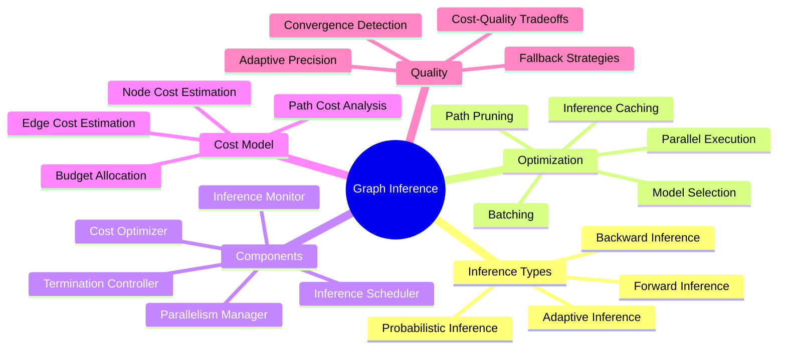
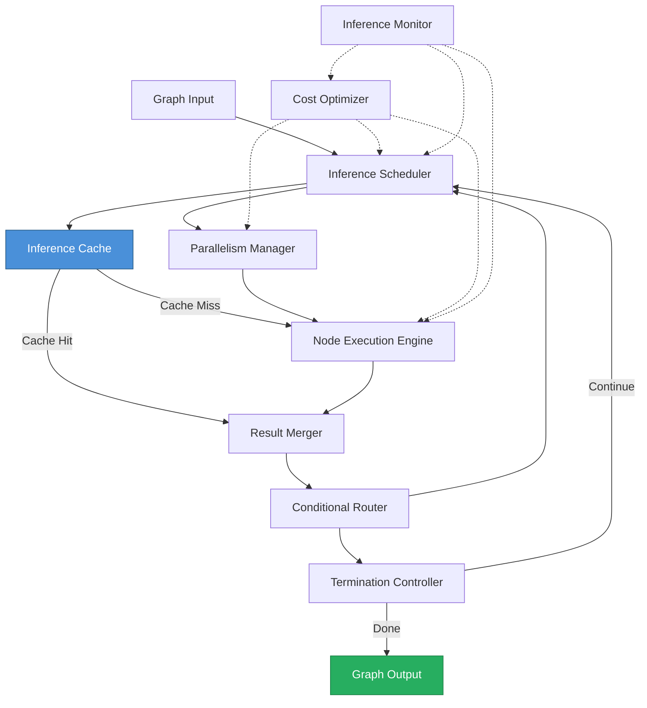
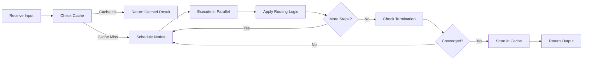
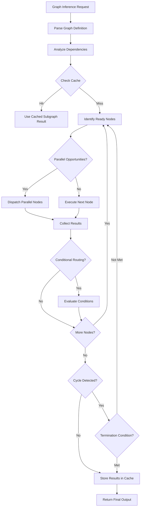
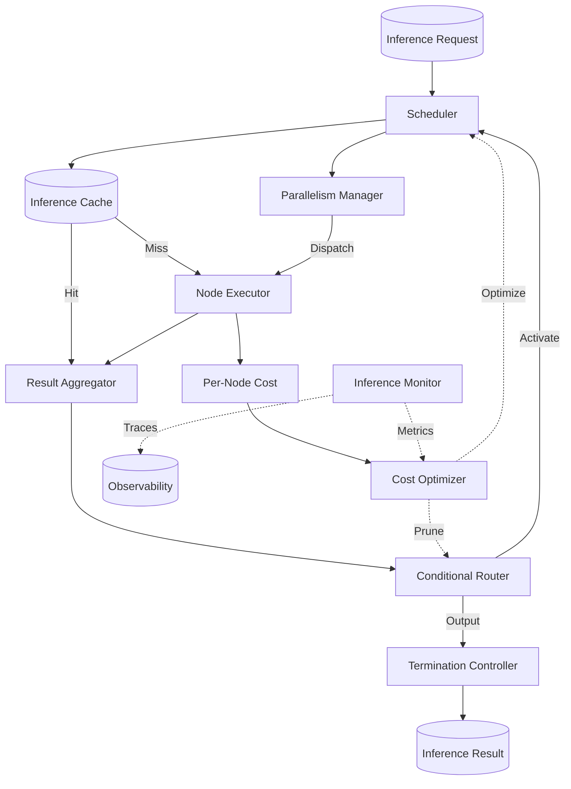
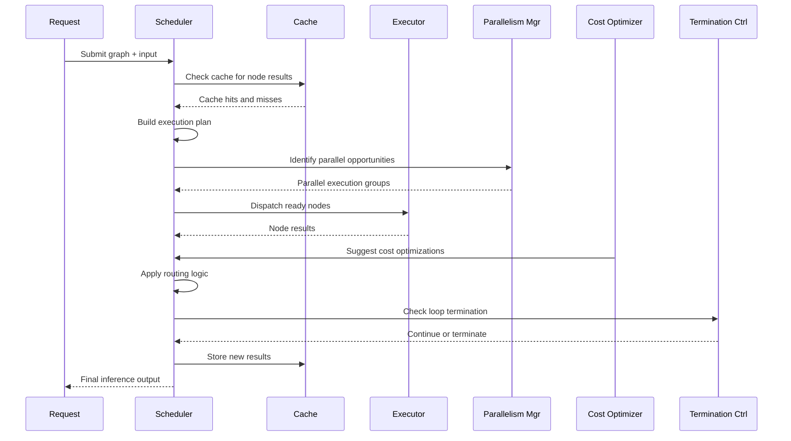

# Graph Inference

## 📌 Overview

Graph Inference is the engineering discipline of efficiently executing computational operations over graph-structured data and graph-based AI system architectures. In the context of graph engineering for AI systems, inference refers to the process of propagating information, computing outputs, and making decisions by executing the nodes and edges of a graph. This encompasses everything from a single LLM call in an agent graph to the complete execution of a multi-agent system with dozens of interconnected processing nodes. Graph inference is the runtime counterpart to graph design—it is where the static graph definition becomes a dynamic, executing system that produces results.

The challenge of graph inference lies in the complexity that graph structures introduce. Unlike pipeline inference, where processing follows a fixed sequence, graph inference must handle branching (multiple downstream nodes), merging (multiple upstream nodes contributing to one), loops (cycles that require iterative execution), and dynamic routing (the execution path determined at runtime based on intermediate results). Each of these patterns introduces computational challenges: branching creates parallelism opportunities but also resource management complexity; merging requires coordinating partial results from multiple sources; loops require termination detection and convergence checking; and dynamic routing makes it impossible to pre-compute the execution plan.

Graph inference optimization is therefore a critical engineering concern. The cost of executing a graph-based AI system can vary dramatically depending on how the graph is executed—which nodes are parallelized, which paths are pruned, which intermediate results are cached, and how resources are allocated. A well-optimized inference engine can reduce the cost of graph execution by orders of magnitude compared to a naive implementation, making the difference between a system that is economically viable and one that is not. This makes graph inference optimization not just a performance concern but a business concern.

## 🎯 Learning Objectives

By studying Graph Inference, you will learn to design and optimize the execution of graph-based AI systems for performance, cost, and reliability. You will understand the different types of inference that occur in graph-based systems—forward inference (propagating inputs to outputs), backward inference (tracing from outputs to inputs), and probabilistic inference (computing probability distributions over graph states). You will learn to analyze the computational cost of graph execution, identify bottlenecks, and apply optimization techniques that reduce cost without sacrificing output quality.

You will develop proficiency with the key optimization strategies for graph inference, including inference caching (storing and reusing results of previous computations), inference parallelism (executing independent nodes simultaneously), inference path pruning (eliminating unnecessary computations), and inference batching (combining multiple graph executions for efficiency). You will understand how these strategies interact and how to combine them for maximum benefit. You will also learn to implement adaptive inference strategies that adjust their behavior based on the specific input and context, allocating computational resources where they have the most impact on output quality.

Additionally, you will master the operational aspects of graph inference, including resource management (allocating compute, memory, and network resources across graph nodes), fault tolerance (handling node failures gracefully), and observability (monitoring inference performance and diagnosing issues). You will learn to design inference engines that can handle the full range of graph topologies—from simple linear chains to complex graphs with cycles, dynamic routing, and subgraph composition—while maintaining predictable performance and cost characteristics.

## 🧠 Definition

Graph Inference, in the context of graph-based AI systems, is the process of executing a defined graph structure to transform inputs into outputs by evaluating each node's computation and propagating results along the graph's edges. Each node in the graph represents a computational operation—an LLM call, a retrieval query, a transformation function, or a decision rule—and each edge represents the flow of data between operations. Inference is the act of providing input to the graph, executing the nodes in the correct order (determined by the graph topology and any conditional routing logic), and collecting the output from the terminal nodes.

Graph inference encompasses both deterministic and probabilistic modes. In deterministic inference, each node produces a single, definite output given its inputs, and the graph's execution is fully reproducible. In probabilistic inference, nodes may produce probability distributions rather than single values, and the inference process computes posterior distributions over graph states given observed evidence. Probabilistic graph inference is relevant when the graph includes uncertain knowledge, noisy inputs, or stochastic processing nodes, and it requires specialized algorithms (such as belief propagation or Markov chain Monte Carlo) that go beyond simple graph traversal.

The term "inference" in this context is distinct from its usage in machine learning (where it typically means running a trained model to make predictions). Graph inference is broader: it includes ML model execution as one type of node computation, but it also includes all the other computations that occur in a graph-based AI system—data retrieval, transformation, routing decisions, safety checks, and output formatting. The graph inference engine is the system that orchestrates all of these computations, managing data flow, execution order, parallelism, and resource allocation across the entire graph.

## ❓ Why It Matters

Graph Inference matters because the cost and performance of AI systems are increasingly determined by the efficiency of their execution, not just the quality of their individual components. As AI systems move from simple prompt-response models to complex graph-based agents with multiple LLM calls, tool invocations, and reasoning steps, the number of computational operations per user interaction can range from a handful to hundreds. Each operation has a cost in terms of latency (affecting user experience), compute resources (affecting infrastructure cost), and API calls (affecting direct monetary cost). The inference engine's ability to optimize the execution of these operations—through caching, parallelism, pruning, and batching—directly determines the system's economic viability.

Graph Inference matters because graph execution introduces computational challenges that do not exist in simpler architectures. In a pipeline, execution order is fixed and optimization is straightforward. In a graph, the execution order depends on runtime conditions, nodes may have multiple inputs that arrive at different times, cycles require careful management to prevent infinite loops, and the optimal execution strategy may change from one invocation to the next. These challenges require a sophisticated inference engine that can analyze the graph structure, predict execution costs, and make real-time optimization decisions. Without such an engine, graph-based AI systems will be slow, expensive, and unpredictable.

Furthermore, Graph Inference matters because it enables advanced AI capabilities that depend on efficient graph execution. Multi-agent systems require parallel execution of multiple agent graphs. Iterative reasoning requires efficient loop execution with convergence detection. Adaptive systems require dynamic graph modification during execution. Each of these capabilities demands an inference engine that can handle the specific computational patterns it introduces. As the field moves toward more complex, more capable AI systems, the importance of efficient graph inference will only increase.

## 🏛️ Core Concepts

**Forward Inference** propagates information from input nodes through the graph to output nodes, following the direction of the edges. This is the most common inference mode—given a user query, execute the graph from its entry point to its exit point, collecting the final output. Forward inference follows a topological ordering of the graph: a node can be executed only after all of its input edges have provided data. For acyclic graphs, the topological order is unique (up to parallelism), and execution is straightforward. For graphs with cycles, the inference engine must implement loop detection, termination conditions, and convergence checking to ensure that forward inference completes in finite time.

**Backward Inference** propagates information from output nodes back toward input nodes, reversing the direction of the edges. Backward inference is used for several purposes: explaining how an output was produced (tracing the reasoning path), identifying which inputs contributed most to a given output (attribution), and computing gradients for optimizing the graph's behavior (similar to backpropagation in neural networks). In graph-based AI systems, backward inference is particularly important for explainability—it allows the system to show the user not just what answer it produced but the chain of graph operations that led to that answer, creating a transparent and auditable reasoning trail.

**Probabilistic Inference** computes probability distributions over the states of graph nodes, rather than computing single definite values. This is necessary when the graph contains uncertain information or stochastic processing. For example, in a medical diagnosis graph, a symptom node might not be a definite yes/no but a probability distribution over possible severities. Probabilistic inference algorithms such as belief propagation, variational inference, and Markov chain Monte Carlo (MCMC) propagate these probability distributions through the graph, computing the posterior probability of each conclusion given the observed evidence. Probabilistic inference is more computationally expensive than deterministic inference but produces more nuanced and honest outputs that reflect the true uncertainty in the system's knowledge.

**Inference Path Selection** is the process of choosing which execution path through the graph to follow for a given input. In a graph with conditional routing, there are multiple possible execution paths, and the inference engine must select the appropriate one based on the current state. Path selection can be deterministic (based on explicit conditions in the routing nodes) or learned (based on a model that predicts which path is most likely to produce the best result). Learned path selection can optimize for different objectives: minimizing latency, minimizing cost, maximizing output quality, or balancing these objectives. In advanced systems, the path selection model itself is part of the graph, creating a self-optimizing inference system.

**Inference Cost Model** is a quantitative model that estimates the computational cost of executing different parts of the graph. The cost model assigns costs to nodes (based on the type of computation—LLM calls are expensive, simple transformations are cheap), edges (based on data transfer volume), and paths (the sum of node and edge costs along the path). The inference engine uses the cost model to make optimization decisions: which nodes to cache, which paths to prune, which operations to parallelize, and how to allocate resources. An accurate cost model is essential for effective inference optimization, and it must be continuously updated based on actual execution measurements.

## 🧩 Key Components

**Inference Scheduler** is responsible for determining the execution order of nodes in the graph. The scheduler analyzes the graph topology to identify which nodes are ready to execute (all inputs available), which nodes are blocked (waiting for inputs), and which nodes can be executed in parallel (no data dependencies between them). For graphs with conditional routing, the scheduler must also handle the discovery of new nodes and edges as routing decisions are made during execution. The scheduler's decisions directly impact performance: good scheduling maximizes parallelism and minimizes idle time, while poor scheduling leaves computational resources underutilized.

**Inference Cache** stores the results of previous node executions and reuses them when the same node is executed with the same inputs. Caching is one of the most impactful inference optimizations because many graph nodes—particularly retrieval nodes and LLM calls—are expensive to execute but frequently produce the same output for the same input. The cache must handle cache invalidation (ensuring that cached results are still valid when the underlying data has changed), cache sizing (deciding which results to evict when the cache is full), and cache key design (creating unique identifiers for node inputs that correctly determine cache hits and misses).

**Parallelism Manager** identifies opportunities for parallel execution and manages the concurrent execution of independent nodes. In a graph, two nodes can be executed in parallel if neither depends on the other's output—there is no directed path between them in the graph. The parallelism manager identifies these independent nodes, assigns them to available compute resources, and synchronizes their results when downstream nodes need both outputs. The parallelism manager must handle load balancing (distributing work evenly across resources), resource contention (managing competition for shared resources like memory and network bandwidth), and fault tolerance (handling the failure of a parallel execution branch).

**Cost Optimizer** analyzes the graph execution plan and optimizes it for cost efficiency. The cost optimizer considers the cost model for each node, the caching opportunities, the parallelism opportunities, and the expected output quality, and produces an optimized execution plan that minimizes cost while meeting quality targets. The optimizer might decide to skip an expensive LLM call and use a cached result instead, to use a cheaper model for a node where quality requirements are low, or to prune an entire subgraph if its expected contribution to the final output is below a threshold. The cost optimizer operates before execution (producing a static plan) and during execution (making dynamic adjustments based on observed costs).

**Termination Controller** manages the execution of loops and cycles in the graph, ensuring that inference completes in finite time. The termination controller implements loop detection (identifying cycles in the execution path), convergence checking (determining whether the graph's state is stabilizing or still changing), and termination conditions (deciding when to exit a loop). Termination conditions can be based on iteration count (exit after N iterations), state stability (exit when the state changes by less than a threshold), goal achievement (exit when the desired output is produced), or resource limits (exit when time or cost budgets are exhausted).

**Inference Monitor** collects metrics during graph execution and provides real-time and historical visibility into inference performance. The monitor tracks per-node execution time, cache hit rates, parallelism utilization, routing decisions, and resource consumption. These metrics are used for real-time adaptive optimization (the cost optimizer adjusts the execution plan based on observed performance), alerting (notifying operators when performance degrades), and capacity planning (predicting resource needs based on historical patterns). The monitor also produces execution traces that can be used for debugging and performance analysis.

## 🧭 Mental Model

Imagine a large manufacturing plant where products are assembled through a complex series of steps, with some steps happening in sequence and others in parallel, and where the exact path a product takes depends on its specifications. The plant manager (the inference scheduler) looks at the production orders and decides which workstations (nodes) to activate, in what order, and on which products. The warehouse (the inference cache) stores partially completed components that can be reused instead of being manufactured from scratch, saving time and materials. The logistics team (the parallelism manager) coordinates the movement of products between workstations, ensuring that no workstation is idle while work is available.

The plant's accounting department (the cost optimizer) tracks the cost of each operation and looks for ways to reduce costs without sacrificing quality. They might discover that a particular component is frequently needed and pre-manufacture it in bulk (precomputation). They might find that a less expensive workstation can handle a particular operation without quality loss (model selection). They might realize that some products don't need to go through every step and can skip unnecessary workstations (path pruning). The plant's quality control team (the termination controller) monitors iterative processes like painting and curing, determining when additional coats are no longer needed.

This manufacturing plant is a graph inference engine. The workstations are processing nodes, the conveyor belts are data flow edges, the plant manager is the scheduler, the warehouse is the cache, the logistics team is the parallelism manager, accounting is the cost optimizer, and quality control is the termination controller. Just as the plant's efficiency depends on how well these components work together, the efficiency of a graph-based AI system depends on how well its inference components are designed and tuned.

## 🗺️ Mind Map



## 🏗️ Architecture Diagram



## 🔄 Workflow



## ⚙️ Internal Working

The graph inference process begins when the inference scheduler receives an input and identifies the entry point nodes in the graph. The scheduler performs a dependency analysis to determine which nodes are ready to execute (their inputs are available), which nodes are blocked (waiting for upstream results), and which nodes are independent (can execute in parallel). This analysis produces an execution plan that the scheduler uses to dispatch nodes to the execution engine.

Before dispatching a node, the inference cache is consulted. The cache computes a key from the node's identity and its input data, and checks whether a previous execution with the same key produced a result. If a cache hit is found and the cached result is still valid, the cached output is used directly, skipping the expensive node execution. Cache hits are most common for retrieval nodes (where the same query often produces the same results) and for frequently executed decision nodes (where the same routing conditions recur across similar inputs).

For cache misses, the node is dispatched to the execution engine. The execution engine invokes the node's computation—calling an LLM, executing a tool, performing a transformation, or running a subgraph—and collects the result. The parallelism manager identifies which nodes can be executed concurrently and dispatches them to available compute resources. The execution engine handles the complexity of managing concurrent executions, including resource allocation, result collection, and error handling.

As nodes complete, their outputs are propagated along the graph's edges to downstream nodes. When a routing node receives its input, it evaluates the routing condition and determines which downstream nodes should receive the output. This may activate new parts of the graph that were not initially part of the execution plan. The scheduler dynamically updates the execution plan as new nodes are activated, ensuring that the newly activated nodes are scheduled and executed efficiently.

Throughout the process, the cost optimizer monitors the execution and makes optimization decisions. If the cost optimizer detects that a particular execution path is consuming more resources than expected, it may suggest pruning it. If it detects that a cached result from a related execution is likely to be a good enough approximation, it may suggest using the cached result instead of executing the node. If it detects that the total cost is approaching the budget, it may suggest switching to a cheaper execution strategy for remaining nodes.

The termination controller monitors loops in the graph, checking convergence after each iteration. Convergence is determined by comparing the graph's state between iterations—if the state is changing by less than a threshold, the loop is considered converged and execution exits the loop. If the loop has not converged within the maximum iteration count, the termination controller forces exit and reports the best result found so far. The inference monitor collects metrics throughout the process, enabling post-execution analysis and continuous optimization of the inference strategy.

## 🔀 Execution Flow



## 📊 Lifecycle

```mermaid
stateDiagram-v2
    [*] --> Initialized
    Initialized --> Scheduled
    Scheduled --> Cached: Cache Hit
    Scheduled --> Executing: Cache Miss
    Executing --> ParallelExecution: Parallelizable
    Executing --> SequentialExecution: Sequential
    ParallelExecution --> Completed
    SequentialExecution --> Completed
    Completed --> Routing
    Routing --> Scheduled: New Nodes Activated
    Routing --> LoopDetected: Cycle Found
    LoopDetected -> ConvergenceCheck
    ConvergenceCheck --> Scheduled: Not Converged
    ConvergenceCheck --> Caching: Converged
    Caching --> [*]
    Cached --> [*]
```

## 📡 Data Flow



## 🤝 Interaction Flow



## 🌍 Real-World Analogy

Think of Graph Inference as the navigation system in a ride-sharing app like Uber or Lyft. When you request a ride, the system must execute a complex graph of computations: locating nearby drivers (a spatial query node), estimating arrival times (a calculation node), considering traffic conditions (a data retrieval node), optimizing the route (a path optimization node), and calculating the fare (a pricing node). Each of these computations is a node in the inference graph, and the edges between them define how results flow from one computation to the next.

The navigation system's inference engine optimizes this graph execution for speed. It caches frequently requested route segments so it doesn't have to recalculate them every time. It parallelizes independent computations—while one thread checks driver availability, another checks traffic conditions. It prunes unnecessary computations—if you're going to the airport, it doesn't waste time calculating restaurant recommendations along the route. It adapts the execution plan based on real-time conditions—if traffic suddenly increases, it re-routes through a different execution path that avoids the congested area.

The cost optimizer is like the system's energy efficiency mode. When battery is low on your phone, it might use less accurate but faster routing algorithms. When your ride is urgent, it might spend more computational resources finding the absolute fastest route. The termination controller is the patience limit—if the system can't find a satisfactory route within a few seconds, it returns the best option found so far rather than making you wait indefinitely. This balance of speed, cost, and quality is exactly what graph inference optimization achieves for AI systems.

## 💡 Practical Example

Consider a customer support AI agent that processes incoming support tickets. The agent's execution graph includes nodes for classifying the ticket (LLM call), retrieving relevant knowledge base articles (retrieval node), checking customer history (database query), generating a response draft (LLM call), checking the response for accuracy (validation node), and escalating to a human if needed (routing decision). Without inference optimization, processing each ticket requires executing every node in sequence, costing approximately five LLM calls, two database queries, and one retrieval operation per ticket.

With graph inference optimization, the system becomes dramatically more efficient. The cache stores the results of common classification queries—if the last 100 tickets about password resets were classified the same way, the classifier node's result is cached and reused. The parallelism manager executes the knowledge base retrieval and customer history check simultaneously, since they are independent. The cost optimizer notices that the validation node rarely finds issues with responses generated for simple FAQ-type tickets, so it skips validation for tickets classified as FAQ-level. The result: the same ticket processing now costs approximately two LLM calls (classifier cached, response still needed), two database queries in parallel, and one retrieval operation—a 60% cost reduction with no measurable quality impact.

For complex tickets that require multiple rounds of reasoning, the termination controller ensures that the agent doesn't loop indefinitely. If the agent's reasoning hasn't converged after three iterations, the termination controller forces escalation to a human agent, preventing both excessive cost and poor user experience. The inference monitor tracks all of these optimizations and their impact on both cost and quality, providing the data needed to continuously tune the inference strategy.

## 🧪 Use Cases

**AI Agent Execution** is the primary use case for graph inference optimization. AI agents that use tools, maintain memory, and reason iteratively execute complex graphs for every user interaction. The cost of running these agents is dominated by LLM API calls, and inference optimization—particularly caching and path pruning—can reduce the number of calls by 50-80% for common interaction patterns. This cost reduction is often the difference between an agent that is economically viable and one that is not, making inference optimization a critical capability for production agent deployments.

**Multi-Turn Conversational AI** benefits from inference optimization because conversation context creates natural caching opportunities. When a user asks follow-up questions about the same topic, many of the retrieval and classification operations produce the same results as previous turns. The inference cache recognizes these repeated operations and reuses their results, reducing both latency and cost. Additionally, the cost optimizer can adapt the reasoning depth based on conversation complexity—simple follow-up questions use lighter processing, while complex topic changes trigger deeper reasoning.

**Batch Document Processing** applies graph inference to process large collections of documents through a shared analysis pipeline. Each document follows the same graph structure (classification, extraction, validation, storage), and many operations can be batched across documents. The parallelism manager processes multiple documents concurrently, the cache reuses results for documents that share common characteristics, and the cost optimizer adjusts the processing depth based on document priority. This batch optimization can process documents at a fraction of the per-document cost of sequential processing.

**Real-Time Decision Systems** such as fraud detection, recommendation engines, and dynamic pricing systems execute graph inference under strict latency constraints. These systems must complete their graph execution within milliseconds, leaving no room for unnecessary computation. Inference optimization is essential: the cost optimizer pre-computes expensive operations, the cache provides instant access to frequently needed results, and the parallelism manager maximizes throughput by executing independent computations simultaneously. The termination controller ensures that the system always produces a result within the latency budget, even if it means using a less optimal but faster execution path.

## ⚖️ Comparison

| Aspect | Pipeline Inference | Tree Inference | Graph Inference |
|--------|-------------------|----------------|-----------------|
| **Execution Order** | Fixed sequence | Branching order | Dynamic, topology-dependent |
| **Parallelism** | None | Within branches | Across independent subtrees |
| **Caching** | Simple | Per-branch | Complex (shared subgraphs) |
| **Loop Handling** | Not applicable | Not applicable | Termination control needed |
| **Path Selection** | None | At branch points | At every routing node |
| **Cost Optimization** | Minimal | Branch pruning | Path, node, and model selection |
| **Backward Inference** | Simple reverse | Tree reversal | Graph traversal |
| **Complexity** | Low | Medium | High |
| **Best For** | Simple transforms | Multi-option decisions | Complex AI systems |

## ✅ Best Practices

**Implement caching as a first-class inference component, not an afterthought.** The inference cache should be designed into the system from the start, with well-defined cache keys, cache invalidation policies, and cache monitoring. The cache key should capture all information that affects a node's output—the node identity, its input data, and any relevant configuration parameters. Cache invalidation should be triggered by changes to the underlying data (e.g., updated knowledge base articles should invalidate cached retrieval results). Cache monitoring should track hit rates, miss rates, and eviction rates to tune cache sizing and identify nodes that would benefit most from caching.

**Profile your graph execution before optimizing.** Different graphs have different bottlenecks, and optimizing the wrong bottleneck wastes engineering effort and may even make performance worse. Use the inference monitor to collect detailed per-node execution times, cache statistics, and resource utilization data. Identify the nodes that consume the most time, the edges that transfer the most data, and the paths that are most frequently executed. Focus your optimization efforts on the components that have the largest impact on overall performance.

**Design for graceful degradation.** In production systems, things go wrong: LLM APIs experience latency spikes, databases become unavailable, and cache servers fail. Your inference engine should handle these failures gracefully, falling back to cheaper or faster alternatives when the primary option is unavailable. Implement fallback models for LLM nodes (a smaller, cheaper model that can substitute when the primary model is slow or down), fallback data sources for retrieval nodes (a cached or approximate result when the primary source is unavailable), and timeout-based fallbacks that switch strategies when execution exceeds a time budget.

**Use adaptive inference strategies that adjust to input complexity.** Not all inputs require the same level of processing. A simple factual question can be answered with a single LLM call, while a complex analytical question may require multiple rounds of reasoning. Implement complexity estimation that classifies the input and selects an appropriate inference strategy. Simple inputs get fast, cheap processing; complex inputs get deeper, more thorough processing. This adaptive approach optimizes the average cost across all inputs while maintaining quality for the cases that need it.

## ❌ Common Mistakes

**Over-caching** leads to stale results being served to users. While caching is one of the most powerful inference optimizations, aggressive caching can cause the system to serve outdated information when the underlying data has changed. This is particularly dangerous for retrieval nodes that access frequently updated data sources. Implement cache invalidation carefully, and consider using time-based expiration for caches that access volatile data. Monitor cache freshness and alert when the cache hit rate is high but the data freshness is questionable.

**Ignoring tail latency** leads to poor user experience even when average performance is good. Graph inference systems often exhibit high tail latency—a small percentage of executions take much longer than average due to slow LLM responses, cache misses, or resource contention. Users remember their worst experiences, not their average experiences. Implement request-level timeouts, circuit breakers for slow dependencies, and pre-computation for critical paths to minimize tail latency. Set latency budgets and design the inference engine to meet them consistently.

**Optimizing for cost at the expense of quality** produces systems that are cheap to run but produce poor results. The cost optimizer must balance cost and quality, not simply minimize cost. Implement quality metrics that are tracked alongside cost metrics, and set minimum quality thresholds that the optimizer cannot violate. Use A/B testing to measure the actual impact of cost optimizations on user-facing quality, and roll back optimizations that degrade quality below acceptable levels.

**Neglecting inference monitoring** leaves you blind to performance issues and optimization opportunities. Without comprehensive monitoring, you cannot know which nodes are bottlenecks, which cache entries are effective, which routing decisions are suboptimal, or how the system's performance is changing over time. Implement inference monitoring from day one, track both per-node and per-graph metrics, and establish baselines that you can compare against. Use the monitoring data to drive continuous optimization, not just one-time tuning.

## 🚀 Advanced Topics

**Speculative Inference** pre-computes likely execution paths before the routing decisions are made, using predictions about which paths will be taken. When the routing decision is eventually made, if the pre-computed path matches the selected path, the results are available immediately, dramatically reducing latency. If the prediction was wrong, the pre-computation is discarded and the correct path is executed normally. Speculative inference is particularly effective when routing decisions are predictable (most inputs follow common paths) and when the cost of pre-computation is low relative to the latency savings. This technique is analogous to speculative execution in CPU design.

**Hierarchical Caching** organizes the inference cache in multiple levels, from fast but small caches (in-memory) to slow but large caches (disk-based or distributed). Each cache level has different characteristics in terms of speed, size, and persistence. The inference engine checks caches in order from fastest to slowest, using the first cache hit found. Hierarchical caching enables large cache sizes without sacrificing access speed for frequently used entries. Advanced hierarchical caches implement intelligent promotion and demotion policies that move entries between levels based on access patterns.

**Inference-Aware Graph Design** is the practice of designing graph topologies with inference efficiency in mind, not just functional correctness. An inference-aware design considers cacheability (how many node results can be reused across executions), parallelizability (how many nodes can execute concurrently), and path redundancy (how many unnecessary paths exist). An inference-aware designer might split a large node into two smaller nodes to increase caching granularity, add conditional edges that skip expensive nodes when they are not needed, or restructure the graph to maximize parallelism. This co-design of graph topology and inference strategy produces systems that are inherently more efficient than systems where topology and inference are designed independently.

**Federated Graph Inference** executes graph inference across multiple compute environments, with different nodes hosted on different machines or in different cloud regions. Federated inference enables graphs that span organizational boundaries (some nodes are internal, others are external services), leverage specialized hardware (GPU nodes for LLM calls, CPU nodes for simple transformations), and optimize for data locality (executing retrieval nodes close to the data they access). The challenge of federated inference is managing the communication overhead between distributed nodes and ensuring consistent, low-latency execution despite network variability.