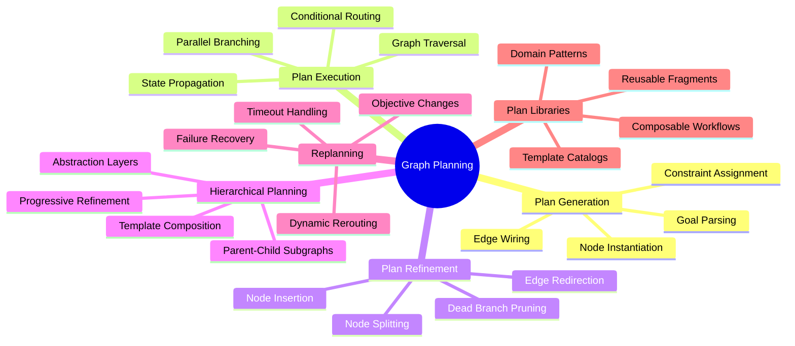
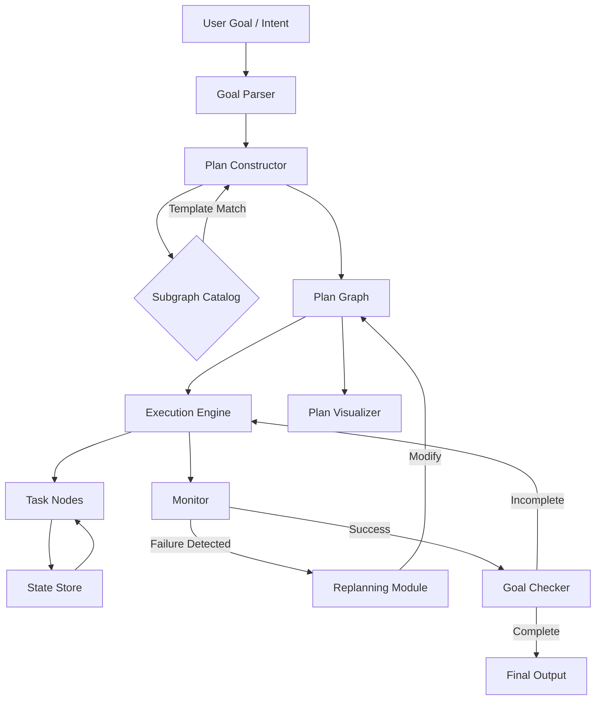
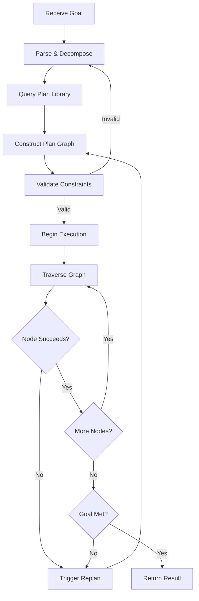
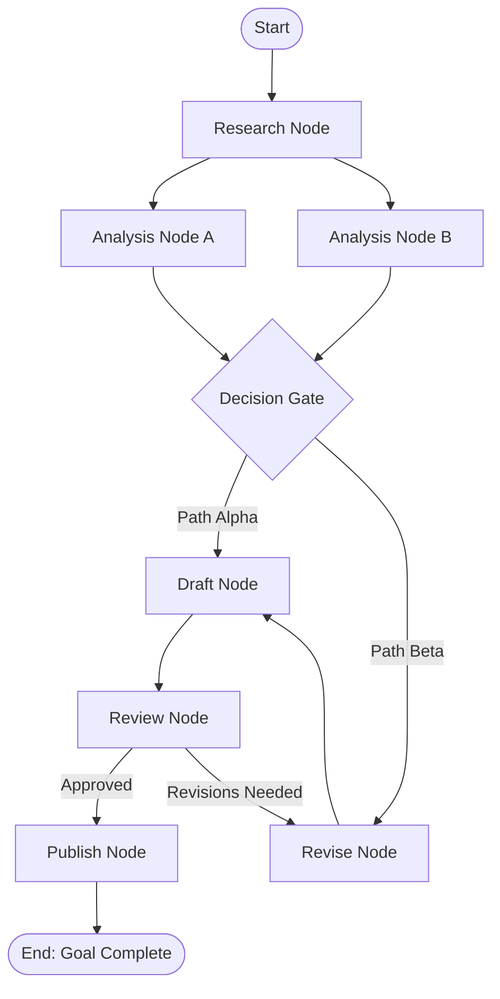
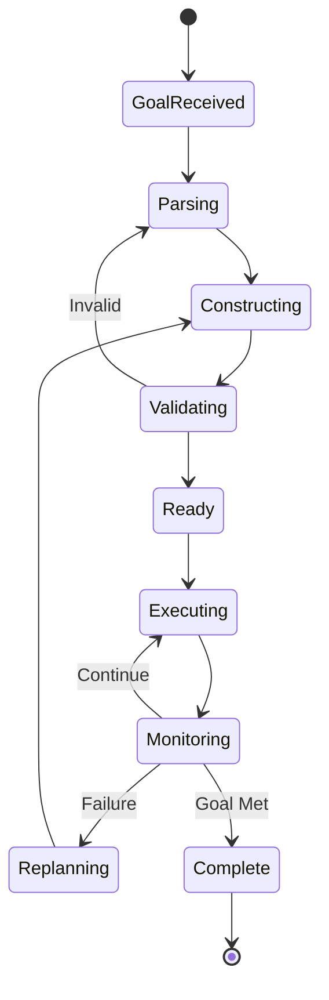
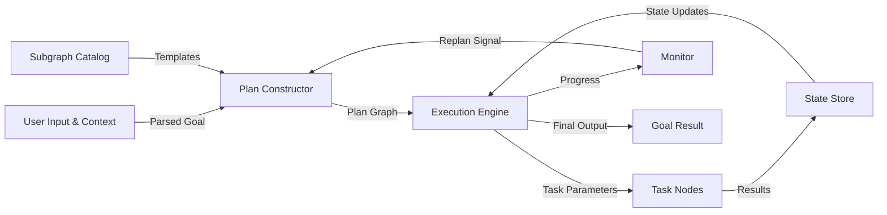
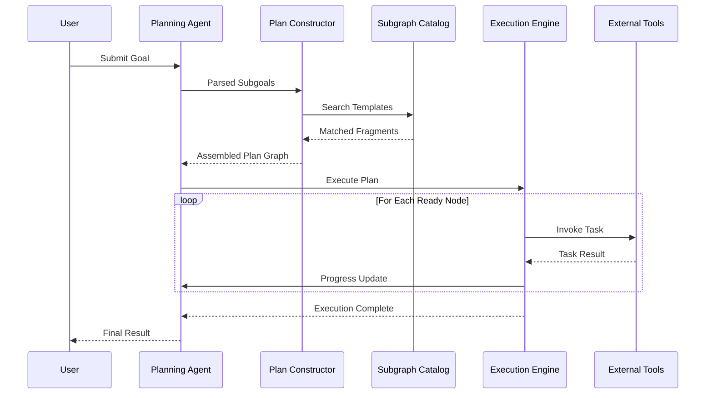

# Graph Planning

## 📌 Overview

Graph Planning is a paradigm for decomposing complex tasks into structured, interconnected execution plans modeled as graphs. Instead of treating a plan as a linear checklist, graph planning represents each step as a node and each dependency or transition as an edge, creating a rich, navigable structure that captures the full topology of a problem-solving process. This approach enables AI agents and workflow systems to reason about task ordering, conditional branching, and dynamic replanning in a way that flat sequences simply cannot support. By constructing plans as graphs, systems gain the ability to visualize, analyze, and adapt execution pathways in real time, making them far more resilient to changing conditions and unexpected failures. Graph planning is foundational to advanced agentic architectures where autonomous systems must decompose high-level goals into executable subtasks, evaluate trade-offs between alternative pathways, and refine their approach as new information becomes available throughout execution.

## 🎯 Learning Objectives

By studying Graph Planning, you will understand how to decompose complex goals into graph-shaped execution plans where nodes represent discrete actions and edges encode dependencies and control flow. You will learn how plan generation can be framed as graph construction, selecting and arranging nodes dynamically based on the problem domain, available tools, and constraints. You will explore how plan execution maps directly to graph traversal, following edges from start nodes through intermediate processing steps to terminal goal states, with the ability to branch and merge along the way. You will gain proficiency in hierarchical planning techniques that nest subgraphs within parent nodes, enabling multi-level abstraction and progressive refinement of complex workflows. Finally, you will master replanning strategies that modify the graph structure mid-execution, allowing systems to recover from failures, adapt to new inputs, and optimize their paths without restarting from scratch.

## 🧠 Definition

Graph Planning is the discipline of designing, constructing, executing, and refining plans that are explicitly modeled as directed graphs within AI and workflow systems. A graph plan consists of nodes that represent atomic or composite tasks, edges that represent data flow, control flow, or dependency relationships between those tasks, and metadata that encodes priority, cost, preconditions, and expected outcomes for each element. Unlike traditional linear planning, graph planning allows for parallel branches, conditional routing, loops for iterative refinement, and shared subplans that can be referenced from multiple parent contexts. The plan is not a static artifact but a living structure that evolves as execution proceeds, with nodes being added, removed, or reordered in response to runtime feedback. Graph planning sits at the intersection of classical automated planning, workflow orchestration, and agentic AI, borrowing concepts like hierarchical task networks and partial-order planning while adapting them for modern graph-based execution engines.

## ❓ Why It Matters

Graph Planning matters because real-world tasks are rarely linear. A data pipeline might need to branch into parallel validation steps, an AI agent might need to loop back to a research phase after discovering new constraints, and a multi-agent system might need to coordinate across dozens of interdependent subtasks that cannot be serialized without massive inefficiency. Linear plans break down under these conditions, forcing developers to hardcode branching logic or rely on fragile state machines. Graph planning provides a unified framework that naturally accommodates parallelism, conditional logic, iteration, and dynamic modification, all within a single coherent structure. For AI agents specifically, graph planning is the mechanism by which large language models translate high-level user intentions into concrete, executable sequences of tool calls, API requests, and reasoning steps. Without graph-based planning, agents would be limited to single-shot responses or rigid pipelines, unable to handle the messy, iterative reality of complex knowledge work.

## 🏛️ Core Concepts

The core concepts of Graph Planning revolve around treating the planning process itself as a graph construction activity and the execution process as a graph traversal. **Plan Generation as Graph Construction** means that when a system receives a goal, it does not produce a flat list of steps but instead builds a graph by instantiating task nodes, connecting them with dependency edges, and annotating them with constraints. **Plan Execution as Graph Traversal** means the runtime engine walks the graph from its entry nodes toward goal nodes, activating each node when its preconditions are satisfied and propagating outputs along edges to downstream consumers. **Plan Refinement through Graph Modification** means the system can dynamically alter the graph during execution, inserting new nodes, redirecting edges, pruning dead branches, or splitting existing nodes into finer-grained subgraphs. **Hierarchical Planning** introduces nested graphs where a parent node can expand into an entire subgraph representing a more detailed decomposition, allowing plans to be abstract at the top level and concrete at the leaf level. **Replanning** is the process of regenerating or patching the graph in response to failures, changing requirements, or newly discovered information, ensuring the system always has a viable path to completion.

## 🧩 Key Components

The key components of a Graph Planning system include the **Goal Parser**, which interprets the high-level objective and translates it into an initial set of constraints and success criteria for the plan. The **Plan Constructor** is the engine that assembles the graph by selecting appropriate task templates, instantiating nodes, and wiring edges based on the parsed constraints and available tool capabilities. **Task Nodes** are the fundamental units of work, each encapsulating a specific operation such as an LLM call, an API request, a data transformation, or a user interaction prompt. **Dependency Edges** connect nodes and carry typed data payloads, control signals, or constraint annotations that govern execution ordering. The **Subgraph Catalog** is a library of pre-built plan fragments that can be composed into larger plans, representing reusable workflows like "search-and-summarize" or "validate-and-retry." The **Execution Engine** traverses the graph, managing state propagation, parallel scheduling, and conditional routing. The **Replanning Module** monitors execution health and triggers graph modifications when nodes fail, timeouts occur, or new objectives emerge. Finally, the **Plan Visualizer** renders the graph structure in real time, giving developers and agents alike a clear picture of what the system is doing and where it is headed.

## 🧭 Mental Model

Think of Graph Planning like planning a multi-city road trip with a GPS navigation system. Your high-level goal is to visit several destinations (the nodes), but the order and route depend on factors like distance, traffic, opening hours, and your preferences (the edges and constraints). The GPS does not give you a rigid, unchangeable itinerary; instead, it builds a route graph that can adapt when a road is closed or when you decide to add a detour. Similarly, a graph plan starts as a proposed route through task-space, and as you execute each leg of the journey, the system can recalculate, reroute, or extend the plan based on real-time conditions. Another useful analogy is a project management Gantt chart enhanced with dependency arrows, where tasks that can run in parallel are executed simultaneously, and a delay in one task automatically shifts downstream dependencies. Graph planning is the algorithmic equivalent of that adaptive project management, applied to AI agent workflows and automated reasoning pipelines.

## 🗺️ Mind Map

## 🏗️ Architecture Diagram

## 🔄 Workflow

## ⚙️ Internal Working

The internal workings of a Graph Planning system unfold across several tightly coordinated phases. When a goal is received, the Goal Parser first breaks it down into a set of subgoals, identifying key entities, constraints, and success criteria. The Plan Constructor then takes these subgoals and begins building the graph by matching each subgoal against the Subgraph Catalog to find reusable plan fragments. For subgoals without matching templates, the constructor synthesizes new nodes by examining the available tool set and creating task nodes that can fulfill the requirements. Edges are then wired between nodes based on data dependencies, temporal ordering constraints, and conditional branching logic. Once the initial graph is assembled, a constraint validator checks that the graph is acyclic where required, that all mandatory inputs are provided by upstream nodes, and that no resource limits are exceeded. Execution begins at entry nodes, and the engine propagates state through the graph, activating downstream nodes as preconditions are met. Throughout execution, the Monitor watches for failures, timeouts, and anomalous outputs, triggering the Replanning Module to modify the graph when necessary. Replanning can take several forms: inserting a retry node after a failure, adding a new research branch when information is insufficient, or pruning an entire branch when its objective becomes irrelevant.

## 🔀 Execution Flow

## 📊 Lifecycle

## 📡 Data Flow

## 🤝 Interaction Flow

## 🌍 Real-World Analogy

Consider how a master chef plans a multi-course dinner for a large event. The chef does not simply write down a linear list of steps; instead, they mentally construct a dependency graph. Appetizers must be prepped before service but can be made while the main course braises in the oven. Dessert components can be prepared in parallel during the main course cooking time. If a key ingredient is missing, the chef dynamically replans, substituting a dish and adjusting all downstream steps that depended on the original recipe. The kitchen staff operates like task nodes in a graph, each receiving inputs (prepped ingredients), performing their operation (cooking, plating), and passing outputs to the next station. The head chef acts as the execution engine and monitor, watching the flow of dishes through the kitchen and intervening when a station falls behind or a quality check fails. The entire dinner service is a graph plan being executed, monitored, and dynamically adjusted in real time.

## 💡 Practical Example

Imagine an AI research agent tasked with producing a competitive analysis report. The agent decomposes this goal into a graph plan: a Research node searches multiple sources in parallel, feeding results into separate Analysis nodes for each competitor. These analysis outputs merge at a Comparison node that identifies strengths and weaknesses. A Synthesis node then drafts the report, which flows to a Review node for quality assessment. If the Review node determines the analysis is incomplete, it triggers a replan that adds a Deep-Dive node targeting the weak sections, reinserting the new node into the graph between Analysis and Comparison. The plan graph is not static; it grows and adapts as the agent discovers gaps in its knowledge. Hierarchical planning comes into play when the Research node itself expands into a subgraph containing Search, Filter, Rank, and Summarize nodes, providing a reusable pattern that could be swapped in for any future research task without redesigning the entire plan from scratch.

## 🧪 Use Cases

Graph Planning is essential in multi-step AI agent workflows where tasks have complex dependencies and conditional branching, such as autonomous research assistants that must search, analyze, and synthesize information across multiple iterations. It powers software development agents that decompose a feature request into a graph of code generation, testing, review, and deployment nodes, with replanning triggered by test failures or integration conflicts. In data engineering, graph planning orchestrates complex ETL pipelines where parallel extraction streams feed into transformation and loading steps, with error-handling branches that reroute failed records for manual inspection. Customer service automation uses graph planning to navigate diagnostic decision trees that branch based on user responses, looping back to gather more information when initial troubleshooting is insufficient. Scientific research automation relies on graph planning to coordinate hypothesis generation, experiment design, data collection, statistical analysis, and peer review workflows, all of which may need to be dynamically reordered as experimental results come in.

## ⚖️ Comparison

Graph Planning differs significantly from linear planning, which forces all tasks into a single sequence and cannot represent parallelism or conditional branching without manual control-flow code. Linear plans are simpler to implement but brittle when requirements change. Tree-based planning offers branching but no merging or shared subplans, making it inefficient for workflows where multiple paths converge on the same downstream processing. State machines provide explicit state transitions but lack the ability to dynamically add new states or transitions at runtime without extensive redesign. Graph planning combines the flexibility of arbitrary connectivity with the structure of typed edges and annotated nodes, giving it the expressiveness to model any workflow topology while maintaining the discipline needed for reliable execution. Compared to classical AI planning systems like STRIPS or PDDL, graph planning trades some formal verification rigor for practical flexibility, making it better suited for open-ended agentic workloads where the full action space cannot be enumerated in advance.

## ✅ Best Practices

Design your plan graphs with clear entry and exit points, ensuring that every path through the graph eventually reaches a terminal state, whether success or graceful failure. Use hierarchical abstraction aggressively, keeping top-level plans at a high level of granularity and expanding details only when execution reaches that part of the graph. Maintain a rich Subgraph Catalog of reusable plan fragments, documenting the preconditions, inputs, outputs, and expected behavior of each template. Implement comprehensive monitoring that tracks not just node completion but also intermediate state quality, enabling early detection of plans that are technically executing but drifting toward suboptimal outcomes. Make replanning a first-class operation, not an afterthought, by designing every node with explicit failure modes and recovery strategies that the replanning module can invoke. Use typed edges to enforce data contracts between nodes, preventing subtle bugs where a node receives data in an unexpected format. Version your plan graphs alongside your code, treating plan structure changes with the same rigor as API changes, so that plan evolution is tracked and reversible.

## ❌ Common Mistakes

A frequent mistake is over-engineering the plan graph by creating too many nodes for trivial operations, which adds execution overhead and makes the graph difficult to debug and visualize. Conversely, under-granular plans that bundle too much logic into single nodes lose the benefits of graph structure, creating opaque monoliths that cannot be selectively replanned or parallelized. Another common error is neglecting cycle detection, allowing feedback loops that can cause infinite execution if not properly bounded by iteration limits or convergence checks. Failing to implement graceful degradation in replanning leads to cascading failures where a single node error propagates and invalidates the entire graph. Ignoring plan visualization during development results in graphs that are unreadable to human operators, making it impossible to diagnose execution issues or validate plan correctness before deployment. Treating plan templates as rigid, unmodifiable structures rather than parameterizable blueprints limits reusability and forces redundant graph construction for similar but not identical tasks.

## 🚀 Advanced Topics

Advanced Graph Planning encompasses adaptive planning algorithms that use reinforcement learning to optimize plan construction strategies based on historical execution outcomes, automatically learning which graph topologies perform best for different problem classes. Constraint-aware planning integrates resource allocation, cost optimization, and timing constraints directly into the graph construction process, producing plans that are not only correct but optimally efficient given available resources. Collaborative multi-agent planning extends the graph paradigm to distributed systems where multiple agents contribute nodes to a shared plan graph, negotiating dependencies and coordinating execution through a consensus protocol. Plan compression techniques reduce graph complexity by identifying and merging redundant nodes, collapsing linear chains into composite nodes, and eliminating dead branches that are statically unreachable. Formal verification of graph plans uses model-checking and temporal logic to prove properties like liveness, safety, and termination before execution begins, providing guarantees that are especially critical for autonomous systems operating in high-stakes domains. Streaming plan construction allows the graph to be built incrementally as information becomes available, rather than requiring complete goal specification upfront, enabling truly exploratory planning paradigms.
