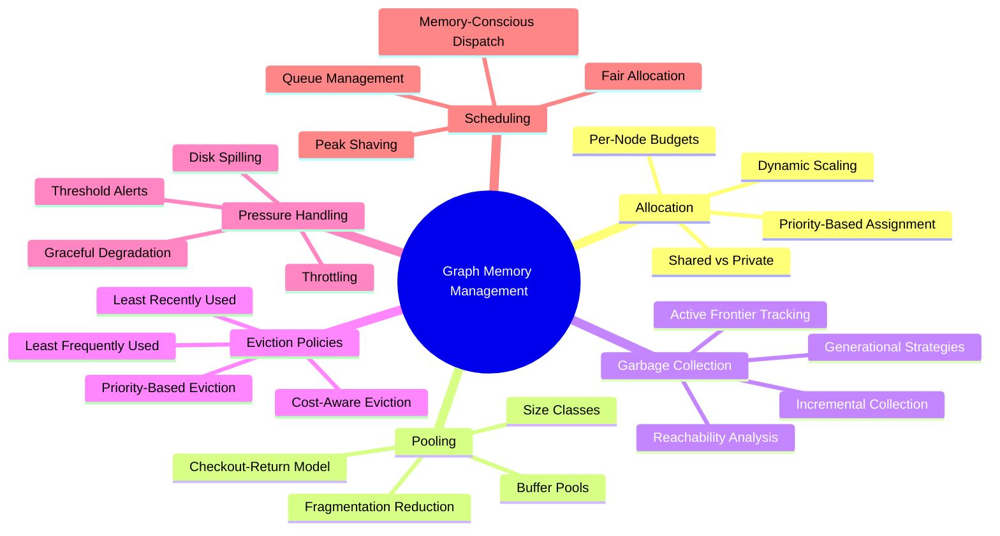
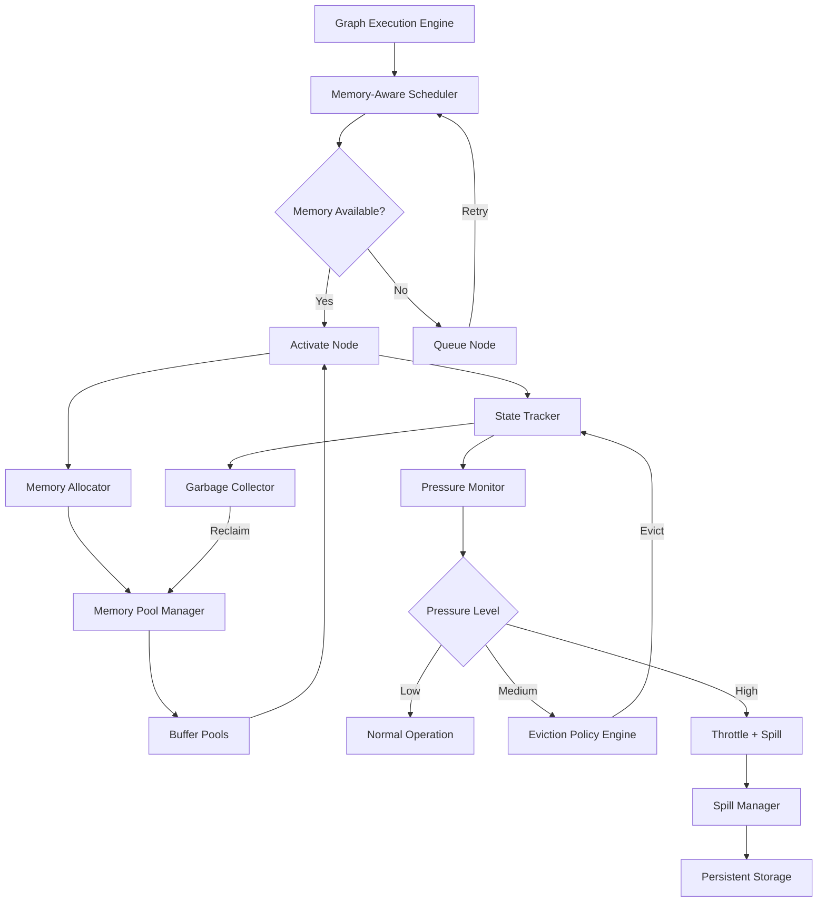
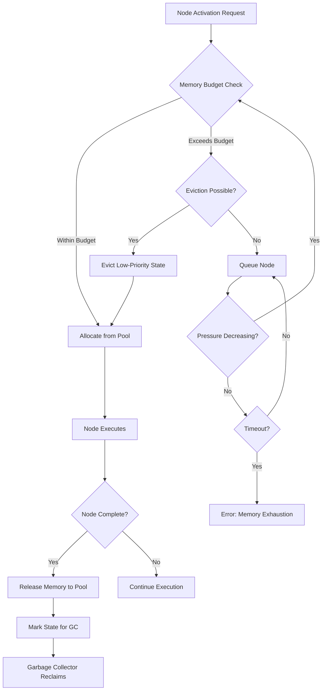
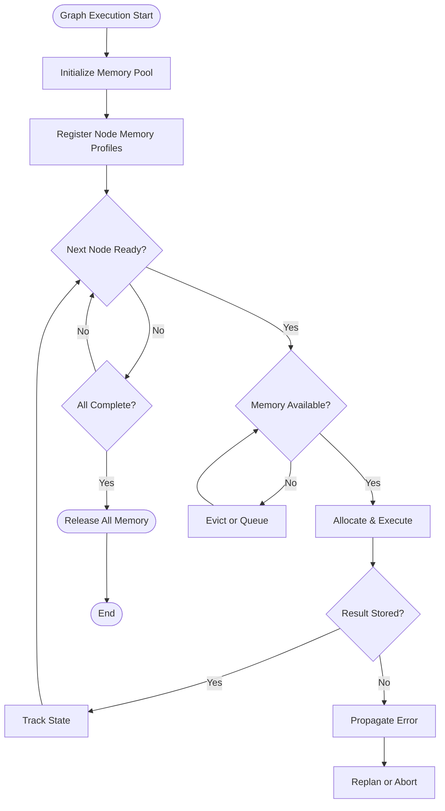
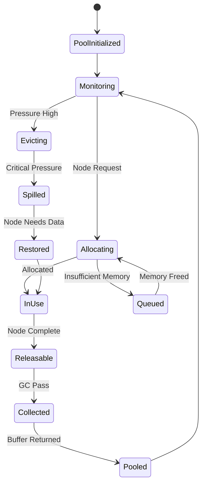
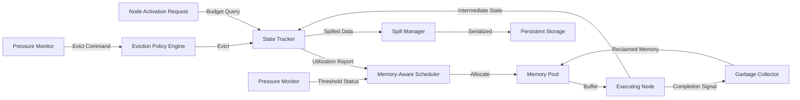
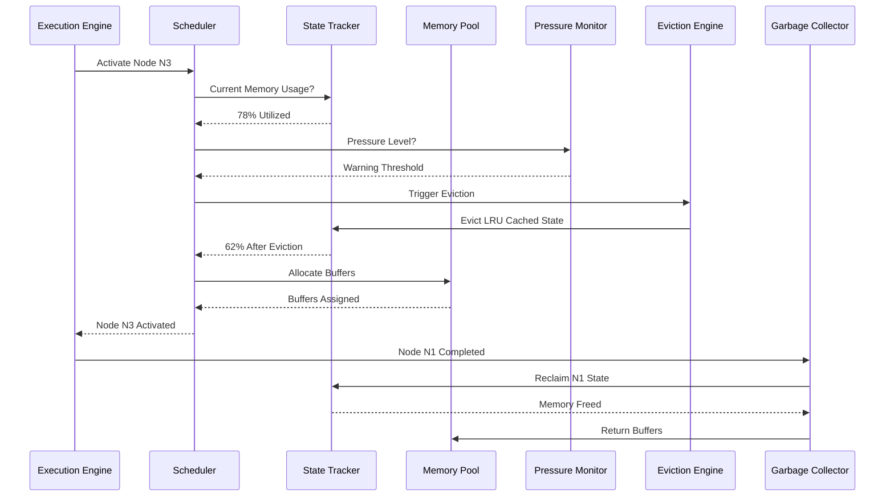

# Graph Memory Management

## 📌 Overview

Graph Memory Management is the discipline of efficiently allocating, tracking, and reclaiming memory resources across the nodes and edges of a graph-based AI system. In graph-engineered systems, each node in a workflow or agent graph may hold state, intermediate results, cached computations, and contextual data that collectively consume significant memory during execution. As graphs grow in complexity, with parallel branches, long-running loops, and deeply nested hierarchies, the memory footprint can escalate rapidly, leading to resource exhaustion, performance degradation, and system instability. Effective memory management ensures that every node receives the resources it needs without starving other parts of the graph, that completed or abandoned branches release their memory promptly, and that the overall system remains responsive under heavy load. This topic is critical for production graph systems that must handle real-world workloads with predictable performance and reliability, transforming memory from an unbounded liability into a carefully governed resource that enables scalable, robust graph execution.

## 🎯 Learning Objectives

By studying Graph Memory Management, you will understand how memory is allocated to individual nodes and edges within a graph system, including strategies for per-node quotas, shared memory pools, and dynamic scaling based on node priority. You will learn about memory pooling techniques that amortize allocation overhead and reduce fragmentation across high-frequency graph operations. You will explore garbage collection mechanisms tailored for graph state, identifying and reclaiming memory from nodes that have completed execution, branches that have been pruned, and edges that no longer carry active data. You will master memory eviction policies that determine which cached states and intermediate results to discard when memory pressure increases, balancing recency, frequency, and computational cost of recomputation. You will understand how to design memory-aware schedulers that account for resource constraints when deciding which nodes to activate next, preventing memory hotspots and ensuring fair distribution across the graph. Finally, you will learn how to monitor, alert on, and automatically respond to memory pressure conditions before they impact system availability.

## 🧠 Definition

Graph Memory Management refers to the set of strategies, policies, and mechanisms that govern how memory resources are acquired, used, shared, and released within graph-based AI and workflow systems. It encompasses **memory allocation per node**, where each node is assigned a budget for its local state, inputs, outputs, and scratch space. It includes **memory pooling**, where a shared pool of pre-allocated memory buffers is drawn from by nodes on demand, reducing allocation latency and fragmentation. It covers **garbage collection for graph state**, the process of identifying and reclaiming memory held by nodes, edges, and subgraphs that are no longer reachable or relevant to the current execution. It addresses **memory eviction policies**, the rules that determine which cached or in-memory data is discarded when the system approaches its memory limits. It includes **memory pressure handling**, the operational responses triggered when memory utilization exceeds configurable thresholds, such as throttling new node activations, spilling state to disk, or escalating to human intervention. Collectively, these mechanisms transform raw memory into a managed, schedulable resource that graph execution engines can rely on for predictable, efficient operation.

## ❓ Why It Matters

Memory management matters in graph systems because the graph structure itself amplifies memory usage in ways that linear or tree-based systems do not. A single node that caches its full output may seem innocuous, but when that output is consumed by ten downstream nodes across three parallel branches, the memory cost multiplies. Long-running loops in a graph can accumulate state across hundreds of iterations if intermediate results are not deliberately discarded. Deep hierarchical plans can instantiate dozens of nested subgraphs, each maintaining its own state independently, leading to a memory footprint that grows exponentially with depth. In production environments, unmanaged memory leads to out-of-memory crashes that terminate entire workflows, slow garbage collection pauses that introduce unpredictable latency spikes, and memory starvation where critical nodes cannot execute because less important branches are hoarding resources. Effective graph memory management is what separates a prototype that works on small test cases from a production system that reliably handles real-world scale, making it a non-negotiable competency for anyone building serious graph-based AI applications.

## 🏛️ Core Concepts

The core concepts of Graph Memory Management center around treating memory as a finite, allocable resource that must be governed by explicit policies rather than left to chance. **Memory Allocation per Node** assigns each node a memory budget based on its type, priority, and expected workload, preventing any single node from consuming disproportionate resources. **Memory Pooling** creates shared reservoirs of pre-allocated buffers that nodes check out and return, dramatically reducing allocation overhead and memory fragmentation in high-throughput systems. **Garbage Collection for Graph State** identifies nodes, edges, and subgraphs that are no longer reachable from the active execution frontier and reclaims their memory, similar to tracing garbage collection in programming languages but operating on graph topology rather than object references. **Memory Eviction Policies** determine what to discard when the system is under pressure, using strategies like least-recently-used, least-frequently-used, or cost-aware eviction that considers how expensive it would be to recompute discarded data. **Memory Pressure Handling** defines escalating responses to increasing memory utilization, from soft alerts and gentle throttling to aggressive eviction, disk spilling, and ultimately graceful workflow termination. **Memory-Aware Scheduling** integrates memory constraints into the node activation decisions of the execution engine, ensuring that the system never attempts to execute more nodes simultaneously than available memory can support.

## 🧩 Key Components

The key components of a Graph Memory Management system include the **Memory Allocator**, which manages the initial assignment of memory budgets to nodes based on their declared requirements and the system's current resource posture. The **Memory Pool Manager** maintains a set of pre-allocated buffer pools segmented by size class, allowing nodes to quickly acquire and release memory without invoking the operating system allocator for every operation. The **State Tracker** maintains a live inventory of all memory consumed by each node, edge, and subgraph, providing the ground truth that garbage collection and eviction decisions are based on. The **Garbage Collector** periodically or event-drivenly scans the graph for unreachable state, using reachability analysis from active execution frontiers to identify memory that can be safely reclaimed. The **Eviction Policy Engine** implements configurable strategies for selecting which in-memory data to discard under pressure, considering factors like access recency, access frequency, recomputation cost, and node priority. The **Pressure Monitor** continuously tracks aggregate memory utilization against configured thresholds and triggers escalating responses as utilization increases. The **Memory-Aware Scheduler** integrates memory constraints into node scheduling, potentially delaying or queuing node activations that would exceed available memory. The **Spill Manager** handles the serialization of evicted state to persistent storage, enabling recovery without full recomputation when the data is needed again.

## 🧭 Mental Model

Think of Graph Memory Management like managing the workspace of a large, busy kitchen during dinner service. Each cooking station is a node with its own workspace (memory allocation), and there is a shared supply shelf (memory pool) where commonly needed items are prepped and ready for quick access. The head chef periodically inspects stations that have finished their dishes (garbage collection), clearing away ingredients and equipment that are no longer needed so other stations can use the space. When the kitchen gets too crowded, the chef decides which partially prepped items to set aside for later (eviction), choosing based on how quickly they can be re-prepped versus how urgently they are needed (eviction policy). If the kitchen is truly overwhelmed, the chef might ask stations to pause non-urgent prep work (throttling) or move finished components to cold storage (disk spilling) until space opens up. The entire system is designed so that every station can work efficiently without any single station monopolizing the shared resources that the whole kitchen depends on.

## 🗺️ Mind Map

## 🏗️ Architecture Diagram

## 🔄 Workflow

## ⚙️ Internal Working

The internal workings of Graph Memory Management operate through a continuous cycle of allocation, tracking, collection, and optimization. When a node is scheduled for activation, the Memory-Aware Scheduler first queries the State Tracker for current memory utilization and the Memory Pool Manager for available buffers. If sufficient memory is available, the allocator assigns a budget to the node, which then checks out buffers from the pool as needed during execution. Each memory operation is logged with the State Tracker, which maintains a real-time map of memory ownership across the entire graph. As nodes complete or branches are pruned, the garbage collector performs reachability analysis starting from the active execution frontier, identifying all nodes and edges that are still contributing to ongoing work. Any state that is unreachable is marked for collection, and its memory is returned to the pool. Simultaneously, the Pressure Monitor watches aggregate utilization against configured thresholds. When utilization crosses the warning threshold, the Eviction Policy Engine evaluates all cached and in-memory state, scoring each piece based on the configured policy and evicting the lowest-scoring entries until utilization drops below the threshold. If pressure continues to increase past a critical threshold, the system escalates to throttling new node activations and spilling selected state to persistent storage, buying time while preserving the ability to recover without full recomputation.

## 🔀 Execution Flow

## 📊 Lifecycle

## 📡 Data Flow

## 🤝 Interaction Flow

## 🌍 Real-World Analogy

Consider a large corporate office building where each department is a node in a graph, and office space, meeting rooms, and storage units represent memory. The facilities manager must allocate desk space and equipment to each department based on its size and importance, similar to per-node memory allocation. When departments downsize or projects end, the manager reclaims their unused space and reassigns it, just like garbage collection reclaims unreachable state. A shared conference room booking system acts like a memory pool, allowing departments to check out meeting spaces when needed and release them when done. During peak periods when the building is at capacity, the manager implements a booking policy that prioritizes executive meetings over routine standups, mirroring priority-based eviction. If the building truly cannot accommodate everyone, some teams are asked to work remotely temporarily (spilling to disk) until space opens up. The entire system ensures that space is used efficiently without any single department hoarding more than it needs, keeping the building productive and functional even during its busiest periods.

## 💡 Practical Example

Imagine a multi-agent AI system processing a large batch of documents through a graph pipeline. The graph includes parallel extraction nodes that each load a document into memory, analysis nodes that build intermediate feature vectors, and aggregation nodes that merge results across documents. Without memory management, loading a thousand documents simultaneously across parallel branches could exhaust available memory. With proper graph memory management, the Memory-Aware Scheduler activates only as many extraction nodes as memory allows, queuing the rest. As extraction nodes complete and release document buffers, the scheduler activates queued nodes. The garbage collector reclaims analysis state from completed branches, and the eviction policy discards cached feature vectors from documents that have already been aggregated. When a spike in traffic pushes memory utilization to 85%, the system triggers eviction of least-recently-used intermediate states and throttles new extractions, maintaining system stability without losing any in-flight work. The result is a pipeline that processes the full batch reliably within bounded memory, regardless of how many documents arrive simultaneously.

## 🧪 Use Cases

Graph Memory Management is essential in large-scale AI agent orchestration platforms where dozens of concurrent agent workflows each maintain independent graph state, requiring fair allocation and isolation between tenants. It powers real-time graph-based recommendation engines that must keep user context and feature vectors in memory for low-latency serving while continuously loading new models and refreshing old data. In multi-step reasoning systems, memory management ensures that intermediate reasoning chains are retained long enough for backtracking and verification but are discarded once the reasoning converges on a final answer. Scientific simulation workflows with complex dependency graphs use memory management to coordinate memory-intensive computation nodes, preventing simultaneous execution of memory-heavy steps that would exceed cluster capacity. Streaming graph analytics platforms apply memory management to handle continuously evolving graph structures where new nodes and edges arrive faster than old ones can be processed, requiring constant eviction and compaction to maintain bounded memory usage.

## ⚖️ Comparison

Graph Memory Management differs from traditional application memory management in several important ways. Standard garbage collection in languages like Java or Python operates on object reference graphs within a single process, while graph memory management must handle the topology of the workflow graph itself, where reachability is determined by execution state rather than object references. Operating system virtual memory management uses page-level granularity and hardware-supported swapping, whereas graph memory management operates at the level of nodes, edges, and state objects with application-specific eviction policies that consider recomputation cost and logical relevance. Database buffer pool management is the closest analogue, sharing concepts like LRU eviction and buffer pooling, but graph memory management must additionally handle the dynamic topology changes inherent in graph execution, where nodes and edges are created and destroyed as the workflow progresses. Compared to no memory management at all, which is common in prototype graph systems, managed memory transforms unpredictable, crash-prone workflows into reliable, production-grade systems with bounded resource consumption.

## ✅ Best Practices

Profile memory usage patterns early in development, measuring per-node memory consumption under realistic workloads to establish accurate memory budgets that neither over-allocate nor under-provision critical nodes. Implement memory pooling from the start, even for prototypes, because retrofitting pooling into a system that was built with direct allocation is painful and error-prone. Design every node with explicit memory boundaries, including maximum state size and output buffer limits, making it impossible for a single node to consume unbounded memory regardless of its input. Use tiered eviction policies that combine recency and frequency heuristics with domain-specific cost models, ensuring that expensive-to-recompute state is preserved while cheap-to-recompute data is discarded first. Monitor memory utilization continuously with configurable alert thresholds, and automate responses to common pressure scenarios so that operators are notified but not required to manually intervene for routine fluctuations. Test your system under memory pressure deliberately, simulating resource contention by reducing available memory and verifying that the system degrades gracefully rather than crashing catastrophically. Document the memory profile of every node type in your plan library so that planners can accurately estimate total memory requirements before execution begins.

## ❌ Common Mistakes

A pervasive mistake is assuming that garbage collection happens automatically, leading to graph systems where completed branches accumulate state indefinitely because no explicit collection mechanism is triggered. Another common error is using a single global eviction policy for all node types, which may evict expensive-to-recompute analytical state while preserving trivial-to-regenerate display data. Failing to account for peak memory usage during parallel execution causes systems that work fine in serial testing to crash when parallel branches activate simultaneously. Neglecting to implement memory limits on node state leads to unbounded growth when a node receives unexpectedly large inputs, such as a retrieval node that accidentally downloads an enormous document. Over-optimizing eviction policies for latency at the expense of correctness can cause nodes to receive stale data or missing inputs when the evicted state they depend on is discarded prematurely. Ignoring memory fragmentation in pool-based systems results in the paradoxical situation where the pool reports sufficient total memory but cannot satisfy any individual allocation request because free memory is scattered across small, non-contiguous blocks.

## 🚀 Advanced Topics

Advanced Graph Memory Management includes predictive memory allocation that uses historical execution data to forecast memory requirements before a node executes, pre-allocating buffers and triggering pre-emptive eviction to avoid runtime stalls. Distributed memory management extends the paradigm across multiple machines, where nodes on different servers coordinate memory usage through a shared awareness protocol that prevents any single machine from becoming a bottleneck. Generational garbage collection for graph state adapts the classic generational GC concept, treating recently created state as short-lived and frequently reclaimable while promoting long-lived state to older generations that are collected less aggressively. Memory-aware graph optimization transforms the graph structure itself to reduce memory pressure, such as fusing sequential nodes that pass large intermediate results, or splitting memory-intensive nodes into smaller stages that each process a subset of the data. Real-time memory profiling integrates with graph execution to provide continuous, fine-grained visibility into memory consumption at every point in the graph, enabling operators to identify memory hotspots and optimize allocation strategies dynamically. Adaptive pooling adjusts buffer pool sizes and allocation strategies based on observed access patterns, growing pools for frequently allocated sizes and shrinking underutilized ones to minimize waste.
