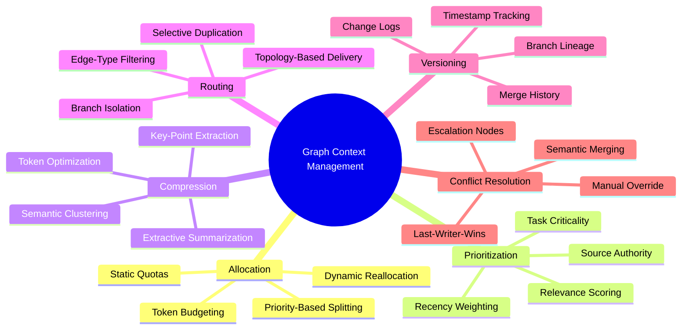
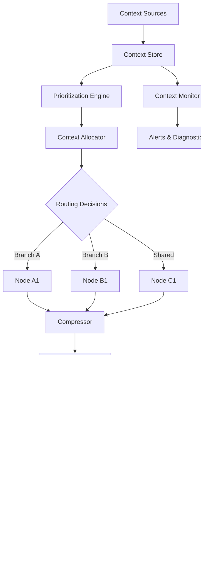
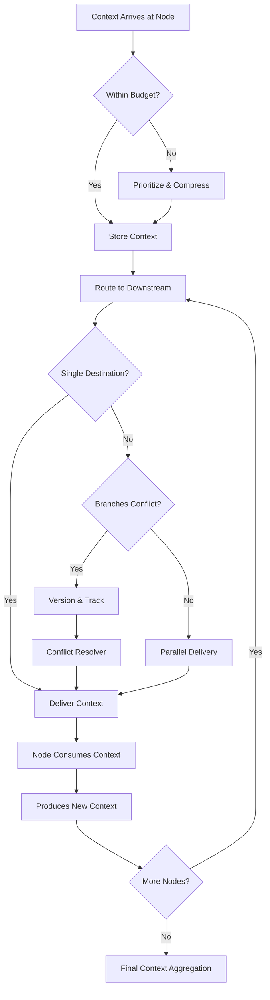
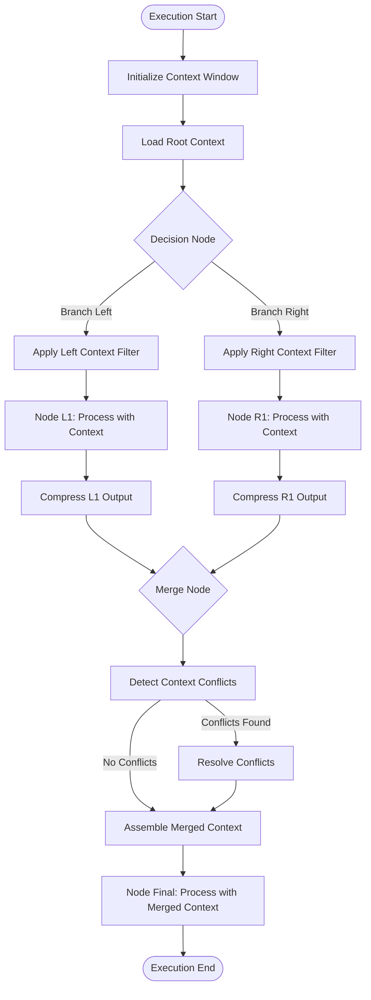
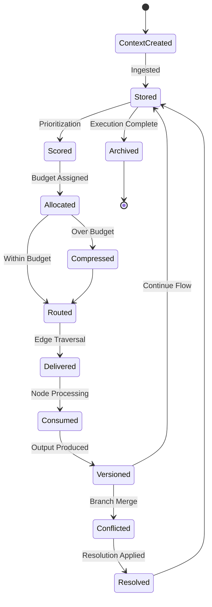
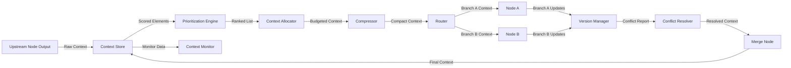
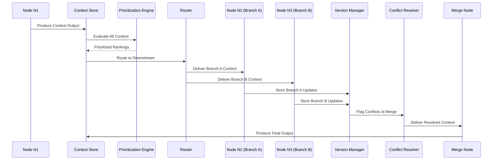

# Graph Context Management

## 📌 Overview

Graph Context Management is the systematic discipline of acquiring, distributing, prioritizing, compressing, and resolving context across the nodes and branches of a graph-based AI system. Context in a graph system encompasses the prompts, instructions, intermediate results, user preferences, environmental state, and domain knowledge that each node needs to perform its function correctly. As execution flows through a graph, context accumulates, transforms, and diverges across parallel branches, creating challenges that linear systems never face: a parallel branch may have a stale view of context that was updated on another branch, two branches may produce conflicting context updates that must be reconciled, and the total context volume may exceed the capacity of any individual node's processing window. Graph Context Management provides the frameworks and mechanisms to handle these challenges gracefully, ensuring that every node receives the right context, in the right format, at the right time, while keeping the overall context footprint within manageable bounds. It is the connective tissue that allows graph-based systems to maintain coherence, consistency, and accuracy across complex, multi-branch execution topologies.

## 🎯 Learning Objectives

By studying Graph Context Management, you will understand how context flows through graph systems and why managing it is fundamentally different from managing context in linear or single-node architectures. You will learn how to allocate context windows across nodes, deciding how much of the available context budget each node receives based on its role, priority, and the complexity of its task. You will master context prioritization strategies that rank competing context elements when the total available context is insufficient to include everything, ensuring the most critical information is always preserved. You will explore context compression techniques that reduce the volume of context without losing essential meaning, enabling nodes to operate effectively even when upstream branches have generated large volumes of intermediate data. You will understand context routing, the process of directing relevant context to the nodes that need it while filtering out noise and irrelevance. You will learn context versioning approaches that track how context evolves across branches and merge points, enabling accurate conflict resolution when parallel branches produce divergent views. Finally, you will gain proficiency in context conflict resolution, the process of reconciling inconsistent or contradictory context that arises when parallel execution branches update shared state independently.

## 🧠 Definition

Graph Context Management refers to the architectures, policies, and mechanisms that govern how information context is created, propagated, transformed, and reconciled across the nodes and edges of a graph-based AI system. It encompasses **context window allocation**, the strategy for dividing available context capacity among competing nodes and branches. It includes **context prioritization**, the systematic evaluation and ranking of context elements based on relevance, recency, source authority, and task criticality. It covers **context compression**, the reduction of context volume through summarization, abstraction, tokenization optimization, or selective omission while preserving information essential for downstream processing. It addresses **context routing**, the targeted delivery of specific context elements to specific nodes based on the node's declared requirements and the current execution state. It includes **context versioning**, the tracking of context lineage and modification history across branches, enabling the system to understand how context diverged and what the authoritative version should be at merge points. It encompasses **context conflict resolution**, the detection and reconciliation of inconsistencies that arise when parallel branches modify or produce contradictory context, using strategies like last-writer-wins, semantic merging, or escalation to higher-level resolution nodes.

## ❓ Why It Matters

Context management matters because context is the fuel that powers every node in an AI graph, and mismanaging it leads directly to incorrect outputs, wasted computation, and incoherent behavior. In a linear chain, context naturally flows forward and any errors are contained within the single execution path. In a graph, context flows along multiple paths simultaneously, and a context error on one branch can silently corrupt results on another branch after a merge, with no obvious signal that anything went wrong. Without proper context prioritization, a node processing a critical decision may receive irrelevant context that crowds out the information it actually needs, leading to poor decisions despite having access to all the necessary data. Without compression, context grows unboundedly as it passes through successive nodes, eventually exceeding model context windows and causing truncation that silently drops important information. Without conflict resolution, two parallel branches that independently update a shared user preference may produce contradictory states, and the node that consumes the merged result has no way to determine which version is correct. Graph Context Management is what makes graph-based systems reliable, coherent, and capable of handling the real-world complexity of multi-path execution.

## 🏛️ Core Concepts

The core concepts of Graph Context Management revolve around treating context as a first-class, structured, and governed resource that flows through the graph like a carefully managed fluid. **Context Window Allocation** divides the available context capacity, typically measured in tokens, among nodes based on a combination of static budgeting (pre-assigned quotas) and dynamic reallocation (adjusting budgets based on actual need during execution). **Context Prioritization** applies scoring algorithms to every piece of context, evaluating factors like direct relevance to the current node's task, temporal recency, source reliability, and whether the context is essential versus supplementary. **Context Compression** uses techniques like extractive summarization, key-point extraction, semantic clustering, and token-efficient encoding to reduce context volume while maximizing information density. **Context Routing** uses the graph topology itself as a routing table, leveraging edge types and node metadata to direct context along the correct paths, ensuring that sensitive or specialized context reaches only the nodes authorized and equipped to handle it. **Context Versioning** attaches timestamps, branch identifiers, and change logs to context elements, creating a traceable history that enables accurate merging and rollback at convergence points. **Context Conflict Resolution** detects when parallel branches produce incompatible context updates and applies configurable strategies to produce a consistent merged state, ranging from simple overwrites to sophisticated semantic reconciliation that considers the intent behind each update.

## 🧩 Key Components

The key components of a Graph Context Management system include the **Context Allocator**, which manages the distribution of context window budgets across active nodes, dynamically adjusting allocations as execution progresses and priorities shift. The **Context Store** is a structured repository that holds all context elements with their associated metadata, including priority scores, timestamps, source node identifiers, compression status, and version lineage. The **Prioritization Engine** evaluates context elements against configurable scoring criteria, producing ranked lists that determine which elements are included when space is limited. The **Compressor** applies lossy or lossless compression techniques to context, using extractive summarization for verbose text, key-value extraction for structured data, and semantic embedding-based clustering for large knowledge sets. The **Router** examines the graph topology and node requirements to direct context elements along appropriate edges, filtering out elements that are irrelevant to downstream consumers and duplicating elements that are needed by multiple branches. The **Version Manager** tracks context lineage across branches, maintaining a directed acyclic graph of context modifications that enables precise reconstruction of context state at any point in execution history. The **Conflict Resolver** detects inconsistencies at merge points and applies configured resolution strategies, which may include automatic heuristics, configurable rules, or escalation to dedicated resolution nodes that use LLM-based reasoning for complex conflicts. The **Context Monitor** provides observability into context flow, highlighting bottlenecks where context is being truncated, conflicts that are occurring, or branches where context quality is degrading.

## 🧭 Mental Model

Think of Graph Context Management like editing a large document with multiple contributing authors working simultaneously on different sections. Each author is a node that needs the right context, such as the document outline, the latest changes from other authors, and their own section's content. The editor-in-chief acts as the context manager, allocating page budgets to each author (context window allocation), deciding which editorial notes are most important when space is tight (prioritization), and asking authors to summarize their verbose drafts (compression). When two authors independently revise the same paragraph differently, the editor must reconcile the conflict (conflict resolution). The editor tracks all changes with version history (versioning) and routes relevant feedback to the appropriate authors (routing). Without this management, authors would overwrite each other's work, miss critical context from other sections, and produce an incoherent document. Similarly, in a graph system, context management ensures that every node contributes to a coherent whole despite working on different parts of the problem in parallel.

## 🗺️ Mind Map

## 🏗️ Architecture Diagram

## 🔄 Workflow

## ⚙️ Internal Working

The internal workings of a Graph Context Management system operate through a multi-stage pipeline that processes context at every node transition. When a node completes execution and produces output, that output becomes new context that must be managed. The system first evaluates the new context against the current allocation budget for downstream nodes, determining whether it fits within the reserved token window. If it exceeds the budget, the Prioritization Engine scores all context elements, both new and existing, and the Compressor reduces lower-priority elements through summarization or abstraction until the total fits within the allocation. The Router then examines the graph topology to determine which downstream nodes should receive which context elements, using edge types and node profiles to make targeted delivery decisions. For nodes on parallel branches, the system applies versioning to track which branch produced which context updates, attaching branch identifiers and timestamps to every modification. When parallel branches converge at a merge node, the Version Manager compares the context lineage from each branch and flags any elements that were modified differently on different branches. The Conflict Resolver then evaluates each conflict using the configured resolution strategy, which might select the most recent version, merge the semantic content of both versions, or escalate to a dedicated resolution node for LLM-based adjudication. The resolved context is then assembled into the final context package for the merge node, and the cycle continues downstream.

## 🔀 Execution Flow

## 📊 Lifecycle

## 📡 Data Flow

## 🤝 Interaction Flow

## 🌍 Real-World Analogy

Consider a large newsroom covering a breaking story with multiple journalists reporting from different locations. Each journalist gathers information (context) specific to their beat, and the managing editor must ensure that each reporter's article reflects not just their local observations but also the relevant information gathered by other reporters. The editor allocates limited column space (context window) to each reporter, prioritizing the most newsworthy facts when space runs short. Reporters on different beats may independently update the same fact, such as the number of casualties, creating a conflict that the editor must resolve by checking timestamps and source reliability (conflict resolution). The editor tracks all changes with timestamps and bylines (versioning), ensuring that when the final comprehensive article is assembled, it reflects the most accurate and complete picture possible. A reporter covering the economic impact may not need the detailed medical reports from the health correspondent (routing), keeping each article focused while the overall coverage remains coherent and comprehensive.

## 💡 Practical Example

Imagine a multi-agent legal analysis system that processes a complex contract. The system decomposes the contract into parallel analysis branches: one branch analyzes financial terms, another examines liability clauses, and a third reviews compliance requirements. Each branch needs different subsets of the full contract context, and each produces specialized analysis outputs. The financial branch discovers an ambiguous payment term and updates its interpretation, while the liability branch independently reaches a different interpretation of the same clause. When the branches merge at a synthesis node, the context management system detects the conflicting interpretations using version tracking, routes the conflict to a resolution node that applies semantic analysis to determine the stronger interpretation, and delivers the resolved context to the synthesis node along with compressed summaries from all branches. Without context management, the synthesis node would either receive an overwhelming volume of raw analysis, lose critical information to truncation, or silently incorporate contradictory interpretations into its final output.

## 🧪 Use Cases

Graph Context Management is critical in multi-agent AI systems where different specialized agents process different aspects of a problem in parallel and their results must be merged into a coherent output. It powers complex research workflows where initial broad searches generate massive context that must be filtered, compressed, and routed to specialized analysis nodes without overwhelming their processing capacity. In customer service graphs, context management ensures that the conversation history, customer profile, and relevant knowledge base articles are appropriately distributed across diagnostic, resolution, and follow-up nodes. Collaborative document editing systems with AI assistance use context management to track contributions from multiple users and AI suggestions, resolving conflicts when edits overlap. Autonomous vehicle decision systems apply context management to merge sensor data from multiple sources, prioritizing the most relevant and recent information for each decision node while maintaining a shared situational awareness model across parallel processing streams.

## ⚖️ Comparison

Graph Context Management differs from standard LLM context management in fundamental ways. Single-model context management deals with one context window and one set of priorities, while graph context management must coordinate multiple windows across nodes, handle branching and merging, and resolve conflicts that simply cannot arise in a single context. RAG (Retrieval-Augmented Generation) systems manage context retrieval but typically in a single-threaded pipeline without parallel branches or version conflicts. Conversation memory systems manage context over time but not across simultaneous execution paths. Vector database retrieval manages information storage and similarity-based retrieval but lacks the structured routing, prioritization, and conflict resolution that graph context requires. Traditional message-passing systems in distributed computing route data between processes but do not handle the semantic nuances of context compression, prioritization, or version-aware merging that AI graph systems demand. Graph Context Management is uniquely positioned at the intersection of information retrieval, distributed state management, and AI prompt engineering, addressing challenges that none of these fields solve in isolation.

## ✅ Best Practices

Design context schemas early, defining clear types, priorities, and versioning rules for every category of context that flows through your graph, rather than treating all context as undifferentiated text. Implement explicit context budgets at every node, preventing unbounded context growth and making context limits visible and configurable rather than implicit and surprising. Use progressive compression, applying light compression early in the pipeline when context is abundant and aggressive compression only when approaching hard limits, to preserve maximum information density. Route context based on semantic relevance, not just graph topology, ensuring that nodes receive context because it is genuinely useful to their task, not merely because they happen to be downstream. Version all context modifications, even when parallel execution seems unlikely, because future graph modifications may introduce branches that conflict with assumptions baked into unversioned context. Test conflict resolution under realistic scenarios where parallel branches genuinely disagree, verifying that the resolution strategy produces sensible results rather than arbitrarily selecting one branch's version over another. Monitor context quality metrics, such as information density and compression ratio, alongside resource metrics like token utilization, catching situations where context is technically within budget but semantically degraded.

## ❌ Common Mistakes

A common mistake is treating context as a simple string concatenation, passing the full output of every upstream node to every downstream node without filtering, routing, or compression, which quickly exhausts context windows and drowns relevant information in noise. Another frequent error is resolving conflicts with a simple last-writer-wins strategy that silently discards the first branch's updates, which may contain critical information that the second branch never considered. Failing to version context leads to merge-time confusion where the system cannot determine which updates are authoritative, especially when branches have different latencies and complete in non-deterministic order. Over-compressing context, particularly early in the pipeline, can destroy nuances and details that later nodes need, making the compression strategy penny-wise and pound-foolish. Ignoring context staleness on long-running branches means that a branch that started early but is slow to complete may be operating on outdated context that has been superseded by faster branches, leading to inconsistent final results. Neglecting to define context schemas results in loosely structured context that cannot be efficiently prioritized, compressed, or compared during conflict resolution, forcing the system to treat all context equally regardless of its actual importance.

## 🚀 Advanced Topics

Advanced Graph Context Management includes semantic context routing that uses embedding similarity to match context elements to nodes, going beyond static rules to dynamically determine relevance based on the current state of each node's processing. Adaptive compression learns the optimal compression strategy for each context type through reinforcement learning, discovering that certain types of information compress better with extraction while others benefit from abstraction. Context inheritance graphs model the full provenance of every context element, enabling sophisticated queries like "which upstream decision caused this context element to be included" or "what would change if this branch had taken a different path." Conflict-free replicated data types (CRDTs) adapted for AI context provide mathematical guarantees that parallel context updates can be merged without conflicts, even when network partitions prevent real-time coordination. Real-time context quality monitoring uses LLM-based evaluators to continuously assess whether the context being delivered to each node is sufficient, relevant, and accurate, catching degradation before it propagates to outputs. Cross-graph context sharing extends context management beyond a single workflow graph, enabling context from previous executions, related workflows, or shared organizational knowledge to be incorporated into current graph execution with appropriate scoping and isolation.
