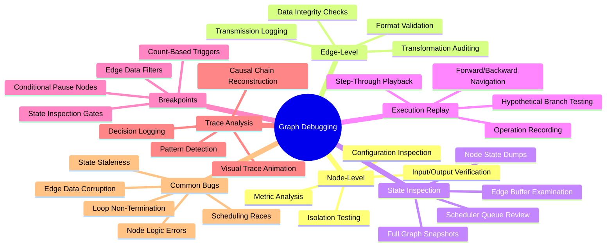
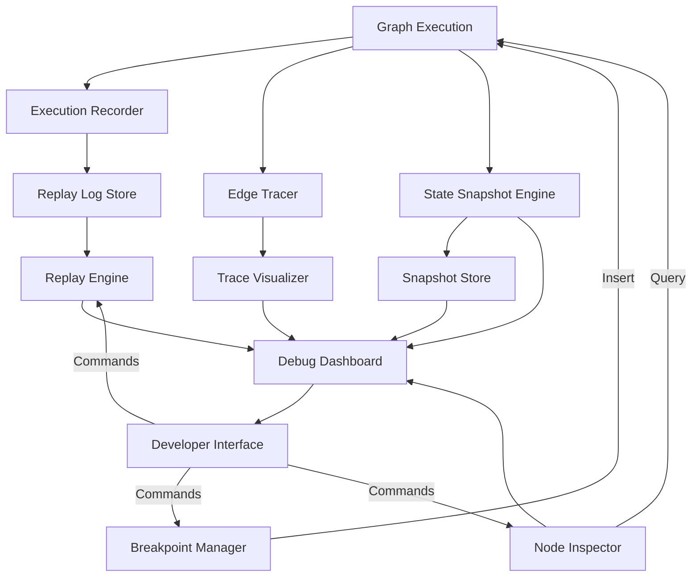
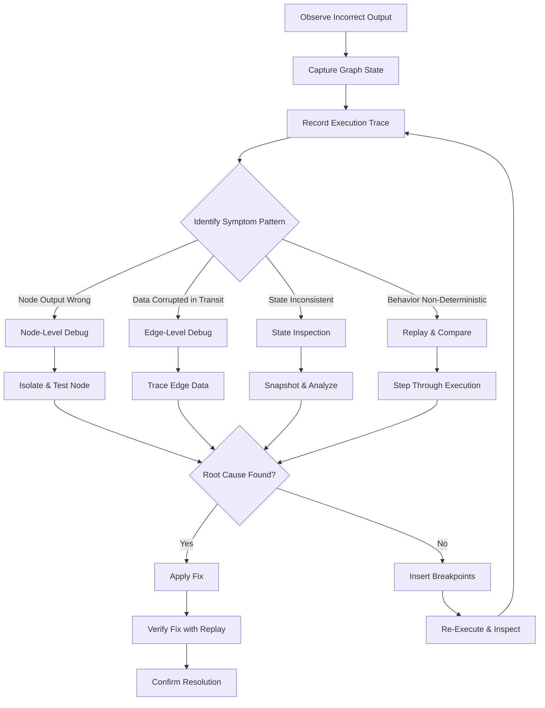
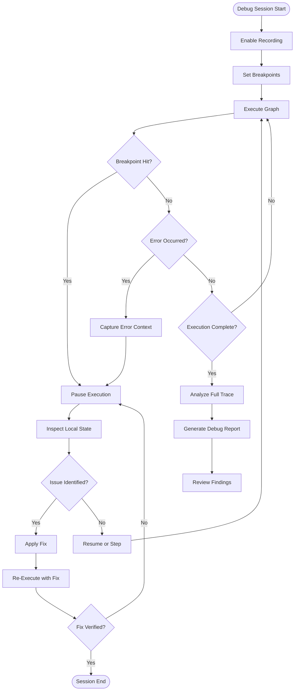
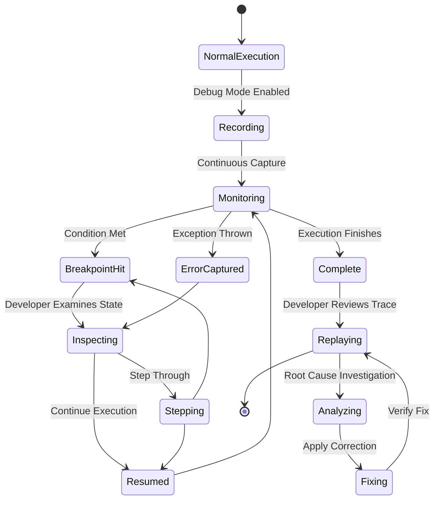
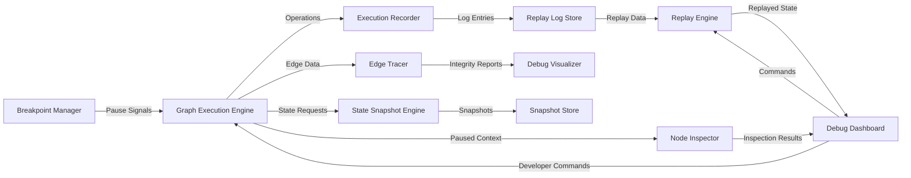
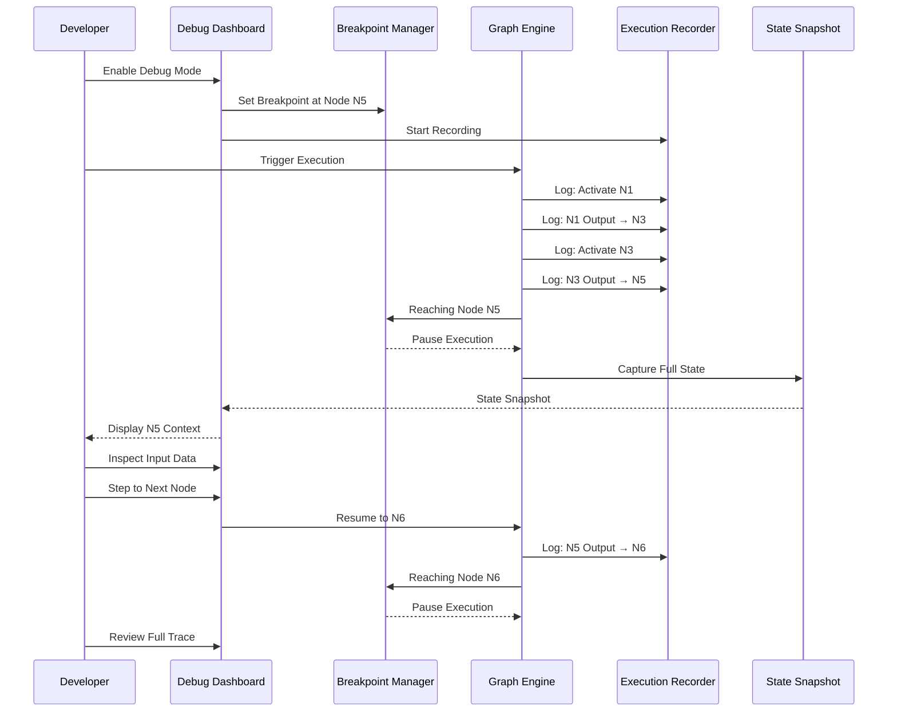

# Graph Debugging

## 📌 Overview

Graph Debugging is the systematic practice of identifying, isolating, diagnosing, and resolving defects within graph-based AI systems, where errors may originate from individual nodes, the connections between nodes, the state that flows through the graph, or the emergent behavior of the graph as a whole. Unlike debugging linear programs where execution follows a single predictable path, graph systems introduce parallel branches, conditional routing, loops, and dynamic topology changes that create multiple simultaneous execution contexts and make it difficult to trace the origin of a problem. A faulty output at a terminal node could be caused by a bug in any upstream node, an edge that corrupted data during transmission, state that was incorrectly merged at a convergence point, or a scheduling decision that caused nodes to execute in an unexpected order. Graph Debugging provides the tools, techniques, and mental frameworks to navigate this complexity, enabling developers and operators to quickly pinpoint the root cause of issues and verify that fixes are effective without disrupting the overall system behavior.

## 🎯 Learning Objectives

By studying Graph Debugging, you will understand how to debug at every level of a graph system, from individual node behavior to edge data integrity to global graph execution correctness. You will learn node-level debugging techniques that isolate a single node from its graph context, feeding it controlled inputs and verifying its outputs independently of the surrounding workflow. You will master edge-level debugging that traces data as it flows between nodes, detecting corruption, type mismatches, and unexpected transformations during transmission. You will understand state inspection methods that capture and examine the full execution state of the graph at any point in time, including the state of all nodes, all in-flight data on edges, and all pending activations in the scheduler queue. You will explore execution replay systems that record every operation during graph execution and allow developers to step through the execution forward and backward to understand exactly what happened. You will learn how to implement breakpoint nodes that pause execution at critical junctures for manual inspection, and debug tracing frameworks that produce detailed logs of every decision the graph runtime makes.

## 🧠 Definition

Graph Debugging refers to the collection of methodologies, tools, and techniques used to identify and resolve defects in graph-based AI and workflow systems. It encompasses **node-level debugging**, the isolation and testing of individual nodes with controlled inputs to verify that each node correctly implements its specified behavior. It includes **edge-level debugging**, the inspection and validation of data flowing between nodes, ensuring that edges correctly transmit, transform, and preserve the information they carry. It covers **state inspection**, the ability to capture and examine the complete execution state of the graph at any moment, including node-local state, edge payloads, and system-level metadata. It addresses **execution replay**, the recording and faithful reproduction of graph executions, enabling developers to replay a past execution step by step to understand the sequence of events that led to an observed outcome. It includes **breakpoint nodes**, specialized nodes that can be injected into a graph to pause execution at designated points, allowing manual inspection of intermediate state and controlled resumption. It encompasses **debug tracing**, the generation of detailed execution logs that capture every decision, state transition, and data movement within the graph, providing the forensic evidence needed to diagnose complex, multi-node failures. Finally, it covers the systematic classification of common graph bugs and their symptoms, enabling faster diagnosis through pattern recognition.

## ❓ Why It Matters

Debugging matters in graph systems because the graph structure itself creates categories of bugs that do not exist in simpler architectures, and these bugs can be extraordinarily difficult to diagnose with traditional debugging tools. A node that produces correct outputs in isolation may fail when embedded in a graph because it receives unexpected input formats from an upstream node that was modified. An edge that works correctly for small payloads may silently truncate or corrupt large ones. A merge node that correctly combines results from two branches may produce incorrect output when the branches execute in a different order due to non-deterministic scheduling. A loop that should converge may oscillate indefinitely because the termination condition checks stale state. Without graph-specific debugging tools, developers are forced to add print statements to individual nodes and manually correlate timestamps across log files, an approach that breaks down as soon as the graph has more than a handful of nodes or executes branches in parallel. Graph Debugging transforms this ad-hoc process into a systematic discipline with dedicated tools that understand graph topology, can trace data flow across branches, and can replay entire executions for forensic analysis, reducing diagnosis time from hours or days to minutes.

## 🏛️ Core Concepts

The core concepts of Graph Debugging center around leveraging the graph structure itself as a debugging aid, using topology, data flow, and execution history as diagnostic instruments. **Node-Level Debugging** treats each node as an independent unit, enabling developers to execute it in isolation with mocked inputs and expected outputs, verifying that the node's internal logic is correct before considering its interactions with the graph. **Edge-Level Debugging** focuses on the connections between nodes, verifying that data is correctly serialized, transmitted, deserialized, and transformed as it flows along edges, catching format mismatches, encoding errors, and data loss that are invisible when examining nodes in isolation. **State Inspection** provides a snapshot of the entire graph's execution state at a given moment, including the inputs and outputs of every node, the contents of every edge buffer, and the status of every pending operation, giving developers a complete picture of what the system is doing at any point. **Execution Replay** records every operation during a graph run and allows developers to step through the recording, examining state at any point and even branching the replay to test hypothetical fixes without affecting the original execution. **Breakpoint Nodes** are special nodes that can be inserted into any graph at any position, pausing execution when reached and exposing the local execution context for inspection, analogous to breakpoints in traditional debugging but adapted for graph topologies. **Debug Tracing** produces comprehensive execution logs that capture not just what happened but why, recording the decisions that led to each node activation, edge traversal, and state mutation, providing the causal chain needed to understand complex bugs.

## 🧩 Key Components

The key components of a Graph Debugging toolkit include the **Node Inspector**, which allows developers to select any node in the graph and examine its current state, input history, output history, configuration, and execution metrics, providing a comprehensive view of node behavior without requiring code changes. The **Edge Tracer** monitors data flowing along edges, recording the full payload at transmission and reception points and flagging any discrepancies such as data loss, format changes, or unexpected transformations that occur during transit. The **State Snapshot Engine** captures the complete execution state of the graph at any moment, serializing it to a portable format that can be loaded into analysis tools, shared with team members, or used as the starting point for a replay session. The **Execution Recorder** logs every graph operation with millisecond timestamps, creating a deterministic replay log that captures node activations, input/output pairs, edge transmissions, scheduling decisions, and error events. The **Replay Engine** loads recorded executions and allows developers to step forward and backward through the execution, set conditional breakpoints, inspect state at any step, and compare the replay against the original execution to verify consistency. The **Breakpoint Manager** allows developers to insert, configure, and manage breakpoint nodes within the graph, supporting conditions based on node state, edge data, execution count, or custom predicates. The **Trace Visualizer** renders debug traces as interactive graph animations, showing the flow of data and control through the graph over time, making complex multi-branch execution patterns visually comprehensible.

## 🧭 Mental Model

Think of Graph Debugging like investigating a complex supply chain problem in a global manufacturing network. Each factory is a node, each shipping route is an edge, and a customer receiving a defective product is like a terminal node producing incorrect output. The investigator must determine which factory produced the defect, whether it was introduced during manufacturing (node bug) or during shipping (edge bug), whether the defect resulted from a single factory's error or from the interaction between multiple factories processing components in the wrong order (scheduling bug), or whether the defect was caused by stale specifications being used after an update failed to propagate through the network (state propagation bug). The investigator examines factory records (node inspection), checks shipping manifests at every transit point (edge tracing), reviews the full network status at the time of the defect (state snapshot), and reconstructs the entire supply chain journey of the affected product (execution replay). Breakpoints are like quality checkpoints at key transit hubs where inspectors can pause shipments for detailed examination before allowing them to proceed.

## 🗺️ Mind Map

## 🏗️ Architecture Diagram

## 🔄 Workflow

## ⚙️ Internal Working

The internal workings of a Graph Debugging system operate through several coordinated layers that work together to provide comprehensive diagnostic capabilities. The Execution Recorder runs alongside the graph execution engine, intercepting every operation such as node activations, input deliveries, output productions, edge transmissions, scheduling decisions, and error events, and writing each to a timestamped, immutable log. The Edge Tracer hooks into the data transmission layer, capturing full payloads at both the sending and receiving ends of every edge, computing checksums and comparing formats to detect any corruption or transformation that occurs during transit. The State Snapshot Engine can be triggered manually at any time or configured to capture automatically at key events, serializing the complete graph state into a structured format that preserves node states, edge buffers, scheduler queues, and system metadata. The Replay Engine loads recorded logs and reconstructs the execution step by step, maintaining a virtual copy of the graph state at each step, allowing developers to pause at any point and inspect the exact state as it existed at that moment. The Breakpoint Manager maintains a registry of active breakpoints, each associated with a specific position in the graph and a condition predicate, intercepting execution when a breakpoint is reached and exposing the local context through the developer interface. The Trace Visualizer consumes recorded traces and renders them as animated graph diagrams, using color coding and flow indicators to show how data and control moved through the graph over time.

## 🔀 Execution Flow

## 📊 Lifecycle

## 📡 Data Flow

## 🤝 Interaction Flow

## 🌍 Real-World Analogy

Consider debugging a complex air traffic control system where aircraft follow routing paths through a network of airports and waypoints. Each aircraft is like a data packet flowing through the graph, and each airport or waypoint is a node that processes arrivals and departures. When a flight arrives at its destination with an incorrect cargo manifest, investigators must determine whether the error was introduced at the origin airport (node bug), during a transfer at a connecting airport (edge bug), or because two parallel logistics chains updated the manifest simultaneously (conflict bug). The investigation involves reviewing flight logs (execution replay), checking cargo handling records at each transit point (edge tracing), and examining the full system state at the time of the error (state snapshot). Breakpoints are like holding flights at a waypoint for customs inspection before allowing them to proceed. The entire debugging process is about reconstructing the journey of data through a complex network to find exactly where and why things went wrong.

## 💡 Practical Example

Imagine debugging a multi-agent content generation graph that produces inconsistent output quality. The graph includes a research node, a drafting node, an editing node, and a review node connected in sequence, with an optional loop back from the review node to the drafting node when quality is insufficient. Using Graph Debugging, the developer first examines the trace from a low-quality output run, noticing that the review node's quality score was acceptable even though the final output was poor. Stepping backward through the replay, the developer discovers that the editing node received input from the drafting node but the context passed along the edge was truncated due to an edge buffer size limit that was silently dropping content after a certain token count. The edge tracer confirms the truncation by comparing the payload checksums at the sending and receiving ends. The developer then tests a fix by increasing the edge buffer limit, inserting a breakpoint at the editing node to verify that it now receives the full draft, and replaying the execution to confirm that the quality issue is resolved without introducing any regressions in other parts of the graph.

## 🧪 Use Cases

Graph Debugging is essential for diagnosing quality degradation in production AI agent systems where occasional bad outputs must be traced back to their root cause among potentially hundreds of nodes. It powers the development of complex multi-agent workflows where new nodes are frequently added and existing connections are modified, requiring systematic verification that changes do not introduce subtle regressions. In scientific computing pipelines modeled as graphs, debugging helps identify numerical precision errors that accumulate across processing stages, tracing the exact point where precision loss crosses acceptable thresholds. Customer-facing automation systems use graph debugging to investigate specific user-reported failures by replaying the exact execution that produced the failure, reproducing the issue in a controlled environment for analysis. Graph debugging is indispensable for optimizing graph execution performance, where trace analysis reveals bottlenecks, unnecessary node activations, and suboptimal scheduling decisions that are invisible when examining average system metrics.

## ⚖️ Comparison

Graph Debugging differs from traditional debugging in several fundamental respects. Standard debugging tools like breakpoints, step-through execution, and variable inspection operate on a single thread of execution with a linear call stack, while graph debugging must handle multiple simultaneous execution paths, non-linear data flow, and state that is distributed across many independent nodes. Logging and monitoring tools provide aggregate metrics and error reports but lack the fine-grained, topology-aware tracing needed to understand how data flows through a graph. Traditional unit testing verifies individual components in isolation but cannot detect bugs that emerge from the interaction between nodes, such as format mismatches, scheduling races, or state corruption at merge points. Distributed system debugging shares some similarities, particularly around tracing data flow across service boundaries, but graph debugging must additionally handle the dynamic topology changes, conditional branching, and iterative loops that are unique to graph-based systems. Compared to ad-hoc debugging with print statements and manual log correlation, systematic graph debugging provides dedicated tools that understand graph semantics, dramatically reducing the time and effort required to diagnose and fix defects.

## ✅ Best Practices

Implement comprehensive execution recording from the start, even during development, because reproducing bugs in complex graph systems is often far more difficult than fixing them once they are understood. Design every node with clear input and output schemas, making it trivially easy to validate that data flowing through the graph conforms to expectations at every edge boundary. Use deterministic execution modes during debugging that fix scheduling order and seed random number generators, eliminating non-determinism as a source of confusing variability between runs. Create a library of canonical test inputs that exercise every significant path through the graph, including edge cases that trigger error handling, loop termination, and conditional branching, enabling rapid regression testing after any change. Implement structured logging that includes node identifiers, edge identifiers, and correlation IDs in every log entry, making it possible to trace any event back to its position in the graph topology. Use the replay system as your primary verification tool, fixing a bug and then replaying the original failing execution to confirm that the fix produces the correct output, rather than relying solely on new test cases that may not cover the exact scenario that originally failed. Document common failure patterns and their root causes in a debugging playbook, enabling faster diagnosis when recurring symptoms appear in production.

## ❌ Common Mistakes

A pervasive mistake is debugging only at the node level, testing each node in isolation while ignoring the interactions between nodes, which misses the majority of bugs that emerge from graph topology rather than individual node logic. Another common error is relying solely on aggregate metrics like total execution time or final output quality, which cannot pinpoint where in the graph a problem originated. Failing to record execution traces in production means that when a rare or complex bug occurs, there is no forensic evidence available to reconstruct what happened, forcing developers to attempt reproduction from scratch. Over-instrumenting the graph with too many breakpoints or traces can slow execution to the point where timing-sensitive bugs disappear or behavior changes, creating a Heisenbug scenario. Neglecting to verify edge data integrity means that subtle corruption, truncation, or format transformation bugs go undetected until they cause downstream nodes to produce visibly incorrect outputs. Debugging by modifying the graph structure itself, such as removing branches or adding logging nodes, can alter the execution semantics enough to mask the original bug, leading to frustration when the bug cannot be reproduced.

## 🚀 Advanced Topics

Advanced Graph Debugging includes causal debugging that uses counterfactual analysis to determine whether a specific node's output was necessary for an observed failure, automatically identifying the root cause by systematically testing what would have happened if each node had behaved differently. Automated fault injection deliberately introduces errors at random nodes and edges to verify that the graph's error handling is correct, stress-testing the system's resilience to failures that might occur in production. Differential debugging compares two executions of the same graph that produce different outputs, automatically identifying the first point of divergence and the specific data or decision that caused the split, dramatically accelerating diagnosis of non-deterministic bugs. AI-assisted debugging uses language models to analyze execution traces, hypothesize root causes, and suggest fixes based on patterns observed in the trace data, augmenting human debugging expertise with automated analysis. Distributed graph debugging extends debugging capabilities across multiple machines, correlating traces from distributed node executions and providing a unified view of the entire graph's behavior even when individual nodes run on separate servers. Predictive debugging analyzes execution patterns in real time to predict failures before they occur, alerting operators to nodes that are trending toward error conditions based on early warning signals in the trace data.
