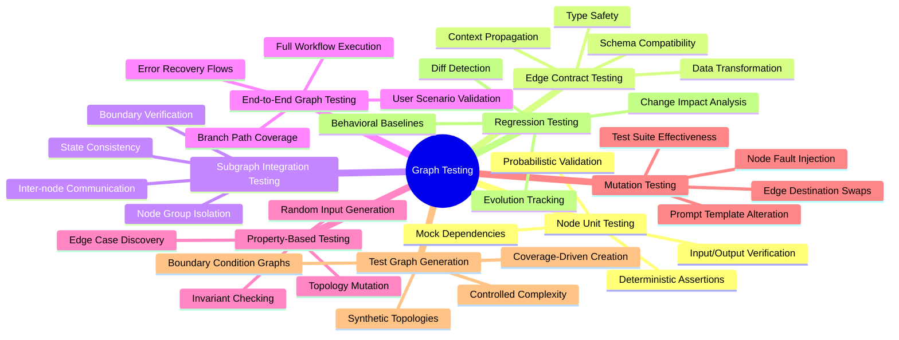
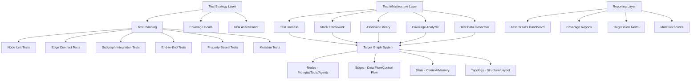
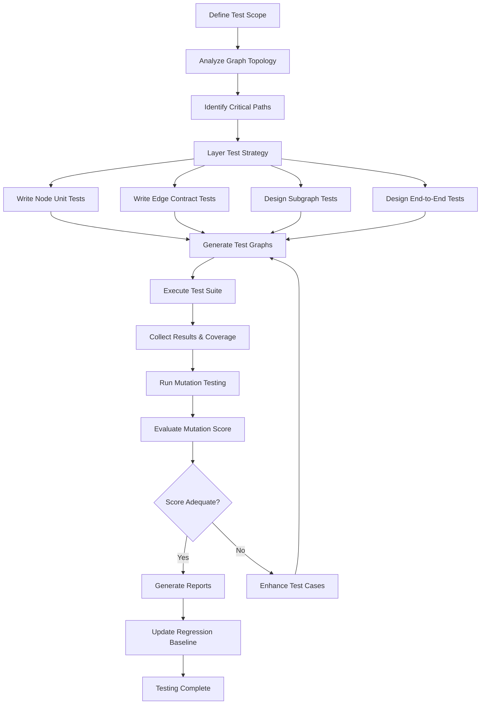
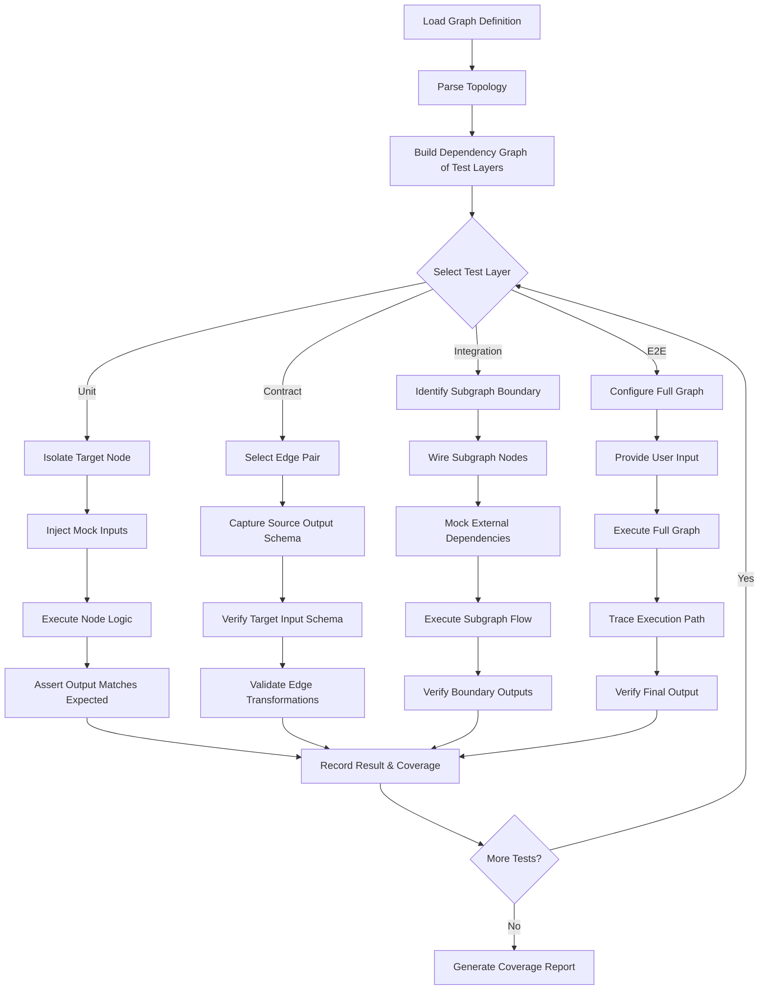
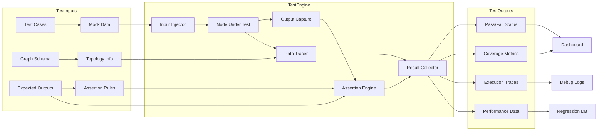
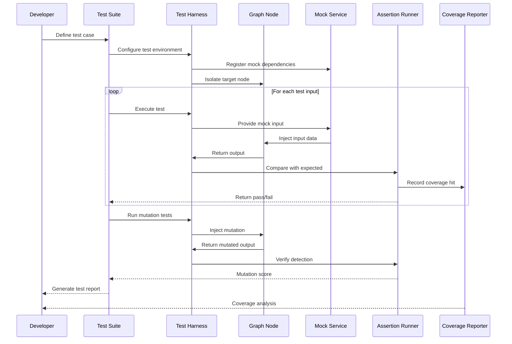

# Graph Testing: Validating Graph-Based AI Systems

## 📌 Overview

Graph testing represents a specialized discipline within AI system quality assurance that focuses on verifying the correctness, reliability, and robustness of interconnected graph-based architectures. Unlike traditional software testing, which treats components as isolated units, graph testing must account for the emergent behaviors that arise when nodes (individual AI capabilities, prompt handlers, tool integrations) and edges (data transformations, control flow transitions, context propagation channels) interact in complex, often non-linear topologies. The interconnected nature of graph-based AI systems means that a defect in a single node can cascade through multiple downstream paths, making comprehensive testing both critical and challenging. Graph testing strategies draw from established software engineering practices such as unit testing, integration testing, and end-to-end testing, but adapt them to the unique characteristics of graph structures. These characteristics include conditional branching based on LLM outputs, dynamic graph topologies that change at runtime, stateful context propagation across edges, and the inherent non-determinism of AI model responses. A well-designed graph testing strategy provides confidence that the system produces correct outputs across a wide range of inputs, maintains consistency as the graph evolves, and gracefully handles edge cases and failure modes. Organizations building production-grade agentic systems, workflow graphs, and multi-agent architectures increasingly recognize that ad-hoc testing approaches are insufficient for these complex topologies, driving demand for systematic, layered testing methodologies.

## 🎯 Learning Objectives

After studying this document, practitioners will be able to design and implement a comprehensive testing strategy for graph-based AI systems that covers every layer of the architecture. You will understand how to isolate individual nodes for unit testing, verifying that each prompt handler, tool invocation, or decision logic block produces expected outputs given controlled inputs. You will learn to perform edge contract testing, ensuring that the data schemas, transformations, and context propagation rules governing connections between nodes remain consistent and reliable. You will gain proficiency in subgraph integration testing, which validates that groups of related nodes work correctly together as cohesive units within the larger graph. You will master end-to-end graph testing techniques that exercise entire workflows from initial user input through final output, including all branching paths and error recovery flows. You will become familiar with property-based testing approaches that generate randomized graph inputs and topologies to discover edge cases that manual test design would miss. You will understand mutation testing techniques adapted for graph structures, which measure test suite effectiveness by introducing deliberate faults into nodes and edges. Finally, you will learn regression testing strategies that prevent graph evolution from introducing unintended behavioral changes as new nodes, edges, and paths are added over time.

## 🧠 Definition

Graph testing is the systematic process of verifying that a graph-based AI system—composed of interconnected nodes representing individual processing units (prompts, tools, agents, memory accesses) and edges representing data flow, control flow, and context propagation—behaves correctly across all expected operating conditions. It encompasses multiple testing layers, from the granular verification of individual node functions to the holistic validation of entire graph executions, each layer targeting different aspects of system correctness. At its core, graph testing treats the graph topology itself as a first-class testing concern, recognizing that the structure of connections between components is just as important as the components themselves. A graph-based AI system might include prompt nodes that invoke language models, tool nodes that execute external APIs, decision nodes that route execution based on model outputs, memory nodes that read and write persistent state, and aggregation nodes that combine results from multiple parallel branches. Each of these node types, along with the edges connecting them, introduces specific failure modes that must be addressed through targeted testing techniques. Graph testing also accounts for the dynamic nature of many AI graphs, where the execution path is determined at runtime by model outputs, user inputs, or external conditions, meaning that the same graph structure can produce vastly different execution traces depending on the input. This dynamic quality distinguishes graph testing from testing static software architectures and requires specialized approaches to achieve adequate coverage.

## ❓ Why It Matters

Testing graph-based AI systems matters profoundly because these systems are increasingly used in high-stakes domains where incorrect behavior can have significant consequences, including customer-facing assistants, autonomous decision-making pipelines, medical diagnostic workflows, and financial analysis systems. The non-deterministic nature of LLM outputs introduces variability that traditional software testing approaches are not designed to handle, making dedicated graph testing strategies essential for building trustworthy AI systems. When a graph contains dozens or hundreds of interconnected nodes, the combinatorial explosion of possible execution paths makes exhaustive manual testing impossible, necessitating automated, systematic testing approaches that can efficiently cover the graph's behavioral space. Graph-based systems are also inherently more difficult to debug than linear pipelines because errors can propagate through multiple indirect paths, making it critical to catch defects as early as possible in the testing pipeline before they manifest as subtle, hard-to-diagnose production issues. Furthermore, graph systems tend to evolve rapidly as new capabilities are added, existing nodes are refined, and edge conditions are modified, creating a constant risk of regression that can only be managed through comprehensive automated test suites. Organizations that invest in robust graph testing practices benefit from faster development cycles, higher confidence in deployments, reduced incident rates, and the ability to make architectural changes without fear of breaking existing functionality. Without systematic testing, graph-based AI systems become fragile, unmaintainable, and ultimately unreliable in production environments.

## 🏛️ Core Concepts

The foundational concepts of graph testing revolve around treating the graph structure as a multi-layered system where each layer requires distinct testing approaches and coverage metrics. The first concept is node-centric testing, which focuses on verifying individual processing units in isolation, ensuring that each node correctly transforms its inputs into expected outputs regardless of its position within the larger graph. The second concept is edge-centric testing, which validates the contracts between connected nodes, including data schema compatibility, transformation correctness, and context propagation fidelity. The third concept is path-centric testing, which examines complete execution paths through the graph, from entry nodes through intermediate processing to terminal nodes, ensuring that each possible route produces correct results. The fourth concept is topology testing, which verifies that the graph structure itself satisfies certain properties, such as reachability (all nodes are accessible from entry points), acyclicity where required, and proper handling of parallel and conditional branches. The fifth concept is behavioral testing, which focuses on the observable behavior of the graph as a whole, treating it as a black box and verifying that it produces correct outputs for a representative set of inputs. These concepts are not mutually exclusive but rather complementary, and a comprehensive graph testing strategy draws from all five to achieve the coverage and confidence needed for production deployment. Understanding these core concepts allows testing teams to design targeted test suites that efficiently cover the most critical aspects of graph behavior while maintaining manageable test execution times.

## 🧩 Key Components

The key components of a graph testing framework include the test harness, which provides the infrastructure for executing tests against graph nodes and entire graph structures in controlled environments. The node test runner is responsible for isolating individual nodes, injecting mock inputs, capturing outputs, and comparing them against expected results, supporting both deterministic and probabilistic assertion strategies for AI components. The edge contract verifier validates that data flowing between connected nodes conforms to expected schemas, types, and constraints, catching incompatibilities that would cause runtime failures during actual graph execution. The subgraph test orchestrator assembles groups of related nodes into isolated test environments, executing them together to verify that inter-node interactions produce correct collective behavior. The end-to-end test driver exercises complete graph workflows from initial input to final output, following all branching paths and verifying results at each decision point. The test graph generator creates synthetic graph structures with controlled properties, enabling property-based testing that explores edge cases through randomized topology generation. The mutation testing engine systematically introduces faults into nodes and edges—such as altering prompt templates, swapping edge destinations, or modifying transformation logic—to measure the effectiveness of the test suite in detecting real defects. The regression test manager maintains a historical repository of graph configurations and their associated test results, enabling teams to detect behavioral changes as the graph evolves. The coverage analyzer computes metrics indicating what percentage of nodes, edges, and execution paths are exercised by the current test suite, guiding further test development.

## 🧭 Mental Model

Think of graph testing like quality control in a manufacturing assembly line where each station (node) performs a specific operation on a product (data/context) as it moves along conveyor belts (edges) between stations. Just as a quality inspector would check that each station correctly performs its operation, that the handoff between stations preserves the product's integrity, and that the entire assembly line produces a finished product meeting specifications, graph testing verifies correctness at every level of the system. The assembly line metaphor extends further when you consider that some stations may perform quality checks and route defective products to rework loops (error handling edges), that parallel stations may work on the product simultaneously (parallel branches), and that the routing of products through the line may depend on the product's current state (conditional edges based on LLM outputs). Another useful mental model is that of a city's road network, where intersections represent nodes, roads represent edges, and testing involves verifying that travelers can reach their destinations via correct routes, that traffic signals coordinate properly at intersections, and that the road network handles congestion (load) gracefully. Both metaphors emphasize that testing must operate at multiple levels—individual components, pairwise connections, and the system as a whole—to achieve comprehensive quality assurance. The key insight is that even if every individual component works perfectly in isolation, the system can still fail due to incorrect interactions between components, making integration and end-to-end testing just as important as unit testing.

## 🗺️ Mind Map

## 🏗️ Architecture Diagram

## 🔄 Workflow

## ⚙️ Internal Working

The internal working of a graph testing system begins with topology analysis, where the testing framework parses the graph definition to identify all nodes, edges, entry points, exit points, and possible execution paths. This analysis produces a structural map that guides test coverage planning by revealing which nodes have the most incoming edges (high fan-in, indicating critical integration points), which nodes have the most outgoing edges (high fan-out, indicating complex routing logic), and which paths are longest (indicating the most complex end-to-end flows). Once the topology is understood, the framework generates a test plan that allocates testing effort across the different testing layers based on risk and criticality. Node unit tests are executed first, with each node isolated from its neighbors by replacing real edge connections with mock inputs and outputs, allowing the test framework to verify the node's internal logic without the complexity of the surrounding graph. Edge contract tests follow, verifying that the data produced by source nodes matches the schema expectations of destination nodes, and that any transformations applied along the edge preserve data integrity. Subgraph integration tests then assemble small groups of related nodes, typically following a bottom-up approach that starts with leaf nodes and progressively adds upstream dependencies until entire subsystems are validated. End-to-end tests exercise the complete graph by providing inputs at entry nodes and verifying outputs at terminal nodes, tracing the execution path to ensure the correct branches were taken. Property-based testing runs concurrently, generating thousands of randomized inputs and graph configurations to discover edge cases that manually designed tests might miss. Finally, mutation testing introduces controlled faults to measure how effectively the test suite detects real defects, providing a quantitative score that guides further test development.

## 🔀 Execution Flow

## 📊 Lifecycle

```mermaid
stateDiagram-v2
    [*] --> Planning: Test Strategy Defined
    
    Planning --> Designing: Scope Identified
    
    state Designing {
        [*] --> UnitDesign
        UnitDesign --> ContractDesign
        ContractDesign --> IntegrationDesign
        IntegrationDesign --> E2EDesign
        E2EDesign --> [*]
    }
    
    Designing --> Implementing: Test Cases Written
    
    state Implementing {
        [*] --> WriteUnitTests
        WriteUnitTests --> WriteContractTests
        WriteContractTests --> WriteIntegrationTests
        WriteIntegrationTests --> WriteE2ETests
        WriteE2ETests --> [*]
    }
    
    Implementing --> Executing: Test Suite Ready
    
    state Executing {
        [*] --> RunUnitTests
        RunUnitTests --> RunContractTests
        RunContractTests --> RunIntegrationTests
        RunIntegrationTests --> RunE2ETests
        RunE2ETests --> RunMutationTests
        RunMutationTests --> [*]
    }
    
    Executing --> Analyzing: Results Collected
    
    state Analyzing {
        [*] --> CheckCoverage
        CheckCoverage --> EvaluateMutations
        EvaluateMutations --> IdentifyGaps
        IdentifyGaps --> [*]
    }
    
    Analyzing --> Reporting: Analysis Complete
    Reporting --> Baseline: Baseline Captured
    Baseline --> Evolving: Graph Changes Detected
    Evolving --> Designing: Regression Cycle
    
    Reporting --> [*]: Stable System
```

## 📡 Data Flow

## 🤝 Interaction Flow

## 🌍 Real-World Analogy

Consider a restaurant kitchen operating as a graph-based system, where each cooking station is a node, the paths between stations are edges, and the complete dining experience is the end-to-end workflow. Node unit testing is like a quality check at the prep station, verifying that the chef correctly chops vegetables every time regardless of what dish they will be used in. Edge contract testing is like ensuring that the sauce station always receives ingredients in the correct format from the prep station—no whole vegetables when diced ones are expected. Subgraph integration testing is like verifying that the grill station, sauce station, and plating station work together correctly to produce a consistent steak dish, testing the handoffs between them. End-to-end testing is like a secret diner ordering a complete meal and verifying that the entire process from order taking to final plating produces the expected result. Property-based testing is like randomly generating unusual orders—extra spicy, no onions, allergy modifications—to ensure the kitchen handles unexpected combinations gracefully. Mutation testing is like deliberately introducing errors into the kitchen process—wrong temperature on the grill, missing ingredients—to see if the quality checks catch them. Just as a restaurant needs quality controls at every level to consistently deliver excellent meals, a graph-based AI system needs comprehensive testing at every layer to reliably produce correct results. The kitchen analogy also illustrates why testing the whole system is necessary even when individual stations work perfectly, because the interactions between stations introduce entirely new categories of potential failure.

## 💡 Practical Example

Imagine a customer support AI system built as a graph with the following structure: an intake node classifies the customer's query, a routing node directs it to the appropriate specialist handler (billing, technical, or general), each specialist node may invoke tool nodes for database lookups or API calls, and a response generation node produces the final answer. To test this system, you would start with node unit tests that verify the intake node correctly classifies queries by providing it with sample messages and checking its classification output against expected categories, using a representative set of customer queries. Edge contract testing would verify that the routing node receives the classification output in the exact schema it expects, and that when it forwards the query to a specialist node, it includes all necessary context fields. Subgraph integration testing would test, for example, the billing specialist subgraph—including the billing node, its associated database lookup tool node, and the refund calculation logic—to verify that a billing inquiry is handled correctly from classification through resolution. End-to-end testing would simulate a complete customer interaction, providing a realistic query at the intake node and verifying the final response meets quality criteria, testing multiple paths such as a simple FAQ resolution, a complex technical troubleshooting flow, and an escalation path that involves multiple specialist nodes. Property-based testing would generate thousands of randomized customer queries with varying complexity, language styles, and edge cases like mixed-language inputs or contradictory statements, verifying that the graph handles all of them without crashing or producing inappropriate responses. Mutation testing would systematically alter components—such as changing the classification threshold, removing a required context field from an edge, or modifying a tool's response format—to verify that the test suite detects these faults.

## 🧪 Use Cases

Graph testing finds critical application in multi-agent systems where multiple AI agents collaborate through a graph topology, requiring verification that agent handoffs preserve context, that no agent receives incomplete information, and that the collective behavior matches design intent. Workflow automation systems built on graph engines need comprehensive testing to ensure that business process flows handle all possible states, transitions, and exception paths correctly, especially when the workflow includes human-in-the-loop nodes that introduce asynchronous delays and unpredictable responses. Retrieval-augmented generation pipelines constructed as graphs—with nodes for query preprocessing, document retrieval, re-ranking, context assembly, and response generation—require testing that verifies each stage's output quality and the cumulative effect of multiple stages on final response accuracy. Autonomous decision-making systems, such as those used in financial trading or medical diagnosis, demand rigorous graph testing because incorrect routing at any decision node could lead to significant real-world consequences, making property-based testing and mutation testing particularly valuable for these high-stakes applications. Chatbot systems with complex dialogue management graphs, including intent recognition, slot filling, clarification, and context tracking nodes, need testing that covers the exponential number of possible conversation paths while ensuring that context is maintained correctly across turns. CI/CD pipelines for AI systems themselves can be modeled as graphs, and testing these pipelines ensures that model evaluation, approval gates, and deployment steps execute in the correct order with proper error handling.

## ⚖️ Comparison

Traditional software testing focuses on verifying deterministic functions with clearly defined inputs and outputs, while graph testing must handle the non-deterministic outputs of LLM-based nodes, requiring probabilistic assertions and fuzzy matching rather than exact equality checks. Linear pipeline testing examines a single execution path from start to finish, whereas graph testing must account for multiple branching paths, parallel execution, and dynamic routing decisions that make the set of possible execution traces combinatorially large. Component-based testing in traditional architectures treats each component as an independent module with well-defined interfaces, but graph testing must also verify the emergent behaviors that arise from the specific topology of connections, which cannot be predicted by examining nodes in isolation. API testing validates request-response pairs at fixed endpoints, while edge contract testing in graphs must validate data transformations that occur as context flows between nodes, where the data may be enriched, filtered, or restructured at each edge. Chaos engineering in distributed systems randomly introduces failures to test system resilience, and while graph mutation testing shares this philosophy, it additionally needs to verify that the test suite can detect semantic faults (like incorrect prompt modifications) rather than just infrastructure failures. Compared to traditional code coverage metrics like line and branch coverage, graph testing requires specialized coverage metrics that account for node coverage, edge coverage, path coverage, and state coverage, providing a more nuanced picture of test adequacy for complex topologies.

## ✅ Best Practices

Begin testing at the node level with comprehensive unit tests that isolate each processing unit from its graph context, using dependency injection and mocking to provide controlled inputs and verify outputs against expected results. Design edge contracts as explicit, versioned specifications that define the exact schema, types, and constraints of data flowing between connected nodes, and automate contract verification as part of the CI pipeline to catch incompatibilities early. Prioritize testing effort based on graph topology analysis, focusing on high fan-in nodes (which aggregate results from multiple sources), high fan-out nodes (which route to multiple destinations), and long execution paths (which have the most opportunities for error propagation). Implement deterministic test modes for LLM-based nodes by controlling temperature, using fixed seeds, or caching model responses during testing, enabling reliable test reproduction while still validating prompt engineering logic. Maintain a regression test baseline that captures the graph's expected behavior as a set of input-output pairs, execution path traces, and intermediate state snapshots, enabling automated detection of behavioral changes when the graph evolves. Use property-based testing to supplement manually designed test cases, defining invariants that must hold regardless of input (such as output schema validity, response time bounds, or context consistency) and using random input generators to discover violations. Integrate mutation testing into the development workflow to continuously measure test suite effectiveness, setting minimum mutation score thresholds that must be met before code changes are merged. Document the graph's expected topology and behavior as executable specifications that double as tests, ensuring that documentation stays synchronized with the actual system implementation.

## ❌ Common Mistakes

A prevalent mistake is testing only the happy path through the graph, neglecting error handling edges, fallback routes, and edge cases that occur when nodes return unexpected outputs or when external dependencies fail. Another common error is treating LLM-based nodes as black boxes without testing their prompt logic, missing opportunities to catch prompt engineering defects that could be caught through structured input-output testing with controlled model parameters. Teams frequently skip edge contract testing, assuming that because nodes work correctly in isolation, they will also work correctly when connected, but schema mismatches and data transformation errors between nodes are a leading cause of production failures in graph systems. Over-reliance on end-to-end testing without adequate unit and integration testing is a strategic mistake, because end-to-end tests are slow, brittle, and provide poor diagnostic information when they fail, making them expensive to maintain and slow to pinpoint root causes. Neglecting to test graph topology properties—such as verifying that all nodes are reachable, that there are no unintended cycles, and that error handling paths lead to recovery rather than dead ends—allows structural defects to persist undetected. Failing to account for non-determinism in LLM outputs leads to flaky tests that pass or fail unpredictably, eroding team confidence in the test suite and masking real defects behind noise. Teams often underestimate the importance of test graph generation, relying solely on manually designed test cases that reflect the developer's assumptions about system behavior rather than the full range of possible inputs and configurations that users might encounter.

## 🚀 Advanced Topics

Visual graph debugging combines execution tracing with interactive graph visualization, allowing developers to step through graph executions node by node, inspect the state at each point, and identify where deviations from expected behavior occur. Formal verification of graph properties uses mathematical proof techniques to guarantee that certain invariants always hold, such as proving that a decision graph will always reach a terminal state within a bounded number of steps or that context propagation satisfies consistency constraints. Differential graph testing compares the behavior of two versions of a graph—such as before and after a prompt optimization—to quantify the impact of changes on output quality, response latency, and execution path distribution. Adaptive test generation uses machine learning to analyze historical test results and graph execution data, automatically generating new test cases that target unexplored regions of the graph's behavioral space. Chaos testing for graph systems deliberately introduces failures at the node and edge level—such as making a tool node return errors, delaying edge propagation, or modifying intermediate state—to verify that the graph's error handling mechanisms function correctly under adverse conditions. Graph fuzzing generates malformed or unexpected inputs and injects them at arbitrary points in the graph to discover security vulnerabilities, crash conditions, and unexpected state transitions. Explainability testing verifies that the graph's execution traces can be meaningfully interpreted by humans, ensuring that the system's reasoning process is transparent and auditable. Performance testing for graphs measures not only individual node latency but also end-to-end workflow latency, throughput under concurrent execution, and resource utilization patterns that emerge from the graph's parallel and sequential execution structure.