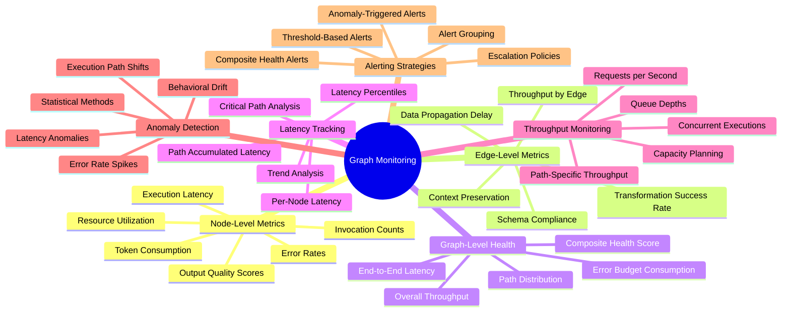
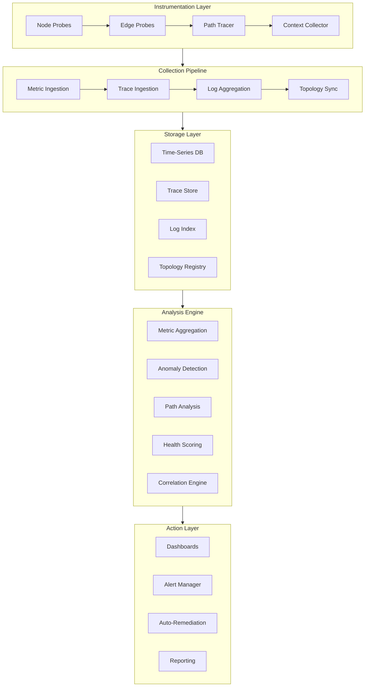
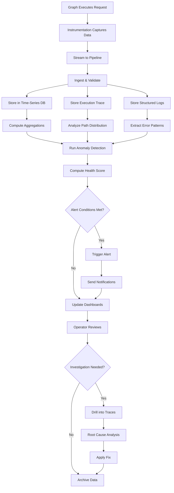
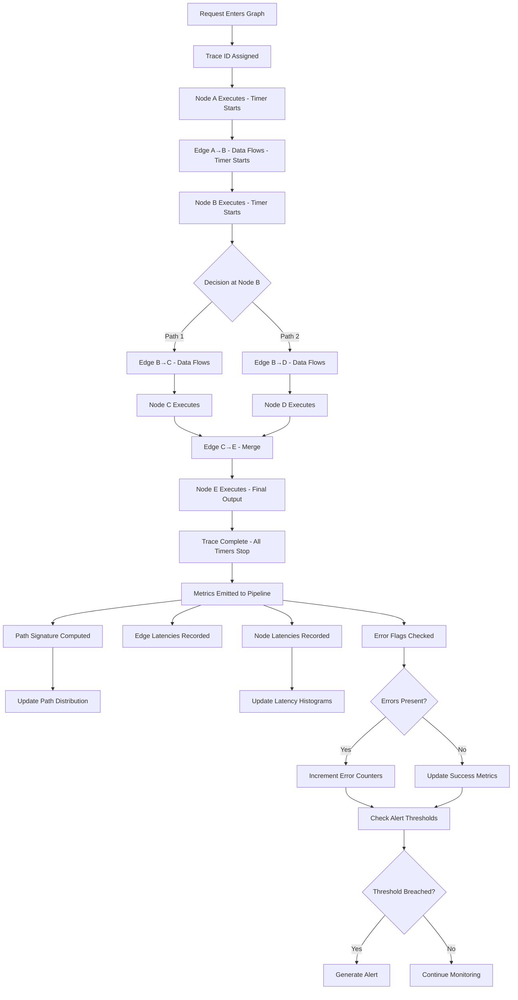
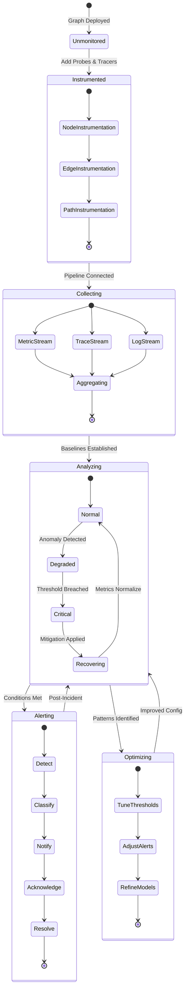
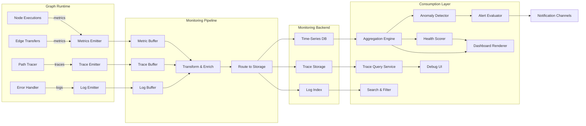
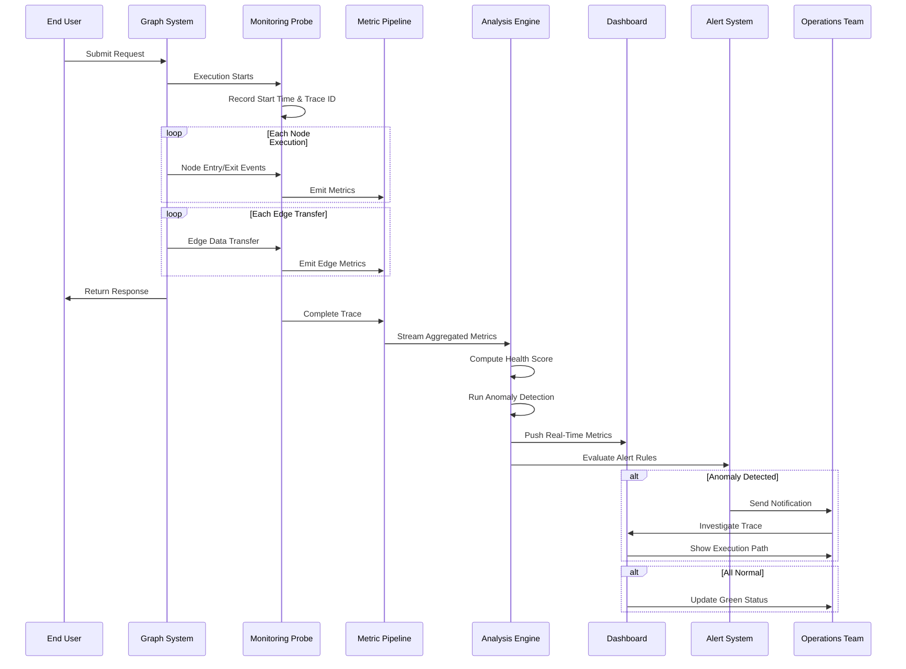

# Graph Monitoring: Observing Graph-Based AI Systems in Production

## 📌 Overview

Graph monitoring is the practice of continuously observing the operational health, performance characteristics, and behavioral patterns of graph-based AI systems as they execute in production environments. Unlike monitoring traditional monolithic applications or even microservices, graph monitoring must track not only individual component health but also the complex interactions between components that define the system's emergent behavior. A graph-based AI system—composed of prompt nodes, tool integrations, agent collaborations, memory access points, and decision routers connected by data flow and control flow edges—generates a rich stream of telemetry data that, when properly collected and analyzed, provides deep visibility into system performance and correctness. The fundamental challenge of graph monitoring lies in the sheer volume and variety of metrics that must be tracked: each node produces its own latency, error rate, and throughput metrics, each edge carries data with its own propagation characteristics, and the graph as a whole exhibits path-level behaviors that cannot be inferred from individual component metrics alone. Effective graph monitoring requires a multi-layered approach that captures metrics at the node level, edge level, and graph level simultaneously, correlating these measurements to provide a coherent picture of system health. Production graph systems serve real users with real expectations, making monitoring not merely a nice-to-have observability feature but a critical operational requirement that enables rapid incident detection, root cause analysis, and capacity planning. As graph-based AI systems grow in complexity and scale, monitoring becomes the essential bridge between development-time testing confidence and runtime operational assurance.

## 🎯 Learning Objectives

After studying this document, practitioners will be equipped to design and implement a comprehensive monitoring strategy for graph-based AI systems operating in production environments. You will learn to define and collect node-level metrics that track the performance, correctness, and resource utilization of individual processing units within the graph, including prompt execution nodes, tool invocation nodes, and decision routing nodes. You will understand how to monitor edge-level characteristics such as data propagation latency, transformation success rates, schema compliance, and context loss indicators that reveal problems in the connections between nodes. You will gain the ability to construct graph-level health indicators that aggregate lower-level metrics into meaningful composite scores reflecting the overall system state, enabling rapid assessment of system health at a glance. You will master techniques for tracking latency across complete execution paths through the graph, identifying not just which nodes are slow but which specific routes through the graph contribute most to overall response time. You will learn throughput monitoring approaches that account for the variable execution paths inherent in graph systems, measuring the system's capacity to handle concurrent requests across different topological routes. You will become proficient in anomaly detection methods tailored to graph execution patterns, including statistical approaches for identifying unusual node activation frequencies, unexpected execution path distributions, and abnormal inter-node timing relationships. Finally, you will understand how to design effective alerting strategies that balance sensitivity (catching real problems quickly) against specificity (avoiding alert fatigue from false positives) in the complex, variable environment of graph-based AI systems.

## 🧠 Definition

Graph monitoring is the systematic collection, aggregation, analysis, and visualization of operational telemetry data from graph-based AI systems, encompassing metrics at three distinct granularity levels: node-level metrics that track the behavior of individual processing components, edge-level metrics that track the characteristics of data and control flow between components, and graph-level metrics that track the emergent behavior of the system as a whole. Node-level monitoring captures measurements such as execution latency, error rates, output quality scores, token consumption, and resource utilization for each node in the graph, providing the most granular view of system behavior. Edge-level monitoring tracks the data flowing between nodes, measuring propagation delay, transformation fidelity, schema compliance rates, and context preservation across each connection in the graph topology. Graph-level monitoring synthesizes information from nodes and edges into holistic indicators such as end-to-end workflow latency, request throughput, execution path distribution, overall error rates, and composite health scores that reflect the system's operational state. A key distinguishing feature of graph monitoring compared to traditional application monitoring is its awareness of the topological structure of the system, enabling it to correlate metrics across the graph's structure rather than treating each component independently. This topological awareness allows graph monitoring to detect patterns that would be invisible in conventional dashboards, such as identifying that errors in a downstream node are correlated with degraded performance in an upstream node, or that a specific execution path through the graph has become significantly slower even though no individual node on that path has crossed its latency threshold. Graph monitoring systems typically combine real-time metric streaming for alerting with historical data storage for trend analysis and capacity planning.

## ❓ Why It Matters

Monitoring graph-based AI systems matters because these systems exhibit emergent behaviors that cannot be predicted from the behavior of individual components, meaning that even well-tested systems can develop unexpected problems in production due to the complex interactions between nodes under real-world conditions. The non-deterministic nature of LLM-based nodes introduces variability in execution paths, response times, and output quality that must be continuously tracked to detect degradation before it impacts users. In production environments, graph systems face challenges that are difficult or impossible to reproduce in testing, including variable load patterns, changing upstream model performance, evolving user behavior, and external dependency degradation, all of which can shift the system's operational characteristics in subtle ways that only continuous monitoring can detect. Without proper monitoring, teams operating graph-based AI systems are effectively flying blind, unable to distinguish between normal operational variability and genuine problems that require intervention, leading to prolonged outages, degraded user experiences, and missed opportunities for optimization. Graph monitoring also provides the data foundation for continuous improvement, enabling teams to identify performance bottlenecks, optimize execution paths, right-size resource allocation, and make evidence-based decisions about architectural changes. Furthermore, regulatory and compliance requirements increasingly demand that AI systems be monitored for correctness, fairness, and safety in production, making monitoring not just an operational best practice but a legal and ethical obligation. Organizations that invest in comprehensive graph monitoring gain a significant competitive advantage through faster incident response, higher system reliability, better resource efficiency, and deeper understanding of how their AI systems behave in the real world.

## 🏛️ Core Concepts

The core concepts of graph monitoring are organized around three fundamental dimensions of observability: metrics, traces, and logs, each adapted to the unique characteristics of graph-based AI systems. The metrics dimension encompasses quantitative measurements collected at regular intervals, including node-level counters (invocation counts, error counts, token usage), gauges (current latency, queue depth, active connections), and histograms (latency distributions, output quality score distributions). The traces dimension captures the complete execution path of each request through the graph, recording which nodes were activated, in what order, how long each took, and what data flowed between them, enabling detailed root cause analysis when problems occur. The logs dimension provides rich contextual information about individual node executions, including input and output data, model parameters, error details, and debugging information that supplements the quantitative metrics and traces. A fourth concept specific to graph monitoring is topology-aware correlation, which leverages knowledge of the graph structure to relate metrics across connected nodes, enabling the detection of cascading failures, propagated latency increases, and correlated error patterns that would appear unrelated in a flat metric view. The concept of execution path distribution is another graph-specific monitoring concern, tracking the frequency with which different routes through the graph are taken, which provides insight into user behavior patterns, model decision tendencies, and potential load imbalance across the graph's branches. Health scoring is a composite concept that aggregates multiple metrics into a single numerical or categorical indicator of system health, weighted by the criticality and sensitivity of the components involved.

## 🧩 Key Components

The key components of a graph monitoring system include the instrumentation layer, which embeds metric collection points within each node and edge of the graph, capturing execution timing, data characteristics, error conditions, and resource utilization as the graph processes requests. The metric pipeline is responsible for transporting collected metrics from the instrumented graph to the monitoring backend, handling high-throughput streaming, buffering during network interruptions, and ensuring that metrics arrive at the analysis layer with minimal latency. The time-series database stores historical metric data, supporting efficient range queries, aggregation, and downsampling that enable trend analysis over time scales ranging from seconds to months. The trace collector captures and stores execution traces, maintaining the complete record of each request's journey through the graph with enough detail to reconstruct the execution for debugging and analysis purposes. The topology registry maintains a versioned representation of the graph's structure, enabling the monitoring system to understand the relationships between nodes and edges and to correlate metrics across the graph's topology. The anomaly detection engine applies statistical and machine learning methods to metric streams, identifying deviations from normal patterns that may indicate developing problems, using techniques such as seasonal decomposition, statistical process control, and change point detection. The alerting engine evaluates monitored metrics and anomaly scores against configurable thresholds and rules, generating notifications through various channels when conditions warrant attention, while implementing deduplication, grouping, and suppression to manage alert volume. The visualization layer presents monitoring data through dashboards that provide both real-time operational views and historical analytical perspectives, with graph-specific visualizations that show metrics overlaid on the graph topology for intuitive spatial understanding of system health.

## 🧭 Mental Model

Think of graph monitoring like a hospital's patient monitoring system, where each organ (node) has its own vital signs—heart rate for a prompt node, blood pressure for a tool node, oxygen saturation for a memory node—and the circulatory system (edges) carries information between organs that must also be monitored for blockages or irregularities. Just as a patient monitor displays all vital signs simultaneously and triggers alarms when any measurement enters a danger zone, a graph monitoring system tracks all node and edge metrics concurrently and generates alerts when thresholds are breached. The hospital analogy extends further: just as doctors need to understand not just individual vital signs but the relationships between them (e.g., how heart rate affects blood pressure), graph monitoring must correlate metrics across the graph's topology to understand systemic issues. Another useful mental model is an air traffic control system, where each aircraft (request) is tracked as it moves between waypoints (nodes) along routes (paths), with controllers monitoring individual aircraft positions, route congestion levels, and overall airspace safety. The air traffic control metaphor emphasizes the importance of tracking individual request trajectories through the graph (tracing), monitoring the load on different routes (throughput), and detecting unusual patterns that might indicate developing problems (anomaly detection). Just as air traffic controllers need both the big picture of overall airspace safety and the ability to zoom into specific aircraft for detailed information, graph monitoring must provide both system-wide health indicators and drill-down capability into individual node and edge details. Both metaphors highlight that effective monitoring requires maintaining awareness at multiple levels of abstraction simultaneously.

## 🗺️ Mind Map

## 🏗️ Architecture Diagram

## 🔄 Workflow

## ⚙️ Internal Working

The internal working of a graph monitoring system begins at the instrumentation layer, where each node in the graph is wrapped with code that measures the time between receiving input and producing output, counts invocations and errors, captures output quality metrics, and records resource consumption. Edge instrumentation measures the time data takes to propagate from a source node's output to a destination node's input, validates that the data conforms to expected schemas, and tracks any transformations applied during transit. The path tracer assigns a unique trace identifier to each incoming request and propagates this identifier through every node and edge the request traverses, building a complete record of the execution path that can be reconstructed for analysis. As metrics are collected, they are streamed to the ingestion pipeline, which validates the data format, attaches metadata such as timestamps and graph version identifiers, and routes the data to the appropriate storage backend. The time-series database receives numerical metrics and stores them in a format optimized for range queries and time-based aggregation, supporting operations like computing rolling averages, percentile calculations, and rate derivations. The trace store receives execution path data and indexes it by trace ID, timestamp, and path signature, enabling efficient retrieval of specific request executions for debugging. The anomaly detection engine operates on sliding windows of recent metric data, comparing current values against statistical baselines that capture normal system behavior, using techniques like exponential moving averages for trend detection and z-scores for deviation identification. When anomalies are detected, the alerting engine evaluates them against configured rules, checking whether the anomaly magnitude exceeds notification thresholds, whether similar alerts have recently been fired, and whether the affected components are critical enough to warrant immediate attention.

## 🔀 Execution Flow

## 📊 Lifecycle

## 📡 Data Flow

## 🤝 Interaction Flow

## 🌍 Real-World Analogy

Consider a large international shipping network where packages (requests) flow through various processing facilities (nodes) connected by transport routes (edges), and the entire network must be monitored to ensure timely and reliable delivery. Node-level monitoring is like tracking each facility's processing rate, error rate (mislabeled packages), and queue depth, ensuring that no single facility becomes a bottleneck that slows down the entire network. Edge-level monitoring is like tracking the transit time and reliability of each transport route between facilities, detecting when a specific route becomes consistently slower due to weather, congestion, or vehicle problems. Graph-level monitoring is like the network operations center that views the entire shipping network on a single dashboard, showing overall throughput, delivery success rates, and the most common routes packages take through the network. Latency tracking is analogous to tracking the total delivery time from origin to destination, identifying not just which facilities are slow but which specific routes contribute most to late deliveries. Anomaly detection is like the system that flags when an unusual number of packages are being rerouted through a particular facility, which might indicate an upstream problem that hasn't been detected yet. Alerting is like the priority notification system that pages the operations team when a critical facility goes offline or when delivery times exceed acceptable thresholds for a significant percentage of packages. The shipping analogy perfectly captures the multi-level nature of graph monitoring, where understanding the health of the overall system requires monitoring at every level of the network hierarchy while maintaining awareness of the topological relationships between components.

## 💡 Practical Example

Consider a production customer support AI graph with the following topology: an intake node classifies incoming queries, a routing node directs them to specialist handlers (billing, technical, returns), specialist nodes may invoke database lookup tool nodes and API call tool nodes, and a response generation node produces final answers. Node-level monitoring would track the intake node's classification latency (targeting under 200 milliseconds), accuracy (measuring agreement with a golden dataset sampled from production traffic), and error rate (tracking classification failures). The billing specialist node would be monitored for its database lookup latency, the rate at which it needs to escalate to human agents, and the customer satisfaction scores associated with its responses. Edge-level monitoring would track the data propagation between the routing node and specialist nodes, measuring whether context fields are properly passed and whether any required fields are missing when they arrive at specialist nodes. Graph-level health would be computed as a weighted composite of all node and edge health scores, with higher weights assigned to nodes on the most frequently traversed execution paths. Latency tracking across paths would reveal, for example, that the billing inquiry path takes 3.2 seconds on average while the FAQ path takes only 0.8 seconds, and that the billing path's latency has been trending upward over the past week due to increasing database lookup times. Throughput monitoring would show that the system handles 500 requests per hour with 60% following the FAQ path, 25% the billing path, and 15% the technical path, indicating potential opportunities to optimize the most common path. Anomaly detection would flag when the error rate on the technical specialist node suddenly jumps from 2% to 15%, triggering an alert before customer complaints flood in.

## 🧪 Use Cases

Graph monitoring is essential for production agentic AI systems where multiple autonomous agents collaborate through a graph topology, requiring visibility into agent handoff success rates, context preservation across agent boundaries, and the overall quality of multi-agent collaboration outcomes. Real-time content generation pipelines built as graphs—with nodes for research, drafting, editing, and fact-checking—need monitoring to track quality metrics at each stage and identify where content quality degrades, enabling targeted improvements to specific nodes. Financial decision support systems constructed as graph workflows require stringent monitoring of both correctness (ensuring calculations are accurate) and latency (ensuring decisions are timely), with regulatory compliance demanding comprehensive audit trails of all graph executions. Healthcare AI systems using graph architectures for diagnostic workflows need monitoring that tracks diagnostic accuracy, patient data handling compliance, and the clinical appropriateness of recommended actions across all execution paths. E-commerce personalization systems built as recommendation graphs require monitoring of recommendation quality, diversity, and freshness across different customer segments and product categories, with A/B testing of graph configuration changes tracked through monitoring dashboards. Internal developer tools built as graph workflows—such as code review automation, deployment pipelines, or incident response systems—benefit from monitoring that tracks workflow completion rates, bottleneck identification, and the effectiveness of automated decision nodes. Multi-tenant SaaS platforms serving graph-based AI features to multiple customers need tenant-level monitoring that tracks per-customer graph performance, resource consumption, and error rates, enabling fair resource allocation and rapid identification of customer-specific issues.

## ⚖️ Comparison

Traditional application performance monitoring (APM) focuses on service-level metrics like request latency, error rate, and throughput for individual services, while graph monitoring must additionally track the topology-aware relationships between components and the emergent behaviors of execution paths. Microservices monitoring typically treats services as independent entities connected through API calls, but graph monitoring recognizes that the graph's structure creates dependencies and interactions that are more complex than simple point-to-point service calls, including fan-out patterns, aggregation nodes, and conditional routing. Log-based monitoring captures unstructured or semi-structured text records of system events, whereas graph monitoring requires structured telemetry that preserves the topological context of each measurement, enabling spatial analysis of metrics across the graph structure. Synthetic monitoring tests system behavior using predetermined scripts, while graph monitoring observes actual production traffic, providing a more accurate picture of real system behavior but requiring more sophisticated analysis to distinguish signal from noise. Infrastructure monitoring tracks CPU, memory, network, and disk utilization of host machines, while graph monitoring operates at the application logic level, tracking the behavior of AI components that may share infrastructure but have vastly different performance characteristics and requirements. Compared to traditional monitoring, graph monitoring must handle higher metric cardinality (more unique metric series due to the combinatorial explosion of node-edge-path combinations), more complex correlation requirements (relating metrics across topological connections), and more variable baseline behavior (due to LLM non-determinism and dynamic execution paths).

## ✅ Best Practices

Implement a layered monitoring strategy that captures metrics at the node, edge, and graph levels simultaneously, ensuring that no level of the system is unobserved and that problems can be diagnosed at the appropriate granularity. Define clear service level objectives (SLOs) for critical execution paths through the graph, setting measurable targets for latency, error rate, and quality that reflect the user experience rather than internal component metrics. Use distributed tracing with consistent trace ID propagation to maintain end-to-end visibility into request execution, enabling rapid root cause analysis when problems occur and providing the data needed for path-level performance analysis. Implement automated anomaly detection rather than relying solely on static thresholds, because the variable nature of graph execution makes fixed thresholds either too sensitive (causing alert fatigue) or too lenient (missing real problems). Design monitoring dashboards that overlay metrics on the graph topology itself, allowing operators to see health indicators in spatial context and quickly identify affected regions of the graph when problems occur. Establish baseline behavior profiles for normal operation, including expected node activation frequencies, typical execution path distributions, and normal latency ranges for each path, providing the reference against which anomalies are detected. Implement progressive alerting that starts with informational notifications for minor deviations and escalates to critical alerts for severe or persistent problems, reducing alert fatigue while ensuring that serious issues receive immediate attention. Maintain monitoring as a first-class concern alongside the graph system itself, updating instrumentation when the graph topology changes, reviewing alert thresholds as traffic patterns evolve, and continuously refining anomaly detection models based on operational experience.

## ❌ Common Mistakes

A frequent mistake is monitoring only aggregate graph-level metrics without node and edge level detail, which makes it impossible to diagnose problems when the overall system health degrades because the root cause could be anywhere in the graph. Another common error is setting alert thresholds based on development or staging environment performance rather than production baselines, leading to either excessive false positives or missed real alerts because production traffic patterns, model behavior, and resource contention differ significantly from test environments. Teams often neglect to monitor execution path distribution, missing the insight that changes in which routes through the graph are most frequently taken can indicate shifting user behavior, model drift, or emerging problems that are redirecting traffic. Failing to correlate metrics across the graph topology is a significant oversight, because treating each node's metrics in isolation misses the cascading effects and propagation patterns that are the hallmark of graph system behavior. Over-collecting metrics without a clear analysis strategy leads to monitoring sprawl, where the sheer volume of data overwhelms the operations team and makes it difficult to identify the metrics that actually matter for system health. Ignoring the non-deterministic nature of LLM-based nodes when setting monitoring baselines results in alert thresholds that are either too tight (triggering on normal variability) or too loose (missing genuine degradation). Teams frequently forget to update their monitoring configuration when the graph topology changes, leading to blind spots where new nodes or edges operate without observation until a problem manifests in user-facing symptoms.

## 🚀 Advanced Topics

Predictive monitoring uses time-series forecasting models trained on historical graph execution data to predict future system behavior, enabling proactive scaling, pre-emptive alerting, and capacity planning before problems manifest in production. Causal graph analysis applies causal inference techniques to monitoring data to distinguish between correlation and causation in metric relationships, enabling teams to identify the true root cause of problems rather than just correlated symptoms. Topological data analysis adapts techniques from computational topology to monitor the shape and structure of metric distributions across the graph, detecting subtle changes in the system's behavioral geometry that might indicate developing problems. Federated monitoring for distributed graph systems aggregates metrics from multiple graph instances running across different regions, clusters, or tenants while maintaining the ability to drill down into individual instance behavior. AI-powered anomaly detection uses deep learning models trained on normal graph execution patterns to detect novel types of anomalies that rule-based systems cannot identify, including subtle shifts in execution behavior that precede failures. Self-healing monitoring systems go beyond detection to implement automated remediation actions—such as routing traffic away from degraded nodes, adjusting model parameters, or scaling resources—based on monitoring signals, reducing mean time to recovery for common failure modes. Graph execution replay captures complete execution traces and enables deterministic replay of past requests in controlled environments, combining monitoring with testing to reproduce and diagnose production issues. Cost monitoring tracks the financial cost of graph execution, including LLM token costs, API call charges, and compute resource expenses, correlating cost data with performance metrics to optimize the cost-performance tradeoff of the graph system.