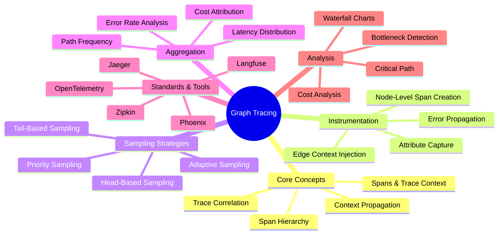
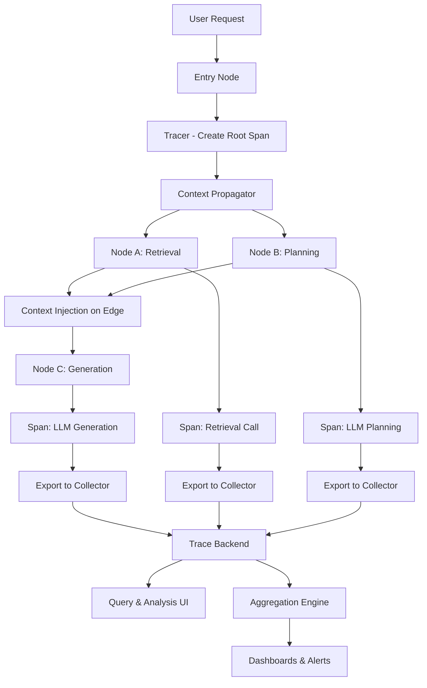
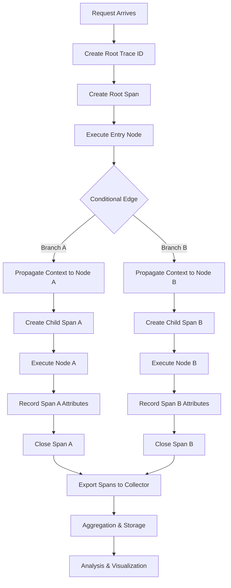
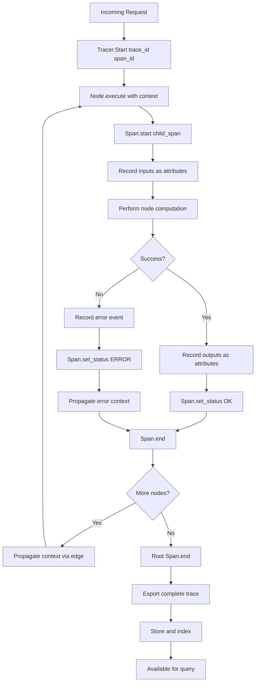
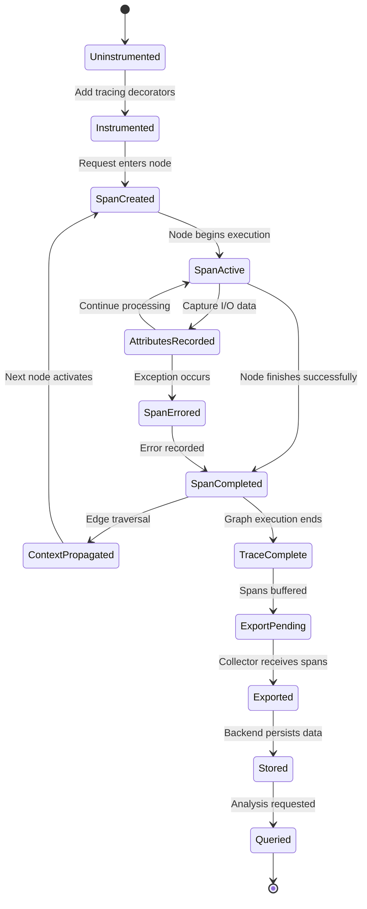
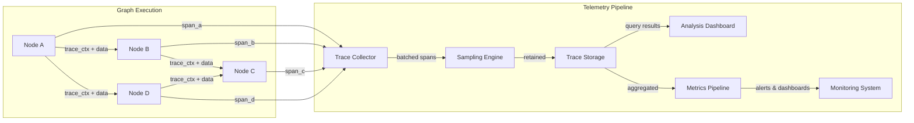
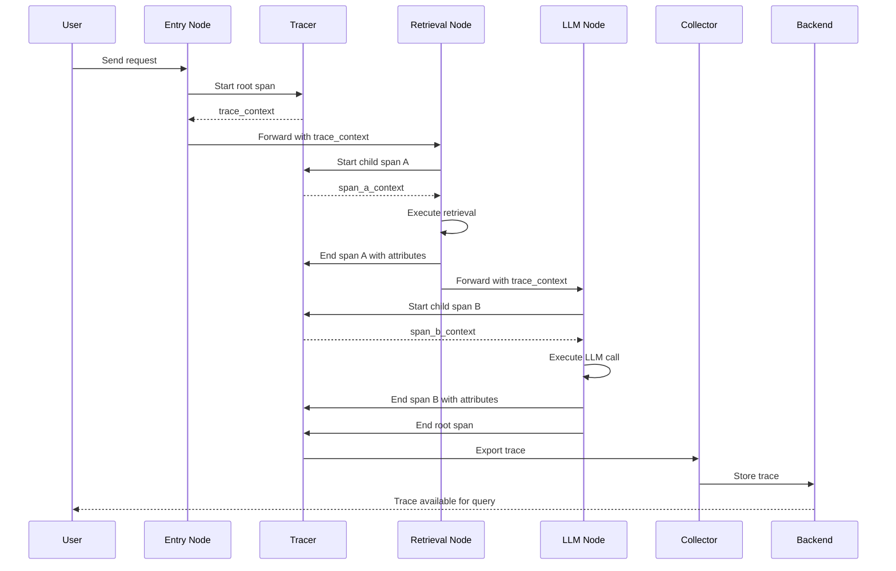

# Graph Tracing: Distributed Tracing for Graph-Based AI Systems

## 📌 Overview

Graph tracing is the discipline of applying distributed tracing principles to graph-based AI systems, enabling engineers to observe, measure, and understand the complete lifecycle of data and control flow as it traverses interconnected nodes and edges. Unlike traditional distributed tracing that tracks requests across microservices, graph tracing follows execution paths through AI agent networks, prompt chains, tool invocations, and memory lookups that form the backbone of modern AI workflows. Each node in a graph-based system — whether it represents an LLM call, a retrieval step, a decision branch, or a state transformation — becomes a traceable span with metadata about its inputs, outputs, duration, and status.

The importance of graph tracing emerges from the inherent complexity of graph-based AI architectures, where a single user request might fan out across dozens of nodes, traverse conditional edges, loop through refinement cycles, and aggregate results from parallel branches. Without tracing, failures are opaque, performance bottlenecks remain hidden, and debugging degenerates into guesswork. Graph tracing transforms this opacity into clarity by providing end-to-end visibility into every step of graph execution, making it possible to pinpoint exactly where latency accumulates, where errors originate, and where context is lost or corrupted along the way.

Modern graph tracing builds upon established observability standards like OpenTelemetry, adapting them for the unique characteristics of AI graph systems. This includes tracking token consumption at each node, capturing prompt and completion payloads, recording tool invocation parameters and results, and correlating state mutations across the graph's execution history. The result is a comprehensive trace record that serves simultaneously as a debugging tool, a performance profiler, an audit log, and a foundation for optimization.

## 🎯 Learning Objectives

By studying graph tracing, practitioners will develop the ability to instrument graph-based AI systems for complete observability, understanding how to define meaningful spans for each type of graph node and propagate trace context reliably across edges. Learners will master the techniques of trace sampling strategies tailored for AI workloads, where the cost of full tracing can be prohibitive due to large payload sizes. They will gain proficiency in trace aggregation methods that combine individual traces into system-wide performance portraits, enabling identification of patterns that only emerge across many executions.

Practitioners will also learn to leverage OpenTelemetry and similar standards within graph engineering contexts, adapting general-purpose distributed tracing tooling for the specific needs of AI systems. This includes understanding how to represent LLM calls, retrieval operations, and state transitions as semantically rich spans with custom attributes. Furthermore, learners will develop skills in trace-based performance analysis, using trace data to construct latency waterfall charts, identify critical paths through the graph, and quantify the cost of each node in terms of time, tokens, and money.

## 🧠 Definition

Graph tracing is the systematic process of recording, propagating, and analyzing execution telemetry as data flows through a graph-based AI system, where each node's execution is captured as a span within a hierarchical trace that represents the complete journey of a single request from entry to exit. A trace in this context is a directed forest of spans that mirrors the actual execution path through the graph, including any parallel branches, loops, and conditional detours that occurred during processing. Each span encapsulates timing information, status codes, input-output payloads, and custom attributes specific to the node's function within the AI pipeline.

The practice extends beyond simple logging by maintaining causal relationships between spans, allowing engineers to reconstruct the exact sequence and concurrency of operations that produced a given output. In graph-based AI systems, this means tracking not just that a retrieval node ran before a generation node, but how the retrieved context influenced the generated output, how state was mutated at each step, and where failures or degradations occurred in the chain. Graph tracing thus provides both the temporal dimension (when things happened and how long they took) and the structural dimension (how nodes connected and influenced each other during a specific execution).

## ❓ Why It Matters

Graph tracing matters fundamentally because graph-based AI systems are inherently opaque in their execution. When a user submits a query to a multi-agent system that routes through a planning node, dispatches to three specialist agents, aggregates their responses through a synthesis node, and applies post-processing through a validation chain, there is no single log line that captures what happened. Failures manifest as vague error messages or incorrect outputs with no indication of which node in the graph is responsible. Performance issues appear as overall slowness without revealing whether the bottleneck lies in a slow LLM call, an expensive retrieval operation, or a serialized section that should be parallelized.

Without tracing, debugging a production issue in a graph-based AI system requires manually adding print statements, reproducing the exact request conditions, and piecing together fragments from disconnected logs. This approach is slow, error-prone, and often impossible when dealing with intermittent issues that depend on specific input patterns. Graph tracing eliminates this detective work by automatically capturing the complete execution story for every request, making it possible to trace any output back to its causal inputs and identify the exact node or edge where things went wrong.

Furthermore, graph tracing is essential for the economic sustainability of AI systems. Token usage and API costs accumulate across every LLM node in a graph, and without trace-level cost attribution, teams cannot determine which parts of their graph are driving expenses. Tracing enables per-node cost analysis, revealing opportunities to cache results, reduce redundant calls, or optimize prompts for fewer tokens. In production systems handling millions of requests, this cost visibility can translate to significant savings.

## 🏛️ Core Concepts

The foundational concept of graph tracing is the span, which represents a single unit of work within the graph's execution. Each span has a start time, an end time, a status (completed, errored, or canceled), and a set of attributes that provide context about what the span represents. In graph-based AI systems, spans are mapped directly to graph nodes — an LLM invocation node produces an LLM span, a retrieval node produces a retrieval span, and a conditional routing node produces a decision span. The hierarchy of spans naturally mirrors the graph's topology, with parent spans representing composite operations and child spans representing the individual steps within them.

Trace context propagation is the mechanism by which tracing information flows across graph edges, ensuring that all spans belonging to the same request are correlated together. This is achieved through trace identifiers and span identifiers that are passed along with the data as it moves from one node to the next. In distributed graph systems where nodes may execute on different processes or machines, context propagation must survive serialization boundaries, requiring careful instrumentation of the message passing or state management layer that connects graph nodes.

Trace sampling is the strategy for selecting which graph executions to trace fully versus which to record at reduced fidelity. Full tracing of every execution can be prohibitively expensive in AI systems due to the size of LLM prompts and completions, so sampling strategies like head-based (sampling a fixed percentage of requests), tail-based (sampling based on observed characteristics like latency or errors), and adaptive sampling (adjusting rates based on system load) are essential for maintaining observability without overwhelming storage and processing infrastructure.

Trace aggregation is the process of combining individual traces into statistical summaries that reveal system-wide patterns. While individual traces are invaluable for debugging specific requests, aggregated trace data exposes trends like the p99 latency of a particular node across all requests, the error rate of a specific edge transition, or the distribution of execution paths through a conditional branching node. Aggregation transforms raw trace data into operational intelligence that drives system improvement.

## 🧩 Key Components

The instrumentation layer is the foundational component that embeds tracing capabilities directly into graph node implementations. This layer wraps each node's execution in span creation and completion calls, capturing inputs, outputs, timing, and any errors that occur. In well-designed graph tracing systems, instrumentation is largely declarative — node developers specify what attributes to capture, and the framework handles the mechanics of span lifecycle management. The instrumentation layer must be minimally invasive, adding negligible overhead to node execution while capturing sufficient data for analysis.

The context propagation layer manages the flow of trace identifiers across graph edges, ensuring that all spans within a single graph execution are correctly correlated. This layer must handle both in-process propagation (where nodes execute within the same process and context can be passed via thread-local storage or async context variables) and cross-process propagation (where nodes may execute in separate services and context must be embedded in the data payloads or communication protocols). The propagation layer is responsible for injecting and extracting trace context at each edge boundary.

The trace collector is the component that receives, buffers, and exports trace data from the graph execution engine to one or more backends. The collector must handle high-throughput scenarios where the graph system generates thousands of spans per second, batching them efficiently and managing backpressure when downstream systems cannot keep up. The collector also serves as the point where sampling decisions are enforced, dropping traces that do not meet sampling criteria before they consume storage resources.

The trace storage and query backend provides persistent storage for trace data and supports efficient querying for debugging and analysis. Common backends include Jaeger, Zipkin, Elasticsearch, or specialized AI observability platforms like Langfuse or Phoenix. The backend must support complex queries like finding all traces where a specific node took longer than a threshold, retrieving complete trace trees for a given trace ID, and computing aggregated statistics over time ranges. The choice of backend significantly impacts the types of analysis that are practical.

The analysis and visualization layer transforms raw trace data into actionable insights through waterfall charts, flame graphs, latency heatmaps, and execution path distributions. This layer is where engineers interact with trace data most directly, and its design determines how quickly and effectively they can diagnose issues and identify optimization opportunities. Good visualization layers support both real-time monitoring (showing traces as they arrive) and historical analysis (exploring patterns across time periods).

## 🧭 Mental Model

Think of graph tracing as a GPS tracking system for packages moving through a complex logistics network. Each package (representing a user request) enters the network at a depot (the entry node) and moves through a series of sorting facilities, transportation hubs, and delivery vehicles (graph nodes) connected by routes (edges) before reaching its final destination. The GPS tracker records every stop, every route taken, the time spent at each location, and any delays or detours that occurred along the way.

Just as a logistics manager can look at a package's tracking history to see exactly where it got stuck, how long it spent at each facility, and which route it took through the network, a graph engineer can look at a trace to see exactly which nodes processed a request, how long each took, and which path through the graph was followed. When a package arrives late, the tracking data immediately reveals whether the delay occurred at a specific sorting facility or during transportation between two hubs, just as a trace reveals whether latency accumulated at a specific LLM node or during state transfer between nodes.

## 🗺️ Mind Map

## 🏗️ Architecture Diagram

## 🔄 Workflow

## ⚙️ Internal Working

Graph tracing operates through a multi-phase process that begins when a request first enters the graph-based AI system. In the initialization phase, the tracing framework generates a unique trace identifier and creates a root span that encompasses the entire graph execution. This root span carries metadata about the incoming request, including the request type, user identifiers, and any relevant parameters. The trace context containing the trace ID, span ID, and trace flags is stored in a context object that will accompany the request data as it flows through the graph.

During the execution phase, each graph node, when activated, extracts the trace context from the incoming data and creates a new child span under the current parent span. The node records its start time, captures input attributes (such as the prompt sent to an LLM or the query submitted to a retrieval system), performs its computation, and then records output attributes (such as the LLM response or retrieved documents) along with the end time and status. If the node encounters an error, it records the error information as a span event with a stack trace and error message, then marks the span as errored before propagating the context (with error flags) to downstream nodes.

In the collection phase, completed spans are sent to a trace collector that may be running locally or remotely. The collector batches incoming spans, applies sampling rules (potentially dropping some traces based on configured strategies), and exports the retained spans to the storage backend. The collector handles failures in export gracefully, retrying or buffering spans when the backend is temporarily unavailable. Finally, in the analysis phase, stored traces are queried and processed to generate visualizations, compute aggregated metrics, and trigger alerts based on observed patterns or anomalies.

## 🔀 Execution Flow

## 📊 Lifecycle

## 📡 Data Flow

## 🤝 Interaction Flow

## 🌍 Real-World Analogy

Consider a hospital emergency department where a patient arrives with a complex condition. The triage nurse (entry node) assesses the patient and creates a medical record (root span) with a unique ID. This record accompanies the patient as they are routed to different specialists (nodes) — a radiologist for imaging, a lab technician for blood work, and a cardiologist for heart monitoring. Each specialist records their findings, timestamps, and procedures in the patient's record (child spans with attributes). The attending physician later reviews the complete record (trace) to understand the patient's journey through the department, identifying which consultations took the longest, where delays occurred, and whether any test results were abnormal (errors).

Just as the medical record provides a unified view of a patient's journey through a complex healthcare system, graph tracing provides a unified view of a request's journey through a complex AI system. The attending physician can look at the complete timeline of care (waterfall chart) to see that the blood work took three hours when it should have taken one, just as an AI engineer can see that a retrieval node took five seconds when it should have taken five hundred milliseconds. Without the medical record, understanding the patient's experience would require interviewing each specialist individually — just as without tracing, understanding a request's execution would require inspecting each node's logs in isolation.

## 💡 Practical Example

Imagine a customer support AI system built as a graph with an intent classification node, a knowledge base retrieval node, a response generation node, and a quality check node. A customer reports that responses are slow, but the engineering team cannot tell where the delay originates. By implementing graph tracing, each customer request generates a trace with four spans corresponding to the four nodes. The traces reveal that the intent classification node averages 50 milliseconds, the retrieval node averages 2,500 milliseconds, the generation node averages 1,800 milliseconds, and the quality check averages 200 milliseconds. The waterfall chart immediately shows that retrieval is the bottleneck, consuming over 50% of total latency.

Digging deeper into the retrieval spans, the team notices that 30% of retrieval calls include redundant queries to the same knowledge base for related terms. They add a caching node before retrieval that deduplicates and caches common query patterns. After deployment, new traces show the retrieval span dropping to 800 milliseconds on average, with the cache node adding only 5 milliseconds. The trace data also reveals that the generation node's latency correlates strongly with the number of retrieved documents passed to it, leading the team to implement a relevance threshold that filters low-quality documents before generation, further reducing both latency and token costs.

## 🧪 Use Cases

Distributed AI agent debugging is one of the most compelling use cases for graph tracing. In multi-agent systems where a coordinator agent delegates tasks to specialist agents, tracing provides visibility into which agents were invoked, what instructions they received, how long they took, and what they returned. When a specialist agent produces incorrect output, the trace shows the exact prompt it received and the chain of context that led to that prompt, enabling precise diagnosis of whether the error originated from the coordinator's instructions, a previous agent's output, or the specialist's own reasoning.

Performance optimization for LLM pipelines relies heavily on trace data to identify which nodes in a generation pipeline contribute most to end-to-end latency. Traces can reveal that a preprocessing step that seemed trivial actually triggers multiple sequential API calls, or that a post-processing validation step makes redundant calls to the same model. By analyzing trace waterfalls, engineers can identify opportunities for parallelization, caching, and batching that dramatically reduce latency without changing the graph's logical structure.

Cost management in token-based AI systems requires per-node cost attribution that only tracing can provide. Each LLM node's span records the number of input and output tokens consumed, allowing teams to compute the cost of each node in the graph. Aggregated across all traces, this data reveals which nodes are the most expensive and which requests drive the highest costs. This information is invaluable for implementing cost controls such as token budget caps per node, intelligent routing that avoids expensive models for simple requests, and caching strategies that reduce redundant token consumption.

## ⚖️ Comparison

| Aspect | Traditional Logging | Structured Logging | Graph Tracing |
|---------|-------------------|-------------------|---------------|
| Correlation | Weak (timestamp-based) | Moderate (request IDs) | Strong (parent-child spans) |
| Causal Relationships | Not captured | Partially captured | Fully captured |
| Latency Analysis | Not possible | Approximate | Precise (span timing) |
| Cross-Node Flow | Manual correlation | Correlation IDs | Automatic context propagation |
| Visualization | Text logs | Filtered log views | Waterfall charts, flame graphs |
| Overhead | Low | Low | Moderate |
| Storage Cost | Low | Moderate | High (span data) |
| AI-Specific | No | Minimal | Token counts, model info |

Graph tracing differs from traditional logging in its ability to capture causal relationships between operations. While a log line tells you that something happened, a trace span tells you what caused it, what it caused, and how long it took in the context of the overall request. Compared to structured logging with correlation IDs, graph tracing provides hierarchical parent-child relationships that make it trivial to understand which operations were nested within which other operations, a critical capability for understanding the execution of deeply nested AI pipelines.

## ✅ Best Practices

Define a consistent span naming convention that reflects the semantic role of each node in the graph, using a hierarchical naming scheme like `graph.retrieval.vector_search` or `graph.generation.llm_call` that enables filtering and grouping in the trace backend. Each span name should clearly communicate what the node does, making it possible for engineers unfamiliar with the graph's implementation to understand traces at a glance. Avoid generic names like `process` or `execute` that provide no semantic value when scanning through hundreds of spans.

Capture essential attributes on every span, including the node's input type and size, output type and size, model identifier (for LLM nodes), token counts (input and output), and any error details. Standardize these attributes across all nodes so that analysis tools can compare spans meaningfully. For LLM nodes specifically, always capture the model name, prompt token count, completion token count, and temperature setting, as these are critical for both performance analysis and cost accounting.

Implement intelligent sampling from the beginning, as the cost of storing full traces for every request can be overwhelming in high-traffic AI systems. Start with head-based sampling at a conservative rate (such as 10%) for all requests, then add tail-based sampling to capture 100% of error traces and slow traces (those exceeding a latency threshold). Adjust sampling rates dynamically based on system load and the criticality of the traced operations. Never default to recording full payloads for every trace, as prompt and completion data can be extremely large.

## ❌ Common Mistakes

One of the most common mistakes is treating tracing as an afterthought that is added only when debugging becomes difficult. Retrofitting tracing onto an existing graph system is significantly more painful than building it in from the start, because tracing requires modifications to every node's execution path. Teams that defer tracing often find themselves unable to diagnose production issues because the traces they need were never collected. Instrument tracing from day one, even if the initial implementation is basic, and evolve it as the system matures.

Another frequent mistake is recording excessive payload data in spans, particularly for LLM nodes where prompts and completions can be thousands of tokens long. While full payload capture is valuable for debugging, it dramatically increases storage costs and can overwhelm trace backends. Instead, capture a hash or summary of the payload by default, with full payload capture enabled only for sampled debug traces. This approach preserves debugging capability while keeping storage costs manageable.

Failing to propagate trace context across asynchronous boundaries is a subtle but critical error in graph systems that use async execution, message queues, or event-driven architectures. When a node sends work to another node via a message queue, the trace context must be embedded in the message payload and extracted by the receiving node. If context propagation is broken, the receiving node's work will appear as a separate, orphaned trace, destroying the ability to understand end-to-end request flow. Always test context propagation across every type of boundary in the system.

## 🚀 Advanced Topics

OpenTelemetry semantic conventions for AI systems represent an emerging standard for structuring span attributes in graph-based AI tracing. These conventions define standard attribute names for LLM calls (such as `gen_ai.system`, `gen_ai.request.model`, `gen_ai.response.finish_reason`), retrieval operations, and other AI-specific operations. Adopting these conventions ensures interoperability between tracing tools and enables cross-organization comparison of AI system performance. The OpenTelemetry community is actively developing these conventions, and contributing to their evolution is a valuable way to shape the future of AI observability.

Trace-based testing is an advanced practice that uses recorded traces as test fixtures for graph-based AI systems. Rather than writing unit tests with mocked inputs, trace-based testing replays actual production traces against the graph and verifies that the execution path, timing characteristics, and outputs remain within acceptable bounds. This approach is particularly valuable for detecting regressions in complex graphs where the interaction between nodes can produce unexpected behaviors. Trace-based tests can also validate that optimization changes (such as adding caching or parallelizing nodes) do not alter the graph's functional behavior.

Causal tracing extends traditional tracing by capturing not just timing and status information but also the causal influence of each node's output on downstream nodes' behavior. In AI systems, this means tracking how the documents retrieved by a retrieval node influenced the generated response, or how a planning node's decision affected the execution path. Causal tracing enables powerful analysis capabilities like attribution, where the contribution of each node to the final output quality can be quantified. This is particularly valuable for optimizing graph structures, as it reveals which nodes provide the most value and which are essentially dead weight that could be removed without impacting output quality.

AI-native trace backends like Langfuse, Phoenix (by Arize), and Weave (by Weights & Biases) are purpose-built for the unique requirements of graph-based AI tracing. These platforms understand LLM spans natively, provide built-in visualizations for prompt-completion pairs, support token-level cost analysis, and offer AI-specific features like prompt versioning and experiment tracking. While general-purpose backends like Jaeger and Elasticsearch can be adapted for AI tracing, AI-native platforms provide significantly better out-of-the-box experience for graph engineering teams, and evaluating their fit is an important architectural decision for any serious AI graph system.
