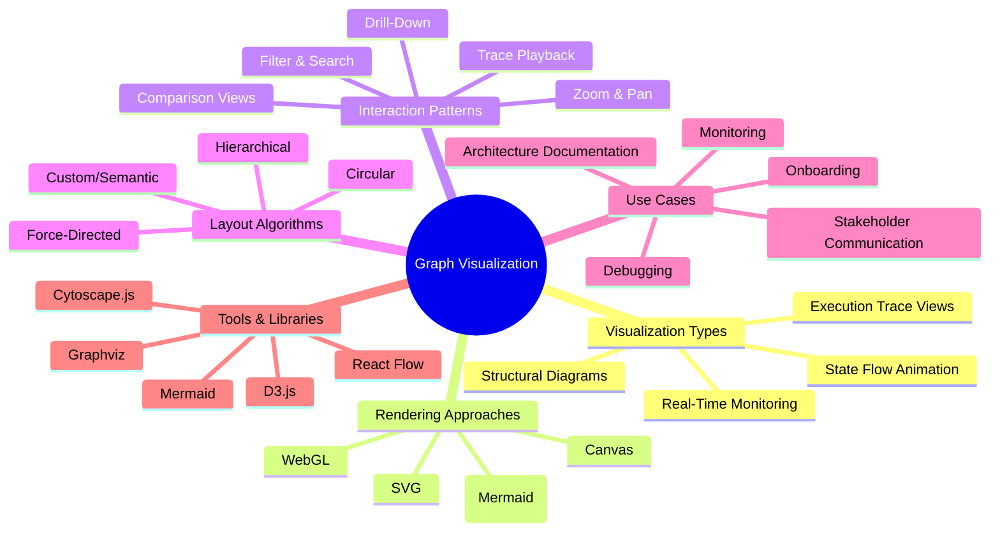
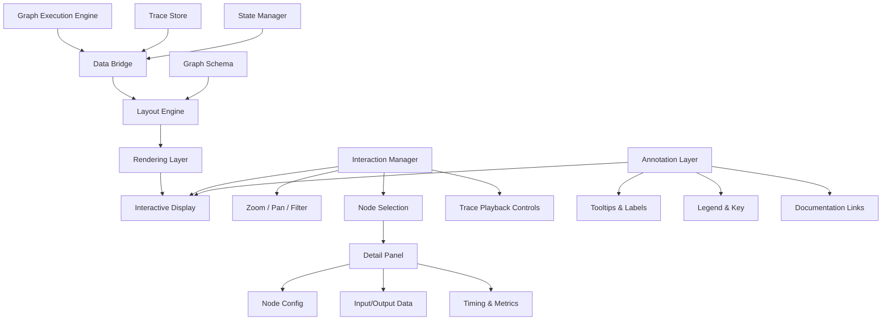
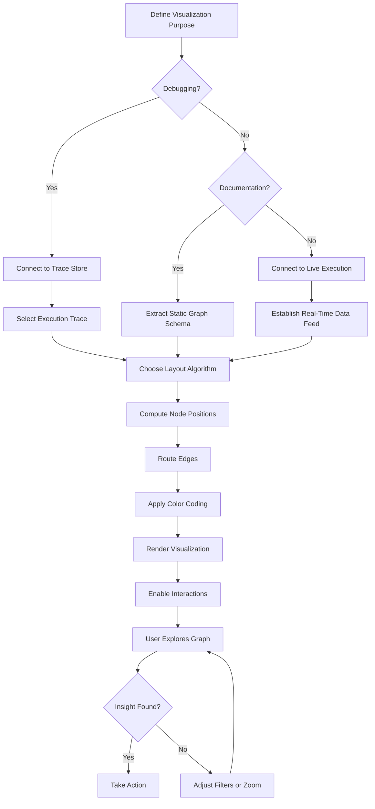
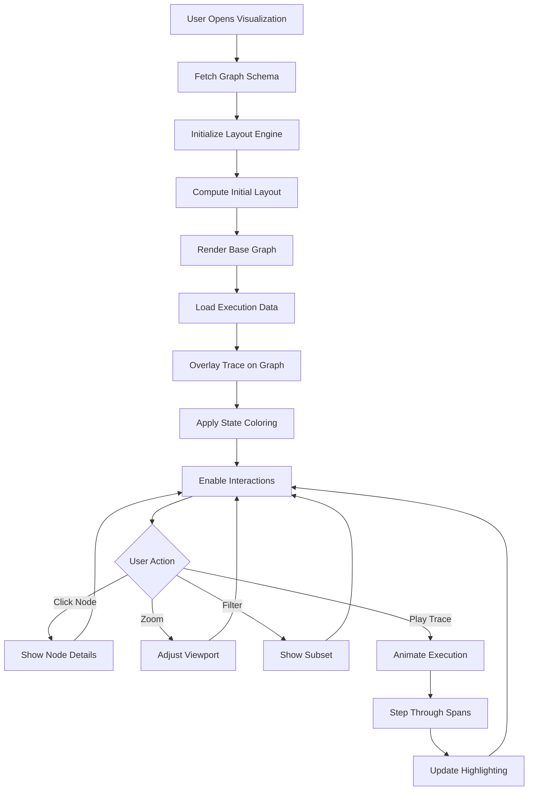
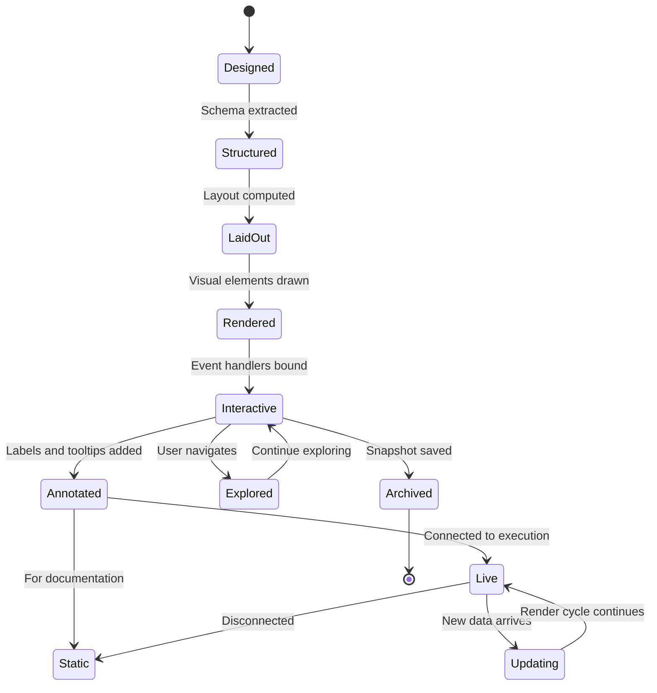
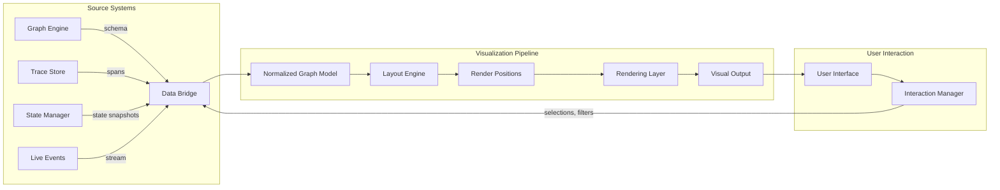
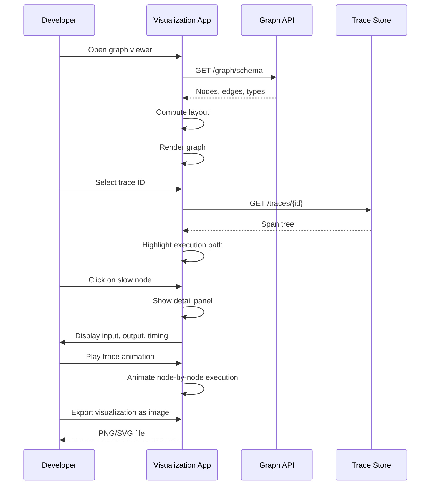

# Graph Visualization: Visualizing Graph-Based AI Systems

## 📌 Overview

Graph visualization in the context of graph engineering is the practice of creating visual representations of graph-based AI systems that make their structure, behavior, and execution characteristics comprehensible to human observers. This encompasses everything from static architecture diagrams that show the designed topology of a system to dynamic, real-time visualizations that animate data flowing through nodes and edges during live execution. Unlike mathematical graph theory visualization (which focuses on abstract graph properties), graph engineering visualization serves the practical purpose of helping engineers understand, debug, monitor, and communicate about AI systems built on interconnected prompt chains, agent networks, tool orchestrations, and state machines.

The field recognizes that graph-based AI systems are inherently difficult to understand through code alone. A system with thirty interconnected nodes, conditional edges, parallel branches, and feedback loops presents a cognitive challenge that no amount of well-structured code can fully address. Visualization transforms this complexity into spatial and visual patterns that the human brain is uniquely equipped to process, enabling engineers to spot structural issues, trace execution paths, and communicate system designs to stakeholders who may not be able to read code. The visual medium bridges the gap between the abstract logical structure of the graph and the concrete understanding needed for effective engineering.

Modern graph visualization for AI systems spans a spectrum from simple static diagrams to sophisticated interactive environments. At one end, architecture documentation uses clean node-link diagrams to communicate the intended design of a graph system. In the middle, debugging tools overlay execution traces onto the graph structure, highlighting which nodes executed, in what order, and how long each took. At the far end, real-time monitoring dashboards animate live graph execution, showing data flowing through edges and nodes lighting up as they process requests, providing an almost cinematic view of the AI system in action.

## 🎯 Learning Objectives

By studying graph visualization, practitioners will develop the ability to select and apply appropriate visualization techniques for different graph engineering purposes, understanding when a static diagram suffices and when an interactive or real-time visualization is necessary. Learners will master the design principles that make graph visualizations effective, including layout algorithms that minimize edge crossings, color coding schemes that convey node types and execution states, and interaction patterns that allow exploration without overwhelming the viewer with information.

Practitioners will also learn to build and configure visualization tools that integrate with their graph execution frameworks, capturing live execution data and rendering it as visual representations. This includes understanding the performance implications of real-time rendering, the data pipelines needed to feed visualization updates, and the architectural patterns for embedding visualizations in development workflows, CI/CD pipelines, and production monitoring systems. Furthermore, learners will develop the critical skill of reading and interpreting graph visualizations, understanding how to extract actionable insights from visual patterns like clustering, path convergence, and state flow anomalies.

## 🧠 Definition

Graph visualization for AI systems is the systematic process of transforming the abstract structure and dynamic behavior of graph-based AI architectures into visual representations that leverage spatial layout, color, shape, size, and animation to convey information that would otherwise require examining code, logs, or trace data. A visualization in this context is any rendered output that depicts nodes (representing AI components like LLM calls, retrieval operations, or agent decisions), edges (representing data flow, control flow, or state transitions), and their attributes (representing execution status, timing, data volume, or configuration) in a format that can be perceived and interpreted by a human viewer.

The definition encompasses three distinct but related visualization modes. Structural visualization depicts the static architecture of the graph — its nodes, edges, and topological properties — as designed or configured, serving as a reference for understanding the system's intended behavior. Execution trace visualization overlays runtime data onto the structural view, showing which nodes executed for a specific request, the order of execution, timing information, and any errors or exceptional conditions encountered. State flow visualization tracks how the system's state evolves over time, showing how data transforms as it passes through the graph and how state variables change at each node.

## ❓ Why It Matters

Graph visualization matters because the cognitive burden of understanding complex AI graph systems through text alone is unsustainable. A multi-agent system with twenty nodes, thirty edges, conditional branching, parallel execution, and state feedback loops can require reading and mentally assembling hundreds of lines of configuration code to form a complete mental model. Visualization collapses this cognitive work into a single visual frame, allowing engineers to grasp the system's structure in seconds rather than hours. For teams working on shared codebases, a visual representation serves as a universal language that transcends individual coding styles and preferences.

In debugging scenarios, visualization is not merely helpful but often essential. When a graph-based AI system produces unexpected output, the root cause typically lies in the interaction between multiple nodes — a context accumulation error, a state mutation that wasn't expected, or an edge condition that routed data incorrectly. Examining individual node logs in isolation rarely reveals these cross-node issues. Execution trace visualization, by contrast, shows the complete data flow path for a specific request, making it immediately apparent where data was transformed, where it was dropped, or where it was routed unexpectedly. The visual representation turns a multi-hour debugging investigation into a multi-minute visual inspection.

For production monitoring, real-time graph visualization provides an operational awareness that metrics alone cannot achieve. Dashboards showing request rates and error percentages tell you that something is wrong, but a live graph visualization shows you where in the system the problem is manifesting. If a retrieval node is slowing down, the visualization shows a visible bottleneck at that point in the graph. If an error is propagating through a particular path, the visualization highlights the affected edge in red. This spatial awareness of system health dramatically reduces mean time to diagnosis and enables faster incident response.

## 🏛️ Core Concepts

Node-link diagrams are the foundational visualization paradigm for graph-based AI systems, representing nodes as shapes (circles, rectangles, or custom icons) and edges as lines or arrows connecting them. The choice of layout algorithm determines the spatial arrangement of nodes and significantly impacts readability. Force-directed layouts use physics simulation to position connected nodes close together while pushing unconnected nodes apart, producing organic-looking layouts that reveal cluster structure. Hierarchical layouts arrange nodes in layers based on their topological depth, producing clean top-to-bottom flows that mirror execution order. Custom layouts use domain knowledge to position nodes in meaningful spatial relationships.

Execution trace visualization is the practice of overlaying runtime execution data onto a structural graph diagram. This includes highlighting which nodes executed (typically with color coding such as green for success, red for error, and gray for skipped), showing the order of execution through numbered badges or animated highlighting, displaying timing information as labels or bar widths, and indicating data flow direction with animated arrows. Execution trace visualization transforms a static architectural diagram into a dynamic storytelling tool that reveals exactly how the graph processed a specific request.

State flow visualization tracks the evolution of the system's state as it progresses through graph execution. Unlike execution trace visualization, which focuses on which nodes ran and in what order, state flow visualization focuses on how data changed at each step. This is typically rendered as a sequence of graph snapshots or as an animated transition between states, showing how the context object, conversation history, tool results, and intermediate outputs transform as they pass through each node. State flow visualization is particularly valuable for debugging context engineering issues where the quality of an LLM's output depends on the state it receives.

Interactive graph exploration enables users to navigate large or complex graph visualizations through zooming, panning, filtering, and detail-on-demand interactions. For graph systems with hundreds of nodes, showing the entire graph at once produces an unintelligible hairball of overlapping edges. Interactive exploration solves this by starting with a high-level overview and allowing users to drill into specific regions, collapse subgraphs into summary nodes, filter by node type or execution status, and click on individual nodes to inspect their details. The key principle is progressive disclosure — showing the right level of detail at each zoom level.

## 🧩 Key Components

The layout engine is the component responsible for computing the spatial positions of nodes and the routing of edges in the visualization. For graph-based AI systems, the layout engine must handle directed edges (which carry semantic meaning about data flow direction), grouped nodes (representing subgraphs or agent boundaries), and dynamic layouts (that accommodate nodes being added or removed as the graph executes). Common layout algorithms include Dagre (for hierarchical layouts), D3-force (for force-directed layouts), and ELK (for layered layouts with edge routing). The choice of layout engine significantly impacts the readability and aesthetic quality of the visualization.

The rendering layer transforms the layout data into visual output, drawing nodes, edges, labels, and decorative elements on a canvas or in a browser. Modern graph visualizations typically use web-based rendering with SVG, Canvas, or WebGL, each offering different trade-offs between scalability, interactivity, and visual quality. SVG provides crisp rendering at any zoom level and supports CSS styling and DOM events, making it ideal for small to medium graphs. Canvas and WebGL handle larger graphs more efficiently but require more complex interaction handling. Libraries like D3.js, Cytoscape.js, React Flow, and vis.js provide high-level rendering APIs for graph visualizations.

The data bridge connects the graph execution engine to the visualization, translating internal graph structures and execution events into the format expected by the visualization components. This component must handle the impedance mismatch between the graph framework's internal representation (which may include execution state, type information, and configuration details) and the visualization's data model (which focuses on visual properties like position, color, and label). The data bridge typically implements adapters for different graph frameworks, enabling a single visualization tool to work with multiple backends.

The interaction manager handles user interactions with the visualization, including zooming, panning, node selection, edge inspection, and detail panels. For execution trace visualizations, the interaction manager also provides controls for stepping through execution, filtering by time range or node type, and comparing multiple traces. Well-designed interaction managers provide keyboard shortcuts for power users while remaining intuitive for casual users, and they maintain responsiveness even when the underlying graph data is large.

The annotation and documentation layer enriches the visual representation with contextual information that aids understanding. This includes tooltips that display node descriptions and configuration, side panels that show input-output data for selected nodes, legends that explain color coding and symbol meanings, and embedded documentation that provides design rationale. Annotations transform a purely visual representation into a knowledge resource that supports both immediate debugging and long-term system understanding.

## 🧭 Mental Model

Think of graph visualization as an air traffic control radar screen for AI systems. Just as an air traffic controller monitors the positions, altitudes, and headings of dozens of aircraft on a radar display, an AI engineer monitors the states, connections, and data flows of dozens of graph nodes on a visualization dashboard. The radar screen shows both the static structure (airports, runways, and airways correspond to nodes and edges) and the dynamic activity (aircraft positions and movements correspond to data flowing through the system). When a potential conflict arises, the controller can see it on the display immediately, just as an engineer can spot a bottleneck or error in a graph visualization at a glance.

Just as radar displays use color coding (green for normal, yellow for caution, red for danger) and motion trails to convey aircraft status and trajectory, graph visualizations use color, animation, and highlighting to convey node status and data flow. The controller doesn't need to call each pilot individually to understand the traffic situation — the visual display provides a comprehensive situational awareness that would be impossible to achieve through verbal communication alone. Similarly, a graph visualization provides comprehensive system awareness that would be impossible to achieve by reading individual node logs.

## 🗺️ Mind Map

## 🏗️ Architecture Diagram

## 🔄 Workflow

## ⚙️ Internal Working

Graph visualization systems operate through a pipeline that begins with data extraction from the graph execution engine and ends with rendered visual output on a display surface. The extraction phase reads the graph's structural definition (nodes, edges, and their types) from the graph framework's schema or configuration, and optionally loads execution data from trace stores, state managers, or real-time event streams. This extracted data is normalized into an intermediate representation that the visualization pipeline can process independently of the source graph framework.

The layout phase takes the normalized graph data and computes spatial positions for each node and routing paths for each edge. Layout algorithms typically iterate through multiple passes, first establishing a rough arrangement and then refining it to minimize visual artifacts like overlapping nodes, edge crossings, and uneven spacing. For dynamic visualizations, the layout engine may need to compute incremental updates as nodes are added or removed, using techniques like constraint-based positioning to minimize visual disruption during transitions. The layout phase is often the most computationally expensive step, particularly for large graphs.

The rendering phase takes the layout output and draws the visualization on the target surface, applying visual encodings such as node shape (representing type), node color (representing status), edge thickness (representing data volume or frequency), and edge arrows (representing direction). The rendering phase also draws labels, annotations, and interactive elements. For real-time visualizations, the rendering phase runs in a continuous loop, updating the display as new execution data arrives. Performance optimization is critical in this phase, using techniques like viewport culling (only rendering visible elements), level-of-detail rendering (simplifying distant elements), and requestAnimationFrame batching.

The interaction phase processes user input events (mouse clicks, drags, keyboard shortcuts) and translates them into visualization state changes. Clicking a node might highlight its connections and open a detail panel. Dragging might pan the viewport. Scrolling might zoom in or out. The interaction manager coordinates these events with the rendering layer, ensuring that visual updates are smooth and responsive. For trace playback visualizations, the interaction manager also provides play, pause, step-forward, and step-backward controls that animate the trace data onto the structural graph.

## 🔀 Execution Flow

## 📊 Lifecycle

## 📡 Data Flow

## 🤝 Interaction Flow

## 🌍 Real-World Analogy

Consider the blueprints and operational displays used in a factory. The architectural blueprint shows where each machine is located, how they are connected by conveyor belts, and the overall flow of materials through the factory. This is analogous to a structural graph visualization that shows the designed topology of an AI system. When the factory is running, an operations dashboard shows real-time status: which machines are active, where materials are currently flowing, and which stations are experiencing delays. This is analogous to a real-time execution visualization that shows live graph activity.

When a quality issue is discovered in the factory's output, investigators don't just look at the static blueprint. They trace the specific batch of materials through the factory, checking what happened at each station, how long each process took, and where deviations from standard procedures occurred. This investigation is analogous to execution trace visualization, where a specific request is traced through the AI graph to understand where things went wrong. Just as factory investigators use floor plans, sensor data, and quality records together, AI engineers use structural diagrams, execution traces, and state flow visualizations together to form a complete understanding of their systems.

## 💡 Practical Example

A team building a multi-agent research assistant uses a graph with a query understanding node, a web search node, a document analysis node, a synthesis node, and a citation verification node. During development, they create a static visualization using React Flow that shows all five nodes connected in sequence, with the synthesis node receiving input from both the search and analysis nodes. This structural diagram serves as the team's shared reference during code reviews and design discussions.

When users report that the assistant sometimes produces responses without proper citations, the team turns to execution trace visualization. They select a problematic request from their trace store and load it into their visualization tool. The trace view shows that for this request, the citation verification node was skipped entirely — the graph took a conditional edge that bypassed verification when the synthesis node's output exceeded a length threshold. This conditional shortcut was not visible in the static diagram but is immediately obvious in the execution trace visualization, where the skipped node appears grayed out and the bypassing edge is highlighted in orange.

The team then creates a real-time monitoring visualization that shows the graph executing live, with nodes lighting up green as they process requests and a counter showing how many requests per minute bypass the verification node. This live view confirms that approximately 15% of requests skip verification, and the team adds an alert that triggers when this rate exceeds 10%. The visualization not only helped diagnose the original issue but continues to serve as a safeguard against regression.

## 🧪 Use Cases

Architecture documentation is the most common use case for static graph visualization, serving as a living reference that accurately represents the system's designed structure. Unlike traditional architecture documents that become stale as the system evolves, graph visualizations generated directly from the graph framework's schema are always up to date. Teams embed these visualizations in their internal wikis, onboarding materials, and design review documents, providing new team members with an immediate visual understanding of the system they are working with.

Debugging complex execution paths is where graph visualization delivers its highest value. When a multi-agent system produces incorrect output, the visualization of the specific execution trace reveals the exact path taken, the data at each node, and any unexpected state mutations. Engineers can step through the visualization node by node, comparing the actual execution path to the expected path and identifying the point of divergence. This visual debugging approach is dramatically faster than reading through log files and mentally reconstructing the execution flow.

Stakeholder communication benefits enormously from graph visualization. Non-technical stakeholders such as product managers, executives, and customers rarely have the technical background to understand graph system designs from code or configuration files. A well-designed visualization, however, communicates the system's capabilities and structure in an immediately accessible format. Product managers can see how different features map to graph nodes, executives can understand the system's complexity and robustness, and customers can appreciate the sophistication of the AI system they are using.

## ⚖️ Comparison

| Aspect | Static Diagrams | Trace Visualization | Real-Time Monitoring | Interactive Exploration |
|---------|----------------|-------------------|---------------------|----------------------|
| Purpose | Documentation | Debugging | Operations | Understanding |
| Data Source | Graph schema | Trace store | Live events | All sources |
| Update Frequency | On schema change | Per trace | Continuous | User-driven |
| Interactivity | None | Playback controls | Filtering | Full navigation |
| Complexity | Low | Medium | High | Very High |
| Audience | All stakeholders | Engineers | SREs, Engineers | Engineers |
| Tools | Mermaid, Graphviz | Langfuse, Phoenix | Custom dashboards | Cytoscape, React Flow |

Static diagrams and trace visualizations serve complementary purposes — static diagrams show what the system is designed to do, while trace visualizations show what it actually did. Real-time monitoring adds the temporal dimension, showing what the system is doing right now. Interactive exploration provides the most comprehensive view but requires the most sophisticated tooling and the most effort to configure. Most mature teams use a combination of all four types, with static diagrams for documentation, trace visualizations for debugging, real-time monitoring for operations, and interactive exploration for deep analysis.

## ✅ Best Practices

Choose visualization tools based on audience and purpose rather than technical sophistication. For documentation and communication, simple tools like Mermaid (which renders directly in Markdown) are far more effective than complex interactive tools, because they are easy to create, version control, and share. For debugging, integrate visualization with your tracing backend rather than building standalone visualization tools, ensuring that the visualization always reflects actual execution data. For monitoring, use the visualization tools provided by your graph framework or observability platform rather than building custom dashboards from scratch.

Design visualizations for the graph's actual complexity, not its theoretical maximum. If your graph has ten nodes, a clean hierarchical layout with clear labels is appropriate. If your graph has five hundred nodes, you need interactive exploration with progressive disclosure, filtering, and search. A common mistake is using a visualization approach designed for small graphs on a large graph, producing an unreadable hairball. Conversely, using a complex interactive tool for a simple five-node graph adds unnecessary complexity. Match the visualization complexity to the graph complexity.

Maintain a clear visual hierarchy that guides the viewer's attention to what matters most. Use size to indicate importance, color to indicate status, and position to indicate flow direction. Avoid using color as the sole differentiator, as color-blind viewers may not be able to distinguish between categories. Provide legends and tooltips that explain the visual encoding, and test visualizations with people who did not design them to ensure they are interpretable. A visualization that only its creator can understand has failed at its primary purpose.

## ❌ Common Mistakes

The most pervasive mistake is creating visualizations that attempt to show everything at once, resulting in overwhelming displays that convey no information. Effective visualization is about selective emphasis — showing the most important information prominently while making secondary information available on demand. A graph visualization that displays every node's full configuration, every edge's data type, and every trace's timing data in a single view is unreadable. Instead, start with a clean structural overview and allow users to drill into details progressively.

Another common mistake is ignoring the performance implications of visualization, particularly for real-time rendering. Rendering hundreds of nodes and edges with animations and updates every hundred milliseconds can consume significant CPU and memory resources, potentially interfering with the graph execution engine itself. Always run visualizations in separate processes or browser tabs from the graph execution engine, use efficient rendering technologies (Canvas or WebGL rather than DOM manipulation for large graphs), and implement throttling for update frequencies that exceed what the human eye can perceive.

Failing to keep visualizations synchronized with the actual graph implementation is a chronic problem in rapidly evolving AI systems. When developers add nodes, change edges, or modify node configurations, the corresponding visualizations often lag behind, showing an outdated version of the system. This is particularly dangerous when visualizations are used for debugging, as engineers may waste time investigating issues in parts of the graph that no longer exist. Automate visualization generation from the graph schema, and include visualization accuracy checks in CI/CD pipelines.

## 🚀 Advanced Topics

Three-dimensional graph visualization extends traditional 2D node-link diagrams into three-dimensional space, offering additional spatial dimensions for encoding information. While 3D visualizations are often criticized for being gimmicky, they can be genuinely useful for very large AI graphs where the additional dimension provides meaningful separation between layers or clusters. WebXR and Three.js make 3D graph visualization accessible in browsers, but the interaction design challenges (navigation in 3D space, occlusion management, and depth perception) require careful attention. Reserve 3D visualization for cases where 2D layouts genuinely cannot convey the necessary information.

AI-assisted graph layout uses machine learning models to optimize graph layouts for human readability. Traditional layout algorithms optimize for mathematical criteria like minimal edge crossings or uniform node spacing, but these criteria do not perfectly correlate with human comprehension. AI-assisted layout systems can be trained on human-rated layout quality to produce arrangements that are genuinely easier to understand. This is an emerging area that promises to significantly improve the quality of automatically generated graph visualizations, particularly for complex AI system architectures with heterogeneous node types and non-standard topologies.

Collaborative graph visualization enables multiple engineers to view and interact with the same graph visualization simultaneously, seeing each other's cursors, selections, and annotations in real time. This is particularly valuable for remote debugging sessions where one engineer narrates the execution flow while another investigates specific nodes. Tools like Excalidraw and Miro provide generic collaborative whiteboard capabilities, but purpose-built collaborative graph visualization tools that understand graph semantics (such as execution traces and node types) offer a superior experience. Building collaborative visualization typically requires a real-time synchronization layer (such as WebSockets with CRDT-based conflict resolution) and careful attention to performance to ensure smooth interaction for all participants.