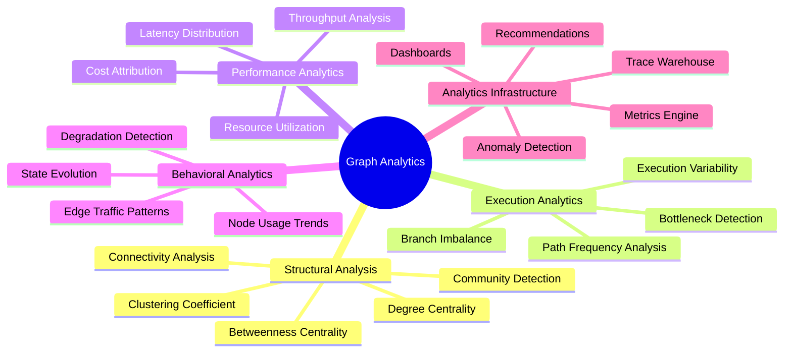
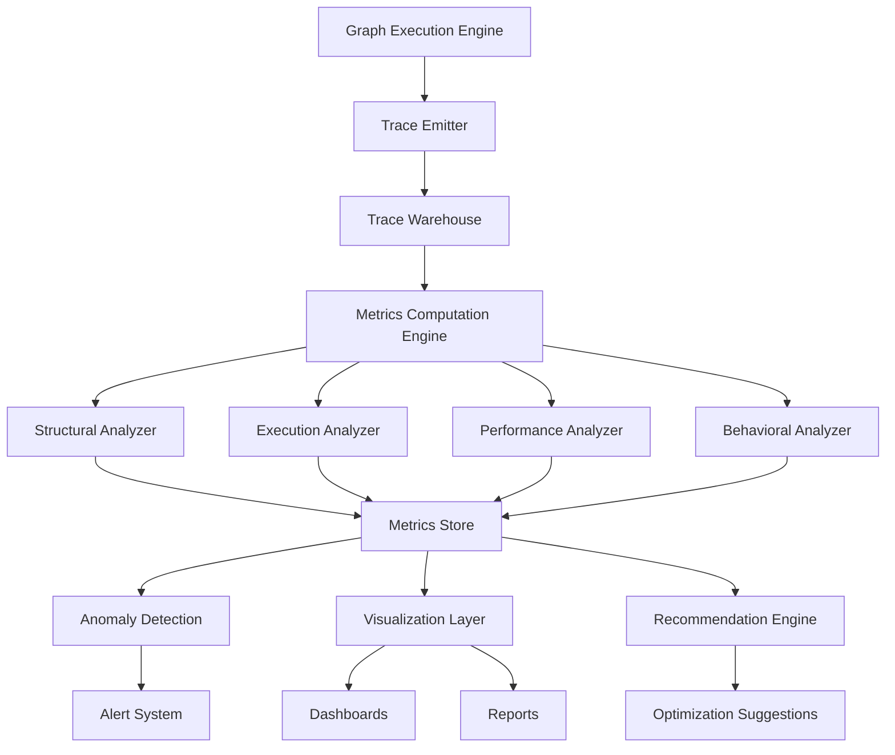
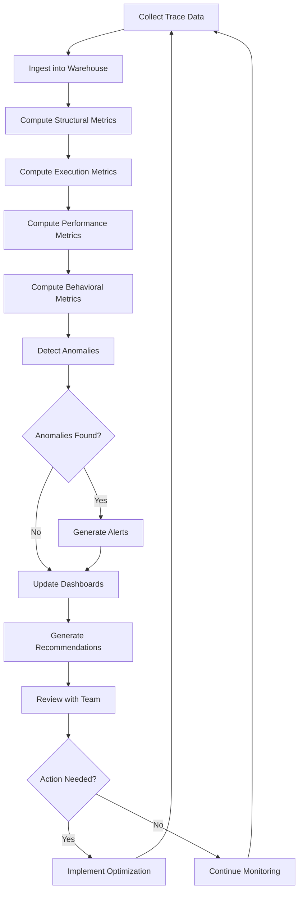
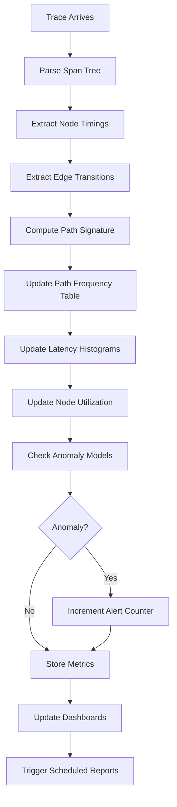
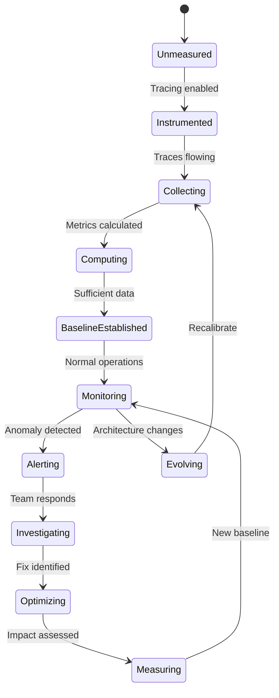
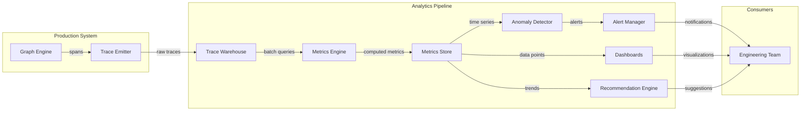
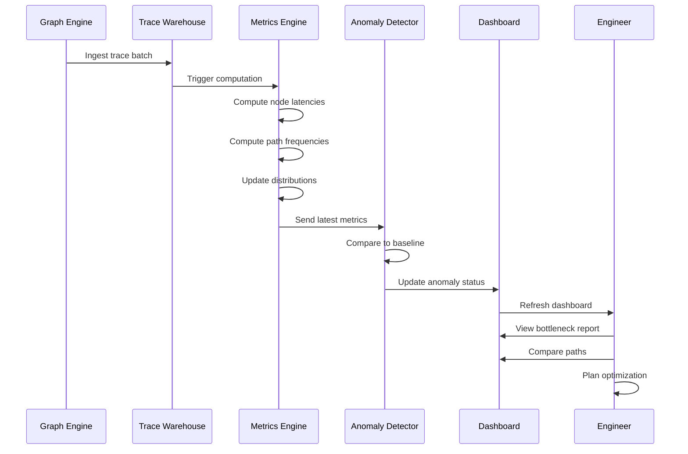

# Graph Analytics: Analyzing Graph-Based AI Systems

## 📌 Overview

Graph analytics in the context of graph engineering is the systematic practice of extracting quantitative insights from the structure, execution, performance, and behavioral characteristics of graph-based AI systems. Unlike traditional software analytics that focus on request rates, error rates, and resource utilization of individual services, graph analytics examines the relationships between components, the patterns of data flow through the system, and the emergent behaviors that arise from the interaction of multiple nodes and edges. This analytical perspective is essential for understanding, optimizing, and maintaining complex AI systems that cannot be fully understood by examining individual components in isolation.

The discipline encompasses four primary analytical dimensions: structural analysis examines the topology of the graph itself, identifying properties like node centrality (which nodes are most critical), connectivity (how well-connected the graph is), and clustering (which nodes form natural groups). Execution analytics examines how the graph actually runs, analyzing path patterns, identifying which execution paths are most common, detecting bottlenecks where execution slows down, and measuring the variability of execution behavior across different inputs. Performance analytics focuses on quantitative metrics like throughput, latency distribution, and resource consumption at both individual node and system-wide levels. Behavioral analytics examines usage patterns over time, identifying trends in how different nodes and edges are utilized, how traffic shifts in response to changes, and how the system's behavior evolves.

Together, these four dimensions provide a comprehensive analytical framework that enables graph engineers to make data-driven decisions about system design, optimization, and evolution. Structural analytics informs design decisions about graph topology, execution analytics reveals operational issues, performance analytics guides optimization efforts, and behavioral analytics supports capacity planning and architectural evolution. The integration of all four dimensions creates a holistic understanding of the graph-based AI system that transcends what any single analytical perspective can provide.

## 🎯 Learning Objectives

By studying graph analytics, practitioners will develop the ability to apply structural analysis techniques to graph-based AI systems, computing metrics like degree centrality, betweenness centrality, and clustering coefficients that reveal the relative importance and organizational structure of system components. Learners will understand how these metrics translate into practical engineering insights, such as identifying single points of failure (high betweenness centrality nodes), understanding which nodes influence the most downstream behavior (high out-degree nodes), and recognizing tightly coupled clusters that may benefit from modularization.

Practitioners will also master execution analytics techniques including path frequency analysis (determining which routes through the graph are most commonly taken), bottleneck detection (identifying nodes or edges that constrain overall throughput), and execution variability analysis (measuring how much execution behavior differs across requests). They will learn to build analytics pipelines that consume trace data, compute these metrics, and present them through dashboards and alerts that drive operational decisions. Furthermore, learners will develop proficiency in performance analytics, including latency distribution analysis (understanding not just average latency but the full distribution including tail latencies), throughput correlation analysis (identifying how changes in one node's performance affect the system as a whole), and cost-per-execution-path analysis that enables economic optimization.

## 🧠 Definition

Graph analytics for AI systems is the computational process of deriving quantitative measurements and qualitative insights from the structural properties, execution traces, performance metrics, and usage patterns of graph-based AI architectures. The practice treats the graph system as an object of analysis in its own right, applying mathematical and statistical techniques to reveal properties that are not apparent from examining individual nodes or reading source code. Analytics output takes the form of metrics (numeric measurements), distributions (statistical summaries), patterns (recurrent structures or behaviors), and anomalies (deviations from expected behavior).

Structural analytics operates on the graph's static topology — its nodes, edges, and their types — independent of any specific execution. This includes computing how many edges connect to each node (degree analysis), how often each node appears on the shortest path between other node pairs (betweenness analysis), how strongly nodes cluster into groups (community detection), and how many nodes must be removed to disconnect the graph (connectivity analysis). These structural metrics are computed once per graph configuration change and provide insights into the system's architectural properties.

Execution analytics operates on trace data from actual graph executions, analyzing the paths that requests take through the graph, the time spent at each node, the data volumes flowing through each edge, and the conditional decisions that determine routing. Execution analytics reveals the dynamic behavior of the graph, including which paths are hot (frequently traversed), which nodes are bottlenecks (consistently slow), and which conditional branches are imbalanced (one branch taken far more often than the other). These metrics are computed continuously as new traces arrive and provide insights into the system's operational behavior.

## ❓ Why It Matters

Graph analytics matters because graph-based AI systems exhibit emergent behaviors that cannot be predicted or understood by analyzing individual components. A node that performs perfectly in isolation may cause system-wide problems when placed in a graph context — for example, a retrieval node with a 200-millisecond average latency might become a critical bottleneck when positioned on the critical path of every request, or a decision node with a 95% accuracy rate might route 5% of requests down an expensive and unnecessary path. Only system-level analytics can reveal these cross-component interactions and their cumulative effects on the overall system.

Without analytics, optimization efforts are guided by intuition rather than evidence, leading to wasted effort on optimizations that have minimal impact while overlooking high-value opportunities. Analytics reveals that 80% of total latency is concentrated in three nodes, that 60% of requests follow a single execution path while 40% scatter across a dozen rarely used paths, or that a specific edge carries 90% of the graph's data traffic. These insights enable targeted optimization that maximizes impact per engineering hour invested. Teams that lack analytics often spend weeks optimizing nodes that contribute negligibly to overall performance while ignoring the true bottlenecks.

Analytics also provides the foundation for architectural evolution decisions. As an AI system grows, teams must decide where to add new capabilities, which nodes to split, which edges to parallelize, and which paths to cache. These decisions should be data-driven, informed by analytics about current usage patterns, performance characteristics, and structural properties. A team considering adding a new validation node, for instance, should use analytics to determine that the proposed position on the critical path would add unacceptable latency, leading them to position it on a parallel branch instead. Without analytics, such decisions are guesses that may require costly refactoring to correct.

## 🏛️ Core Concepts

Structural analysis applies graph-theoretic metrics to the AI system's topology to reveal architectural properties. Degree centrality measures how many edges connect to each node, identifying hubs that interact with many other components. Nodes with high in-degree receive data from many sources (like an aggregation node), while nodes with high out-degree send data to many destinations (like a broadcasting node). Betweenness centrality measures how often a node appears on the shortest path between other node pairs, identifying critical junctions whose failure would disconnect or slow the system. Nodes with high betweenness are single points of failure that warrant redundancy or circuit breaker protection.

Connectivity analysis examines how robustly the graph is connected, measuring properties like the minimum number of nodes whose removal would disconnect the graph (node connectivity), the existence of alternative paths between important node pairs (redundancy), and the identification of bridge edges whose removal would disconnect subgraphs. For AI systems, connectivity analysis reveals structural vulnerabilities — a graph where all requests must pass through a single decision node has zero path redundancy and is fragile. Clustering analysis identifies groups of nodes that are more densely connected to each other than to the rest of the graph, revealing natural module boundaries that may correspond to functional subsystems.

Execution analytics focuses on the dynamic behavior of the graph during actual request processing. Path analysis examines the sequences of nodes traversed by requests, computing path frequencies (how often each distinct path is taken), path convergence points (where multiple paths merge), and path divergence points (where a single path splits into multiple branches). Bottleneck detection identifies nodes where execution consistently slows down, using metrics like queue depth, utilization ratio, and the ratio of processing time to wait time. A node with high utilization but low throughput is a classic bottleneck indicator.

Performance analytics provides quantitative measurements of system efficiency, focusing on latency and throughput. Latency distribution analysis goes beyond average latency to examine the full probability distribution, including percentiles (p50, p90, p99), standard deviation, and the presence of bimodal distributions that indicate two distinct populations of request behavior. Throughput analysis measures the rate at which the graph processes requests, identifying how throughput varies with input characteristics, system load, and resource availability. Cost analytics extends performance analytics into the economic dimension, tracking token consumption, API costs, and compute costs per node, per path, and per request.

Behavioral analytics examines how usage patterns evolve over time, tracking metrics like node activation frequency (how often each node executes), edge traffic volume (how much data flows through each edge), and state mutation patterns (how the system's state changes over time). Behavioral analytics is particularly valuable for detecting gradual degradation (a node's latency slowly increasing over weeks), identifying underutilized components (nodes that rarely execute and may be candidates for removal), and understanding how system behavior shifts in response to external changes like user population growth or content updates.

## 🧩 Key Components

The metrics computation engine is the core analytical component that processes raw graph and trace data into quantitative metrics. This engine implements the mathematical algorithms for computing structural metrics (centrality, connectivity, clustering), execution metrics (path frequencies, bottleneck indicators), performance metrics (latency distributions, throughput rates), and behavioral metrics (usage trends, evolution patterns). The engine must handle the scale of production data efficiently, using incremental computation where possible (updating metrics as new data arrives rather than recomputing from scratch) and distributed computation for large-scale graphs.

The trace data warehouse stores the execution traces that feed execution, performance, and behavioral analytics. This component must handle high-volume trace ingestion (thousands of traces per second in production systems), support efficient querying for analytical workloads, and retain data for sufficient time periods to support trend analysis. The warehouse typically uses a columnar storage format (such as Parquet or Apache ORC) that enables fast analytical queries over large datasets. Data retention policies must balance analytical value (longer retention enables longer trend analysis) against storage costs.

The anomaly detection module applies statistical and machine learning techniques to identify unusual patterns in graph behavior. This includes detecting sudden latency spikes (indicating potential issues), identifying new execution paths that weren't previously observed (potentially indicating unexpected routing), and flagging nodes whose error rates have increased beyond normal bounds. Anomaly detection transforms analytics from a reactive tool (used when problems are already known) into a proactive tool (alerting to problems before they impact users). The module typically uses a combination of threshold-based rules (for known patterns) and statistical models (for detecting novel anomalies).

The visualization and reporting layer presents analytical results through dashboards, reports, and alerts that make insights accessible to engineers and stakeholders. Dashboards display real-time and historical metrics using charts, heatmaps, and graph overlays. Reports provide periodic summaries of system health, performance trends, and optimization recommendations. Alerts notify engineers when metrics exceed configured thresholds, enabling rapid response to emerging issues. The visualization layer is the interface between the analytical system and its human consumers, and its design determines how effectively analytical insights drive action.

The recommendation engine synthesizes analytical findings into actionable optimization recommendations. This advanced component uses the patterns identified by other analytical components to suggest specific changes, such as adding a cache before a frequently accessed retrieval node, parallelizing a sequential section that is causing a bottleneck, or removing an underutilized node to reduce complexity. The recommendation engine represents the highest level of analytical maturity, transforming data into decisions.

## 🧭 Mental Model

Think of graph analytics as the traffic analysis department for a city's road network. The structural analysis is equivalent to studying the road map itself — identifying critical intersections (high betweenness centrality), major highways (high traffic capacity edges), and neighborhoods (clusters of closely connected streets). The execution analytics is equivalent to monitoring actual traffic flow — determining which routes are most congested (hot paths), where bottlenecks form (busy intersections), and how traffic patterns change during rush hours (load-dependent behavior). The performance analytics measures commute times (latency) and road capacity utilization (throughput). The behavioral analytics tracks how traffic patterns evolve as new neighborhoods are built or roads are closed (system evolution).

Just as a city planner uses traffic analytics to decide where to build new roads, add traffic lights, or implement carpool lanes, a graph engineer uses graph analytics to decide where to add caching, implement parallelization, or optimize node configurations. The city planner would never make infrastructure decisions based on intuition alone — they study traffic counts, congestion patterns, and commute time data. Similarly, the graph engineer should never make architectural decisions without analytics showing current usage patterns, performance bottlenecks, and structural vulnerabilities.

## 🗺️ Mind Map

## 🏗️ Architecture Diagram

## 🔄 Workflow

## ⚙️ Internal Working

Graph analytics systems operate through a continuous cycle of data collection, computation, and insight delivery. The collection phase receives execution traces from the graph engine, normalizes their format, and stores them in the trace warehouse. Each trace contains a complete record of a single request's journey through the graph, including node activations, edge traversals, timing data, input-output payloads, and state mutations. The warehouse indexes this data for efficient querying by time range, trace ID, node ID, and execution path.

The computation phase runs analytical algorithms against the collected data on a scheduled or streaming basis. Structural metrics are recomputed whenever the graph schema changes (which may be infrequent), while execution, performance, and behavioral metrics are computed on rolling time windows (such as the last hour, day, or week). The computation engine uses optimized algorithms for each metric type — for example, betweenness centrality uses Brandes' algorithm, path frequency analysis uses suffix trees or trie structures, and latency distribution analysis uses streaming percentile algorithms like t-digest that maintain approximate distribution summaries without storing all individual values.

The insight delivery phase transforms computed metrics into actionable outputs. Anomaly detection compares current metrics against historical baselines and configured thresholds, triggering alerts when deviations exceed significance levels. Dashboards are updated with the latest metrics, showing both current values and historical trends. The recommendation engine applies rules and models to identify optimization opportunities, ranking them by expected impact and implementation complexity. The entire pipeline is designed for low latency between data collection and insight delivery, ensuring that engineers see fresh analytics when they need them.

## 🔀 Execution Flow

## 📊 Lifecycle

## 📡 Data Flow

## 🤝 Interaction Flow

## 🌍 Real-World Analogy

Consider the analytics department of a large hospital network. The structural analysis is equivalent to mapping the hospital's organizational chart — identifying which departments interact with the most other departments, which doctors are critical referral points, and which departments form natural clusters (like the surgical suite or the emergency department). The execution analytics is equivalent to tracking patient flow through the hospital — determining which pathways patients take from admission to discharge, where wait times are longest, and how often patients are referred between departments.

The performance analytics measures treatment outcomes and resource utilization — how long patients stay, how often readmissions occur, and how efficiently operating rooms are used. The behavioral analytics tracks how patient volumes and treatment patterns change over time — which departments are growing, which are declining, and how seasonal patterns affect resource needs. Just as hospital administrators use these analytics to make decisions about staffing, facility expansion, and process improvement, graph engineers use graph analytics to make decisions about node optimization, graph restructuring, and resource allocation.

## 💡 Practical Example

A team operating a customer support AI graph with fifteen nodes analyzes their trace data over a one-month period. Structural analysis reveals that the knowledge base retrieval node has the highest betweenness centrality in the graph, meaning every request passes through it and its failure would halt all processing. The team decides to add a fallback retrieval mechanism. Execution analysis shows that 72% of requests follow a simple three-node path (classify, retrieve, generate), while 28% follow longer paths involving clarification loops and escalation nodes. This reveals that most requests are straightforward, suggesting that a fast-path optimization for the common case would improve average latency significantly.

Performance analysis shows that the retrieval node's p99 latency is 8 seconds (compared to a p50 of 200 milliseconds), indicating severe tail latency caused by occasional complex queries that stress the knowledge base. The team implements query optimization and result caching, reducing p99 to 1.5 seconds. Behavioral analysis reveals that the escalation node's activation rate has increased from 5% to 15% over the past month, correlating with a recent knowledge base update that removed some documentation. This behavioral trend alerts the team to a content gap that is causing more requests to require human escalation, a problem that would have been invisible without analytics.

## 🧪 Use Cases

Capacity planning relies on behavioral analytics to predict future resource needs based on usage trends. By analyzing how node activation frequencies and edge traffic volumes change over time, teams can forecast when they will need additional compute resources, when their LLM API budgets will be exhausted, and when their trace storage will exceed capacity. Without behavioral analytics, capacity planning is based on rough estimates that often prove inaccurate, leading to either over-provisioning (wasting money) or under-provisioning (causing outages during traffic spikes).

Quality assurance uses execution analytics to detect deviations from expected behavior. By establishing baseline path frequency distributions and monitoring for shifts, teams can detect when the graph starts routing requests differently than intended. A sudden appearance of a previously unobserved execution path might indicate a bug in a conditional edge's logic, a corrupted state that is causing unexpected routing, or a new type of user request that the graph wasn't designed to handle. Early detection of these behavioral shifts enables rapid investigation before they impact a large number of users.

Cost optimization uses performance analytics to identify the most expensive execution paths and nodes, enabling targeted cost reduction. Analytics might reveal that 40% of total LLM cost is driven by requests that pass through a specific refinement loop, that 25% of token consumption occurs in a single summarization node, or that 15% of requests trigger redundant retrieval calls that produce no additional value. These insights enable precise cost reduction measures — adding a pre-check that avoids the refinement loop when the initial output is already good enough, reducing the summarization node's context window, or deduplicating retrieval calls.

## ⚖️ Comparison

| Aspect | Structural Analysis | Execution Analytics | Performance Analytics | Behavioral Analytics |
|---------|-------------------|-------------------|---------------------|---------------------|
| Data Source | Graph schema | Trace data | Trace + metrics | Historical metrics |
| Time Horizon | Static | Per-request | Aggregated windows | Days to months |
| Primary Output | Metrics, clusters | Path frequencies | Distributions, rates | Trends, anomalies |
| Key Questions | What is the topology? | What paths are taken? | How fast/slow? | How is usage changing? |
| Update Frequency | On schema change | Per trace | Minutes to hours | Daily to weekly |
| Primary Use | Design review | Debugging, optimization | Performance tuning | Capacity planning |

Each analytical dimension provides unique insights that complement the others. Structural analysis is the foundation, describing what the system is. Execution analytics adds the dynamic dimension, describing what the system does. Performance analytics adds the efficiency dimension, describing how well the system does it. Behavioral analytics adds the temporal dimension, describing how the system's behavior evolves. A mature analytics practice employs all four dimensions, cross-referencing insights between them for a comprehensive understanding.

## ✅ Best Practices

Establish baseline metrics before making optimization decisions. Too many teams begin optimizing based on a single observation (a slow request, a high error rate) without understanding the statistical distribution of normal behavior. Collect at least one week of trace data to establish baselines for path frequencies, latency distributions, and error rates before making any changes. Baselines provide the reference point against which optimization impact is measured, and they enable anomaly detection by defining what constitutes normal behavior.

Correlate metrics across analytical dimensions rather than examining each in isolation. A node with high latency might be unremarkable if it's on a rarely used execution path, or critically important if it's on the most common path. A sudden increase in path diversity might indicate a problem (users encountering unexpected scenarios) or an improvement (the system handling a wider variety of inputs). Always cross-reference structural metrics (what is possible), execution metrics (what actually happens), performance metrics (how efficiently it happens), and behavioral metrics (how it's changing) to form complete analytical conclusions.

Automate analytics delivery rather than requiring manual queries. Set up automated dashboards that refresh with the latest metrics, configure alerts for significant anomalies, and schedule periodic reports that summarize system health. Engineers should be able to check the analytics dashboard as naturally as they check their email, without needing to write custom queries or navigate complex analytical tools. The friction of accessing analytics directly determines how much value the team derives from the analytical system.

## ❌ Common Mistakes

Focusing exclusively on average metrics while ignoring distribution tails is one of the most consequential mistakes in graph analytics. An average latency of 500 milliseconds sounds fine until you discover that the p99 is 15 seconds, meaning 1% of users experience catastrophically slow responses. In AI systems, tail behavior is often more important than average behavior, because users remember their worst experiences more vividly than their average experiences. Always analyze the full distribution using percentiles and histograms, and set alerting thresholds on tail metrics rather than averages.

Analyzing the graph at a single level of granularity misses critical insights. Looking only at node-level metrics misses inter-node patterns like correlated slowdowns. Looking only at system-level metrics misses which specific nodes are responsible for observed issues. Looking only at the current time window misses long-term trends. Effective graph analytics operates at multiple levels of granularity simultaneously — individual node metrics, path-level metrics, and system-wide metrics, each at multiple time scales (real-time, hourly, daily, weekly). A common mistake is building analytics that only operates at one level and thus provides an incomplete picture.

Ignoring the cost dimension in performance analytics leads to systems that are fast but economically unsustainable. In AI systems, the most performant configuration (using the largest model, retrieving the most documents, running the most refinement loops) is often the most expensive. Analytics that tracks only latency and throughput without tracking token consumption, API costs, and compute costs can lead teams to optimize for speed while bankrupting their API budget. Always include cost metrics in performance analytics, and evaluate optimizations in terms of cost-performance trade-offs rather than performance alone.

## 🚀 Advanced Topics

Predictive graph analytics uses machine learning models to forecast future system behavior based on historical patterns. By training time-series models on historical metrics data, predictive analytics can forecast upcoming load increases, predict when a node will reach capacity, and estimate the impact of planned changes before they are deployed. For example, a predictive model might forecast that the retrieval node's p99 latency will exceed the SLA threshold within two weeks at the current growth rate, giving the team time to implement scaling measures before users are affected. Implementing predictive analytics requires sufficient historical data (typically several months) and careful model selection to avoid overfitting to noise.

Comparative graph analytics enables A/B testing of graph configurations by comparing analytics between two or more running versions of the graph. This is particularly valuable for testing architectural changes, where the impact on path distributions, latency profiles, and cost structures cannot be predicted from first principles. Comparative analytics requires careful experimental design including traffic splitting, statistical significance testing, and controlled variables. The key insight is that many graph optimizations have non-obvious effects — adding a cache might reduce latency for cache-hit requests but increase latency for cache-miss requests due to the additional lookup overhead, and only comparative analytics can reveal the net effect.

Causal graph analytics goes beyond correlation to establish causal relationships between graph properties and system outcomes. While standard analytics can tell you that a node's high latency correlates with user dissatisfaction, causal analytics can determine whether the latency actually causes dissatisfaction or whether both are caused by a confounding factor like complex user queries. Techniques like instrumental variables, regression discontinuity, and controlled experiments enable causal inference, providing the strongest possible evidence for optimization decisions. Causal analytics represents the frontier of graph analytics maturity, requiring both sophisticated statistical methods and careful experimental design, but delivering the most reliable actionable insights.