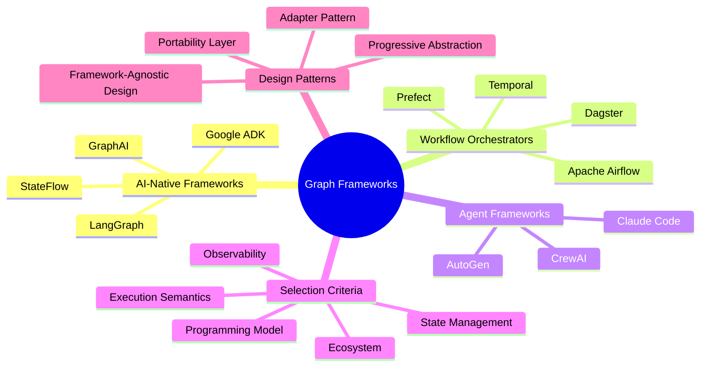
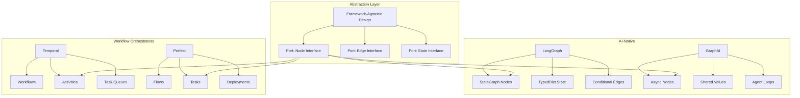
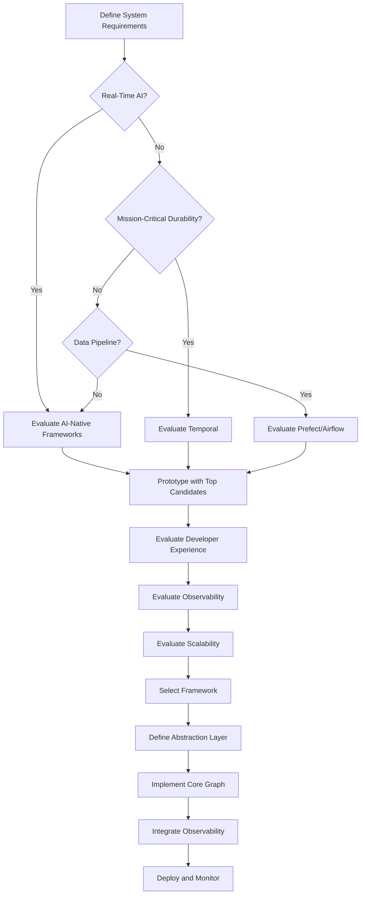
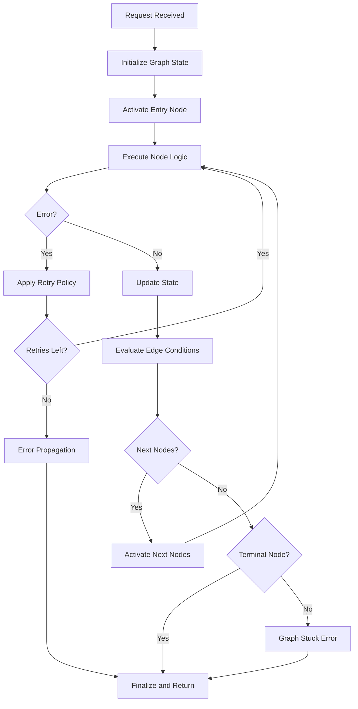
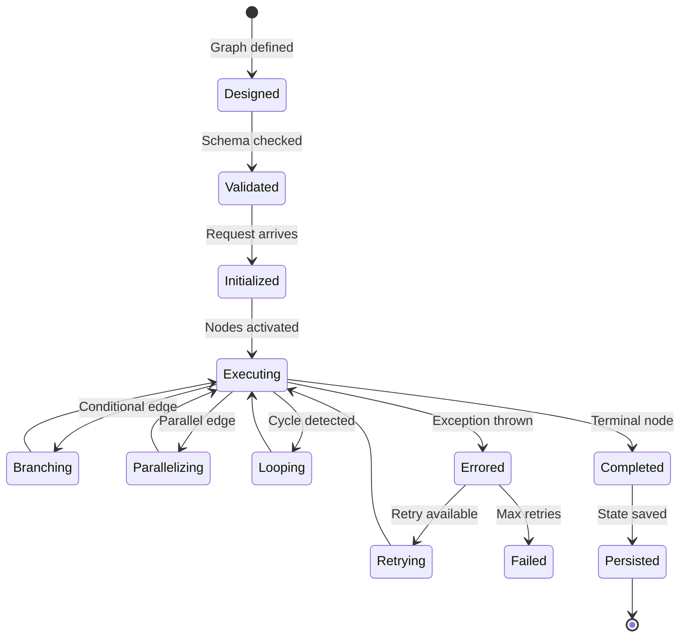
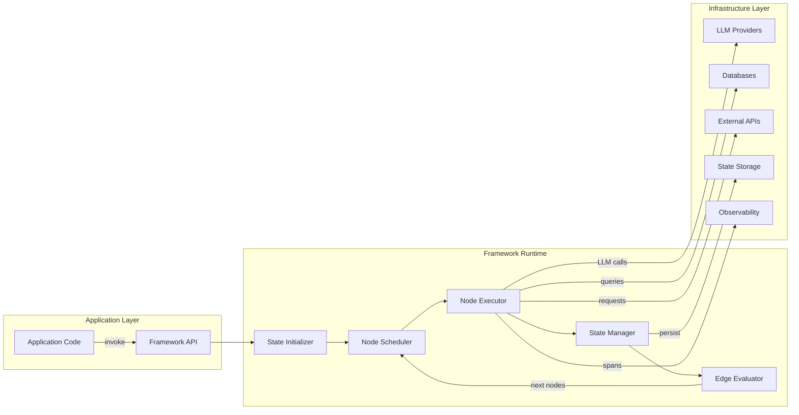
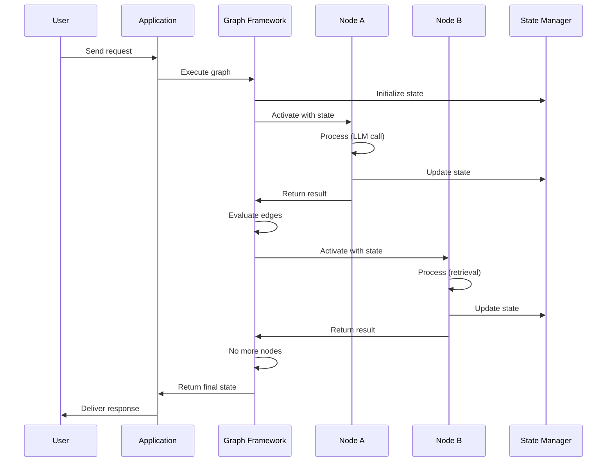

# Graph Frameworks: Frameworks for Graph-Based AI Systems

## 📌 Overview

Graph frameworks are software libraries and platforms that provide the foundational abstractions, runtime environments, and tooling for building, executing, and managing graph-based AI systems. These frameworks encode the core concepts of graph engineering — nodes as processing units, edges as data and control flow connectors, state as shared context, and execution as graph traversal — into reusable components that eliminate the need for teams to build graph infrastructure from scratch. The landscape of graph frameworks has expanded rapidly as AI systems have grown more complex, with each framework offering a distinct approach to the fundamental challenges of graph-based system design.

The current generation of graph frameworks can be broadly categorized into AI-native graph frameworks (LangGraph, GraphAI, StateFlow) that are designed specifically for LLM-based systems, general-purpose workflow orchestrators (Prefect, Temporal, Apache Airflow) that can be adapted for AI workloads, and agent frameworks (CrewAI, AutoGen) that implement graph-like patterns through agent coordination. Each category has distinct strengths: AI-native frameworks provide first-class support for LLM calls, state management, and prompt-based nodes. General-purpose orchestrators provide robust execution guarantees, scalability, and integration with existing infrastructure. Agent frameworks provide high-level abstractions for multi-agent collaboration.

Choosing the right framework is one of the most consequential architectural decisions in a graph-based AI project, as it determines the development experience, operational characteristics, and long-term flexibility of the system. The wrong framework choice can lead to fighting against the framework's design to achieve basic requirements, or being locked into a technology that cannot scale with the system's growth. Framework selection requires careful evaluation of the system's requirements against each framework's capabilities, philosophy, and ecosystem.

## 🎯 Learning Objectives

By studying graph frameworks, practitioners will develop the ability to evaluate and compare frameworks across multiple dimensions including programming model, state management approach, execution semantics, extensibility, observability integration, and ecosystem maturity. Learners will understand the fundamental design decisions that differentiate frameworks — such as whether the graph is defined declaratively or imperatively, whether state is centralized or distributed, whether execution is synchronous or asynchronous, and whether the framework provides built-in support for human-in-the-loop patterns.

Practitioners will also master the art of framework-agnostic design, learning to architect graph-based AI systems in ways that can be implemented across multiple frameworks. This includes understanding which aspects of a graph system are framework-independent (the logical topology, the data flow, the state schema) and which are framework-specific (the node implementation API, the state access patterns, the error handling mechanisms). Framework-agnostic design enables teams to migrate between frameworks as their requirements evolve, rather than being locked into an initial choice. Furthermore, learners will develop practical skills in the major frameworks, enabling them to make informed comparisons based on hands-on experience rather than marketing materials.

## 🧠 Definition

A graph framework is a software platform that provides structured abstractions for defining, executing, and observing graph-based AI systems, where the graph represents interconnected processing steps (nodes) connected by data and control flow pathways (edges) operating on shared state. A framework provides at minimum a node definition API (how to create processing units), an edge definition API (how to connect nodes), an execution engine (how to traverse the graph), and a state management layer (how to share data between nodes). Beyond these minimum requirements, frameworks vary widely in the additional capabilities they provide.

AI-native graph frameworks are designed specifically for systems where nodes primarily involve LLM calls, tool invocations, and AI-driven decisions. These frameworks provide first-class support for prompt templates, model configuration, tool registration, conversation memory, and AI-specific state management. They typically offer built-in integrations with LLM providers, vector stores, and AI observability tools. LangGraph, developed by LangChain, is the most prominent example, providing a stateful graph abstraction where nodes are Python functions that read from and write to a shared state dictionary, edges can be conditional functions that determine routing based on state, and the framework manages the execution lifecycle including retries, streaming, and human-in-the-loop breakpoints.

General-purpose workflow orchestrators provide graph-like execution semantics but are not specifically designed for AI workloads. These frameworks excel at providing robust execution guarantees (exactly-once processing, durable execution, automatic retry), scalability (distributed execution across clusters), and integration with existing infrastructure (databases, message queues, cloud services). Temporal and Prefect are the leading examples, both providing durable workflow execution that survives process crashes and node failures. Adapting these frameworks for AI workloads requires wrapping LLM calls and AI operations in the framework's task or activity abstraction, but benefits from the framework's production-grade reliability.

## ❓ Why It Matters

Graph frameworks matter because building graph-based AI systems from scratch requires solving a remarkable number of infrastructure problems that are largely independent of the system's actual AI logic. Every graph system needs an execution engine that handles node scheduling, edge routing, conditional branching, parallel execution, and loop detection. Every system needs state management that handles concurrent access, persistence, and versioning. Every system needs error handling that manages retries, fallbacks, and error propagation. Building these capabilities correctly is a significant engineering effort that distracts from the actual goal of building the AI system.

Frameworks encapsulate this infrastructure, allowing teams to focus on the nodes and edges that define their system's unique behavior rather than the execution engine that runs them. A team using LangGraph, for example, can define a multi-agent research system in a few hundred lines of code, while building the same system from scratch would require thousands of lines of infrastructure code for state management, execution scheduling, and error handling. The framework investment pays dividends throughout the system's lifetime, as the framework's built-in capabilities evolve and improve with each release, providing new features (like streaming support or new integrations) without additional development effort.

Frameworks also provide a common language and set of patterns that enable knowledge sharing across teams and organizations. When a team uses LangGraph, they can leverage the community's collective experience with stateful graph patterns, draw on published examples and tutorials, and hire engineers who already have framework expertise. This ecosystem effect compounds over time, making framework-based systems easier to build, maintain, and staff than custom implementations. The framework's community also drives the development of complementary tools (visualizers, debuggers, testing utilities) that would not exist for a custom implementation.

## 🏛️ Core Concepts

The programming model is the most fundamental differentiator between frameworks, defining how developers express the graph's structure and behavior. Declarative models (like LangGraph's StateGraph) allow developers to define the graph by adding nodes and edges to a graph builder, with the framework handling execution. Imperative models (like Temporal's workflows) allow developers to write sequential code that the framework records and replays for durability. Hybrid models allow both approaches for different parts of the system. The programming model determines the development experience, the ease of dynamic graph modification, and the types of patterns that are natural to express.

State management is the mechanism by which data is shared between nodes and persisted across the graph's execution lifecycle. Centralized state models maintain a single state object that all nodes read from and write to (like LangGraph's state dictionary). Distributed state models allow nodes to maintain their own local state with explicit message passing between nodes (like actor-based frameworks). Functional state models treat state as immutable, with each node producing a new state version from the previous one. The state management approach affects concurrency behavior, debuggability, and the complexity of implementing features like checkpoints and rollbacks.

Execution semantics define how the graph is traversed, including the order of node activation, the handling of parallel branches, the management of loops and cycles, and the behavior when errors occur. Synchronous execution models process one node at a time in a deterministic order, simplifying debugging but limiting throughput. Asynchronous execution models activate multiple nodes concurrently, improving throughput but introducing non-determinism. Durable execution models record each step so that execution can survive process crashes and resume from the last completed node. The execution semantics determine the system's reliability, scalability, and debuggability characteristics.

Extensibility defines how easily the framework can be extended with custom node types, edge behaviors, state management strategies, and execution policies. Some frameworks provide plugin architectures that allow deep customization without modifying framework code. Others provide extension points at specific layers (custom node wrappers, custom state serializers) but are more rigid at other layers. Framework extensibility determines how much freedom teams have to implement patterns that the framework's designers didn't anticipate, which becomes increasingly important as systems grow more complex and require more specialized behaviors.

## 🧩 Key Components

The graph definition API is the developer-facing interface for specifying the graph's structure — adding nodes, connecting edges, defining conditional routing, and configuring execution parameters. A well-designed graph definition API is expressive enough to capture complex topologies (parallel branches, conditional routing, dynamic subgraphs) while remaining intuitive enough that developers can understand a graph definition at a glance. The API's design philosophy (declarative versus imperative, fluent builder versus configuration objects) significantly impacts the developer experience and the readability of graph definitions.

The execution engine is the framework component that runs the graph, scheduling node activations, managing the execution context, handling edge routing, and coordinating parallel execution. The execution engine's design determines fundamental characteristics like whether execution is deterministic, whether it can survive process crashes, how it handles node failures and retries, and how it manages resource allocation. The execution engine is typically the most complex component of a graph framework and the one that most differentiates production-grade frameworks from prototype tools.

The state manager handles the creation, reading, updating, and persistence of the graph's state throughout its execution lifecycle. This component manages state versioning (maintaining a history of state changes), state persistence (saving state to durable storage for crash recovery), state serialization (converting state to and from formats suitable for storage and transmission), and state access control (managing concurrent reads and writes in parallel execution scenarios). The state manager's design significantly impacts the graph system's ability to support features like time-travel debugging, execution replay, and checkpoint-based recovery.

The integration layer connects the framework to external systems including LLM providers, vector databases, tool registries, message queues, and observability platforms. A rich integration layer allows nodes to interact with these systems through framework-provided abstractions rather than direct API calls, enabling consistent error handling, retry logic, and observability across all integrations. The breadth and quality of the integration layer is a major factor in framework selection, as teams want to leverage existing integrations rather than building their own.

The observability integration provides built-in support for tracing, logging, and metrics collection that enables teams to understand their graph's behavior in production. Frameworks with strong observability integration automatically generate traces that capture node activations, edge traversals, and state changes, provide structured logging with correlation IDs, and expose metrics for dashboard creation. Frameworks with weak observability integration require teams to add their own instrumentation, which is tedious, error-prone, and often incomplete.

## 🧭 Mental Model

Think of graph frameworks as operating systems for AI workflows, providing the fundamental services that every graph-based application needs, just as an operating system provides services that every application needs. Just as an operating system provides process scheduling (analogous to node execution), memory management (analogous to state management), inter-process communication (analogous to edge data flow), and file systems (analogous to state persistence), a graph framework provides node scheduling, state management, data flow between nodes, and state persistence.

Just as developers choose an operating system based on their application's requirements — Linux for servers needing stability and customization, macOS for creative applications needing UI polish, Windows for enterprise applications needing compatibility — developers choose a graph framework based on their AI system's requirements. LangGraph might be chosen for an LLM-native application that needs tight integration with the LangChain ecosystem. Temporal might be chosen for a mission-critical AI pipeline that needs durable execution and enterprise-grade reliability. Prefect might be chosen for a data-science team that needs Pythonic workflows with hybrid cloud execution. The "right" framework depends entirely on the specific requirements of the system being built.

## 🗺️ Mind Map

## 🏗️ Architecture Diagram

## 🔄 Workflow

## ⚙️ Internal Working

Graph frameworks operate through a runtime loop that receives a request, initializes the graph's state, activates the entry node, and processes the graph to completion. The initialization phase creates a fresh execution context, loads the graph definition, initializes the state to its starting values, and sets up any required resources (database connections, API clients, trace context). This phase is typically fast but must handle configuration validation, ensuring that the graph definition is well-formed (no dangling edges, no missing node implementations) before execution begins.

The execution phase processes the graph by maintaining a work queue of active nodes, activating nodes from the queue, executing their logic, processing the results, and determining which nodes to activate next based on edge conditions. For each node activation, the framework creates an execution context that provides access to the current state, trace information, and any node-specific configuration. The node executes its logic (which may involve LLM calls, tool invocations, or data transformations), returns its output, and the framework updates the state and evaluates edge conditions to determine the next nodes to activate.

The completion phase handles the graph's termination, whether due to successful completion (reaching a terminal node), error termination (an unhandled exception), or timeout (exceeding a maximum execution duration). Upon completion, the framework performs cleanup (releasing resources, finalizing traces), persists the final state (if configured for state persistence), and returns the result to the caller. For durable execution frameworks like Temporal, the completion phase also involves recording the execution outcome in the workflow history, enabling future replay if needed.

## 🔀 Execution Flow

## 📊 Lifecycle

## 📡 Data Flow

## 🤝 Interaction Flow

## 🌍 Real-World Analogy

Consider the difference between building a house with prefabricated components versus building one entirely from raw lumber. Prefabricated frameworks provide pre-built walls, trusses, and panels that snap together according to standardized connection points, dramatically reducing construction time and ensuring structural soundness through tested designs. Building from raw lumber gives you complete freedom but requires expertise in structural engineering, framing, and connection design that most builders would rather not reinvent.

LangGraph is like a prefabricated system designed specifically for smart homes — its components are pre-wired for AI-specific needs like LLM connections and state management. Temporal is like an industrial-grade building system designed for factories — its components are over-engineered for reliability and durability. Prefect is like a modular building system popular with architects — its components are flexible and composable, allowing creative designs. The right choice depends on whether you're building a smart home, a factory, or an architecturally unique building — and just as with real buildings, the foundation you choose constrains what you can build for years to come.

## 💡 Practical Example

A startup building an AI-powered legal document analysis system evaluates three frameworks for their graph architecture. The system needs to process documents through extraction, classification, clause analysis, risk assessment, and summary generation nodes, with conditional routing based on document type and complexity. The team prototypes the system in LangGraph first, finding that the stateful graph model maps naturally to their needs — the shared state dictionary holds the document content, extraction results, and analysis outputs, and conditional edges route based on document classification.

However, the team discovers that LangGraph's lack of built-in durable execution is a concern for their use case, where document processing can take minutes and they need to survive server restarts. They prototype the same system on Temporal, finding that the durable workflow model provides the reliability they need but makes the AI-specific logic more verbose — each LLM call must be wrapped in a Temporal activity, and the state management is less intuitive than LangGraph's shared dictionary. They ultimately choose LangGraph with a custom checkpoint persistence layer, accepting the additional development effort to get the best of both worlds: LangGraph's AI-native developer experience with Temporal-style durability.

Six months later, the team needs to add human review nodes that pause execution for attorney approval. LangGraph's built-in interrupt mechanism makes this straightforward, validating their framework choice. Had they chosen a framework without built-in human-in-the-loop support, adding this capability would have required significant custom development.

## 🧪 Use Cases

Multi-agent AI systems are the primary use case for AI-native graph frameworks like LangGraph and GraphAI. These systems require coordinating multiple LLM-powered agents that share state, communicate through structured messages, and make dynamic routing decisions based on intermediate results. LangGraph's stateful graph model provides a natural foundation for multi-agent coordination, where the shared state holds conversation history, agent outputs, and routing signals, and conditional edges implement the agent coordination logic. The framework handles the complexity of managing multiple concurrent agent executions, aggregating their results, and handling failures gracefully.

Production AI pipelines that require enterprise-grade reliability are best served by durable execution frameworks like Temporal. These pipelines process high-value transactions where failure is unacceptable — such as AI-powered financial analysis, medical diagnosis support, or legal document processing. Temporal's durable execution ensures that every step of the pipeline is recorded and can be replayed if the process crashes, its automatic retry handles transient failures in LLM API calls and database operations, and its workflow versioning enables zero-downtime deployments of pipeline updates. The trade-off is a more verbose programming model that requires wrapping AI operations in Temporal activities.

Data-science-driven AI workflows that blend traditional data processing with AI analysis are well-served by Pythonic workflow frameworks like Prefect and Dagster. These frameworks provide native integration with the Python data science ecosystem (Pandas, NumPy, scikit-learn) while also supporting LLM calls and AI operations. They excel at workflows that involve data ingestion, preprocessing, AI analysis, and result publishing, where the AI component is one step in a longer pipeline. Their deployment models (cloud-managed or self-hosted) and scheduling capabilities make them natural choices for teams that already use these tools for non-AI workflows.

## ⚖️ Comparison

| Feature | LangGraph | GraphAI | Temporal | Prefect | CrewAI |
|---------|-----------|---------|----------|---------|--------|
| Primary Focus | LLM Graphs | Agent Graphs | Durable Workflows | Python Workflows | Multi-Agent |
| State Model | Centralized TypedDict | Shared Values | Workflow State | Task Results | Agent Memory |
| Durability | Optional | No | Yes | Optional | No |
| Human-in-Loop | Built-in | Limited | Supported | Supported | Basic |
| Language | Python | TypeScript | Go/Python/Java | Python | Python |
| LLM Integration | Native | Native | Via Activities | Via Tasks | Native |
| Streaming | Native | Limited | Via Signals | Via Artifacts | Limited |
| Learning Curve | Medium | Medium | High | Low | Low |

LangGraph offers the best balance of AI-native capabilities and structural flexibility for teams building LLM-based graph systems. Temporal offers the strongest execution guarantees for mission-critical systems where reliability outweighs development speed. Prefect offers the gentlest learning curve for Python-native teams building workflows that include AI components. CrewAI offers the fastest path to multi-agent systems for teams that don't need fine-grained graph control. GraphAI offers the best TypeScript experience for teams committed to the Node.js ecosystem.

## ✅ Best Practices

Adopt framework-agnostic design patterns that isolate framework-specific code behind abstraction interfaces. Define your graph's logical topology, node interfaces, state schema, and edge contracts independently of any specific framework. Implement framework-specific adapters that translate these abstractions into the framework's native API. This approach requires modest additional effort during initial development but pays enormous dividends when the team needs to migrate frameworks, compare framework performance, or support multiple frameworks for different deployment targets.

Evaluate frameworks against your actual requirements rather than their marketing claims or community popularity. Create a requirements matrix that lists every capability your system needs (conditional routing, parallel execution, state persistence, human-in-the-loop, streaming, retry policies, observability integration) and score each framework against each requirement. Weight the requirements by importance to your specific use case — a framework that excels at streaming is irrelevant if your system doesn't need streaming, and a framework that lacks durable execution is a non-starter if your system needs it.

Start with the simplest framework that meets your requirements and evolve as needed. Premature adoption of complex frameworks like Temporal for simple prototypes creates unnecessary complexity that slows development. Conversely, outgrowing a simple framework and needing to migrate to a more capable one is a normal and healthy evolution. Design for portability from the start (using framework-agnostic patterns) so that migration, when it becomes necessary, is a matter of swapping adapters rather than rewriting the entire system.

## ❌ Common Mistakes

The most common and costly mistake is choosing a framework based on hype or community popularity rather than actual requirements analysis. Teams frequently adopt LangGraph because it's the most talked-about framework, only to discover months later that its lack of durable execution, limited deployment options, or Python-only ecosystem creates fundamental limitations for their production use case. Conversely, teams that choose Temporal for a simple prototype spend weeks wrestling with its complexity before producing any working AI logic. Framework selection must be driven by a clear-eyed assessment of requirements, not by social media momentum or blog post frequency.

Another pervasive mistake is building framework-coupled systems that cannot be ported to alternative frameworks. When every node directly imports framework-specific APIs, accesses state through framework-specific mechanisms, and handles errors using framework-specific patterns, the system becomes irrevocably tied to that framework. This becomes a critical problem when the framework's development stalls, when a security vulnerability requires migration, or when the team's requirements evolve beyond the framework's capabilities. Always define clean interfaces between your business logic and the framework, even if it requires a small amount of additional indirection.

Neglecting the framework's operational aspects during evaluation leads to painful surprises in production. Teams often evaluate frameworks based solely on the developer experience of building a prototype, ignoring deployment complexity, monitoring capabilities, scaling characteristics, and operational tooling. A framework that is delightful to develop with but difficult to deploy, impossible to monitor, and expensive to scale creates far more total cost than a slightly less pleasant development experience paired with excellent operational characteristics. Always include operational evaluation (deployment, monitoring, scaling, troubleshooting) in your framework assessment.

## 🚀 Advanced Topics

Framework composition is an advanced pattern where multiple frameworks are used together, each handling the aspects of the system it does best. For example, a system might use LangGraph for the AI-specific graph logic (LLM calls, prompt management, stateful reasoning) while using Temporal for the outer workflow orchestration (document ingestion, result publishing, retry policies). The LangGraph graph runs as a Temporal activity, combining LangGraph's AI-native capabilities with Temporal's durable execution. Framework composition requires careful design of the interface between frameworks, particularly around state management (each framework has its own state model) and error handling (errors must propagate correctly across framework boundaries).

Custom framework construction becomes necessary when no existing framework adequately addresses a system's requirements. This is most common for organizations building novel AI architectures that push beyond what current frameworks support — such as graphs with dynamic topology that changes based on execution, graphs with sophisticated state versioning requirements, or graphs that need to execute across heterogeneous environments (some nodes on GPU servers, some on CPU servers, some on edge devices). Building a custom framework is a significant investment but can be justified when the system's requirements are sufficiently unique and the competitive advantage of a tailored framework outweighs the cost of development and maintenance.

The emerging trend of framework interoperability standards aims to enable graph definitions to be portable across frameworks, similar to how container standards enabled portability across container runtimes. Initiatives in this space include common graph description formats that can be consumed by multiple frameworks, standardized state schemas that ensure compatibility, and interoperability layers that translate between framework APIs. While this ecosystem is still nascent, teams that adopt framework-agnostic design patterns today will be well-positioned to leverage these standards as they mature, potentially gaining the ability to run the same graph definition on multiple frameworks for different deployment scenarios.